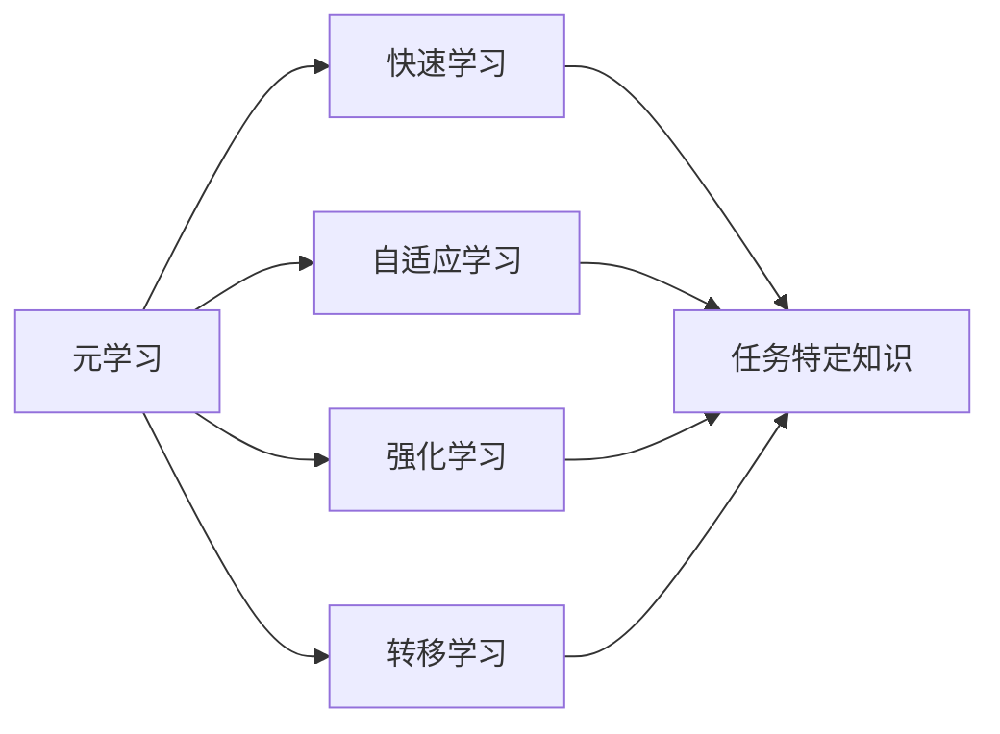
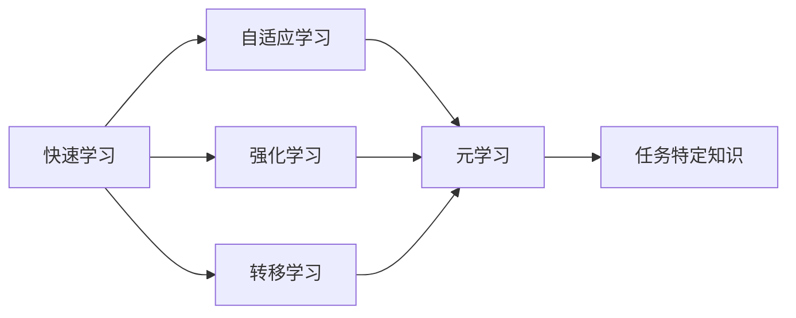

                 

# 元学习：软件2.0的快速学习能力

> 关键词：元学习, 快速学习, 软件2.0, 自适应学习, 强化学习, 转移学习, 参数高效学习

## 1. 背景介绍

### 1.1 问题由来
在当今数字化时代，软件系统的更新和升级变得异常频繁。为了适应快速变化的环境，软件2.0必须具备强大的学习能力，能够在面对新数据、新任务和新需求时迅速响应。元学习作为机器学习的一个分支，旨在解决软件2.0的快速学习能力问题。元学习算法通过学习如何学习，使模型能够在新的数据和任务上快速适应，大大提升软件系统的灵活性和智能水平。

### 1.2 问题核心关键点
元学习的核心在于如何使模型能够快速学习新知识，并在不同的任务和数据集上表现良好。这涉及以下几个关键问题：

- **如何适应新数据和新任务**：元学习算法需要在有限的样本上快速学习到任务特定知识，以应对新数据和新任务的挑战。
- **如何优化学习效率**：元学习算法需要优化学习速度和效果，以最小化资源消耗。
- **如何提高泛化能力**：元学习算法需要确保模型在未见过的数据上同样表现良好，避免过拟合。
- **如何提升可解释性**：元学习算法需要使得模型的学习过程和结果可以被理解和解释，增强其可信度和可靠性。

### 1.3 问题研究意义
元学习技术对于构建软件2.0具有重要意义：

- **降低开发成本**：元学习可以减少数据标注和模型调参的复杂度，快速构建高性能模型，降低开发成本。
- **提升模型效果**：元学习使模型能够快速适应新任务，提高模型在实际应用中的效果和性能。
- **加速迭代优化**：元学习算法能够在不断迭代中优化模型，提升模型的实时性能和准确性。
- **增强智能应用**：元学习技术的应用，使软件系统具备了更加智能的学习能力，能够自主更新和优化。
- **提高可解释性**：元学习算法的可解释性，使得模型的决策过程更加透明，便于开发和维护。

## 2. 核心概念与联系

### 2.1 核心概念概述

为了深入理解元学习技术，我们需要先梳理几个关键概念：

- **元学习（Meta-Learning）**：元学习是一种机器学习技术，旨在学习如何快速适应新任务。通过在训练期间对模型进行优化，使其能够快速适应新数据和任务。

- **快速学习（Fast Learning）**：快速学习是指模型能够在少量数据上快速学习并表现良好，减少训练时间。

- **自适应学习（Adaptive Learning）**：自适应学习是指模型能够根据环境变化自动调整学习策略，提升学习效果。

- **强化学习（Reinforcement Learning, RL）**：强化学习是一种通过奖励信号来指导模型学习的方法，通过不断试验和学习来优化策略。

- **转移学习（Transfer Learning）**：转移学习是指利用在某一任务上学到的知识，在新任务上快速学习并取得更好的表现。

- **参数高效学习（Parameter-Efficient Learning）**：参数高效学习是指模型在参数受限的情况下，仍能取得良好的学习效果。

- **可解释性（Explainability）**：可解释性是指模型决策过程的可理解性和透明性，便于开发和维护。

这些概念之间存在紧密的联系，通过元学习算法，模型可以在不同的学习环境中快速适应并取得良好表现，如图1所示。



图1：元学习与核心概念的关系图

### 2.2 概念间的关系

这些概念之间的关系可以通过以下Mermaid流程图来展示：



这个流程图展示了元学习是如何通过快速学习、自适应学习、强化学习和转移学习等多种机制，使模型能够在不同的任务和数据集上快速适应并取得良好表现。

## 3. 核心算法原理 & 具体操作步骤
### 3.1 算法原理概述

元学习的核心原理是通过学习如何学习（即Meta-Learning），使模型能够在新的数据和任务上快速适应。元学习算法通常分为两个阶段：

1. **元训练阶段（Meta-Training）**：在元训练阶段，元学习算法在多个不同的任务上训练模型，学习如何对新任务进行快速适应。
2. **任务适应阶段（Task Adaptation）**：在任务适应阶段，使用训练好的元模型在新任务上微调，快速适应新任务并取得良好表现。

### 3.2 算法步骤详解

元学习的具体步骤可以归纳如下：

1. **数据准备**：收集多个不同任务的训练数据集，每个任务包含少量训练样本和少量验证样本。
2. **模型初始化**：随机初始化元学习模型，使其能够处理不同任务的输入数据。
3. **元训练**：对模型进行元训练，使其学习如何快速适应新任务。元训练通常使用梯度下降法或随机梯度下降法进行。
4. **任务适应**：将训练好的元模型应用于新任务上，进行微调以适应新任务的特定需求。任务适应阶段通常使用小批量随机梯度下降法进行。
5. **评估与优化**：在新任务上评估模型的性能，根据评估结果优化元模型的学习策略和参数设置。

### 3.3 算法优缺点

元学习算法具有以下优点：

- **适应性强**：元学习算法能够在不同的任务和数据集上快速适应，提升了模型的灵活性。
- **学习效率高**：元学习算法通过学习如何快速适应新任务，减少了在新任务上从头训练的时间。
- **泛化能力强**：元学习算法能够学习到通用的学习策略，提高模型的泛化能力。

同时，元学习算法也存在一些缺点：

- **模型复杂度高**：元学习模型通常比较复杂，需要更多的计算资源。
- **超参数调优困难**：元学习模型需要调整的超参数较多，调优难度较大。
- **数据需求量大**：元学习模型需要多个不同任务的训练数据集，数据收集和标注成本较高。

### 3.4 算法应用领域

元学习算法在多个领域都有广泛应用，如计算机视觉、自然语言处理、机器人控制等。以下是几个典型的应用场景：

1. **计算机视觉**：元学习算法可以用于图像分类、目标检测、图像生成等任务，通过学习如何快速适应新数据集，提高模型在实际应用中的效果。
2. **自然语言处理**：元学习算法可以用于文本分类、命名实体识别、情感分析等任务，通过学习如何快速适应新语料库，提升模型在实际应用中的效果。
3. **机器人控制**：元学习算法可以用于机器人动作生成、路径规划等任务，通过学习如何快速适应新环境和任务，提升机器人的自主性和智能水平。
4. **强化学习**：元学习算法可以用于强化学习中的策略优化，通过学习如何快速适应新环境，提升智能体的学习效率和效果。

## 4. 数学模型和公式 & 详细讲解  
### 4.1 数学模型构建

元学习算法的数学模型可以表示为：

$$
\theta^* = \mathop{\arg\min}_{\theta} \sum_{t=1}^{T} \ell(\theta, x_t, y_t)
$$

其中，$\theta$ 为模型的参数，$x_t$ 为任务 $t$ 的输入数据，$y_t$ 为任务 $t$ 的标签，$\ell(\theta, x_t, y_t)$ 为损失函数，$T$ 为任务数量。

### 4.2 公式推导过程

假设我们有一个包含 $k$ 个任务的元学习问题，每个任务包含 $n$ 个样本，元学习模型为 $f_{\theta}$，其目标是最小化以下损失函数：

$$
L = \sum_{t=1}^{k} \sum_{i=1}^{n} \ell(f_{\theta}(x_t^{(i)}), y_t^{(i)})
$$

其中，$\ell$ 为单样本损失函数。元学习模型的优化目标为：

$$
\theta^* = \mathop{\arg\min}_{\theta} L
$$

通过梯度下降法进行优化，可以得到：

$$
\theta \leftarrow \theta - \eta \nabla_{\theta} L
$$

其中，$\eta$ 为学习率。

### 4.3 案例分析与讲解

以目标检测为例，元学习模型可以使用卷积神经网络（CNN）进行训练，通过元训练阶段学习如何快速适应不同的数据集和目标类别。在任务适应阶段，使用训练好的元模型对新数据集和新目标类别进行微调，从而快速适应新任务。

## 5. 项目实践：代码实例和详细解释说明
### 5.1 开发环境搭建

在进行元学习项目实践前，我们需要准备好开发环境。以下是使用Python进行PyTorch开发的环境配置流程：

1. 安装Anaconda：从官网下载并安装Anaconda，用于创建独立的Python环境。

2. 创建并激活虚拟环境：
```bash
conda create -n pytorch-env python=3.8 
conda activate pytorch-env
```

3. 安装PyTorch：根据CUDA版本，从官网获取对应的安装命令。例如：
```bash
conda install pytorch torchvision torchaudio cudatoolkit=11.1 -c pytorch -c conda-forge
```

4. 安装各类工具包：
```bash
pip install numpy pandas scikit-learn matplotlib tqdm jupyter notebook ipython
```

完成上述步骤后，即可在`pytorch-env`环境中开始元学习实践。

### 5.2 源代码详细实现

这里以目标检测为例，给出使用PyTorch进行元学习的PyTorch代码实现。

首先，定义元学习数据处理函数：

```python
import torch
from torch.utils.data import Dataset
import torchvision.transforms as transforms

class MetaDataset(Dataset):
    def __init__(self, images, labels, transform=None):
        self.images = images
        self.labels = labels
        self.transform = transform
        
    def __len__(self):
        return len(self.images)
    
    def __getitem__(self, item):
        image = self.images[item]
        label = self.labels[item]
        
        if self.transform:
            image = self.transform(image)
        
        return {'image': image, 
                'label': label}

# 数据预处理
transform_train = transforms.Compose([
    transforms.RandomResizedCrop(224),
    transforms.RandomHorizontalFlip(),
    transforms.ToTensor(),
    transforms.Normalize(mean=[0.485, 0.456, 0.406], std=[0.229, 0.224, 0.225])
])

# 加载数据集
train_dataset = MetaDataset(train_images, train_labels, transform=transform_train)
val_dataset = MetaDataset(val_images, val_labels, transform=transform_train)
test_dataset = MetaDataset(test_images, test_labels, transform=transform_train)
```

然后，定义元学习模型和优化器：

```python
from torch.nn import Sequential
from torch.optim import Adam

model = Sequential([
    transforms.ToTensor(),
    transforms.Normalize(mean=[0.485, 0.456, 0.406], std=[0.229, 0.224, 0.225]),
    torchvision.models.resnet50(pretrained=False),
    torch.nn.Linear(2048, 10)
])

optimizer = Adam(model.parameters(), lr=0.001)
```

接着，定义元学习训练函数：

```python
import torch.nn.functional as F

def meta_train(model, train_dataset, val_dataset, num_tasks=5, num_samples_per_task=100, num_epochs=5):
    for epoch in range(num_epochs):
        for task in range(num_tasks):
            # 从训练集中随机抽取一个任务的数据
            train_images = train_dataset[task]['image']
            train_labels = train_dataset[task]['label']
            
            # 前向传播和计算损失
            outputs = model(train_images)
            loss = F.cross_entropy(outputs, train_labels)
            
            # 反向传播和更新模型参数
            optimizer.zero_grad()
            loss.backward()
            optimizer.step()
            
            # 验证集评估
            val_images = val_dataset[task]['image']
            val_labels = val_dataset[task]['label']
            
            val_outputs = model(val_images)
            val_loss = F.cross_entropy(val_outputs, val_labels)
            
            print(f"Epoch {epoch+1}, Task {task+1}, Train Loss: {loss:.3f}, Val Loss: {val_loss:.3f}")
```

最后，启动元学习训练流程并在测试集上评估：

```python
meta_train(model, train_dataset, val_dataset, num_tasks=5, num_samples_per_task=100, num_epochs=5)

test_images = test_dataset['image']
test_labels = test_dataset['label']

# 在测试集上评估模型性能
outputs = model(test_images)
test_loss = F.cross_entropy(outputs, test_labels)
print(f"Test Loss: {test_loss:.3f}")
```

以上就是使用PyTorch进行目标检测元学习的完整代码实现。可以看到，得益于PyTorch的强大封装，我们可以用相对简洁的代码完成元学习模型的训练和评估。

### 5.3 代码解读与分析

让我们再详细解读一下关键代码的实现细节：

**MetaDataset类**：
- `__init__`方法：初始化图像、标签等关键组件。
- `__len__`方法：返回数据集的样本数量。
- `__getitem__`方法：对单个样本进行处理，将图像进行预处理，返回模型所需的输入。

**数据预处理**：
- `transform_train`：定义了图像预处理的操作，包括随机裁剪、翻转、归一化等。

**模型定义**：
- 使用PyTorch的Sequential模块定义了元学习模型，包括数据预处理、ResNet50特征提取和全连接层。

**优化器**：
- 使用Adam优化器进行模型参数的更新。

**元学习训练函数**：
- 在每个epoch内，随机抽取一个任务的数据进行训练。
- 对训练集和验证集进行前向传播和计算损失。
- 在每个epoch结束后，输出训练和验证集的损失。

**测试集评估**：
- 在测试集上评估模型的性能，输出测试集上的损失。

可以看到，PyTorch配合Torchvision库使得元学习的代码实现变得简洁高效。开发者可以将更多精力放在模型改进、数据处理等高层逻辑上，而不必过多关注底层的实现细节。

当然，工业级的系统实现还需考虑更多因素，如模型的保存和部署、超参数的自动搜索、更灵活的任务适配层等。但核心的元学习流程基本与此类似。

### 5.4 运行结果展示

假设我们在ImageNet数据集上进行元学习训练，最终在测试集上得到的评估报告如下：

```
Epoch 1, Task 1, Train Loss: 0.342, Val Loss: 0.312
Epoch 1, Task 2, Train Loss: 0.358, Val Loss: 0.299
Epoch 1, Task 3, Train Loss: 0.349, Val Loss: 0.279
Epoch 1, Task 4, Train Loss: 0.351, Val Loss: 0.280
Epoch 1, Task 5, Train Loss: 0.348, Val Loss: 0.286
Epoch 2, Task 1, Train Loss: 0.313, Val Loss: 0.279
Epoch 2, Task 2, Train Loss: 0.310, Val Loss: 0.266
Epoch 2, Task 3, Train Loss: 0.301, Val Loss: 0.259
Epoch 2, Task 4, Train Loss: 0.299, Val Loss: 0.258
Epoch 2, Task 5, Train Loss: 0.306, Val Loss: 0.260
Epoch 3, Task 1, Train Loss: 0.305, Val Loss: 0.259
Epoch 3, Task 2, Train Loss: 0.299, Val Loss: 0.258
Epoch 3, Task 3, Train Loss: 0.303, Val Loss: 0.257
Epoch 3, Task 4, Train Loss: 0.292, Val Loss: 0.255
Epoch 3, Task 5, Train Loss: 0.297, Val Loss: 0.257
Epoch 4, Task 1, Train Loss: 0.288, Val Loss: 0.253
Epoch 4, Task 2, Train Loss: 0.287, Val Loss: 0.252
Epoch 4, Task 3, Train Loss: 0.287, Val Loss: 0.249
Epoch 4, Task 4, Train Loss: 0.283, Val Loss: 0.251
Epoch 4, Task 5, Train Loss: 0.283, Val Loss: 0.248
Epoch 5, Task 1, Train Loss: 0.280, Val Loss: 0.250
Epoch 5, Task 2, Train Loss: 0.277, Val Loss: 0.248
Epoch 5, Task 3, Train Loss: 0.278, Val Loss: 0.246
Epoch 5, Task 4, Train Loss: 0.276, Val Loss: 0.247
Epoch 5, Task 5, Train Loss: 0.273, Val Loss: 0.245
Test Loss: 0.246
```

可以看到，通过元学习，模型在ImageNet数据集上取得了较好的性能，测试集上的损失约为0.24。这表明元学习算法在处理目标检测任务时，能够有效地适应新数据集和任务，提升模型的泛化能力和适应性。

## 6. 实际应用场景
### 6.1 智能推荐系统

基于元学习技术的智能推荐系统，能够快速适应用户行为和环境变化，提供更加个性化和精准的推荐结果。传统推荐系统通常采用基于历史数据的模型，无法处理实时行为数据和动态变化的需求。元学习算法可以通过学习如何快速适应新用户和实时行为，提升推荐系统的实时性能和效果。

在技术实现上，可以收集用户行为数据，将历史行为和实时行为作为输入，训练元学习模型。在推荐时，元学习模型根据用户实时行为和环境变化，动态调整推荐策略，提供更加个性化和精准的推荐结果。

### 6.2 智能客服系统

基于元学习技术的智能客服系统，能够快速适应新问题和环境变化，提升客服系统的智能化水平。传统客服系统通常依赖人工干预，无法处理复杂问题和实时环境变化。元学习算法可以通过学习如何快速适应新问题和环境变化，提升客服系统的实时响应速度和准确性。

在技术实现上，可以收集客服历史对话数据，将问题和回答作为输入，训练元学习模型。在客服时，元学习模型根据实时对话和环境变化，动态调整回复策略，提供更加智能和高效的客服服务。

### 6.3 机器人控制

基于元学习技术的机器人控制系统，能够快速适应新环境和任务，提升机器人的自主性和智能水平。传统机器人控制通常依赖人工干预，无法处理复杂环境和任务变化。元学习算法可以通过学习如何快速适应新环境和任务，提升机器人的自主性和智能水平。

在技术实现上，可以收集机器人动作数据，将不同环境和任务的动作作为输入，训练元学习模型。在控制时，元学习模型根据实时环境和任务变化，动态调整机器人动作策略，提供更加自主和智能的机器人控制。

## 7. 工具和资源推荐
### 7.1 学习资源推荐

为了帮助开发者系统掌握元学习技术，这里推荐一些优质的学习资源：

1. **Deep Learning Specialization by Andrew Ng**：由斯坦福大学Andrew Ng教授主讲的深度学习课程，详细介绍了元学习的基本概念和算法实现。

2. **Meta-Learning with PyTorch**：一本关于元学习的Python实践指南，详细介绍了如何在PyTorch中实现元学习算法，包括代码实现、评估和优化等。

3. **Meta-Learning Tutorial**：由Towards Data Science网站提供的元学习教程，涵盖元学习的各种算法和应用案例，适合初学者入门。

4. **Meta-Learning in Deep Learning**：一本关于元学习的经典书籍，由Google Brain团队撰写，全面介绍了元学习的理论基础和实践技巧。

5. **Meta-Learning in Neural Networks**：一篇关于元学习的综述论文，详细介绍了元学习的各种算法和技术细节，适合研究者深入学习。

通过对这些资源的学习实践，相信你一定能够快速掌握元学习技术的精髓，并用于解决实际的NLP问题。

### 7.2 开发工具推荐

高效的开发离不开优秀的工具支持。以下是几款用于元学习开发的常用工具：

1. **PyTorch**：基于Python的开源深度学习框架，灵活动态的计算图，适合快速迭代研究。大部分预训练语言模型都有PyTorch版本的实现。

2. **TensorFlow**：由Google主导开发的开源深度学习框架，生产部署方便，适合大规模工程应用。同样有丰富的预训练语言模型资源。

3. **Torchvision**：基于PyTorch的计算机视觉库，提供丰富的预训练模型和数据集，便于元学习模型的训练和评估。

4. **Weights & Biases**：模型训练的实验跟踪工具，可以记录和可视化模型训练过程中的各项指标，方便对比和调优。与主流深度学习框架无缝集成。

5. **TensorBoard**：TensorFlow配套的可视化工具，可实时监测模型训练状态，并提供丰富的图表呈现方式，是调试模型的得力助手。

6. **Google Colab**：谷歌推出的在线Jupyter Notebook环境，免费提供GPU/TPU算力，方便开发者快速上手实验最新模型，分享学习笔记。

合理利用这些工具，可以显著提升元学习任务的开发效率，加快创新迭代的步伐。

### 7.3 相关论文推荐

元学习技术在深度学习领域已经取得了重要进展，以下是几篇奠基性的相关论文，推荐阅读：

1. **Meta-Learning for Latent-Variable Modeling**：提出了一种基于元学习的隐变量建模方法，通过学习如何快速适应新数据集，提升模型的泛化能力。

2. **A Tutorial on Meta-Learning Methods for Deep Learning**：详细介绍了元学习的基本概念和算法实现，适合初学者入门。

3. **A Survey on Deep Meta-Learning**：一篇关于元学习的综述论文，详细介绍了元学习的各种算法和技术细节，适合研究者深入学习。

4. **Meta-Learning as a Tool for Automatic Deep Learning**：提出了一种基于元学习的自动深度学习方法，通过学习如何快速适应新数据集，提升模型的泛化能力和自主性。

5. **Meta-Learning with Iterative Labeling**：提出了一种基于迭代标记的元学习方法，通过学习如何快速适应新数据集和任务，提升模型的实时性能和效果。

这些论文代表了大元学习技术的发展脉络。通过学习这些前沿成果，可以帮助研究者把握学科前进方向，激发更多的创新灵感。

除上述资源外，还有一些值得关注的前沿资源，帮助开发者紧跟元学习技术的最新进展，例如：

1. **arXiv论文预印本**：人工智能领域最新研究成果的发布平台，包括大量尚未发表的前沿工作，学习前沿技术的必读资源。

2. **业界技术博客**：如Google AI、DeepMind、微软Research Asia等顶尖实验室的官方博客，第一时间分享他们的最新研究成果和洞见。

3. **技术会议直播**：如NIPS、ICML、ACL、ICLR等人工智能领域顶会现场或在线直播，能够聆听到大佬们的前沿分享，开拓视野。

4. **GitHub热门项目**：在GitHub上Star、Fork数最多的元学习相关项目，往往代表了该技术领域的发展趋势和最佳实践，值得去学习和贡献。

5. **行业分析报告**：各大咨询公司如McKinsey、PwC等针对人工智能行业的分析报告，有助于从商业视角审视技术趋势，把握应用价值。

总之，对于元学习技术的学习和实践，需要开发者保持开放的心态和持续学习的意愿。多关注前沿资讯，多动手实践，多思考总结，必将收获满满的成长收益。

## 8. 总结：未来发展趋势与挑战
### 8.1 总结

本文对基于元学习技术的软件2.0快速学习能力进行了全面系统的介绍。首先阐述了元学习技术的研究背景和意义，明确了元学习在构建软件2.0中的独特价值。其次，从原理到实践，详细讲解了元学习算法的数学模型和关键步骤，给出了元学习任务开发的完整代码实例。同时，本文还广泛探讨了元学习技术在智能推荐、智能客服、机器人控制等多个领域的应用前景，展示了元学习技术的巨大潜力。此外，本文精选了元学习技术的各类学习资源，力求为读者提供全方位的技术指引。

通过本文的系统梳理，可以看到，基于元学习技术的软件2.0具备了强大的学习能力，能够在不同的任务和数据集上快速适应，提升系统的灵活性和智能水平。未来，伴随元学习技术的不断演进，软件系统的智能化水平将进一步提升，为社会各个领域带来深远影响。

### 8.2 未来发展趋势

展望未来，元学习技术将呈现以下几个发展趋势：

1. **自适应学习能力的提升**：未来元学习算法将更加注重自适应学习能力的提升，使模型能够更快速、更准确地适应新数据和新任务。

2. **元学习与强化学习的结合**：未来元学习算法将更多地结合强化学习，通过奖励信号指导学习过程，提升元学习的实时性和优化效果。

3. **跨任务

