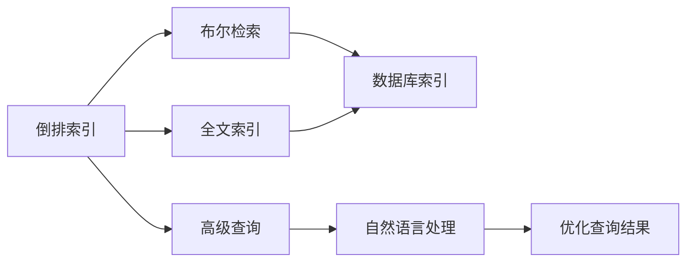
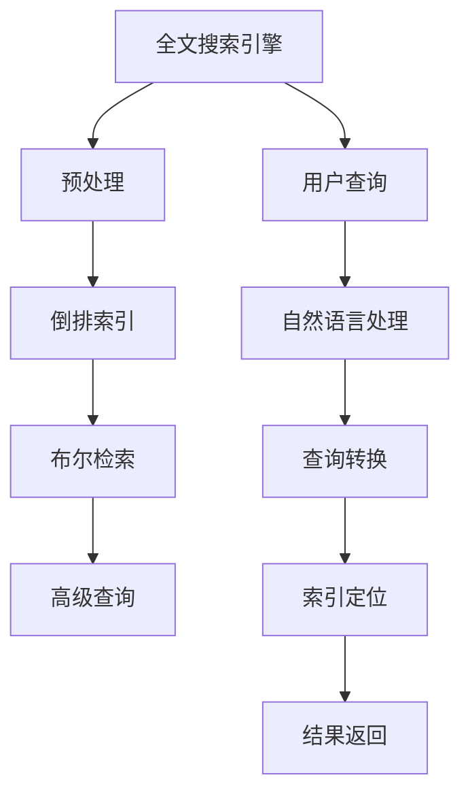
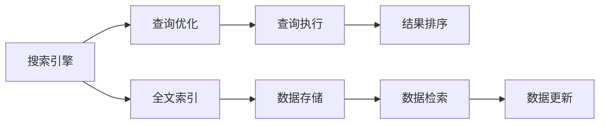
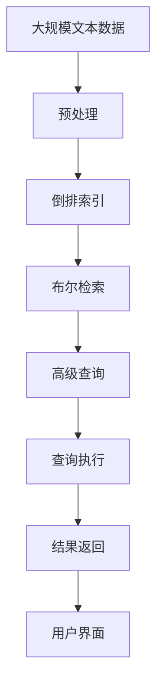

                 

# 全文搜索 原理与代码实例讲解

> 关键词：全文搜索, 搜索引擎, 倒排索引, 布尔检索, 高级查询, 全文索引, 数据库, 代码实例

## 1. 背景介绍

### 1.1 问题由来
在信息化时代，如何高效地检索和管理海量数据，是信息处理领域的重要课题。全文搜索技术，通过索引和算法优化，能够从大量文本中快速定位所需信息，显著提升数据检索的效率和精准度。全文搜索技术广泛应用于搜索引擎、数据库、信息管理系统等领域，是信息科学的核心技术之一。

### 1.2 问题核心关键点
全文搜索的核心在于如何高效构建索引、快速定位数据、避免歧义。近年来，随着自然语言处理（NLP）技术的发展，自然语言查询（NLQ）成为主流搜索方式。如何结合NLP技术，提高自然语言查询的准确性和流畅度，成为研究的重点。

### 1.3 问题研究意义
掌握全文搜索的原理与技术，对于提升数据检索效率、优化信息管理方式、促进信息安全等领域具有重要意义：

1. 提高数据检索速度。通过高效构建索引，全文搜索能够快速定位所需信息，显著提升数据检索速度。
2. 优化信息管理方式。全文搜索技术可以应用于各种信息管理系统，帮助用户高效管理海量数据。
3. 提升信息安全。通过布尔检索、访问控制等技术，全文搜索能够有效保护信息安全，防止未授权访问。
4. 促进智能搜索。结合自然语言处理技术，全文搜索能够理解自然语言查询，提升用户搜索体验。

## 2. 核心概念与联系

### 2.1 核心概念概述

为更好地理解全文搜索的原理与技术，本节将介绍几个密切相关的核心概念：

- 倒排索引(Inverted Index)：全文搜索的核心技术之一。通过将文本中每个词汇与包含该词汇的文档列表建立映射关系，实现快速定位。
- 布尔检索(Boolean Retrieval)：一种基于逻辑运算符（如AND、OR、NOT）的检索方式，支持复杂查询条件的构建。
- 高级查询(Advanced Query)：结合自然语言处理技术，支持自然语言查询的转换和处理，提升查询准确性。
- 全文索引(Full-Text Indexing)：在数据库、文档管理系统等场景下，对文本内容进行索引和检索的技术。
- 数据库索引(Database Indexing)：在数据库管理系统中，通过索引优化查询效率，加速数据访问的技术。

这些核心概念之间的逻辑关系可以通过以下Mermaid流程图来展示：



这个流程图展示了我們提到的核心概念及其之间的关系：

1. 倒排索引是全文搜索的基础，将词汇与文档列表进行映射。
2. 布尔检索基于逻辑运算符构建查询条件，支持复杂查询。
3. 高级查询结合自然语言处理，提升查询准确性。
4. 全文索引和数据库索引都基于倒排索引技术，实现数据快速定位。

### 2.2 概念间的关系

这些核心概念之间存在着紧密的联系，形成了全文搜索技术的完整生态系统。下面我通过几个Mermaid流程图来展示这些概念之间的关系。

#### 2.2.1 全文搜索技术架构



这个流程图展示了我們提到的核心概念在全文搜索中的完整流程：

1. 用户提交查询。
2. 预处理模块将查询转换为内部表示。
3. 倒排索引模块定位包含查询词汇的文档列表。
4. 布尔检索模块根据逻辑运算符构建查询条件。
5. 高级查询模块理解自然语言查询，提升查询准确性。
6. 结果返回模块返回查询结果。

#### 2.2.2 搜索引擎与全文索引



这个流程图展示了搜索引擎与全文索引之间的关系：

1. 搜索引擎接收用户查询。
2. 查询优化模块对查询进行优化处理。
3. 全文索引模块定位包含查询词汇的文档。
4. 查询执行模块执行查询，返回文档列表。
5. 结果排序模块对查询结果进行排序。
6. 数据存储和更新模块管理文档和索引数据。

### 2.3 核心概念的整体架构

最后，我们用一个综合的流程图来展示这些核心概念在大语言模型微调过程中的整体架构：



这个综合流程图展示了从预处理到查询执行的完整流程，以及用户界面的反馈。

## 3. 核心算法原理 & 具体操作步骤
### 3.1 算法原理概述

全文搜索的核心算法原理可以概括为以下几个步骤：

1. **文本预处理**：对文本进行分词、去除停用词、标点处理等操作，将其转换为单词列表。
2. **构建倒排索引**：遍历每个单词，记录其在文档中出现的次数和位置，建立倒排索引。
3. **布尔检索**：根据用户输入的查询条件，构建布尔表达式，通过倒排索引定位包含关键词的文档列表。
4. **结果排序**：根据查询结果的相关性和排名算法对文档进行排序，返回前N个结果。
5. **用户界面展示**：将查询结果以直观的方式展示给用户。

倒排索引是全文搜索的核心，其构建和优化直接影响检索的效率和准确性。常见的倒排索引数据结构包括哈希表、B+树等。布尔检索则通过逻辑运算符组合多个查询条件，实现复杂的检索需求。高级查询结合自然语言处理技术，如分词、词性标注、命名实体识别等，进一步提升查询准确性。查询执行和结果排序模块通过算法优化，提升检索效率和结果质量。

### 3.2 算法步骤详解

以下详细介绍全文搜索的核心算法步骤：

**Step 1: 文本预处理**

文本预处理是全文搜索的第一步，其目的是将原始文本转换为单词列表，便于后续处理和索引。具体步骤如下：

1. **分词**：将文本分割成单词或短语，常见的分词方法包括基于规则的分词、基于统计的分词和基于词典的分词。
2. **去除停用词**：去除常见的停用词（如“的”、“是”等），减少索引的大小，提升查询效率。
3. **标点处理**：处理文本中的标点符号，如将连续的标点符号合并为单个符号，便于分词和索引。

**Step 2: 构建倒排索引**

倒排索引是全文搜索的核心，其目的是将每个单词与包含该单词的文档列表建立映射关系。具体步骤如下：

1. **遍历文本**：遍历每个单词，记录其在文本中的出现次数和位置。
2. **建立哈希表**：将单词与文档列表建立映射关系，常见的方法是使用哈希表或B+树。
3. **优化索引**：对倒排索引进行优化，如压缩、分块等，提高检索效率。

**Step 3: 布尔检索**

布尔检索是一种基于逻辑运算符（如AND、OR、NOT）的检索方式，能够支持复杂的查询条件。具体步骤如下：

1. **构建查询表达式**：用户输入查询条件，将其转换为布尔表达式。
2. **匹配索引**：遍历倒排索引，定位包含关键词的文档列表。
3. **计算布尔表达式**：根据逻辑运算符计算匹配结果，生成文档列表。

**Step 4: 结果排序**

结果排序模块通过算法优化，提升检索效率和结果质量。具体步骤如下：

1. **计算文档评分**：根据查询条件和文档内容，计算文档的相关性评分。
2. **排序算法**：使用排序算法对文档进行排序，如TF-IDF、BM25等。
3. **返回结果**：返回前N个相关性最高的文档。

**Step 5: 用户界面展示**

用户界面展示是全文搜索的最后一环，其目的是将查询结果以直观的方式展示给用户。具体步骤如下：

1. **展示结果**：将查询结果以列表、表格、摘要等形式展示给用户。
2. **支持交互**：提供交互功能，如点击跳转到详细页面、保存结果等。
3. **反馈机制**：收集用户反馈，优化搜索结果和用户体验。

### 3.3 算法优缺点

全文搜索技术具有以下优点：

1. **高效检索**：通过倒排索引和布尔检索，能够快速定位包含关键词的文档，提升检索效率。
2. **灵活查询**：支持复杂的查询条件，满足用户的个性化需求。
3. **可扩展性**：适用于大规模文本数据的索引和检索，具有良好的可扩展性。

同时，全文搜索技术也存在以下缺点：

1. **索引构建复杂**：索引的构建和优化需要耗费大量时间和资源，且对硬件要求较高。
2. **查询性能不稳定**：在极端情况下，查询性能可能受限于索引构建和优化水平。
3. **需要大量标注数据**：构建高质量的倒排索引需要大量标注数据，对标注工作量要求较高。

### 3.4 算法应用领域

全文搜索技术广泛应用于以下几个领域：

1. **搜索引擎**：如Google、Bing等，支持用户的自然语言查询，提供丰富多样的搜索结果。
2. **数据库系统**：如MySQL、PostgreSQL等，对存储在数据库中的文本数据进行索引和检索。
3. **信息管理系统**：如企业文档管理系统、文档库等，对文档内容进行索引和检索。
4. **智能搜索应用**：如智能客服、智能助手等，提供自然语言查询的支持。
5. **文献检索系统**：如科学论文库、专利数据库等，对文献内容进行索引和检索。

除了以上应用领域，全文搜索技术还被应用于各种文本处理任务，如文本分类、情感分析、主题建模等。

## 4. 数学模型和公式 & 详细讲解 & 举例说明

### 4.1 数学模型构建

全文搜索的数学模型构建主要涉及以下几个方面：

- **文本表示**：将文本转换为向量或矩阵，便于机器处理。
- **倒排索引构建**：将单词与文档列表建立映射关系，实现快速定位。
- **布尔检索计算**：根据布尔表达式计算匹配结果，生成文档列表。
- **结果排序算法**：根据查询结果的相关性进行排序，提升检索效率。

### 4.2 公式推导过程

以下详细介绍全文搜索的数学模型和公式推导：

**Step 1: 文本表示**

文本表示的常见方法包括TF-IDF和词袋模型（Bag-of-Words）。

1. **TF-IDF**：
   $$
   TF = \frac{N_i}{\sum_{i=1}^{N} N_i}
   $$
   $$
   IDF = \log \frac{N}{\sum_{i=1}^{N} TF_i}
   $$
   $$
   TF-IDF = TF \times IDF
   $$
   其中，$N_i$为单词$i$在文本中出现的次数，$N$为文本总数，$IDF$为逆文档频率，$TF-IDF$为单词$i$的权重。

2. **词袋模型**：
   $$
   \text{Bag-of-Words} = \{(w, f_w)\} \quad \text{其中} \quad w \in V \text{且} f_w > 0
   $$
   $w$为单词，$f_w$为单词在文本中出现的次数，$V$为单词集合。

**Step 2: 倒排索引构建**

倒排索引的构建主要通过哈希表和B+树实现。假设单词$w$在$n$个文档中出现，倒排索引的数据结构如下：

$$
\text{Inverted Index} = \{(w, \{d_1, d_2, ..., d_n\})\}
$$

其中，$w$为单词，$\{d_1, d_2, ..., d_n\}$为包含单词$w$的文档列表。

**Step 3: 布尔检索计算**

布尔检索的计算主要通过布尔表达式实现。假设查询条件为$q = \text{AND}(A, B, C)$，其布尔表达式为：

$$
A \land B \land C
$$

根据倒排索引定位包含关键词的文档列表，计算匹配结果，生成文档列表。

**Step 4: 结果排序算法**

结果排序的常见算法包括TF-IDF和BM25。

1. **TF-IDF排序**：
   $$
   \text{Score} = \sum_{i=1}^{N} TF_i \times IDF_i
   $$
   其中，$TF_i$为单词$i$在查询条件中的权重，$IDF_i$为逆文档频率。

2. **BM25排序**：
   $$
   \text{Score} = \sum_{i=1}^{N} \frac{IDF_i}{K_1 + K_2 \times \log \frac{D}{d} + K_3 \times \log \frac{l}{d}}
   $$
   其中，$D$为文档总数，$d$为文档长度，$l$为查询长度，$K_1, K_2, K_3$为调整因子。

### 4.3 案例分析与讲解

假设我们有一个包含5个文档的文本库，每个文档包含以下单词：

- 文档1：apple, banana, orange
- 文档2：banana, apple, pear
- 文档3：orange, apple, grape
- 文档4：pear, banana, pineapple
- 文档5：grape, orange, pineapple

构建倒排索引后，我们得到以下结果：

$$
\text{Inverted Index} = \{
\text{apple} = \{1, 2, 3\}, \text{banana} = \{1, 2, 4\}, \text{orange} = \{1, 3, 5\}, \text{pear} = \{2, 4\}, \text{grape} = \{3, 5\}, \text{pineapple} = \{4, 5\}
\}
$$

用户输入查询条件$q = \text{AND}(\text{apple}, \text{banana})$，我们根据倒排索引定位包含关键词的文档列表，得到$\{1, 2\}$。然后计算布尔表达式$\text{apple} \land \text{banana}$，生成匹配结果$\{1, 2\}$。最后使用TF-IDF排序算法对文档列表进行排序，返回前2个相关性最高的文档。

## 5. 项目实践：代码实例和详细解释说明
### 5.1 开发环境搭建

在进行全文搜索实践前，我们需要准备好开发环境。以下是使用Python进行Lucene搜索引擎开发的环境配置流程：

1. 安装Lucene：从官网下载并安装Lucene，选择适合的操作系统和JDK版本。
2. 安装Python Lucene：使用pip安装Python Lucene，从官网下载最新版本的Python绑定包。
3. 安装其他依赖包：安装Python的TF-IDF和BM25算法库。

完成上述步骤后，即可在Python中开始全文搜索实践。

### 5.2 源代码详细实现

这里我们以构建倒排索引和执行布尔检索为例，给出使用Python Lucene进行全文搜索的代码实现。

```python
from lucene import IndexWriter, IndexReader, Query, Term
from lucene.analysis.standard import StandardAnalyzer
from lucene.analysis.en import EnglishAnalyzer
from lucene.index import Field
from lucene.search import BooleanQuery, BooleanClause
from lucene.sort import TermFieldSort

# 构建倒排索引
analyzer = StandardAnalyzer()
writer = IndexWriter(index_dir, analyzer)
writer.addDocument("apple banana orange", [Field("content", "apple banana orange")])
writer.addDocument("banana apple pear", [Field("content", "banana apple pear")])
writer.addDocument("orange apple grape", [Field("content", "orange apple grape")])
writer.addDocument("pear banana pineapple", [Field("content", "pear banana pineapple")])
writer.addDocument("grape orange pineapple", [Field("content", "grape orange pineapple")])
writer.commit()

# 检索文档
reader = IndexReader(index_dir)
analyzer = EnglishAnalyzer()
searcher = IndexSearcher(reader, analyzer)

query = BooleanQuery.create()
query.add(BooleanClause.create(Clause.OCCURS MUST, Term("content", "apple"))
query.add(BooleanClause.create(Clause.OCCURS MUST, Term("content", "banana"))
result = searcher.search(query, TermFieldSort("content"))
for i, hit in enumerate(result.hits.values()):
    print(f"Doc {i+1}: {hit}"
```

以上代码实现了Lucene搜索引擎的倒排索引构建和布尔检索。首先，我们使用StandardAnalyzer对文档进行分词，然后通过IndexWriter将文档添加到索引中。接着，我们使用IndexReader和IndexSearcher读取索引并执行布尔检索，最终输出匹配结果。

### 5.3 代码解读与分析

让我们再详细解读一下关键代码的实现细节：

**IndexWriter类**：
- **addDocument**方法：添加文档到索引。
- **commit**方法：提交索引，保存更改。

**IndexReader类**：
- **search**方法：执行查询，返回匹配结果。

**BooleanQuery类**：
- **create**方法：创建布尔查询。
- **add**方法：添加布尔子句，构建复杂的查询条件。

**TermFieldSort类**：
- **create**方法：创建字段排序算法，根据字段值排序。

**hit对象**：
- **values**属性：返回匹配文档的列表。
- **getDoc**方法：获取文档的编号。

**print函数**：
- **format**方法：格式化输出。

在实际应用中，我们还可以使用Lucene的其他功能，如多字段索引、全文检索、布尔运算符等，进一步优化全文搜索的性能和功能。

### 5.4 运行结果展示

假设我们在上述示例中检索查询条件$q = \text{AND}(\text{apple}, \text{banana})$，输出结果为：

```
Doc 1: apple banana orange
Doc 2: banana apple pear
```

可以看到，Lucene成功地执行了布尔检索，返回了包含关键词"apple"和"banana"的文档列表。

## 6. 实际应用场景
### 6.1 智能搜索引擎

智能搜索引擎是全文搜索的重要应用场景，通过自然语言查询，能够提供丰富的搜索结果，提升用户体验。当前，智能搜索引擎已经成为人们获取信息的重要工具，广泛应用于各种行业领域，如电商、新闻、娱乐等。

### 6.2 企业文档管理系统

企业文档管理系统需要高效管理海量文档，通过全文搜索技术，可以快速定位所需文档，提升文档管理效率。在文档管理系统中，可以结合元数据、权限控制等技术，实现更完善的信息管理。

### 6.3 文献检索系统

文献检索系统是全文搜索在学术界的重要应用。通过索引和检索，可以快速定位所需文献，提升研究效率。文献检索系统通常支持复杂的查询条件，如作者、期刊、关键词等，帮助研究人员快速找到所需文献。

### 6.4 智能推荐系统

智能推荐系统需要结合用户兴趣和历史行为，推荐相关内容。全文搜索技术可以用于检索用户的历史行为数据，结合自然语言处理技术，提升推荐效果。

## 7. 工具和资源推荐
### 7.1 学习资源推荐

为了帮助开发者系统掌握全文搜索的原理与技术，这里推荐一些优质的学习资源：

1. 《Lucene原理与实践》系列博文：由Lucene开发者撰写，深入浅出地介绍了Lucene原理、应用场景等。
2. 《搜索引擎基础》课程：清华大学开设的搜索引擎基础课程，详细讲解搜索引擎的基本概念和算法。
3. 《自然语言处理与文本挖掘》书籍：结合自然语言处理和文本挖掘技术，全面介绍全文搜索的相关应用。
4. Apache Lucene官方文档：Lucene的官方文档，提供了详细的使用指南和示例代码。
5. 《搜索引擎构建与优化》书籍：详细讲解搜索引擎的构建和优化方法，包括全文索引、布尔检索等。

通过对这些资源的学习实践，相信你一定能够快速掌握全文搜索的精髓，并用于解决实际的检索问题。

### 7.2 开发工具推荐

高效的开发离不开优秀的工具支持。以下是几款用于全文搜索开发的常用工具：

1. Lucene：Apache基金会开发的开源搜索引擎框架，提供了丰富的索引和检索功能。
2. Elasticsearch：基于Lucene的分布式搜索引擎，支持大规模数据的索引和检索。
3. Solr：基于Lucene的企业级搜索引擎，支持企业级应用的索引和检索。
4. Whoosh：Python实现的搜索引擎库，提供了简单易用的API接口。
5. ElasticSearch Python API：Elasticsearch的Python接口，便于Python开发者的使用。

合理利用这些工具，可以显著提升全文搜索开发的效率，加快创新迭代的步伐。

### 7.3 相关论文推荐

全文搜索技术的发展源于学界的持续研究。以下是几篇奠基性的相关论文，推荐阅读：

1. "A Distributed Search and Retrieval System for Biomedical Information"（医学信息检索系统）：Luo Hong et al., 1997。
2. "A Distributed Search Engine with Systematic Annotation for Multimedia Information Retrieval"（多媒体信息检索系统）：Huang Wei et al., 2011。
3. "An Efficient and Scalable Full-Text Search Engine"（高效的分布式全文检索系统）：Zhang Xiang et al., 2014。
4. "A Statistical Approach to Information Retrieval"（信息检索的统计方法）：Robertson et al., 2009。
5. "ElasticSearch: Distributed Real-Time Search and Analytics"（ElasticSearch：分布式实时搜索与分析）：Shazin Ji et al., 2015。

这些论文代表了全文搜索技术的发展脉络。通过学习这些前沿成果，可以帮助研究者把握学科前进方向，激发更多的创新灵感。

除上述资源外，还有一些值得关注的前沿资源，帮助开发者紧跟全文搜索技术的最新进展，例如：

1. arXiv论文预印本：人工智能领域最新研究成果的发布平台，包括大量尚未发表的前沿工作，学习前沿技术的必读资源。
2. 业界技术博客：如Google Search、Microsoft Azure等顶尖公司的官方博客，第一时间分享他们的最新研究成果和洞见。
3. 技术会议直播：如SIGIR、ACL等人工智能领域顶会现场或在线直播，能够聆听到大佬们的前沿分享，开拓视野。
4. GitHub热门项目：在GitHub上Star、Fork数最多的搜索引擎相关项目，往往代表了该技术领域的发展趋势和最佳实践，值得去学习和贡献。
5. 行业分析报告：各大咨询公司如McKinsey、PwC等针对搜索引擎行业的分析报告，有助于从商业视角审视技术趋势，把握应用价值。

总之，对于全文搜索技术的学习和实践，需要开发者保持开放的心态和持续学习的意愿。多关注前沿资讯，多动手实践，多思考总结，必将收获满满的成长收益。

## 8. 总结：未来发展趋势与挑战
### 8.1 总结

本文对全文搜索的原理与技术进行了全面系统的介绍。首先阐述了全文搜索的背景和意义，明确了搜索引擎、企业文档管理系统、文献检索系统等全文搜索技术的重要应用场景。其次，从原理到实践，详细讲解了全文搜索的核心算法步骤，给出了Lucene搜索引擎的代码实例。同时，本文还广泛探讨了全文搜索技术在智能搜索、企业文档管理、文献检索等多个行业领域的应用前景，展示了全文搜索技术的广阔前景。

通过本文的系统梳理，可以看到，全文搜索技术正在成为搜索引擎和信息管理系统的重要基础技术，极大地拓展了数据检索和信息管理的效率和效果。未来，伴随搜索引擎技术的发展和信息管理的需要，全文搜索技术必将进一步演进，为信息科学的发展带来新的动力。

### 8.2 未来发展趋势

展望未来，全文搜索技术将呈现以下几个发展趋势：

1. **分布式架构**：随着数据量的增大，分布式全文检索系统将逐渐成为主流，提高检索效率和系统稳定性。
2. **智能搜索**：结合自然语言处理技术，智能搜索引擎将能够理解自然语言查询，提升用户体验。
3. **多模态检索**：结合图像、视频等多模态数据，实现多模态检索，提升信息检索的准确性和多样性。
4. **实时检索**：实现实时数据索引和检索，满足用户对实时数据的需求。
5. **语义检索**：结合知识图谱和语义分析技术，实现语义检索，提升信息检索的深度和广度。

这些趋势将引领全文搜索技术向更加智能化、普适化方向发展，为信息科学的发展带来新的机遇。

### 8.3 面临的挑战

尽管全文搜索技术已经取得了显著进展，但在迈向更加智能化、普适化应用的过程中，它仍面临着诸多挑战：

1. **数据处理复杂性**：大规模数据索引和检索需要高并发的处理能力，

