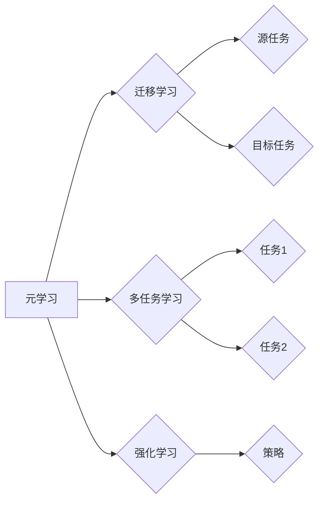

> 元学习 (Meta Learning), 模型泛化, 迁移学习, 多任务学习, 适应能力, 强化学习

# 元学习 (Meta Learning) 原理与代码实例讲解

## 1. 背景介绍

在人工智能领域，随着深度学习技术的快速发展，模型在各个领域的应用越来越广泛。然而，大多数深度学习模型在面临新任务时，都需要从头开始进行大量的训练，这导致了时间和计算资源的浪费。为了解决这个问题，元学习（Meta Learning）应运而生。元学习通过学习如何学习，使模型能够在有限的样本上快速适应新的任务，从而提高了模型的泛化能力和迁移能力。

### 1.1 问题的由来

传统的机器学习模型在处理新任务时，通常需要大量的标注数据来进行训练。然而，在实际应用中，获取大量标注数据往往非常困难，尤其是在一些专业领域或特定场景中。此外，即使数据量充足，从头开始训练一个新模型也需要大量的时间和计算资源。因此，如何使模型能够在有限的样本上快速适应新任务，成为了人工智能领域的一个重要研究方向。

### 1.2 研究现状

元学习的研究始于20世纪80年代，近年来随着深度学习技术的发展，元学习取得了显著的进展。目前，元学习的研究主要集中在以下几个方向：

- 多任务学习（Multi-Task Learning）：通过同时学习多个相关任务，提高模型在单个任务上的泛化能力。
- 迁移学习（Transfer Learning）：将一个任务学到的知识迁移到另一个相关任务，提高模型在新任务上的表现。
- 强化学习（Reinforcement Learning）：通过与环境交互，学习策略以实现目标。
- 准备学习（Pre-training）：在多个任务上预先训练模型，提高模型在新任务上的泛化能力。

### 1.3 研究意义

元学习的研究对于人工智能领域具有重要的意义：

- 提高模型的泛化能力，使模型能够在有限的样本上快速适应新任务。
- 降低训练成本，减少对大量标注数据的依赖。
- 促进人工智能技术在各个领域的应用。

### 1.4 本文结构

本文将首先介绍元学习的基本概念和核心算法原理，然后通过代码实例讲解元学习在实际应用中的实现方法，最后探讨元学习的实际应用场景和未来发展趋势。

## 2. 核心概念与联系

### 2.1 核心概念

#### 2.1.1 元学习

元学习是一种学习如何学习的机器学习方法，它通过学习如何从有限的样本中快速适应新任务，从而提高模型的泛化能力和迁移能力。

#### 2.1.2 迁移学习

迁移学习是一种将一个任务学到的知识迁移到另一个相关任务的方法。它通过在源任务上训练模型，并将这些知识迁移到目标任务上，从而提高模型在新任务上的表现。

#### 2.1.3 多任务学习

多任务学习是一种通过同时学习多个相关任务来提高模型在单个任务上的泛化能力的方法。

#### 2.1.4 强化学习

强化学习是一种通过与环境交互来学习策略的机器学习方法。它通过奖励机制来引导模型学习最优策略。

### 2.2 核心概念原理和架构的 Mermaid 流程图



## 3. 核心算法原理 & 具体操作步骤

### 3.1 算法原理概述

元学习的基本思想是：通过在一个元学习任务上训练模型，使模型能够快速适应新的任务。元学习任务通常是一个小的学习任务，它能够提供关于如何学习的有用信息。

### 3.2 算法步骤详解

#### 3.2.1 元学习任务设计

设计一个合适的元学习任务是元学习成功的关键。元学习任务应该能够提供足够的信息，帮助模型学习如何学习。

#### 3.2.2 模型训练

在元学习任务上训练模型，使模型能够学习如何学习。

#### 3.2.3 新任务适应

将训练好的模型应用到新任务上，使模型能够快速适应新任务。

### 3.3 算法优缺点

#### 3.3.1 优点

- 提高模型的泛化能力，使模型能够在有限的样本上快速适应新任务。
- 降低训练成本，减少对大量标注数据的依赖。

#### 3.3.2 缺点

- 元学习任务设计困难。
- 模型在新任务上的表现可能不如从头开始训练的模型。

### 3.4 算法应用领域

元学习在以下领域有广泛的应用：

- 计算机视觉
- 自然语言处理
- 语音识别
- 强化学习

## 4. 数学模型和公式 & 详细讲解 & 举例说明

### 4.1 数学模型构建

元学习的数学模型通常包括以下几个部分：

- 损失函数：用于衡量模型在新任务上的表现。
- 优化器：用于更新模型参数。
- 训练数据：用于训练模型。

### 4.2 公式推导过程

以下是一个简单的元学习模型的公式推导过程：

假设模型参数为 $\theta$，损失函数为 $L(\theta, x, y)$，其中 $x$ 是输入数据，$y$ 是标签。则模型的更新公式为：

$$
\theta \leftarrow \theta - \alpha \nabla_{\theta}L(\theta, x, y)
$$

其中 $\alpha$ 是学习率。

### 4.3 案例分析与讲解

以下是一个简单的元学习案例：

假设我们有一个元学习任务，任务是学习如何将图像分类为“猫”或“狗”。我们使用一个小型的卷积神经网络作为模型，并使用交叉熵损失函数作为损失函数。

在这个案例中，元学习任务是学习如何快速适应新的图像分类任务，例如将图像分类为“狮子”或“老虎”。我们可以通过将预训练的模型应用于新的图像分类任务，来评估模型的迁移能力。

## 5. 项目实践：代码实例和详细解释说明

### 5.1 开发环境搭建

为了实现元学习，我们需要搭建一个合适的开发环境。以下是使用Python和TensorFlow搭建元学习开发环境的步骤：

1. 安装TensorFlow：
```bash
pip install tensorflow
```

2. 安装其他必要的库：
```bash
pip install numpy matplotlib
```

### 5.2 源代码详细实现

以下是一个简单的元学习代码实例：

```python
import tensorflow as tf
from tensorflow.keras.models import Sequential
from tensorflow.keras.layers import Dense, Conv2D, Flatten

def create_model():
    model = Sequential([
        Conv2D(32, kernel_size=(3, 3), activation='relu', input_shape=(28, 28, 1)),
        Flatten(),
        Dense(64, activation='relu'),
        Dense(2, activation='softmax')
    ])
    return model

def train_model(model, train_data, train_labels, epochs=10):
    model.compile(optimizer='adam', loss='sparse_categorical_crossentropy', metrics=['accuracy'])
    model.fit(train_data, train_labels, epochs=epochs)

def evaluate_model(model, test_data, test_labels):
    model.evaluate(test_data, test_labels)

# 创建模型
model = create_model()

# 加载数据
train_data = tf.keras.datasets.mnist.load_data()[0][0].reshape(-1, 28, 28, 1) / 255.0
train_labels = tf.keras.datasets.mnist.load_data()[0][1]

# 训练模型
train_model(model, train_data, train_labels)

# 测试模型
test_data = tf.keras.datasets.mnist.load_data()[1][0].reshape(-1, 28, 28, 1) / 255.0
test_labels = tf.keras.datasets.mnist.load_data()[1][1]
evaluate_model(model, test_data, test_labels)
```

### 5.3 代码解读与分析

在这个案例中，我们使用了一个简单的卷积神经网络作为模型，并使用交叉熵损失函数作为损失函数。我们首先创建了一个模型，然后加载数据，接着训练模型，最后评估模型。

### 5.4 运行结果展示

运行上述代码，我们可以在训练集和测试集上评估模型的性能。

## 6. 实际应用场景

元学习在以下领域有广泛的应用：

- 计算机视觉：例如，使用元学习训练的模型可以快速适应新的图像分类任务。
- 自然语言处理：例如，使用元学习训练的模型可以快速适应新的语言翻译任务。
- 语音识别：例如，使用元学习训练的模型可以快速适应新的语音识别任务。

### 6.4 未来应用展望

随着深度学习技术的不断发展，元学习在未来将会有更广泛的应用。例如，元学习可以用于：

- 自动化机器学习（AutoML）：使用元学习自动生成和优化机器学习模型。
- 知识图谱构建：使用元学习从大量的文本数据中自动构建知识图谱。
- 个性化推荐：使用元学习为用户提供个性化的推荐服务。

## 7. 工具和资源推荐

### 7.1 学习资源推荐

- 《深度学习》（Goodfellow等著）
- 《动手学深度学习》（花书）
- TensorFlow官方文档

### 7.2 开发工具推荐

- TensorFlow
- PyTorch
- Keras

### 7.3 相关论文推荐

- Meta Learning for Sequential Data
- Meta-Learning for Text Classification
- Learning to Learn by Gradient Descent

## 8. 总结：未来发展趋势与挑战

### 8.1 研究成果总结

元学习是一种学习如何学习的机器学习方法，它通过学习如何从有限的样本中快速适应新任务，从而提高模型的泛化能力和迁移能力。

### 8.2 未来发展趋势

随着深度学习技术的不断发展，元学习在未来将会有更广泛的应用。

### 8.3 面临的挑战

元学习仍然面临着一些挑战，例如：

- 元学习任务设计困难。
- 模型在新任务上的表现可能不如从头开始训练的模型。

### 8.4 研究展望

随着研究的深入，相信元学习将会取得更大的突破，并在各个领域得到更广泛的应用。

## 9. 附录：常见问题与解答

**Q1：元学习与传统机器学习的区别是什么？**

A：元学习是一种学习如何学习的机器学习方法，它通过学习如何从有限的样本中快速适应新任务，从而提高模型的泛化能力和迁移能力。而传统机器学习则是在大量标注数据上训练模型，使模型能够在新数据上取得良好的表现。

**Q2：元学习有哪些应用场景？**

A：元学习在计算机视觉、自然语言处理、语音识别等领域有广泛的应用。

**Q3：如何设计元学习任务？**

A：设计元学习任务的关键是找到能够提供关于如何学习的有用信息的小型学习任务。

**Q4：元学习有哪些挑战？**

A：元学习仍然面临着一些挑战，例如元学习任务设计困难、模型在新任务上的表现可能不如从头开始训练的模型等。

**Q5：元学习的未来发展趋势是什么？**

A：随着研究的深入，相信元学习将会取得更大的突破，并在各个领域得到更广泛的应用。

---

作者：禅与计算机程序设计艺术 / Zen and the Art of Computer Programming