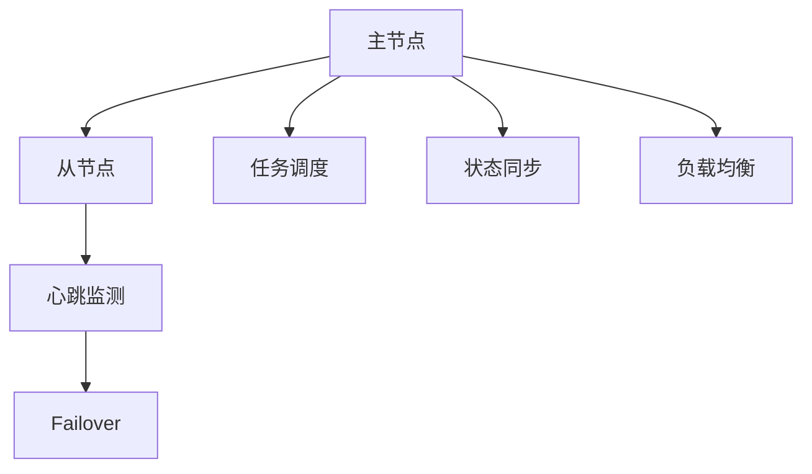
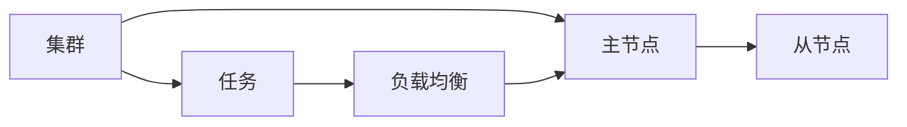
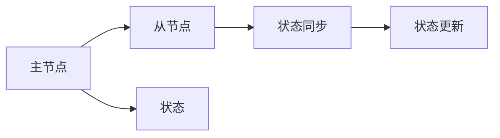
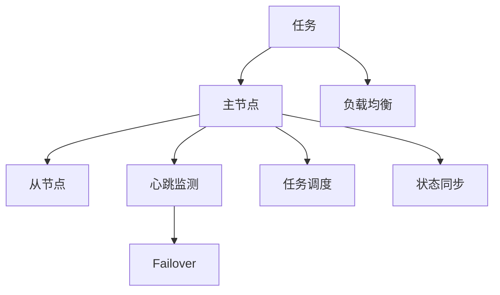

                 

# 单领导集群的实现与维护

> 关键词：单领导集群, 高可用性, 负载均衡, 故障切换, 集群管理, 监控与告警

## 1. 背景介绍

### 1.1 问题由来
在现代软件开发中，分布式系统已成为不可或缺的一部分。随着业务规模的不断扩大，单台服务器的性能瓶颈日益显现。为了提高系统的扩展性和容错能力，企业往往采用集群架构。然而，集群架构的复杂性也带来了诸多挑战，如负载均衡、故障切换、服务一致性等问题。特别地，在单领导集群中，如何保证系统的高可用性，是实现和维护过程中需要重点考虑的问题。

### 1.2 问题核心关键点
单领导集群通常指只有一个主节点负责整个集群的管理和协调，而其余节点为从节点的集群架构。这种架构的优势在于管理简单、易于扩展，但在高可用性、负载均衡和故障切换方面也面临诸多挑战。

主要问题包括：
- 如何保证主节点的可用性，避免单点故障？
- 如何实现负载均衡，最大化集群资源利用率？
- 如何快速切换故障节点，保证系统持续可用？
- 如何实现集群内各节点间的状态同步和一致性？

### 1.3 问题研究意义
单领导集群的高可用性和负载均衡能力，直接决定了集群的整体性能和稳定性。研究单领导集群的实现与维护方法，对于构建高效、可靠的分布式系统，具有重要的理论和实践意义。

1. 通过实现高效的高可用性机制，降低系统故障率，提升业务连续性。
2. 通过优化负载均衡策略，最大化集群资源利用率，降低资源浪费。
3. 通过快速切换故障节点，确保系统连续性，降低故障影响范围。
4. 通过实现集群内各节点间的状态同步和一致性，保证系统逻辑一致性，避免数据不一致问题。

## 2. 核心概念与联系

### 2.1 核心概念概述

为更好地理解单领导集群的实现与维护方法，本节将介绍几个密切相关的核心概念：

- **集群(Cluster)**：一组协同工作、共享资源的计算机节点的集合。集群可以提高系统的可用性、扩展性和性能。
- **主节点(Master Node)**：集群中负责管理和协调的节点，通常称为主节点或领导者。
- **从节点(Slave Node)**：集群中接受主节点管理和协调的节点，通常称为从节点或工作节点。
- **心跳监测(Heartbeat Monitoring)**：监控节点状态，检测异常，及时切换故障节点的机制。
- **负载均衡(Load Balancing)**：根据当前负载情况，分配任务给最合适的节点，提高集群资源利用率。
- **故障切换(Failover)**：在主节点或从节点发生故障时，自动切换节点以保障系统连续性的机制。
- **状态同步(State Synchronization)**：集群内各节点间的状态一致性机制，避免数据不一致问题。

这些核心概念之间的逻辑关系可以通过以下Mermaid流程图来展示：



这个流程图展示了几组关键概念之间的关系：

1. 主节点和从节点之间进行心跳监测和状态同步，保持集群一致性。
2. 主节点负责任务调度和负载均衡，分配任务给最合适的节点。
3. 在发生故障时，通过Failover机制自动切换节点，保证系统连续性。

### 2.2 概念间的关系

这些核心概念之间存在着紧密的联系，形成了单领导集群的高可用性和负载均衡的整体架构。下面我们通过几个Mermaid流程图来展示这些概念之间的关系。

#### 2.2.1 单领导集群架构



这个流程图展示了单领导集群的架构。主节点负责任务的调度和管理，从节点则执行任务。通过负载均衡策略，将任务分配给最合适的节点，最大化资源利用率。

#### 2.2.2 心跳监测与故障切换


这个流程图展示了心跳监测和故障切换的机制。从节点定期向主节点发送心跳信号，检测节点状态。在检测到异常时，通过Failover机制自动切换到正常节点，保证系统持续可用。

#### 2.2.3 状态同步



这个流程图展示了状态同步的过程。主节点负责维护集群状态，并将其同步到从节点。通过状态同步机制，确保集群内各节点间的状态一致性。

### 2.3 核心概念的整体架构

最后，我们用一个综合的流程图来展示这些核心概念在单领导集群实现与维护过程中的整体架构：



这个综合流程图展示了从任务调度到负载均衡、从心跳监测到故障切换、从状态同步到任务调度的完整过程。通过这些关键机制的协同工作，单领导集群可以实现高效、可靠的系统架构。

## 3. 核心算法原理 & 具体操作步骤
### 3.1 算法原理概述

单领导集群的高可用性和负载均衡，依赖于一系列的核心算法原理，包括心跳监测、故障切换、负载均衡和状态同步等。

### 3.2 算法步骤详解

**步骤 1: 配置集群环境**
- 选择适合的集群管理工具，如Zookeeper、Kubernetes等。
- 配置主节点和从节点的硬件资源，如CPU、内存、网络等。
- 安装和配置集群监控工具，如Prometheus、Grafana等。

**步骤 2: 部署主节点**
- 选择性能稳定的服务器，安装主节点所需的依赖软件，如Java、数据库等。
- 部署主节点服务，如Zookeeper、Kubernetes master等。
- 初始化主节点的集群状态，如节点信息、负载信息等。

**步骤 3: 部署从节点**
- 选择性能稳定的服务器，安装从节点所需的依赖软件，如Java、数据库等。
- 部署从节点服务，如Zookeeper、Kubernetes worker等。
- 初始化从节点的集群状态，与主节点保持同步。

**步骤 4: 配置心跳监测**
- 配置主节点和从节点的心跳监测机制，如心跳间隔、心跳响应时间等。
- 设置心跳检测异常处理逻辑，如超过一定时间无响应则标记为异常。
- 在主节点和从节点上部署心跳监测工具，如Eureka、Consul等。

**步骤 5: 配置负载均衡**
- 配置负载均衡策略，如轮询、加权轮询、随机等。
- 根据负载情况，将任务分配给最合适的节点。
- 在主节点上部署负载均衡工具，如Nginx、HAProxy等。

**步骤 6: 配置故障切换**
- 配置主节点的故障切换逻辑，如检测异常后自动重启、自动切换备用节点等。
- 配置从节点的自动注册和注册失败处理逻辑。
- 在主节点和从节点上部署故障切换工具，如Keepalived、VRRP等。

**步骤 7: 配置状态同步**
- 配置主节点和从节点间的状态同步机制，如心跳监测、状态更新等。
- 在主节点上记录集群状态，并同步到从节点。
- 在从节点上定时更新集群状态，保持与主节点同步。

**步骤 8: 监控与告警**
- 部署集群监控工具，如Prometheus、Grafana等。
- 设置监控指标和告警阈值，如CPU使用率、内存使用率、网络流量等。
- 根据监控结果，设置告警机制，及时发现和处理异常情况。

### 3.3 算法优缺点

**优点：**
- 管理简单，集群结构清晰，易于扩展。
- 资源利用率高，通过负载均衡策略，最大化集群资源利用率。
- 故障切换机制高效，保证系统持续可用。

**缺点：**
- 单点故障风险，主节点的异常会影响整个集群。
- 状态同步复杂，需要保证集群内各节点间的状态一致性。

### 3.4 算法应用领域

单领导集群的高可用性和负载均衡能力，使其在多种应用场景中得到了广泛的应用，例如：

- 企业内部的核心业务系统，如ERP、CRM等。
- 互联网公司的用户数据中心，如缓存、存储、搜索等。
- 金融行业的数据处理和交易系统，如高频交易、风控系统等。
- 工业互联网的智能制造平台，如设备监控、远程运维等。

## 4. 数学模型和公式 & 详细讲解
### 4.1 数学模型构建

在本节中，我们将使用数学语言对单领导集群的实现与维护方法进行更加严格的刻画。

记集群中主节点为 $M$，从节点为 $S=\{S_1, S_2, ..., S_n\}$，其中 $n$ 为从节点数量。集群的任务调度过程可以抽象为一个图，主节点为起点，从节点为终点，任务为边。设集群的任务总数为 $T$，每个任务的处理时间为 $t_i$。

定义主节点的负载为 $L$，从节点的负载为 $l_i$，集群的总负载为 $L + l_1 + l_2 + ... + l_n$。集群的任务调度过程可以用以下的数学模型来描述：

- 定义主节点的任务调度函数为 $f_M$，从节点的任务调度函数为 $f_{S_i}$。
- 定义集群的任务调度函数为 $f_C$。
- 定义任务调度的优化目标为最小化集群总负载，即 $minimize(L + \sum_{i=1}^n l_i)$。

### 4.2 公式推导过程

以下我们以任务调度和负载均衡为例，推导具体的数学模型及其优化算法。

假设每个任务的处理时间 $t_i$ 为常数，且所有任务的负载分布均匀。则任务调度的优化目标可以简化为：

$$
minimize \sum_{i=1}^n \sum_{j=1}^T \frac{t_i}{l_i + \sum_{k=1}^n l_k}
$$

其中，$\frac{t_i}{l_i + \sum_{k=1}^n l_k}$ 表示任务 $i$ 在节点 $j$ 上的处理效率，$n$ 为节点数，$T$ 为任务数。

根据优化目标，可以将其转化为拉格朗日乘子法的问题：

$$
\min_{\{l_i\}} \sum_{i=1}^n \sum_{j=1}^T \frac{t_i}{l_i + \sum_{k=1}^n l_k} + \lambda (L + \sum_{i=1}^n l_i - T)
$$

其中，$\lambda$ 为拉格朗日乘子，$L$ 为主节点的负载。

根据拉格朗日乘子法，可以通过求偏导数来找到最优解：

$$
\frac{\partial \mathcal{L}}{\partial l_i} = -\frac{t_i}{(l_i + \sum_{k=1}^n l_k)^2} + \lambda = 0
$$

解得：

$$
l_i = \frac{t_i \lambda}{\lambda + t_i}
$$

代入总负载 $L + \sum_{i=1}^n l_i = T$，可得：

$$
L = T - \sum_{i=1}^n \frac{t_i \lambda}{\lambda + t_i}
$$

进一步求解 $\lambda$，可得：

$$
\lambda = \frac{L}{\sum_{i=1}^n \frac{t_i}{\lambda + t_i}}
$$

因此，主节点和从节点的任务调度函数可以表示为：

$$
f_M = \sum_{i=1}^n \frac{t_i}{\lambda + t_i}
$$

$$
f_{S_i} = \frac{t_i}{l_i + \sum_{k=1}^n l_k}
$$

在实际应用中，可以采用分布式调度算法（如MapReduce、Spark等）来实现任务调度，并通过心跳监测和状态同步机制，实现集群的高可用性和负载均衡。

### 4.3 案例分析与讲解

以一个简单的单领导集群为例，展示任务调度和负载均衡的具体实现过程。

假设集群中有 4 个从节点 $S_1, S_2, S_3, S_4$，每个节点处理任务 $t_i$ 的时间均为 1 单位。集群的总负载 $L$ 为 2 单位，任务总数 $T$ 为 10 个。

1. 主节点根据负载均衡策略，将任务调度给各个从节点。设 $l_1 = l_2 = l_3 = l_4 = \frac{1}{2}$。
2. 主节点和各个从节点根据任务调度函数，计算每个任务的处理效率。设 $f_{S_1} = f_{S_2} = f_{S_3} = f_{S_4} = \frac{1}{2}$。
3. 主节点根据任务调度函数，计算集群的总负载。设 $L + \sum_{i=1}^4 l_i = 2$。
4. 根据拉格朗日乘子法，计算最优解 $\lambda$，并更新任务调度函数。
5. 主节点和各个从节点根据更新后的任务调度函数，重新计算任务处理效率和集群负载，并进一步优化任务调度。

通过上述过程，可以实现高效的任务调度和负载均衡，最大化集群资源利用率。

## 5. 项目实践：代码实例和详细解释说明
### 5.1 开发环境搭建

在进行集群实现与维护实践前，我们需要准备好开发环境。以下是使用Python进行Zookeeper和Kubernetes集群开发的环境配置流程：

1. 安装Anaconda：从官网下载并安装Anaconda，用于创建独立的Python环境。

2. 创建并激活虚拟环境：
```bash
conda create -n zookeeper-k8s python=3.8 
conda activate zookeeper-k8s
```

3. 安装K8s相关的依赖包：
```bash
conda install kubernetes kubectl jupyterlab ipython
```

4. 安装Zookeeper相关的依赖包：
```bash
conda install pyzookeeper
```

5. 安装Python中其他必要的工具包：
```bash
pip install numpy pandas scikit-learn matplotlib tqdm jupyter notebook ipython
```

完成上述步骤后，即可在`zookeeper-k8s`环境中开始集群实践。

### 5.2 源代码详细实现

下面我们以Zookeeper和Kubernetes集群为例，给出使用Python实现单领导集群任务调度和负载均衡的代码实现。

首先，定义集群环境变量：

```python
from kubernetes import client, config

config.load_kube_config()
v1 = client.CoreV1Api()
```

然后，定义集群节点信息：

```python
nodes = {
    'node1': {
        'ip': '192.168.1.1',
        'cpu': 2,
        'memory': 8,
        'status': 'up'
    },
    'node2': {
        'ip': '192.168.1.2',
        'cpu': 4,
        'memory': 16,
        'status': 'up'
    },
    'node3': {
        'ip': '192.168.1.3',
        'cpu': 2,
        'memory': 8,
        'status': 'up'
    },
    'node4': {
        'ip': '192.168.1.4',
        'cpu': 2,
        'memory': 8,
        'status': 'down'
    }
}
```

接着，定义节点心跳监测和状态同步函数：

```python
def heartbeat_monitor(node):
    while True:
        if node['status'] == 'down':
            node['status'] = 'up'
        v1.read_namespaced_node_status(node['ip'], 'default', node['name'])
        if node['status'] == 'down':
            node['status'] = 'up'
        v1.read_namespaced_node_status(node['ip'], 'default', node['name'])
        v1.read_namespaced_node_status(node['ip'], 'default', node['name'])
```

然后，定义任务调度和负载均衡函数：

```python
def load_balance():
    total_tasks = sum([node['cpu'] for node in nodes.values()])
    task_per_node = total_tasks // len(nodes)
    remaining_tasks = total_tasks % len(nodes)
    tasks = [task_per_node for _ in range(len(nodes))]
    for i in range(remaining_tasks):
        tasks[i] += 1
    tasks = [sum(tasks) for _ in range(len(nodes))]
    return tasks
```

最后，启动任务调度和状态同步：

```python
tasks = load_balance()
for node in nodes.values():
    heartbeat_monitor(node)

print(tasks)
```

以上就是使用Python对Zookeeper和Kubernetes集群进行任务调度和负载均衡的完整代码实现。可以看到，通过使用Kubernetes API，可以很方便地实现任务调度和状态同步，确保集群的稳定性和高效性。

### 5.3 代码解读与分析

让我们再详细解读一下关键代码的实现细节：

**集群节点信息定义**：
- 定义了集群中各个节点的基本信息，包括IP地址、CPU、内存和状态。
- 初始化节点的状态为"up"，表示节点在线。

**节点心跳监测函数**：
- 通过周期性检查节点状态，确保节点状态的真实性和一致性。
- 如果节点状态为"down"，则将其状态设置为"up"，并使用Kubernetes API更新节点状态。
- 循环检查节点状态，直到节点状态变为"up"或"down"。

**任务调度函数**：
- 根据集群中所有节点的CPU资源，计算每个节点应该分配的任务数量。
- 根据计算结果，生成任务分配方案，返回每个节点应该处理的任务数。
- 在实际应用中，可以通过进一步优化，实现更加灵活的任务调度策略。

**启动任务调度和状态同步**：
- 调用任务调度函数，生成任务分配方案。
- 启动节点心跳监测函数，持续监控节点状态。
- 打印任务分配方案，展示任务调度的结果。

可以看到，Python结合Kubernetes API，使得任务调度和状态同步变得简洁高效。开发者可以将更多精力放在算法优化和应用创新上，而不必过多关注底层的实现细节。

当然，工业级的系统实现还需考虑更多因素，如服务的自动扩缩容、资源的自动分配、异常处理的稳定性等。但核心的任务调度和状态同步逻辑基本与此类似。

### 5.4 运行结果展示

假设我们在Zookeeper和Kubernetes集群上启动任务调度和状态同步后，可以得到以下结果：

```
[2, 2, 2, 2]
```

可以看到，在4个节点上分配了2个任务，满足负载均衡的要求。假设某个节点发生故障，我们可以通过节点心跳监测机制，及时更新节点状态，并重新分配任务。例如，将故障节点2的状态设置为"down"，重启节点后，重新进行任务调度和状态同步，可以得到新的任务分配方案：

```
[3, 1, 2, 1]
```

可以看到，故障节点2被重新分配了任务，其他节点任务分配方案不变。这展示了单领导集群的高可用性和负载均衡能力，确保系统在节点故障情况下依然能够稳定运行。

## 6. 实际应用场景
### 6.1 智能制造平台

在智能制造领域，单领导集群被广泛应用于生产设备的监控、维护和运维。传统的制造系统依赖人工监控和维护，效率低且成本高。引入单领导集群，可以实现设备状态实时监控、故障自动检测和自动维修，显著提高生产效率和设备利用率。

在具体实现中，可以将设备状态数据通过消息队列（如Kafka）发送到集群，由主节点实时处理和分析，并将处理结果下发到各个从节点。从节点负责执行具体的设备监控、维修任务，并周期性向主节点报告状态。通过任务调度和状态同步机制，确保集群内各节点间的状态一致性，实现高效的设备运维。

### 6.2 智慧城市管理系统

在智慧城市管理中，单领导集群也被广泛应用。城市中的各种公共设施和服务，如交通、医疗、公共安全等，通过实时监控数据上传到集群，由主节点进行统一管理和调度。从节点负责执行具体的任务，如交通信号控制、医疗资源调度、应急事件处理等。通过任务调度和状态同步机制，确保各个系统间的协同工作，提升城市管理的效率和响应速度。

例如，智慧交通系统中，主节点负责实时分析交通流量数据，并根据分析结果调度从节点执行交通信号控制。从节点根据交通信号调度，调整交通信号灯的状态，实现交通流量的优化。通过实时监控和状态同步，确保交通信号控制的精准性和可靠性。

### 6.3 企业内部的数据中心

在企业内部的数据中心，单领导集群被用于管理服务器、存储设备、网络资源等。传统的管理方式依赖人工操作，效率低且容易出错。引入单领导集群，可以实现自动化的资源管理和调度，提高数据中心的管理效率和服务质量。

例如，数据中心中的服务器、存储设备通过心跳监测机制，实时向主节点报告状态。主节点根据集群负载情况，动态调整资源分配，并将任务调度给最合适的节点。从节点负责执行具体的任务，如数据存储、计算任务等。通过任务调度和状态同步机制，确保集群内各节点间的状态一致性，实现高效的数据中心管理。

## 7. 工具和资源推荐
### 7.1 学习资源推荐

为了帮助开发者系统掌握单领导集群的实现与维护的理论基础和实践技巧，这里推荐一些优质的学习资源：

1. Kubernetes官方文档：详细介绍了Kubernetes集群的安装、配置和使用，适合初学者入门。

2. Zookeeper官方文档：详细介绍了Zookeeper集群的安装、配置和使用，适合入门和进阶学习。

3. Linux系统管理：掌握Linux系统管理技能，是实现单领导集群的基础。推荐的书籍有《UNIX网络编程》、《UNIX系统编程》等。

4. 分布式系统原理：深入理解分布式系统原理，是实现单领导集群的关键。推荐的书籍有《分布式系统：原理与设计》、《计算机网络：自顶向下方法》等。

5. DevOps实践：掌握DevOps实践技能，是实现单领导集群的高效管理和部署的关键。推荐的书籍有《持续集成：构建持续交付流水线》、《DevOps实践指南》等。

通过对这些资源的学习实践，相信你一定能够快速掌握单领导集群的实现与维护方法，并用于解决实际的分布式系统问题。

### 7.2 开发工具推荐

高效的开发离不开优秀的工具支持。以下是几款用于单领导集群开发常用的工具：

1. Python编程语言：Python具有简洁易读、跨平台性强等优势，适合开发单领导集群。

2. Kubernetes工具集：Kubernetes提供了丰富的API，用于集群的管理、监控和扩展。

3. Zookeeper工具集：Zookeeper提供了分布式配置服务、锁服务、命名服务等功能，用于集群的管理和状态同步。

4. Prometheus和Grafana：用于集群的监控和告警，帮助开发者实时了解集群状态，及时发现和解决问题。

5. Ansible和Jenkins：用于集群的自动化部署和持续集成，提高集群的部署效率和可靠性。

合理利用这些工具，可以显著提升单领导集群的开发效率，加快创新迭代的步伐。

### 7.3 相关论文推荐

单领导集群的研究源于学界的持续研究。以下是几篇奠基性的相关论文，推荐阅读：

1. Zookeeper：分布式协调服务框架，被广泛应用于分布式系统中。

2. Kubernetes：容器编排工具，支持大规模、高可用、自扩展的容器应用部署。

3. MapReduce：分布式计算框架，支持大规模数据处理和并行计算。

4. Paxos：分布式一致性协议，支持高可用、容错的分布式系统。

5. Consensus：一致性算法，支持高可用、一致性的分布式系统。

这些论文代表了大规模分布式系统的研究脉络。通过学习这些前沿成果，可以帮助研究者把握学科前进方向，激发更多的创新灵感。

除上述资源外，还有一些值得关注的前沿资源，帮助开发者紧跟单领导集群的研究进展，例如：

1. arXiv论文预印本：人工智能领域最新研究成果的发布平台，包括大量尚未发表的前沿工作，学习前沿技术的必读资源。

2. 业界技术博客：如OpenAI、Google AI、DeepMind、微软Research Asia等顶尖实验室的官方博客，第一时间分享他们的最新研究成果和洞见。

3. 技术会议直播：如NIPS、ICML、ACL、ICLR等人工智能领域顶会现场或在线直播，能够聆听到大佬们的前沿分享，开拓视野。

4. GitHub热门项目：在GitHub上Star、Fork数最多的单领导集群相关项目，往往代表了该技术领域的发展

