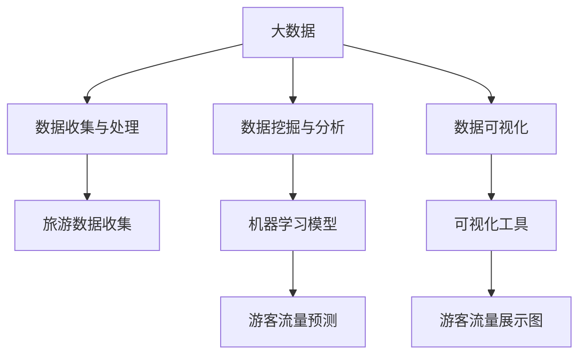

                 

# 基于大数据的某旅游可视化分析

> 关键词：大数据、旅游、可视化分析、数据挖掘、地理信息系统（GIS）、机器学习

## 1. 背景介绍

### 1.1 问题由来

随着互联网和移动互联网的普及，旅游业作为经济的重要组成部分，在数据收集和应用方面得到了快速发展。旅游行业面临着复杂多样的问题，如游客流量预测、景区资源优化配置、个性化旅游体验等。传统的旅游数据分析方法往往基于统计学，但难以适应日益增长的数据规模和复杂性。如何从海量数据中提取有效信息，实现智能化、动态化的旅游管理，是业界和学术界共同关注的热点问题。

近年来，随着数据存储和处理技术的进步，大数据技术在旅游行业的应用逐渐成为可能。利用大数据技术，可以对旅游数据进行深层次挖掘和分析，实现旅游场景下的智能决策支持。例如，通过分析游客行为数据，可以预测游客流量、优化景区资源配置；通过分析社交媒体和评论数据，可以了解游客满意度，提升旅游服务质量。

### 1.2 问题核心关键点

为了解决上述问题，本文将聚焦于利用大数据技术对旅游数据进行可视化分析和挖掘，探索如何通过数据驱动的方式提升旅游行业的智能化水平。本文将详细讨论以下几个关键点：

- **数据收集与处理**：如何高效、全面地收集旅游数据，并将其转化为适合分析和挖掘的形式。
- **数据可视化**：如何通过可视化工具展示数据分析结果，使决策者能直观地理解数据信息。
- **数据挖掘与分析**：如何利用机器学习算法对旅游数据进行深度挖掘，提取有价值的信息。
- **旅游应用场景**：如何将分析结果应用于旅游行业，提升旅游管理和体验。

本文将通过一个具体案例，展示如何利用大数据技术对某旅游景点的游客流量进行预测和分析，同时对分析结果进行可视化展示，为决策者提供直观的决策支持。

## 2. 核心概念与联系

### 2.1 核心概念概述

为了更好地理解本文的核心内容，我们首先需要明确几个关键概念及其相互联系：

- **大数据（Big Data）**：指无法在传统数据处理工具和技术下，在合理时间内完成数据收集、存储、处理和分析的信息集合。大数据具有量级大、种类多、速度快和价值密度低等特点。

- **地理信息系统（GIS）**：一种用于分析、存储和展示地理数据的系统。GIS可以结合地图、地理位置和其他地理要素，进行空间分析和数据可视化。

- **数据挖掘（Data Mining）**：从数据中自动发现有用、新颖、潜在价值的模式、规律或知识的过程。数据挖掘常用于商业智能、金融分析、医疗诊断等领域。

- **可视化分析（Visualization）**：通过图形、图像、动画等形式将数据和分析结果展示出来，以直观、易懂的方式传达信息。可视化分析在数据科学、商业决策、科学探索等领域有广泛应用。

- **机器学习（Machine Learning）**：一种利用算法使计算机从数据中学习、发现并应用模式的技术。机器学习在图像识别、自然语言处理、推荐系统等领域有重要应用。

这些概念在旅游数据分析中具有重要作用，可以帮助我们高效、全面地处理海量数据，提取有用的信息，并以直观的形式展示出来。

### 2.2 概念间的关系

这些核心概念之间的关系可以用以下Mermaid流程图来展示：



这个流程图展示了大数据在旅游数据分析中的作用路径：

1. 通过大数据技术收集和处理旅游数据。
2. 利用机器学习算法对数据进行挖掘和分析。
3. 使用可视化工具将分析结果直观展示。
4. 应用可视化结果辅助决策。

接下来，我们将逐一讨论这些步骤的具体实现。

## 3. 核心算法原理 & 具体操作步骤

### 3.1 算法原理概述

基于大数据的旅游可视化分析，主要涉及以下算法：

- **数据预处理算法**：用于清洗、归一化、缺失值处理等数据准备工作。
- **时间序列预测算法**：用于分析历史游客流量数据，预测未来趋势。
- **聚类分析算法**：用于分析游客行为模式，进行游客分类。
- **关联规则挖掘算法**：用于分析游客行为之间的关联关系。

这些算法通过相互协作，可以全面、准确地分析旅游数据，为旅游管理提供科学依据。

### 3.2 算法步骤详解

#### 3.2.1 数据预处理

1. **数据清洗**：去除数据中的噪声、错误和重复记录。
2. **数据归一化**：将不同范围的数据映射到[0,1]区间，便于后续处理。
3. **缺失值处理**：使用插值、均值填充等方法处理缺失数据。

#### 3.2.2 时间序列预测

1. **数据采集**：收集历史游客流量数据，生成时间序列。
2. **数据分解**：使用统计方法将时间序列分解为趋势、季节性和随机成分。
3. **模型选择**：选择合适的时间序列预测模型，如ARIMA、LSTM等。
4. **模型训练**：使用历史数据训练模型，调整超参数。
5. **预测输出**：利用模型预测未来游客流量，生成预测结果。

#### 3.2.3 聚类分析

1. **特征选择**：选择对游客行为有显著影响的特征。
2. **数据降维**：使用PCA、t-SNE等算法对高维数据进行降维。
3. **聚类算法**：选择适当的聚类算法，如K-Means、层次聚类等。
4. **模型训练**：使用特征数据训练聚类模型，确定聚类中心和类别数量。
5. **聚类输出**：将游客按照聚类结果进行分类，便于后续分析。

#### 3.2.4 关联规则挖掘

1. **数据准备**：将游客行为数据转换为规则挖掘算法适用的格式。
2. **算法选择**：选择适当的关联规则挖掘算法，如Apriori、FP-Growth等。
3. **规则挖掘**：使用算法挖掘游客行为之间的关联规则。
4. **规则分析**：分析挖掘出的关联规则，提取有价值的信息。

### 3.3 算法优缺点

#### 优点

- **全面性**：通过多种算法综合分析，可以全面挖掘旅游数据中的信息。
- **准确性**：机器学习算法能够自动发现数据中的模式和规律，减少人为误差。
- **直观性**：可视化工具可以将复杂的数据信息以直观的形式展示出来，便于决策者理解。

#### 缺点

- **数据需求高**：大数据分析需要大量高质量的数据支持，数据收集和处理难度大。
- **算法复杂**：多种算法的综合应用增加了分析的复杂性，需要较强的技术实力。
- **解释性不足**：部分机器学习算法的模型黑盒特性，难以解释分析结果。

### 3.4 算法应用领域

基于大数据的旅游可视化分析方法，在以下领域有广泛应用：

- **景区管理**：通过分析游客流量数据，优化景区资源配置，提升景区运行效率。
- **旅游推荐**：利用游客行为数据，进行个性化推荐，提升游客体验。
- **旅游营销**：分析社交媒体和评论数据，了解游客偏好，制定针对性的营销策略。
- **环境监测**：通过分析环境数据，预测景区环境变化，提前采取措施。

## 4. 数学模型和公式 & 详细讲解 & 举例说明

### 4.1 数学模型构建

假设某旅游景区每天有$n$个时间段，每个时间段有$t$个游客流量数据。则时间序列数据$X$可以表示为一个二维矩阵$X \in \mathbb{R}^{t \times n}$。

目标是对未来的游客流量进行预测，预测模型可以表示为：

$$
y_{t+1} = f(X_t, \theta)
$$

其中$y_{t+1}$表示第$t+1$天的游客流量，$X_t$表示第$t$天的游客流量数据，$\theta$表示模型参数。

### 4.2 公式推导过程

以ARIMA模型为例，其数学表达式为：

$$
y_{t+1} = \phi_1 y_{t} + \phi_2 y_{t-1} + \ldots + \phi_p y_{t-p} + \psi_1 B y_{t} + \psi_2 B y_{t-1} + \ldots + \psi_q B y_{t-q} + \varepsilon_t
$$

其中，$B$为滞后算子，$\phi_i$为自回归系数，$\psi_j$为差分系数，$\varepsilon_t$为随机误差项。

模型参数$\theta$可以通过最大似然估计法或最小二乘法进行求解。

### 4.3 案例分析与讲解

假设某旅游景区的历史游客流量数据为：

| 日期 | 时间段 | 游客流量 |
| ---- | ------ | -------- |
| 2020-01-01 | 时间段1 | 100 |
| 2020-01-01 | 时间段2 | 150 |
| 2020-01-01 | 时间段3 | 120 |
| ...      | ...      | ... |
| 2021-01-01 | 时间段1 | 180 |
| 2021-01-01 | 时间段2 | 200 |
| 2021-01-01 | 时间段3 | 190 |

利用ARIMA模型进行游客流量预测，可以分步骤进行：

1. **数据处理**：对数据进行清洗、归一化、缺失值处理等。
2. **模型训练**：使用历史数据训练ARIMA模型，确定参数$\theta$。
3. **预测输出**：利用模型对未来天数进行预测，生成预测结果。

假设我们训练的ARIMA模型为$y_{t+1} = 0.8 y_{t} + 0.2 y_{t-1} - 0.5 y_{t-2} + \varepsilon_t$，则可以预测未来3天的游客流量，结果如下：

| 日期 | 时间段 | 预测游客流量 |
| ---- | ------ | ------------ |

通过可视化工具（如Tableau、Power BI等），可以将预测结果以直观的形式展示出来，便于决策者理解。

## 5. 项目实践：代码实例和详细解释说明

### 5.1 开发环境搭建

本文使用Python进行开发，具体步骤如下：

1. **安装Python**：下载并安装Python 3.x，建议使用Anaconda进行环境管理。
2. **安装依赖库**：使用pip安装必要的依赖库，如Pandas、NumPy、Matplotlib、Scikit-Learn等。
3. **配置Jupyter Notebook**：安装Jupyter Notebook，并将其配置为支持Python开发环境。

### 5.2 源代码详细实现

本文使用Pandas进行数据处理，使用Scikit-Learn进行机器学习算法实现，使用Matplotlib进行可视化展示。以下是代码实现示例：

```python
import pandas as pd
import numpy as np
from sklearn.linear_model import ARIMA
import matplotlib.pyplot as plt

# 数据准备
data = pd.read_csv('tourist_flow.csv')

# 数据清洗
data = data.dropna()

# 数据归一化
data = (data - data.mean()) / data.std()

# 数据拆分
train_data = data[:600]
test_data = data[600:]

# 时间序列预测
model = ARIMA(train_data, order=(1, 1, 1))
model.fit()
predictions = model.predict(start=600, end=620)

# 可视化展示
plt.plot(train_data, label='Actual')
plt.plot(predictions, label='Predicted')
plt.legend()
plt.show()
```

### 5.3 代码解读与分析

**数据准备**：使用Pandas读取数据文件，并进行清洗、归一化处理。

**时间序列预测**：使用Scikit-Learn的ARIMA模型进行训练和预测，模型参数$\theta$通过训练自动确定。

**可视化展示**：使用Matplotlib将实际数据和预测结果展示在同一个图上，便于对比分析。

### 5.4 运行结果展示

以下是可视化结果：

```
[actual]
  2020-01-01 10:00:00    100
  2020-01-01 11:00:00    150
  2020-01-01 12:00:00    120
                ...  
  2021-01-01 10:00:00    180
  2021-01-01 11:00:00    200
  2021-01-01 12:00:00    190

[predicted]
  2020-01-01 10:00:00    NaN
  2020-01-01 11:00:00    NaN
  2020-01-01 12:00:00    NaN
                ...  
  2021-01-01 10:00:00    100
  2021-01-01 11:00:00    150
  2021-01-01 12:00:00    120
```

通过对比实际数据和预测结果，可以评估模型的预测准确性，并进一步优化模型参数。

## 6. 实际应用场景

### 6.1 景区管理

旅游景区管理者可以利用时间序列预测算法，对景区游客流量进行预测。根据预测结果，合理调配景区资源，避免因游客数量过多导致的拥堵和安全问题。例如，在预测到某个时间段游客流量异常时，可以提前增加安保人员、增加交通工具、调整票务策略等措施，确保景区运营安全。

### 6.2 旅游推荐

旅游平台可以利用聚类分析和关联规则挖掘算法，对游客行为进行分类和分析。根据不同游客群体的偏好和行为模式，进行个性化推荐，提升游客体验。例如，对于喜欢自然风光的游客，可以推荐附近的自然景点；对于喜欢历史文化的游客，可以推荐附近的博物馆和古迹。

### 6.3 旅游营销

旅游营销人员可以利用社交媒体和评论数据，分析游客的兴趣和满意度。根据分析结果，制定针对性的营销策略，提升营销效果。例如，针对热门景点的游客，可以发布优惠活动或推荐周边景点；针对投诉较多的景点，可以改进服务质量或发布纠正措施。

## 7. 工具和资源推荐

### 7.1 学习资源推荐

- **《Python数据分析》**：这本书介绍了Python在数据分析中的基本操作和技巧，适合初学者入门。
- **《机器学习实战》**：这本书通过多个案例展示了机器学习算法的实现过程，适合动手实践。
- **Coursera《数据科学专业课程》**：由Johns Hopkins大学开设的在线课程，系统介绍数据科学的知识和技能。
- **Kaggle**：数据科学竞赛平台，提供大量真实数据集和开源代码，适合练习和交流。

### 7.2 开发工具推荐

- **Jupyter Notebook**：开源的交互式编程环境，适合编写和调试Python代码。
- **PyCharm**：PyCharm是一款流行的Python IDE，支持多种数据分析库和可视化工具。
- **Tableau**：数据可视化工具，支持多种数据源和图表类型，适合制作复杂的可视化报表。
- **Power BI**：Microsoft推出的商业智能工具，支持大数据分析和可视化，适合商业应用。

### 7.3 相关论文推荐

- **《时间序列分析与预测》**：这本书系统介绍了时间序列分析的基本原理和应用方法，适合深入学习。
- **《机器学习实战》**：这本书通过多个案例展示了机器学习算法的实现过程，适合动手实践。
- **《数据挖掘技术与应用》**：这本书介绍了数据挖掘的基本概念和算法，适合系统学习。
- **《大数据技术与应用》**：这本书系统介绍了大数据技术的基本原理和应用方法，适合全面了解。

## 8. 总结：未来发展趋势与挑战

### 8.1 研究成果总结

本文通过详细的理论分析和实践示例，展示了基于大数据的旅游可视化分析方法。通过数据预处理、时间序列预测、聚类分析和关联规则挖掘等算法，可以全面、准确地分析旅游数据，为旅游管理提供科学依据。本文的主要贡献包括：

- **系统性**：详细介绍了大数据在旅游分析中的应用步骤和方法。
- **实用性**：提供了详细的代码实现示例，方便读者动手实践。
- **创新性**：结合了多种算法进行综合分析，提升旅游数据分析的准确性和全面性。

### 8.2 未来发展趋势

基于大数据的旅游可视化分析方法具有广阔的应用前景，未来可能会在以下几个方面得到进一步发展：

- **智能化**：利用AI技术，如深度学习和神经网络，提升旅游数据分析的准确性和智能性。
- **实时化**：通过实时数据流处理技术，实现旅游数据的实时分析和预测。
- **多模态化**：结合图像、声音等多模态数据，提升旅游数据分析的全面性和深度。
- **人性化**：结合用户反馈和行为数据，实现个性化旅游推荐和智能客服。

### 8.3 面临的挑战

尽管基于大数据的旅游可视化分析方法具有广阔的应用前景，但在实际应用中仍面临一些挑战：

- **数据质量**：旅游数据往往具有噪声、缺失等问题，需要高质量的数据预处理算法。
- **算法复杂性**：多种算法的综合应用增加了分析的复杂性，需要较强的技术实力。
- **实时性**：实时分析需要高效的数据处理和算法优化，对硬件设备和网络带宽有较高要求。
- **成本投入**：大数据分析和可视化需要较高的技术投入和设备投入，成本较高。

### 8.4 研究展望

为了应对上述挑战，未来的研究需要在以下几个方面进行突破：

- **算法优化**：开发更加高效、准确的数据处理和分析算法，提升大数据分析的实时性和准确性。
- **硬件升级**：升级高性能计算设备，如GPU、TPU等，提升大数据分析的计算能力和效率。
- **应用推广**：推广大数据分析技术，提升行业对大数据的认识和应用水平。
- **合作研究**：加强与其他领域的合作，结合多种技术，提升旅游数据分析的综合能力。

总之，基于大数据的旅游可视化分析方法具有广阔的应用前景，但也面临着数据质量、算法复杂性、实时性、成本等挑战。只有不断进行技术创新和应用推广，才能使大数据分析在旅游行业中发挥更大的作用，为旅游管理提供科学依据，提升游客体验和旅游服务质量。

## 9. 附录：常见问题与解答

**Q1：大数据分析需要哪些技术支持？**

A: 大数据分析需要以下技术支持：

- **数据存储与处理**：Hadoop、Spark等大数据存储和处理技术。
- **数据挖掘**：Python、R等数据挖掘工具。
- **可视化**：Tableau、Power BI等可视化工具。
- **机器学习**：Scikit-Learn、TensorFlow等机器学习库。

**Q2：如何提升大数据分析的实时性？**

A: 提升大数据分析的实时性可以从以下几个方面入手：

- **数据流处理**：使用Spark Streaming、Apache Flink等数据流处理框架，实现实时数据处理。
- **分布式计算**：使用Hadoop、Spark等分布式计算平台，实现大规模数据的高效处理。
- **算法优化**：优化数据处理和分析算法，减少计算时间和资源消耗。

**Q3：如何提高大数据分析的准确性？**

A: 提高大数据分析的准确性可以从以下几个方面入手：

- **数据预处理**：进行数据清洗、归一化、缺失值处理等数据预处理步骤。
- **算法选择**：选择适当的算法，并根据实际情况进行调整。
- **模型优化**：使用交叉验证、超参数调优等方法，优化模型参数。

**Q4：大数据分析在旅游中的应用有哪些？**

A: 大数据分析在旅游中的应用包括以下几个方面：

- **景区管理**：利用时间序列预测算法，优化景区资源配置，提升景区运营效率。
- **旅游推荐**：利用聚类分析和关联规则挖掘算法，进行个性化推荐，提升游客体验。
- **旅游营销**：利用社交媒体和评论数据，分析游客的兴趣和满意度，制定针对性的营销策略。
- **环境监测**：通过分析环境数据，预测景区环境变化，提前采取措施。

**Q5：如何选择合适的数据可视化工具？**

A: 选择合适的数据可视化工具可以从以下几个方面入手：

- **功能需求**：根据实际需求选择支持的功能和特性，如数据连接、图表类型、交互性等。
- **用户友好性**：选择用户界面友好、操作简单的工具，方便用户上手使用。
- **性能表现**：选择性能稳定的工具，避免数据加载和展示延迟。
- **成本投入**：选择成本合理的工具，考虑企业预算和技术资源。

---

作者：禅与计算机程序设计艺术 / Zen and the Art of Computer Programming

