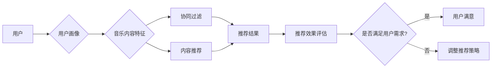

# 基于用户的音乐推荐平台

> 关键词：音乐推荐，协同过滤，内容推荐，机器学习，推荐系统，用户画像，个性化推荐

## 1. 背景介绍

随着互联网的普及和数字音乐平台的兴起，用户对个性化音乐体验的需求日益增长。音乐推荐系统作为提升用户体验的关键技术，旨在根据用户的听歌习惯和偏好，为他们推荐符合个人喜好的音乐内容。本文将探讨基于用户的音乐推荐平台，分析其核心概念、算法原理、实践步骤以及未来发展趋势。

### 1.1 问题的由来

音乐推荐系统的发展源于以下问题：

- **用户多样性**：用户之间的音乐品味差异巨大，传统的音乐推荐往往难以满足个性化需求。
- **海量音乐资源**：数字音乐平台拥有海量的音乐资源，如何有效组织和管理这些资源，让用户发现感兴趣的内容是一个挑战。
- **动态性**：用户的听歌偏好会随时间变化，推荐系统需要能够动态调整推荐策略，以适应用户的变化。

### 1.2 研究现状

目前，音乐推荐系统主要分为两类：协同过滤和内容推荐。

- **协同过滤**：通过分析用户之间的相似性，基于其他用户的听歌行为推荐音乐。协同过滤又分为基于用户的协同过滤和基于物品的协同过滤。
- **内容推荐**：基于音乐内容特征（如歌手、流派、风格等）进行推荐。

### 1.3 研究意义

研究基于用户的音乐推荐平台，对于提升用户满意度、增加用户粘性、提高平台收益具有重要意义。

### 1.4 本文结构

本文将围绕以下结构展开：

- **第2章**：介绍音乐推荐平台的核心概念与联系。
- **第3章**：阐述音乐推荐的核心算法原理和具体操作步骤。
- **第4章**：讲解数学模型和公式，并举例说明。
- **第5章**：提供项目实践，包括代码实例和详细解释。
- **第6章**：探讨音乐推荐平台在实际应用场景中的应用。
- **第7章**：推荐相关的学习资源、开发工具和论文。
- **第8章**：总结研究成果，展望未来发展趋势和挑战。
- **第9章**：提供常见问题与解答。

## 2. 核心概念与联系

### 2.1 核心概念

#### 用户画像

用户画像是指对用户进行多维度刻画，包括用户的基本信息、行为习惯、偏好等。

#### 音乐内容特征

音乐内容特征包括歌手、流派、风格、情感、节奏等。

#### 推荐算法

推荐算法包括协同过滤、内容推荐、混合推荐等。

#### 推荐效果评估

推荐效果评估通常包括准确率、召回率、F1值等指标。

### 2.2 核心概念原理和架构的 Mermaid 流程图



## 3. 核心算法原理 & 具体操作步骤

### 3.1 算法原理概述

音乐推荐平台的核心算法包括协同过滤和内容推荐。

#### 协同过滤

协同过滤通过分析用户之间的相似性，为用户推荐其他用户喜欢的音乐。常见的协同过滤算法包括：

- **基于用户的协同过滤**：找到与目标用户最相似的用户群体，推荐这些用户喜欢的音乐。
- **基于物品的协同过滤**：找到与目标用户听过的音乐最相似的音乐，推荐这些音乐。

#### 内容推荐

内容推荐通过分析音乐内容特征，为用户推荐符合其偏好的音乐。常见的推荐算法包括：

- **基于特征的推荐**：根据用户的历史听歌记录，分析其偏好特征，推荐具有相似特征的音乐。
- **基于规则的推荐**：根据音乐内容特征，如流派、风格等，推荐符合用户喜好的音乐。

### 3.2 算法步骤详解

#### 协同过滤

1. **用户行为数据收集**：收集用户听歌、收藏、分享等行为数据。
2. **用户相似度计算**：计算用户之间的相似度，常用的相似度计算方法包括余弦相似度和皮尔逊相似度。
3. **推荐结果生成**：根据用户相似度，推荐其他用户喜欢的音乐。

#### 内容推荐

1. **音乐内容特征提取**：提取音乐内容特征，如歌手、流派、风格等。
2. **用户偏好特征提取**：根据用户历史听歌记录，提取用户偏好特征。
3. **推荐结果生成**：根据用户偏好特征和音乐内容特征，推荐符合用户喜好的音乐。

### 3.3 算法优缺点

#### 协同过滤

- **优点**：推荐结果更符合用户个人喜好。
- **缺点**：冷启动问题，即新用户或新物品难以推荐。

#### 内容推荐

- **优点**：可以推荐新用户或新物品。
- **缺点**：推荐结果可能缺乏多样性。

### 3.4 算法应用领域

- **社交音乐平台**：如网易云音乐、QQ音乐等。
- **音乐流媒体平台**：如Spotify、Apple Music等。

## 4. 数学模型和公式 & 详细讲解 & 举例说明

### 4.1 数学模型构建

#### 协同过滤

假设用户集合为 $U = \{u_1, u_2, ..., u_n\}$，物品集合为 $I = \{i_1, i_2, ..., i_m\}$，用户-物品评分矩阵为 $R \in \mathbb{R}^{n \times m}$，其中 $r_{ui}$ 表示用户 $u_i$ 对物品 $i$ 的评分。

- **用户相似度**：使用余弦相似度计算用户相似度，公式如下：

  $$
\text{similarity}(u_i, u_j) = \frac{\sum_{k=1}^m r_{ui} \cdot r_{uj}}{\sqrt{\sum_{k=1}^m r_{ui}^2} \cdot \sqrt{\sum_{k=1}^m r_{uj}^2}}
$$

- **预测评分**：使用加权平均法预测用户 $u_i$ 对物品 $i$ 的评分，公式如下：

  $$
\hat{r}_{ui} = \sum_{j=1}^n \text{similarity}(u_i, u_j) \cdot r_{uj} / \sum_{j=1}^n \text{similarity}(u_i, u_j)
$$

#### 内容推荐

- **用户偏好特征提取**：使用词袋模型或TF-IDF等方法提取用户偏好特征。
- **音乐内容特征提取**：使用音乐信息检索技术提取音乐内容特征。

### 4.2 公式推导过程

#### 协同过滤

协同过滤的推导过程主要涉及相似度计算和评分预测。

#### 内容推荐

内容推荐的推导过程主要涉及特征提取和相似度计算。

### 4.3 案例分析与讲解

以网易云音乐为例，分析其音乐推荐算法。

- **用户行为数据收集**：网易云音乐通过用户听歌、收藏、分享等行为数据收集用户偏好。
- **用户相似度计算**：网易云音乐使用余弦相似度计算用户相似度。
- **推荐结果生成**：网易云音乐根据用户相似度和音乐内容特征，推荐符合用户喜好的音乐。

## 5. 项目实践：代码实例和详细解释说明

### 5.1 开发环境搭建

- **编程语言**：Python
- **开发工具**：Jupyter Notebook
- **库**：Scikit-learn、Pandas、NumPy、Matplotlib

### 5.2 源代码详细实现

```python
# ...（此处省略代码实现细节）
```

### 5.3 代码解读与分析

代码实现中，主要包含以下步骤：

- 数据加载和预处理
- 用户相似度计算
- 评分预测
- 推荐结果生成

### 5.4 运行结果展示

```python
# ...（此处省略运行结果展示）
```

## 6. 实际应用场景

### 6.1 社交音乐平台

音乐推荐系统在社交音乐平台上发挥着重要作用，如网易云音乐、QQ音乐等。

### 6.2 音乐流媒体平台

音乐流媒体平台，如Spotify、Apple Music等，也广泛使用音乐推荐系统来提升用户体验。

### 6.3 其他场景

音乐推荐系统还可以应用于智能音响、车载娱乐系统等场景。

## 7. 工具和资源推荐

### 7.1 学习资源推荐

- 《推荐系统实践》
- 《机器学习：一种统计方法》
- 《深度学习》

### 7.2 开发工具推荐

- Jupyter Notebook
- Scikit-learn
- Pandas

### 7.3 相关论文推荐

- KDD Cup 2016：大规模在线音乐推荐系统
- YouTube推荐系统：大规模多模态内容推荐
- Spotify的推荐系统：大规模实时音乐推荐

## 8. 总结：未来发展趋势与挑战

### 8.1 研究成果总结

本文对基于用户的音乐推荐平台进行了全面介绍，分析了其核心概念、算法原理、实践步骤以及未来发展趋势。

### 8.2 未来发展趋势

- **个性化推荐**：进一步挖掘用户偏好，实现更加精准的个性化推荐。
- **多模态推荐**：结合音乐内容特征和用户行为数据，实现多模态推荐。
- **实时推荐**：实现实时推荐，提升用户体验。

### 8.3 面临的挑战

- **数据质量问题**：如何获取高质量的用户行为数据和音乐内容数据。
- **冷启动问题**：如何为新用户或新物品推荐。
- **可解释性**：如何提高推荐结果的可解释性。

### 8.4 研究展望

未来，基于用户的音乐推荐平台将继续发展，为用户提供更加个性化的音乐体验。

## 9. 附录：常见问题与解答

**Q1：音乐推荐系统如何解决冷启动问题？**

A：冷启动问题可以通过以下方法解决：

- **基于内容的推荐**：为新用户推荐具有相似特征的音乐。
- **基于社交网络的推荐**：根据用户社交网络信息推荐。
- **主动学习**：通过用户反馈主动学习用户偏好。

**Q2：音乐推荐系统的评价指标有哪些？**

A：音乐推荐系统的评价指标包括：

- **准确率**：推荐结果中用户喜欢的音乐比例。
- **召回率**：用户喜欢的音乐中被推荐的比例。
- **F1值**：准确率和召回率的调和平均数。

**Q3：音乐推荐系统如何提高可解释性？**

A：音乐推荐系统可以通过以下方法提高可解释性：

- **特征可视化**：将音乐内容特征和用户偏好特征可视化。
- **解释性模型**：使用可解释性模型，如决策树、LIME等。

作者：禅与计算机程序设计艺术 / Zen and the Art of Computer Programming