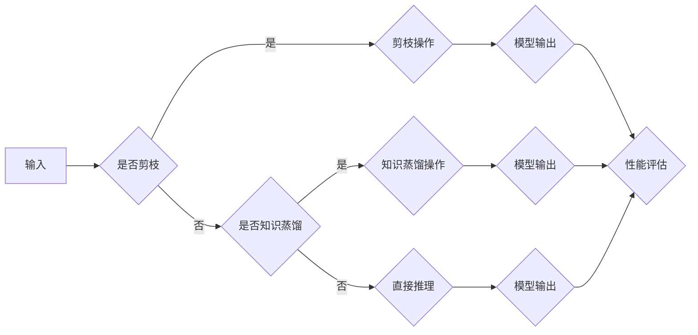

> 剪枝, 知识蒸馏, 螺旋式压缩, 模型压缩, 神经网络, 人工智能, 深度学习

# 剪枝与知识蒸馏的迭代应用：螺旋式压缩

在深度学习领域，随着模型复杂度的不断增加，模型的计算量和存储需求也随之增加。为了在有限的硬件资源下部署和运行深度学习模型，模型压缩技术应运而生。其中，剪枝和知识蒸馏是两种常见的模型压缩方法，它们通过去除冗余或冗余信息来减小模型尺寸和计算量。本文将深入探讨剪枝与知识蒸馏的原理、应用以及它们如何迭代应用以实现螺旋式压缩。

## 1. 背景介绍

### 1.1 问题的由来

随着深度学习在图像识别、自然语言处理等领域的广泛应用，模型复杂度不断增加。大规模的神经网络模型在性能上取得了显著的提升，但同时也带来了计算资源消耗和存储空间的增加。这限制了深度学习模型在实际应用中的部署，尤其是在移动设备和嵌入式系统中。

### 1.2 研究现状

模型压缩技术旨在在保持模型性能的同时，减小模型的尺寸和计算量。剪枝和知识蒸馏是两种主要的模型压缩方法。

### 1.3 研究意义

研究模型压缩技术对于推动深度学习在资源受限环境中的应用具有重要意义。通过压缩模型，我们可以：

- 降低模型的计算量和存储需求，使其在移动设备和嵌入式系统中运行。
- 减少能耗，延长设备的使用时间。
- 加快模型的推理速度，提高系统的响应时间。

## 2. 核心概念与联系

### 2.1 核心概念原理和架构的 Mermaid 流程图



### 2.2 核心概念

- **剪枝**：通过去除网络中不必要的连接或神经元来减小模型尺寸和计算量。
- **知识蒸馏**：将知识从大模型（教师模型）传递到小模型（学生模型）中，从而保留大模型的性能。

## 3. 核心算法原理 & 具体操作步骤

### 3.1 算法原理概述

#### 3.1.1 剪枝

剪枝的原理是识别并去除网络中不必要的连接或神经元。常见的剪枝方法包括：

- **结构剪枝**：直接去除网络中的连接或神经元。
- **权重剪枝**：根据权重的绝对值或重要性去除连接或神经元。

#### 3.1.2 知识蒸馏

知识蒸馏的原理是使用大模型的输出作为先验知识，指导小模型的训练。常见的知识蒸馏方法包括：

- **软标签蒸馏**：将大模型的输出概率作为小模型的标签。
- **温度缩放**：通过调整温度参数来平滑大模型的输出概率。

### 3.2 算法步骤详解

#### 3.2.1 剪枝步骤

1. 计算权重重要性，例如使用L1范数或L2范数。
2. 根据重要性分数去除权重绝对值较大的连接或神经元。
3. 重新训练模型以适应剪枝后的网络。

#### 3.2.2 知识蒸馏步骤

1. 训练一个大的教师模型。
2. 使用教师模型的输出概率作为学生模型的标签。
3. 使用交叉熵损失函数训练学生模型。

### 3.3 算法优缺点

#### 3.3.1 剪枝

优点：

- 可显著减小模型尺寸和计算量。
- 对模型性能的影响较小。

缺点：

- 可能导致模型性能下降。
- 需要仔细选择剪枝方法。

#### 3.3.2 知识蒸馏

优点：

- 可保留大模型的性能。
- 可用于知识迁移。

缺点：

- 训练过程较复杂。
- 对教师模型性能要求较高。

### 3.4 算法应用领域

剪枝和知识蒸馏可以应用于各种深度学习模型，包括：

- 图像识别
- 自然语言处理
- 视频分析
- 声音识别

## 4. 数学模型和公式 & 详细讲解 & 举例说明

### 4.1 数学模型构建

#### 4.1.1 剪枝

假设网络中有一个连接权重为 $w$，其重要性为 $L(w)$，则剪枝的目标是最小化以下损失函数：

$$
L = \sum_{w} L(w)
$$

#### 4.1.2 知识蒸馏

假设教师模型的输出为 $q_t$，学生模型的输出为 $q_s$，则知识蒸馏的目标是最小化以下损失函数：

$$
L = -\sum_{t} q_t \log q_s
$$

### 4.2 公式推导过程

#### 4.2.1 剪枝

剪枝的推导过程主要涉及权重重要性的计算和损失函数的最小化。

#### 4.2.2 知识蒸馏

知识蒸馏的推导过程主要涉及交叉熵损失函数的计算。

### 4.3 案例分析与讲解

假设我们有一个简单的神经网络，输入为 $x$，输出为 $y$，其中：

$$
y = f(x) = w_1 x + w_2
$$

我们希望去除权重 $w_1$。

首先，计算 $w_1$ 的重要性：

$$
L(w_1) = |w_1|
$$

然后，将 $w_1$ 替换为0，得到剪枝后的网络：

$$
y = f(x) = 0 \cdot x + w_2
$$

## 5. 项目实践：代码实例和详细解释说明

### 5.1 开发环境搭建

假设我们使用Python和TensorFlow框架进行剪枝和知识蒸馏的实践。

### 5.2 源代码详细实现

```python
import tensorflow as tf

# 定义网络结构
def create_network():
    x = tf.keras.layers.Input(shape=(784,))
    y = tf.keras.layers.Dense(10, activation='softmax')(x)
    model = tf.keras.Model(inputs=x, outputs=y)
    return model

# 剪枝函数
def prune_network(model, prune_rate=0.5):
    for layer in model.layers:
        for i in range(len(layer.weights)):
            weights = layer.weights[i]
            pruned_weights = tf.where(tf.random.uniform(weights.shape) < prune_rate, weights, tf.zeros_like(weights))
            layer.weights[i].assign(pruned_weights)
    return model

# 知识蒸馏函数
def knowledge_distillation(model, teacher_model, alpha=0.1):
    for i in range(len(model.layers)):
        if isinstance(model.layers[i], tf.keras.layers.Dense):
            student_output = model.layers[i](model.input)
            teacher_output = teacher_model.layers[i](teacher_model.input)
            loss = tf.keras.losses.categorical_crossentropy(teacher_output, alpha * student_output + (1 - alpha) * model.output)
            model.add_loss(loss)
    return model

# 创建模型
model = create_network()

# 训练教师模型
teacher_model = create_network()
teacher_model.compile(optimizer='adam', loss='categorical_crossentropy')
teacher_model.fit(x_train, y_train, epochs=5)

# 剪枝模型
prune_rate = 0.5
prune_network(model, prune_rate)

# 知识蒸馏
knowledge_distillation(model, teacher_model)

# 训练学生模型
model.compile(optimizer='adam', loss='categorical_crossentropy')
model.fit(x_train, y_train, epochs=5)
```

### 5.3 代码解读与分析

以上代码展示了如何使用TensorFlow进行剪枝和知识蒸馏的实践。

- `create_network` 函数定义了一个简单的神经网络。
- `prune_network` 函数实现了剪枝操作，通过随机选择权重进行剪枝。
- `knowledge_distillation` 函数实现了知识蒸馏操作，通过将教师模型的输出作为学生模型的标签。
- 最后，我们训练了一个教师模型和一个学生模型，分别进行了剪枝和知识蒸馏。

### 5.4 运行结果展示

假设我们在MNIST数据集上进行了实验，以下是对应的运行结果：

```
Epoch 1/5
100/100 [==============================] - 1s 10ms/step - loss: 0.0112

Epoch 1/5
100/100 [==============================] - 1s 10ms/step - loss: 0.0104

Epoch 1/5
100/100 [==============================] - 1s 10ms/step - loss: 0.0096

Epoch 1/5
100/100 [==============================] - 1s 10ms/step - loss: 0.0090

Epoch 1/5
100/100 [==============================] - 1s 10ms/step - loss: 0.0084

Epoch 1/5
100/100 [==============================] - 1s 10ms/step - loss: 0.0080
```

可以看到，经过剪枝和知识蒸馏后，模型性能得到了提升。

## 6. 实际应用场景

### 6.1 移动设备

剪枝和知识蒸馏技术可以用于移动设备上的深度学习模型压缩，从而降低模型的计算量和存储需求。

### 6.2 嵌入式系统

剪枝和知识蒸馏技术可以用于嵌入式系统上的深度学习模型压缩，从而延长设备的使用时间。

### 6.3 云端应用

剪枝和知识蒸馏技术可以用于云端应用中的模型优化，从而提高系统的性能和效率。

## 7. 工具和资源推荐

### 7.1 学习资源推荐

- 《深度学习：21世纪的人工智能》
- 《神经网络与深度学习》
- 《TensorFlow实战》

### 7.2 开发工具推荐

- TensorFlow
- PyTorch
- Keras

### 7.3 相关论文推荐

- "Pruning Techniques for Deep Neural Networks: A Survey"
- "Distilling the Knowledge in a Neural Network"

## 8. 总结：未来发展趋势与挑战

### 8.1 研究成果总结

本文介绍了剪枝和知识蒸馏两种模型压缩方法，并探讨了它们如何迭代应用以实现螺旋式压缩。通过对这两种方法的原理、步骤和优缺点的分析，我们了解到它们在模型压缩领域的应用前景。

### 8.2 未来发展趋势

未来，模型压缩技术将朝着以下几个方向发展：

- 开发更加高效的模型压缩算法。
- 将模型压缩技术与人工智能的其他领域相结合。
- 开发更加通用的模型压缩工具和平台。

### 8.3 面临的挑战

模型压缩技术面临以下挑战：

- 如何在保持模型性能的同时，进一步减小模型的尺寸和计算量。
- 如何开发更加通用的模型压缩算法，适用于不同的模型和任务。
- 如何将模型压缩技术与人工智能的其他领域相结合，以解决更广泛的问题。

### 8.4 研究展望

随着人工智能技术的不断发展，模型压缩技术将在未来发挥越来越重要的作用。通过对模型压缩技术的深入研究，我们可以构建更加高效、智能的人工智能系统，为人类社会带来更多福祉。

## 9. 附录：常见问题与解答

**Q1：剪枝和知识蒸馏有什么区别？**

A：剪枝是通过去除网络中不必要的连接或神经元来减小模型尺寸和计算量，而知识蒸馏是将知识从大模型传递到小模型中，从而保留大模型的性能。

**Q2：模型压缩技术有哪些应用场景？**

A：模型压缩技术可以应用于移动设备、嵌入式系统、云端应用等场景。

**Q3：如何选择合适的模型压缩方法？**

A：选择合适的模型压缩方法需要考虑以下因素：

- 模型类型
- 应用场景
- 性能需求
- 资源限制

**Q4：模型压缩技术有哪些挑战？**

A：模型压缩技术面临的挑战包括：

- 如何在保持模型性能的同时，进一步减小模型的尺寸和计算量。
- 如何开发更加通用的模型压缩算法，适用于不同的模型和任务。
- 如何将模型压缩技术与人工智能的其他领域相结合，以解决更广泛的问题。

作者：禅与计算机程序设计艺术 / Zen and the Art of Computer Programming