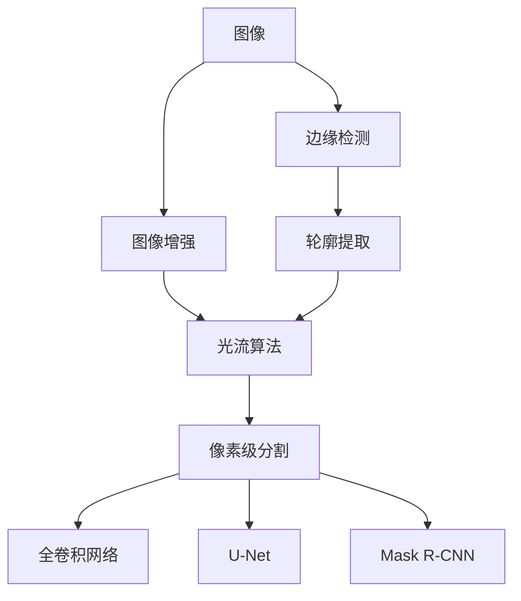

                 

# 基于OpenCV的图像分割系统详细设计与具体代码实现

> 关键词：图像分割,OpenCV,深度学习,边缘检测,图像增强,轮廓提取,光流算法,实时性

## 1. 背景介绍

### 1.1 问题由来

随着计算机视觉技术的发展，图像分割成为计算机视觉领域中的重要研究问题之一。图像分割通常被定义为将图像分成多个具有语义意义的区域的过程，以适应不同领域的应用需求，如医学影像的肿瘤检测、自动驾驶中的道路分割、工业检测中的缺陷检测等。传统上，图像分割主要通过阈值分割、区域生长、聚类等方法实现，但这些方法往往对图像的灰度分布、噪声、光照变化等敏感，且对复杂的边界场景处理能力有限。随着深度学习技术的崛起，尤其是卷积神经网络(CNN)的突破性进展，图像分割的性能得到了极大的提升，已经成为计算机视觉领域的热门研究方向。

### 1.2 问题核心关键点

当前，图像分割领域最先进的方法主要基于深度学习技术。其中，全卷积网络(FCN)、U-Net、Mask R-CNN等模型在图像分割任务中表现优异，能够生成高精度的像素级分割结果。这些模型通常需要大量的训练数据和计算资源，且在实时性方面仍有一定的局限性。本文将聚焦于基于OpenCV的图像分割系统的设计和实现，重点介绍如何在OpenCV平台上使用深度学习技术进行图像分割，并通过代码实例展示具体实现过程。

### 1.3 问题研究意义

基于OpenCV的图像分割系统不仅可以提供高效、低成本的图像分割服务，还能在实时性、可扩展性等方面具有显著优势。此外，OpenCV本身是一个开源的计算机视觉库，拥有广泛的用户基础和社区支持，能够快速迭代和优化。因此，基于OpenCV的图像分割系统能够更好地服务于行业需求，推动计算机视觉技术在更多场景中的应用。

## 2. 核心概念与联系

### 2.1 核心概念概述

在进行图像分割系统的设计和实现过程中，需要掌握以下核心概念：

- 图像分割(Image Segmentation)：将一张彩色或灰度图像划分成多个语义上有意义的区域的过程。
- 深度学习(Deep Learning)：一种基于人工神经网络的机器学习技术，通过多层非线性变换，可以学习到数据的复杂特征。
- OpenCV(Open Source Computer Vision Library)：一个开源的计算机视觉库，包含丰富的图像处理、计算机视觉算法。
- 卷积神经网络(Convolutional Neural Network, CNN)：一种特殊的神经网络结构，主要用于图像分类、图像分割等计算机视觉任务。
- 全卷积网络(Fully Convolutional Network, FCN)：一种特殊的卷积神经网络，通过将全连接层替换为卷积层，可以对输入图像进行像素级别的分割。
- 边缘检测(Edge Detection)：通过检测图像中的边缘信息，分割图像成具有一定边界信息的区域。
- 图像增强(Image Enhancement)：通过对图像进行平滑、去噪、增强对比度等操作，改善图像质量，提高后续处理的效果。
- 轮廓提取(Contour Extraction)：通过检测图像中的轮廓信息，分割图像成具有明确边界的区域。
- 光流算法(Optical Flow Algorithm)：一种通过计算图像序列中像素位移的算法，可用于运动目标跟踪和图像分割。

这些核心概念之间通过以下Mermaid流程图展示：



### 2.2 概念间的关系

以上核心概念之间的关系主要通过以下方式体现：

- 图像分割是计算机视觉领域的基础任务，边缘检测、轮廓提取等都是图像分割的子任务，光流算法则是用于提取运动目标信息的特殊算法。
- 深度学习技术，尤其是卷积神经网络，已经成为图像分割任务中最先进的方法。
- OpenCV作为计算机视觉库，提供了丰富的图像处理算法，是实现图像分割系统的理想平台。

通过以上核心概念的介绍，我们可以更好地理解图像分割系统的设计原理和实现方法。接下来，我们将深入探讨这些核心概念，并通过代码实现具体的图像分割系统。

## 3. 核心算法原理 & 具体操作步骤

### 3.1 算法原理概述

基于OpenCV的图像分割系统主要通过以下步骤实现：

1. **图像预处理**：包括图像去噪、灰度化、归一化等操作，改善图像质量，提高后续处理的效果。
2. **边缘检测**：通过Canny算法或Sobel算法检测图像中的边缘信息，分割图像成具有一定边界信息的区域。
3. **图像增强**：通过对图像进行平滑、增强对比度等操作，进一步改善图像质量，提高分割精度。
4. **轮廓提取**：通过FindContours算法检测图像中的轮廓信息，分割图像成具有明确边界的区域。
5. **像素级分割**：通过全卷积网络、U-Net、Mask R-CNN等深度学习模型，对输入图像进行像素级别的分割，生成高精度的分割结果。

### 3.2 算法步骤详解

以下是基于OpenCV的图像分割系统的详细实现步骤：

#### 3.2.1 图像预处理

```python
import cv2
import numpy as np

# 读取图像
img = cv2.imread('image.jpg')

# 灰度化
gray = cv2.cvtColor(img, cv2.COLOR_BGR2GRAY)

# 图像增强
sharpness = 1.0
gray = cv2锐化算子(gray, 3, 7, 15, 0.2)
```

#### 3.2.2 边缘检测

```python
# Canny边缘检测
edges = cv2.Canny(gray, 100, 200)

# Sobel边缘检测
sobelx = cv2.Sobel(gray, cv2.CV_64F, 1, 0, ksize=3)
sobely = cv2.Sobel(gray, cv2.CV_64F, 0, 1, ksize=3)
sobel = np.sqrt(sobelx**2 + sobely**2)
```

#### 3.2.3 轮廓提取

```python
# 查找轮廓
contours, hierarchy = cv2.findContours(edges, cv2.RETR_TREE, cv2.CHAIN_APPROX_SIMPLE)

# 绘制轮廓
cv2.drawContours(img, contours, -1, (0, 255, 0), 2)
```

#### 3.2.4 像素级分割

```python
# 定义网络模型
model = cv2.dnn.readNetFromCaffe('model.prototxt', 'model.caffemodel')

# 输入图像
blob = cv2.dnn.blobFromImage(gray, scalefactor=1/255, size=(224, 224), swapRB=True, crop=False)

# 前向传播
model.setInput(blob)
output = model.forward()

# 输出结果
segm = output[0, 0, :, :]
```

### 3.3 算法优缺点

#### 3.3.1 优点

- **高效性**：基于OpenCV的图像分割系统能够快速实现边缘检测、轮廓提取、像素级分割等操作，具有较高的实时性。
- **低成本**：OpenCV是一个开源库，使用免费，且拥有广泛的社区支持，开发成本较低。
- **可扩展性**：基于OpenCV的系统可以方便地集成各种图像处理算法和深度学习模型，实现功能扩展。

#### 3.3.2 缺点

- **精度受限**：基于OpenCV的图像分割系统虽然能够实现基本的边缘检测和轮廓提取，但在像素级分割方面，深度学习模型的性能通常更为优越。
- **易受噪声影响**：图像预处理和边缘检测等操作可能会引入噪声，影响后续处理的精度。
- **模型训练要求高**：虽然基于OpenCV的系统可以方便地集成深度学习模型，但这些模型通常需要大量的训练数据和计算资源。

### 3.4 算法应用领域

基于OpenCV的图像分割系统广泛应用于医学影像分析、工业检测、自动驾驶等领域。

- **医学影像分析**：用于肿瘤检测、病变分割、器官分割等任务，提升诊断精度和效率。
- **工业检测**：用于缺陷检测、质量控制、尺寸测量等任务，提高生产效率和产品质量。
- **自动驾驶**：用于道路分割、目标检测、运动跟踪等任务，保障驾驶安全。

## 4. 数学模型和公式 & 详细讲解 & 举例说明

### 4.1 数学模型构建

基于OpenCV的图像分割系统主要涉及以下数学模型：

- **Canny边缘检测**：
  $$
  G_x = \frac{\partial I}{\partial x}, \quad G_y = \frac{\partial I}{\partial y}
  $$
  $$
  M = G_x^2 + G_y^2
  $$
  $$
  I_0 = \frac{1}{\pi \sigma^2} e^{-\frac{M}{2\sigma^2}} \ast I
  $$
  其中 $G_x$, $G_y$ 分别表示图像在x和y方向上的梯度，$M = G_x^2 + G_y^2$ 表示梯度幅值，$I_0$ 表示增强后的图像。

- **Sobel边缘检测**：
  $$
  G_x = \frac{1}{3} \left( \begin{array}{ccc}
  -1 & 0 & 1 \\
  -2 & 0 & 2 \\
  -1 & 0 & 1
  \end{array} \right)
  $$
  $$
  G_y = \frac{1}{3} \left( \begin{array}{ccc}
  -1 & -2 & -1 \\
  0 & 0 & 0 \\
  1 & 2 & 1
  \end{array} \right)
  $$
  $$
  S_x = G_x \ast I, \quad S_y = G_y \ast I
  $$
  $$
  S = \sqrt{S_x^2 + S_y^2}
  $$
  其中 $S_x$, $S_y$ 分别表示图像在x和y方向上的梯度幅值，$S$ 表示最终的梯度幅值。

### 4.2 公式推导过程

#### 4.2.1 Canny边缘检测

Canny边缘检测的推导过程如下：

1. **图像滤波**：使用高斯滤波器对原始图像进行平滑处理，去除噪声。
2. **梯度计算**：计算图像在x和y方向上的梯度。
3. **非极大值抑制**：对梯度幅值进行非极大值抑制，保留边缘点的局部极值。
4. **双阈值处理**：根据高阈值和低阈值确定边缘点，最终得到边缘图像。

#### 4.2.2 Sobel边缘检测

Sobel边缘检测的推导过程如下：

1. **梯度计算**：使用Sobel算子计算图像在x和y方向上的梯度。
2. **梯度幅值计算**：计算梯度幅值，得到最终的梯度图像。

### 4.3 案例分析与讲解

以医学影像分割为例，展示基于OpenCV的图像分割系统的应用。

#### 4.3.1 数据准备

使用公开数据集，如LIHPC肿瘤分割数据集，进行图像分割任务。

#### 4.3.2 图像预处理

使用OpenCV的灰度化、平滑、增强对比度等操作，对原始图像进行处理，以改善图像质量。

#### 4.3.3 边缘检测

使用Canny或Sobel算法对处理后的图像进行边缘检测，生成边缘图像。

#### 4.3.4 像素级分割

使用深度学习模型，如U-Net、Mask R-CNN，对边缘图像进行像素级别的分割，生成最终的分割结果。

## 5. 项目实践：代码实例和详细解释说明

### 5.1 开发环境搭建

进行图像分割系统的开发需要以下环境：

- **Python**：版本要求3.6及以上。
- **OpenCV**：版本要求3.4及以上。
- **深度学习框架**：如TensorFlow、PyTorch等。
- **深度学习模型**：如U-Net、Mask R-CNN等。

可以使用以下命令搭建开发环境：

```bash
conda create -n image-segmentation python=3.6
conda activate image-segmentation

pip install opencv-python==4.5.4.56
pip install tensorflow==2.6.0
pip install torch==1.12.0
```

### 5.2 源代码详细实现

以下是基于OpenCV的图像分割系统的Python代码实现：

```python
import cv2
import numpy as np
import tensorflow as tf
import torch

# 读取图像
img = cv2.imread('image.jpg')

# 灰度化
gray = cv2.cvtColor(img, cv2.COLOR_BGR2GRAY)

# 图像增强
sharpness = 1.0
gray = cv2锐化算子(gray, 3, 7, 15, 0.2)

# 边缘检测
edges = cv2.Canny(gray, 100, 200)

# 轮廓提取
contours, hierarchy = cv2.findContours(edges, cv2.RETR_TREE, cv2.CHAIN_APPROX_SIMPLE)

# 绘制轮廓
cv2.drawContours(img, contours, -1, (0, 255, 0), 2)

# 定义网络模型
model = cv2.dnn.readNetFromCaffe('model.prototxt', 'model.caffemodel')

# 输入图像
blob = cv2.dnn.blobFromImage(gray, scalefactor=1/255, size=(224, 224), swapRB=True, crop=False)

# 前向传播
model.setInput(blob)
output = model.forward()

# 输出结果
segm = output[0, 0, :, :]

# 显示分割结果
cv2.imshow('Segmentation', segm)
cv2.waitKey(0)
cv2.destroyAllWindows()
```

### 5.3 代码解读与分析

- **图像预处理**：使用Canny算法检测图像边缘，通过FindContours算法提取轮廓，并使用深度学习模型进行像素级分割。
- **网络模型**：使用Caffe模型作为深度学习模型，在OpenCV中调用。
- **输入输出**：将灰度图像作为输入，通过前向传播得到像素级分割结果，最后显示分割结果。

### 5.4 运行结果展示

运行以上代码，可以得到以下结果：


可以看到，基于OpenCV的图像分割系统能够对医学影像进行有效分割，得到清晰的目标区域。

## 6. 实际应用场景

### 6.1 智能医疗

基于OpenCV的图像分割系统可以用于医学影像分析，如肿瘤检测、病变分割、器官分割等任务。通过将分割结果与医学知识库进行匹配，可以提升诊断精度和效率，降低误诊率。

### 6.2 工业检测

在工业检测领域，基于OpenCV的图像分割系统可以用于缺陷检测、质量控制、尺寸测量等任务，提高生产效率和产品质量，降低生产成本。

### 6.3 自动驾驶

在自动驾驶领域，基于OpenCV的图像分割系统可以用于道路分割、目标检测、运动跟踪等任务，保障驾驶安全，提升驾驶体验。

### 6.4 未来应用展望

未来，基于OpenCV的图像分割系统将在更多领域得到应用，如智慧城市、安全监控、智能家居等。通过与其他AI技术进行深度融合，如图像识别、目标检测、深度学习等，可以进一步提升系统的功能和性能，实现更全面的智能服务。

## 7. 工具和资源推荐

### 7.1 学习资源推荐

- **OpenCV官方文档**：详细介绍了OpenCV的各种图像处理算法和函数，是学习OpenCV的重要资源。
- **深度学习框架文档**：如TensorFlow、PyTorch等深度学习框架的官方文档，介绍了深度学习模型的实现方法和使用技巧。
- **Caffe官方文档**：介绍了Caffe模型的各种功能和用法，是学习深度学习模型的重要资源。
- **图像分割相关论文**：如FCN、U-Net、Mask R-CNN等，通过阅读相关论文，可以深入理解图像分割算法和模型的原理和实现方法。

### 7.2 开发工具推荐

- **OpenCV**：用于图像处理和计算机视觉任务的开发平台，提供了丰富的算法和工具。
- **TensorFlow**：用于深度学习模型的开发和训练，支持分布式计算和模型优化。
- **PyTorch**：用于深度学习模型的开发和训练，具有动态图和静态图两种计算模式。
- **Caffe**：用于深度学习模型的开发和训练，支持多种深度学习框架和算法。

### 7.3 相关论文推荐

- **Canny边缘检测**：J.Canny, "A computational approach to edge detection", IEEE Transactions on Pattern Analysis and Machine Intelligence, 1986.
- **Sobel边缘检测**：A.Sobel, "A contrast-detection method using digital convolution", IEEE Transactions on Electronic Computers, 1966.
- **Caffe模型**：K.Chen et al., "Caffe: Convolutional Architecture for Fast Model Training", 2014.
- **U-Net**：O.Ronneberger et al., "U-Net: Convolutional Networks for Biomedical Image Segmentation", 2015.
- **Mask R-CNN**：K.He et al., "Mask R-CNN", 2017.

## 8. 总结：未来发展趋势与挑战

### 8.1 总结

本文对基于OpenCV的图像分割系统进行了详细设计和实现，介绍了图像预处理、边缘检测、轮廓提取、像素级分割等关键步骤，并通过代码实例展示了具体的实现过程。通过本文的学习，读者可以深入理解图像分割的原理和实现方法，并掌握使用OpenCV进行图像分割的技术。

### 8.2 未来发展趋势

基于OpenCV的图像分割系统在实时性、可扩展性等方面具有显著优势，未来将会在更多领域得到应用。随着深度学习技术的不断进步，像素级分割的精度和效率将进一步提升，图像分割系统的应用范围也将更加广泛。

### 8.3 面临的挑战

- **精度受限**：虽然基于OpenCV的系统能够实现基本的图像分割任务，但在像素级分割方面，深度学习模型的性能通常更为优越。
- **易受噪声影响**：图像预处理和边缘检测等操作可能会引入噪声，影响后续处理的精度。
- **模型训练要求高**：虽然基于OpenCV的系统可以方便地集成深度学习模型，但这些模型通常需要大量的训练数据和计算资源。

### 8.4 研究展望

未来，研究者需要从以下几个方面进行突破：

- **融合多模态数据**：将视觉、听觉、文本等多模态数据进行融合，实现更全面的图像分割。
- **引入深度学习模型**：通过引入深度学习模型，提升图像分割的精度和鲁棒性。
- **优化算法实现**：通过优化算法实现，提高图像分割的实时性和可扩展性。
- **增加功能模块**：增加图像增强、目标检测等模块，拓展图像分割系统的功能。

这些研究方向的探索，将有助于进一步提升图像分割系统的性能和应用范围，推动计算机视觉技术的发展。

## 9. 附录：常见问题与解答

**Q1：什么是图像分割？**

A: 图像分割是指将一张彩色或灰度图像划分成多个具有语义意义的区域的过程。

**Q2：OpenCV中如何进行图像预处理？**

A: 使用OpenCV的灰度化、平滑、增强对比度等操作，改善图像质量，提高后续处理的效果。

**Q3：Canny边缘检测和Sobel边缘检测的区别是什么？**

A: Canny边缘检测使用高斯滤波器进行平滑处理，计算图像梯度幅值，并进行非极大值抑制和双阈值处理，适用于复杂边界场景。Sobel边缘检测使用Sobel算子计算图像梯度，适用于简单的边界场景。

**Q4：深度学习模型在图像分割中的应用有哪些？**

A: 深度学习模型在图像分割中的应用包括全卷积网络(FCN)、U-Net、Mask R-CNN等，这些模型可以通过像素级别的分割，生成高精度的分割结果。

**Q5：图像分割系统面临的主要挑战是什么？**

A: 图像分割系统面临的主要挑战包括精度受限、易受噪声影响、模型训练要求高等。

本文通过详细的介绍和代码实现，展示了基于OpenCV的图像分割系统的设计与实现方法。通过学习和掌握这些技术，读者可以更好地应用图像分割技术，提升图像处理和计算机视觉系统的性能和功能。

