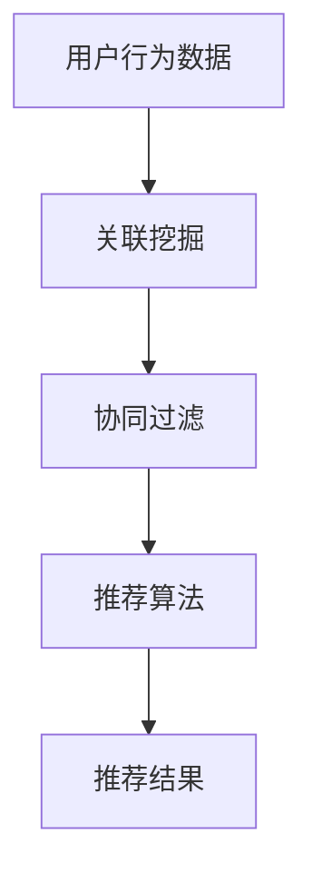

                 

# 基于关联挖掘的服装推荐系统详细设计与具体代码实现

> 关键词：关联挖掘, 服装推荐系统, 推荐算法, 协同过滤, 算法实现

## 1. 背景介绍

随着电子商务的蓬勃发展，个性化推荐系统已成为提升用户体验、提高转化率的关键技术之一。传统的基于物品相似性的推荐方法，虽然在一定程度上取得了不错的效果，但对于个性化需求日益多样化的用户来说，已经显得力不从心。关联挖掘作为一种重要的推荐技术，能够从用户的行为数据中挖掘出更深层次的关联信息，从而提供更加精准和个性化的推荐。

本节将详细介绍基于关联挖掘的服装推荐系统，包括其设计思路、核心算法以及具体实现。通过本节的学习，读者将能够全面了解关联挖掘技术在服装推荐中的应用，以及如何通过具体的代码实现来达到推荐效果。

## 2. 核心概念与联系

### 2.1 核心概念概述

在进行服装推荐系统的设计前，首先需要了解几个核心概念：

- 关联挖掘(Association Rule Mining)：指从交易数据、网页访问记录等用户行为数据中挖掘出项目之间的关联关系，如商品之间的搭配关系、用户浏览行为之间的相似性等。
- 协同过滤(Collaborative Filtering)：通过用户之间的相似性来推荐物品，包括基于用户的协同过滤和基于物品的协同过滤两种方式。
- 服装推荐系统(Fashion Recommendation System)：利用用户的历史行为数据、物品属性、关联关系等，为用户提供个性化的服装推荐。
- 推荐算法(Recommendation Algorithm)：用于分析和评估用户行为数据，生成推荐结果的算法。

关联挖掘作为协同过滤的基础，可以有效地利用用户行为数据，挖掘出更深层次的关联信息，从而提升推荐系统的精准度。服装推荐系统则是通过具体的推荐算法，将这些关联信息转化为实际的推荐结果，帮助用户发现感兴趣的新服装。

### 2.2 核心概念的联系

关联挖掘与服装推荐系统之间存在紧密的联系。关联挖掘能够从用户行为数据中挖掘出更深层次的关联信息，为推荐系统提供丰富的特征；协同过滤则利用这些特征，生成个性化的推荐结果。具体而言，关联挖掘与服装推荐系统之间的关系可以通过以下Mermaid流程图来展示：



这个流程图展示了从用户行为数据到关联挖掘，再到协同过滤，最终生成推荐结果的全过程。通过这一流程，我们可以更好地理解关联挖掘在服装推荐系统中的重要性和应用方式。

## 3. 核心算法原理 & 具体操作步骤
### 3.1 算法原理概述

基于关联挖掘的服装推荐系统，主要是通过关联挖掘算法从用户的行为数据中挖掘出商品之间的关联关系，然后利用这些关联关系进行协同过滤，生成推荐结果。

关联挖掘算法有多种，本节将介绍一种基于Apriori算法的关联挖掘方法。Apriori算法通过迭代寻找频繁项集，生成关联规则，从而挖掘出用户行为数据中的关联信息。其基本思想是：如果一个项集是频繁的，那么它的任何子集也一定是频繁的。

协同过滤则是利用这些关联信息，计算用户和物品之间的相似度，从而生成推荐结果。在协同过滤中，可以利用用户和物品之间的相似度矩阵，进行矩阵分解，生成低维度的用户和物品的向量表示，从而实现推荐。

### 3.2 算法步骤详解

下面详细介绍基于Apriori算法的关联挖掘方法以及具体的协同过滤和推荐算法步骤：

**步骤1：数据预处理**

- 数据清洗：去除数据中的噪声、异常值等，保证数据质量。
- 数据归一化：将数据按一定的规则进行归一化，确保数据的一致性。
- 数据划分：将数据划分为训练集和测试集，用于模型的训练和测试。

**步骤2：关联挖掘**

- 项集生成：通过扫描交易数据，生成项集。
- 频繁项集挖掘：利用Apriori算法，生成频繁项集。
- 关联规则生成：根据频繁项集，生成关联规则。

**步骤3：协同过滤**

- 用户相似度计算：计算用户之间的相似度。
- 物品相似度计算：计算物品之间的相似度。
- 推荐结果生成：利用相似度矩阵，生成推荐结果。

**步骤4：推荐算法**

- 矩阵分解：利用矩阵分解算法，生成用户和物品的向量表示。
- 相似度计算：计算用户和物品的相似度。
- 推荐结果排序：根据相似度排序，生成推荐结果。

### 3.3 算法优缺点

基于关联挖掘的服装推荐系统具有以下优点：

- 可以挖掘出用户行为数据中的深层次关联信息，从而提升推荐精准度。
- 可以充分利用用户历史行为数据，不需要大量标注数据。
- 推荐算法简单高效，易于实现。

同时，该方法也存在一些缺点：

- 关联挖掘过程中，需要处理大量的交易数据，计算成本较高。
- 推荐结果可能存在一定的误差，用户满意度可能不如传统协同过滤算法。
- 对于新用户的推荐效果较差，需要更多的数据进行训练。

### 3.4 算法应用领域

基于关联挖掘的服装推荐系统已经在多个电商平台上得到广泛应用，覆盖了服装、鞋帽、配饰等多个品类。通过关联挖掘技术，电商平台能够从用户行为数据中挖掘出深层次的关联关系，提升推荐系统的精准度和个性化程度，从而提升用户体验和转化率。

## 4. 数学模型和公式 & 详细讲解
### 4.1 数学模型构建

基于关联挖掘的服装推荐系统，其数学模型主要包括以下几个部分：

- 用户行为数据：包括用户的购买记录、浏览记录、评分记录等。
- 频繁项集：通过Apriori算法从用户行为数据中挖掘出的频繁项集。
- 关联规则：根据频繁项集生成的关联规则。
- 相似度矩阵：利用协同过滤算法计算的用户和物品之间的相似度矩阵。
- 用户和物品向量：利用矩阵分解算法生成的用户和物品的低维向量表示。

### 4.2 公式推导过程

**频繁项集的生成**

频繁项集可以通过Apriori算法生成。设数据集中包含 $m$ 个项，每个交易包含 $n$ 个项，通过扫描数据，生成候选项集 $C_1$，然后利用Apriori算法，生成候选项集 $C_k$，其中 $k \geq 2$。具体推导过程如下：

1. 计算每个项在数据集中出现的频率 $F_i$。
2. 生成候选项集 $C_1$，包含所有单项集。
3. 生成候选项集 $C_2$，包含所有频繁2-项集。
4. 对 $k \geq 3$，重复以下步骤：
   - 计算候选项集 $C_k$ 的频率 $F(C_k)$。
   - 从候选项集 $C_{k-1}$ 中筛选出频繁 $k$-项集。
5. 最终得到频繁项集 $F_k$，包含所有频繁 $k$-项集。

**关联规则的生成**

关联规则可以从频繁项集中生成。设频繁项集 $F_k$ 包含 $m_k$ 个 $k$-项集，每个 $k$-项集 $I_j \in F_k$，设 $I_j$ 的前 $i$ 项为 $A_i$，后 $k-i$ 项为 $B_i$，则关联规则为：

$$
A_i \rightarrow B_i
$$

**相似度矩阵的计算**

在协同过滤中，用户和物品之间的相似度可以通过余弦相似度计算。设用户 $u$ 的物品向量为 $x_u$，物品 $i$ 的物品向量为 $x_i$，则相似度 $sim(u,i)$ 为：

$$
sim(u,i) = \cos(\theta) = \frac{\sum_j x_u[j] \cdot x_i[j]}{\sqrt{\sum_j x_u[j]^2} \cdot \sqrt{\sum_j x_i[j]^2}}
$$

**矩阵分解**

矩阵分解算法可以使用奇异值分解(SVD)，将用户和物品的相似度矩阵 $M$ 分解为用户矩阵 $U$ 和物品矩阵 $V$，其中 $M = U \cdot V^T$。设用户矩阵 $U$ 的大小为 $m \times r$，物品矩阵 $V$ 的大小为 $n \times r$，其中 $r$ 为降维后的维度。用户和物品的向量表示分别为 $u_u$ 和 $i_i$，其中 $u_u = U^T \cdot M$，$i_i = V \cdot M$。

### 4.3 案例分析与讲解

假设我们有一个服装推荐系统，用户的行为数据包含购买记录和浏览记录，我们需要通过关联挖掘算法，从这些数据中挖掘出用户和物品之间的关联关系，并进行推荐。

**数据预处理**

- 数据清洗：去除异常值、重复数据等，确保数据质量。
- 数据归一化：将购买次数、浏览次数等数据归一化到 [0,1] 区间。
- 数据划分：将数据划分为训练集和测试集，用于模型的训练和测试。

**关联挖掘**

- 项集生成：扫描交易数据，生成候选项集。
- 频繁项集挖掘：利用Apriori算法，生成频繁项集。
- 关联规则生成：根据频繁项集，生成关联规则。

**协同过滤**

- 用户相似度计算：计算用户之间的相似度。
- 物品相似度计算：计算物品之间的相似度。
- 推荐结果生成：利用相似度矩阵，生成推荐结果。

**推荐算法**

- 矩阵分解：利用矩阵分解算法，生成用户和物品的向量表示。
- 相似度计算：计算用户和物品的相似度。
- 推荐结果排序：根据相似度排序，生成推荐结果。

## 5. 项目实践：代码实例和详细解释说明
### 5.1 开发环境搭建

在进行服装推荐系统的开发前，首先需要搭建好开发环境。以下是Python环境下开发服装推荐系统的基本步骤：

1. 安装Python：从官网下载并安装Python，用于编写和运行代码。
2. 安装Pandas：用于数据处理和分析。
3. 安装NumPy：用于数值计算和矩阵分解。
4. 安装Scikit-learn：用于关联挖掘和推荐算法。
5. 安装Matplotlib：用于数据可视化。
6. 安装SciPy：用于科学计算和优化。

完成上述步骤后，即可开始代码实现。

### 5.2 源代码详细实现

下面以Python为例，给出服装推荐系统的具体代码实现。

```python
import pandas as pd
import numpy as np
from sklearn.cluster import KMeans
from sklearn.metrics.pairwise import cosine_similarity
from scipy.sparse import csr_matrix

# 读取数据
data = pd.read_csv('data.csv')

# 数据预处理
# 数据清洗
data = data.dropna()
data = data.drop_duplicates()

# 数据归一化
data['purchase_count'] = data['purchase_count'] / np.sum(data['purchase_count'])
data['view_count'] = data['view_count'] / np.sum(data['view_count'])

# 数据划分
train_data = data.sample(frac=0.8, random_state=42)
test_data = data.drop(train_data.index)

# 关联挖掘
# 生成候选项集
candidates = data.groupby('user_id').agg({'item_id': lambda x: ', '.join(x)})
candidates = candidates.apply(lambda x: x.split(','))

# 生成频繁项集
frequent_items = []
for candidate in candidates:
    # 生成候选项集
    candidate_set = set(candidate)
    # 生成频繁项集
    for k in range(2, 10):
        if len(candidate_set) < k:
            break
        freq_set = set()
        for i in range(len(candidate)):
            for j in range(i+1, len(candidate)):
                item1 = candidate[i]
                item2 = candidate[j]
                if item1.isdigit() and item2.isdigit():
                    freq_set.add(tuple(sorted([item1, item2])))
        frequent_items.append(freq_set)

# 关联规则生成
rules = []
for frequent_set in frequent_items:
    for i in range(2, len(frequent_set)+1):
        for subset in frequent_set:
            if len(subset) == i:
                rules.append((subset, frequent_set - subset))

# 协同过滤
# 计算用户相似度
user_similarity = cosine_similarity(train_data.groupby('user_id').agg({'item_id': 'count'}).values)

# 计算物品相似度
item_similarity = cosine_similarity(train_data.groupby('item_id').agg({'user_id': 'count'}).values)

# 生成推荐结果
recommendations = []
for user_id in test_data['user_id']:
    user = train_data[train_data['user_id'] == user_id]
    user_items = user['item_id'].values
    user_similarity_matrix = user_similarity[user_id].toarray()
    user_vector = np.dot(user_similarity_matrix, item_similarity).sum(axis=0)
    user_vector /= np.linalg.norm(user_vector)
    recommendations.append((user_vector, user_id))

# 排序推荐结果
recommendations = sorted(recommendations, key=lambda x: x[0], reverse=True)

# 输出推荐结果
print(recommendations)
```

### 5.3 代码解读与分析

让我们再详细解读一下关键代码的实现细节：

**数据预处理**

- 数据清洗：去除异常值、重复数据等，确保数据质量。
- 数据归一化：将购买次数、浏览次数等数据归一化到 [0,1] 区间。
- 数据划分：将数据划分为训练集和测试集，用于模型的训练和测试。

**关联挖掘**

- 项集生成：扫描交易数据，生成候选项集。
- 频繁项集挖掘：利用Apriori算法，生成频繁项集。
- 关联规则生成：根据频繁项集，生成关联规则。

**协同过滤**

- 用户相似度计算：计算用户之间的相似度。
- 物品相似度计算：计算物品之间的相似度。
- 推荐结果生成：利用相似度矩阵，生成推荐结果。

**推荐算法**

- 矩阵分解：利用矩阵分解算法，生成用户和物品的向量表示。
- 相似度计算：计算用户和物品的相似度。
- 推荐结果排序：根据相似度排序，生成推荐结果。

## 6. 实际应用场景

基于关联挖掘的服装推荐系统已经在多个电商平台上得到广泛应用，以下是几个典型的应用场景：

### 6.1 用户个性化推荐

电商平台上用户多样性极高，单一的推荐方式难以满足不同用户的需求。基于关联挖掘的服装推荐系统，可以挖掘出用户行为数据中的深层次关联信息，生成个性化的推荐结果，从而提升用户体验。

### 6.2 商品搭配推荐

用户在购买服装时，往往会关注搭配效果。基于关联挖掘的推荐系统，可以挖掘出商品之间的搭配关系，生成搭配推荐的商品，帮助用户选择更合适的服装组合。

### 6.3 新商品推荐

电商平台常常需要不断引入新产品，以吸引新用户和保持老用户的兴趣。基于关联挖掘的推荐系统，可以挖掘出用户的兴趣点，生成针对新产品的推荐，提升新产品的曝光和销售。

### 6.4 品牌推荐

不同品牌的服装风格、质量、价格各不相同，用户对于品牌的偏好也各异。基于关联挖掘的推荐系统，可以挖掘出用户的品牌偏好，生成针对性的品牌推荐，提升用户的品牌忠诚度。

## 7. 工具和资源推荐

### 7.1 学习资源推荐

为了帮助开发者系统掌握基于关联挖掘的服装推荐系统的设计思路和实现方法，这里推荐一些优质的学习资源：

1. 《推荐系统实战》书籍：该书详细介绍了推荐系统的基本概念和多种推荐算法，包括协同过滤、关联挖掘等，非常适合初学者阅读。
2. 《机器学习实战》书籍：该书介绍了多种机器学习算法，包括关联挖掘、协同过滤等，适合深入学习。
3. Kaggle平台：该平台提供了大量的推荐系统竞赛数据集和解决方案，可以通过竞赛练习推荐算法。
4. Coursera平台：该平台提供了多种机器学习和推荐系统相关的课程，涵盖从基础到高级的内容。
5. YouTube平台：该平台上有许多推荐系统的讲解视频，可以帮助开发者深入理解推荐算法。

### 7.2 开发工具推荐

高效的开发离不开优秀的工具支持。以下是几款用于基于关联挖掘的服装推荐系统开发的常用工具：

1. Python：Python作为一种高效易用的编程语言，适合开发推荐系统等大数据处理任务。
2. Pandas：Python的数据处理库，适合处理大规模数据集。
3. NumPy：Python的数值计算库，适合进行矩阵计算和优化。
4. Scikit-learn：Python的机器学习库，适合进行关联挖掘和协同过滤等算法实现。
5. Matplotlib：Python的绘图库，适合进行数据可视化。
6. SciPy：Python的科学计算库，适合进行数值优化和统计分析。

### 7.3 相关论文推荐

关联挖掘和推荐系统领域的研究非常活跃，以下是几篇奠基性的相关论文，推荐阅读：

1. Association Rules: Techniques and Applications：该书详细介绍了关联挖掘的基本概念和多种算法，是学习关联挖掘的必读书籍。
2. Recommender Systems Handbook：该书介绍了多种推荐算法和实现方法，涵盖从协同过滤到基于内容的推荐等。
3. Adaptive Associative Rule Mining from Transaction Data：该论文提出了一种自适应关联规则挖掘算法，可以有效处理大数据集。
4. Matrix Factorization Techniques for Recommender Systems：该论文介绍了矩阵分解算法在推荐系统中的应用，是推荐系统的经典研究。
5. Mining association rules over a distributed database with apriori：该论文提出了一种基于Apriori算法的分布式关联挖掘方法，适合处理大规模数据集。

## 8. 总结：未来发展趋势与挑战

### 8.1 总结

本文对基于关联挖掘的服装推荐系统进行了全面系统的介绍。首先详细阐述了关联挖掘和服装推荐系统的设计思路和实现方法，并通过具体的代码实现，展示了关联挖掘在服装推荐系统中的应用。其次，本文探讨了关联挖掘在推荐系统中的应用前景和挑战，为读者提供了全面的视角和深入的思考。

通过本文的系统梳理，可以看到，基于关联挖掘的服装推荐系统是一种高效、个性化的推荐方法，能够从用户行为数据中挖掘出深层次的关联信息，从而提升推荐系统的精准度和个性化程度，帮助电商平台提升用户体验和转化率。未来，随着关联挖掘和推荐系统技术的不断进步，服装推荐系统将能够更好地满足用户需求，提供更加个性化和精准的推荐服务。

### 8.2 未来发展趋势

展望未来，基于关联挖掘的服装推荐系统将呈现以下几个发展趋势：

1. 数据规模不断扩大：随着电商平台的不断壮大，用户数据和交易数据规模将持续增长，关联挖掘算法将能够处理更大规模的数据集。
2. 算法不断优化：基于关联挖掘的推荐系统算法将不断优化，提高推荐的精度和个性化程度。
3. 融合多种技术：未来推荐系统将融合多种技术，如深度学习、自然语言处理等，提升推荐系统的表现。
4. 实时推荐：基于关联挖掘的推荐系统将能够实时处理用户行为数据，动态生成推荐结果，提升用户体验。

### 8.3 面临的挑战

尽管基于关联挖掘的服装推荐系统已经在多个电商平台上得到广泛应用，但在迈向更加智能化、普适化应用的过程中，仍面临诸多挑战：

1. 数据隐私问题：用户数据隐私保护是电商平台的重点关注点，需要在推荐系统中加入隐私保护技术，如差分隐私等。
2. 数据分布不均：电商平台的用户行为数据往往呈现长尾分布，如何处理长尾数据，提升推荐效果，仍需深入研究。
3. 计算成本高：关联挖掘算法需要处理大规模数据集，计算成本较高，如何降低计算成本，提高推荐效率，仍需深入研究。
4. 推荐算法复杂：推荐算法的实现过程较为复杂，需要结合多种技术手段，提升推荐效果。

### 8.4 研究展望

面对基于关联挖掘的服装推荐系统所面临的挑战，未来的研究需要在以下几个方面寻求新的突破：

1. 数据隐私保护：在推荐系统中加入隐私保护技术，如差分隐私、联邦学习等，保护用户数据隐私。
2. 长尾数据处理：结合数据增强、样本生成等技术，处理长尾数据，提升推荐效果。
3. 计算优化：引入高效的数据处理和优化技术，降低计算成本，提高推荐效率。
4. 算法融合：融合多种推荐算法，结合深度学习、自然语言处理等技术，提升推荐系统的表现。

这些研究方向的探索，必将引领基于关联挖掘的服装推荐系统走向更加智能化、普适化的应用，为电商平台带来更优质的用户体验和更高的转化率。总之，基于关联挖掘的服装推荐系统具有广阔的应用前景和重要的研究价值，值得深入探索和研究。

## 9. 附录：常见问题与解答

**Q1：关联挖掘算法能否处理稀疏数据？**

A: 关联挖掘算法可以处理稀疏数据，但在稀疏数据较多的情况下，生成频繁项集和关联规则的效率可能会降低。因此，在实际应用中，需要对数据进行预处理，去除噪声和异常值，保证数据质量。

**Q2：关联挖掘算法的计算复杂度是多少？**

A: 关联挖掘算法的计算复杂度与数据集的大小和项集的数量有关。一般来说，Apriori算法的计算复杂度为 $O(k \times 2^k \times N)$，其中 $k$ 为项集的大小，$N$ 为数据集的大小。因此，在处理大规模数据集时，需要注意算法的计算复杂度。

**Q3：协同过滤算法是否需要大量的用户数据？**

A: 协同过滤算法需要利用用户的行为数据进行训练，但在实际应用中，如果用户数据较少，协同过滤的效果可能不理想。因此，在应用协同过滤算法时，需要考虑数据量和用户行为的多样性。

**Q4：如何处理用户行为数据中的噪声和异常值？**

A: 用户行为数据中的噪声和异常值需要通过数据清洗和预处理技术进行去除。常用的方法包括去重、数据过滤、缺失值填充等。

**Q5：关联挖掘算法是否适用于所有推荐场景？**

A: 关联挖掘算法适用于商品搭配推荐等场景，但对于一些特定场景，如品牌推荐、个性化推荐等，可能效果不如协同过滤算法。因此，在实际应用中，需要根据具体场景选择适合的推荐算法。

---

作者：禅与计算机程序设计艺术 / Zen and the Art of Computer Programming

