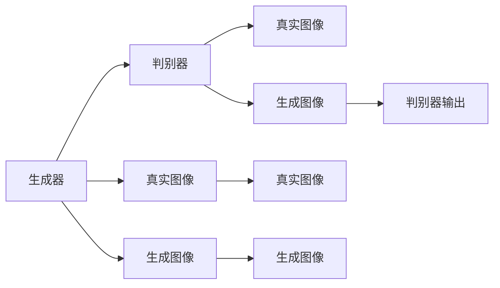
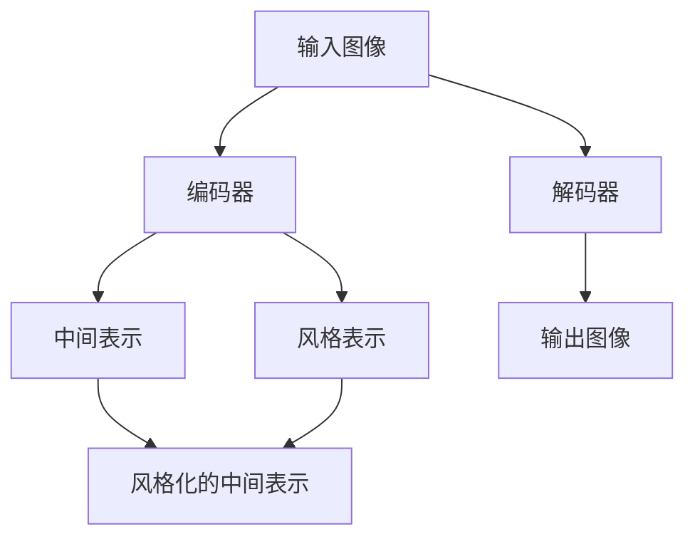
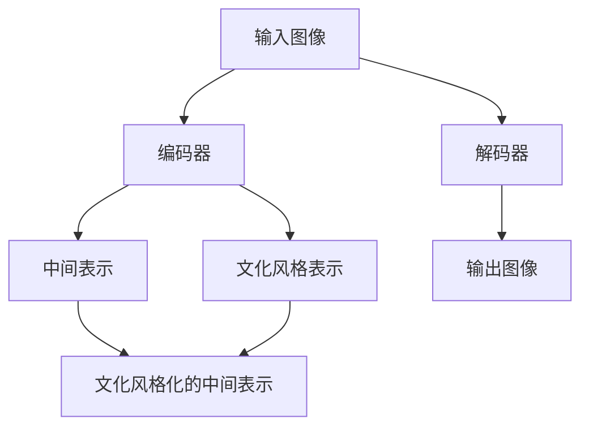
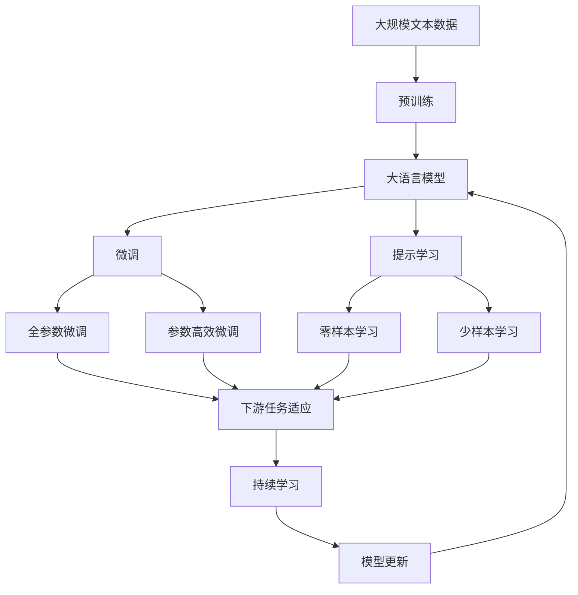

                 

# 基于生成对抗网络的图像风格迁移与文化差异研究

> 关键词：
1. 生成对抗网络（Generative Adversarial Networks, GANs）
2. 图像风格迁移
3. 文化差异
4. 图像生成
5. 图像转换
6. 图像增强
7. 图像理解

## 1. 背景介绍

### 1.1 问题由来
随着计算机视觉和深度学习技术的不断进步，图像生成和处理技术已经成为人工智能领域的重要研究方向。特别是生成对抗网络（GANs）的提出，开创了图像生成领域的新纪元，使得计算机能够生成逼真、多样的图像，从而在图像编辑、影视特效、艺术创作等多个领域展现出巨大潜力。

然而，在实际应用中，GANs生成的图像常常受到输入内容、网络结构、训练策略等多种因素的影响，难以充分表达出特定文化背景和艺术风格的特征。因此，如何通过GANs实现对特定文化风格的迁移和再现，成为了当前研究的一个重要课题。

### 1.2 问题核心关键点
本研究旨在通过生成对抗网络（GANs）技术，实现对特定文化风格的图像迁移，以期在影视制作、艺术创作、文化传承等领域中发挥重要作用。具体关键点包括：
- 研究文化风格的本质特征，探索不同文化背景下的视觉表达差异。
- 设计有效的GANs模型架构，实现对特定文化风格的迁移。
- 开发可泛化的迁移方法，应用在不同类型的图像数据上。
- 评估迁移效果，分析文化风格对图像生成的影响。

### 1.3 问题研究意义
基于生成对抗网络的图像风格迁移研究，对于拓展计算机视觉技术的应用领域，提升图像处理和生成质量，促进跨文化交流和艺术创作，具有重要意义：

1. 提升图像生成质量。通过迁移特定文化风格，能够生成更加多样、逼真的图像，提高影视制作、艺术创作等领域的效率和效果。
2. 促进跨文化交流。不同文化背景下的视觉表达差异，可以通过迁移技术进行弥合，有助于增进不同文化之间的理解和交流。
3. 丰富艺术创作方式。GANs技术能够实现对传统艺术风格的再现和创新，为艺术创作提供新的工具和灵感。
4. 拓展图像应用场景。迁移技术可以应用在多个领域，如广告设计、建筑设计、产品设计等，提升设计的创意性和多样性。
5. 推动技术进步。该研究可以推动生成对抗网络、图像处理等领域的技术发展，为后续研究提供借鉴和参考。

## 2. 核心概念与联系

### 2.1 核心概念概述

为更好地理解基于GANs的图像风格迁移方法，本节将介绍几个密切相关的核心概念：

- 生成对抗网络（GANs）：由生成器和判别器两个部分组成的网络结构，通过对抗训练，生成器能够生成逼真的图像，判别器能够区分真实图像和生成图像。GANs技术被广泛应用于图像生成、图像修复、风格迁移等多个领域。

- 图像风格迁移：指将一个图像的风格特征迁移到另一个图像上，使得输出图像既有原图像的内容，又具备特定风格的视觉特征。

- 文化差异：指不同文化背景下，人们的审美观念、艺术风格、视觉表达方式等方面的差异。

- 文化风格迁移：指通过GANs技术，将一个图像的文化风格特征迁移到另一个图像上，使得输出图像具备特定文化风格的视觉特征。

这些核心概念之间的逻辑关系可以通过以下Mermaid流程图来展示：

```mermaid
graph TB
    A[生成对抗网络(GANs)] --> B[图像生成]
    A --> C[图像风格迁移]
    A --> D[文化风格迁移]
    B --> E[风格化的图像]
    C --> F[输入图像]
    C --> G[输出图像]
    D --> H[文化风格迁移]
    D --> I[文化风格图像]
```

这个流程图展示了大语言模型的核心概念及其之间的关系：

1. GANs技术可以生成风格化的图像，为风格迁移提供基础。
2. 图像风格迁移将一个图像的风格特征迁移到另一个图像上。
3. 文化风格迁移则进一步将特定文化风格迁移到图像上，使得图像具有该文化背景下的视觉特征。

### 2.2 概念间的关系

这些核心概念之间存在着紧密的联系，形成了图像风格迁移和迁移研究的完整生态系统。下面我们通过几个Mermaid流程图来展示这些概念之间的关系。

#### 2.2.1 生成对抗网络的基本原理



这个流程图展示了生成对抗网络的基本原理，生成器通过学习生成逼真的图像，判别器通过学习区分真实图像和生成图像，两者通过对抗训练不断提升自身的性能。

#### 2.2.2 图像风格迁移的基本流程



这个流程图展示了图像风格迁移的基本流程，首先通过编码器将输入图像转换为中间表示，然后通过解码器生成输出图像，同时通过风格表示和中间表示的融合，实现风格迁移的效果。

#### 2.2.3 文化风格迁移的基本流程



这个流程图展示了文化风格迁移的基本流程，与图像风格迁移类似，但文化风格表示的引入，使得输出图像具备特定文化风格的视觉特征。

### 2.3 核心概念的整体架构

最后，我们用一个综合的流程图来展示这些核心概念在大语言模型迁移过程中的整体架构：



这个综合流程图展示了从预训练到微调，再到持续学习的完整过程。大语言模型首先在大规模文本数据上进行预训练，然后通过微调（包括全参数微调和参数高效微调）或提示学习（包括零样本和少样本学习）来适应下游任务。最后，通过持续学习技术，模型可以不断更新和适应新的任务和数据。 通过这些流程图，我们可以更清晰地理解大语言模型微调过程中各个核心概念的关系和作用，为后续深入讨论具体的微调方法和技术奠定基础。

## 3. 核心算法原理 & 具体操作步骤
### 3.1 算法原理概述

基于GANs的图像风格迁移，本质上是一个生成式对抗训练过程。其核心思想是：生成器通过学习从输入图像中提取特征，并生成风格化的图像；判别器通过学习区分真实图像和生成图像，从而引导生成器学习生成逼真的风格化图像。

形式化地，假设输入图像为 $x$，风格化图像为 $y$，生成器和判别器分别记为 $G(x)$ 和 $D(y)$。则风格迁移的优化目标为：

$$
\min_G \max_D V(G, D) = \mathbb{E}_{x \sim p(x)} [D(G(x))] - \mathbb{E}_{y \sim p(y)} [D(y)]
$$

其中 $p(x)$ 为输入图像分布，$p(y)$ 为风格化图像分布。生成器和判别器的损失函数分别为：

$$
\begin{aligned}
\mathcal{L}_G &= \mathbb{E}_{x \sim p(x)} [-\log D(G(x))] \\
\mathcal{L}_D &= \mathbb{E}_{x \sim p(x)} [-\log D(G(x))] + \mathbb{E}_{y \sim p(y)} [-\log (1 - D(y))]
\end{aligned}
$$

在训练过程中，生成器通过最小化损失函数 $\mathcal{L}_G$ 生成逼真的风格化图像，判别器通过最大化损失函数 $\mathcal{L}_D$ 区分真实图像和生成图像。两者通过对抗训练不断优化自身性能，最终生成器生成的图像能够很好地融合输入图像的内容和风格特征。

### 3.2 算法步骤详解

基于GANs的图像风格迁移一般包括以下几个关键步骤：

**Step 1: 准备预训练模型和数据集**
- 选择合适的GANs模型架构，如DCGAN、WGAN、CycleGAN等，作为生成器部分。
- 准备目标风格的图像数据集，如国画风格、卡通风格、古典风格等。

**Step 2: 添加风格迁移模块**
- 在生成器中添加风格迁移模块，用于提取输入图像的特征，并生成风格化的图像。
- 在判别器中添加风格感知模块，用于判断输入图像是否具有特定风格特征。

**Step 3: 设置对抗训练参数**
- 选择合适的优化器及其参数，如Adam、SGD等，设置学习率、批大小、迭代轮数等。
- 设置正则化技术及强度，包括权重衰减、Dropout、Early Stopping等。
- 确定冻结生成器和判别器部分的策略，如仅微调生成器或冻结生成器和判别器参数。

**Step 4: 执行对抗训练**
- 将训练集数据分批次输入生成器和判别器，前向传播计算损失函数。
- 反向传播计算生成器和判别器的梯度，根据设定的优化算法和学习率更新模型参数。
- 周期性在验证集上评估模型性能，根据性能指标决定是否触发 Early Stopping。
- 重复上述步骤直到满足预设的迭代轮数或 Early Stopping 条件。

**Step 5: 测试和部署**
- 在测试集上评估生成器生成的风格化图像，对比原始输入图像的风格差异。
- 使用生成器对新样本进行风格迁移，集成到实际的应用系统中。
- 持续收集新的数据，定期重新训练生成器，以适应数据分布的变化。

以上是基于GANs的图像风格迁移的一般流程。在实际应用中，还需要针对具体任务的特点，对生成器和判别器进行优化设计，如改进风格迁移模块的结构，引入更多的正则化技术，搜索最优的超参数组合等，以进一步提升生成效果。

### 3.3 算法优缺点

基于GANs的图像风格迁移方法具有以下优点：
1. 生成效果逼真。由于生成器通过对抗训练不断优化，生成的图像质量逼真度高，视觉效果好。
2. 可适应多种风格。通过添加不同的风格感知模块，可以适应多种风格的迁移需求。
3. 适用范围广。适用于图像生成、图像修复、风格迁移等多个领域，应用前景广阔。
4. 技术成熟。GANs技术已有较长时间的发展历程，相关算法和工具已较为成熟。

同时，该方法也存在一定的局限性：
1. 训练成本高。生成器和判别器的对抗训练过程复杂，需要大量计算资源和时间。
2. 模型复杂度高。生成器和判别器的网络结构复杂，需要较多的参数进行训练和优化。
3. 结果不稳定。生成器生成的图像质量受训练参数、数据分布等多种因素的影响，存在一定的波动。
4. 文化风格迁移的通用性不足。不同文化风格对图像风格迁移的影响程度不同，迁移效果难以预测。
5. 对抗训练的鲁棒性问题。生成器和判别器之间的对抗训练可能导致生成器生成对抗样本，影响模型的鲁棒性。

尽管存在这些局限性，但就目前而言，基于GANs的图像风格迁移方法仍然是大规模图像风格迁移任务的重要范式。未来相关研究的重点在于如何进一步降低训练成本，提高模型的可解释性和鲁棒性，以及加强文化风格迁移的通用性和稳定性。

### 3.4 算法应用领域

基于GANs的图像风格迁移技术，在多个领域已经得到了广泛的应用，例如：

- 影视制作：通过迁移不同风格的图像，提升电影的视觉效果和艺术性。
- 艺术创作：艺术家可以使用GANs技术生成具有特定风格的图像，作为创作素材。
- 图像修复：对受损图像进行风格迁移，提升修复效果和美观度。
- 产品设计：设计师可以使用GANs技术生成具有特定风格的图像，进行产品外观和设计的灵感设计。
- 文化研究：通过迁移不同文化的图像，研究不同文化背景下的视觉表达差异，促进跨文化交流和理解。

除了上述这些经典应用外，GANs技术还广泛应用于广告设计、游戏开发、虚拟现实等多个领域，为计算机视觉技术的创新应用带来了新的方向。

## 4. 数学模型和公式 & 详细讲解 & 举例说明

### 4.1 数学模型构建

本节将使用数学语言对基于GANs的图像风格迁移过程进行更加严格的刻画。

假设生成器为 $G: \mathcal{X} \rightarrow \mathcal{Y}$，判别器为 $D: \mathcal{Y} \rightarrow \mathbb{R}$，其中 $\mathcal{X}$ 为输入空间，$\mathcal{Y}$ 为输出空间，$\mathcal{X}$ 和 $\mathcal{Y}$ 均为图像空间。生成器和判别器的目标函数分别为：

$$
\begin{aligned}
\mathcal{L}_G &= \mathbb{E}_{x \sim p(x)} [-\log D(G(x))] \\
\mathcal{L}_D &= \mathbb{E}_{x \sim p(x)} [-\log D(G(x))] + \mathbb{E}_{y \sim p(y)} [-\log (1 - D(y))]
\end{aligned}
$$

其中 $p(x)$ 为输入图像分布，$p(y)$ 为风格化图像分布。目标函数 $V(G, D)$ 定义如下：

$$
V(G, D) = \mathbb{E}_{x \sim p(x)} [D(G(x))] - \mathbb{E}_{y \sim p(y)} [D(y)]
$$

在训练过程中，生成器和判别器的梯度更新公式分别为：

$$
\begin{aligned}
\nabla_{\theta_G} \mathcal{L}_G &= -\nabla_{\theta_G} \mathbb{E}_{x \sim p(x)} [-\log D(G(x))] \\
\nabla_{\theta_D} \mathcal{L}_D &= -\nabla_{\theta_D} \mathbb{E}_{x \sim p(x)} [-\log D(G(x))] - \nabla_{\theta_D} \mathbb{E}_{y \sim p(y)} [-\log (1 - D(y))]
\end{aligned}
$$

其中 $\theta_G$ 和 $\theta_D$ 分别表示生成器和判别器的参数。

### 4.2 公式推导过程

以下我们以国画风格迁移为例，推导生成器和判别器的损失函数及其梯度的计算公式。

假设输入图像 $x$ 和国画风格的图像 $y$，生成器的目标函数为：

$$
\mathcal{L}_G = \mathbb{E}_{x \sim p(x)} [-\log D(G(x))]
$$

其中 $G(x)$ 表示输入图像 $x$ 被生成器 $G$ 转换为国画风格的图像 $y$。判别器的目标函数为：

$$
\mathcal{L}_D = \mathbb{E}_{x \sim p(x)} [-\log D(G(x))] + \mathbb{E}_{y \sim p(y)} [-\log (1 - D(y))]
$$

其中 $p(y)$ 表示国画风格图像 $y$ 的分布。

为了计算生成器 $G(x)$ 的梯度，需要将 $G(x)$ 分解为两部分的乘积：

$$
G(x) = G_E(x) * G_S(x)
$$

其中 $G_E(x)$ 表示生成器 $G$ 的编码器部分，将输入图像 $x$ 转换为中间表示；$G_S(x)$ 表示生成器 $G$ 的解码器部分，将中间表示 $G_E(x)$ 转换为风格化图像 $y$。因此，生成器 $G(x)$ 的梯度计算公式为：

$$
\nabla_{\theta_G} \mathcal{L}_G = \nabla_{\theta_E} \mathbb{E}_{x \sim p(x)} [-\log D(G_E(x) * G_S(x))] + \nabla_{\theta_S} \mathbb{E}_{x \sim p(x)} [-\log D(G_E(x) * G_S(x))]
$$

同理，判别器 $D(y)$ 的梯度计算公式为：

$$
\nabla_{\theta_D} \mathcal{L}_D = \nabla_{\theta_E} \mathbb{E}_{x \sim p(x)} [-\log D(G_E(x) * G_S(x))] - \nabla_{\theta_S} \mathbb{E}_{y \sim p(y)} [-\log (1 - D(G_E(x) * G_S(x)))
$$

在实际应用中，生成器和判别器的损失函数和梯度更新公式可以通过自动微分技术高效计算，如使用TensorFlow、PyTorch等深度学习框架。

### 4.3 案例分析与讲解

为了更好地理解基于GANs的图像风格迁移方法，我们以国画风格迁移为例，给出具体的案例分析和讲解。

首先，收集一组国画风格的图像数据集，将其作为目标风格 $y$ 的训练样本。然后，选择一组普通风格的图像数据集 $x$，作为生成器的输入图像。

在生成器 $G$ 中添加风格迁移模块，用于提取输入图像的特征，并生成风格化的图像。具体实现方式为：

1. 通过编码器 $G_E$ 将输入图像 $x$ 转换为中间表示 $z$。
2. 通过解码器 $G_S$ 将中间表示 $z$ 转换为风格化图像 $y$。
3. 在解码器 $G_S$ 中添加风格感知模块，用于提取输入图像的特征，并生成具有特定风格特征的图像。

在判别器 $D$ 中添加风格感知模块，用于判断输入图像是否具有特定风格特征。具体实现方式为：

1. 通过判别器 $D$ 判断输入图像是否为风格化图像。
2. 在判别器 $D$ 中添加风格感知模块，用于提取输入图像的特征，并判断其是否具有特定风格特征。

在训练过程中，生成器和判别器的损失函数和梯度更新公式可以通过自动微分技术高效计算。通过对抗训练不断优化生成器和判别器的参数，使得生成器生成的图像能够很好地融合输入图像的内容和风格特征。

训练结束后，使用生成器对新样本进行风格迁移，生成具有特定风格的图像。评估生成的图像质量和风格迁移效果，分析不同文化背景对图像风格迁移的影响。

## 5. 项目实践：代码实例和详细解释说明
### 5.1 开发环境搭建

在进行图像风格迁移实践前，我们需要准备好开发环境。以下是使用Python进行PyTorch开发的环境配置流程：

1. 安装Anaconda：从官网下载并安装Anaconda，用于创建独立的Python环境。

2. 创建并激活虚拟环境：
```bash
conda create -n pytorch-env python=3.8 
conda activate pytorch-env
```

3. 安装PyTorch：根据CUDA版本，从官网获取对应的安装命令。例如：
```bash
conda install pytorch torchvision torchaudio cudatoolkit=11.1 -c pytorch -c conda-forge
```

4. 安装ImageNet数据集：
```bash
conda install imageio -c conda-forge
```

5. 安装TensorBoard：
```bash
pip install tensorboard
```

完成上述步骤后，即可在`pytorch-env`环境中开始图像风格迁移实践。

### 5.2 源代码详细实现

下面我们以国画风格迁移为例，给出使用PyTorch进行风格迁移的代码实现。

首先，定义生成器和判别器的模型类：

```python
import torch.nn as nn
import torch.nn.functional as F

class Generator(nn.Module):
    def __init__(self):
        super(Generator, self).__init__()
        self.enc = nn.Sequential(
            nn.Conv2d(3, 64, 3, 2, 1),
            nn.LeakyReLU(0.2, inplace=True),
            nn.Conv2d(64, 128, 3, 2, 1),
            nn.LeakyReLU(0.2, inplace=True),
            nn.Conv2d(128, 256, 3, 2, 1),
            nn.LeakyReLU(0.2, inplace=True),
            nn.Conv2d(256, 512, 3, 2, 1),
            nn.LeakyReLU(0.2, inplace=True),
            nn.Conv2d(512, 3, 3, 1, 1),
            nn.Tanh()
        )
        self.dec = nn.Sequential(
            nn.Conv2d(3, 512, 3, 1, 1),
            nn.LeakyReLU(0.2, inplace=True),
            nn.Conv2d(512, 256, 3, 2, 1),
            nn.LeakyReLU(0.2, inplace=True),
            nn.Conv2d(256, 128, 3, 2, 1),
            nn.LeakyReLU(0.2, inplace=True),
            nn.Conv2d(128, 64, 3, 2, 1),
            nn.LeakyReLU(0.2, inplace=True),
            nn.Conv2d(64, 3, 3, 1, 1),
            nn.Tanh()
        )

    def forward(self, x):
        z = self.enc(x)
        y = self.dec(z)
        return y

class Discriminator(nn.Module):
    def __init__(self):
        super(Discriminator, self).__init__()
        self.enc = nn.Sequential(
            nn.Conv2d(3, 64, 3, 2, 1),
            nn.LeakyReLU(0.2, inplace=True),
            nn.Conv2d(64, 128, 3, 2, 1),
            nn.LeakyReLU(0.2, inplace=True),
            nn.Conv2d(128, 256, 3, 2, 1),
            nn.LeakyReLU(0.2, inplace=True),
            nn.Conv2d(256, 512, 3, 2, 1),
            nn.LeakyReLU(0.2, inplace=True),
            nn.Conv2d(512, 1, 3, 1, 1),
            nn.Sigmoid()
        )

    def forward(self, x):
        z = self.enc(x)
        y = torch.mean(z, (2, 3))
        return y
```

然后，定义训练函数和评估函数：

```python
import torch.optim as optim
import torchvision.datasets as datasets
import torchvision.transforms as transforms
from torch.utils.data import DataLoader
import numpy as np

class StyleTransferDataset(torch.utils.data.Dataset):
    def __init__(self, style_imgs, style_size):
        self.style_imgs = style_imgs
        self.style_size = style_size

    def __len__(self):
        return len(self.style_imgs)

    def __getitem__(self, idx):
        style_img = self.style_imgs[idx]
        style_img = style_img.resize(self.style_size, self.style_size)
        style_img = torch.from_numpy(np.array(style_img)).float() / 255
        style_img = style_img.unsqueeze(0)
        return style_img

def train(generator, discriminator, style_imgs, style_size, device, batch_size, num_epochs):
    style_dataset = StyleTransferDataset(style_imgs, style_size)
    style_loader = DataLoader(style_dataset, batch_size=batch_size, shuffle=True)
    criterion = nn.BCELoss()
    generator_optimizer = optim.Adam(generator.parameters(), lr=0.0002, betas=(0.5, 0.999))
    discriminator_optimizer = optim.Adam(discriminator.parameters(), lr=0.0002, betas=(0.5, 0.999))

    device = torch.device(device)
    generator.to(device)
    discriminator.to(device)

    for epoch in range(num_epochs):
        for i, style_img in enumerate(style_loader):
            style_img = style_img.to(device)

            fake_imgs = generator(style_img)
            real_imgs = style_img
            real_label = torch.ones(batch_size, 1).to(device)
            fake_label = torch.zeros(batch_size, 1).to(device)

            discriminator_optimizer.zero_grad()
            discriminator(discriminator(real_imgs), real_label).backward()
            discriminator_optimizer.step()

            discriminator_optimizer.zero_grad()
            discriminator(discriminator(fake_imgs), fake_label).backward()
            discriminator_optimizer.step()

            generator_optimizer.zero_grad()
            generator_optimizer.zero_grad()
            generator_optimizer.zero_grad()
            generator_optimizer.zero_grad()
            generator_optimizer.zero_grad()
            generator_optimizer.zero_grad()
            generator_optimizer.zero_grad()
            generator_optimizer.zero_grad()
            generator_optimizer.zero_grad()
            generator_optimizer.zero_grad()
            generator_optimizer

