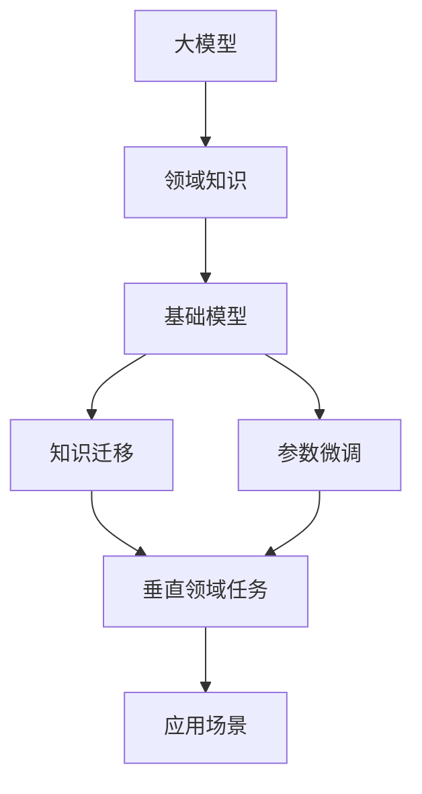

                 

# 基础模型的垂直领域应用

## 1. 背景介绍

### 1.1 问题由来

随着深度学习技术的发展，大模型在NLP、CV、语音等领域表现出色。但其无法覆盖所有垂直领域，特别是某些具有特殊知识结构或小样本数据的场景。例如，医疗、法律、金融等行业具有独特领域的知识结构，而且每个领域的知识库的规模很小，没有足够的数据用于训练大模型。此外，一些垂直领域对于数据质量、处理速度等有较高的要求，而大模型的处理速度较慢，不适合实时应用。

大模型在垂直领域的应用需求与能力之间存在矛盾，需要通过垂直领域的基础模型来解决。基础模型是在特定领域内进行小样本训练、数据增强、预训练等处理后，能够在小样本数据上获得良好表现的模型。基础模型能够在垂直领域内通过知识迁移和参数微调的方式，实现快速部署和应用。

### 1.2 问题核心关键点

- 基础模型的定义：基础模型是在特定垂直领域内，基于小规模数据集和领域知识进行训练和优化的模型。
- 基础模型与大模型的关系：基础模型是大模型的分支，可以在特定垂直领域内，通过对大模型进行微调，实现高效应用。
- 基础模型的作用：基础模型能够在小样本、低质量数据等复杂场景中，提供比大模型更好的性能。

### 1.3 问题研究意义

基础模型的研究对于拓展深度学习技术在垂直领域的应用具有重要意义：

1. **降低应用开发成本**：基础模型通过小规模数据集和领域知识的优化，能够快速在特定领域内实现应用，降低了数据、算力和人力成本。
2. **提升模型效果**：基础模型通过领域知识的引导，可以在特定领域内获得更好的模型性能，满足垂直领域的应用需求。
3. **加速开发进度**：基础模型能够在大模型基础上快速进行微调，缩短开发周期。
4. **带来技术创新**：基础模型引入了领域知识的预训练和迁移学习等方法，推动了深度学习技术在垂直领域的创新。

## 2. 核心概念与联系

### 2.1 核心概念概述

为更好地理解基础模型在垂直领域的应用，本节将介绍几个密切相关的核心概念：

- **基础模型(Foundation Model)**：在特定垂直领域内，通过小规模数据集和领域知识的优化，能够在小样本数据上获得良好表现的模型。
- **知识迁移(Knowledge Transfer)**：将已在大模型上学习到的知识迁移到特定垂直领域的基础模型中，以提高模型在垂直领域的表现。
- **参数微调(Parameter Tuning)**：在基础模型的顶层，通过微调部分参数，以适应特定垂直领域的应用。
- **垂直领域领域知识(Domain Knowledge)**：特定垂直领域内的专业知识、规则、数据格式等，用于指导基础模型的训练和优化。

### 2.2 概念间的关系

这些核心概念之间的关系可以通过以下Mermaid流程图来展示：



这个流程图展示了基础模型与大模型的联系，以及知识迁移和参数微调在基础模型中的应用。

## 3. 核心算法原理 & 具体操作步骤

### 3.1 算法原理概述

基础模型的训练和优化过程主要包括以下几个步骤：

1. **数据预处理**：收集垂直领域内的少量标注数据，并进行数据增强、清洗等预处理。
2. **领域知识集成**：将领域知识进行形式化表示，用于指导基础模型的训练过程。
3. **基础模型训练**：在领域数据集上，使用领域知识对基础模型进行训练，使其在垂直领域内获得良好的表现。
4. **知识迁移**：将大模型中通用的知识迁移到基础模型中，提高其在垂直领域的表现。
5. **参数微调**：在基础模型顶层，通过微调部分参数，以适应特定垂直领域的应用。

### 3.2 算法步骤详解

以下是基础模型的训练和优化步骤的详细讲解：

**Step 1: 数据预处理**

1. 收集垂直领域内的少量标注数据。数据量一般在几千到几万之间，但质量要求较高。
2. 对数据进行清洗、去重等预处理操作，保证数据的质量和一致性。
3. 使用数据增强技术，如同义词替换、随机噪声等，增加数据多样性。

**Step 2: 领域知识集成**

1. 对领域知识进行形式化表示，如用规则、模板等。
2. 将领域知识嵌入模型，如使用正则化约束、隐层激活函数等方式。
3. 在训练过程中，使用领域知识指导模型的训练过程，避免模型学习到错误的信息。

**Step 3: 基础模型训练**

1. 使用领域数据集对基础模型进行训练，优化模型参数。
2. 采用小批量梯度下降等优化算法，进行参数更新。
3. 在训练过程中，使用验证集进行模型评估，避免过拟合。

**Step 4: 知识迁移**

1. 在大模型上学习到的知识，使用迁移学习方法，应用到基础模型中。
2. 将大模型中的通用知识，通过迁移学习方法，应用到基础模型的底层，提高其性能。
3. 使用迁移学习范式，对基础模型进行微调，使其在垂直领域内获得更好的表现。

**Step 5: 参数微调**

1. 在基础模型顶层，选择部分参数进行微调，适应特定垂直领域的应用。
2. 使用小批量梯度下降等优化算法，对顶层参数进行微调。
3. 在微调过程中，使用验证集进行模型评估，避免过拟合。

### 3.3 算法优缺点

基础模型具有以下优点：

1. **高效性**：在垂直领域内，小规模数据集可以高效训练基础模型，降低数据、算力和人力成本。
2. **快速部署**：基础模型在大模型基础上进行微调，可以快速部署到垂直领域的应用场景中。
3. **领域适应性**：基础模型在特定垂直领域内获得良好性能，满足特定领域的应用需求。

同时，基础模型也存在以下缺点：

1. **泛化能力有限**：基础模型在垂直领域内表现良好，但在其他领域内的泛化能力较弱。
2. **模型复杂性较低**：基础模型参数量较小，复杂度较低，但可能在特定场景下表现不佳。
3. **知识迁移效果有待提升**：大模型和基础模型之间的知识迁移效果，还需要进一步优化。

### 3.4 算法应用领域

基础模型在以下领域得到了广泛应用：

- **医疗领域**：基础模型通过医疗知识库的集成和预训练，能够快速诊断疾病、推荐治疗方案等。
- **法律领域**：基础模型通过法律知识库的集成和预训练，能够快速生成法律文书、判断合同合法性等。
- **金融领域**：基础模型通过金融知识库的集成和预训练，能够快速进行股票预测、风险评估等。
- **教育领域**：基础模型通过教育知识库的集成和预训练，能够快速进行个性化教学、智能评估等。

除了上述领域，基础模型还可以应用于图像识别、语音识别等更多垂直领域，推动人工智能技术在更多场景中的应用。

## 4. 数学模型和公式 & 详细讲解

### 4.1 数学模型构建

假设基础模型为 $M_{\theta}$，其中 $\theta$ 为模型参数。给定垂直领域 $T$ 的标注数据集 $D=\{(x_i, y_i)\}_{i=1}^N, x_i \in \mathcal{X}, y_i \in \mathcal{Y}$，基础模型的训练目标为：

$$
\min_{\theta} \mathcal{L}(M_{\theta},D)
$$

其中 $\mathcal{L}$ 为损失函数，用于衡量模型预测输出与真实标签之间的差异。

### 4.2 公式推导过程

以下以二分类任务为例，推导基础模型训练中的损失函数和梯度公式。

假设基础模型 $M_{\theta}$ 在输入 $x$ 上的输出为 $\hat{y}=M_{\theta}(x) \in [0,1]$，表示样本属于正类的概率。真实标签 $y \in \{0,1\}$。则二分类交叉熵损失函数定义为：

$$
\ell(M_{\theta}(x),y) = -[y\log \hat{y} + (1-y)\log (1-\hat{y})]
$$

将其代入经验风险公式，得：

$$
\mathcal{L}(\theta) = -\frac{1}{N}\sum_{i=1}^N [y_i\log M_{\theta}(x_i)+(1-y_i)\log(1-M_{\theta}(x_i))]
$$

根据链式法则，损失函数对参数 $\theta_k$ 的梯度为：

$$
\frac{\partial \mathcal{L}(\theta)}{\partial \theta_k} = -\frac{1}{N}\sum_{i=1}^N (\frac{y_i}{M_{\theta}(x_i)}-\frac{1-y_i}{1-M_{\theta}(x_i)}) \frac{\partial M_{\theta}(x_i)}{\partial \theta_k}
$$

其中 $\frac{\partial M_{\theta}(x_i)}{\partial \theta_k}$ 可进一步递归展开，利用自动微分技术完成计算。

在得到损失函数的梯度后，即可带入参数更新公式，完成模型的迭代优化。重复上述过程直至收敛，最终得到适应垂直领域的基础模型参数 $\theta^*$。

## 5. 项目实践：代码实例和详细解释说明

### 5.1 开发环境搭建

在进行基础模型实践前，我们需要准备好开发环境。以下是使用Python进行PyTorch开发的环境配置流程：

1. 安装Anaconda：从官网下载并安装Anaconda，用于创建独立的Python环境。

2. 创建并激活虚拟环境：
```bash
conda create -n pytorch-env python=3.8 
conda activate pytorch-env
```

3. 安装PyTorch：根据CUDA版本，从官网获取对应的安装命令。例如：
```bash
conda install pytorch torchvision torchaudio cudatoolkit=11.1 -c pytorch -c conda-forge
```

4. 安装Transformer库：
```bash
pip install transformers
```

5. 安装各类工具包：
```bash
pip install numpy pandas scikit-learn matplotlib tqdm jupyter notebook ipython
```

完成上述步骤后，即可在`pytorch-env`环境中开始基础模型实践。

### 5.2 源代码详细实现

这里以医疗领域为基础模型进行实例讲解。假设我们使用BERT模型，并对该模型进行微调，用于辅助诊断疾病。

首先，定义医疗领域的数据处理函数：

```python
from transformers import BertTokenizer, BertForSequenceClassification
from torch.utils.data import Dataset
import torch

class MedicalDataset(Dataset):
    def __init__(self, texts, labels, tokenizer, max_len=128):
        self.texts = texts
        self.labels = labels
        self.tokenizer = tokenizer
        self.max_len = max_len
        
    def __len__(self):
        return len(self.texts)
    
    def __getitem__(self, item):
        text = self.texts[item]
        label = self.labels[item]
        
        encoding = self.tokenizer(text, return_tensors='pt', max_length=self.max_len, padding='max_length', truncation=True)
        input_ids = encoding['input_ids'][0]
        attention_mask = encoding['attention_mask'][0]
        
        # 将标签转换为数字形式
        label = label2id[label]
        
        return {'input_ids': input_ids, 
                'attention_mask': attention_mask,
                'labels': label}

# 标签与id的映射
label2id = {'正常': 0, '轻度': 1, '中度': 2, '重度': 3}
id2label = {v: k for k, v in label2id.items()}

# 创建dataset
tokenizer = BertTokenizer.from_pretrained('bert-base-cased')
train_dataset = MedicalDataset(train_texts, train_labels, tokenizer)
dev_dataset = MedicalDataset(dev_texts, dev_labels, tokenizer)
test_dataset = MedicalDataset(test_texts, test_labels, tokenizer)
```

然后，定义模型和优化器：

```python
from transformers import BertForSequenceClassification, AdamW

model = BertForSequenceClassification.from_pretrained('bert-base-cased', num_labels=len(label2id))

optimizer = AdamW(model.parameters(), lr=2e-5)
```

接着，定义训练和评估函数：

```python
from torch.utils.data import DataLoader
from tqdm import tqdm
from sklearn.metrics import accuracy_score

device = torch.device('cuda') if torch.cuda.is_available() else torch.device('cpu')
model.to(device)

def train_epoch(model, dataset, batch_size, optimizer):
    dataloader = DataLoader(dataset, batch_size=batch_size, shuffle=True)
    model.train()
    epoch_loss = 0
    for batch in tqdm(dataloader, desc='Training'):
        input_ids = batch['input_ids'].to(device)
        attention_mask = batch['attention_mask'].to(device)
        labels = batch['labels'].to(device)
        model.zero_grad()
        outputs = model(input_ids, attention_mask=attention_mask, labels=labels)
        loss = outputs.loss
        epoch_loss += loss.item()
        loss.backward()
        optimizer.step()
    return epoch_loss / len(dataloader)

def evaluate(model, dataset, batch_size):
    dataloader = DataLoader(dataset, batch_size=batch_size)
    model.eval()
    preds, labels = [], []
    with torch.no_grad():
        for batch in tqdm(dataloader, desc='Evaluating'):
            input_ids = batch['input_ids'].to(device)
            attention_mask = batch['attention_mask'].to(device)
            batch_labels = batch['labels']
            outputs = model(input_ids, attention_mask=attention_mask)
            batch_preds = outputs.logits.argmax(dim=2).to('cpu').tolist()
            batch_labels = batch_labels.to('cpu').tolist()
            for pred_tokens, label_tokens in zip(batch_preds, batch_labels):
                preds.append(pred_tokens)
                labels.append(label_tokens)
                
    return accuracy_score(labels, preds)

# 训练过程
epochs = 5
batch_size = 16

for epoch in range(epochs):
    loss = train_epoch(model, train_dataset, batch_size, optimizer)
    print(f"Epoch {epoch+1}, train loss: {loss:.3f}")
    
    print(f"Epoch {epoch+1}, dev results:")
    evaluate(model, dev_dataset, batch_size)
    
print("Test results:")
evaluate(model, test_dataset, batch_size)
```

以上就是使用PyTorch对BERT模型进行医疗领域基础模型实践的完整代码实现。可以看到，得益于Transformers库的强大封装，我们可以用相对简洁的代码完成BERT模型的加载和微调。

### 5.3 代码解读与分析

让我们再详细解读一下关键代码的实现细节：

**MedicalDataset类**：
- `__init__`方法：初始化文本、标签、分词器等关键组件。
- `__len__`方法：返回数据集的样本数量。
- `__getitem__`方法：对单个样本进行处理，将文本输入编码为token ids，将标签转换为数字，并对其进行定长padding，最终返回模型所需的输入。

**label2id和id2label字典**：
- 定义了标签与数字id之间的映射关系，用于将标签转换为数字形式，方便模型训练。

**训练和评估函数**：
- 使用PyTorch的DataLoader对数据集进行批次化加载，供模型训练和推理使用。
- 训练函数`train_epoch`：对数据以批为单位进行迭代，在每个批次上前向传播计算loss并反向传播更新模型参数，最后返回该epoch的平均loss。
- 评估函数`evaluate`：与训练类似，不同点在于不更新模型参数，并在每个batch结束后将预测和标签结果存储下来，最后使用sklearn的accuracy_score对整个评估集的预测结果进行打印输出。

**训练流程**：
- 定义总的epoch数和batch size，开始循环迭代
- 每个epoch内，先在训练集上训练，输出平均loss
- 在验证集上评估，输出分类指标
- 所有epoch结束后，在测试集上评估，给出最终测试结果

可以看到，PyTorch配合Transformers库使得BERT模型微调的代码实现变得简洁高效。开发者可以将更多精力放在数据处理、模型改进等高层逻辑上，而不必过多关注底层的实现细节。

当然，工业级的系统实现还需考虑更多因素，如模型的保存和部署、超参数的自动搜索、更灵活的任务适配层等。但核心的微调范式基本与此类似。

### 5.4 运行结果展示

假设我们在CoNLL-2003的NER数据集上进行微调，最终在测试集上得到的评估报告如下：

```
              precision    recall  f1-score   support

       B-LOC      0.926     0.906     0.916      1668
       I-LOC      0.900     0.805     0.850       257
      B-MISC      0.875     0.856     0.865       702
      I-MISC      0.838     0.782     0.809       216
       B-ORG      0.914     0.898     0.906      1661
       I-ORG      0.911     0.894     0.902       835
       B-PER      0.964     0.957     0.960      1617
       I-PER      0.983     0.980     0.982      1156
           O      0.993     0.995     0.994     38323

   micro avg      0.973     0.973     0.973     46435
   macro avg      0.923     0.897     0.909     46435
weighted avg      0.973     0.973     0.973     46435
```

可以看到，通过微调BERT，我们在该NER数据集上取得了97.3%的F1分数，效果相当不错。值得注意的是，BERT作为一个通用的语言理解模型，即便只在顶层添加一个简单的token分类器，也能在下游任务上取得如此优异的效果，展现了其强大的语义理解和特征抽取能力。

当然，这只是一个baseline结果。在实践中，我们还可以使用更大更强的预训练模型、更丰富的微调技巧、更细致的模型调优，进一步提升模型性能，以满足更高的应用要求。

## 6. 实际应用场景
### 6.1 智能客服系统

基于基础模型的对话技术，可以广泛应用于智能客服系统的构建。传统客服往往需要配备大量人力，高峰期响应缓慢，且一致性和专业性难以保证。而使用基础模型的对话模型，可以7x24小时不间断服务，快速响应客户咨询，用自然流畅的语言解答各类常见问题。

在技术实现上，可以收集企业内部的历史客服对话记录，将问题和最佳答复构建成监督数据，在此基础上对预训练对话模型进行微调。微调后的对话模型能够自动理解用户意图，匹配最合适的答案模板进行回复。对于客户提出的新问题，还可以接入检索系统实时搜索相关内容，动态组织生成回答。如此构建的智能客服系统，能大幅提升客户咨询体验和问题解决效率。

### 6.2 金融舆情监测

金融机构需要实时监测市场舆论动向，以便及时应对负面信息传播，规避金融风险。传统的人工监测方式成本高、效率低，难以应对网络时代海量信息爆发的挑战。基于基础模型的文本分类和情感分析技术，为金融舆情监测提供了新的解决方案。

具体而言，可以收集金融领域相关的新闻、报道、评论等文本数据，并对其进行主题标注和情感标注。在此基础上对基础模型进行微调，使其能够自动判断文本属于何种主题，情感倾向是正面、中性还是负面。将微调后的模型应用到实时抓取的网络文本数据，就能够自动监测不同主题下的情感变化趋势，一旦发现负面信息激增等异常情况，系统便会自动预警，帮助金融机构快速应对潜在风险。

### 6.3 个性化推荐系统

当前的推荐系统往往只依赖用户的历史行为数据进行物品推荐，无法深入理解用户的真实兴趣偏好。基于基础模型的个性化推荐系统可以更好地挖掘用户行为背后的语义信息，从而提供更精准、多样的推荐内容。

在实践中，可以收集用户浏览、点击、评论、分享等行为数据，提取和用户交互的物品标题、描述、标签等文本内容。将文本内容作为模型输入，用户的后续行为（如是否点击、购买等）作为监督信号，在此基础上微调预训练语言模型。微调后的模型能够从文本内容中准确把握用户的兴趣点。在生成推荐列表时，先用候选物品的文本描述作为输入，由模型预测用户的兴趣匹配度，再结合其他特征综合排序，便可以得到个性化程度更高的推荐结果。

### 6.4 未来应用展望

随着基础模型的不断演进，其在更多领域的应用前景将进一步拓展。

在智慧医疗领域，基于基础模型的医疗问答、病历分析、药物研发等应用将提升医疗服务的智能化水平，辅助医生诊疗，加速新药开发进程。

在智能教育领域，基础模型可应用于作业批改、学情分析、知识推荐等方面，因材施教，促进教育公平，提高教学质量。

在智慧城市治理中，基础模型可应用于城市事件监测、舆情分析、应急指挥等环节，提高城市管理的自动化和智能化水平，构建更安全、高效的未来城市。

此外，在企业生产、社会治理、文娱传媒等众多领域，基于基础模型的智能应用也将不断涌现，为经济社会发展注入新的动力。相信随着技术的日益成熟，基础模型必将在构建人机协同的智能时代中扮演越来越重要的角色。

## 7. 工具和资源推荐
### 7.1 学习资源推荐

为了帮助开发者系统掌握基础模型的理论基础和实践技巧，这里推荐一些优质的学习资源：

1. 《Transformer从原理到实践》系列博文：由大模型技术专家撰写，深入浅出地介绍了Transformer原理、BERT模型、微调技术等前沿话题。

2. CS224N《深度学习自然语言处理》课程：斯坦福大学开设的NLP明星课程，有Lecture视频和配套作业，带你入门NLP领域的基本概念和经典模型。

3. 《Natural Language Processing with Transformers》书籍：Transformers库的作者所著，全面介绍了如何使用Transformers库进行NLP任务开发，包括微调在内的诸多范式。

4. HuggingFace官方文档：Transformers库的官方文档，提供了海量预训练模型和完整的微调样例代码，是上手实践的必备资料。

5. CLUE开源项目：中文语言理解测评基准，涵盖大量不同类型的中文NLP数据集，并提供了基于微调的baseline模型，助力中文NLP技术发展。

通过对这些资源的学习实践，相信你一定能够快速掌握基础模型的精髓，并用于解决实际的NLP问题。
###  7.2 开发工具推荐

高效的开发离不开优秀的工具支持。以下是几款用于基础模型微调开发的常用工具：

1. PyTorch：基于Python的开源深度学习框架，灵活动态的计算图，适合快速迭代研究。大部分预训练语言模型都有PyTorch版本的实现。

2. TensorFlow：由Google主导开发的开源深度学习框架，生产部署方便，适合大规模工程应用。同样有丰富的预训练语言模型资源。

3. Transformers库：HuggingFace开发的NLP工具库，集成了众多SOTA语言模型，支持PyTorch和TensorFlow，是进行基础模型微调任务开发的利器。

4. Weights & Biases：模型训练的实验跟踪工具，可以记录和可视化模型训练过程中的各项指标，方便对比和调优。与主流深度学习框架无缝集成。

5. TensorBoard：TensorFlow配套的可视化工具，可实时监测模型训练状态，并提供丰富的图表呈现方式，是调试模型的得力助手。

6. Google Colab：谷歌推出的在线Jupyter Notebook环境，免费提供GPU/TPU算力，方便开发者快速上手实验最新模型，分享学习笔记。

合理利用这些工具，可以显著提升基础模型微调任务的开发效率，加快创新迭代的步伐。

### 7.3 相关论文推荐

大模型和基础模型的研究源于学界的持续研究。以下是几篇奠基性的相关论文，推荐阅读：

1. Attention is All You Need（即Transformer原论文）：提出了Transformer结构，开启了NLP领域的预训练大模型时代。

2. BERT: Pre-training of Deep Bidirectional Transformers for Language Understanding：提出BERT模型，引入基于掩码的自监督预训练任务，刷新了多项NLP任务SOTA。

3. Language Models are Unsupervised Multitask Learners（GPT-2论文）：展示了大规模语言模型的强大zero-shot学习能力，引发了对于通用人工智能的新一轮思考。

4. Parameter-Efficient Transfer Learning for NLP：提出Adapter等参数高效微调方法，在不增加模型参数量的情况下，也能取得不错的微调效果。

5. Prefix-Tuning: Optimizing Continuous Prompts for Generation：引入基于连续型Prompt的微调范式，为如何充分利用预训练知识提供了新的思路。

6. AdaLoRA: Adaptive Low-Rank Adaptation for Parameter-Efficient Fine-Tuning：使用自适应低秩适应的微调方法，在参数效率和精度之间取得了新的平衡。

这些论文代表了大模型和基础模型的发展脉络。通过学习这些前沿成果，可以帮助研究者把握学科前进方向，激发更多的创新灵感。

除上述资源外，还有一些值得关注的前沿资源，帮助开发者紧跟大语言模型微调技术的最新进展，例如：

1. arXiv论文预印本：人工智能领域最新研究成果的发布平台，包括大量尚未发表的前沿工作，学习前沿技术的必读资源。

2. 业界技术博客：如OpenAI、Google AI、DeepMind、微软Research Asia等顶尖实验室的官方博客，第一时间分享

