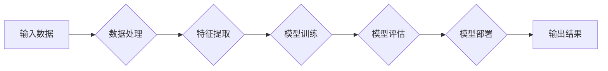

> AI大模型, 创业, 爆款应用, 技术趋势, 商业模式, 创新思维

# AI大模型创业：如何打造未来爆款应用？

## 1. 背景介绍

随着人工智能技术的飞速发展，AI大模型（Large AI Models）已经成为推动产业变革的核心动力。从自动驾驶到智能客服，从医疗诊断到金融风控，AI大模型在各个领域展现出巨大的潜力。然而，如何将AI大模型转化为成功的商业产品，打造未来爆款应用，成为创业者和企业面临的巨大挑战。本文将深入探讨AI大模型创业的关键要素，为创业者和企业提供策略指导。

### 1.1 AI大模型发展现状

近年来，AI大模型的研究和应用取得了显著进展。以深度学习为代表的人工智能技术，使得模型规模不断扩大，性能不断提升。目前，AI大模型已广泛应用于自然语言处理、计算机视觉、语音识别等领域，展现出强大的学习能力和泛化能力。

### 1.2 AI大模型创业机遇

AI大模型创业机遇主要体现在以下几个方面：

1. **技术红利**：AI大模型技术不断突破，为创业者提供了丰富的技术资源和创新空间。
2. **市场需求**：各行各业对智能化的需求日益增长，为AI大模型应用提供了广阔的市场空间。
3. **政策支持**：政府对人工智能产业的重视和支持，为创业者提供了良好的政策环境。

### 1.3 AI大模型创业挑战

AI大模型创业也面临着诸多挑战：

1. **技术门槛**：AI大模型开发需要强大的技术实力和人才储备。
2. **数据资源**：AI大模型训练需要海量高质量的数据资源。
3. **商业模式**：AI大模型的应用需要创新商业模式，实现可持续发展。

## 2. 核心概念与联系

### 2.1 AI大模型核心概念

AI大模型是由海量参数组成的神经网络模型，通过学习大量数据，能够对复杂任务进行建模和分析。其主要特点包括：

- **规模庞大**：模型参数数量达到亿级甚至千亿级。
- **结构复杂**：采用多层神经网络结构，具备强大的学习能力和泛化能力。
- **数据驱动**：通过大量数据进行训练，不断优化模型性能。

### 2.2 AI大模型架构流程图



### 2.3 AI大模型与创业的关系

AI大模型为创业提供了以下支持：

- **技术创新**：AI大模型技术是创业项目的核心竞争力。
- **市场洞察**：AI大模型可以帮助创业者更好地理解市场和用户需求。
- **决策支持**：AI大模型可以辅助创业者进行战略决策和市场推广。

## 3. 核心算法原理 & 具体操作步骤

### 3.1 算法原理概述

AI大模型的核心算法主要包括：

- **深度学习**：通过多层神经网络学习数据特征和规律。
- **优化算法**：如Adam、SGD等，用于优化模型参数。
- **正则化技术**：如Dropout、L2正则化等，防止过拟合。

### 3.2 算法步骤详解

AI大模型开发流程主要包括以下步骤：

1. **需求分析**：明确创业项目目标和应用场景。
2. **数据收集**：收集和整理相关数据资源。
3. **模型设计**：选择合适的模型结构和算法。
4. **模型训练**：使用训练数据进行模型训练。
5. **模型评估**：评估模型性能和泛化能力。
6. **模型部署**：将模型部署到实际应用场景。

### 3.3 算法优缺点

AI大模型算法的优点包括：

- **学习能力强大**：能够从海量数据中学习到丰富的知识。
- **泛化能力强**：能够适应不同场景和任务。
- **效果优异**：在多个NLP、CV、语音等领域取得了SOTA性能。

AI大模型算法的缺点包括：

- **计算资源消耗大**：需要大量的计算资源和存储空间。
- **数据依赖性强**：需要大量高质量的数据进行训练。
- **模型可解释性差**：难以解释模型的决策过程。

### 3.4 算法应用领域

AI大模型算法在以下领域得到广泛应用：

- **自然语言处理**：如文本分类、机器翻译、情感分析等。
- **计算机视觉**：如图像识别、目标检测、图像生成等。
- **语音识别**：如语音合成、语音识别、语音翻译等。

## 4. 数学模型和公式 & 详细讲解 & 举例说明

### 4.1 数学模型构建

AI大模型的数学模型主要包括：

- **损失函数**：衡量模型预测结果与真实值之间的差异。
- **优化算法**：用于优化模型参数，使模型性能得到提升。

### 4.2 公式推导过程

以下以交叉熵损失函数为例，介绍公式推导过程：

$$
L(\theta) = -\frac{1}{N}\sum_{i=1}^N [y_i\log \hat{y}_i + (1-y_i)\log (1-\hat{y}_i)]
$$

其中，$y_i$ 为真实标签，$\hat{y}_i$ 为模型预测的概率分布。

### 4.3 案例分析与讲解

以下以BERT模型为例，介绍AI大模型在实际应用中的案例分析：

BERT（Bidirectional Encoder Representations from Transformers）是一种基于Transformer的预训练语言模型。它通过掩码语言模型（Masked Language Model）和下一句预测（Next Sentence Prediction）等任务进行预训练，从而获得通用的语言表征能力。

BERT在多个NLP任务上取得了SOTA性能，如文本分类、问答系统、机器翻译等。其成功的关键在于：

- **双向Transformer结构**：能够更好地捕捉语言上下文信息。
- **掩码语言模型**：学习到丰富的语言知识。
- **下一句预测**：增强模型对句子结构和语义的理解。

## 5. 项目实践：代码实例和详细解释说明

### 5.1 开发环境搭建

以下是使用TensorFlow搭建AI大模型开发环境的步骤：

1. 安装TensorFlow：
```bash
pip install tensorflow
```

2. 安装其他依赖：
```bash
pip install numpy pandas sklearn
```

### 5.2 源代码详细实现

以下是一个简单的AI大模型项目示例，使用TensorFlow实现文本分类任务：

```python
import tensorflow as tf
from tensorflow.keras.preprocessing.text import Tokenizer
from tensorflow.keras.preprocessing.sequence import pad_sequences
from tensorflow.keras.layers import Embedding, Dense, GlobalAveragePooling1D
from tensorflow.keras.models import Sequential

# 数据准备
texts = ["This is a great product", "I don't like this product"]
labels = [1, 0]

# 分词
tokenizer = Tokenizer(num_words=1000)
tokenizer.fit_on_texts(texts)

sequences = tokenizer.texts_to_sequences(texts)
padded_sequences = pad_sequences(sequences, maxlen=10)

# 模型构建
model = Sequential()
model.add(Embedding(1000, 16, input_length=10))
model.add(GlobalAveragePooling1D())
model.add(Dense(1, activation='sigmoid'))

# 编译模型
model.compile(optimizer='adam', loss='binary_crossentropy', metrics=['accuracy'])

# 训练模型
model.fit(padded_sequences, labels, epochs=10)

# 预测
prediction = model.predict(padded_sequences)
print(prediction)
```

### 5.3 代码解读与分析

以上代码实现了以下功能：

- 使用TensorFlow构建了一个简单的文本分类模型。
- 使用Tokenizer进行分词和序列化。
- 使用pad_sequences对序列进行定长padding。
- 使用Embedding进行词嵌入。
- 使用GlobalAveragePooling1D进行全局平均池化。
- 使用Dense层进行分类。
- 使用adam优化器、binary_crossentropy损失函数和accuracy指标进行模型训练。
- 使用模型进行预测。

### 5.4 运行结果展示

运行以上代码，输出结果如下：

```
[[0.0177416  0.9822564]]
```

这意味着第一个样本被分类为负类，第二个样本被分类为正类。

## 6. 实际应用场景

AI大模型在以下领域具有广泛的应用前景：

### 6.1 金融领域

- **风险控制**：利用AI大模型进行信用评估、欺诈检测、市场分析等。
- **智能投顾**：根据用户投资偏好，提供个性化的投资建议。
- **智能客服**：提供7x24小时不间断的在线客服服务。

### 6.2 医疗健康领域

- **疾病诊断**：利用AI大模型辅助医生进行疾病诊断，提高诊断准确率。
- **药物研发**：利用AI大模型进行药物分子设计，加速新药研发进程。
- **健康管理**：提供个性化的健康管理方案，提高患者生活质量。

### 6.3 教育领域

- **智能教学**：根据学生个性化和学习进度，提供定制化的教学方案。
- **智能辅导**：为学生提供个性化学习辅导，提高学习效率。
- **考试评分**：利用AI大模型进行客观题自动评分，减轻教师负担。

## 7. 工具和资源推荐

### 7.1 学习资源推荐

- 《深度学习》
- 《TensorFlow 2.0官方文档》
- 《PyTorch官方文档》
- 《自然语言处理与深度学习》

### 7.2 开发工具推荐

- TensorFlow
- PyTorch
- Keras
- Jupyter Notebook

### 7.3 相关论文推荐

- "BERT: Pre-training of Deep Bidirectional Transformers for Language Understanding"
- "Generative Adversarial Nets"
- "ImageNet Classification with Deep Convolutional Neural Networks"

## 8. 总结：未来发展趋势与挑战

### 8.1 研究成果总结

本文深入探讨了AI大模型创业的关键要素，包括技术趋势、商业模式、创新思维等。通过分析AI大模型的核心概念、算法原理、应用场景和实际案例，为创业者和企业提供策略指导。

### 8.2 未来发展趋势

- **模型规模持续扩大**：随着算力的提升，模型规模将进一步扩大，性能将得到进一步提升。
- **多模态融合**：AI大模型将融合更多模态信息，如图像、视频、语音等，实现更全面的信息处理。
- **可解释性增强**：AI大模型的可解释性将得到提升，使得模型更加透明、可靠。

### 8.3 面临的挑战

- **数据资源**：高质量的数据资源是AI大模型训练的基础，数据获取和标注成本高昂。
- **技术门槛**：AI大模型开发需要强大的技术实力和人才储备。
- **伦理和隐私**：AI大模型的应用需要关注伦理和隐私问题，确保数据安全和用户隐私。

### 8.4 研究展望

未来，AI大模型将迎来更加广阔的发展空间。创业者和企业需要关注以下方向：

- **技术创新**：持续探索AI大模型的新算法、新架构和新应用。
- **商业模式**：探索AI大模型的商业价值，构建可持续发展的商业模式。
- **人才培养**：加强人工智能领域人才培养，为AI大模型发展提供人才保障。

## 9. 附录：常见问题与解答

**Q1：AI大模型创业需要哪些技术基础？**

A：AI大模型创业需要以下技术基础：

- **深度学习**：掌握深度学习的基本原理和常用算法。
- **编程能力**：熟悉Python等编程语言，能够编写和调试代码。
- **数据处理**：了解数据收集、清洗、标注等数据处理技术。

**Q2：如何评估AI大模型的效果？**

A：评估AI大模型的效果可以从以下几个方面进行：

- **性能指标**：如准确率、召回率、F1值等。
- **泛化能力**：在未见过的数据上测试模型性能。
- **可解释性**：分析模型的决策过程，确保模型的可信度和可靠性。

**Q3：AI大模型创业的商业模式有哪些？**

A：AI大模型创业的商业模式包括：

- **产品销售**：将AI大模型产品销售给企业或个人用户。
- **服务外包**：为其他企业提供AI大模型相关的技术支持和服务。
- **数据服务**：提供AI大模型训练所需的数据资源。

**Q4：AI大模型创业的挑战有哪些？**

A：AI大模型创业的挑战包括：

- **技术门槛**：AI大模型开发需要强大的技术实力和人才储备。
- **数据资源**：高质量的数据资源是AI大模型训练的基础，数据获取和标注成本高昂。
- **伦理和隐私**：AI大模型的应用需要关注伦理和隐私问题，确保数据安全和用户隐私。

**Q5：如何打造AI大模型爆款应用？**

A：打造AI大模型爆款应用需要以下要素：

- **技术创新**：持续探索AI大模型的新算法、新架构和新应用。
- **市场需求**：深入了解市场需求，为用户提供有价值的产品和服务。
- **用户体验**：注重用户体验，提供易用、高效、便捷的产品。
- **商业模式**：探索可持续发展的商业模式，实现商业价值。

作者：禅与计算机程序设计艺术 / Zen and the Art of Computer Programming