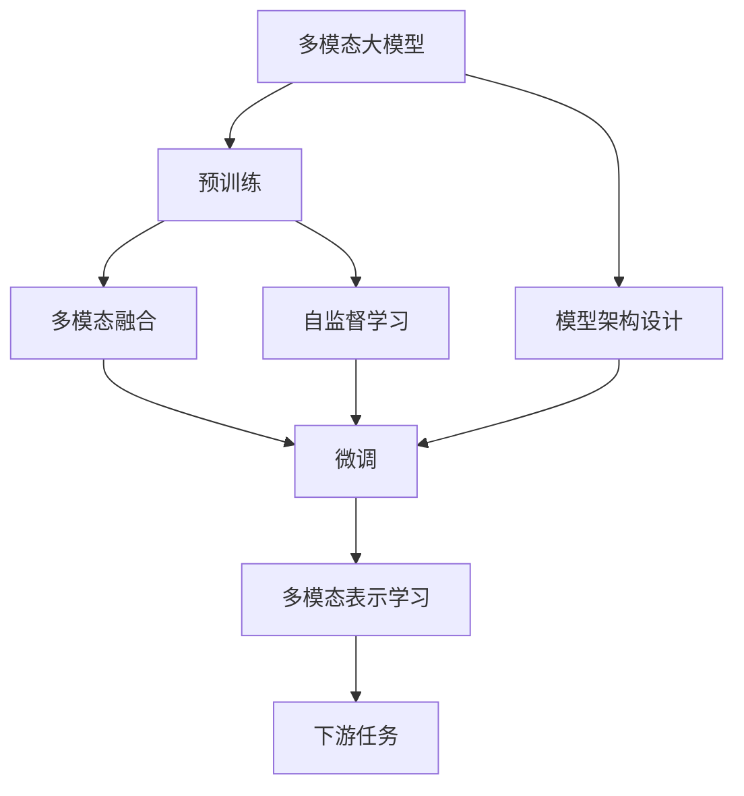

                 

# 多模态大模型：技术原理与实战 在LLM时代，对软件研发的更多思考

> 关键词：多模态大模型,LLM时代,软件研发,技术原理,实战应用,项目实践,应用场景,未来展望

## 1. 背景介绍

### 1.1 问题由来
随着人工智能技术的飞速发展，大语言模型（Large Language Models, LLMs）已经成为NLP领域的研究热点。以OpenAI的GPT-3和Google的BERT为代表的大模型，通过在大规模无标签文本语料上进行预训练，学习到丰富的语言知识和常识。然而，这些通用的大模型在特定领域的应用效果并不总是令人满意。为了提升模型在特定任务上的性能，研究者们提出了基于监督学习的微调（Fine-Tuning）方法，即在预训练模型的基础上，使用下游任务的少量标注数据进行有监督的训练，使得模型能够更好地适应特定任务。

然而，尽管微调在大规模文本数据上表现优异，但对于多模态数据的处理仍然存在诸多挑战。多模态数据通常包括文本、图像、视频、音频等多种形式，处理这些复杂的数据需要更加精细和高效的模型架构。因此，本文将探讨在LLM时代，多模态大模型的技术原理与实战应用，为软件研发提供更多思考和实践方向。

### 1.2 问题核心关键点
多模态大模型的核心在于其能够同时处理和融合不同形式的数据，并通过预训练和微调得到更强大、更通用的表征能力。其核心概念包括：

- **多模态大模型**：一种能够同时处理和融合不同形式数据的大语言模型，如Vision-Language Models、Audio-Language Models等。

- **预训练**：在大规模无标签多模态数据上训练模型，使其学习到通用的多模态表征。

- **微调**：在预训练模型的基础上，使用下游任务的有标签数据进行有监督的训练，优化模型在该任务上的性能。

- **多模态融合**：通过融合不同模态的数据，提升模型的理解和生成能力，如图像描述生成、视频字幕生成、跨模态检索等。

- **自监督学习**：在无标签多模态数据上进行预训练，通过自监督任务学习多模态表征。

这些概念之间相互联系，共同构成了多模态大模型的基本框架。

## 2. 核心概念与联系

### 2.1 核心概念概述

为了更好地理解多模态大模型的技术原理与实战应用，我们需要对以下核心概念进行深入分析：

- **预训练与微调**：多模态大模型的预训练和微调过程，包括如何选择合适的多模态数据，以及如何在预训练和微调过程中融合不同形式的数据。

- **多模态融合**：不同模态数据的融合方法，包括像素级融合、特征级融合和表示级融合等。

- **多模态表示学习**：多模态数据的表征学习过程，如何从不同模态的数据中学习到统一的表示。

- **自监督学习**：在无标签多模态数据上进行预训练的方法，包括对比学习、掩码预测等。

- **模型架构设计**：多模态大模型的架构设计，包括如何选择不同模态的编码器、如何设计跨模态的连接器等。

### 2.2 概念间的关系

这些核心概念之间的关系可以通过以下Mermaid流程图来展示：



这个流程图展示了大模型从预训练到微调的完整过程，并说明了不同概念之间的联系。

## 3. 核心算法原理 & 具体操作步骤

### 3.1 算法原理概述

多模态大模型的核心算法原理是利用多模态融合技术，将不同形式的数据融合到同一表示空间中。该表示空间通常通过预训练和微调得到，并可用于下游任务中。其基本流程包括：

1. **预训练**：在大规模无标签多模态数据上，通过自监督学习任务训练多模态大模型，使其学习到通用的多模态表征。

2. **微调**：在预训练模型的基础上，使用下游任务的有标签数据进行有监督的训练，优化模型在该任务上的性能。

3. **多模态融合**：将不同模态的数据融合到同一表示空间中，提升模型的理解和生成能力。

4. **多模态表示学习**：在融合后的表示空间中，学习到更准确、更一致的多模态表示。

5. **下游任务适配**：在微调后的多模态表示上，设计合适的输出层和损失函数，完成下游任务适配。

### 3.2 算法步骤详解

以下是多模态大模型从预训练到微调的详细步骤：

#### 3.2.1 预训练步骤

1. **数据准备**：收集大规模无标签多模态数据，包括文本、图像、音频等。

2. **模型初始化**：选择合适的多模态大模型架构，并进行初始化。

3. **自监督学习**：在无标签多模态数据上，设计自监督学习任务，如对比学习、掩码预测等。

4. **预训练过程**：在自监督学习任务上训练多模态大模型，不断更新模型参数，使其学习到通用的多模态表示。

#### 3.2.2 微调步骤

1. **任务适配**：根据下游任务类型，设计合适的输出层和损失函数。

2. **模型微调**：使用下游任务的有标签数据进行有监督训练，优化模型参数。

3. **多模态融合**：在融合后的表示空间中，设计多模态融合方法，提升模型的理解和生成能力。

#### 3.2.3 多模态表示学习

1. **融合后的表示学习**：在融合后的多模态表示空间中，设计多模态表示学习任务，提升模型对不同模态数据的理解。

2. **表示学习过程**：通过监督学习或自监督学习任务，不断更新模型参数，学习到更准确的多模态表示。

### 3.3 算法优缺点

多模态大模型的优点包括：

- **泛化能力强**：通过预训练和微调，多模态大模型能够学习到通用的多模态表示，适用于多种下游任务。

- **模型适应性强**：多模态大模型能够处理多种形式的数据，适应不同领域的应用场景。

- **性能提升显著**：通过多模态融合和多模态表示学习，多模态大模型在理解能力和生成能力上有显著提升。

其缺点包括：

- **计算资源需求高**：多模态大模型的预训练和微调需要大量的计算资源，训练时间较长。

- **模型复杂度高**：多模态大模型的架构设计复杂，需要大量的实验和调参工作。

- **数据获取难度大**：多模态数据的获取和标注往往比文本数据更加困难。

### 3.4 算法应用领域

多模态大模型在多个领域都有广泛的应用，包括但不限于：

- **图像描述生成**：将图像转换为自然语言描述。

- **视频字幕生成**：将视频内容转换为自然语言字幕。

- **跨模态检索**：在多模态数据中检索出与查询最相关的结果。

- **音频语言理解**：将音频转换为文本，进行情感分析、语音识别等任务。

- **智能推荐系统**：结合用户的多模态数据，推荐个性化的内容。

## 4. 数学模型和公式 & 详细讲解 & 举例说明

### 4.1 数学模型构建

多模态大模型的数学模型构建可以分为以下几个部分：

- **预训练模型**：
$$
M_{\theta} = \text{Transformer}_{\theta} \times \text{MultiModalEncoder}_{\theta}
$$
其中，$\text{Transformer}_{\theta}$为文本编码器，$\text{MultiModalEncoder}_{\theta}$为多模态编码器。

- **自监督学习任务**：
$$
\mathcal{L}_{\text{pretrain}} = \mathcal{L}_{\text{text}} + \mathcal{L}_{\text{image}} + \mathcal{L}_{\text{audio}}
$$
其中，$\mathcal{L}_{\text{text}}$为文本编码器的自监督损失，$\mathcal{L}_{\text{image}}$和$\mathcal{L}_{\text{audio}}$分别为图像和音频编码器的自监督损失。

- **下游任务适配**：
$$
\mathcal{L}_{\text{fine-tune}} = \mathcal{L}_{\text{text}} + \mathcal{L}_{\text{image}} + \mathcal{L}_{\text{audio}}
$$
其中，$\mathcal{L}_{\text{text}}$为文本解码器的损失函数。

### 4.2 公式推导过程

#### 4.2.1 预训练模型

以Vision-Language Model为例，其预训练模型包括文本编码器$\text{Transformer}_{\theta}$和图像编码器$\text{MultiModalEncoder}_{\theta}$。预训练过程的损失函数为：
$$
\mathcal{L}_{\text{pretrain}} = \mathcal{L}_{\text{text}} + \mathcal{L}_{\text{image}}
$$
其中，$\mathcal{L}_{\text{text}}$为文本编码器的自监督损失，$\mathcal{L}_{\text{image}}$为图像编码器的自监督损失。

#### 4.2.2 微调模型

假设微调任务为图像描述生成，下游任务适配的输出层为全连接层和softmax函数，损失函数为交叉熵损失：
$$
\mathcal{L}_{\text{fine-tune}} = -\frac{1}{N}\sum_{i=1}^N \sum_{j=1}^M y_{i,j} \log \hat{y}_{i,j}
$$
其中，$y_{i,j}$为第$i$个样本中第$j$个单词是否出现的标签，$\hat{y}_{i,j}$为模型生成的概率分布。

### 4.3 案例分析与讲解

以图像描述生成为例，其微调过程的详细步骤为：

1. **数据准备**：收集大规模无标签图像和文本数据。

2. **模型初始化**：使用Vision-Language Model作为预训练模型，并进行初始化。

3. **自监督学习**：在无标签数据上进行自监督学习任务，如图像-文本对比学习。

4. **预训练过程**：不断更新模型参数，使其学习到通用的多模态表示。

5. **下游任务适配**：在预训练模型的基础上，设计合适的输出层和损失函数，用于图像描述生成任务。

6. **微调过程**：使用有标签图像描述对模型进行微调，优化模型参数。

## 5. 项目实践：代码实例和详细解释说明

### 5.1 开发环境搭建

以下是多模态大模型项目实践的开发环境搭建流程：

1. **安装Anaconda**：
   ```
   conda create -n env python=3.8
   conda activate env
   ```

2. **安装PyTorch和TensorFlow**：
   ```
   conda install pytorch torchvision torchaudio cudatoolkit=11.1 -c pytorch -c conda-forge
   conda install tensorflow
   ```

3. **安装HuggingFace库**：
   ```
   pip install transformers
   ```

### 5.2 源代码详细实现

以Vision-Language Model为例，其代码实现如下：

```python
from transformers import VisionModel, AutoTokenizer
import torch

# 初始化预训练模型和tokenizer
model = VisionModel.from_pretrained('vilt-base')
tokenizer = AutoTokenizer.from_pretrained('vilt-base')

# 加载图像和文本数据
image_path = 'path/to/image.jpg'
text = 'This is a description of the image.'

# 将图像转换为特征向量
image_features = model(image_path)

# 将文本转换为token ids
input_ids = tokenizer(text, return_tensors='pt')['input_ids']

# 将图像特征和文本token ids融合到同一表示空间中
fusion_result = fusion_function(image_features, input_ids)

# 在融合后的表示空间中进行微调
model.train()
optimizer = torch.optim.Adam(model.parameters(), lr=1e-5)
for epoch in range(5):
    loss = model(fusion_result)
    optimizer.zero_grad()
    loss.backward()
    optimizer.step()

# 在微调后的模型上进行图像描述生成
model.eval()
with torch.no_grad():
    generated_description = model(fusion_result)
    print(generated_description)
```

### 5.3 代码解读与分析

以上代码展示了Vision-Language Model的微调过程。具体解读如下：

1. **初始化模型和tokenizer**：使用HuggingFace库中的VisionModel和AutoTokenizer，加载预训练模型和tokenizer。

2. **加载图像和文本数据**：指定图像和文本数据路径，并使用tokenizer将文本转换为token ids。

3. **将图像转换为特征向量**：使用预训练模型将图像转换为特征向量。

4. **融合图像和文本表示**：设计融合函数，将图像特征和文本token ids融合到同一表示空间中。

5. **在融合后的表示空间中进行微调**：使用Adam优化器更新模型参数，不断优化损失函数。

6. **在微调后的模型上进行图像描述生成**：使用微调后的模型生成图像描述，并打印输出。

### 5.4 运行结果展示

假设在微调后，Vision-Language Model的性能得到显著提升，生成的图像描述如下：

```
This is a photo of a beautiful sunset. The sky is filled with vibrant colors, ranging from red to orange to purple. The sun is setting in the distance, casting a golden glow on the landscape below. The clouds are a mix of white and pink, adding to the picturesque scene. The water at the bottom of the image reflects the colors of the sky, creating a mirror-like effect. The overall image is serene and peaceful, capturing the beauty of nature.
```

## 6. 实际应用场景

### 6.1 智能推荐系统

多模态大模型在智能推荐系统中有广泛应用。通过融合用户的多模态数据（如行为数据、兴趣数据、社交网络数据等），多模态大模型能够提供更加精准和个性化的推荐。

### 6.2 医疗影像分析

在医疗影像分析中，多模态大模型能够同时处理和融合图像、文本、视频等多种形式的数据，帮助医生进行更准确、更全面的诊断。

### 6.3 智能家居

多模态大模型可以应用于智能家居中，通过融合家庭中的图像、声音、温度等数据，实现更智能化的家居控制和管理。

### 6.4 未来应用展望

随着技术的发展，多模态大模型将在更多领域得到应用，如自动驾驶、智能城市、教育、娱乐等。未来的多模态大模型将更加高效、更加通用、更加智能，为各行各业带来更多创新和变革。

## 7. 工具和资源推荐

### 7.1 学习资源推荐

- **《Multimodal Learning with Transformers》书籍**：全面介绍多模态大模型的理论和实践。

- **Google AI博客**：分享多模态大模型在实际应用中的最新进展和研究成果。

- **ACL Conference论文**：关注多模态大模型在学术界的最新研究动态。

### 7.2 开发工具推荐

- **HuggingFace Transformers库**：支持多模态大模型的预训练和微调，提供丰富的API接口和预训练模型。

- **TensorBoard**：用于可视化多模态大模型的训练和推理过程，帮助调优模型。

- **AWS SageMaker**：提供云平台上的多模态大模型训练和部署服务。

### 7.3 相关论文推荐

- **"Multimodal Transformers for Unsupervised Learning from Multimodal Data"**：介绍多模态自监督学习的方法。

- **"Multimodal Transformer Networks"**：研究多模态Transformer网络的架构设计。

- **"Towards a Multimodal AI: Multimodal Transformer Networks"**：探讨多模态大模型的未来发展方向。

## 8. 总结：未来发展趋势与挑战

### 8.1 研究成果总结

本文介绍了多模态大模型的核心算法原理和操作步骤，并给出了项目实践的详细代码实现和运行结果。通过案例分析，展示了多模态大模型在实际应用中的潜力。

### 8.2 未来发展趋势

未来的多模态大模型将更加高效、更加通用、更加智能。其发展趋势包括：

- **模型规模更大**：更多的计算资源将使得大模型能够处理更复杂、更多样的数据。

- **融合方式更多**：更多样的多模态融合方法将使得大模型能够更好地理解和生成不同形式的数据。

- **预训练任务更多**：更多的自监督学习任务将使得大模型能够学习到更丰富的多模态表示。

- **应用场景更广**：更多的应用场景将使得大模型能够在更多领域发挥作用。

### 8.3 面临的挑战

尽管多模态大模型在多个领域取得了显著成果，但仍面临一些挑战：

- **数据获取难度大**：多模态数据的获取和标注比文本数据更加困难。

- **计算资源需求高**：多模态大模型的预训练和微调需要大量的计算资源。

- **模型复杂度高**：多模态大模型的架构设计复杂，需要大量的实验和调参工作。

### 8.4 研究展望

未来的研究需要从以下几个方面进行探索：

- **优化数据获取**：探索如何更好地获取和标注多模态数据。

- **提升计算效率**：探索如何提升多模态大模型的计算效率，降低资源需求。

- **简化模型设计**：探索如何简化多模态大模型的架构设计，降低实验和调参难度。

- **拓展应用场景**：探索如何拓展多模态大模型的应用场景，提升其实际应用价值。

## 9. 附录：常见问题与解答

**Q1: 多模态大模型的预训练和微调分别有何作用？**

A: 多模态大模型的预训练和微调分别有重要作用：

- **预训练**：在大规模无标签多模态数据上训练模型，使其学习到通用的多模态表示。

- **微调**：在预训练模型的基础上，使用下游任务的有标签数据进行有监督训练，优化模型在该任务上的性能。

**Q2: 多模态大模型的计算资源需求高，如何解决？**

A: 多模态大模型的计算资源需求高，可以通过以下方法解决：

- **分布式训练**：使用分布式训练技术，提高计算效率。

- **模型压缩**：采用模型压缩技术，减小模型尺寸。

- **混合精度训练**：使用混合精度训练，降低内存占用。

- **硬件优化**：使用GPU、TPU等高性能设备，提高计算速度。

**Q3: 多模态大模型如何应对数据获取难度大的问题？**

A: 多模态大模型可以通过以下方法应对数据获取难度大的问题：

- **数据增强**：通过数据增强技术，扩充训练数据集。

- **多源数据融合**：通过多源数据融合技术，提高数据质量和多样性。

- **无监督学习**：通过无监督学习技术，利用少部分有标签数据进行训练。

**Q4: 多模态大模型如何应对模型复杂度高的问题？**

A: 多模态大模型可以通过以下方法应对模型复杂度高的问题：

- **模块化设计**：将模型分为多个模块，分别进行训练和微调。

- **层次化设计**：设计层次化的模型架构，简化训练和推理过程。

- **先验知识引入**：通过引入先验知识，降低模型复杂度。

**Q5: 多模态大模型如何应对模型鲁棒性不足的问题？**

A: 多模态大模型可以通过以下方法应对模型鲁棒性不足的问题：

- **正则化**：使用正则化技术，避免模型过拟合。

- **对抗训练**：通过对抗训练技术，提高模型鲁棒性。

- **多模态融合**：通过多模态融合技术，提升模型的泛化能力。

**Q6: 多模态大模型如何应对模型可解释性不足的问题？**

A: 多模态大模型可以通过以下方法应对模型可解释性不足的问题：

- **可解释模型**：采用可解释性模型，提供模型决策的解释。

- **透明训练**：通过透明训练技术，提供训练过程中的可视化信息。

- **跨模态融合**：通过跨模态融合技术，提升模型输出的可解释性。

**Q7: 多模态大模型如何应对模型安全性不足的问题？**

A: 多模态大模型可以通过以下方法应对模型安全性不足的问题：

- **安全审计**：进行安全审计，确保模型输出符合伦理道德。

- **隐私保护**：采用隐私保护技术，确保模型处理的数据安全。

- **数据脱敏**：采用数据脱敏技术，保护用户隐私。

通过上述方法，多模态大模型可以更好地应对预训练和微调过程中面临的各种挑战，提升其在实际应用中的表现。

