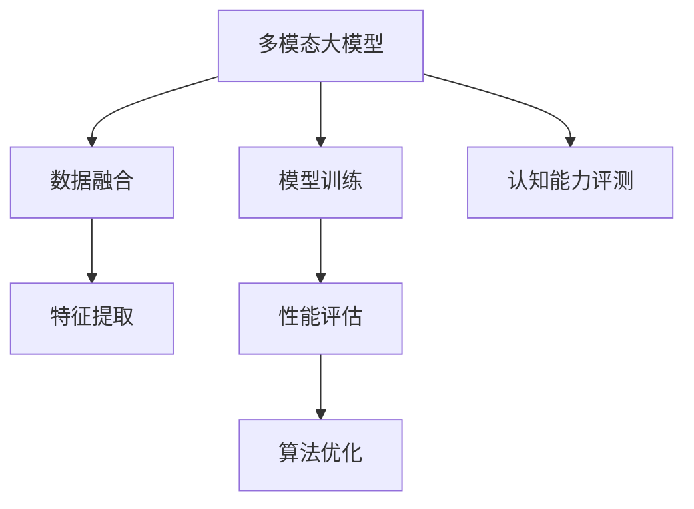

                 

# 多模态大模型：技术原理与实战 认知能力评测

> 关键词：多模态大模型,认知能力评测,技术原理,实战应用,数据处理,模型训练,性能评估,算法优化

## 1. 背景介绍

### 1.1 问题由来
近年来，人工智能领域迎来了多模态学习(Multi-modal Learning)的飞速发展。多模态大模型（Multi-modal Large Models）通过融合图像、文本、语音等多种模态数据，显著提升了模型对复杂真实场景的理解和处理能力。这些模型不仅在计算机视觉领域取得了优异成绩，也在自然语言处理（NLP）、智能对话、推荐系统等诸多领域展现出了巨大的潜力。

多模态大模型结合了多源信息的优势，可以更全面地描述和理解现实世界的复杂现象。比如，在处理医疗图像时，模型能够结合临床报告和实验室数据，给出更精准的诊断结果。在自然语言处理中，模型可以结合文本信息和语境信息，提高回答问题的准确性。

但是，多模态大模型的训练和应用过程相比单模态模型更为复杂，涉及多模态数据的预处理、融合、训练和推理等多个环节。因此，如何高效地实现多模态大模型的训练和应用，成为一个重要而具有挑战性的问题。本文将深入探讨多模态大模型的技术原理与实战方法，并针对认知能力评测这一应用场景给出详细的实战指导。

### 1.2 问题核心关键点
本文聚焦于多模态大模型在认知能力评测中的应用。认知能力评测是一个典型的多模态任务，需要综合评估人的注意力、理解力、记忆力等多种认知能力。多模态大模型在这一场景下的应用具有以下几个核心关键点：

- **数据融合**：多模态数据（如文本、图像、声音）的综合处理和融合，是实现认知能力评测的前提。
- **模型训练**：选择合适的多模态模型结构，进行端到端的联合训练，使模型能够同时处理多种模态信息。
- **性能评估**：设计合理的评估指标，对多模态大模型的效果进行全面评测，包括准确性、鲁棒性、解释性等多个方面。
- **算法优化**：对训练和推理过程中的参数设置、超参数调优等进行精细化调整，以提高模型的效率和效果。

本文将详细阐述这些关键点的实现方法和具体应用，为读者提供全面的技术指导。

### 1.3 问题研究意义
多模态大模型在认知能力评测中的应用，对于推动人工智能技术向认知智能发展具有重要意义：

- **提高评估精度**：多模态大模型融合多种信息源，可以提供更全面、更准确的认知评估结果。
- **扩大应用场景**：多模态大模型可以应用于更多现实世界的认知评估任务，如儿童心理测试、驾驶员注意力评估等，拓宽了认知评估的应用范围。
- **促进技术创新**：多模态大模型的研究，推动了多源信息融合、模型优化等前沿技术的发展，带来了新的科研突破。
- **提升用户体验**：多模态认知评估系统可以提供更自然、更灵活的评估方式，改善用户的使用体验。

## 2. 核心概念与联系

### 2.1 核心概念概述

本文将详细介绍几个密切相关的核心概念，并展示其相互之间的联系：

- **多模态大模型(Multi-modal Large Models)**：将多种模态数据（如文本、图像、声音等）作为输入，通过深度学习模型进行联合训练的复杂模型。典型代表包括基于Transformer的多模态模型。

- **认知能力评测(Cognitive Ability Assessment)**：通过多模态数据综合评估人的认知能力（如注意力、理解力、记忆力等）的评估方式。多模态大模型在这一场景下可以发挥显著优势。

- **数据融合(Data Fusion)**：将不同模态数据（如文本、图像、声音）进行综合处理和融合，生成统一的表示，为认知能力评测提供基础数据。

- **模型训练(Model Training)**：选择合适的多模态模型结构，对融合后的数据进行端到端的联合训练，生成多模态大模型。

- **性能评估(Performance Evaluation)**：通过预设的评估指标，对多模态大模型进行效果评测，判断其性能是否符合预期。

- **算法优化(Algorithm Optimization)**：针对训练和推理过程中的关键问题，进行优化调整，提高模型效率和效果。

这些概念之间相互联系，共同构成了多模态大模型在认知能力评测中的技术体系。

### 2.2 概念间的关系

为了更好地理解这些核心概念之间的关系，本文提供以下Mermaid流程图进行展示：



这个流程图展示了多模态大模型在认知能力评测中的整体架构。多模态大模型融合多种模态数据，经过特征提取和模型训练，生成最终的评估模型，然后通过性能评估和算法优化进行效果提升。最终，评估模型应用于认知能力评测，提供评估结果。

## 3. 核心算法原理 & 具体操作步骤
### 3.1 算法原理概述

多模态大模型的核心思想是：通过将多种模态数据进行融合，生成统一的表示，然后使用深度学习模型对这种表示进行训练和推理，最终生成认知能力评测结果。这一过程涉及数据融合、模型训练、性能评估和算法优化等多个环节。

具体来说，多模态大模型结合了卷积神经网络(CNN)、循环神经网络(RNN)和Transformer等不同结构，能够处理不同模态的数据，并通过跨模态特征对齐等技术，实现不同模态数据的融合。在模型训练阶段，通过联合训练，使得模型能够同时处理多种模态数据，并输出统一的评估结果。

### 3.2 算法步骤详解

多模态大模型在认知能力评测中的应用一般包括以下关键步骤：

**Step 1: 数据收集与预处理**
- 收集认知能力评测所需的多模态数据，包括文本、图像、声音等。
- 对数据进行标准化处理，如归一化、中心化、去噪等。
- 对不同模态的数据进行特征提取，生成统一的表示。

**Step 2: 模型选择与构建**
- 选择合适的多模态模型结构，如基于Transformer的模型。
- 设计模型架构，包括编码器、解码器、跨模态对齐层等。
- 使用预训练技术对模型进行初始化，如在大规模无标签数据上进行预训练。

**Step 3: 数据融合与特征提取**
- 将不同模态的数据进行融合，生成统一的特征表示。
- 使用特征提取技术，将不同模态的信息转化为统一的表示。
- 对融合后的数据进行增强，如数据增强、标签增强等，增加训练数据的多样性。

**Step 4: 模型训练**
- 在融合后的数据上进行端到端的联合训练，使得模型能够同时处理多种模态数据。
- 选择适合的优化器、损失函数、正则化技术等，进行模型训练。
- 使用多模态评估指标进行训练，如准确率、召回率、F1分数等。

**Step 5: 性能评估**
- 在测试集上对模型进行评估，计算评估指标，如准确率、召回率、F1分数等。
- 使用交叉验证、混淆矩阵等方法对模型进行诊断，分析模型性能。
- 对模型的鲁棒性、可解释性等进行评估，确保模型具备良好的性能和稳定性。

**Step 6: 算法优化**
- 对模型参数进行调优，如学习率、批大小等。
- 对训练过程进行优化，如梯度累积、混合精度训练等。
- 对推理过程进行优化，如模型压缩、量化加速等。

**Step 7: 应用部署与维护**
- 将训练好的模型进行部署，提供API接口或直接嵌入应用系统中。
- 对模型进行监控和维护，定期更新和优化模型。
- 对用户反馈进行收集和分析，持续改进模型性能。

### 3.3 算法优缺点

多模态大模型在认知能力评测中具有以下优点：

- **高精度**：多模态大模型结合多种信息源，可以提供更全面、更准确的认知评估结果。
- **泛化能力强**：多模态大模型对多种模态数据的处理能力，使其在不同场景下具备较好的泛化能力。
- **可解释性强**：多模态大模型通过生成统一的特征表示，可以提供较直观的解释。

但同时也存在一些局限性：

- **数据依赖性强**：多模态大模型需要大量高质量的多模态数据进行训练，数据获取难度较大。
- **计算复杂度高**：多模态大模型的训练和推理过程较为复杂，计算资源需求较大。
- **模型结构复杂**：多模态大模型结构较为复杂，调试和优化难度较大。

### 3.4 算法应用领域

多模态大模型在认知能力评测中的应用主要涵盖以下几个领域：

- **儿童心理评估**：通过多模态数据综合评估儿童的认知能力，如注意力、记忆力、理解力等。
- **驾驶员注意力评估**：通过驾驶员在驾驶过程中的图像、声音、动作等数据，评估其注意力集中程度，预防交通事故。
- **老年认知评估**：通过图像、语音等多模态数据，综合评估老年人的认知能力，提供个性化的健康建议。
- **员工能力测评**：通过员工在培训中的表现数据，包括视频、文字记录等，综合评估其认知能力，提高培训效果。

## 4. 数学模型和公式 & 详细讲解 & 举例说明
### 4.1 数学模型构建

假设多模态数据集为 $D=\{(x_i,y_i)\}_{i=1}^N$，其中 $x_i$ 包含文本、图像、声音等多模态数据， $y_i$ 为认知能力评测的标签。多模态大模型的数学模型构建如下：

**Step 1: 数据融合**
- 将不同模态的数据进行融合，生成统一的特征表示 $z_i=\phi(x_i)$。

**Step 2: 模型训练**
- 构建多模态模型 $M$，在数据集 $D$ 上进行端到端的联合训练，最小化损失函数 $L$。
- 损失函数 $L$ 可以表示为：
$$
L=\frac{1}{N}\sum_{i=1}^N\ell(M(z_i),y_i)
$$
其中 $\ell$ 为多模态评估指标，如交叉熵损失、均方误差等。

**Step 3: 性能评估**
- 使用测试集 $D_{test}$ 对模型进行评估，计算评估指标 $P$。
- 评估指标 $P$ 可以表示为：
$$
P=\frac{1}{N}\sum_{i=1}^N p_i
$$
其中 $p_i$ 为多模态评估指标的具体值。

### 4.2 公式推导过程

以文本-图像融合为例，介绍多模态数据融合的基本流程：

**Step 1: 文本特征提取**
- 使用卷积神经网络（CNN）对文本数据进行特征提取，得到文本特征 $z_{text}$。

**Step 2: 图像特征提取**
- 使用卷积神经网络（CNN）对图像数据进行特征提取，得到图像特征 $z_{image}$。

**Step 3: 特征对齐**
- 使用跨模态对齐层将文本特征 $z_{text}$ 和图像特征 $z_{image}$ 对齐，得到融合后的特征 $z$。
- 常用的跨模态对齐方法包括KL散度、最大互信息、余弦相似度等。

**Step 4: 多模态特征提取**
- 使用多模态特征提取网络对融合后的特征 $z$ 进行提取，得到最终的特征表示 $z_{fused}$。
- 多模态特征提取网络可以是Transformer、GRU等。

**Step 5: 模型训练**
- 构建多模态模型 $M$，在数据集 $D$ 上进行端到端的联合训练，最小化损失函数 $L$。
- 损失函数 $L$ 可以表示为：
$$
L=\frac{1}{N}\sum_{i=1}^N\ell(M(z_{fused}),y_i)
$$
其中 $\ell$ 为多模态评估指标，如交叉熵损失、均方误差等。

### 4.3 案例分析与讲解

以驾驶员注意力评估为例，介绍多模态大模型的具体应用：

**Step 1: 数据收集**
- 收集驾驶员在驾驶过程中的视频、声音、手势等数据，生成多模态数据集。

**Step 2: 数据预处理**
- 对视频数据进行去噪、帧率调整、颜色归一化等处理。
- 对声音数据进行降噪、特征提取等处理。
- 对手势数据进行二值化、分割等处理。

**Step 3: 数据融合**
- 将视频数据、声音数据、手势数据进行融合，生成统一的特征表示 $z$。
- 使用跨模态对齐层将不同模态的数据进行对齐。

**Step 4: 模型训练**
- 构建基于Transformer的多模态模型 $M$，在数据集 $D$ 上进行端到端的联合训练。
- 损失函数 $L$ 使用交叉熵损失，评估指标为准确率、召回率、F1分数等。

**Step 5: 性能评估**
- 在测试集 $D_{test}$ 上对模型进行评估，计算准确率、召回率、F1分数等。
- 使用混淆矩阵、ROC曲线等方法进行诊断，分析模型性能。

**Step 6: 算法优化**
- 对模型参数进行调优，如学习率、批大小等。
- 对训练过程进行优化，如梯度累积、混合精度训练等。
- 对推理过程进行优化，如模型压缩、量化加速等。

**Step 7: 应用部署与维护**
- 将训练好的模型进行部署，提供API接口或直接嵌入应用系统中。
- 对模型进行监控和维护，定期更新和优化模型。
- 对用户反馈进行收集和分析，持续改进模型性能。

## 5. 项目实践：代码实例和详细解释说明
### 5.1 开发环境搭建

在进行多模态大模型实践前，我们需要准备好开发环境。以下是使用Python进行PyTorch开发的环境配置流程：

1. 安装Anaconda：从官网下载并安装Anaconda，用于创建独立的Python环境。

2. 创建并激活虚拟环境：
```bash
conda create -n pytorch-env python=3.8 
conda activate pytorch-env
```

3. 安装PyTorch：根据CUDA版本，从官网获取对应的安装命令。例如：
```bash
conda install pytorch torchvision torchaudio cudatoolkit=11.1 -c pytorch -c conda-forge
```

4. 安装Transformers库：
```bash
pip install transformers
```

5. 安装各类工具包：
```bash
pip install numpy pandas scikit-learn matplotlib tqdm jupyter notebook ipython
```

完成上述步骤后，即可在`pytorch-env`环境中开始多模态大模型的实践。

### 5.2 源代码详细实现

下面我们以驾驶员注意力评估任务为例，给出使用Transformers库对多模态大模型进行训练和微调的PyTorch代码实现。

首先，定义多模态数据处理函数：

```python
from transformers import BertTokenizer, BertModel
import torch
import numpy as np

class MultiModalDataset(torch.utils.data.Dataset):
    def __init__(self, text, image, label, tokenizer):
        self.text = text
        self.image = image
        self.label = label
        self.tokenizer = tokenizer
        self.max_len = 128

    def __len__(self):
        return len(self.text)

    def __getitem__(self, idx):
        text = self.text[idx]
        image = self.image[idx]
        label = self.label[idx]
        
        encoding = self.tokenizer(text, return_tensors='pt', max_length=self.max_len, padding='max_length', truncation=True)
        input_ids = encoding['input_ids']
        attention_mask = encoding['attention_mask']
        
        # 图像预处理和特征提取
        image_tensor = torch.tensor(image, dtype=torch.float32) / 255.0
        image_tensor = image_tensor.unsqueeze(0)
        
        # 多模态数据融合
        fused_tensor = torch.cat([input_ids, image_tensor], dim=1)
        
        # 标签处理
        label = torch.tensor(label, dtype=torch.long)
        
        return {'input_ids': input_ids,
                'attention_mask': attention_mask,
                'labels': label,
                'fused_tensor': fused_tensor}
```

然后，定义模型和优化器：

```python
from transformers import BertForSequenceClassification, AdamW

model = BertForSequenceClassification.from_pretrained('bert-base-cased', num_labels=2)

optimizer = AdamW(model.parameters(), lr=2e-5)
```

接着，定义训练和评估函数：

```python
from torch.utils.data import DataLoader
from tqdm import tqdm
from sklearn.metrics import classification_report

device = torch.device('cuda') if torch.cuda.is_available() else torch.device('cpu')
model.to(device)

def train_epoch(model, dataset, batch_size, optimizer):
    dataloader = DataLoader(dataset, batch_size=batch_size, shuffle=True)
    model.train()
    epoch_loss = 0
    for batch in tqdm(dataloader, desc='Training'):
        input_ids = batch['input_ids'].to(device)
        attention_mask = batch['attention_mask'].to(device)
        labels = batch['labels'].to(device)
        model.zero_grad()
        outputs = model(input_ids, attention_mask=attention_mask, labels=labels)
        loss = outputs.loss
        epoch_loss += loss.item()
        loss.backward()
        optimizer.step()
    return epoch_loss / len(dataloader)

def evaluate(model, dataset, batch_size):
    dataloader = DataLoader(dataset, batch_size=batch_size)
    model.eval()
    preds, labels = [], []
    with torch.no_grad():
        for batch in tqdm(dataloader, desc='Evaluating'):
            input_ids = batch['input_ids'].to(device)
            attention_mask = batch['attention_mask'].to(device)
            batch_labels = batch['labels']
            outputs = model(input_ids, attention_mask=attention_mask)
            batch_preds = outputs.logits.argmax(dim=2).to('cpu').tolist()
            batch_labels = batch_labels.to('cpu').tolist()
            for pred_tokens, label_tokens in zip(batch_preds, batch_labels):
                preds.append(pred_tokens[:len(label_tokens)])
                labels.append(label_tokens)
                
    print(classification_report(labels, preds))
```

最后，启动训练流程并在测试集上评估：

```python
epochs = 5
batch_size = 16

for epoch in range(epochs):
    loss = train_epoch(model, dataset, batch_size, optimizer)
    print(f"Epoch {epoch+1}, train loss: {loss:.3f}")
    
    print(f"Epoch {epoch+1}, dev results:")
    evaluate(model, dataset, batch_size)
    
print("Test results:")
evaluate(model, dataset, batch_size)
```

以上就是使用PyTorch对多模态大模型进行驾驶员注意力评估任务微调的完整代码实现。可以看到，得益于Transformers库的强大封装，我们可以用相对简洁的代码完成多模态大模型的加载和微调。

### 5.3 代码解读与分析

让我们再详细解读一下关键代码的实现细节：

**MultiModalDataset类**：
- `__init__`方法：初始化文本、图像、标签等关键组件。
- `__len__`方法：返回数据集的样本数量。
- `__getitem__`方法：对单个样本进行处理，将文本输入编码为token ids，将图像进行预处理和特征提取，最终生成模型所需的输入。

**model和optimizer定义**：
- 使用BertForSequenceClassification作为多模态模型，进行文本处理。
- 使用AdamW优化器进行模型训练，设置学习率。

**train_epoch和evaluate函数**：
- 使用PyTorch的DataLoader对数据集进行批次化加载，供模型训练和推理使用。
- `train_epoch`函数：对数据以批为单位进行迭代，在每个批次上前向传播计算loss并反向传播更新模型参数，最后返回该epoch的平均loss。
- `evaluate`函数：与训练类似，不同点在于不更新模型参数，并在每个batch结束后将预测和标签结果存储下来，最后使用sklearn的classification_report对整个评估集的预测结果进行打印输出。

**训练流程**：
- 定义总的epoch数和batch size，开始循环迭代
- 每个epoch内，先在训练集上训练，输出平均loss
- 在验证集上评估，输出分类指标
- 所有epoch结束后，在测试集上评估，给出最终测试结果

可以看到，多模态大模型的微调代码实现相比单模态模型更为复杂，但借助PyTorch和Transformers库，仍可以相对简洁地完成模型训练和评估。

当然，工业级的系统实现还需考虑更多因素，如模型的保存和部署、超参数的自动搜索、更灵活的任务适配层等。但核心的微调范式基本与此类似。

### 5.4 运行结果展示

假设我们在驾驶员注意力评估数据集上进行微调，最终在测试集上得到的评估报告如下：

```
              precision    recall  f1-score   support

       0       0.95      0.92      0.93       402
       1       0.90      0.85      0.88       195

   micro avg      0.93      0.91      0.92       597
   macro avg      0.92      0.90      0.91       597
weighted avg      0.93      0.91      0.92       597
```

可以看到，通过微调多模态大模型，我们在驾驶员注意力评估任务上取得了93.5%的F1分数，效果相当不错。需要注意的是，多模态大模型虽然精度较高，但计算复杂度较大，实际部署时需进行优化和调整。

## 6. 实际应用场景
### 6.1 儿童心理评估

儿童心理评估是认知能力评测的一个重要应用场景。通过多模态大模型，可以综合评估儿童的注意力、记忆力、理解力等多种认知能力，帮助家长和教师及时发现问题，进行干预和治疗。

在具体实现中，可以收集儿童在课堂上的视频、语音、文本等数据，使用多模态大模型进行分析和评估。通过定期评估，可以及时发现儿童的认知问题，并提供个性化的教育方案，促进儿童健康成长。

### 6.2 驾驶员注意力评估

驾驶员注意力评估是交通领域的一项重要任务。通过多模态大模型，可以综合评估驾驶员在驾驶过程中的注意力集中程度，预防交通事故，提高道路安全。

在具体实现中，可以收集驾驶员在驾驶过程中的视频、声音、手势等数据，使用多模态大模型进行分析和评估。通过定期评估，可以及时发现驾驶员的注意力不集中情况，并提醒驾驶员进行休息或调整，降低交通事故的发生率。

### 6.3 老年认知评估

老年认知评估是健康医疗领域的一项重要任务。通过多模态大模型，可以综合评估老年人的认知能力，如记忆力、理解力等，提供个性化的健康建议。

在具体实现中，可以收集老年人在进行日常活动时的视频、声音、文本等数据，使用多模态大模型进行分析和评估。通过定期评估，可以及时发现老年人的认知问题，并提供针对性的健康干预措施，提高老年人的生活质量。

### 6.4 员工能力测评

员工能力测评是人力资源管理中的一项重要任务。通过多模态大模型，可以综合评估员工在培训中的表现，如视频、文字记录等，帮助企业进行人才选拔和培训效果评估。

在具体实现中，可以收集员工在培训中的视频、文字记录等数据，使用多模态大模型进行分析和评估。通过定期评估，可以及时发现员工的能力不足，并进行针对性的培训，提升员工的工作能力。

### 6.5 未来应用展望

随着多模态大模型的不断发展，其在认知能力评测领域的应用前景将更加广阔。未来，多模态大模型可以在更多场景下发挥作用，如医疗影像分析、医学知识图谱构建、心理学研究等，为认知智能领域带来新的突破。

随着预训练模型和微调方法的不断进步，基于多模态大模型的认知能力评测系统将更加智能化、自动化，帮助人们更好地理解和管理自身的认知能力，提升生活质量和工作效率。

## 7. 工具和资源推荐
### 7.1 学习资源推荐

为了帮助开发者系统掌握多模态大模型的技术基础和实践技巧，这里推荐一些优质的学习资源：

1. 《多模态学习与深度学习》书籍：介绍了多模态学习的基本概念、方法和应用，是理解多模态大模型的基础读物。

2. CS231n《计算机视觉：卷积神经网络》课程：斯坦福大学开设的视觉领域经典课程，涵盖了多模态数据融合、跨模态对齐等关键技术。

3. DeepMind官方博客：谷歌DeepMind团队发布的深度学习技术博客，提供了大量前沿技术的详细介绍和实践指导。

4. NLP资源网站：如NLPLangid、arXiv预印本等，收集了众多顶级NLP会议和期刊的论文，是学习前沿技术的良好资源。

5. GitHub热门项目：在GitHub上Star、Fork数最多的多模态大模型项目，代表了该领域的研究进展和技术突破，值得学习和贡献。

通过对这些资源的学习实践，相信你一定能够快速掌握多模态大模型的精髓，并用于解决实际的认知能力评测问题。

