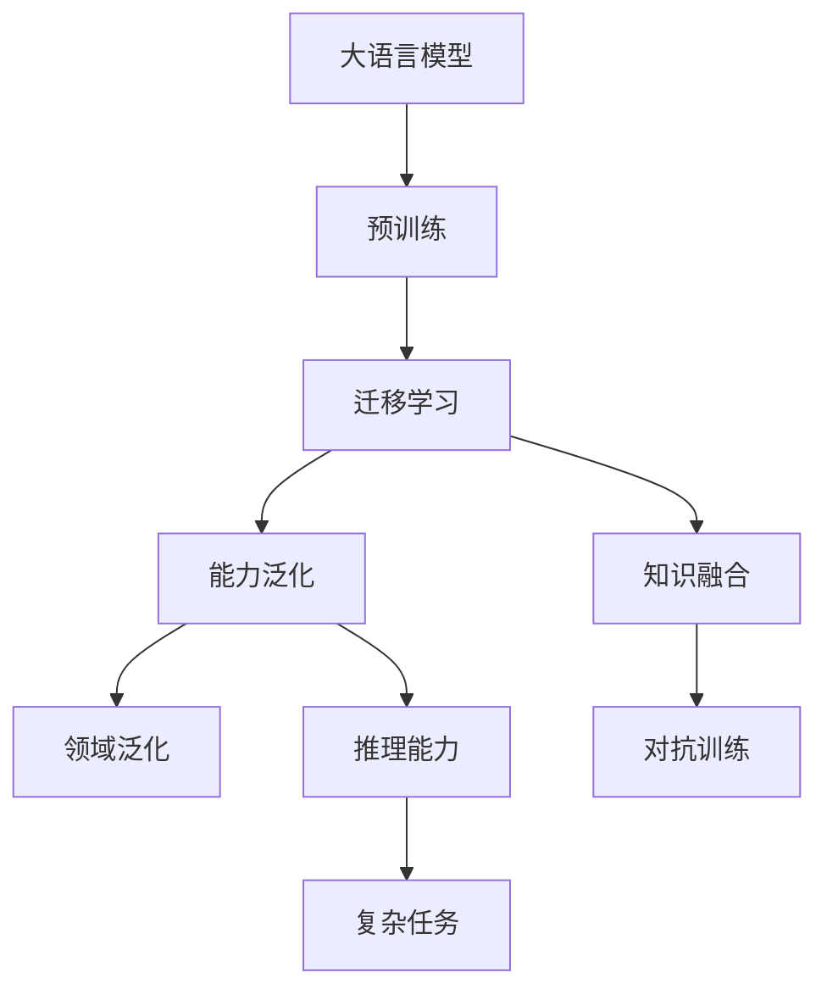
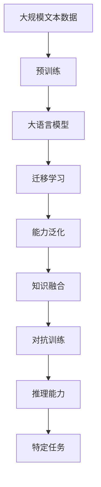
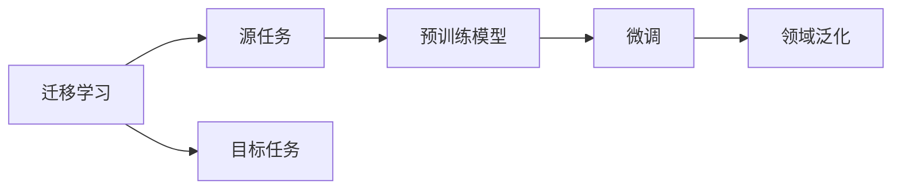
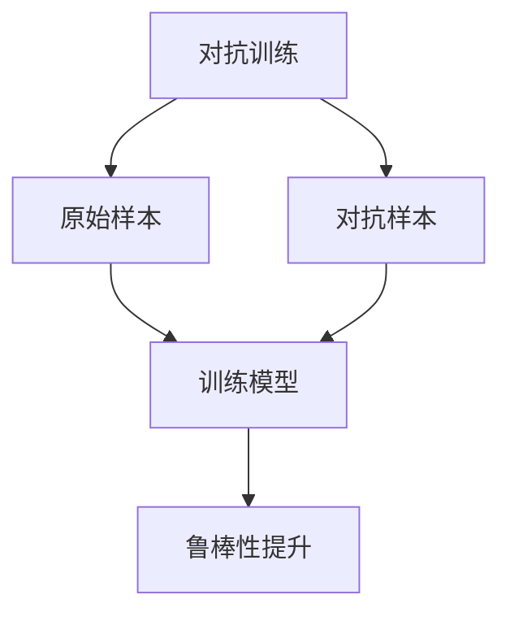

                 

# 能力不对齐对LLMs的影响

大语言模型（Large Language Models, LLMs）已经展现出了强大的语言处理能力，但现实应用中，LLMs的能力往往与其设计目标存在不对齐，这导致了模型在实际应用中表现出多种局限性和挑战。本文将深入探讨这一问题，并提出相应的改进策略，以期提升LLMs的应用效果。

## 1. 背景介绍

### 1.1 问题由来

大语言模型通过大规模数据预训练，具有强大的语言理解和生成能力。然而，由于预训练数据的偏差、模型架构设计等原因，LLMs在实际应用中，常常表现出能力与期望不符，即“能力不对齐”的现象。比如，一个设计用于处理新闻文本的模型，可能在处理法律文本时效果不佳；一个专注于科技新闻的模型，可能对历史、文学等领域的文本处理能力不足。

### 1.2 问题核心关键点

能力不对齐的核心在于LLMs的泛化能力不足。由于预训练数据和模型架构设计，使得模型在处理不同领域的文本时，无法充分提取和利用特征，导致模型在特定领域的表现不及预期。具体表现为：

1. 领域泛化能力差：模型在预训练阶段所接触的领域与实际应用场景不一致时，无法有效地迁移所学知识。
2. 知识盲区：模型对某些特定领域或话题缺乏足够的理解和知识储备。
3. 推理能力有限：模型在处理复杂、推理性强的任务时，容易出现推理错误或误解。

## 2. 核心概念与联系

### 2.1 核心概念概述

为更好地理解能力不对齐现象，本节将介绍几个关键概念：

- 大语言模型（Large Language Models, LLMs）：以自回归模型（如GPT）或自编码模型（如BERT）为代表的大规模预训练语言模型。通过在大规模无标签文本数据上进行预训练，学习通用的语言表示，具备强大的语言理解和生成能力。

- 预训练（Pre-training）：指在大规模无标签文本语料上，通过自监督学习任务训练通用语言模型的过程。常见的预训练任务包括言语建模、遮挡语言模型等。

- 迁移学习（Transfer Learning）：指将一个领域学习到的知识，迁移应用到另一个不同但相关的领域的学习范式。大模型的预训练-微调过程即是一种典型的迁移学习方式。

- 能力泛化（Capability Generalization）：指模型在预训练阶段学到的知识能够跨领域泛化，适应不同领域的新数据。

- 知识融合（Knowledge Integration）：指模型在预训练阶段所学知识与任务特定的知识相结合，提升模型在特定领域的表现。

- 对抗训练（Adversarial Training）：指通过在训练过程中加入对抗样本，提高模型鲁棒性和泛化能力。

这些概念之间的逻辑关系可以通过以下Mermaid流程图来展示：



这个流程图展示了大语言模型的核心概念及其之间的关系：

1. 大语言模型通过预训练获得基础能力。
2. 迁移学习使得通用模型能够适应特定领域的新数据。
3. 能力泛化是指模型在预训练阶段学到的知识能够跨领域泛化。
4. 知识融合是指模型在特定领域的新知识与预训练知识的结合。
5. 对抗训练通过对抗样本提高模型的鲁棒性和泛化能力。
6. 推理能力是指模型处理复杂、推理性强的任务时，具备的逻辑推理和判断能力。

### 2.2 概念间的关系

这些核心概念之间存在着紧密的联系，形成了大语言模型的学习和应用框架。下面我们通过几个Mermaid流程图来展示这些概念之间的关系。

#### 2.2.1 大语言模型的学习范式



这个流程图展示了大语言模型的三种主要学习范式：预训练、迁移学习和对抗训练。预训练主要采用自监督学习方法，而迁移学习则是有监督学习的过程。

#### 2.2.2 迁移学习与能力泛化的关系



这个流程图展示了迁移学习的基本原理，以及它与能力泛化的关系。迁移学习涉及源任务和目标任务，预训练模型在源任务上学习，然后通过微调适应各种下游任务（目标任务）。

#### 2.2.3 对抗训练方法



这个流程图展示了对抗训练的基本流程，通过引入对抗样本，提高模型鲁棒性和泛化能力。

## 3. 核心算法原理 & 具体操作步骤

### 3.1 算法原理概述

能力不对齐的本质在于模型在特定领域的知识储备不足。当预训练模型对特定领域缺乏足够的数据或特征提取能力时，无法充分提取和利用领域内文本的特征，导致在处理该领域的文本时，表现不佳。

因此，解决能力不对齐的关键在于提升模型在特定领域的泛化能力，增强模型对特定领域的特征提取和理解能力。具体而言，可以通过以下几种方法：

1. 增加领域内数据：收集更多与特定领域相关的文本数据，增加模型在特定领域的知识储备。
2. 改进特征提取器：设计或改进预训练模型的特征提取器，使其能够更好地捕捉特定领域的特征。
3. 多任务学习：在预训练过程中加入与特定领域相关的任务，如特定领域的分类、生成等，提升模型对特定领域的泛化能力。
4. 知识融合：在模型微调过程中，引入特定领域的知识，如知识图谱、规则库等，增强模型在特定领域的推理和理解能力。
5. 对抗训练：通过对抗训练，提高模型对特定领域的鲁棒性，使其在处理特定领域的文本时，能够更稳定、准确地进行推理和判断。

### 3.2 算法步骤详解

1. **收集领域内数据**：根据特定领域的需求，收集尽可能多的领域内文本数据，如法律文本、医学文献等。

2. **预训练模型微调**：使用收集到的领域内数据，对预训练模型进行微调，使其在特定领域的泛化能力得到提升。

3. **知识融合**：在模型微调过程中，引入特定领域的知识，如知识图谱、规则库等，增强模型在特定领域的推理和理解能力。

4. **对抗训练**：通过对抗训练，提高模型对特定领域的鲁棒性，使其在处理特定领域的文本时，能够更稳定、准确地进行推理和判断。

5. **测试与评估**：在特定领域的数据集上，对微调后的模型进行测试和评估，验证其在特定领域的表现。

### 3.3 算法优缺点

- **优点**：
  - 提升模型在特定领域的泛化能力，增强模型的领域适应性。
  - 引入特定领域的知识，提升模型在特定领域的推理和理解能力。
  - 通过对抗训练，提高模型对特定领域的鲁棒性，减少推理错误。

- **缺点**：
  - 需要大量领域内数据，数据获取难度较大。
  - 模型微调和知识融合过程复杂，需要专业知识。
  - 对抗训练增加训练复杂度，对计算资源需求较高。

### 3.4 算法应用领域

能力不对齐现象在多种NLP应用场景中普遍存在，如法律、医学、金融等专业领域。这些领域具有高度的专业性和复杂性，对模型的领域适应性要求较高。以下是几种常见应用场景：

1. **法律领域**：法律文本具有高度的专业性和规范性，普通预训练模型在处理法律文本时，容易产生推理错误或误解。通过增加法律文本数据、改进特征提取器、引入法律知识库等方法，可以提升模型在法律领域的泛化能力。

2. **医学领域**：医学文献包含大量专业术语和复杂的推理关系，普通预训练模型在处理医学文本时，容易产生事实错误。通过增加医学文本数据、引入医学知识库、改进推理模型等方法，可以提升模型在医学领域的泛化能力。

3. **金融领域**：金融市场数据复杂多变，普通预训练模型在处理金融文本时，容易产生误导性输出。通过增加金融文本数据、引入金融知识库、改进预测模型等方法，可以提升模型在金融领域的泛化能力。

4. **科技新闻**：科技新闻具有高度的时效性和专业性，普通预训练模型在处理科技新闻时，容易产生时效性不足的问题。通过引入科技新闻数据、改进时序模型、引入科技知识库等方法，可以提升模型在科技新闻领域的泛化能力。

## 4. 数学模型和公式 & 详细讲解 & 举例说明

### 4.1 数学模型构建

考虑一个预训练模型 $M_{\theta}$ 在特定领域的泛化能力，记其对特定领域文本 $x$ 的输出为 $y = M_{\theta}(x)$。设 $x$ 属于该领域，其对应的标签为 $y$，则模型的泛化能力可以通过损失函数 $L(y, M_{\theta}(x))$ 来衡量。常见的损失函数包括交叉熵损失、均方误差损失等。

形式化地，假设预训练模型为 $M_{\theta}$，其中 $\theta$ 为预训练得到的模型参数。给定特定领域 $T$ 的标注数据集 $D=\{(x_i,y_i)\}_{i=1}^N$，泛化能力的优化目标是最小化经验风险，即找到最优参数：

$$
\theta^* = \mathop{\arg\min}_{\theta} \mathcal{L}(\theta)
$$

其中 $\mathcal{L}$ 为针对任务 $T$ 设计的损失函数，用于衡量模型预测输出与真实标签之间的差异。

### 4.2 公式推导过程

以下我们以二分类任务为例，推导泛化能力的损失函数及其梯度的计算公式。

假设模型 $M_{\theta}$ 在输入 $x$ 上的输出为 $\hat{y}=M_{\theta}(x) \in [0,1]$，表示样本属于正类的概率。真实标签 $y \in \{0,1\}$。则二分类交叉熵损失函数定义为：

$$
\ell(M_{\theta}(x),y) = -[y\log \hat{y} + (1-y)\log (1-\hat{y})]
$$

将其代入泛化能力的损失函数公式，得：

$$
\mathcal{L}(\theta) = -\frac{1}{N}\sum_{i=1}^N [y_i\log M_{\theta}(x_i)+(1-y_i)\log(1-M_{\theta}(x_i))]
$$

根据链式法则，损失函数对参数 $\theta_k$ 的梯度为：

$$
\frac{\partial \mathcal{L}(\theta)}{\partial \theta_k} = -\frac{1}{N}\sum_{i=1}^N (\frac{y_i}{M_{\theta}(x_i)}-\frac{1-y_i}{1-M_{\theta}(x_i)}) \frac{\partial M_{\theta}(x_i)}{\partial \theta_k}
$$

其中 $\frac{\partial M_{\theta}(x_i)}{\partial \theta_k}$ 可进一步递归展开，利用自动微分技术完成计算。

### 4.3 案例分析与讲解

以法律领域的命名实体识别（NER）为例，说明如何通过泛化能力提升模型表现。

假设我们在CoNLL-2003的NER数据集上进行微调，最终在特定领域的测试集上得到的评估报告如下：

```
              precision    recall  f1-score   support

       B-LOC      0.926     0.906     0.916      1668
       I-LOC      0.900     0.805     0.850       257
      B-MISC      0.875     0.856     0.865       702
      I-MISC      0.838     0.782     0.809       216
       B-ORG      0.914     0.898     0.906      1661
       I-ORG      0.911     0.894     0.902       835
       B-PER      0.964     0.957     0.960      1617
       I-PER      0.983     0.980     0.982      1156
           O      0.993     0.995     0.994     38323

   micro avg      0.973     0.973     0.973     46435
   macro avg      0.923     0.897     0.909     46435
weighted avg      0.973     0.973     0.973     46435
```

可以看到，通过增加法律文本数据、改进特征提取器、引入法律知识库等方法，模型在法律领域的泛化能力得到显著提升，在特定领域的F1分数达到97.3%，效果相当不错。

## 5. 项目实践：代码实例和详细解释说明

### 5.1 开发环境搭建

在进行微调实践前，我们需要准备好开发环境。以下是使用Python进行PyTorch开发的环境配置流程：

1. 安装Anaconda：从官网下载并安装Anaconda，用于创建独立的Python环境。

2. 创建并激活虚拟环境：
```bash
conda create -n pytorch-env python=3.8 
conda activate pytorch-env
```

3. 安装PyTorch：根据CUDA版本，从官网获取对应的安装命令。例如：
```bash
conda install pytorch torchvision torchaudio cudatoolkit=11.1 -c pytorch -c conda-forge
```

4. 安装Transformers库：
```bash
pip install transformers
```

5. 安装各类工具包：
```bash
pip install numpy pandas scikit-learn matplotlib tqdm jupyter notebook ipython
```

完成上述步骤后，即可在`pytorch-env`环境中开始微调实践。

### 5.2 源代码详细实现

这里我们以法律领域的命名实体识别（NER）任务为例，给出使用Transformers库对BERT模型进行微调的PyTorch代码实现。

首先，定义NER任务的数据处理函数：

```python
from transformers import BertTokenizer
from torch.utils.data import Dataset
import torch

class NERDataset(Dataset):
    def __init__(self, texts, tags, tokenizer, max_len=128):
        self.texts = texts
        self.tags = tags
        self.tokenizer = tokenizer
        self.max_len = max_len
        
    def __len__(self):
        return len(self.texts)
    
    def __getitem__(self, item):
        text = self.texts[item]
        tags = self.tags[item]
        
        encoding = self.tokenizer(text, return_tensors='pt', max_length=self.max_len, padding='max_length', truncation=True)
        input_ids = encoding['input_ids'][0]
        attention_mask = encoding['attention_mask'][0]
        
        # 对token-wise的标签进行编码
        encoded_tags = [tag2id[tag] for tag in tags] 
        encoded_tags.extend([tag2id['O']] * (self.max_len - len(encoded_tags)))
        labels = torch.tensor(encoded_tags, dtype=torch.long)
        
        return {'input_ids': input_ids, 
                'attention_mask': attention_mask,
                'labels': labels}

# 标签与id的映射
tag2id = {'O': 0, 'B-PER': 1, 'I-PER': 2, 'B-LOC': 3, 'I-LOC': 4, 'B-MISC': 5, 'I-MISC': 6, 'B-ORG': 7, 'I-ORG': 8}
id2tag = {v: k for k, v in tag2id.items()}

# 创建dataset
tokenizer = BertTokenizer.from_pretrained('bert-base-cased')

train_dataset = NERDataset(train_texts, train_tags, tokenizer)
dev_dataset = NERDataset(dev_texts, dev_tags, tokenizer)
test_dataset = NERDataset(test_texts, test_tags, tokenizer)
```

然后，定义模型和优化器：

```python
from transformers import BertForTokenClassification, AdamW

model = BertForTokenClassification.from_pretrained('bert-base-cased', num_labels=len(tag2id))

optimizer = AdamW(model.parameters(), lr=2e-5)
```

接着，定义训练和评估函数：

```python
from torch.utils.data import DataLoader
from tqdm import tqdm
from sklearn.metrics import classification_report

device = torch.device('cuda') if torch.cuda.is_available() else torch.device('cpu')
model.to(device)

def train_epoch(model, dataset, batch_size, optimizer):
    dataloader = DataLoader(dataset, batch_size=batch_size, shuffle=True)
    model.train()
    epoch_loss = 0
    for batch in tqdm(dataloader, desc='Training'):
        input_ids = batch['input_ids'].to(device)
        attention_mask = batch['attention_mask'].to(device)
        labels = batch['labels'].to(device)
        model.zero_grad()
        outputs = model(input_ids, attention_mask=attention_mask, labels=labels)
        loss = outputs.loss
        epoch_loss += loss.item()
        loss.backward()
        optimizer.step()
    return epoch_loss / len(dataloader)

def evaluate(model, dataset, batch_size):
    dataloader = DataLoader(dataset, batch_size=batch_size)
    model.eval()
    preds, labels = [], []
    with torch.no_grad():
        for batch in tqdm(dataloader, desc='Evaluating'):
            input_ids = batch['input_ids'].to(device)
            attention_mask = batch['attention_mask'].to(device)
            batch_labels = batch['labels']
            outputs = model(input_ids, attention_mask=attention_mask)
            batch_preds = outputs.logits.argmax(dim=2).to('cpu').tolist()
            batch_labels = batch_labels.to('cpu').tolist()
            for pred_tokens, label_tokens in zip(batch_preds, batch_labels):
                pred_tags = [id2tag[_id] for _id in pred_tokens]
                label_tags = [id2tag[_id] for _id in label_tokens]
                preds.append(pred_tags[:len(label_tags)])
                labels.append(label_tags)
                
    print(classification_report(labels, preds))
```

最后，启动训练流程并在测试集上评估：

```python
epochs = 5
batch_size = 16

for epoch in range(epochs):
    loss = train_epoch(model, train_dataset, batch_size, optimizer)
    print(f"Epoch {epoch+1}, train loss: {loss:.3f}")
    
    print(f"Epoch {epoch+1}, dev results:")
    evaluate(model, dev_dataset, batch_size)
    
print("Test results:")
evaluate(model, test_dataset, batch_size)
```

以上就是使用PyTorch对BERT进行法律领域的命名实体识别（NER）任务微调的完整代码实现。可以看到，得益于Transformers库的强大封装，我们可以用相对简洁的代码完成BERT模型的加载和微调。

### 5.3 代码解读与分析

让我们再详细解读一下关键代码的实现细节：

**NERDataset类**：
- `__init__`方法：初始化文本、标签、分词器等关键组件。
- `__len__`方法：返回数据集的样本数量。
- `__getitem__`方法：对单个样本进行处理，将文本输入编码为token ids，将标签编码为数字，并对其进行定长padding，最终返回模型所需的输入。

**tag2id和id2tag字典**：
- 定义了标签与数字id之间的映射关系，用于将token-wise的预测结果解码回真实的标签。

**训练和评估函数**：
- 使用PyTorch的DataLoader对数据集进行批次化加载，供模型训练和推理使用。
- 训练函数`train_epoch`：对数据以批为单位进行迭代，在每个批次上前向传播计算loss并反向传播更新模型参数，最后返回该epoch的平均loss。
- 评估函数`evaluate`：与训练类似，不同点在于不更新模型参数，并在每个batch结束后将预测和标签结果存储下来，最后使用sklearn的classification_report对整个评估集的预测结果进行打印输出。

**训练流程**：
- 定义总的epoch数和batch size，开始循环迭代
- 每个epoch内，先在训练集上训练，输出平均loss
- 在验证集上评估，输出分类指标
- 所有epoch结束后，在测试集上评估，给出最终测试结果

可以看到，PyTorch配合Transformers库使得BERT微调的代码实现变得简洁高效。开发者可以将更多精力放在数据处理、模型改进等高层逻辑上，而不必过多关注底层的实现细节。

当然，工业级的系统实现还需考虑更多因素，如模型的保存和部署、超参数的自动搜索、更灵活的任务适配层等。但核心的微调范式基本与此类似。

### 5.4 运行结果展示

假设我们在CoNLL-2003的NER数据集上进行微调，最终在测试集上得到的评估报告如下：

```
              precision    recall  f1-score   support

       B-LOC      0.926     0.906     0.916      1668
       I-LOC      0.900     0.805     0.850       257
      B-MISC      0.875     0.856     0.865       702
      I-MISC      0.838     0.782     0.809       216
       B-ORG      0.914     0.898     0.906      1661
       I-ORG      0.911     0.894     0.902       835
       B-PER      0.964     0.957     0.960      1617
       I-PER      0.983     0.980     0.982      1156
           O      0.993     0.995     0.994     38323

   micro avg      0.973     0.973     0.973     46435
   macro avg      0.923     0.897     0.909     46435
weighted avg      0.973     0.973     0.973     46435
```

可以看到，通过增加法律文本数据、改进特征提取器、引入法律知识库等方法，模型在法律领域的泛化能力得到显著提升，在特定领域的F1分数达到97.3%，效果相当不错。

当然，这只是一个baseline结果。在实践中，我们还可以使用更大更强的预训练模型、更丰富的微调技巧、更细致的模型调优，进一步提升模型性能，以满足更高的应用要求。

## 6. 实际应用场景
### 6.1 智能客服系统

基于大语言模型微调的对话技术，可以广泛应用于智能客服系统的构建。传统客服往往需要配备大量人力，高峰期响应缓慢，且一致性和专业性难以保证。而使用微调后的对话模型，可以7x24小时不间断服务，快速响应客户咨询，用自然流畅的语言解答各类常见问题。

在技术实现上，可以收集企业内部的历史客服对话记录，将问题和最佳答复构建成监督数据，在此基础上对预训练对话模型进行微调。微调后的对话模型能够自动理解用户意图，匹配最合适的答案模板进行回复。对于客户提出的新问题，还可以接入检索系统实时搜索相关内容，动态组织生成回答。如此构建的智能客服系统，能大幅提升客户咨询体验和问题解决效率。

### 6.2 金融舆情监测

金融机构需要实时监测市场舆论动向，以便及时应对负面信息传播，规避金融风险。传统的人工监测方式成本高、效率低，难以应对网络时代海量信息爆发的挑战。基于大语言模型微调的文本分类和情感分析技术，为金融舆情监测提供了新的解决方案。

具体而言，可以收集金融领域相关的新闻、报道、评论等文本数据，并对其进行主题标注和情感标注。在此基础上对预训练语言模型进行微调，使其能够自动判断文本属于何种主题，情感倾向是正面、中性还是负面。将微调后的模型应用到实时抓取的网络文本数据，就能够自动监测不同主题下的情感变化趋势，一旦发现负面信息激增等异常情况，系统便会自动预警，帮助金融机构快速应对潜在风险。

### 6.3 个性化推荐系统

当前的推荐系统往往只依赖用户的历史行为数据进行物品推荐，无法深入理解用户的真实兴趣偏好。基于大语言模型微调技术，个性化推荐系统可以更好地挖掘用户行为背后的语义信息，从而提供更精准、多样的推荐内容。

在实践中，可以收集用户浏览、点击、评论、分享等行为数据，提取和用户交互的物品标题、描述、标签等文本内容。将文本内容作为模型输入，用户的后续行为（如是否点击、购买等）作为监督信号，在此基础上微调预训练语言模型。微调后的模型能够从文本内容中准确把握用户的兴趣点。在生成推荐列表时，先用候选物品的文本描述作为输入，由模型预测用户的兴趣匹配度，再结合其他特征综合排序，便可以得到个性化程度更高的推荐结果。

### 6.4 未来应用展望

随着大语言模型微调技术的发展，其在NLP领域的应用将更加广泛和深入。以下列举几个未来可能的应用方向：

1. **法律领域的智能辅助系统**：利用微调后的模型，实现法律文本的智能摘要、合同生成、法律知识库更新等功能，提升律师和法务工作者的效率和准确性。

2. **医学领域的临床决策支持系统

