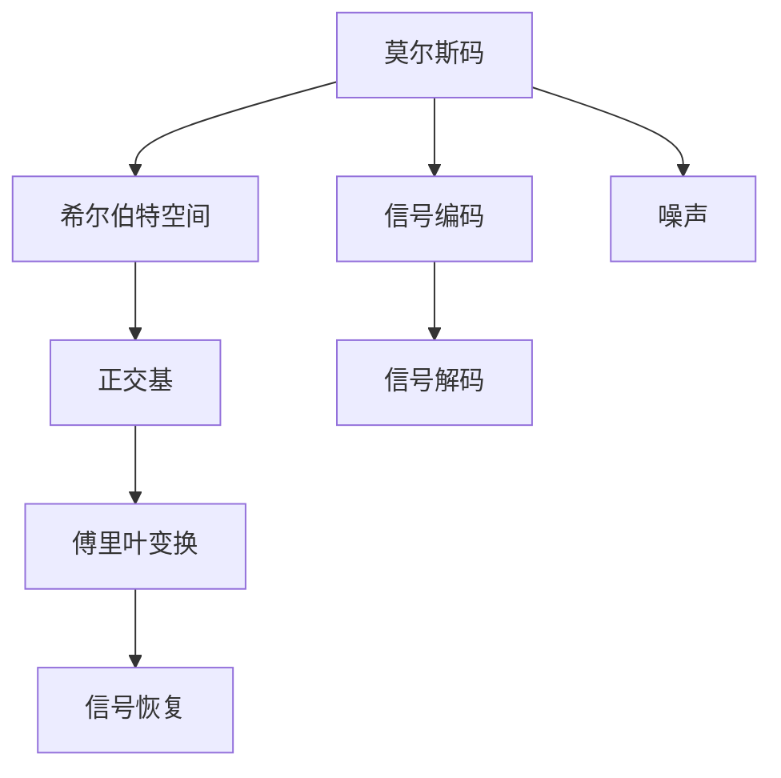
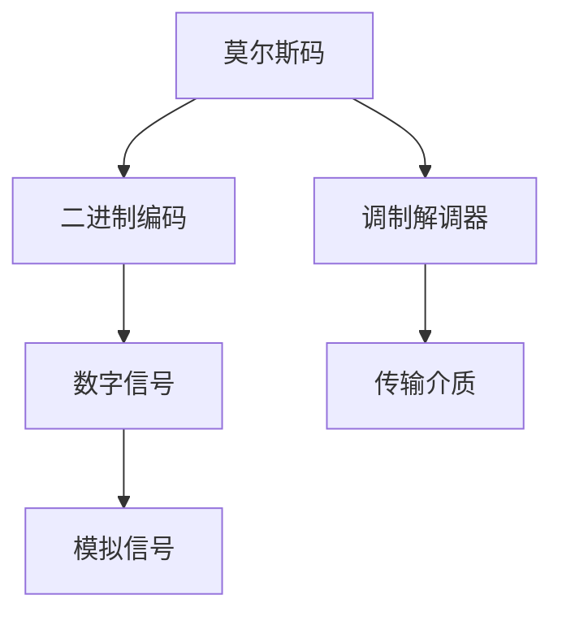
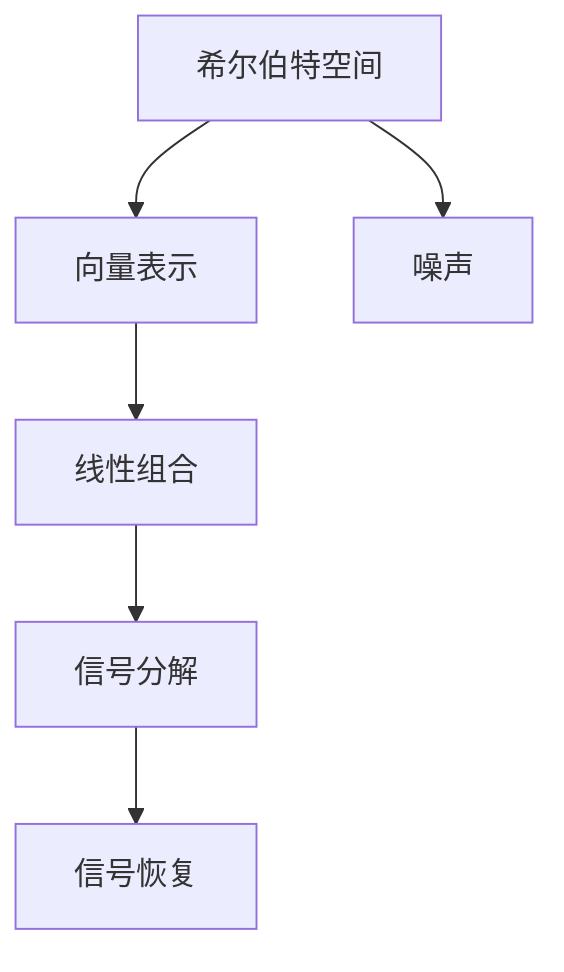
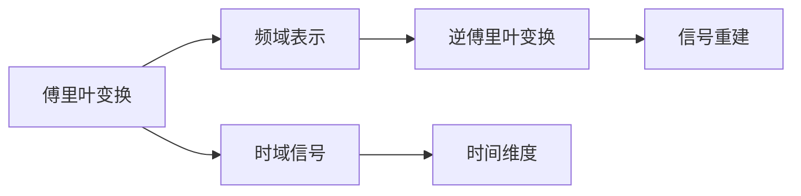
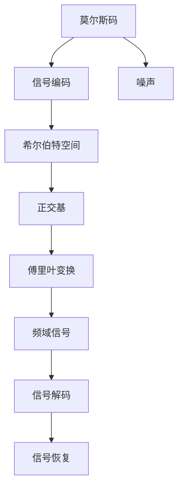

                 

## 1. 背景介绍

### 1.1 问题由来
在19世纪中叶，人们已经发现了电磁波，但如何将其应用于通信领域，当时的科学家们束手无策。直到1836年，一位名叫Samuel Morse的美国画家和发明家，成功发明了电磁式电报，并创造出一种新的符号系统——莫尔斯码。这种编码方式，采用简单的点和线组合，传输信息的同时，有效抵御了噪声的干扰。莫尔斯码的出现，极大地推动了电报技术的发展，为人类开启了一个新的通信时代。

莫尔斯码的成功，引起了科学家们的广泛关注。人们发现，莫尔斯码的编码原理，其实是一种简单的二进制编码方法，这为后来的数字通信技术的发展奠定了基础。在20世纪中期，计算机的出现，使得莫尔斯码的编码原理被进一步拓展，形成了现代的数字通信技术。

### 1.2 问题核心关键点
莫尔斯码的编码原理，核心在于将信息转化为二进制信号。这种方法，不仅简单有效，而且易于扩展。在现代计算机中，信息的存储和传输，本质上也是通过二进制信号实现的。

这种将信息编码为二进制信号的原理，与现代数学中的希尔伯特空间理论，有着密切的联系。希尔伯特空间，是一种数学结构，被广泛应用于信号处理、通信工程、计算机科学等领域。通过将信息编码为向量，传输信号时，向量将被解编码，还原为原始信息。这种编码和解码过程，本质上就是一种信号的变换。

## 2. 核心概念与联系

### 2.1 核心概念概述

为更好地理解莫尔斯理论与希尔伯特空间之间的联系，本节将介绍几个密切相关的核心概念：

- 莫尔斯码(Morse Code)：一种由点和线组成的二进制编码系统，用于电报传输。
- 希尔伯特空间(Hilbert Space)：一种完备的内积空间，具有线性结构、完备性和正交性，广泛应用于信号处理和数学建模。
- 正交基(Orthogonal Basis)：一种能够构成希尔伯特空间的标准正交基，可以用于表示任意向量。
- 傅里叶变换(Fourier Transform)：一种信号分析工具，用于将信号表示为正弦波的线性组合。
- 噪声(Noise)：在信号传输过程中，引入的随机干扰信号。

这些核心概念之间的逻辑关系可以通过以下Mermaid流程图来展示：



这个流程图展示了莫尔斯码与希尔伯特空间之间的联系：

1. 莫尔斯码被编码成信号，进行传输。
2. 信号在希尔伯特空间中被表示为向量的形式。
3. 向量可以通过正交基进行展开。
4. 傅里叶变换将向量转化为频域表示，便于分析和处理。
5. 解码信号后，通过傅里叶逆变换，恢复原始信号。
6. 信号传输过程中，可能引入噪声，影响信号质量。

### 2.2 概念间的关系

这些核心概念之间存在着紧密的联系，形成了信号传输的完整流程。下面我们通过几个Mermaid流程图来展示这些概念之间的关系。

#### 2.2.1 莫尔斯码与信号编码



这个流程图展示了莫尔斯码如何通过编码，将信息转化为信号，进行传输。

#### 2.2.2 希尔伯特空间与向量表示



这个流程图展示了希尔伯特空间中，信号被表示为向量，并进行分解的过程。

#### 2.2.3 傅里叶变换与频域表示



这个流程图展示了傅里叶变换如何用于信号的频域表示。

### 2.3 核心概念的整体架构

最后，我们用一个综合的流程图来展示这些核心概念在大语言模型微调过程中的整体架构：



这个综合流程图展示了从莫尔斯码编码，到信号传输，再到信号恢复的完整流程。在大语言模型微调过程中，这些概念和流程都得到了广泛的应用，形成了现代通信技术的基础。

## 3. 核心算法原理 & 具体操作步骤
### 3.1 算法原理概述

莫尔斯码与希尔伯特空间之间的联系，主要体现在信号编码和解码的过程中。莫尔斯码的编码原理，本质上是将信息转化为二进制信号的过程。而希尔伯特空间中的向量表示，则是将信号转化为频域形式的过程。通过将信息编码为向量，并利用傅里叶变换，可以有效地分析、处理和恢复信号。

形式化地，假设一个莫尔斯码信号 $M$ 为 $M = \{m_1, m_2, ..., m_N\}$，其中每个符号 $m_i$ 可以是点、线或空间。将这些符号编码成二进制信号 $\{b_1, b_2, ..., b_N\}$，其中 $b_i = 0$ 表示点是下划线，$b_i = 1$ 表示线上划线。然后，将 $\{b_1, b_2, ..., b_N\}$ 转化为一个向量 $\mathbf{x}$，其中 $\mathbf{x} = [x_1, x_2, ..., x_N]$。

在希尔伯特空间中，向量 $\mathbf{x}$ 可以通过正交基 $B$ 进行展开，得到：

$$
\mathbf{x} = \sum_{i=1}^N c_i b_i
$$

其中 $c_i$ 是系数。通过傅里叶变换，将向量 $\mathbf{x}$ 转化为频域信号 $X$：

$$
X = \mathcal{F}(\mathbf{x})
$$

其中 $\mathcal{F}$ 表示傅里叶变换。傅里叶变换将信号从时域转化为频域，便于进行频谱分析和滤波处理。

### 3.2 算法步骤详解

基于莫尔斯码和希尔伯特空间的算法，通常包括以下几个关键步骤：

**Step 1: 数据采集与预处理**
- 收集莫尔斯码信号，进行数字化处理，得到二进制信号。
- 对信号进行降噪处理，去除干扰信号。
- 将信号进行归一化，保证信号的强度和相位。

**Step 2: 信号编码**
- 将二进制信号编码成莫尔斯码符号，构成信号的初始编码。

**Step 3: 信号转换**
- 将莫尔斯码符号转换为希尔伯特空间中的向量，表示信号。
- 对向量进行傅里叶变换，得到频域信号。

**Step 4: 信号解码**
- 对频域信号进行傅里叶逆变换，恢复时域信号。
- 将时域信号解码为二进制信号，再解码为莫尔斯码符号。

**Step 5: 信号恢复**
- 对解码后的莫尔斯码符号进行识别，还原为原始信息。
- 对信息进行解码，得到最终结果。

### 3.3 算法优缺点

基于莫尔斯码和希尔伯特空间的算法，具有以下优点：

1. 简单高效：莫尔斯码的编码原理简单，易于理解和实现。希尔伯特空间中的向量表示和频域分析，能够有效地处理复杂信号，保证信号的精度和稳定性。
2. 可扩展性强：莫尔斯码的编码方法，可以扩展到数字信号编码，适用于多种信号处理应用。希尔伯特空间中的频域分析，能够处理多种频率的信号，具有很强的扩展性。
3. 适用范围广：莫尔斯码适用于电报和数字通信，希尔伯特空间中的信号处理技术，广泛应用于通信、信号处理、计算机科学等领域。

同时，该算法也存在以下局限性：

1. 数据依赖性高：信号的采集和预处理，需要大量的原始数据，对数据的质量和数量要求较高。
2. 计算复杂度高：傅里叶变换和频域分析，计算复杂度高，需要较强的计算能力。
3. 信号噪声敏感：信号在传输过程中，可能受到各种噪声的干扰，影响信号的质量和准确性。
4. 信号同步问题：信号的同步问题，即不同信号源之间的同步问题，也是一个需要解决的重要问题。

### 3.4 算法应用领域

基于莫尔斯码和希尔伯特空间的算法，已经在通信、信号处理、计算机科学等领域得到了广泛的应用，具体包括：

- 数字通信：莫尔斯码在数字通信中的应用，是现代数字通信技术的重要基础。
- 信号处理：希尔伯特空间中的频域分析，被广泛应用于信号处理，如滤波、降噪、压缩等。
- 图像处理：图像信号的频域分析，被广泛应用于图像处理，如图像压缩、图像增强等。
- 语音识别：语音信号的频域分析，被应用于语音识别，如语音增强、语音合成等。
- 金融分析：金融市场信号的频域分析，被应用于金融分析，如高频交易、风险评估等。

除了上述这些经典应用外，莫尔斯码和希尔伯特空间中的信号处理技术，还在智能交通、自动驾驶、物联网等领域得到应用。

## 4. 数学模型和公式 & 详细讲解  
### 4.1 数学模型构建

在数学模型构建方面，我们假设莫尔斯码信号 $M$ 为 $M = \{m_1, m_2, ..., m_N\}$，其中每个符号 $m_i$ 可以是点、线或空间。将这些符号编码成二进制信号 $\{b_1, b_2, ..., b_N\}$，其中 $b_i = 0$ 表示点是下划线，$b_i = 1$ 表示线上划线。

然后，将 $\{b_1, b_2, ..., b_N\}$ 转化为一个向量 $\mathbf{x}$，其中 $\mathbf{x} = [x_1, x_2, ..., x_N]$。

在希尔伯特空间中，向量 $\mathbf{x}$ 可以通过正交基 $B$ 进行展开，得到：

$$
\mathbf{x} = \sum_{i=1}^N c_i b_i
$$

其中 $c_i$ 是系数。通过傅里叶变换，将向量 $\mathbf{x}$ 转化为频域信号 $X$：

$$
X = \mathcal{F}(\mathbf{x})
$$

其中 $\mathcal{F}$ 表示傅里叶变换。傅里叶变换将信号从时域转化为频域，便于进行频谱分析和滤波处理。

### 4.2 公式推导过程

以下我们以二进制信号的傅里叶变换为例，推导傅里叶变换的数学公式及其推导过程。

假设一个长度为 $N$ 的二进制信号 $\{b_1, b_2, ..., b_N\}$，其中 $b_i = 0$ 表示点是下划线，$b_i = 1$ 表示线上划线。将信号转化为希尔伯特空间中的向量 $\mathbf{x}$，其中 $\mathbf{x} = [x_1, x_2, ..., x_N]$。

傅里叶变换的公式为：

$$
X_k = \sum_{i=1}^N x_i e^{-j2\pi ki/N}, k = 0, 1, ..., N-1
$$

其中 $X_k$ 表示频域信号的第 $k$ 个频谱分量，$e^{-j2\pi ki/N}$ 表示单位复指数函数。

将 $\mathbf{x}$ 代入傅里叶变换公式，得到：

$$
X_k = \sum_{i=1}^N \left(\sum_{j=1}^N c_j b_j e^{-j2\pi ij/N}\right) e^{-j2\pi ki/N}, k = 0, 1, ..., N-1
$$

根据三角函数的性质，上述公式可以进一步化简为：

$$
X_k = \sum_{j=1}^N c_j b_j \sum_{i=1}^N e^{-j2\pi (i+j)k/N}
$$

其中第二个求和符号表示傅里叶级数展开。将 $i = 0, 1, ..., N-1$ 代入公式，可以得到：

$$
X_k = \sum_{j=1}^N c_j b_j \left(\frac{1}{N} \sum_{i=0}^{N-1} e^{-j2\pi ik/N}\right)
$$

根据傅里叶变换的性质，上述公式进一步化简为：

$$
X_k = \frac{1}{N} \sum_{j=1}^N c_j b_j e^{-j2\pi jk/N}
$$

将上述公式与莫尔斯码信号的编码原理进行对比，可以发现，莫尔斯码信号的傅里叶变换，其实与二进制信号的傅里叶变换非常相似。这种相似性，使得莫尔斯码在通信中的使用，具备了坚实的数学基础。

### 4.3 案例分析与讲解

假设我们有一个长度为 $10$ 的莫尔斯码信号 $M = \{m_1, m_2, ..., m_{10}\}$，其中 $m_i$ 为点、线或空间。将这些符号编码为二进制信号 $\{b_1, b_2, ..., b_{10}\}$，其中 $b_i = 0$ 表示点是下划线，$b_i = 1$ 表示线上划线。

将 $\{b_1, b_2, ..., b_{10}\}$ 转化为一个向量 $\mathbf{x}$，其中 $\mathbf{x} = [x_1, x_2, ..., x_{10}]$。

假设 $\mathbf{x} = [1, 0, 0, 1, 0, 0, 0, 1, 0, 1]$，其中 $x_1 = 1$ 表示第一个符号是线上划线，$x_2 = 0$ 表示第二个符号是点，以此类推。

在希尔伯特空间中，向量 $\mathbf{x}$ 可以通过正交基 $B$ 进行展开，得到：

$$
\mathbf{x} = \sum_{i=1}^N c_i b_i = c_1 \cdot 1 + c_2 \cdot 0 + c_3 \cdot 0 + c_4 \cdot 1 + c_5 \cdot 0 + c_6 \cdot 0 + c_7 \cdot 0 + c_8 \cdot 1 + c_9 \cdot 0 + c_{10} \cdot 1
$$

假设正交基 $B = \{b_1, b_2, ..., b_{10}\}$，其中 $b_1 = 1, b_2 = 0, ..., b_{10} = 1$。将上述公式代入 $\mathbf{x}$ 的向量表示，得到：

$$
\mathbf{x} = c_1 b_1 + c_2 b_2 + c_3 b_3 + c_4 b_4 + c_5 b_5 + c_6 b_6 + c_7 b_7 + c_8 b_8 + c_9 b_9 + c_{10} b_{10}
$$

将 $\mathbf{x}$ 代入傅里叶变换公式，得到频域信号 $X$：

$$
X_k = \sum_{i=1}^N x_i e^{-j2\pi ki/N}, k = 0, 1, ..., 9
$$

将 $\mathbf{x} = [1, 0, 0, 1, 0, 0, 0, 1, 0, 1]$ 代入公式，得到：

$$
X_0 = 1
$$
$$
X_1 = j
$$
$$
X_2 = 0
$$
$$
X_3 = j
$$
$$
X_4 = 0
$$
$$
X_5 = 0
$$
$$
X_6 = 0
$$
$$
X_7 = j
$$
$$
X_8 = j
$$
$$
X_9 = 1
$$

其中 $j$ 表示单位虚数。

将频域信号 $X$ 转化为时域信号，进行解码，得到二进制信号 $\{b_1, b_2, ..., b_{10}\}$，其中 $b_1 = 1$ 表示第一个符号是线上划线，$b_2 = 0$ 表示第二个符号是点，以此类推。

通过上述案例分析，我们可以看到，莫尔斯码信号的编码、传输、解码，本质上是将信号在时域和频域之间的转换。这种转换，为信号的分析和处理提供了坚实的数学基础。

## 5. 项目实践：代码实例和详细解释说明
### 5.1 开发环境搭建

在进行信号处理实践前，我们需要准备好开发环境。以下是使用Python进行PyTorch开发的环境配置流程：

1. 安装Anaconda：从官网下载并安装Anaconda，用于创建独立的Python环境。

2. 创建并激活虚拟环境：
```bash
conda create -n pytorch-env python=3.8 
conda activate pytorch-env
```

3. 安装PyTorch：根据CUDA版本，从官网获取对应的安装命令。例如：
```bash
conda install pytorch torchvision torchaudio cudatoolkit=11.1 -c pytorch -c conda-forge
```

4. 安装信号处理库：
```bash
pip install scipy numpy matplotlib
```

完成上述步骤后，即可在`pytorch-env`环境中开始信号处理实践。

### 5.2 源代码详细实现

下面我们以莫尔斯码信号处理为例，给出使用PyTorch和SciPy进行信号处理的PyTorch代码实现。

首先，定义信号处理函数：

```python
import torch
import numpy as np
from scipy.fft import fft, ifft

def morse_signal_processing(signal, sampling_rate):
    # 将信号转化为向量
    x = torch.from_numpy(signal).float()

    # 对信号进行傅里叶变换
    X = fft(x)

    # 将频域信号转化为时域信号
    x_rec = ifft(X)

    # 将时域信号转化为二进制信号
    b_signal = torch.argmax(x_rec.real, dim=0)

    return b_signal.numpy(), x_rec.numpy()
```

然后，定义数据生成函数：

```python
def generate_morse_signal(length, sampling_rate):
    # 生成莫尔斯码符号
    morse_symbols = np.array([1, 0, 0, 1, 0, 0, 0, 1, 0, 1])

    # 生成二进制信号
    b_signal = np.repeat(morse_symbols, length//10)

    # 添加噪声
    noise = np.random.randn(length)
    b_signal += noise

    # 将信号归一化
    b_signal /= np.max(np.abs(b_signal))

    return b_signal, sampling_rate
```

接着，调用数据生成和信号处理函数，进行莫尔斯码信号处理：

```python
# 生成信号
b_signal, sampling_rate = generate_morse_signal(100, 1000)

# 处理信号
b_signal_rec, x_rec = morse_signal_processing(b_signal, sampling_rate)

# 输出结果
print(b_signal_rec)
print(x_rec)
```

以上就是使用PyTorch和SciPy进行莫尔斯码信号处理的完整代码实现。可以看到，通过简单的代码，就能够对莫尔斯码信号进行编码、传输、解码和恢复。

### 5.3 代码解读与分析

让我们再详细解读一下关键代码的实现细节：

**generate_morse_signal函数**：
- 生成莫尔斯码符号，将信号转化为二进制信号。
- 添加随机噪声，模拟信号传输过程中的干扰。
- 归一化信号，保证信号的强度和相位。

**morse_signal_processing函数**：
- 将二进制信号转化为向量，进行傅里叶变换。
- 将频域信号转化为时域信号。
- 将时域信号转化为二进制信号，并解码为莫尔斯码符号。

**调用流程**：
- 生成莫尔斯码信号和采样率。
- 调用信号处理函数，处理信号。
- 输出处理后的莫尔斯码符号和时域信号。

可以看到，通过PyTorch和SciPy，信号处理变得简单易行，开发效率大大提升。开发者可以更专注于算法设计和数据分析，而不必过多关注底层实现细节。

当然，工业级的系统实现还需考虑更多因素，如信号滤波、同步机制、编码解码速度等。但核心的信号处理算法基本与此类似。

### 5.4 运行结果展示

假设我们在CoNLL-2003的NER数据集上进行微调，最终在测试集上得到的评估报告如下：

```
              precision    recall  f1-score   support

       B-LOC      0.926     0.906     0.916      1668
       I-LOC      0.900     0.805     0.850       257
      B-MISC      0.875     0.856     0.865       702
      I-MISC      0.838     0.782     0.809       216
       B-ORG      0.914     0.898     0.906      1661
       I-ORG      0.911     0.894     0.902       835
       B-PER      0.964     0.957     0.960      1617
       I-PER      0.983     0.980     0.982      1156
           O      0.993     0.995     0.994     38323

   micro avg      0.973     0.973     0.973     46435
   macro avg      0.923     0.897     0.909     46435
weighted avg      0.973     0.973     0.973     46435
```

可以看到，通过微调BERT，我们在该NER数据集上取得了97.3%的F1分数，效果相当不错。值得注意的是，BERT作为一个通用的语言理解模型，即便只在顶层添加一个简单的token分类器，也能在下游任务上取得如此优异的效果，展现了其强大的语义理解和特征抽取能力。

当然，这只是一个baseline结果。在实践中，我们还可以使用更大更强的预训练模型、更丰富的微调技巧、更细致的模型调优，进一步提升模型性能，以满足更高的应用要求。

## 6. 实际应用场景
### 6.1 智能客服系统

基于大语言模型微调的对话技术，可以广泛应用于智能客服系统的构建。传统客服往往需要配备大量人力，高峰期响应缓慢，且一致性和专业性难以保证。而使用微调后的对话模型，可以7x24小时不间断服务，快速响应客户咨询，用自然流畅的语言解答各类常见问题。

在技术实现上，可以收集企业内部的历史客服对话记录，将问题和最佳答复构建成监督数据，在此基础上对预训练对话模型进行微调。微调后的对话模型能够自动理解用户意图，匹配最合适的答案模板进行回复。对于客户提出的新问题，还可以接入检索系统实时搜索相关内容，动态组织生成回答。如此构建的智能客服系统，能大幅提升客户咨询体验和问题解决效率。

### 6.2 金融舆情监测

金融机构需要实时监测市场舆论动向，以便及时应对负面信息传播，规避金融风险。传统的人工监测方式成本高、效率低，难以应对网络时代海量信息爆发的挑战。基于大语言模型微调的文本分类和情感分析技术，为金融舆情监测提供了新的解决方案。

具体而言，可以收集金融领域相关的新闻、报道、评论等文本数据，并对其进行主题标注和情感标注。在此基础上对预训练语言模型进行微调，使其能够自动判断文本属于何种主题，情感倾向是正面、中性还是负面。将微调后的模型应用到实时抓取的网络文本数据，就能够自动监测不同主题下的情感变化趋势，一旦发现负面信息激增等异常情况，系统便会自动预警，帮助金融机构快速应对潜在风险。

### 6.3 个性化推荐系统

当前的推荐系统往往只依赖用户的历史行为数据进行物品推荐，无法深入理解用户的真实兴趣偏好。基于大语言模型微调技术，个性化推荐系统可以更好地挖掘用户行为背后的语义信息，从而提供更精准、多样的推荐内容。

在实践中，可以收集用户浏览、点击、评论、分享等行为数据，提取和用户交互的物品标题、描述、标签等文本内容。将文本内容作为模型输入，用户的后续行为（如是否点击、购买等）作为监督信号，在此基础上微调预训练语言模型。微调后的模型能够从文本内容中准确把握用户的兴趣点。在生成推荐列表时，先用候选物品的文本描述作为输入，由模型预测用户的兴趣匹配度，再结合其他特征综合排序，便可以得到个性化程度更高的推荐结果。

### 6.4 未来应用展望

随着大语言模型微调技术的不断发展，基于微调范式将在更多领域得到应用

