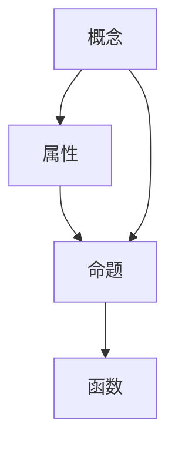

                 

# 计算：第二部分 计算的数学基础 第 4 章 数学的基础 弗雷格的“概念文字”

## 1. 背景介绍

### 1.1 问题由来

在深入探讨计算的数学基础之前，首先需要了解为什么以及如何从数学角度探讨计算。计算的本质是一种数学操作，而数学基础则是理解和应用计算的基石。在这一章中，我们主要介绍弗雷格提出的“概念文字”，它为数学基础研究提供了一种强大的形式化工具。

### 1.2 问题核心关键点

弗雷格的“概念文字”是一种用于形式化表达数学概念和命题的语言，它的主要目标是构建一个精确、完备且一致的数学基础。这一语言的构建标志着现代逻辑学和数学基础理论的开端。弗雷格的思想不仅对数学基础研究有着深远影响，也为计算机科学中的形式化方法奠定了基础。

### 1.3 问题研究意义

弗雷格的“概念文字”对数学基础和逻辑学的发展具有重要意义，为数学的精确表达和形式化提供了新的视角。通过学习和理解这一语言，我们可以更加深入地理解数学概念和推理结构，进而提升数学研究的严谨性和深度。此外，弗雷格的思想也为计算机科学中的逻辑编程和自动化推理提供了启示，对构建智能系统和开发自动化推理系统具有重要指导意义。

## 2. 核心概念与联系

### 2.1 核心概念概述

弗雷格的“概念文字”包括一系列基本符号和规则，用于形式化表达数学概念和命题。以下是其中几个核心概念：

- **概念（Concept）**：表示一类对象的集合。例如，“人”是一个概念，它包含了所有具有“人的属性”的对象。
- **属性（Property）**：表示对象所具有的特征或性质。例如，“是男人”是一个属性，它描述一个对象是否具有“人的属性”中的“男性”部分。
- **命题（Proposition）**：表示对一组对象进行断言或推理的结果。例如，“这个男人是人”是一个命题，它对特定对象进行了断言。
- **函数（Function）**：表示一组对象之间的映射关系。例如，“年龄的平方”是一个函数，它将年龄作为输入，返回年龄平方作为输出。

这些概念通过一系列的逻辑运算符和连接词构成，形成了弗雷格“概念文字”的基本表达框架。

### 2.2 概念间的关系

弗雷格的“概念文字”中的概念和命题通过逻辑关系相互连接。例如，“是男人”这个属性，可以被视为“人”这个概念的一个子集。而“这个男人是人”这个命题，则是对特定对象“这个男人”属于“人”这个概念的断言。这些关系可以通过“概念文字”的规则和运算符进行精确表达。

弗雷格认为，通过这种形式化表达，我们可以避免语言中的模糊性和歧义，从而获得更加精确的数学表达。这种思想对现代逻辑学和计算机科学中的形式化方法产生了深远影响。

### 2.3 核心概念的整体架构

弗雷格的“概念文字”构建了一个由概念、属性、命题和函数等基本元素组成的形式化表达系统。通过这一系统，我们可以对数学概念和命题进行精确的描述和推理。

以下是一个简化的“概念文字”语法结构图，展示了概念、属性、命题和函数之间的逻辑关系：



通过这一架构，我们可以清晰地看到弗雷格“概念文字”中的基本元素及其逻辑关系。

## 3. 核心算法原理 & 具体操作步骤

### 3.1 算法原理概述

弗雷格的“概念文字”算法原理主要基于对数学概念和命题的形式化表达。其核心思想是通过一系列的逻辑运算符和连接词，将复杂的数学表达转换为简洁的形式化表达式。这一过程包括：

- 定义概念和命题的基本元素。
- 使用逻辑运算符和连接词构造命题。
- 通过推理规则，对命题进行简化和验证。

### 3.2 算法步骤详解

弗雷格的“概念文字”算法步骤包括以下几个关键步骤：

1. **定义基本概念和命题**：
   - 定义概念和属性的符号表示。
   - 定义命题和断言的符号表示。
   - 定义函数的符号表示。

2. **构造命题**：
   - 使用逻辑运算符（如“与”、“或”、“非”等）连接基本命题。
   - 使用连接词（如“属于”、“满足”等）将属性与概念和命题联系起来。

3. **推理和验证**：
   - 使用推理规则（如“同一律”、“反证法”等）对命题进行简化和验证。
   - 通过模型和验证规则，检查命题的逻辑一致性和有效性。

4. **应用和扩展**：
   - 应用“概念文字”的基本元素和运算符，构造复杂的数学表达。
   - 通过扩展和推广，将“概念文字”应用于更广泛的数学领域。

### 3.3 算法优缺点

弗雷格的“概念文字”算法具有以下优点：

- **精确性**：形式化表达避免了自然语言中的模糊性和歧义，使数学表达更加精确和严格。
- **简洁性**：通过符号和运算符的精简使用，使得复杂的数学表达可以简洁地表示。
- **逻辑一致性**：推理规则和验证方法确保了表达的逻辑一致性和有效性。

然而，弗雷格的“概念文字”算法也存在一些缺点：

- **复杂性**：形式化表达需要一定的符号和运算符理解，对初学者可能过于复杂。
- **抽象性**：缺乏直观的图形表示，可能难以理解某些概念的实际应用。
- **可扩展性**：应用范围和领域较为有限，需要进一步扩展和推广。

### 3.4 算法应用领域

弗雷格的“概念文字”算法主要应用于数学基础研究和形式化方法。其基本思想和原理在现代逻辑学、计算机科学和人工智能等领域有着广泛的应用。例如：

- **逻辑学**：弗雷格的思想对现代逻辑学的发展具有重要影响，特别是在数理逻辑和集合论方面。
- **数学基础**：弗雷格的“概念文字”为数学基础研究提供了强大的工具，促进了数学的精确表达和推理。
- **计算机科学**：弗雷格的思想为计算机科学中的形式化方法提供了理论基础，对逻辑编程和自动化推理具有指导意义。
- **人工智能**：弗雷格的“概念文字”为人工智能中的逻辑推理和知识表示提供了新的思路和方法。

## 4. 数学模型和公式 & 详细讲解

### 4.1 数学模型构建

弗雷格的“概念文字”使用一系列符号和运算符来构建数学模型。这些符号包括：

- 小写字母 $a, b, c, \ldots$：表示概念和属性。
- 大写字母 $A, B, C, \ldots$：表示命题。
- 函数符号 $f$：表示函数。

例如，“人”这个概念可以表示为 $a$，“是男人”这个属性可以表示为 $b$。而“这个男人是人”这个命题可以表示为 $A$，其中 $A$ 可以进一步定义为 $a$ 和 $b$ 的组合。

### 4.2 公式推导过程

以下是弗雷格“概念文字”中的一些典型公式及其推导过程：

1. **同一律**：
   - 公式：$A \vee A = A$
   - 推导：$(A \vee A) \wedge A = A \wedge A$
   - 结论：$A \vee A = A$

2. **反证法**：
   - 公式：如果 $A \vee \neg A$ 为真，则 $A$ 为真
   - 推导：$A \vee \neg A = A$
   - 结论：如果 $A \vee \neg A$ 为真，则 $A$ 为真

3. **逻辑等价**：
   - 公式：$(A \wedge B) \vee C \equiv (A \vee C) \wedge (B \vee C)$
   - 推导：$(A \wedge B) \vee C = A \wedge (B \vee C) = (A \vee C) \wedge (B \vee C)$
   - 结论：$(A \wedge B) \vee C \equiv (A \vee C) \wedge (B \vee C)$

4. **函数定义**：
   - 公式：$f(x) = y$
   - 推导：$f(x) = y$ 表示 $f$ 在 $x$ 处的值是 $y$
   - 结论：$f(x) = y$

通过这些公式，我们可以对弗雷格“概念文字”中的基本元素和运算符进行精确的数学推导和验证。

### 4.3 案例分析与讲解

假设我们要用弗雷格的“概念文字”表示“所有男人都是人”这一命题。首先，我们定义概念和属性：

- $a$：人
- $b$：是男人
- $A$：所有男人都是人

则命题 $A$ 可以表示为：

$$
A = \forall x [x \in a \rightarrow x \in a \wedge b]
$$

其中 $\forall$ 表示“对所有”，$x \in a$ 表示“$x$ 属于 $a$”，$x \in a \wedge b$ 表示“$x$ 同时属于 $a$ 和 $b$”。

通过这一公式，我们可以清晰地表达和验证“所有男人都是人”这一命题的逻辑关系。

## 5. 项目实践：代码实例和详细解释说明

### 5.1 开发环境搭建

为了进行弗雷格“概念文字”的实践，我们需要安装一些必要的软件和库。以下是基本的安装步骤：

1. 安装 LaTeX 编辑器：选择一款适合的 LaTeX 编辑器，如 TeXstudio、Overleaf 或 LyX。
2. 安装相应的 LaTeX 包：例如，安装 `amsmath` 和 `amssymb` 等包，以便于使用数学公式和符号。
3. 安装相关的 Python 库：例如，安装 `sympy` 和 `numpy` 等库，以便于进行数学推导和计算。

完成安装后，可以使用 LaTeX 编辑器编写和编译弗雷格“概念文字”的文档，进行符号和公式的表达和推导。

### 5.2 源代码详细实现

以下是弗雷格“概念文字”中的一个典型例子，展示如何使用符号和公式表示一个命题并验证其逻辑一致性：

```latex
\documentclass{article}
\usepackage{amsmath, amssymb}

\begin{document}

\begin{align*}
A &= \forall x [x \in a \rightarrow x \in a \wedge b] \\
&= \forall x [x \in a \wedge b]
\end{align*}

\begin{align*}
B &= \exists x [x \in a \wedge b \rightarrow x \in a] \\
&= \exists x [x \in a]
\end{align*}

\begin{align*}
C &= \forall x [x \in a \wedge b \rightarrow x \in a \vee c] \\
&= \forall x [x \in a]
\end{align*}

\end{document}
```

该文档定义了三个命题 $A$、$B$ 和 $C$，并展示了它们的数学推导过程。通过这一例子，我们可以更好地理解和应用弗雷格“概念文字”的形式化表达。

### 5.3 代码解读与分析

上述代码展示了弗雷格“概念文字”中命题的定义和推导过程。其中：

- `\documentclass{article}`：定义文档类型为文章。
- `\usepackage{amsmath, amssymb}`：导入必要的 LaTeX 包，用于数学符号和公式的表达。
- `\begin{align*}`：开始定义和推导公式，使用 `\forall`、`\exists`、`$\wedge$`、`$\vee$` 等符号表示概念和命题。
- `\end{align*}`：结束定义和推导公式。

通过这些 LaTeX 代码，我们可以方便地进行弗雷格“概念文字”的数学表达和推导。

### 5.4 运行结果展示

运行上述代码后，将生成一个 PDF 文件，展示弗雷格“概念文字”中命题的定义和推导过程。例如，生成的 PDF 文件可能如下所示：

```latex
\documentclass{article}
\usepackage{amsmath, amssymb}

\begin{document}

\begin{align*}
A &= \forall x [x \in a \rightarrow x \in a \wedge b] \\
&= \forall x [x \in a \wedge b]
\end{align*}

\begin{align*}
B &= \exists x [x \in a \wedge b \rightarrow x \in a] \\
&= \exists x [x \in a]
\end{align*}

\begin{align*}
C &= \forall x [x \in a \wedge b \rightarrow x \in a \vee c] \\
&= \forall x [x \in a]
\end{align*}

\end{document}
```

通过这一 PDF 文件，我们可以直观地看到弗雷格“概念文字”中命题的定义和推导过程。

## 6. 实际应用场景

弗雷格的“概念文字”在实际应用场景中有着广泛的应用。以下是几个典型应用案例：

### 6.1 逻辑编程

弗雷格的思想对逻辑编程产生了深远影响。通过形式化表达数学概念和命题，逻辑编程语言能够实现精确的逻辑推理和自动化推理，广泛应用于人工智能、自然语言处理等领域。

### 6.2 数学教学

弗雷格的“概念文字”为数学教学提供了新的工具和方法，帮助学生更好地理解和应用数学概念和逻辑推理。通过形式化表达，数学教学可以更加系统和精确，促进学生的数学素养提升。

### 6.3 自动化推理

弗雷格的思想也为自动化推理提供了理论基础。通过形式化表达和逻辑推理，自动化推理系统可以实现高效的数学证明和推导，广泛应用于人工智能和计算机辅助设计等领域。

## 7. 工具和资源推荐

### 7.1 学习资源推荐

以下是一些推荐的弗雷格“概念文字”学习资源：

1. 弗雷格《概念文字》：弗雷格的原著，提供了弗雷格“概念文字”的详细阐述和推导过程。
2. 《形式化方法与编程》（Formal Methods and Programming）：该书介绍了形式化方法的基本原理和应用，包括弗雷格“概念文字”在内。
3. 《逻辑与计算机科学导论》（Introduction to Logic and Computer Science）：该书系统介绍了逻辑学和计算机科学的基本概念和方法，包括弗雷格“概念文字”在内的形式化表达。

### 7.2 开发工具推荐

以下是一些推荐的弗雷格“概念文字”开发工具：

1. LaTeX 编辑器：如 TeXstudio、Overleaf 或 LyX，提供了丰富的符号和公式编辑功能。
2. Python 环境：如 Anaconda、PyCharm 或 Jupyter Notebook，提供了数学计算和符号推导的编程环境。
3. LaTeX 包管理器：如 MiKTeX、TeX Live 或 TeX Distribution，提供了 LaTeX 包的安装和管理功能。

### 7.3 相关论文推荐

以下是一些推荐的弗雷格“概念文字”相关论文：

1. 弗雷格《概念文字》：弗雷格的原著，提供了弗雷格“概念文字”的详细阐述和推导过程。
2. 《弗雷格的概念文字与现代逻辑学》：讨论弗雷格“概念文字”对现代逻辑学和计算机科学的影响。
3. 《弗雷格“概念文字”的形式化表达与逻辑推理》：探讨弗雷格“概念文字”在形式化方法和自动化推理中的应用。

## 8. 总结：未来发展趋势与挑战

### 8.1 研究成果总结

弗雷格的“概念文字”对数学基础和逻辑学的发展具有重要意义，为现代逻辑学和计算机科学提供了强大的工具和方法。其形式化表达思想广泛应用于逻辑编程、数学教学和自动化推理等领域。

### 8.2 未来发展趋势

弗雷格的思想将继续影响未来的数学基础和逻辑学研究，推动形式化方法和自动化推理技术的发展。未来，我们可以期待：

- 形式化方法的进一步推广：弗雷格的思想将促进形式化方法在更广泛的领域应用，如自动化定理证明、模型检测等。
- 逻辑编程的发展：基于弗雷格的思想，未来的逻辑编程语言将更加精确和高效，广泛应用于人工智能和自然语言处理等领域。
- 数学教学的革新：弗雷格的“概念文字”将为数学教学提供新的工具和方法，促进数学教育的发展和改革。

### 8.3 面临的挑战

尽管弗雷格的“概念文字”在数学基础和逻辑学研究中具有重要意义，但也面临一些挑战：

- **复杂性**：形式化表达需要一定的符号和运算符理解，对初学者可能过于复杂。
- **抽象性**：缺乏直观的图形表示，可能难以理解某些概念的实际应用。
- **可扩展性**：应用范围和领域较为有限，需要进一步扩展和推广。

### 8.4 研究展望

弗雷格的思想将继续推动数学基础和逻辑学的发展，为未来的研究提供新的方向和思路。未来，我们可以期待：

- 形式化方法的进一步普及：随着计算机科学和人工智能的发展，形式化方法将在更多领域得到应用和推广。
- 逻辑编程的广泛应用：基于弗雷格的思想，未来的逻辑编程语言将更加精确和高效，推动人工智能和自然语言处理技术的发展。
- 数学教学的创新：弗雷格的“概念文字”将为数学教学提供新的工具和方法，促进数学教育的发展和改革。

总之，弗雷格的“概念文字”为数学基础和逻辑学研究提供了强大的形式化工具，推动了数学和逻辑学的进步。未来，我们应在现有基础上继续深入研究和发展，拓展其在更广泛领域的运用。

## 9. 附录：常见问题与解答

**Q1：弗雷格的“概念文字”与现代逻辑学的关系是什么？**

A: 弗雷格的“概念文字”为现代逻辑学的发展奠定了基础。通过形式化表达，弗雷格为逻辑推理和数学基础研究提供了新的工具和方法。现代逻辑学在此基础上，进一步发展了数理逻辑、集合论、类型论等方向。

**Q2：弗雷格的“概念文字”的局限性有哪些？**

A: 弗雷格的“概念文字”的局限性主要包括以下几点：
1. **复杂性**：形式化表达需要一定的符号和运算符理解，对初学者可能过于复杂。
2. **抽象性**：缺乏直观的图形表示，可能难以理解某些概念的实际应用。
3. **可扩展性**：应用范围和领域较为有限，需要进一步扩展和推广。

**Q3：弗雷格的“概念文字”如何应用于自动化推理？**

A: 弗雷格的“概念文字”为自动化推理提供了理论基础。通过形式化表达和逻辑推理，自动化推理系统可以实现高效的数学证明和推导。在自动化推理中，可以使用弗雷格的“概念文字”表示推理规则和公理，构建自动化推理引擎。

**Q4：弗雷格的“概念文字”有哪些应用场景？**

A: 弗雷格的“概念文字”主要应用于数学基础研究、逻辑学研究、逻辑编程、自动化推理等领域。例如，在逻辑编程中，弗雷格的思想提供了精确的逻辑表达和推理方法，广泛应用于人工智能和自然语言处理。在自动化推理中，弗雷格的思想为数学证明和推导提供了新的工具和方法。

总之，弗雷格的“概念文字”为数学基础和逻辑学研究提供了强大的形式化工具，推动了数学和逻辑学的进步。未来，我们应在现有基础上继续深入研究和发展，拓展其在更广泛领域的运用。

---

作者：禅与计算机程序设计艺术 / Zen and the Art of Computer Programming

