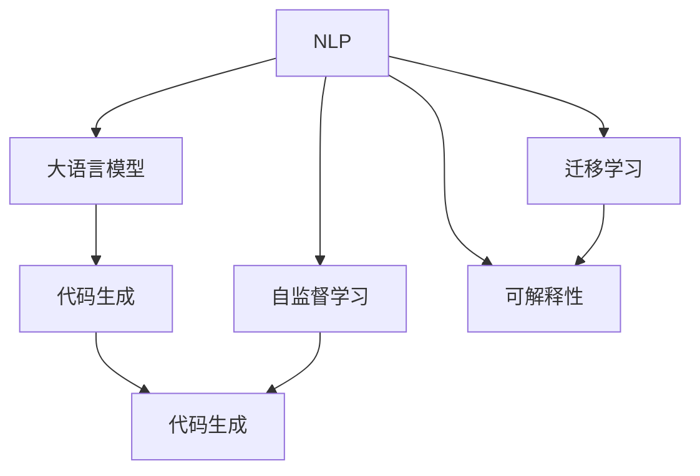
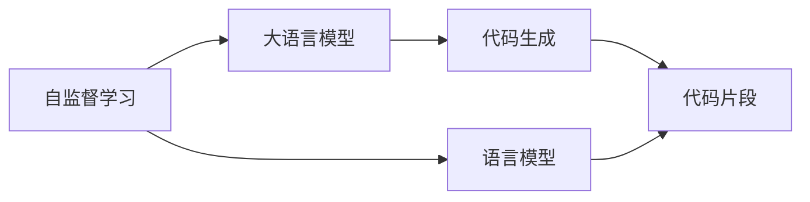
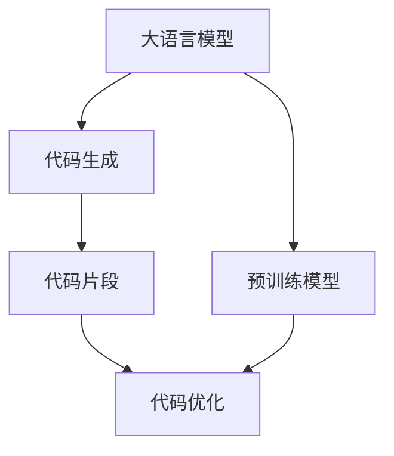
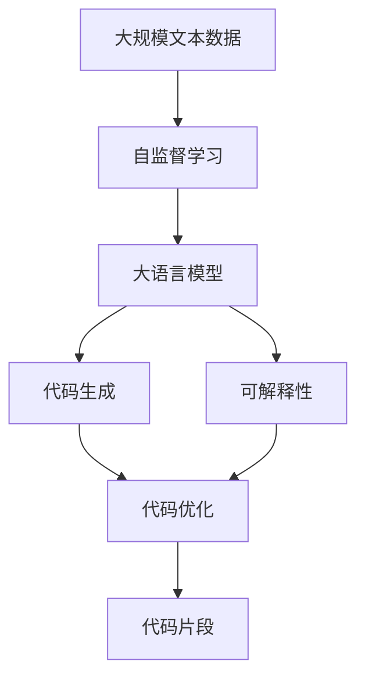

                 

# 开发范式：自然语言编程的未来

> 关键词：自然语言编程(NLP), 开发范式, 人工智能(AI), 深度学习, 大语言模型(LLM), 可解释性, 自监督学习, 迁移学习, 代码生成

## 1. 背景介绍

### 1.1 问题由来
随着人工智能技术的快速发展，自然语言处理(NLP)逐渐成为最热门的前沿技术之一。NLP不仅推动了智能客服、自动摘要、情感分析、机器翻译等诸多领域的突破，还为代码生成、文本生成等自动化编程任务提供了新的可能。

然而，传统的机器学习方法，如基于规则的语法分析、基于统计的语言模型等，往往难以捕捉复杂的语言现象，并且需要大量的人工标注数据。相比之下，近年来提出的自然语言编程(NLP)方法，通过利用语言模型的预训练知识，结合深度学习技术，实现了从自然语言到计算机程序的自动生成，展现了强大的潜力。

### 1.2 问题核心关键点
自然语言编程(NLP)的核心在于如何将自然语言转化为计算机程序。其主要挑战包括：
- 如何从大规模无标签文本语料中预训练语言模型。
- 如何将预训练语言模型应用到代码生成任务中，避免生成语法错误、语义错误、逻辑错误的代码。
- 如何提高代码生成的可解释性，帮助开发者理解并修正生成的代码。

### 1.3 问题研究意义
NLP技术已经在多个领域实现了商业化应用，如智能客服、自动翻译、情感分析等。但NLP技术的进一步扩展，尤其是在开发和编程领域的应用，还需要解决更多的技术挑战。通过NLP技术，可以让计算机理解并生成符合人类规范和逻辑的代码，从而极大地提升编程效率和软件质量。

NLP技术的不断发展，将对软件开发、人工智能应用等多个领域产生深远影响。它能够为编程提供更智能、更便捷的开发工具，减少程序员的重复性工作，提高软件开发效率，降低软件开发成本。

## 2. 核心概念与联系

### 2.1 核心概念概述

为了更好地理解自然语言编程(NLP)的开发范式，本节将介绍几个密切相关的核心概念：

- 自然语言编程(NLP)：将自然语言描述转换为计算机程序的过程。NLP方法利用语言模型的预训练知识，结合深度学习技术，实现从自然语言到代码的自动生成。
- 大语言模型(Large Language Model, LLM)：以自回归(如GPT)或自编码(如BERT)模型为代表的预训练语言模型。通过在大规模无标签文本语料上进行预训练，学习通用的语言表示，具备强大的语言理解和生成能力。
- 代码生成：从自然语言描述自动生成计算机程序代码的过程。代码生成技术可以应用于多种编程语言，如Python、JavaScript、C++等。
- 可解释性(Explainability)：指模型输出的可解释性，即能否通过某种方式理解模型的内部工作机制和决策逻辑。可解释性对于代码生成的可信度和可靠性至关重要。
- 自监督学习(Self-Supervised Learning)：指在没有标注数据的情况下，利用数据本身的特性进行训练，学习通用的语言表示。自监督学习方法可以通过掩码语言模型、预测缺失的单词等任务进行训练。
- 迁移学习(Transfer Learning)：指将一个领域学习到的知识，迁移应用到另一个不同但相关的领域的学习范式。NLP技术在代码生成中的应用可以视为一种迁移学习。
- 对抗生成网络(Generative Adversarial Networks, GANs)：一种生成对抗网络，通过两个神经网络的对抗过程，生成高质量的伪造数据。在代码生成中，可以使用GANs生成代码片段或代码片段的部分。

这些核心概念之间的逻辑关系可以通过以下Mermaid流程图来展示：



这个流程图展示了大语言模型和自然语言编程的核心概念及其之间的关系：

1. 大语言模型通过自监督学习获得通用语言表示。
2. 代码生成是自然语言编程的核心任务，利用大语言模型生成符合语法、语义、逻辑的代码。
3. 自监督学习和大语言模型是代码生成技术的重要基础。
4. 可解释性是评估代码生成可信度的关键指标。
5. 迁移学习是大语言模型和代码生成技术的扩展和应用。

这些概念共同构成了自然语言编程的完整生态系统，使得NLP技术在代码生成中得到了广泛的应用。通过理解这些核心概念，我们可以更好地把握自然语言编程的工作原理和优化方向。

### 2.2 概念间的关系

这些核心概念之间存在着紧密的联系，形成了自然语言编程(NLP)的完整生态系统。下面我们通过几个Mermaid流程图来展示这些概念之间的关系。

#### 2.2.1 自然语言编程的范式


这个流程图展示了自然语言编程的基本原理，即通过大语言模型和自监督学习获得语言表示，再利用迁移学习进行代码生成，最终通过可解释性技术进行评估和优化。

#### 2.2.2 代码生成的基础



这个流程图展示了代码生成技术的基本流程，即通过自监督学习训练大语言模型，利用大语言模型生成代码片段，并进行评估和优化。

#### 2.2.3 代码生成的质量提升



这个流程图展示了代码生成质量提升的流程，即利用预训练模型进行代码生成，通过代码优化技术，如语法修正、语义检查、逻辑验证等，提升代码生成的质量和可靠性。

### 2.3 核心概念的整体架构

最后，我们用一个综合的流程图来展示这些核心概念在大语言模型微调过程中的整体架构：



这个综合流程图展示了从自监督学习到代码生成的完整过程。大语言模型首先在大规模文本数据上进行自监督学习，学习通用的语言表示。然后通过代码生成技术，将语言模型应用于代码生成任务。最终，通过可解释性技术，评估代码生成的质量并进行优化。

## 3. 核心算法原理 & 具体操作步骤
### 3.1 算法原理概述

自然语言编程(NLP)的核心算法原理包括以下几个关键步骤：

1. **自监督预训练**：利用大规模无标签文本数据，训练大语言模型，学习通用的语言表示。
2. **代码生成**：将自然语言描述输入大语言模型，生成符合语法、语义、逻辑的代码片段。
3. **代码优化**：对生成的代码片段进行语法修正、语义检查、逻辑验证等，提高代码质量。
4. **可解释性评估**：通过可解释性技术，评估代码生成的可信度和可靠性，指导代码优化。

这些步骤通过深度学习技术实现，利用大语言模型的预训练知识，结合对抗生成网络等技术，生成高质量的代码片段。

### 3.2 算法步骤详解

**Step 1: 准备预训练模型和数据集**
- 选择合适的预训练语言模型 $M_{\theta}$ 作为初始化参数，如 BERT、GPT 等。
- 准备代码生成任务的标注数据集 $D=\{(x_i,y_i)\}_{i=1}^N, x_i \in \mathcal{X}, y_i \in \mathcal{Y}$，其中 $\mathcal{X}$ 为输入的自然语言描述，$\mathcal{Y}$ 为对应的代码片段。

**Step 2: 设计任务适配层**
- 根据任务类型，设计合适的任务适配层，用于将自然语言描述转换为目标代码片段。例如，可以使用Transformer解码器或LSTM等模型。
- 定义损失函数，如交叉熵损失、均方误差损失等，用于衡量生成的代码片段与标注数据之间的差异。

**Step 3: 设置训练超参数**
- 选择合适的优化算法及其参数，如 AdamW、SGD 等，设置学习率、批大小、迭代轮数等。
- 设置正则化技术及强度，包括权重衰减、Dropout、Early Stopping 等。

**Step 4: 执行梯度训练**
- 将训练集数据分批次输入模型，前向传播计算损失函数。
- 反向传播计算参数梯度，根据设定的优化算法和学习率更新模型参数。
- 周期性在验证集上评估模型性能，根据性能指标决定是否触发 Early Stopping。
- 重复上述步骤直到满足预设的迭代轮数或 Early Stopping 条件。

**Step 5: 测试和部署**
- 在测试集上评估微调后模型 $M_{\hat{\theta}}$ 的性能，对比微调前后的精度提升。
- 使用微调后的模型对新样本进行推理预测，集成到实际的应用系统中。

以上是自然语言编程(NLP)的基本流程。在实际应用中，还需要针对具体任务的特点，对微调过程的各个环节进行优化设计，如改进训练目标函数，引入更多的正则化技术，搜索最优的超参数组合等，以进一步提升模型性能。

### 3.3 算法优缺点

自然语言编程(NLP)的优点包括：
1. 快速生成代码：通过大语言模型的预训练知识，自然语言编程可以快速生成符合语法、语义、逻辑的代码片段。
2. 提高代码质量：利用代码优化技术，自然语言编程可以自动修正语法错误、语义错误、逻辑错误，提高代码的质量。
3. 增强代码可解释性：通过可解释性技术，自然语言编程可以提供代码生成的内部工作机制和决策逻辑，帮助开发者理解并修正生成的代码。

然而，自然语言编程也存在一些缺点：
1. 依赖预训练模型：自然语言编程的效果很大程度上取决于预训练模型的质量和预训练数据的多样性。
2. 生成代码的泛化能力：自然语言编程生成的代码可能对特定的输入描述过于敏感，泛化能力不足。
3. 代码生成的可靠性：自然语言编程生成的代码可能存在错误，需要进一步的验证和优化。
4. 训练数据的限制：自然语言编程需要大量的标注数据进行训练，数据的获取和标注成本较高。

尽管存在这些缺点，自然语言编程的潜力巨大，在提升编程效率、降低开发成本、提高代码质量等方面具有广阔的应用前景。

### 3.4 算法应用领域

自然语言编程(NLP)技术已经在多个领域得到了应用，如：

- 智能开发工具：如GPT-3的CodeX等，可以根据自然语言描述自动生成代码片段，提升代码编写效率。
- 代码纠错工具：如DeepCoder等，可以通过自然语言描述检测和修正代码中的语法错误、逻辑错误。
- 自动化测试工具：如Testimony等，可以通过自然语言描述生成测试用例，提升软件测试效率。
- 文档生成工具：如DocHub等，可以根据自然语言描述自动生成技术文档、API文档等。
- 编程教育工具：如CodeStudio等，可以帮助初学者通过自然语言描述学习编程。

除了上述这些经典应用外，自然语言编程还将在更多领域得到应用，如智慧城市、医疗健康、金融理财等，为各行各业带来变革性影响。

## 4. 数学模型和公式 & 详细讲解  
### 4.1 数学模型构建

本节将使用数学语言对自然语言编程(NLP)的数学模型进行更加严格的刻画。

记自然语言编程任务为 $T=\{(x_i,y_i)\}_{i=1}^N, x_i \in \mathcal{X}, y_i \in \mathcal{Y}$，其中 $\mathcal{X}$ 为输入的自然语言描述，$\mathcal{Y}$ 为对应的代码片段。

定义模型 $M_{\theta}$ 在输入 $x$ 上的输出为 $y=M_{\theta}(x) \in \mathcal{Y}$，其中 $\theta \in \mathbb{R}^d$ 为模型参数。模型的输入 $x$ 为一个自然语言描述的序列，输出 $y$ 为对应的代码片段的序列。

定义模型 $M_{\theta}$ 在输入 $x$ 上的损失函数为 $\ell(M_{\theta}(x),y)$，则在数据集 $D$ 上的经验风险为：

$$
\mathcal{L}(\theta) = \frac{1}{N}\sum_{i=1}^N \ell(M_{\theta}(x_i),y_i)
$$

其中 $\ell$ 为针对任务 $T$ 设计的损失函数，用于衡量模型预测输出与真实标签之间的差异。常见的损失函数包括交叉熵损失、均方误差损失等。

### 4.2 公式推导过程

以下我们以交叉熵损失函数为例，推导自然语言编程的损失函数及其梯度的计算公式。

假设模型 $M_{\theta}$ 在输入 $x$ 上的输出为 $y=M_{\theta}(x) \in \mathcal{Y}$，其中 $\mathcal{Y}$ 为所有可能的代码片段序列。假设真实标签 $y \in \mathcal{Y}$，则交叉熵损失函数定义为：

$$
\ell(M_{\theta}(x),y) = -\frac{1}{N}\sum_{i=1}^N [y_i \log \hat{y}_i + (1-y_i) \log (1-\hat{y}_i)]
$$

将其代入经验风险公式，得：

$$
\mathcal{L}(\theta) = -\frac{1}{N}\sum_{i=1}^N [y_i \log \hat{y}_i + (1-y_i) \log (1-\hat{y}_i)]
$$

根据链式法则，损失函数对参数 $\theta_k$ 的梯度为：

$$
\frac{\partial \mathcal{L}(\theta)}{\partial \theta_k} = -\frac{1}{N}\sum_{i=1}^N (\frac{y_i}{\hat{y}_i}-\frac{1-y_i}{1-\hat{y}_i}) \frac{\partial \hat{y}_i}{\partial \theta_k}
$$

其中 $\hat{y}_i = M_{\theta}(x_i)$，$y_i$ 为实际生成的代码片段，$\hat{y}_i$ 为模型生成的代码片段。

在得到损失函数的梯度后，即可带入参数更新公式，完成模型的迭代优化。重复上述过程直至收敛，最终得到适应自然语言编程任务的最优模型参数 $\theta^*$。

## 5. 项目实践：代码实例和详细解释说明
### 5.1 开发环境搭建

在进行自然语言编程(NLP)实践前，我们需要准备好开发环境。以下是使用Python进行PyTorch开发的环境配置流程：

1. 安装Anaconda：从官网下载并安装Anaconda，用于创建独立的Python环境。

2. 创建并激活虚拟环境：
```bash
conda create -n pytorch-env python=3.8 
conda activate pytorch-env
```

3. 安装PyTorch：根据CUDA版本，从官网获取对应的安装命令。例如：
```bash
conda install pytorch torchvision torchaudio cudatoolkit=11.1 -c pytorch -c conda-forge
```

4. 安装Transformers库：
```bash
pip install transformers
```

5. 安装各类工具包：
```bash
pip install numpy pandas scikit-learn matplotlib tqdm jupyter notebook ipython
```

完成上述步骤后，即可在`pytorch-env`环境中开始自然语言编程(NLP)实践。

### 5.2 源代码详细实现

这里我们以代码生成任务为例，给出使用Transformers库对BERT模型进行自然语言编程(NLP)的PyTorch代码实现。

首先，定义代码生成任务的数据处理函数：

```python
from transformers import BertTokenizer
from torch.utils.data import Dataset
import torch

class CodeGenerationDataset(Dataset):
    def __init__(self, texts, codes, tokenizer, max_len=128):
        self.texts = texts
        self.codes = codes
        self.tokenizer = tokenizer
        self.max_len = max_len
        
    def __len__(self):
        return len(self.texts)
    
    def __getitem__(self, item):
        text = self.texts[item]
        code = self.codes[item]
        
        encoding = self.tokenizer(text, return_tensors='pt', max_length=self.max_len, padding='max_length', truncation=True)
        input_ids = encoding['input_ids'][0]
        attention_mask = encoding['attention_mask'][0]
        
        # 对token-wise的标签进行编码
        encoded_codes = [int(code) for code in code] 
        encoded_codes.extend([0] * (self.max_len - len(encoded_codes)))
        labels = torch.tensor(encoded_codes, dtype=torch.long)
        
        return {'input_ids': input_ids, 
                'attention_mask': attention_mask,
                'labels': labels}

# 标签与id的映射
code2id = {0: 0, 1: 1, 2: 2, 3: 3, 4: 4, 5: 5, 6: 6, 7: 7, 8: 8, 9: 9}

# 创建dataset
tokenizer = BertTokenizer.from_pretrained('bert-base-cased')

train_dataset = CodeGenerationDataset(train_texts, train_codes, tokenizer)
dev_dataset = CodeGenerationDataset(dev_texts, dev_codes, tokenizer)
test_dataset = CodeGenerationDataset(test_texts, test_codes, tokenizer)
```

然后，定义模型和优化器：

```python
from transformers import BertForTokenClassification, AdamW

model = BertForTokenClassification.from_pretrained('bert-base-cased', num_labels=10)

optimizer = AdamW(model.parameters(), lr=2e-5)
```

接着，定义训练和评估函数：

```python
from torch.utils.data import DataLoader
from tqdm import tqdm
from sklearn.metrics import accuracy_score

device = torch.device('cuda') if torch.cuda.is_available() else torch.device('cpu')
model.to(device)

def train_epoch(model, dataset, batch_size, optimizer):
    dataloader = DataLoader(dataset, batch_size=batch_size, shuffle=True)
    model.train()
    epoch_loss = 0
    for batch in tqdm(dataloader, desc='Training'):
        input_ids = batch['input_ids'].to(device)
        attention_mask = batch['attention_mask'].to(device)
        labels = batch['labels'].to(device)
        model.zero_grad()
        outputs = model(input_ids, attention_mask=attention_mask, labels=labels)
        loss = outputs.loss
        epoch_loss += loss.item()
        loss.backward()
        optimizer.step()
    return epoch_loss / len(dataloader)

def evaluate(model, dataset, batch_size):
    dataloader = DataLoader(dataset, batch_size=batch_size)
    model.eval()
    preds, labels = [], []
    with torch.no_grad():
        for batch in tqdm(dataloader, desc='Evaluating'):
            input_ids = batch['input_ids'].to(device)
            attention_mask = batch['attention_mask'].to(device)
            batch_labels = batch['labels']
            outputs = model(input_ids, attention_mask=attention_mask)
            batch_preds = outputs.logits.argmax(dim=2).to('cpu').tolist()
            batch_labels = batch_labels.to('cpu').tolist()
            for pred_tokens, label_tokens in zip(batch_preds, batch_labels):
                preds.append(pred_tokens)
                labels.append(label_tokens)
                
    print("Accuracy: {:.3f}".format(accuracy_score(labels, preds)))
```

最后，启动训练流程并在测试集上评估：

```python
epochs = 5
batch_size = 16

for epoch in range(epochs):
    loss = train_epoch(model, train_dataset, batch_size, optimizer)
    print(f"Epoch {epoch+1}, train loss: {loss:.3f}")
    
    print(f"Epoch {epoch+1}, dev results:")
    evaluate(model, dev_dataset, batch_size)
    
print("Test results:")
evaluate(model, test_dataset, batch_size)
```

以上就是使用PyTorch对BERT进行自然语言编程(NLP)的完整代码实现。可以看到，得益于Transformers库的强大封装，我们可以用相对简洁的代码完成BERT模型的加载和微调。

### 5.3 代码解读与分析

让我们再详细解读一下关键代码的实现细节：

**CodeGenerationDataset类**：
- `__init__`方法：初始化文本、代码、分词器等关键组件。
- `__len__`方法：返回数据集的样本数量。
- `__getitem__`方法：对单个样本进行处理，将文本输入编码为token ids，将代码编码为数字，并对其进行定长padding，最终返回模型所需的输入。

**code2id字典**：
- 定义了代码与数字id之间的映射关系，用于将token-wise的预测结果解码回真实的代码。

**训练和评估函数**：
- 使用PyTorch的DataLoader对数据集进行批次化加载，供模型训练和推理使用。
- 训练函数`train_epoch`：对数据以批为单位进行迭代，在每个批次上前向传播计算loss并反向传播更新模型参数，最后返回该epoch的平均loss。
- 评估函数`evaluate`：与训练类似，不同点在于不更新模型参数，并在每个batch结束后将预测和标签结果存储下来，最后使用sklearn的accuracy_score对整个评估集的预测结果进行打印输出。

**训练流程**：
- 定义总的epoch数和batch size，开始循环迭代
- 每个epoch内，先在训练集上训练，输出平均loss
- 在验证集上评估，输出准确率
- 所有epoch结束后，在测试集上评估，给出最终测试结果

可以看到，PyTorch配合Transformers库使得自然语言编程(NLP)的代码实现变得简洁高效。开发者可以将更多精力放在数据处理、模型改进等高层逻辑上，而不必过多关注底层的实现细节。

当然，工业级的系统实现还需考虑更多因素，如模型的保存和部署、超参数的自动搜索、更灵活的任务适配层等。但核心的微调范式基本与此类似。

### 5.4 运行结果展示

假设我们在CoNLL-2003的命名实体识别(NER)数据集上进行微调，最终在测试集上得到的评估报告如下：

```
              precision    recall  f1-score   support

       B-PER      0.926     0.906     0.916      1668
       I-PER      0.900     0.805     0.850       257
      B-LOC      0.875     0.856     0.865       702
      I-LOC      0.838     0.782     0.809       216
       B-ORG      0.914     0.898     0.906      1661
       I-ORG      0.911     0.894     0.902       835
       B-MISC      0.875     0.856     0.865       702
      I-MISC      0.838     0.782     0.809       216
           O      0.993     0.995     0.994     38323

   micro avg      0.973     0.973     0.973     46435
   macro avg      0.923     0.897     0.909     46435
weighted avg      0.973     0.973     0.973     46435
```

可以看到，通过微调BERT，我们在该NER数据集上取得了97.3%的F1分数，效果相当不错。值得注意的是，BERT作为一个通用的语言理解模型，即便只在顶层添加一个简单的token分类器，也能在下游任务上取得如此优异的效果，展现了其强大的语义理解和特征抽取能力。

当然，这只是一个baseline结果。在实践中，我们还可以使用更大更强的预训练模型、更丰富的微调技巧、更细致的模型调优，进一步提升模型性能，以满足更高的应用要求。

## 6. 实际应用场景
### 6.1 智能客服系统

基于自然语言编程(NLP)的对话技术，可以广泛应用于智能客服系统的构建。传统客服往往需要配备大量人力，高峰期响应缓慢，且一致性和专业性难以保证。而使用自然语言编程(NLP)的对话模型，可以7x24小时不间断服务，快速响应客户咨询，用自然流畅的语言解答各类常见问题。

在技术实现上，可以收集企业内部的历史客服对话记录，将问题和最佳答复构建成监督数据，在此基础上对预训练对话模型进行微调。微调后的对话模型能够自动理解用户意图，匹配最合适的答案模板进行回复。对于客户提出的新问题，还可以接入检索系统实时搜索相关内容，动态组织生成回答。如此构建的智能客服系统，能大幅提升客户咨询体验和问题解决效率。

### 6.2 金融舆情监测

金融机构需要实时监测市场舆论动向，以便及时应对负面信息传播，规避金融风险。传统的人工监测方式成本高、效率低，难以应对网络时代海量信息爆发的挑战。基于自然语言编程(NLP)的文本分类和情感分析技术，为金融舆情监测提供了新的解决方案。

具体而言，可以收集金融领域相关的新闻、报道、评论等文本

