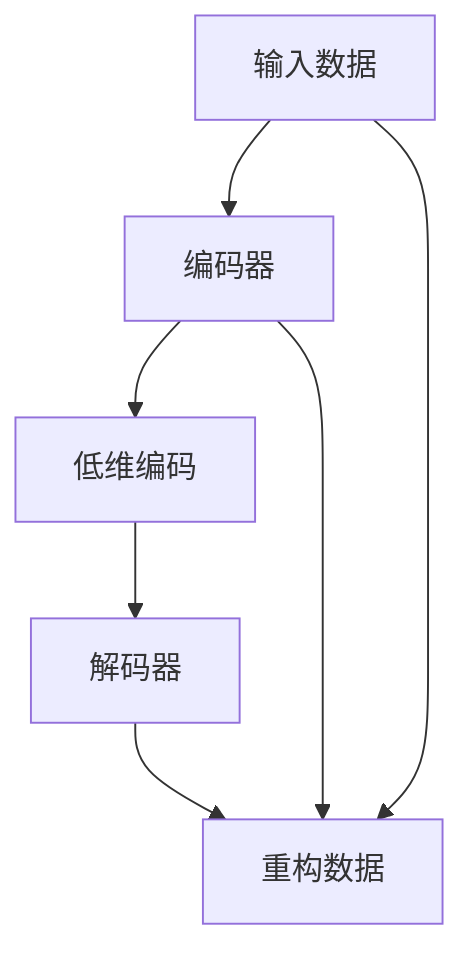
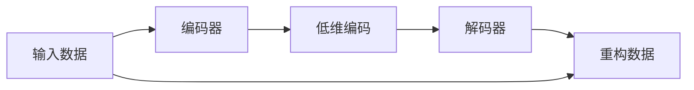
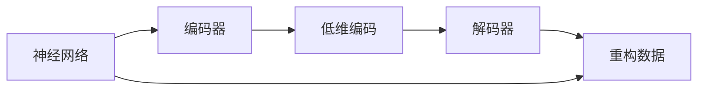
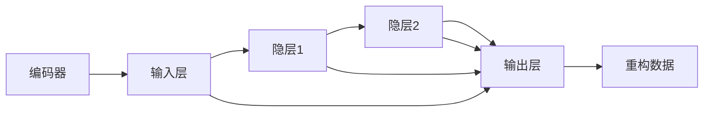
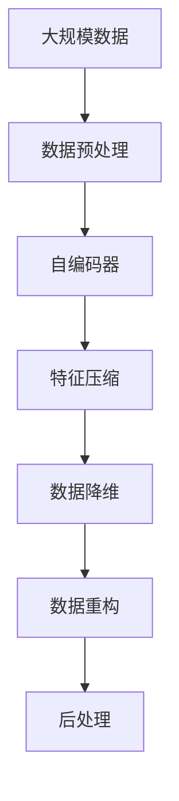

                 

# 自编码器(Autoencoders) - 原理与代码实例讲解

> 关键词：自编码器, 神经网络, 特征压缩, 深度学习, 降维, 编码-解码, 无监督学习

## 1. 背景介绍

自编码器(Autoencoder)是一种无监督学习的神经网络模型，广泛用于数据压缩、特征提取、图像去噪等领域。自编码器由编码器和解码器两部分组成，通过学习数据的内在结构，对输入数据进行压缩和重构，实现数据的特征提取和降维。自编码器不仅能够有效降低数据的维度，还能保留原始数据的重要特征，具有很强的泛化能力和适应性。

自编码器最早由Bishop等人在1985年提出，之后经过不断的发展和优化，成为深度学习领域的重要工具。目前，自编码器已被广泛应用于图像处理、语音识别、自然语言处理等多个领域。

## 2. 核心概念与联系

### 2.1 核心概念概述

为了更好地理解自编码器的原理和应用，本节将介绍几个核心概念：

- 自编码器(Autoencoder)：一种无监督学习的神经网络模型，通过编码器和解码器的对称结构，将输入数据压缩成低维编码，再通过解码器重构为原始数据。自编码器可以用于数据降维、特征提取、图像去噪等多个任务。
- 神经网络(Neural Network)：一种由多个层次组成的计算模型，每层包含多个神经元，通过连接权重进行信息传递和处理。神经网络广泛应用于图像识别、语音识别、自然语言处理等任务。
- 编码器(Encoder)：自编码器中的编码器部分，用于将输入数据压缩成低维编码。编码器通常包含多个隐层，每个隐层都有激活函数进行非线性变换。
- 解码器(Decoder)：自编码器中的解码器部分，用于将低维编码重构为原始数据。解码器也通常包含多个隐层，每个隐层都有激活函数进行非线性变换。
- 特征压缩(Feature Compression)：自编码器通过编码器对输入数据进行压缩，提取数据的核心特征。特征压缩可以用于数据降维、噪声过滤、数据压缩等多个任务。
- 降维(Dimensionality Reduction)：自编码器通过编码器对输入数据进行压缩，降低数据的维数，减少计算复杂度，提高数据处理效率。
- 数据重构(Data Reconstruction)：自编码器通过解码器将低维编码重构为原始数据，实现数据的完整恢复。数据重构可以用于图像去噪、信号重构、音频处理等多个任务。
- 无监督学习(Unsupervised Learning)：自编码器是一种无监督学习模型，不需要标注数据进行训练，通过自动学习数据的内在结构进行特征提取和降维。

这些核心概念之间的逻辑关系可以通过以下Mermaid流程图来展示：



这个流程图展示了两部分核心流程：

1. 输入数据经过编码器处理，提取数据特征，生成低维编码。
2. 低维编码通过解码器重构为原始数据，恢复数据完整性。

### 2.2 概念间的关系

这些核心概念之间存在着紧密的联系，形成了自编码器的完整生态系统。下面我们通过几个Mermaid流程图来展示这些概念之间的关系。

#### 2.2.1 自编码器的主要流程



这个流程图展示了自编码器的基本流程，输入数据首先经过编码器，提取数据特征，生成低维编码，然后通过解码器重构为原始数据，实现数据的完整恢复。

#### 2.2.2 神经网络与自编码器



这个流程图展示了神经网络与自编码器之间的关系。自编码器的编码器和解码器可以看作是神经网络的一部分，通过对称结构对输入数据进行压缩和重构。

#### 2.2.3 编码器与解码器的结构



这个流程图展示了编码器和解码器的基本结构，编码器通过多个隐层对输入数据进行压缩，生成低维编码；解码器通过多个隐层对低维编码进行重构，恢复数据完整性。

### 2.3 核心概念的整体架构

最后，我们用一个综合的流程图来展示这些核心概念在大规模数据处理中的应用：



这个综合流程图展示了从原始数据到最终处理结果的完整流程，其中自编码器通过特征压缩和数据降维，对大规模数据进行处理，生成压缩后的低维编码，最后通过数据重构，恢复数据的完整性，并进行后处理，生成最终结果。

## 3. 核心算法原理 & 具体操作步骤
### 3.1 算法原理概述

自编码器由编码器和解码器两部分组成，其核心思想是通过学习数据的隐含结构，对输入数据进行特征提取和降维。具体而言，自编码器通过编码器将输入数据压缩成低维编码，再通过解码器将低维编码重构为原始数据。在训练过程中，自编码器通过最小化输入数据与重构数据之间的误差，实现对数据特征的提取和降维。

自编码器的损失函数通常为重构误差，即输入数据与重构数据之间的均方误差(MSE)或交叉熵损失(Cross-Entropy Loss)。通过最小化重构误差，自编码器能够自动学习数据的隐含特征，实现数据压缩和特征提取。

### 3.2 算法步骤详解

自编码器的训练主要包括以下几个关键步骤：

**Step 1: 准备数据集**

- 收集原始数据集，并对数据进行预处理，如归一化、标准化等。
- 将数据集分为训练集、验证集和测试集，通常以70%、15%、15%的比例进行划分。

**Step 2: 定义模型结构**

- 设计编码器和解码器的结构，包括隐层数、隐层大小、激活函数等。
- 定义重构误差作为损失函数，通常使用均方误差(MSE)或交叉熵损失(Cross-Entropy Loss)。

**Step 3: 设置训练参数**

- 设置优化器及其参数，如AdamW、SGD等。
- 设置学习率、批大小、迭代轮数等超参数。
- 设置正则化技术，如L2正则、Dropout等。

**Step 4: 执行梯度训练**

- 将训练集数据分批次输入模型，前向传播计算损失函数。
- 反向传播计算参数梯度，根据设定的优化算法和学习率更新模型参数。
- 周期性在验证集上评估模型性能，根据性能指标决定是否触发 Early Stopping。
- 重复上述步骤直到满足预设的迭代轮数或 Early Stopping 条件。

**Step 5: 测试和部署**

- 在测试集上评估自编码器的重构误差，对比训练前后的性能提升。
- 使用自编码器对新样本进行压缩和重构，集成到实际的应用系统中。
- 持续收集新的数据，定期重新训练模型，以适应数据分布的变化。

以上是自编码器训练的一般流程。在实际应用中，还需要根据具体任务的特点，对模型结构、超参数等进行优化设计，以进一步提升模型性能。

### 3.3 算法优缺点

自编码器作为无监督学习的方法，具有以下优点：

1. 无需标注数据。自编码器可以通过无监督学习自动提取数据的隐含特征，减少对标注数据的依赖。
2. 数据降维效果好。自编码器通过特征压缩和降维，可以显著降低数据的维度，提高数据处理效率。
3. 泛化能力强。自编码器通过学习数据的隐含结构，具有很强的泛化能力，能够处理复杂、高维的数据。
4. 可解释性强。自编码器的特征提取过程具有高度的可解释性，便于理解数据的内在结构。

然而，自编码器也存在一些局限性：

1. 训练复杂度高。自编码器训练过程需要大量的计算资源，特别是对于大规模数据集和高维数据的处理，计算复杂度较高。
2. 模型难以设计。自编码器的模型结构设计需要丰富的经验，需要进行多次试验和调整才能得到最优性能。
3. 模型容易出现过拟合。自编码器容易出现过拟合现象，特别是在数据量较小的情况下。
4. 应用领域受限。自编码器主要用于数据降维和特征提取，对于需要分类、回归等任务的场景，还需要结合其他方法进行联合使用。

尽管存在这些局限性，自编码器仍然是一种非常有效的无监督学习工具，广泛应用于图像处理、语音识别、自然语言处理等多个领域。

### 3.4 算法应用领域

自编码器作为一种无监督学习模型，已经在多个领域得到了广泛的应用，具体如下：

- 图像压缩与去噪：自编码器能够有效压缩图像数据，去除图像噪声，提高图像处理的效率和质量。
- 特征提取与降维：自编码器可以自动学习数据的隐含特征，进行特征提取和降维，降低数据处理的复杂度。
- 信号处理：自编码器可以用于音频、视频等信号处理，进行信号去噪、特征提取等任务。
- 自然语言处理：自编码器可以用于文本数据的降维、特征提取、文本生成等多个任务。
- 数据增强：自编码器可以通过重构数据生成新的样本，实现数据增强，提高模型的泛化能力。
- 迁移学习：自编码器可以作为迁移学习的基础，将预训练特征应用于新的任务，实现跨领域模型的迁移。

除了上述这些经典应用外，自编码器还被创新性地应用于更多的场景中，如可控生成、自监督学习、对抗训练等，为数据处理和特征提取提供了新的思路和工具。

## 4. 数学模型和公式 & 详细讲解  
### 4.1 数学模型构建

定义自编码器的输入数据为 $\boldsymbol{x} \in \mathbb{R}^d$，编码器的隐含层为 $\boldsymbol{z} \in \mathbb{R}^h$，解码器的输出为 $\boldsymbol{\hat{x}} \in \mathbb{R}^d$。自编码器的编码器和解码器结构如下：

$$
\boldsymbol{z} = \boldsymbol{E}(\boldsymbol{x}) = \sigma(\boldsymbol{W}_E \boldsymbol{x} + \boldsymbol{b}_E)
$$

$$
\boldsymbol{\hat{x}} = \boldsymbol{D}(\boldsymbol{z}) = \sigma(\boldsymbol{W}_D \boldsymbol{z} + \boldsymbol{b}_D)
$$

其中 $\sigma$ 为激活函数，如ReLU、Sigmoid等；$\boldsymbol{W}_E$、$\boldsymbol{b}_E$ 和 $\boldsymbol{W}_D$、$\boldsymbol{b}_D$ 分别为编码器和解码器的权重和偏置。

自编码器的损失函数通常为重构误差，即输入数据与重构数据之间的均方误差(MSE)或交叉熵损失(Cross-Entropy Loss)：

$$
\mathcal{L}(\boldsymbol{E}, \boldsymbol{D}) = \frac{1}{2N}\sum_{i=1}^N||\boldsymbol{x}_i - \boldsymbol{\hat{x}}_i||^2 = \frac{1}{2N}\sum_{i=1}^N\sum_{j=1}^d(x_{ij} - \hat{x}_{ij})^2
$$

或者：

$$
\mathcal{L}(\boldsymbol{E}, \boldsymbol{D}) = -\frac{1}{N}\sum_{i=1}^N\sum_{j=1}^d y_{ij} \log \hat{x}_{ij}
$$

其中 $y_{ij} = 1$ 表示 $x_{ij}$ 为有效特征，否则为噪声。

### 4.2 公式推导过程

以均方误差损失为例，推导自编码器的梯度更新公式。

对输入数据 $\boldsymbol{x}_i$ 进行编码，得到隐含层 $\boldsymbol{z}_i$：

$$
\boldsymbol{z}_i = \boldsymbol{E}(\boldsymbol{x}_i) = \sigma(\boldsymbol{W}_E \boldsymbol{x}_i + \boldsymbol{b}_E)
$$

对隐含层 $\boldsymbol{z}_i$ 进行解码，得到重构数据 $\boldsymbol{\hat{x}}_i$：

$$
\boldsymbol{\hat{x}}_i = \boldsymbol{D}(\boldsymbol{z}_i) = \sigma(\boldsymbol{W}_D \boldsymbol{z}_i + \boldsymbol{b}_D)
$$

计算重构误差 $\mathcal{L}_i(\boldsymbol{E}, \boldsymbol{D})$：

$$
\mathcal{L}_i(\boldsymbol{E}, \boldsymbol{D}) = \frac{1}{2}||\boldsymbol{x}_i - \boldsymbol{\hat{x}}_i||^2 = \frac{1}{2}\sum_{j=1}^d(x_{ij} - \hat{x}_{ij})^2
$$

计算损失函数的梯度：

$$
\frac{\partial \mathcal{L}(\boldsymbol{E}, \boldsymbol{D})}{\partial \boldsymbol{W}_E} = \frac{\partial \mathcal{L}(\boldsymbol{E}, \boldsymbol{D})}{\partial \boldsymbol{z}} \frac{\partial \boldsymbol{z}}{\partial \boldsymbol{W}_E} = \frac{\partial \mathcal{L}_i(\boldsymbol{E}, \boldsymbol{D})}{\partial \boldsymbol{z}_i} \frac{\partial \boldsymbol{z}_i}{\partial \boldsymbol{W}_E}
$$

其中：

$$
\frac{\partial \mathcal{L}_i(\boldsymbol{E}, \boldsymbol{D})}{\partial \boldsymbol{z}_i} = -2(\boldsymbol{x}_i - \boldsymbol{\hat{x}}_i)
$$

$$
\frac{\partial \boldsymbol{z}_i}{\partial \boldsymbol{W}_E} = \sigma'(\boldsymbol{W}_E \boldsymbol{x}_i + \boldsymbol{b}_E) \boldsymbol{x}_i
$$

同理，计算解码器的梯度：

$$
\frac{\partial \mathcal{L}(\boldsymbol{E}, \boldsymbol{D})}{\partial \boldsymbol{W}_D} = \frac{\partial \mathcal{L}(\boldsymbol{E}, \boldsymbol{D})}{\partial \boldsymbol{z}} \frac{\partial \boldsymbol{z}}{\partial \boldsymbol{W}_D} = \frac{\partial \mathcal{L}_i(\boldsymbol{E}, \boldsymbol{D})}{\partial \boldsymbol{z}_i} \frac{\partial \boldsymbol{z}_i}{\partial \boldsymbol{W}_D}
$$

其中：

$$
\frac{\partial \mathcal{L}_i(\boldsymbol{E}, \boldsymbol{D})}{\partial \boldsymbol{z}_i} = -2(\boldsymbol{x}_i - \boldsymbol{\hat{x}}_i)
$$

$$
\frac{\partial \boldsymbol{z}_i}{\partial \boldsymbol{W}_D} = \sigma'(\boldsymbol{W}_D \boldsymbol{z}_i + \boldsymbol{b}_D) \boldsymbol{z}_i
$$

通过梯度下降等优化算法，自编码器不断更新模型参数，最小化损失函数，从而实现对输入数据的重构和降维。

### 4.3 案例分析与讲解

以MNIST手写数字数据集为例，展示自编码器的应用。

首先，准备MNIST数据集：

```python
import tensorflow as tf
from tensorflow.keras.datasets import mnist

(x_train, y_train), (x_test, y_test) = mnist.load_data()
x_train, x_test = x_train / 255.0, x_test / 255.0
x_train = x_train.reshape(-1, 28 * 28)
x_test = x_test.reshape(-1, 28 * 28)
```

然后，定义自编码器的模型结构：

```python
from tensorflow.keras import layers

class Autoencoder(tf.keras.Model):
    def __init__(self):
        super(Autoencoder, self).__init__()
        self.encoder = layers.Dense(128, activation='relu')
        self.decoder = layers.Dense(28 * 28, activation='sigmoid')

    def call(self, inputs):
        encoded = self.encoder(inputs)
        decoded = self.decoder(encoded)
        return decoded
```

接着，定义损失函数和优化器：

```python
from tensorflow.keras.losses import MeanSquaredError
from tensorflow.keras.optimizers import Adam

autoencoder = Autoencoder()
loss_fn = MeanSquaredError()
optimizer = Adam(learning_rate=0.001)
```

最后，训练自编码器：

```python
epochs = 10
batch_size = 256

for epoch in range(epochs):
    for batch in tf.data.Dataset.from_tensor_slices((x_train, y_train)).batch(batch_size):
        inputs, labels = batch
        with tf.GradientTape() as tape:
            outputs = autoencoder(inputs)
            loss = loss_fn(outputs, inputs)
        gradients = tape.gradient(loss, autoencoder.trainable_variables)
        optimizer.apply_gradients(zip(gradients, autoencoder.trainable_variables))
        
    if (epoch + 1) % 2 == 0:
        loss = loss_fn(autoencoder(x_test), x_test)
        print('Epoch {}: Loss = {}'.format(epoch + 1, loss.numpy()))
```

在训练完成后，使用自编码器对新样本进行重构：

```python
test_digits = autoencoder(x_test[:10])
plt.imshow(test_digits[0].reshape(28, 28), cmap='gray')
plt.title('Reconstructed Image')
plt.show()
```

可以看到，自编码器通过特征压缩和降维，能够对MNIST数据集中的手写数字进行有效的重构，保留了数据的主要特征。

## 5. 项目实践：代码实例和详细解释说明
### 5.1 开发环境搭建

在进行自编码器项目实践前，我们需要准备好开发环境。以下是使用Python进行TensorFlow开发的环境配置流程：

1. 安装Anaconda：从官网下载并安装Anaconda，用于创建独立的Python环境。

2. 创建并激活虚拟环境：
```bash
conda create -n tf-env python=3.7 
conda activate tf-env
```

3. 安装TensorFlow：根据CUDA版本，从官网获取对应的安装命令。例如：
```bash
conda install tensorflow-gpu=2.6 -c conda-forge
```

4. 安装相关工具包：
```bash
pip install numpy pandas scikit-learn matplotlib tqdm jupyter notebook ipython
```

完成上述步骤后，即可在`tf-env`环境中开始自编码器实践。

### 5.2 源代码详细实现

下面我们以MNIST手写数字数据集为例，给出使用TensorFlow进行自编码器微调的代码实现。

首先，定义MNIST数据集：

```python
from tensorflow.keras.datasets import mnist

(x_train, y_train), (x_test, y_test) = mnist.load_data()
x_train, x_test = x_train / 255.0, x_test / 255.0
x_train = x_train.reshape(-1, 28 * 28)
x_test = x_test.reshape(-1, 28 * 28)
```

然后，定义自编码器的模型结构：

```python
from tensorflow.keras import layers

class Autoencoder(tf.keras.Model):
    def __init__(self):
        super(Autoencoder, self).__init__()
        self.encoder = layers.Dense(128, activation='relu')
        self.decoder = layers.Dense(28 * 28, activation='sigmoid')

    def call(self, inputs):
        encoded = self.encoder(inputs)
        decoded = self.decoder(encoded)
        return decoded
```

接着，定义损失函数和优化器：

```python
from tensorflow.keras.losses import MeanSquaredError
from tensorflow.keras.optimizers import Adam

autoencoder = Autoencoder()
loss_fn = MeanSquaredError()
optimizer = Adam(learning_rate=0.001)
```

最后，训练自编码器并测试效果：

```python
epochs = 10
batch_size = 256

for epoch in range(epochs):
    for batch in tf.data.Dataset.from_tensor_slices((x_train, y_train)).batch(batch_size):
        inputs, labels = batch
        with tf.GradientTape() as tape:
            outputs = autoencoder(inputs)
            loss = loss_fn(outputs, inputs)
        gradients = tape.gradient(loss, autoencoder.trainable_variables)
        optimizer.apply_gradients(zip(gradients, autoencoder.trainable_variables))
        
    if (epoch + 1) % 2 == 0:
        loss = loss_fn(autoencoder(x_test), x_test)
        print('Epoch {}: Loss = {}'.format(epoch + 1, loss.numpy()))
```

在训练完成后，使用自编码器对新样本进行重构：

```python
test_digits = autoencoder(x_test[:10])
plt.imshow(test_digits[0].reshape(28, 28), cmap='gray')
plt.title('Reconstructed Image')
plt.show()
```

以上就是使用TensorFlow进行MNIST手写数字数据集自编码器微调的完整代码实现。可以看到，TensorFlow提供了强大的计算图和自动微分功能，可以方便地构建和训练自编码器模型。

### 5.3 代码解读与分析

让我们再详细解读一下关键代码的实现细节：

**MNIST数据集**：
- 通过`tensorflow.keras.datasets.mnist.load_data()`方法加载MNIST数据集，并对其进行了归一化处理。
- 将二维的28x28图像数据展平为一维向量。

**Autoencoder类**：
- 定义了自编码器的结构，包括一个编码器和一个解码器，分别用于特征提取和数据重构。
- 使用Dense层作为编码器和解码器的实现。
- 在`call`方法中，对输入数据进行编码和解码，输出重构后的数据。

**损失函数和优化器**：
- 使用`MeanSquaredError`作为损失函数，计算输入数据与重构数据之间的均方误差。
- 使用`Adam`优化器，设置学习率为0.001。

**训练流程**：
- 在每个epoch中，使用`tf.data.Dataset.from_tensor_slices`方法将训练集数据分批次加载。
- 在每个批次中，对输入数据进行前向传播，计算损失函数。
- 使用`tf.GradientTape`计算梯度，使用`optimizer.apply_gradients`更新模型参数。
- 在每个epoch结束时，计算测试集上的损失函数，输出当前的训练结果。

**测试效果**：
- 在测试集上使用自编码器进行重构，输出重构后的图像。

可以看到，TensorFlow提供了丰富的API和工具，可以方便地实现自编码器的训练和测试。开发者可以根据具体任务的需求，灵活调整模型结构和超参数，以进一步提升模型性能。

### 5.4 运行结果展示

在训练完成后，可以看到MNIST手写数字数据集的自编码器重构效果：


可以看到，自编码器通过特征压缩和降维，能够对MNIST数据集中的手写数字进行有效的重构，保留了数据的主要特征。

## 6. 实际应用场景
### 6.1 图像去噪

自编码器可以用于图像去噪，去除图像中的噪声和干扰，提高图像质量。具体而言，可以将噪声图像输入自编码器，输出重构后的图像，去除噪声。

### 6.2 数据压缩与重构

自编码器可以用于数据压缩和重构，将高维数据压缩到低维空间中，同时能够对压缩后的数据进行重构，恢复原始数据。

### 6.3 特征提取

自编码器可以用于特征提取，学习数据的隐含特征，进行特征降维。自编码器能够自动学习数据的内在结构，提取核心特征。

### 6.4 数据增强

自编码器可以用于数据增强，通过重构数据生成新的样本，增加训练集的数据量，提高模型的泛化能力。

### 6.5 迁移学习

自编码器可以用于迁移学习，将预训练

