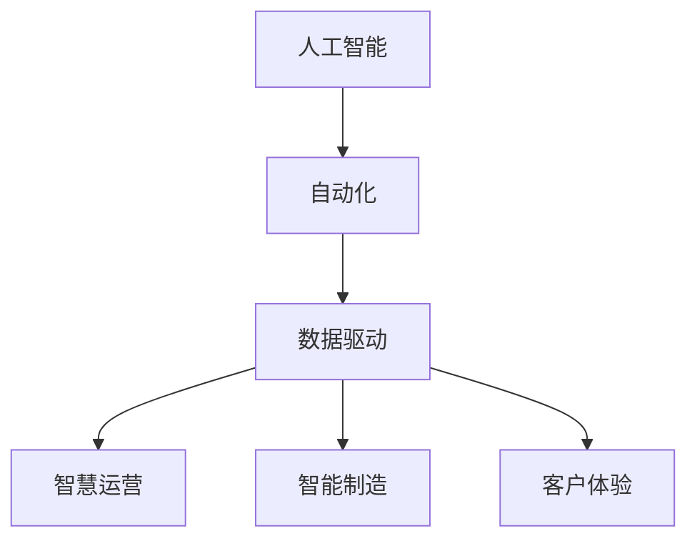
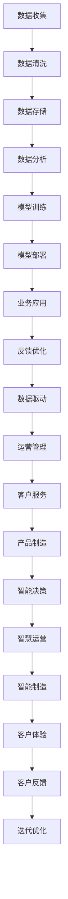

                 

# AI技术在产业中的变革作用

> 关键词：人工智能,产业变革,自动化,数据驱动,智慧运营,智能制造

## 1. 背景介绍

### 1.1 问题由来

随着人工智能(AI)技术的迅猛发展，其在产业中的渗透和应用日益广泛，对传统行业的变革作用愈发凸显。AI技术通过数据分析、模式识别、智能决策等多种手段，极大提升了产业的运营效率、产品质量和客户体验，成为驱动产业变革的重要引擎。然而，AI技术的应用并非一蹴而就，它需要经过科学的设计、系统的集成和持续的优化，方能实现其价值。

### 1.2 问题核心关键点

AI技术在产业中的应用主要围绕以下几个关键点展开：

- **自动化**：通过AI技术实现生产、物流、客服等环节的自动化，提高效率，减少人力成本。
- **数据驱动**：利用大数据和AI技术进行决策支持，优化资源配置，提高运营效率。
- **智慧运营**：运用AI技术进行实时监控、预测分析和优化调度，实现更高效、更智能的运营管理。
- **智能制造**：通过AI技术进行设备预测维护、质量检测和生产调度优化，提升制造效率和产品质量。
- **客户体验**：借助AI技术实现智能客服、个性化推荐和精准营销，提升客户满意度和忠诚度。

### 1.3 问题研究意义

AI技术在产业中的应用不仅提高了生产效率和经济效益，还推动了产业结构的优化升级，带来了新的增长点和发展机遇。然而，AI技术的应用也面临着诸多挑战，如数据质量、算法可靠性、伦理安全等。因此，深入研究和优化AI技术在产业中的应用，具有重要的理论意义和现实价值。

## 2. 核心概念与联系

### 2.1 核心概念概述

为更好地理解AI技术在产业中的应用，本节将介绍几个关键概念：

- **人工智能**：利用计算机模拟人类智能过程，实现自主学习、决策和交互的技术。
- **自动化**：通过机器自动化执行任务，减少人力成本，提高生产效率。
- **数据驱动**：以数据为驱动，利用AI技术进行决策分析和优化。
- **智慧运营**：运用AI技术实现智能监控、预测分析和优化调度。
- **智能制造**：通过AI技术进行设备预测维护、质量检测和生产调度优化。
- **客户体验**：借助AI技术实现智能客服、个性化推荐和精准营销。

这些概念之间存在密切联系，共同构成了AI技术在产业中的应用框架。

### 2.2 概念间的关系

这些核心概念之间的关系可以通过以下Mermaid流程图来展示：



这个流程图展示了AI技术在产业中的主要应用场景：

- AI技术通过自动化实现生产、物流、客服等环节的智能化。
- 利用数据驱动进行决策支持和运营优化。
- 在智能制造中，通过AI技术实现预测维护、质量检测和生产调度优化。
- 在客户体验上，AI技术实现智能客服、个性化推荐和精准营销。

这些概念共同构成了AI技术在产业中的应用框架，使得AI技术能够全面渗透到各个领域，推动产业的全面智能化和自动化。

### 2.3 核心概念的整体架构

最后，我们用一个综合的流程图来展示这些核心概念在大规模应用中的整体架构：



这个综合流程图展示了从数据收集到客户反馈的全过程，以及AI技术在各个环节中的应用和优化。通过这些环节的协同作用，AI技术能够在产业中发挥其最大价值，推动产业的全面智能化和自动化。

## 3. 核心算法原理 & 具体操作步骤

### 3.1 算法原理概述

AI技术在产业中的应用，核心在于通过数据分析和机器学习算法，实现智能决策和自动化执行。具体来说，主要包括数据预处理、模型训练、模型部署和业务应用等步骤。

1. **数据预处理**：收集和清洗数据，提取有价值的信息，为后续模型训练提供数据基础。
2. **模型训练**：利用机器学习算法，训练出能够进行智能决策的模型。
3. **模型部署**：将训练好的模型部署到实际生产环境中，进行业务应用。
4. **业务应用**：通过模型进行实时决策和自动化执行，提升产业运营效率和质量。

### 3.2 算法步骤详解

以下是AI技术在产业中的具体应用步骤：

**Step 1: 数据收集与预处理**
- 收集产业相关数据，包括生产数据、销售数据、客户数据等。
- 对数据进行清洗、归一化和特征工程，提取有价值的信息。

**Step 2: 模型训练**
- 选择适合的机器学习算法，如回归、分类、聚类等。
- 利用训练数据集，训练出能够进行智能决策的模型。

**Step 3: 模型部署**
- 将训练好的模型部署到实际生产环境中，如生产线、物流中心、客服系统等。
- 进行必要的参数调整和性能优化，确保模型在实际应用中高效稳定运行。

**Step 4: 业务应用**
- 通过模型进行实时决策和自动化执行，如生产调度、库存管理、客户服务、质量检测等。
- 收集业务反馈数据，对模型进行持续优化，确保模型适应实际应用环境。

### 3.3 算法优缺点

AI技术在产业中的应用，具有以下优点：

1. **提高效率**：自动化执行任务，减少人力成本，提高生产效率。
2. **优化决策**：利用数据驱动，进行智能决策和优化，提高运营效率。
3. **提升质量**：通过智能检测和预测维护，提高产品质量和设备可靠性。
4. **改善客户体验**：通过智能客服和个性化推荐，提升客户满意度和忠诚度。

同时，AI技术在产业中也面临以下挑战：

1. **数据质量问题**：数据收集、清洗和标注的成本较高，数据质量难以保证。
2. **算法可靠性和可解释性**：AI算法的复杂性使得其难以解释，可靠性也难以保证。
3. **伦理和安全性**：AI技术在应用中可能带来隐私和伦理问题，如数据隐私泄露、偏见和歧视。
4. **技术门槛高**：AI技术的应用需要高水平的技术支撑，对企业的技术能力和人才需求提出了挑战。

### 3.4 算法应用领域

AI技术在产业中的应用非常广泛，涵盖多个领域：

1. **制造业**：通过AI技术进行设备预测维护、质量检测和生产调度优化。
2. **零售业**：利用AI技术进行库存管理、销售预测和个性化推荐。
3. **金融业**：运用AI技术进行风险评估、客户分析和交易决策。
4. **医疗业**：借助AI技术进行疾病诊断、药物研发和医疗管理。
5. **物流业**：通过AI技术进行路线规划、货物跟踪和配送优化。
6. **服务行业**：利用AI技术进行智能客服、客户关系管理和运营优化。

## 4. 数学模型和公式 & 详细讲解

### 4.1 数学模型构建

在本节中，我们将通过数学语言对AI技术在产业中的应用进行更加严格的刻画。

假设生产数据为 $\{(x_i,y_i)\}_{i=1}^N$，其中 $x_i$ 表示生产参数，$y_i$ 表示生产结果。我们希望通过AI技术构建一个模型 $f(x)$，用于预测生产结果。

定义模型 $f(x)$ 在输入 $x_i$ 上的预测结果为 $\hat{y}=f(x_i)$。则模型的平均误差损失函数为：

$$
L(f) = \frac{1}{N}\sum_{i=1}^N (y_i - \hat{y})^2
$$

我们的目标是最小化损失函数 $L(f)$，即找到最优模型 $f(x)$。

### 4.2 公式推导过程

假设模型 $f(x)$ 为线性回归模型，即 $f(x) = \theta_0 + \theta_1x_1 + \theta_2x_2 + \cdots + \theta_nx_n$。则模型参数的优化目标为：

$$
\min_{\theta} \frac{1}{N}\sum_{i=1}^N (y_i - (\theta_0 + \theta_1x_{i1} + \theta_2x_{i2} + \cdots + \theta_nx_{in}))^2
$$

利用梯度下降算法，模型的参数更新公式为：

$$
\theta_j \leftarrow \theta_j - \eta\frac{2}{N}\sum_{i=1}^N(y_i - (\theta_0 + \theta_1x_{i1} + \theta_2x_{i2} + \cdots + \theta_nx_{in}))(x_{ij})
$$

其中 $\eta$ 为学习率，$j$ 表示模型参数的编号，$x_{ij}$ 表示输入数据的第 $j$ 个特征。

### 4.3 案例分析与讲解

以制造业中的预测维护为例，我们可以利用时间序列数据训练一个线性回归模型，用于预测设备故障时间。具体步骤如下：

1. **数据收集**：收集设备的历史运行数据，包括温度、振动、电流等参数，以及设备的故障时间。
2. **数据预处理**：对数据进行清洗、归一化和特征工程，提取有价值的信息。
3. **模型训练**：利用线性回归算法，训练出一个预测设备故障时间的模型。
4. **模型部署**：将训练好的模型部署到实际生产环境中，实时监测设备运行状态，预测设备故障时间。

通过以上步骤，我们可以实现设备的预测维护，减少生产停机时间，提升设备可靠性和生产效率。

## 5. 项目实践：代码实例和详细解释说明

### 5.1 开发环境搭建

在进行AI技术在产业中的应用实践前，我们需要准备好开发环境。以下是使用Python进行TensorFlow开发的环境配置流程：

1. 安装Anaconda：从官网下载并安装Anaconda，用于创建独立的Python环境。

2. 创建并激活虚拟环境：
```bash
conda create -n tf-env python=3.8 
conda activate tf-env
```

3. 安装TensorFlow：根据CUDA版本，从官网获取对应的安装命令。例如：
```bash
conda install tensorflow -c pytorch -c conda-forge
```

4. 安装各类工具包：
```bash
pip install numpy pandas scikit-learn matplotlib tqdm jupyter notebook ipython
```

完成上述步骤后，即可在`tf-env`环境中开始AI技术在产业中的应用实践。

### 5.2 源代码详细实现

这里我们以制造业中的预测维护为例，给出使用TensorFlow进行线性回归模型训练和预测的PyTorch代码实现。

首先，定义训练数据集和标签：

```python
import numpy as np
import tensorflow as tf

# 构造样本数据
X = np.random.randn(1000, 5)  # 5个特征
Y = np.random.randn(1000) + X[:, 0]**2 + X[:, 1]**2

# 构造训练集和测试集
X_train, X_test = X[:800], X[800:]
Y_train, Y_test = Y[:800], Y[800:]
```

然后，定义模型：

```python
# 定义线性回归模型
class LinearRegression(tf.keras.Model):
    def __init__(self, n_features):
        super(LinearRegression, self).__init__()
        self.w = tf.Variable(tf.zeros([n_features, 1]))
        self.b = tf.Variable(tf.zeros([1]))
    
    def call(self, inputs):
        return tf.matmul(inputs, self.w) + self.b

# 创建模型实例
model = LinearRegression(n_features=X.shape[1])
```

接着，定义优化器：

```python
# 定义优化器
optimizer = tf.keras.optimizers.Adam(learning_rate=0.01)
```

然后，定义训练函数：

```python
# 定义训练函数
def train_step(x, y):
    with tf.GradientTape() as tape:
        y_pred = model(x)
        loss = tf.reduce_mean(tf.square(y_pred - y))
    gradients = tape.gradient(loss, model.trainable_variables)
    optimizer.apply_gradients(zip(gradients, model.trainable_variables))
    return loss

# 训练模型
for epoch in range(1000):
    for x, y in train_dataset:
        loss = train_step(x, y)
    print(f"Epoch {epoch+1}, loss: {loss:.3f}")
```

最后，定义测试函数：

```python
# 定义测试函数
def test_step(x, y):
    y_pred = model(x)
    loss = tf.reduce_mean(tf.square(y_pred - y))
    return loss

# 测试模型
for x, y in test_dataset:
    loss = test_step(x, y)
print(f"Test loss: {loss:.3f}")
```

以上就是使用TensorFlow进行线性回归模型训练和预测的完整代码实现。可以看到，TensorFlow提供了强大的工具和框架，使得模型训练和预测变得简洁高效。

### 5.3 代码解读与分析

让我们再详细解读一下关键代码的实现细节：

**训练数据集**：
- 利用NumPy生成随机样本数据，包括5个特征和1个标签。

**模型定义**：
- 定义线性回归模型，包含一个全连接层，使用ReLU激活函数。

**优化器定义**：
- 使用Adam优化器进行模型训练。

**训练函数**：
- 在每个训练批次上计算损失，并使用梯度下降更新模型参数。

**测试函数**：
- 在测试批次上计算损失，评估模型性能。

**训练流程**：
- 循环迭代1000次，每次迭代在训练集上进行模型更新。
- 输出每个epoch的损失值，查看训练效果。
- 在测试集上评估模型，给出测试损失值。

可以看到，TensorFlow的API设计非常简洁，可以轻松实现线性回归模型的训练和测试。这为开发者提供了极大的便利，可以专注于模型设计和业务逻辑，而不必过多关注底层实现细节。

当然，实际应用中还需要考虑更多因素，如模型的超参数调优、正则化、评估指标等，才能确保模型在实际生产环境中稳定运行。

## 6. 实际应用场景

### 6.1 智能制造

AI技术在制造业中的应用非常广泛，涵盖设备预测维护、质量检测、生产调度优化等多个方面。通过AI技术，可以实现智能制造，提升生产效率和产品质量。

以设备预测维护为例，利用时间序列数据训练一个回归模型，实时监测设备运行状态，预测设备故障时间。一旦预测到设备可能发生故障，系统即可自动发出预警，进行维护，避免生产停机时间。

### 6.2 零售业

零售业利用AI技术进行库存管理、销售预测和个性化推荐，提高运营效率和客户满意度。通过数据分析和机器学习算法，预测商品销售趋势，优化库存管理和供应链管理。同时，利用推荐算法，根据客户历史购买行为和偏好，进行个性化推荐，提升客户购买转化率和满意度。

### 6.3 金融业

金融业利用AI技术进行风险评估、客户分析和交易决策。通过分析历史交易数据和市场信息，构建模型进行风险预测和投资建议。同时，利用自然语言处理技术，分析社交媒体和新闻等非结构化数据，预测市场趋势，辅助决策。

### 6.4 医疗业

医疗业利用AI技术进行疾病诊断、药物研发和医疗管理。通过分析患者病历、医学影像等数据，构建模型进行疾病预测和诊断。同时，利用AI技术进行药物分子模拟和筛选，加速新药研发进程。此外，利用AI技术进行医疗资源分配和管理，提高医疗服务质量和效率。

## 7. 工具和资源推荐

### 7.1 学习资源推荐

为了帮助开发者系统掌握AI技术在产业中的应用，这里推荐一些优质的学习资源：

1. TensorFlow官方文档：提供从入门到进阶的全面教程和API文档，是学习TensorFlow的必备资源。

2. TensorFlow中文社区：提供丰富的中文教程、文档和交流平台，方便国内开发者学习和分享。

3. PyTorch官方文档：提供PyTorch的全面教程和API文档，是学习深度学习的优秀资源。

4. Coursera深度学习课程：由斯坦福大学Andrew Ng教授主讲，提供从入门到进阶的深度学习课程，涵盖各种经典模型和算法。

5. DeepLearning.ai课程：提供完整的深度学习课程，涵盖计算机视觉、自然语言处理、强化学习等多个领域。

通过对这些资源的学习实践，相信你一定能够快速掌握AI技术在产业中的应用，并用于解决实际的业务问题。

### 7.2 开发工具推荐

高效的开发离不开优秀的工具支持。以下是几款用于AI技术在产业中应用的常用工具：

1. TensorFlow：由Google主导开发的开源深度学习框架，生产部署方便，适合大规模工程应用。

2. PyTorch：基于Python的开源深度学习框架，灵活动态的计算图，适合快速迭代研究。

3. Keras：高层次的深度学习API，封装了TensorFlow和Theano等后端框架，易于使用。

4. Jupyter Notebook：支持Python、R等多种语言的交互式开发环境，方便实验和调试。

5. Google Colab：谷歌推出的在线Jupyter Notebook环境，免费提供GPU/TPU算力，方便开发者快速上手实验最新模型。

合理利用这些工具，可以显著提升AI技术在产业中的开发效率，加快创新迭代的步伐。

### 7.3 相关论文推荐

AI技术在产业中的应用源于学界的持续研究。以下是几篇奠基性的相关论文，推荐阅读：

1. Deep Blue: The Life of a Machine (Deep Blue的传奇)：详细介绍了IBM的Deep Blue在国际象棋比赛中战胜世界冠军的故事，展示了AI技术的早期成功。

2. AlphaGo Zero: Mastering the Game of Go without Human Knowledge (AlphaGo Zero：无人类知识下精通围棋)：展示了AlphaGo Zero通过强化学习，在围棋领域取得的世界级成就，展示了AI技术的强大潜力。

3. GANs Trained by a Two-Level Minimax-Game (GANs通过两级极小极大游戏训练)：介绍了生成对抗网络(GANs)的基本原理和应用，展示了AI技术在图像生成、视频处理等领域的应用前景。

4. An Introduction to Statistical Learning with Applications in R (《统计学习基础》)：提供了统计学习的基本原理和方法，是学习数据科学和机器学习的经典教材。

5. Deep Learning (《深度学习》)：由Yoshua Bengio、Ian Goodfellow和Aaron Courville合著，介绍了深度学习的理论和应用，是学习深度学习的权威教材。

这些论文代表了大规模AI技术在产业中的发展脉络。通过学习这些前沿成果，可以帮助研究者把握学科前进方向，激发更多的创新灵感。

除上述资源外，还有一些值得关注的前沿资源，帮助开发者紧跟AI技术在产业中的最新进展，例如：

1. arXiv论文预印本：人工智能领域最新研究成果的发布平台，包括大量尚未发表的前沿工作，学习前沿技术的必读资源。

2. 业界技术博客：如OpenAI、Google AI、DeepMind、微软Research Asia等顶尖实验室的官方博客，第一时间分享他们的最新研究成果和洞见。

3. 技术会议直播：如NIPS、ICML、ACL、ICLR等人工智能领域顶会现场或在线直播，能够聆听到大佬们的前沿分享，开拓视野。

4. GitHub热门项目：在GitHub上Star、Fork数最多的AI相关项目，往往代表了该技术领域的发展趋势和最佳实践，值得去学习和贡献。

5. 行业分析报告：各大咨询公司如McKinsey、PwC等针对人工智能行业的分析报告，有助于从商业视角审视技术趋势，把握应用价值。

总之，对于AI技术在产业中的应用的学习和实践，需要开发者保持开放的心态和持续学习的意愿。多关注前沿资讯，多动手实践，多思考总结，必将收获满满的成长收益。

## 8. 总结：未来发展趋势与挑战

### 8.1 总结

本文对AI技术在产业中的应用进行了全面系统的介绍。首先阐述了AI技术在产业中的变革作用，明确了AI技术在提高效率、优化决策、提升质量等方面的独特价值。其次，从原理到实践，详细讲解了AI技术在产业中的核心算法和具体操作步骤，给出了AI技术在制造业、零售业、金融业、医疗业等领域的实际应用案例。最后，推荐了一些学习资源和开发工具，以供参考。

通过本文的系统梳理，可以看到，AI技术在产业中的应用已经非常广泛，成为了推动产业变革的重要力量。AI技术的应用不仅提高了生产效率和经济效益，还推动了产业结构的优化升级，带来了新的增长点和发展机遇。未来，随着AI技术的不断进步，其在产业中的应用将更加广泛，推动更多行业实现智能化和自动化。

### 8.2 未来发展趋势

展望未来，AI技术在产业中的应用将呈现以下几个发展趋势：

1. **自动化程度更高**：AI技术在生产、物流、客服等环节的应用将更加广泛和深入，进一步提升自动化水平。
2. **数据驱动更智能**：利用大数据和AI技术，进行更智能、更精准的决策支持，优化资源配置，提高运营效率。
3. **智慧运营更高效**：通过AI技术进行实时监控、预测分析和优化调度，实现更高效、更智能的运营管理。
4. **智能制造更精细**：利用AI技术进行设备预测维护、质量检测和生产调度优化，提升制造效率和产品质量。
5. **客户体验更个性化**：借助AI技术实现智能客服、个性化推荐和精准营销，提升客户满意度和忠诚度。

以上趋势凸显了AI技术在产业中的广阔前景。这些方向的探索发展，必将进一步提升产业的智能化和自动化水平，推动经济社会发展迈向新的高度。

### 8.3 面临的挑战

尽管AI技术在产业中的应用已经取得了显著成效，但在迈向更加智能化、普适化应用的过程中，它仍面临诸多挑战：

1. **数据质量问题**：数据收集、清洗和标注的成本较高，数据质量难以保证。
2. **算法可靠性和可解释性**：AI算法的复杂性使得其难以解释，可靠性也难以保证。
3. **伦理和安全性**：AI技术在应用中可能带来隐私和伦理问题，如数据隐私泄露、偏见和歧视。
4. **技术门槛高**：AI技术的应用需要高水平的技术支撑，对企业的技术能力和人才需求提出了挑战。

### 8.4 研究展望

面对AI技术在产业中面临的挑战，未来的研究需要在以下几个方面寻求新的突破：

1. **无监督和半监督学习**：摆脱对大规模标注数据的依赖，利用自监督学习、主动学习等无监督和半监督范式，最大限度利用非结构化数据，实现更加灵活高效的AI技术应用。
2. **多模态融合**：将视觉、语音、文本等多种模态的数据进行融合，实现更全面、更准确的信息整合能力，提升AI技术在复杂场景中的应用效果。
3. **因果推理**：引入因果推断方法，识别出AI模型的决策特征，增强输出解释的因果性和逻辑性，提高系统的可解释性和可控性。
4. **模型压缩和优化**：通过模型压缩、稀疏化存储等方法，减少模型尺寸，降低推理时间和内存占用，提升AI技术的实时性和资源利用效率。
5. **伦理和安全**：在AI技术应用中引入伦理导向的评估指标，过滤和惩罚有害的输出倾向，加强人工干预和审核，确保AI技术应用的伦理和安全。

这些研究方向和探索，必将引领AI技术在产业中的进一步发展，推动AI技术向更加智能化、普适化和可控化的方向演进。

## 9. 附录：常见问题与解答

**Q1：AI技术在产业中应用的主要优势是什么？**

A: AI技术在产业中应用的主要优势包括：
1. **提高效率**：通过自动化执行任务，减少人力成本，提高生产效率。
2. **优化决策**：利用数据驱动，进行智能决策和优化，提高运营效率。
3. **提升质量**：通过智能检测和预测维护，提高产品质量和设备可靠性。
4. **改善客户体验**：通过智能客服和个性化推荐，提升客户满意度和忠诚度。

**Q2：AI技术在产业中面临的主要挑战是什么？**

A: AI技术在产业中面临的主要挑战包括：
1. **数据质量问题**：数据收集、清洗和标注的成本较高，数据质量难以保证。
2. **算法可靠性和可解释性**：AI算法的复杂性使得其难以解释，可靠性也难以保证。
3. **伦理和安全性**：AI技术在应用中可能带来隐私和伦理问题，如数据隐私泄露、偏见和歧视。
4. **技术门槛高**：AI技术的应用需要高水平的技术支撑，对企业的技术能力和人才需求提出了挑战。

**Q3：如何确保AI技术在产业中的应用效果？**

A: 确保AI技术在产业中的应用效果，可以从以下几个方面入手：
1. **数据质量管理**：确保数据收集、清洗和标注的质量，保证数据的准确性和完整性。
2. **模型优化和调参**：通过模型优化和超参数调参，提高模型的性能和泛化能力。
3. **业务反馈和持续优化**：根据业务反馈数据，持续优化

