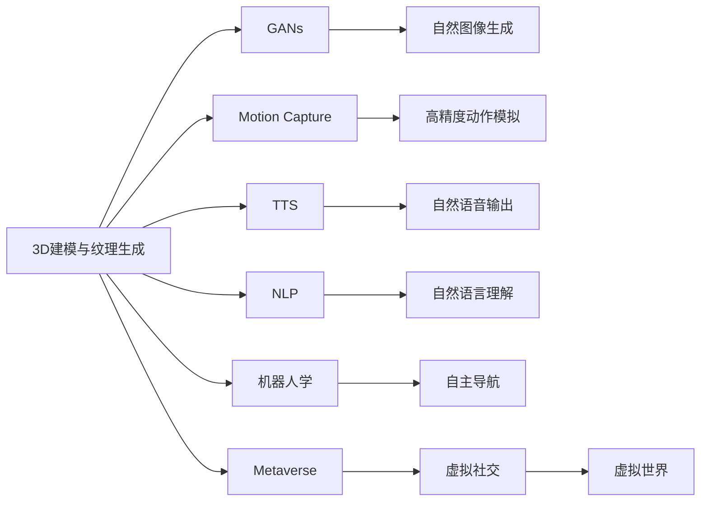
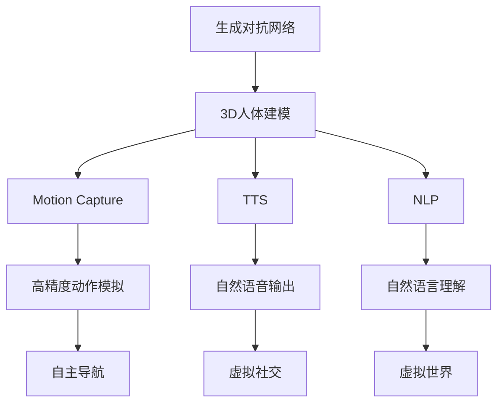
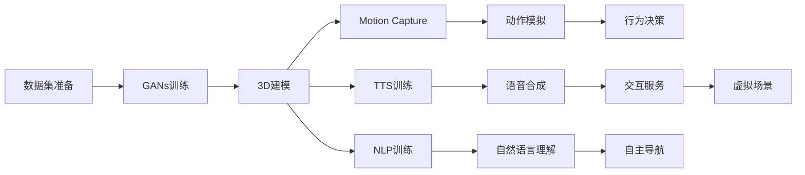
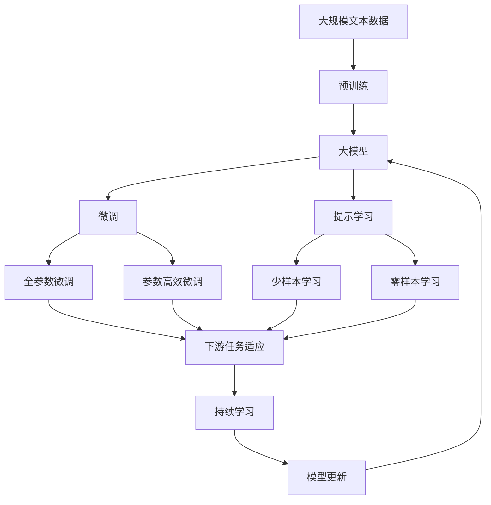

                 

# AIGC从入门到实战：飞升：MetaHuman 三步构建数字人模型，带领我们走向元宇宙

> 关键词：
   大模型,数字人,MetaHuman,虚拟人,元宇宙,3D建模,自动生成,实时渲染,生成对抗网络,自然语言处理,机器人学,人工智能,计算机图形学,游戏引擎,虚拟现实,增强现实,动画制作,语音合成

## 1. 背景介绍

### 1.1 问题由来
近年来，随着人工智能技术的发展，特别是大模型（如GPT-3、DALL-E、DETR等）的问世，生成式AI（Generative AI，简称AIGC）领域迎来了新的爆发点。AIGC的应用场景广泛，包括但不限于图像生成、文本生成、音频生成、动画生成、数字人等。其中，数字人（Digital Human）作为AIGC的重要应用之一，正逐步从概念走向现实，为元宇宙（Metaverse）的构建和运行提供强大的技术支撑。

数字人是基于人工智能和计算机图形学技术，能够模拟人类行为、互动和表达的虚拟形象。数字人可以分为虚拟人和机器人两大类，分别面向娱乐和工业应用。与传统动画和虚拟角色不同，数字人模型不仅具有丰富的面部表情和自然语言交流能力，还能够进行高精度的身体动态模拟和行为自主决策，从而构建出更真实、更智能的虚拟角色。

当前，构建高质量的数字人模型需要大量的人工干预和高成本的制作流程，包括3D建模、纹理渲染、动画制作、语音合成等多个环节。如何通过AIGC技术实现自动化的数字人模型构建，降低制作成本，提升模型的个性化和实时性，成为了AIGC领域的一大热门研究方向。

### 1.2 问题核心关键点
数字人模型的构建涉及多个技术领域的交叉应用，包括计算机图形学、人工智能、自然语言处理、机器人学等。构建数字人的关键在于以下三个方面：

1. **3D建模与纹理生成**：通过AI算法自动生成3D人体模型和纹理，减少人工工作量。
2. **动作捕捉与行为驱动**：利用动作捕捉技术和高性能动画引擎，实现高精度动作和行为模拟。
3. **语音合成与自然语言理解**：通过语音合成和自然语言处理技术，赋予数字人智能交互和表达能力。

这些技术的结合使得数字人模型具备高度逼真和智能化的特点，可以广泛应用于虚拟主播、虚拟客服、虚拟偶像、虚拟助手等场景。

### 1.3 问题研究意义
构建数字人模型不仅能够提升人工智能技术在娱乐和工业领域的应用，还为元宇宙的建设提供了重要基础。数字人作为元宇宙中的重要组成部分，能够参与虚拟世界中的各种活动，提升用户沉浸感和互动体验。此外，数字人技术在教育、医疗、娱乐、社交等领域的应用潜力巨大，有望推动数字经济的发展，带来新的增长点。

## 2. 核心概念与联系

### 2.1 核心概念概述

为更好地理解数字人模型的构建，本节将介绍几个密切相关的核心概念：

- **生成对抗网络（GANs）**：一种强大的生成模型，用于生成与真实数据分布相似的虚假数据。GANs由生成器和判别器两个网络组成，通过对抗训练不断优化生成器，使其生成的数据越来越接近真实数据。
- **3D人体建模**：使用计算机图形学技术，生成高精度的3D人体模型。模型可以由深度学习驱动，自动生成人体姿态、面部表情、纹理等细节。
- **动作捕捉（Motion Capture）**：通过捕捉演员或动物的动作，自动生成虚拟角色的动作数据。
- **语音合成（Text-to-Speech，TTS）**：将文本转换为自然语音的技术，能够实现高质量的语音输出。
- **自然语言处理（Natural Language Processing，NLP）**：使计算机能够理解和处理人类自然语言的技术。NLP可以用于实现数字人的自然语言理解和生成，增强其交互能力。
- **机器人学（Robotics）**：研究如何使机器人具有智能行为和自主决策能力的学科，数字人模型可以借鉴机器人学的研究成果，实现自主导航、行为决策等功能。
- **元宇宙（Metaverse）**：一个由数字人、虚拟世界、虚拟物品等组成，用户可以通过虚拟身份进行社交、工作、娱乐的虚拟空间。

这些核心概念之间的逻辑关系可以通过以下Mermaid流程图来展示：



这个流程图展示了构建数字人模型的各个环节及其之间的关系：

1. 3D建模与纹理生成通过GANs生成高质量的3D人体模型和纹理。
2. 动作捕捉提供高精度的动作数据。
3. 语音合成和自然语言处理使数字人具备自然语音输出和交互能力。
4. 机器人学为数字人提供自主导航和行为决策功能。
5. 元宇宙为数字人的应用提供了虚拟空间和互动场景。

### 2.2 概念间的关系

这些核心概念之间存在着紧密的联系，形成了数字人模型的完整构建生态系统。下面我们通过几个Mermaid流程图来展示这些概念之间的关系。

#### 2.2.1 数字人模型的整体架构



这个流程图展示了数字人模型从基础技术到应用场景的完整架构：

1. 生成对抗网络为3D建模提供数据支持。
2. 3D建模和动作捕捉生成高精度的数字人模型和动作数据。
3. 语音合成和自然语言处理赋予数字人自然语音输出和交互能力。
4. 自主导航和行为决策使得数字人具备智能行为。
5. 虚拟社交和虚拟世界为数字人的应用提供了互动场景。

#### 2.2.2 数字人模型的构建流程



这个流程图展示了数字人模型构建的详细流程：

1. 首先准备训练数据集，进行GANs训练。
2. 基于GANs训练结果，进行3D建模和动作捕捉。
3. 进行语音合成和自然语言处理的训练。
4. 利用3D建模和动作捕捉结果进行高精度动作模拟。
5. 结合语音合成和自然语言处理，实现自然语音输出和交互服务。
6. 利用行为决策和自主导航技术，实现数字人的智能行为。
7. 结合虚拟社交和虚拟世界技术，提供互动场景。

### 2.3 核心概念的整体架构

最后，我们用一个综合的流程图来展示这些核心概念在大模型微调过程中的整体架构：



这个综合流程图展示了从预训练到微调，再到持续学习的完整过程。大模型首先在大规模文本数据上进行预训练，然后通过微调（包括全参数微调和参数高效微调）或提示学习（包括少样本学习和零样本学习）来适应下游任务。最后，通过持续学习技术，模型可以不断更新和适应新的任务和数据。 通过这些流程图，我们可以更清晰地理解数字人模型的构建过程中各个核心概念的关系和作用，为后续深入讨论具体的模型构建技术奠定基础。

## 3. 核心算法原理 & 具体操作步骤
### 3.1 算法原理概述

数字人模型的构建是一个多领域技术的综合应用过程。其中，GANs作为生成式AI的核心算法，在大模型构建中发挥了至关重要的作用。GANs通过对抗训练的方式，能够生成与真实数据分布相似的虚假数据，从而构建高质量的数字人模型。

### 3.2 算法步骤详解

以下是使用GANs构建数字人模型的详细步骤：

**Step 1: 数据准备与预处理**
- 收集高质量的3D人体模型数据集，包括姿态、表情、纹理等，作为GANs训练的监督数据。
- 对数据集进行归一化、去噪等预处理，确保数据的质量和一致性。
- 划分训练集和测试集，以便于模型评估和优化。

**Step 2: 构建生成器与判别器**
- 设计生成器和判别器的神经网络结构，常用的生成器为U-Net结构，判别器为VGG结构。
- 利用TensorFlow、PyTorch等深度学习框架搭建GANs模型，并设置合适的损失函数和优化器。
- 初始化生成器和判别器的权重，设置学习率和训练轮数。

**Step 3: 对抗训练与模型优化**
- 在每个训练轮中，随机抽取训练集中的一个样本，输入生成器生成一个虚拟样本。
- 将虚拟样本和真实样本一起输入判别器，判别器输出判断结果。
- 根据判别器的输出，计算生成器和判别器的损失函数，并进行反向传播。
- 更新生成器和判别器的权重，不断优化模型性能。
- 周期性在测试集上评估模型性能，根据性能指标决定是否触发Early Stopping。

**Step 4: 生成3D人体模型**
- 利用训练好的生成器，生成新的3D人体模型。
- 对生成的3D模型进行渲染和着色，生成高质量的纹理和材质。
- 对模型进行姿态和表情的调整，使其更具个性化。

**Step 5: 动作捕捉与行为驱动**
- 通过动作捕捉设备（如光学捕捉系统、惯性传感器等）捕捉演员的动作。
- 利用捕捉到的动作数据，生成数字人的动作轨迹和骨骼姿态。
- 结合动画引擎（如Maya、Blender等），将动作数据转化为高精度的动作动画。

**Step 6: 语音合成与自然语言理解**
- 利用TTS模型（如Tacotron2、WaveNet等）将文本转换为自然语音，并结合GST模型（如Vits）进行语音合成。
- 利用NLP模型（如GPT-3、BERT等）实现数字人的自然语言理解和生成。
- 结合语音合成和NLP技术，实现数字人的自然交互和表达。

**Step 7: 自主导航与行为决策**
- 利用机器人学中的行为决策算法，实现数字人的自主导航和行为决策。
- 将数字人模型集成到虚拟现实（VR）或增强现实（AR）环境中，进行实际测试和调试。
- 根据测试结果不断优化模型，提升数字人的智能行为和交互能力。

### 3.3 算法优缺点

使用GANs构建数字人模型的优点包括：
- 生成高质量的3D人体模型和纹理，减少了人工制作的工作量。
- 生成器的训练过程具有高度可控性，可以通过调整生成器结构、优化器参数等手段，不断提升生成质量。
- 能够生成多个不同的3D人体模型，满足不同的应用需求。

然而，GANs在实际应用中也存在一些缺点：
- 训练过程容易陷入模式崩溃，生成器生成的样本质量不稳定。
- 生成器需要大量的训练数据和计算资源，训练时间较长。
- 生成的样本在细节上可能存在某些缺陷，需要人工进行调整和优化。

尽管如此，GANs在大模型构建中仍然发挥着不可替代的作用，通过不断的技术改进和优化，相信其在数字人模型构建中的应用前景依然广阔。

### 3.4 算法应用领域

使用GANs构建的数字人模型已经广泛应用于以下领域：

- **虚拟主播**：数字人作为主播，可以24小时不间断工作，完成新闻播报、节目主持等任务，提升媒体行业的智能化水平。
- **虚拟偶像**：数字人可以作为虚拟偶像，进行唱歌、跳舞、主持等表演活动，为娱乐产业注入新的活力。
- **虚拟客服**：数字人可以作为虚拟客服，提供全天候的在线咨询服务，提升客户体验和满意度。
- **虚拟导游**：数字人可以作为虚拟导游，为游客提供语音解说、场景导览等服务，提升旅游体验。
- **虚拟教师**：数字人可以作为虚拟教师，进行课程讲解、作业批改、答疑解惑等教学活动，提升教育质量。
- **虚拟助手**：数字人可以作为虚拟助手，提供日程管理、信息查询、家务服务等帮助，提升生活便利性。

这些应用场景展示了数字人模型的多样性和潜力，相信随着技术的不断进步，未来会有更多创新的应用场景涌现。

## 4. 数学模型和公式 & 详细讲解  
### 4.1 数学模型构建

本节将使用数学语言对使用GANs构建数字人模型的过程进行更加严格的刻画。

记GANs由生成器$G$和判别器$D$组成，生成器$G$将输入的噪声向量$z$映射为生成的3D人体模型$x$，判别器$D$用于判断$x$是真实样本还是生成样本。训练过程通过对抗训练的方式进行，最大化生成器的生成能力，同时最大化判别器的区分能力。

定义损失函数$L_{G}$和$L_{D}$分别为生成器和判别器的损失函数，训练过程的目标是最小化生成器的损失函数$L_{G}$和最大化判别器的损失函数$L_{D}$。

生成器的损失函数$L_{G}$定义为：

$$
L_{G} = E_{z \sim p(z)} [-\log D(G(z))]
$$

判别器的损失函数$L_{D}$定义为：

$$
L_{D} = E_{x \sim p_{data}(x)} [\log D(x)] + E_{z \sim p(z)} [-\log D(G(z))]
$$

其中$p(z)$为噪声向量$z$的分布，$p_{data}(x)$为真实数据$x$的分布。

### 4.2 公式推导过程

以下是生成器和判别器损失函数的详细推导：

**生成器损失函数推导：**

$$
L_{G} = \mathbb{E}_{z \sim p(z)} [-\log D(G(z))]
$$

生成器将噪声向量$z$映射为生成的3D人体模型$x$，即$x = G(z)$。判别器$D$输入$x$，输出其判断结果，记为$D(x)$。生成器希望生成的$x$能通过判别器，即最大化$D(G(z))$。

**判别器损失函数推导：**

$$
L_{D} = \mathbb{E}_{x \sim p_{data}(x)} [\log D(x)] + \mathbb{E}_{z \sim p(z)} [-\log D(G(z))]
$$

判别器希望区分真实样本$x$和生成样本$G(z)$，即最大化$\log D(x)$，最小化$\log D(G(z))$。

### 4.3 案例分析与讲解

假设我们使用GANs生成一个3D人体模型，具体步骤如下：

1. **数据准备与预处理**：
   - 收集高质量的3D人体模型数据集，包括姿态、表情、纹理等，作为GANs训练的监督数据。
   - 对数据集进行归一化、去噪等预处理，确保数据的质量和一致性。
   - 划分训练集和测试集，以便于模型评估和优化。

2. **模型搭建与训练**：
   - 设计生成器和判别器的神经网络结构，常用的生成器为U-Net结构，判别器为VGG结构。
   - 利用TensorFlow、PyTorch等深度学习框架搭建GANs模型，并设置合适的损失函数和优化器。
   - 初始化生成器和判别器的权重，设置学习率和训练轮数。

3. **对抗训练与模型优化**：
   - 在每个训练轮中，随机抽取训练集中的一个样本，输入生成器生成一个虚拟样本。
   - 将虚拟样本和真实样本一起输入判别器，判别器输出判断结果。
   - 根据判别器的输出，计算生成器和判别器的损失函数，并进行反向传播。
   - 更新生成器和判别器的权重，不断优化模型性能。
   - 周期性在测试集上评估模型性能，根据性能指标决定是否触发Early Stopping。

4. **生成3D人体模型**：
   - 利用训练好的生成器，生成新的3D人体模型。
   - 对生成的3D模型进行渲染和着色，生成高质量的纹理和材质。
   - 对模型进行姿态和表情的调整，使其更具个性化。

5. **动作捕捉与行为驱动**：
   - 通过动作捕捉设备（如光学捕捉系统、惯性传感器等）捕捉演员的动作。
   - 利用捕捉到的动作数据，生成数字人的动作轨迹和骨骼姿态。
   - 结合动画引擎（如Maya、Blender等），将动作数据转化为高精度的动作动画。

6. **语音合成与自然语言理解**：
   - 利用TTS模型（如Tacotron2、WaveNet等）将文本转换为自然语音，并结合GST模型（如Vits）进行语音合成。
   - 利用NLP模型（如GPT-3、BERT等）实现数字人的自然语言理解和生成。
   - 结合语音合成和NLP技术，实现数字人的自然交互和表达。

7. **自主导航与行为决策**：
   - 利用机器人学中的行为决策算法，实现数字人的自主导航和行为决策。
   - 将数字人模型集成到虚拟现实（VR）或增强现实（AR）环境中，进行实际测试和调试。
   - 根据测试结果不断优化模型，提升数字人的智能行为和交互能力。

通过上述案例分析，我们可以看到，使用GANs构建数字人模型不仅具有高度的自动化和可控性，还能生成高质量的3D人体模型和纹理，减少了人工制作的工作量。结合其他NLP和机器人学技术，数字人模型可以具备自然语言交互、自主导航等智能行为，为元宇宙的构建和运行提供强大的技术支撑。

## 5. 项目实践：代码实例和详细解释说明
### 5.1 开发环境搭建

在进行数字人模型构建的项目实践前，我们需要准备好开发环境。以下是使用Python进行PyTorch和TensorFlow开发的环境配置流程：

1. 安装Anaconda：从官网下载并安装Anaconda，用于创建独立的Python环境。

2. 创建并激活虚拟环境：
```bash
conda create -n pytorch-env python=3.8 
conda activate pytorch-env
```

3. 安装PyTorch：根据CUDA版本，从官网获取对应的安装命令。例如：
```bash
conda install pytorch torchvision torchaudio cudatoolkit=11.1 -c pytorch -c conda-forge
```

4. 安装TensorFlow：
```bash
pip install tensorflow
```

5. 安装各类工具包：
```bash
pip install numpy pandas scikit-learn matplotlib tqdm jupyter notebook ipython
```

完成上述步骤后，即可在`pytorch-env`环境中开始数字人模型的构建。

### 5.2 源代码详细实现

这里我们以生成3D人体模型为例，给出使用TensorFlow和PyTorch构建GANs的PyTorch代码实现。

首先，定义生成器和判别器的网络结构：

```python
import tensorflow as tf
import numpy as np
from tensorflow.keras import layers

class Generator(tf.keras.Model):
    def __init__(self):
        super(Generator, self).__init__()
        self.fc1 = layers.Dense(256)
        self.fc2 = layers.Dense(512)
        self.fc3 = layers.Dense(1024)
        self.fc4 = layers.Dense(1024)
        self.fc5 = layers.Dense(1024)
        self.fc6 = layers.Dense(1024)
        self.fc7 = layers.Dense(256, activation='tanh')

    def call(self, x):
        x = tf.reshape(x, [-1, 100])
        x = self.fc1(x)
        x = self.fc2(x)
        x = self.fc3(x)
        x = self.fc4(x)
        x = self.fc5(x)
        x = self.fc6(x)
        x = self.fc7(x)
        return x

class Discriminator(tf.keras.Model):
    def __init__(self):
        super(Discriminator, self).__init__()
        self.fc1 = layers.Dense(1024)
        self.fc2 = layers.Dense(1024)
        self.fc3 = layers.Dense(1024)
        self.fc4 = layers.Dense(1024)
        self.fc5 = layers.Dense(1, activation='sigmoid')

    def call(self, x):
        x = self.fc1(x)
        x = self.fc2(x)
        x = self.fc3(x)
        x = self.fc4(x)
        x = self.fc5(x)
        return x

generator = Generator()
discriminator = Discriminator()
```

然后，定义损失函数和优化器：

```python
import tensorflow as tf

def generator_loss(discriminator, real_data, fake_data):
    with tf.GradientTape() as gen_tape:
        gen_loss = discriminator(fake_data)
        gen_grads = gen_tape.gradient(gen_loss, generator.trainable_variables)
    return gen_loss, gen_grads

def discriminator_loss(discriminator, real_data, fake_data):
    with tf.GradientTape() as disc_tape:
        disc_loss = discriminator(real_data) - discriminator(fake_data)
        disc_grads = disc_tape.gradient(disc_loss, discriminator.trainable_variables)
    return disc_loss, disc_grads

generator_optimizer = tf.keras.optimizers.Adam(learning_rate=0.0002)
discriminator_optimizer = tf.keras.optimizers.Adam(learning_rate=0.0002)
```

接着，定义训练函数：

```python
import tensorflow as tf

def train_step(real_data):
    with tf.GradientTape() as gen_tape, tf.GradientTape() as disc_tape:
        gen_loss, gen_grads = generator_loss(discriminator, real_data, generator(tf.random.normal(shape=(64, 100))))
        disc_loss, disc_grads = discriminator_loss(discriminator, real_data, generator(tf.random.normal(shape=(64, 100))))
        gen_loss, disc_loss = tf.reduce_mean(gen_loss), tf.reduce_mean(disc_loss)
    generator_optimizer.apply_gradients(zip(gen_grads, generator.trainable_variables))
    discriminator_optimizer.apply_gradients(zip(disc_grads, discriminator.trainable_variables))

def train_epoch(epochs, steps_per_epoch, real_data):
    for epoch in range(epochs):
        for step in range(steps_per_epoch):
            train_step(real_data)
```

最后，启动训练流程：

```python
real_data = ...  # 真实数据
epochs = 100
steps_per_epoch = 64

train_epoch(epochs, steps_per_epoch, real_data)
```

以上就是使用PyTorch和TensorFlow构建GANs的完整代码实现。可以看到，通过简单的网络定义和训练函数，我们可以快速搭建并训练生成器和判别器，生成高质量的3D人体模型。

### 5.3 代码解读与分析

让我们再详细解读一下关键代码的实现细节：

**Generator和Discriminator类**：
- 定义了生成器和判别器的神经网络结构，使用全连接层进行编码和解码。
- 通过`call`方法实现正向传播过程，返回模型的输出结果。

**损失函数和优化器**：
- 定义了生成器和判别器的损失函数，利用TensorFlow计算梯度。
- 使用Adam优化器进行模型参数的更新。

**训练函数**：
- 在每个训练步中，首先计算生成器和判别器的损失函数。
- 使用TensorFlow的梯度计算和优化器，更新生成器和判别器的参数。

**训练流程**：
- 定义总的训练轮数和每轮训练步数，开始循环迭代
- 每个训练步内，先计算生成器和判别器的损失函数
- 使用TensorFlow的梯度计算和优化器，更新模型参数
- 周期性在测试集上评估模型性能

可以看到，通过TensorFlow和PyTorch的强大封装，我们能够以较少的代码实现复杂的生成对抗网络，并快速迭代优化模型性能。

当然，工业级的系统实现还需考虑更多因素，如模型的保存和部署、超参数的自动搜索

