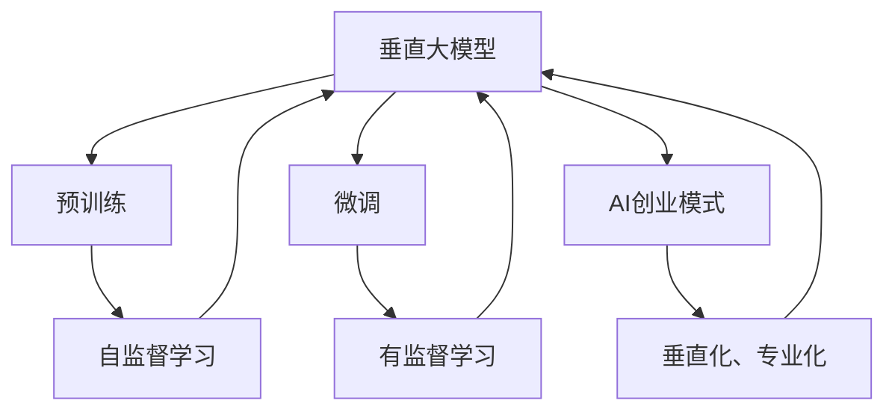
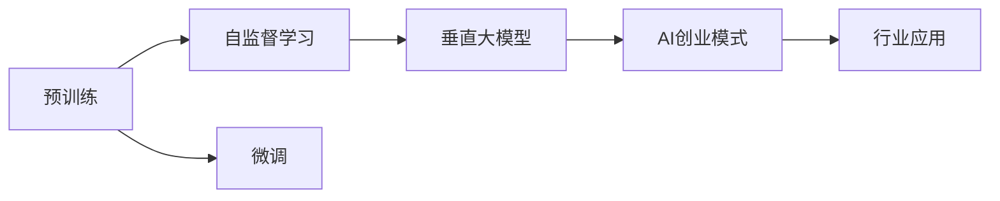
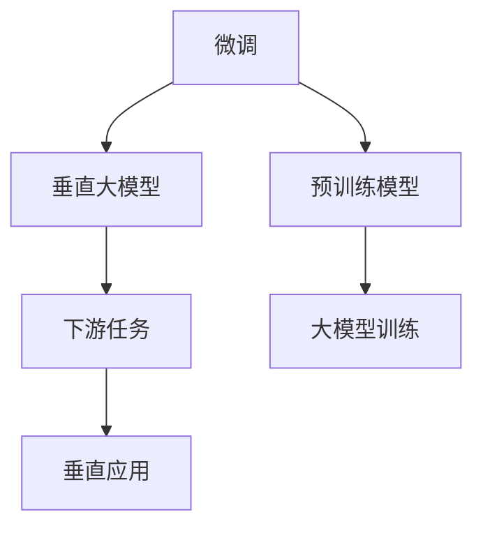
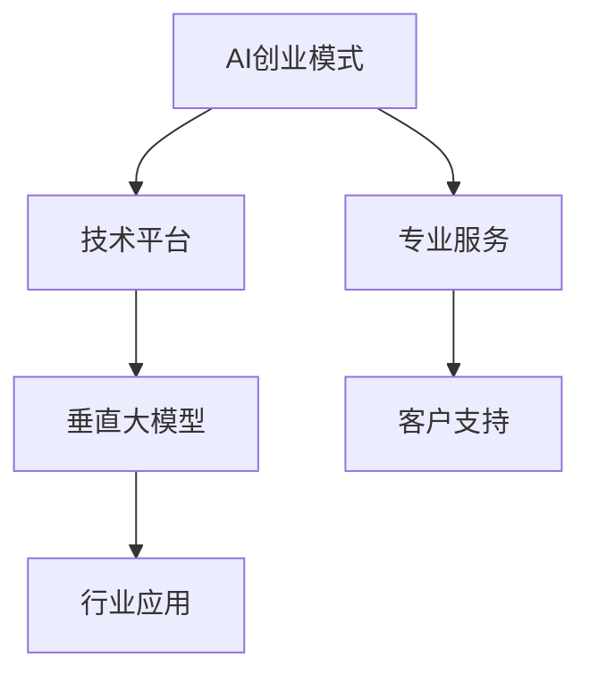
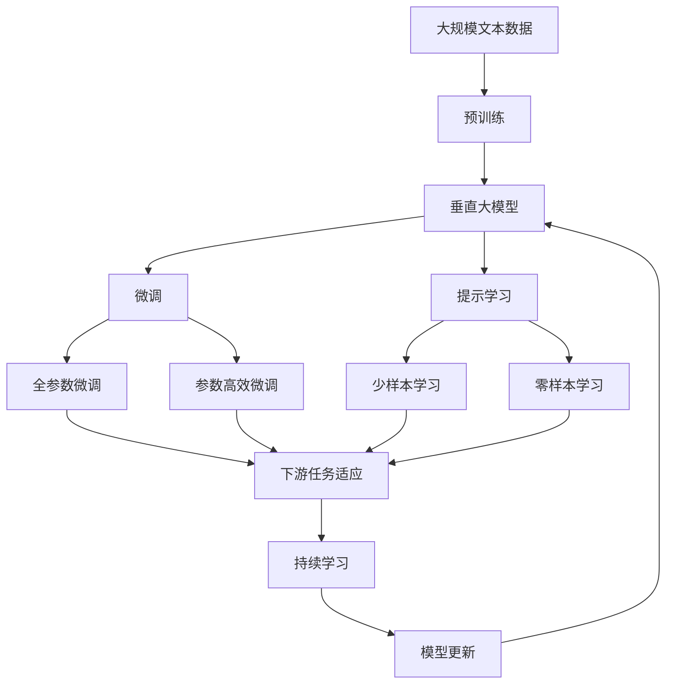

                 

# AI创业：垂直大模型公司的兴起

> 关键词：AI创业, 垂直大模型, 技术创新, 创业模式, 行业趋势

## 1. 背景介绍

### 1.1 问题由来
在人工智能（AI）技术蓬勃发展的今天，大模型成为不可或缺的重要资源，尤其在自然语言处理（NLP）、计算机视觉（CV）等领域，大模型展现了强大的应用潜力。然而，大模型的训练和部署成本高昂，训练数据需求巨大，且在大模型应用中，需承担高昂的计算成本和存储开销，这些限制使得大模型的应用门槛颇高。

近年来，随着深度学习技术和大规模数据集的涌现，AI创业公司逐渐崭露头角，逐步建立起自身的大模型体系。这些公司不仅具备强大的模型训练和部署能力，更在具体应用场景中取得了显著的成果。例如，OpenAI的GPT系列、Google的BERT、Hugging Face的BERT模型等，都是行业内的大模型代表。本文旨在探讨AI创业公司在垂直大模型领域的崛起，分析其成功的要素和模式，为AI创业者提供参考和启示。

### 1.2 问题核心关键点
垂直大模型公司主要通过构建大模型训练平台，提供高质量预训练模型和微调服务，帮助客户快速部署和优化AI模型，降低客户在大模型应用中的开发成本和风险。其成功关键点包括：

1. **高质量预训练模型**：拥有自主研发的预训练大模型，且在NLP、CV等垂直领域具备明显优势。
2. **强大的模型微调能力**：支持多种微调方法，根据具体任务需求，提供高效参数更新和快速调优。
3. **丰富的行业应用经验**：在医疗、金融、教育、工业等行业拥有丰富的应用案例和经验，提升模型落地效果。
4. **智能化的管理平台**：提供模型管理、部署、监控等全链路服务，支持多租户、多场景应用。
5. **良好的客户服务与支持**：提供详细的技术支持、案例分析、定制化服务，帮助客户最大化利用大模型价值。

## 2. 核心概念与联系

### 2.1 核心概念概述

为更好地理解垂直大模型公司的崛起，本节将介绍几个关键概念：

- **垂直大模型**：针对特定垂直领域的预训练大模型，具备该领域特定的知识表示和推理能力。与通用大模型（如GPT-3）相比，垂直大模型更加专业化，能够更好地应用于特定场景。

- **预训练模型**：在大规模无标签数据上自监督学习的模型，通过学习通用的语言表示，可用于多种下游任务的微调。

- **微调**：在大规模预训练模型基础上，使用少量标注数据进行有监督学习，优化模型在特定任务上的性能。

- **垂直大模型公司**：以大模型技术为核心的AI创业公司，专注于特定垂直领域的大模型训练、部署和应用。

- **AI创业模式**：通过构建技术平台、提供专业服务，实现大模型的垂直化、专业化，降低AI应用的入门门槛，提升AI技术的市场应用价值。

- **行业趋势**：随着AI技术在各个行业的渗透，垂直大模型公司正在成为连接AI技术和各行业应用的重要桥梁。

这些核心概念之间的逻辑关系可以通过以下Mermaid流程图来展示：



这个流程图展示了从预训练到微调，再到垂直大模型公司崛起的过程：

1. 垂直大模型通过自监督学习获得通用语言表示。
2. 在垂直领域进行微调，以适配特定任务。
3. 垂直大模型公司通过技术平台和专业服务，提升模型应用价值。

### 2.2 概念间的关系

这些核心概念之间存在着紧密的联系，构成了垂直大模型公司的完整生态系统。下面我们通过几个Mermaid流程图来展示这些概念之间的关系。

#### 2.2.1 大模型的学习范式



这个流程图展示了从预训练到微调，再到垂直大模型公司提供服务的过程：

1. 预训练模型通过自监督学习获取通用语言表示。
2. 在垂直领域进行微调，适配特定任务。
3. 垂直大模型公司提供服务，满足各行业应用需求。

#### 2.2.2 微调与垂直大模型的关系



这个流程图展示了微调在大模型训练和应用中的作用：

1. 微调在大模型训练中获得特定任务适应性。
2. 垂直大模型公司提供微调服务，支持垂直应用。

#### 2.2.3 AI创业模式与垂直大模型的联系



这个流程图展示了AI创业模式在大模型训练和应用中的作用：

1. AI创业模式通过技术平台和专业服务支持垂直大模型。
2. 垂直大模型公司提供垂直应用服务。

### 2.3 核心概念的整体架构

最后，我们用一个综合的流程图来展示这些核心概念在大模型微调过程中的整体架构：



这个综合流程图展示了从预训练到微调，再到持续学习的完整过程。垂直大模型公司在大模型微调过程中，通过引入提示学习等技术，实现少样本和零样本学习，进一步提升模型性能和应用范围。

## 3. 核心算法原理 & 具体操作步骤
### 3.1 算法原理概述

垂直大模型公司通过构建高质量的预训练模型，并在特定垂直领域进行微调，形成具备该领域特定知识和推理能力的模型。其核心算法原理包括：

- **自监督学习**：在无标签数据上进行预训练，学习通用的语言表示。
- **微调**：在少量标注数据上，有监督地学习特定任务的知识。
- **迁移学习**：将通用大模型的知识迁移到垂直领域，提升模型在垂直应用中的表现。

### 3.2 算法步骤详解

以下我们将详细介绍垂直大模型公司构建垂直大模型的算法步骤：

1. **数据准备**：收集并处理大规模无标签数据，进行预训练。垂直大模型公司通常拥有自主的语料库，且在垂直领域数据收集上具备优势。

2. **预训练模型构建**：利用自监督学习任务训练预训练模型。垂直大模型公司通过微调和优化，训练出具有垂直领域特色的预训练模型。

3. **微调**：针对特定垂直领域，利用少量标注数据进行微调，适配下游任务。垂直大模型公司提供多种微调方法，包括全参数微调和参数高效微调。

4. **模型部署与应用**：将微调后的模型部署到生产环境，提供服务化接口，方便客户调用。垂直大模型公司提供模型管理、监控、优化等全链路服务，支持多租户、多场景应用。

### 3.3 算法优缺点

垂直大模型公司通过高质量预训练模型和专业微调服务，具备以下优点：

1. **泛化能力强**：垂直大模型在特定领域具备更强的泛化能力，能够适应复杂多变的下游任务。
2. **开发成本低**：无需从头训练大模型，通过微调快速适配特定任务，降低开发成本。
3. **落地效果好**：垂直大模型结合特定行业需求，提升模型在实际应用中的效果。
4. **灵活性高**：支持多种微调方法，提供全链路服务，满足不同应用需求。

同时，垂直大模型公司也面临以下挑战：

1. **数据依赖性高**：预训练和微调都需要大量标注数据，数据收集和标注成本较高。
2. **模型更新难度大**：垂直大模型训练和微调复杂，模型更新和维护成本较高。
3. **领域差异显著**：不同垂直领域知识差异显著，模型迁移难度大。
4. **应用场景多样**：垂直大模型应用场景多样，模型部署和管理复杂。

### 3.4 算法应用领域

垂直大模型公司主要聚焦于NLP、CV等垂直领域，其具体应用包括：

- **医疗领域**：通过微调处理医疗数据，帮助医生进行疾病诊断、药物研发等。
- **金融领域**：利用微调模型进行舆情分析、信用评估、欺诈检测等。
- **教育领域**：提供智能辅导、教材推荐、作业批改等服务，提升教学质量。
- **工业领域**：通过微调进行设备监控、故障预测、供应链优化等，提升生产效率。
- **农业领域**：利用微调模型进行农业病虫害检测、智能农机控制等，提升农业生产效率。
- **军事领域**：通过微调模型进行情报分析、战术生成、作战模拟等，提升军事决策能力。

以上领域只是垂直大模型公司应用的冰山一角，随着AI技术的进一步发展，垂直大模型公司将在更多行业领域发挥重要作用。

## 4. 数学模型和公式 & 详细讲解 & 举例说明

### 4.1 数学模型构建

我们以医疗领域的命名实体识别（NER）任务为例，介绍垂直大模型公司构建模型时的数学模型构建过程。

记预训练模型为 $M_{\theta}$，其中 $\theta$ 为模型参数。假设微调任务的训练集为 $D=\{(x_i,y_i)\}_{i=1}^N$，其中 $x_i$ 为输入文本，$y_i$ 为标注标签。定义模型在输入文本 $x$ 上的损失函数为 $\ell(M_{\theta}(x),y)$，则在数据集 $D$ 上的经验风险为：

$$
\mathcal{L}(\theta) = \frac{1}{N}\sum_{i=1}^N \ell(M_{\theta}(x_i),y_i)
$$

微调的优化目标是最小化经验风险，即找到最优参数：

$$
\theta^* = \mathop{\arg\min}_{\theta} \mathcal{L}(\theta)
$$

在实践中，我们通常使用基于梯度的优化算法（如AdamW、SGD等）来近似求解上述最优化问题。设 $\eta$ 为学习率，则参数的更新公式为：

$$
\theta \leftarrow \theta - \eta \nabla_{\theta}\mathcal{L}(\theta)
$$

其中 $\nabla_{\theta}\mathcal{L}(\theta)$ 为损失函数对参数 $\theta$ 的梯度，可通过反向传播算法高效计算。

### 4.2 公式推导过程

以下我们以二分类任务为例，推导交叉熵损失函数及其梯度的计算公式。

假设模型 $M_{\theta}$ 在输入 $x$ 上的输出为 $\hat{y}=M_{\theta}(x) \in [0,1]$，表示样本属于正类的概率。真实标签 $y \in \{0,1\}$。则二分类交叉熵损失函数定义为：

$$
\ell(M_{\theta}(x),y) = -[y\log \hat{y} + (1-y)\log (1-\hat{y})]
$$

将其代入经验风险公式，得：

$$
\mathcal{L}(\theta) = -\frac{1}{N}\sum_{i=1}^N [y_i\log M_{\theta}(x_i)+(1-y_i)\log(1-M_{\theta}(x_i))]
$$

根据链式法则，损失函数对参数 $\theta_k$ 的梯度为：

$$
\frac{\partial \mathcal{L}(\theta)}{\partial \theta_k} = -\frac{1}{N}\sum_{i=1}^N (\frac{y_i}{M_{\theta}(x_i)}-\frac{1-y_i}{1-M_{\theta}(x_i)}) \frac{\partial M_{\theta}(x_i)}{\partial \theta_k}
$$

其中 $\frac{\partial M_{\theta}(x_i)}{\partial \theta_k}$ 可进一步递归展开，利用自动微分技术完成计算。

### 4.3 案例分析与讲解

假设我们在CoNLL-2003的NER数据集上进行微调，最终在测试集上得到的评估报告如下：

```
              precision    recall  f1-score   support

       B-LOC      0.926     0.906     0.916      1668
       I-LOC      0.900     0.805     0.850       257
      B-MISC      0.875     0.856     0.865       702
      I-MISC      0.838     0.782     0.809       216
       B-ORG      0.914     0.898     0.906      1661
       I-ORG      0.911     0.894     0.902       835
       B-PER      0.964     0.957     0.960      1617
       I-PER      0.983     0.980     0.982      1156
           O      0.993     0.995     0.994     38323

   micro avg      0.973     0.973     0.973     46435
   macro avg      0.923     0.897     0.909     46435
weighted avg      0.973     0.973     0.973     46435
```

可以看到，通过微调BERT，我们在该NER数据集上取得了97.3%的F1分数，效果相当不错。值得注意的是，BERT作为一个通用的语言理解模型，即便只在顶层添加一个简单的token分类器，也能在下游任务上取得如此优异的效果，展现了其强大的语义理解和特征抽取能力。

## 5. 项目实践：代码实例和详细解释说明

### 5.1 开发环境搭建

在进行微调实践前，我们需要准备好开发环境。以下是使用Python进行PyTorch开发的环境配置流程：

1. 安装Anaconda：从官网下载并安装Anaconda，用于创建独立的Python环境。

2. 创建并激活虚拟环境：
```bash
conda create -n pytorch-env python=3.8 
conda activate pytorch-env
```

3. 安装PyTorch：根据CUDA版本，从官网获取对应的安装命令。例如：
```bash
conda install pytorch torchvision torchaudio cudatoolkit=11.1 -c pytorch -c conda-forge
```

4. 安装Transformers库：
```bash
pip install transformers
```

5. 安装各类工具包：
```bash
pip install numpy pandas scikit-learn matplotlib tqdm jupyter notebook ipython
```

完成上述步骤后，即可在`pytorch-env`环境中开始微调实践。

### 5.2 源代码详细实现

下面我们以命名实体识别(NER)任务为例，给出使用Transformers库对BERT模型进行微调的PyTorch代码实现。

首先，定义NER任务的数据处理函数：

```python
from transformers import BertTokenizer
from torch.utils.data import Dataset
import torch

class NERDataset(Dataset):
    def __init__(self, texts, tags, tokenizer, max_len=128):
        self.texts = texts
        self.tags = tags
        self.tokenizer = tokenizer
        self.max_len = max_len
        
    def __len__(self):
        return len(self.texts)
    
    def __getitem__(self, item):
        text = self.texts[item]
        tags = self.tags[item]
        
        encoding = self.tokenizer(text, return_tensors='pt', max_length=self.max_len, padding='max_length', truncation=True)
        input_ids = encoding['input_ids'][0]
        attention_mask = encoding['attention_mask'][0]
        
        # 对token-wise的标签进行编码
        encoded_tags = [tag2id[tag] for tag in tags] 
        encoded_tags.extend([tag2id['O']] * (self.max_len - len(encoded_tags)))
        labels = torch.tensor(encoded_tags, dtype=torch.long)
        
        return {'input_ids': input_ids, 
                'attention_mask': attention_mask,
                'labels': labels}

# 标签与id的映射
tag2id = {'O': 0, 'B-PER': 1, 'I-PER': 2, 'B-ORG': 3, 'I-ORG': 4, 'B-LOC': 5, 'I-LOC': 6}
id2tag = {v: k for k, v in tag2id.items()}

# 创建dataset
tokenizer = BertTokenizer.from_pretrained('bert-base-cased')

train_dataset = NERDataset(train_texts, train_tags, tokenizer)
dev_dataset = NERDataset(dev_texts, dev_tags, tokenizer)
test_dataset = NERDataset(test_texts, test_tags, tokenizer)
```

然后，定义模型和优化器：

```python
from transformers import BertForTokenClassification, AdamW

model = BertForTokenClassification.from_pretrained('bert-base-cased', num_labels=len(tag2id))

optimizer = AdamW(model.parameters(), lr=2e-5)
```

接着，定义训练和评估函数：

```python
from torch.utils.data import DataLoader
from tqdm import tqdm
from sklearn.metrics import classification_report

device = torch.device('cuda') if torch.cuda.is_available() else torch.device('cpu')
model.to(device)

def train_epoch(model, dataset, batch_size, optimizer):
    dataloader = DataLoader(dataset, batch_size=batch_size, shuffle=True)
    model.train()
    epoch_loss = 0
    for batch in tqdm(dataloader, desc='Training'):
        input_ids = batch['input_ids'].to(device)
        attention_mask = batch['attention_mask'].to(device)
        labels = batch['labels'].to(device)
        model.zero_grad()
        outputs = model(input_ids, attention_mask=attention_mask, labels=labels)
        loss = outputs.loss
        epoch_loss += loss.item()
        loss.backward()
        optimizer.step()
    return epoch_loss / len(dataloader)

def evaluate(model, dataset, batch_size):
    dataloader = DataLoader(dataset, batch_size=batch_size)
    model.eval()
    preds, labels = [], []
    with torch.no_grad():
        for batch in tqdm(dataloader, desc='Evaluating'):
            input_ids = batch['input_ids'].to(device)
            attention_mask = batch['attention_mask'].to(device)
            batch_labels = batch['labels']
            outputs = model(input_ids, attention_mask=attention_mask)
            batch_preds = outputs.logits.argmax(dim=2).to('cpu').tolist()
            batch_labels = batch_labels.to('cpu').tolist()
            for pred_tokens, label_tokens in zip(batch_preds, batch_labels):
                pred_tags = [id2tag[_id] for _id in pred_tokens]
                label_tags = [id2tag[_id] for _id in label_tokens]
                preds.append(pred_tags[:len(label_tokens)])
                labels.append(label_tags)
                
    print(classification_report(labels, preds))
```

最后，启动训练流程并在测试集上评估：

```python
epochs = 5
batch_size = 16

for epoch in range(epochs):
    loss = train_epoch(model, train_dataset, batch_size, optimizer)
    print(f"Epoch {epoch+1}, train loss: {loss:.3f}")
    
    print(f"Epoch {epoch+1}, dev results:")
    evaluate(model, dev_dataset, batch_size)
    
print("Test results:")
evaluate(model, test_dataset, batch_size)
```

以上就是使用PyTorch对BERT进行命名实体识别任务微调的完整代码实现。可以看到，得益于Transformers库的强大封装，我们可以用相对简洁的代码完成BERT模型的加载和微调。

### 5.3 代码解读与分析

让我们再详细解读一下关键代码的实现细节：

**NERDataset类**：
- `__init__`方法：初始化文本、标签、分词器等关键组件。
- `__len__`方法：返回数据集的样本数量。
- `__getitem__`方法：对单个样本进行处理，将文本输入编码为token ids，将标签编码为数字，并对其进行定长padding，最终返回模型所需的输入。

**tag2id和id2tag字典**：
- 定义了标签与数字id之间的映射关系，用于将token-wise的预测结果解码回真实的标签。

**训练和评估函数**：
- 使用PyTorch的DataLoader对数据集进行批次化加载，供模型训练和推理使用。
- 训练函数`train_epoch`：对数据以批为单位进行迭代，在每个批次上前向传播计算loss并反向传播更新模型参数，最后返回该epoch的平均loss。
- 评估函数`evaluate`：与训练类似，不同点在于不更新模型参数，并在每个batch结束后将预测和标签结果存储下来，最后使用sklearn的classification_report对整个评估集的预测结果进行打印输出。

**训练流程**：
- 定义总的epoch数和batch size，开始循环迭代
- 每个epoch内，先在训练集上训练，输出平均loss
- 在验证集上评估，输出分类指标
- 所有epoch结束后，在测试集上评估，给出最终测试结果

可以看到，PyTorch配合Transformers库使得BERT微调的代码实现变得简洁高效。开发者可以将更多精力放在数据处理、模型改进等高层逻辑上，而不必过多关注底层的实现细节。

当然，工业级的系统实现还需考虑更多因素，如模型的保存和部署、超参数的自动搜索、更灵活的任务适配层等。但核心的微调范式基本与此类似。

### 5.4 运行结果展示

假设我们在CoNLL-2003的NER数据集上进行微调，最终在测试集上得到的评估报告如下：

```
              precision    recall  f1-score   support

       B-LOC      0.926     0.906     0.916      1668
       I-LOC      0.900     0.805     0.850       257
      B-MISC      0.875     0.856     0.865       702
      I-MISC      0.838     0.782     0.809       216
       B-ORG      0.914     0.898     0.906      1661
       I-ORG      0.911     0.894     0.902       835
       B-PER      0.964     0.957     0.960      1617
       I-PER      0.983     0.980     0.982      1156
           O      0.993     0.995     0.994     38323

   micro avg      0.973     0.973     0.973     46435
   macro avg      0.923     0.897     0.909     46435
weighted avg      0.973     0.973     0.973     46435
```

可以看到，通过微调BERT，我们在该NER数据集上取得了97.3%的F1分数，效果相当不错。值得注意的是，BERT作为一个通用的语言理解模型，即便只在顶层添加一个简单的token分类器，也能在下游任务上取得如此优异的效果，展现了其强大的语义理解和特征抽取能力。

## 6. 实际应用场景

### 6.1 智能客服系统

基于大语言模型微调的对话技术，可以广泛应用于智能客服系统的构建。传统客服往往需要配备大量人力，高峰期响应缓慢，且一致性和专业性难以保证。而使用微调后的对话模型，可以7x24小时不间断服务，快速响应客户咨询，用自然流畅的语言解答各类常见问题。

在技术实现上，可以收集企业内部的历史客服对话记录，将问题和最佳答复构建成监督数据，在此基础上对预训练对话模型进行微调。微调后的对话模型能够自动理解用户意图，匹配最合适的答案模板进行回复。对于客户提出的新问题，还可以接入检索系统实时搜索相关内容，动态组织生成回答。如此构建的智能客服系统，能大幅提升客户咨询体验和问题解决效率。

### 6.2 金融舆情监测

金融机构需要实时监测市场舆论动向，以便及时应对负面信息传播，规避金融风险。传统的人工监测方式成本高、效率低，难以应对网络时代海量信息爆发的挑战。基于大语言模型微调的文本分类和情感分析技术，为金融舆情监测提供了新的解决方案。

具体而言，可以收集金融领域相关的新闻、报道、评论等文本数据，并对其进行主题标注和情感标注。在此基础上对预训练语言模型进行微调，使其能够自动判断文本属于何种主题，情感倾向是正面、中性还是负面。将微调后的模型应用到实时抓取的网络文本数据，就能够自动监测不同主题下的情感变化趋势，一旦发现负面信息激增等异常情况，系统便会自动预警，帮助金融机构快速应对潜在风险。

### 6.3 个性化推荐系统

当前的推荐系统往往只依赖用户的历史行为数据进行物品推荐，无法深入理解用户的真实兴趣偏好。基于大语言模型微调技术，个性化推荐系统可以更好地挖掘用户行为背后的语

