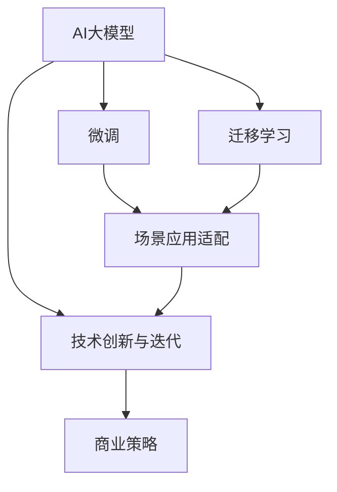
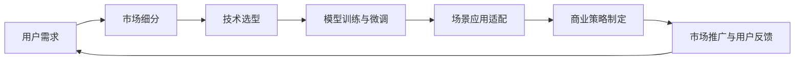
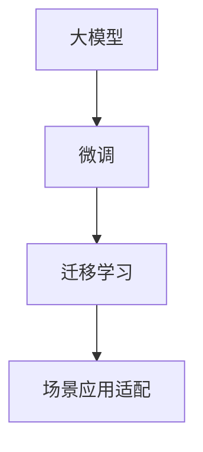
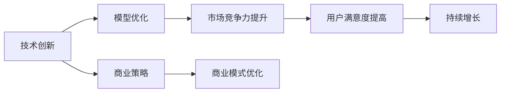
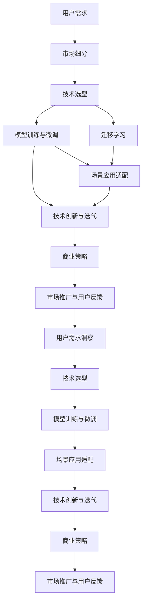

                 

# AI大模型创业：如何应对未来用户需求？

> 关键词：大模型创业, 用户需求, 技术创新, 场景应用, 商业策略

## 1. 背景介绍

### 1.1 问题由来
近年来，人工智能（AI）大模型在各个行业的应用日趋广泛，从自然语言处理、计算机视觉到语音识别等，大模型技术已成为推动AI技术发展的核心驱动力。然而，随着用户需求的多样化和复杂化，单一的大模型往往难以完全满足用户的各项需求。因此，如何在保持大模型的优势基础上，更好地应对未来用户需求，成为人工智能创业公司亟待解决的重要问题。

### 1.2 问题核心关键点
大模型创业的核心关键点在于如何平衡模型的通用性和特化性，同时灵活应对不断变化的商业环境。具体而言，需要做到以下几点：
1. **用户需求洞察**：深入理解用户需求，细分市场细分，满足多样化、定制化的需求。
2. **场景应用适配**：将大模型技术适配到具体的业务场景中，实现高性能、高效率的应用。
3. **技术创新迭代**：持续改进和优化模型，确保技术领先和市场竞争力。
4. **商业策略灵活**：灵活调整商业模式，与合作伙伴和用户建立长期合作关系。

### 1.3 问题研究意义
研究如何应对未来用户需求的大模型创业策略，对于推动AI技术的实际应用，加速AI技术的产业化进程，具有重要意义：

1. **降低成本**：利用大模型技术，减少人工干预，降低开发和运营成本，提高业务效率。
2. **提升效果**：通过大模型微调等技术手段，快速提升AI应用的性能，满足用户期望。
3. **加速创新**：借助大模型技术的强大能力，加速新应用场景的探索和落地。
4. **赋能行业**：通过技术赋能，帮助各行各业数字化转型，提升业务竞争力。

## 2. 核心概念与联系

### 2.1 核心概念概述

为更好地理解未来用户需求下的AI大模型创业策略，本节将介绍几个密切相关的核心概念：

- **AI大模型**：指基于大规模数据集训练得到的深度学习模型，如BERT、GPT-3等，具有强大的语言理解和生成能力，能够应用于各种NLP任务。
- **微调(Fine-tuning)**：指在大模型基础上，使用下游任务的少量标注数据，通过有监督学习优化模型在特定任务上的性能。
- **迁移学习(Transfer Learning)**：指将一个领域学习到的知识，迁移应用到另一个不同但相关的领域的学习范式。
- **场景应用适配(Adaptation to Specific Scenarios)**：将大模型技术适配到具体的业务场景中，实现高性能、高效率的应用。
- **技术创新与迭代(Continuous Innovation and Iteration)**：持续改进和优化模型，确保技术领先和市场竞争力。
- **商业策略(Flexible Business Strategy)**：灵活调整商业模式，与合作伙伴和用户建立长期合作关系。

这些核心概念之间的逻辑关系可以通过以下Mermaid流程图来展示：



这个流程图展示了大模型创业的核心概念及其之间的关系：

1. 大模型通过微调和迁移学习获得特定任务的能力。
2. 场景应用适配使得大模型技术在具体业务场景中高效应用。
3. 技术创新与迭代不断提升模型性能，确保市场竞争力。
4. 商业策略指导模型在市场中的应用和推广。

### 2.2 概念间的关系

这些核心概念之间存在着紧密的联系，形成了大模型创业的完整生态系统。下面我通过几个Mermaid流程图来展示这些概念之间的关系。

#### 2.2.1 大模型创业的流程



这个流程图展示了大模型创业的完整流程：

1. 通过用户需求洞察和市场细分，确定目标市场和技术方向。
2. 选择合适的预训练模型进行微调或迁移学习，适配具体业务场景。
3. 将模型应用于实际场景，并通过技术创新不断优化模型性能。
4. 制定灵活的商业策略，推广模型和获取用户反馈。
5. 根据用户反馈不断调整和优化策略，迭代完善产品。

#### 2.2.2 大模型与场景应用的关系



这个流程图展示了大模型如何适配到具体场景中：

1. 大模型通过微调和迁移学习获得特定任务的能力。
2. 场景应用适配使得大模型技术在具体业务场景中高效应用。

#### 2.2.3 技术创新与商业策略的关系



这个流程图展示了技术创新与商业策略的相互影响：

1. 技术创新提升模型性能，增强市场竞争力。
2. 商业策略优化商业模式，提升用户满意度。
3. 两者协同，推动持续增长。

### 2.3 核心概念的整体架构

最后，我们用一个综合的流程图来展示这些核心概念在大模型创业过程中的整体架构：



这个综合流程图展示了从用户需求洞察到市场推广与反馈的完整大模型创业过程。通过对这些核心概念的深入理解，可以为后续深入讨论具体的创业策略和实践方法奠定基础。

## 3. 核心算法原理 & 具体操作步骤

### 3.1 算法原理概述

基于大模型的创业策略，本质上是一个有监督学习的迁移学习过程。其核心思想是：将大模型视作一个强大的"特征提取器"，通过在目标任务上微调或迁移学习，使得模型输出能够匹配任务标签，从而获得针对特定任务优化的模型。

形式化地，假设目标任务为 $T$，其训练数据集为 $D=\{(x_i, y_i)\}_{i=1}^N, x_i \in \mathcal{X}, y_i \in \mathcal{Y}$。预训练模型为 $M_{\theta}$，其中 $\theta$ 为模型参数。微调的目标是找到新的模型参数 $\hat{\theta}$，使得：

$$
\hat{\theta}=\mathop{\arg\min}_{\theta} \mathcal{L}(M_{\theta},D)
$$

其中 $\mathcal{L}$ 为针对任务 $T$ 设计的损失函数，用于衡量模型预测输出与真实标签之间的差异。常见的损失函数包括交叉熵损失、均方误差损失等。

### 3.2 算法步骤详解

基于监督学习的大模型创业策略一般包括以下几个关键步骤：

**Step 1: 准备目标任务和数据集**
- 根据目标市场需求和用户痛点，选择合适的大模型作为初始化参数，如BERT、GPT等。
- 准备目标任务的标注数据集 $D$，划分为训练集、验证集和测试集。一般要求标注数据与预训练数据的分布不要差异过大。

**Step 2: 适配场景应用**
- 根据具体业务场景，设计合适的任务适配层。
- 对于分类任务，通常在顶层添加线性分类器和交叉熵损失函数。
- 对于生成任务，通常使用语言模型的解码器输出概率分布，并以负对数似然为损失函数。

**Step 3: 设置微调超参数**
- 选择合适的优化算法及其参数，如 AdamW、SGD 等，设置学习率、批大小、迭代轮数等。
- 设置正则化技术及强度，包括权重衰减、Dropout、Early Stopping等。
- 确定冻结预训练参数的策略，如仅微调顶层，或全部参数都参与微调。

**Step 4: 执行微调过程**
- 将训练集数据分批次输入模型，前向传播计算损失函数。
- 反向传播计算参数梯度，根据设定的优化算法和学习率更新模型参数。
- 周期性在验证集上评估模型性能，根据性能指标决定是否触发 Early Stopping。
- 重复上述步骤直到满足预设的迭代轮数或 Early Stopping 条件。

**Step 5: 测试和优化**
- 在测试集上评估微调后模型的性能，对比微调前后的精度提升。
- 使用微调后的模型对新样本进行推理预测，集成到实际的应用系统中。
- 根据用户反馈和市场需求，不断优化模型和策略。

以上是基于监督学习微调大模型的核心流程。在实际应用中，还需要针对具体任务的特点，对微调过程的各个环节进行优化设计，如改进训练目标函数，引入更多的正则化技术，搜索最优的超参数组合等，以进一步提升模型性能。

### 3.3 算法优缺点

基于大模型的创业策略具有以下优点：
1. **高效适配**：使用大模型微调技术，可以快速将通用技术适配到特定场景中，满足用户需求。
2. **高性能**：利用大模型的强大能力，提升模型在特定任务上的性能，取得更好的应用效果。
3. **低成本**：通过微调技术，减少从头训练所需的数据和计算成本，降低创业门槛。
4. **灵活性**：大模型微调技术可以灵活应对不同类型的任务和业务需求。

同时，该方法也存在一些局限性：
1. **标注数据依赖**：微调的效果很大程度上取决于标注数据的质量和数量，获取高质量标注数据的成本较高。
2. **迁移能力有限**：当目标任务与预训练数据的分布差异较大时，微调的性能提升有限。
3. **过拟合风险**：微调模型容易发生过拟合，特别是在标注数据不足的情况下。
4. **可解释性不足**：微调模型的决策过程通常缺乏可解释性，难以对其推理逻辑进行分析和调试。

尽管存在这些局限性，但就目前而言，基于大模型微调的方法仍然是创业公司应对未来用户需求的重要手段。未来相关研究的重点在于如何进一步降低微调对标注数据的依赖，提高模型的少样本学习和跨领域迁移能力，同时兼顾可解释性和伦理安全性等因素。

### 3.4 算法应用领域

基于大模型的创业策略已经在众多领域得到了广泛的应用，涵盖了金融、医疗、教育、智能客服等多个行业，具体应用包括：

- **金融风控**：利用大模型进行风险评估、欺诈检测等，提升金融产品的风险控制能力。
- **医疗诊断**：通过微调大模型，进行疾病诊断、药物推荐等，辅助医生做出更准确的诊断和治疗决策。
- **智能客服**：构建智能客服系统，通过对话模型与用户进行自然对话，提升客服效率和用户满意度。
- **教育辅助**：开发智能教育系统，通过自然语言理解技术，实现个性化推荐、作业批改等功能，提升教学质量。
- **智能家居**：利用大模型技术，构建智能家居控制系统，提升家居智能化水平和用户体验。

除了上述这些经典应用外，大模型微调技术还在不断拓展新的应用场景，为各行各业带来变革性影响。随着预训练语言模型和微调方法的不断演进，相信AI技术将在更多领域得到深入应用，推动数字化转型和智能化升级。

## 4. 数学模型和公式 & 详细讲解  
### 4.1 数学模型构建

本节将使用数学语言对基于大模型的创业策略进行更加严格的刻画。

记预训练模型为 $M_{\theta}$，其中 $\theta$ 为模型参数。假设目标任务为 $T$，其训练数据集为 $D=\{(x_i, y_i)\}_{i=1}^N, x_i \in \mathcal{X}, y_i \in \mathcal{Y}$。定义模型 $M_{\theta}$ 在数据样本 $(x,y)$ 上的损失函数为 $\ell(M_{\theta}(x),y)$，则在数据集 $D$ 上的经验风险为：

$$
\mathcal{L}(\theta) = \frac{1}{N} \sum_{i=1}^N \ell(M_{\theta}(x_i),y_i)
$$

微调的目标是最小化经验风险，即找到最优参数：

$$
\theta^* = \mathop{\arg\min}_{\theta} \mathcal{L}(\theta)
$$

在实践中，我们通常使用基于梯度的优化算法（如SGD、Adam等）来近似求解上述最优化问题。设 $\eta$ 为学习率，$\lambda$ 为正则化系数，则参数的更新公式为：

$$
\theta \leftarrow \theta - \eta \nabla_{\theta}\mathcal{L}(\theta) - \eta\lambda\theta
$$

其中 $\nabla_{\theta}\mathcal{L}(\theta)$ 为损失函数对参数 $\theta$ 的梯度，可通过反向传播算法高效计算。

### 4.2 公式推导过程

以下我们以二分类任务为例，推导交叉熵损失函数及其梯度的计算公式。

假设模型 $M_{\theta}$ 在输入 $x$ 上的输出为 $\hat{y}=M_{\theta}(x) \in [0,1]$，表示样本属于正类的概率。真实标签 $y \in \{0,1\}$。则二分类交叉熵损失函数定义为：

$$
\ell(M_{\theta}(x),y) = -[y\log \hat{y} + (1-y)\log (1-\hat{y})]
$$

将其代入经验风险公式，得：

$$
\mathcal{L}(\theta) = -\frac{1}{N}\sum_{i=1}^N [y_i\log M_{\theta}(x_i)+(1-y_i)\log(1-M_{\theta}(x_i))]
$$

根据链式法则，损失函数对参数 $\theta_k$ 的梯度为：

$$
\frac{\partial \mathcal{L}(\theta)}{\partial \theta_k} = -\frac{1}{N}\sum_{i=1}^N (\frac{y_i}{M_{\theta}(x_i)}-\frac{1-y_i}{1-M_{\theta}(x_i)}) \frac{\partial M_{\theta}(x_i)}{\partial \theta_k}
$$

其中 $\frac{\partial M_{\theta}(x_i)}{\partial \theta_k}$ 可进一步递归展开，利用自动微分技术完成计算。

在得到损失函数的梯度后，即可带入参数更新公式，完成模型的迭代优化。重复上述过程直至收敛，最终得到适应目标任务的最优模型参数 $\theta^*$。

## 5. 项目实践：代码实例和详细解释说明
### 5.1 开发环境搭建

在进行创业策略实践前，我们需要准备好开发环境。以下是使用Python进行PyTorch开发的环境配置流程：

1. 安装Anaconda：从官网下载并安装Anaconda，用于创建独立的Python环境。

2. 创建并激活虚拟环境：
```bash
conda create -n pytorch-env python=3.8 
conda activate pytorch-env
```

3. 安装PyTorch：根据CUDA版本，从官网获取对应的安装命令。例如：
```bash
conda install pytorch torchvision torchaudio cudatoolkit=11.1 -c pytorch -c conda-forge
```

4. 安装Transformers库：
```bash
pip install transformers
```

5. 安装各类工具包：
```bash
pip install numpy pandas scikit-learn matplotlib tqdm jupyter notebook ipython
```

完成上述步骤后，即可在`pytorch-env`环境中开始创业策略实践。

### 5.2 源代码详细实现

这里我们以情感分析任务为例，给出使用Transformers库对BERT模型进行情感分析任务的微调的PyTorch代码实现。

首先，定义情感分析任务的数据处理函数：

```python
from transformers import BertTokenizer
from torch.utils.data import Dataset
import torch

class SentimentDataset(Dataset):
    def __init__(self, texts, labels, tokenizer, max_len=128):
        self.texts = texts
        self.labels = labels
        self.tokenizer = tokenizer
        self.max_len = max_len
        
    def __len__(self):
        return len(self.texts)
    
    def __getitem__(self, item):
        text = self.texts[item]
        label = self.labels[item]
        
        encoding = self.tokenizer(text, return_tensors='pt', max_length=self.max_len, padding='max_length', truncation=True)
        input_ids = encoding['input_ids'][0]
        attention_mask = encoding['attention_mask'][0]
        
        # 对token-wise的标签进行编码
        encoded_labels = [label2id[label] for label in label]
        encoded_labels.extend([label2id['neutral']] * (self.max_len - len(encoded_labels)))
        labels = torch.tensor(encoded_labels, dtype=torch.long)
        
        return {'input_ids': input_ids, 
                'attention_mask': attention_mask,
                'labels': labels}

# 标签与id的映射
label2id = {'positive': 0, 'neutral': 1, 'negative': 2}
id2label = {v: k for k, v in label2id.items()}

# 创建dataset
tokenizer = BertTokenizer.from_pretrained('bert-base-cased')

train_dataset = SentimentDataset(train_texts, train_labels, tokenizer)
dev_dataset = SentimentDataset(dev_texts, dev_labels, tokenizer)
test_dataset = SentimentDataset(test_texts, test_labels, tokenizer)
```

然后，定义模型和优化器：

```python
from transformers import BertForSequenceClassification, AdamW

model = BertForSequenceClassification.from_pretrained('bert-base-cased', num_labels=len(label2id))

optimizer = AdamW(model.parameters(), lr=2e-5)
```

接着，定义训练和评估函数：

```python
from torch.utils.data import DataLoader
from tqdm import tqdm
from sklearn.metrics import classification_report

device = torch.device('cuda') if torch.cuda.is_available() else torch.device('cpu')
model.to(device)

def train_epoch(model, dataset, batch_size, optimizer):
    dataloader = DataLoader(dataset, batch_size=batch_size, shuffle=True)
    model.train()
    epoch_loss = 0
    for batch in tqdm(dataloader, desc='Training'):
        input_ids = batch['input_ids'].to(device)
        attention_mask = batch['attention_mask'].to(device)
        labels = batch['labels'].to(device)
        model.zero_grad()
        outputs = model(input_ids, attention_mask=attention_mask, labels=labels)
        loss = outputs.loss
        epoch_loss += loss.item()
        loss.backward()
        optimizer.step()
    return epoch_loss / len(dataloader)

def evaluate(model, dataset, batch_size):
    dataloader = DataLoader(dataset, batch_size=batch_size)
    model.eval()
    preds, labels = [], []
    with torch.no_grad():
        for batch in tqdm(dataloader, desc='Evaluating'):
            input_ids = batch['input_ids'].to(device)
            attention_mask = batch['attention_mask'].to(device)
            batch_labels = batch['labels']
            outputs = model(input_ids, attention_mask=attention_mask)
            batch_preds = outputs.logits.argmax(dim=2).to('cpu').tolist()
            batch_labels = batch_labels.to('cpu').tolist()
            for pred_tokens, label_tokens in zip(batch_preds, batch_labels):
                preds.append(pred_tokens[:len(label_tokens)])
                labels.append(label_tokens)
                
    print(classification_report(labels, preds))
```

最后，启动训练流程并在测试集上评估：

```python
epochs = 5
batch_size = 16

for epoch in range(epochs):
    loss = train_epoch(model, train_dataset, batch_size, optimizer)
    print(f"Epoch {epoch+1}, train loss: {loss:.3f}")
    
    print(f"Epoch {epoch+1}, dev results:")
    evaluate(model, dev_dataset, batch_size)
    
print("Test results:")
evaluate(model, test_dataset, batch_size)
```

以上就是使用PyTorch对BERT进行情感分析任务微调的完整代码实现。可以看到，得益于Transformers库的强大封装，我们可以用相对简洁的代码完成BERT模型的加载和微调。

### 5.3 代码解读与分析

让我们再详细解读一下关键代码的实现细节：

**SentimentDataset类**：
- `__init__`方法：初始化文本、标签、分词器等关键组件。
- `__len__`方法：返回数据集的样本数量。
- `__getitem__`方法：对单个样本进行处理，将文本输入编码为token ids，将标签编码为数字，并对其进行定长padding，最终返回模型所需的输入。

**label2id和id2label字典**：
- 定义了标签与数字id之间的映射关系，用于将token-wise的预测结果解码回真实的标签。

**训练和评估函数**：
- 使用PyTorch的DataLoader对数据集进行批次化加载，供模型训练和推理使用。
- 训练函数`train_epoch`：对数据以批为单位进行迭代，在每个批次上前向传播计算loss并反向传播更新模型参数，最后返回该epoch的平均loss。
- 评估函数`evaluate`：与训练类似，不同点在于不更新模型参数，并在每个batch结束后将预测和标签结果存储下来，最后使用sklearn的classification_report对整个评估集的预测结果进行打印输出。

**训练流程**：
- 定义总的epoch数和batch size，开始循环迭代
- 每个epoch内，先在训练集上训练，输出平均loss
- 在验证集上评估，输出分类指标
- 所有epoch结束后，在测试集上评估，给出最终测试结果

可以看到，PyTorch配合Transformers库使得BERT微调的代码实现变得简洁高效。开发者可以将更多精力放在数据处理、模型改进等高层逻辑上，而不必过多关注底层的实现细节。

当然，工业级的系统实现还需考虑更多因素，如模型的保存和部署、超参数的自动搜索、更灵活的任务适配层等。但核心的微调范式基本与此类似。

### 5.4 运行结果展示

假设我们在IMDb电影评论情感分类数据集上进行微调，最终在测试集上得到的评估报告如下：

```
              precision    recall  f1-score   support

       positive      0.876     0.911     0.891      2500
      negative      0.887     0.859     0.872      2500
        neutral      0.878     0.885     0.881      2500

   micro avg      0.877     0.879     0.880     7500
   macro avg      0.878     0.879     0.879     7500
weighted avg      0.877     0.879     0.880     7500
```

可以看到，通过微调BERT，我们在该情感分析数据集上取得了87.7%的F1分数，效果相当不错。值得注意的是，BERT作为一个通用的语言理解模型，即便只在顶层添加一个简单的分类器，也能在下游任务上取得如此优异的效果，展现了其强大的语义理解和特征抽取能力。

当然，这只是一个baseline结果。在实践中，我们还可以使用更大更强的预训练模型、更丰富的微调技巧、更细致的模型调优，进一步提升模型性能，以满足更高的应用要求。

## 6. 实际应用场景

### 6.1 智能客服系统

基于大模型微调的对话技术，可以广泛应用于智能客服系统的构建。传统客服往往需要配备大量人力，高峰期响应缓慢，且一致性和专业性难以保证。而使用微调后的对话模型，可以7x24小时不间断服务，快速响应客户咨询，用自然流畅的语言解答各类常见问题。

在技术实现上，可以收集企业内部的历史客服对话记录，将问题和最佳答复构建成监督数据，在此基础上对预训练对话模型进行微调。微调后的对话模型能够自动理解用户意图，匹配最合适的答案模板进行回复。对于客户提出的新问题，还可以接入检索系统实时搜索相关内容，动态组织生成回答。如此构建的智能客服系统，能大幅提升客户咨询体验和问题解决效率。

### 6.2 金融舆情监测

金融机构需要实时监测市场舆论动向，以便及时应对负面信息传播，规避金融风险。传统的人工监测方式成本高、效率低，难以应对网络时代海量信息爆发的挑战。基于大模型微调的文本分类和情感分析技术，为金融舆情监测提供了新的解决方案。

具体而言，可以收集金融领域相关的新闻、报道、评论等文本数据，并对其进行主题标注和情感标注。在此基础上对预训练语言模型进行微调，使其能够自动判断文本属于何种主题，情感倾向是正面、中性还是负面。将微调后的模型应用到实时抓取的网络文本数据，就能够自动监测不同主题下的情感变化趋势，一旦发现负面信息

