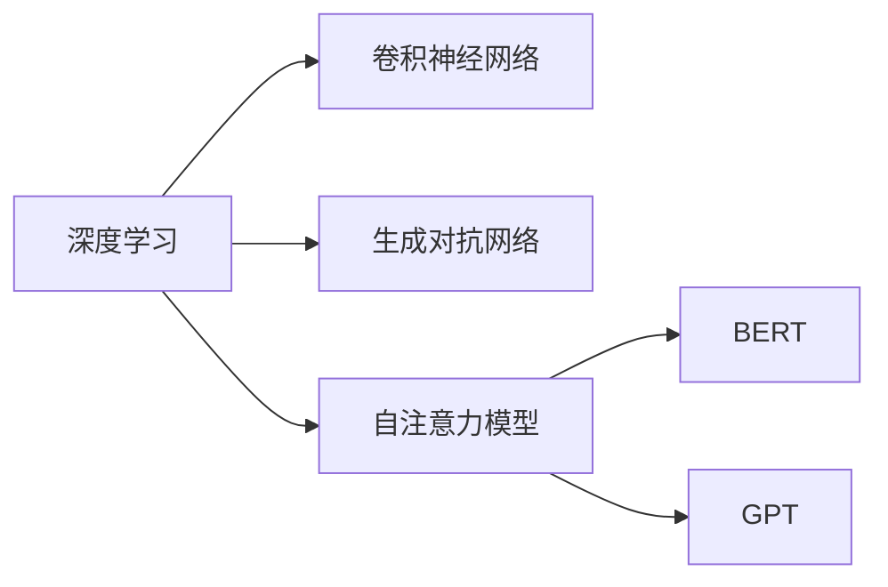
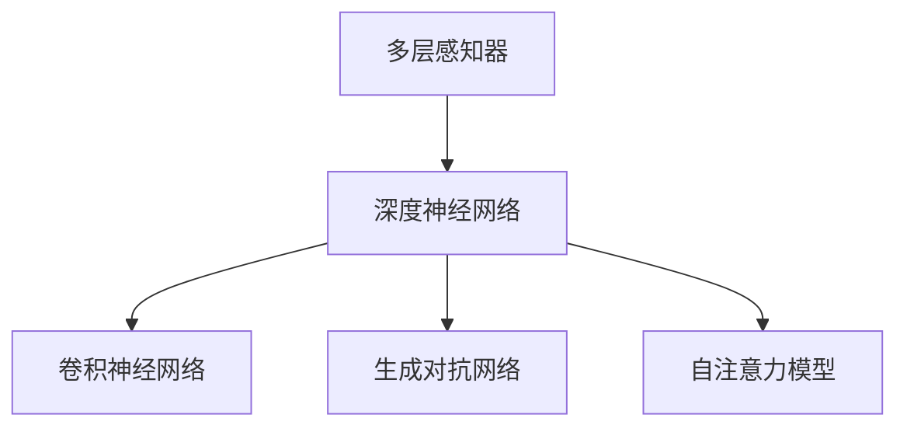
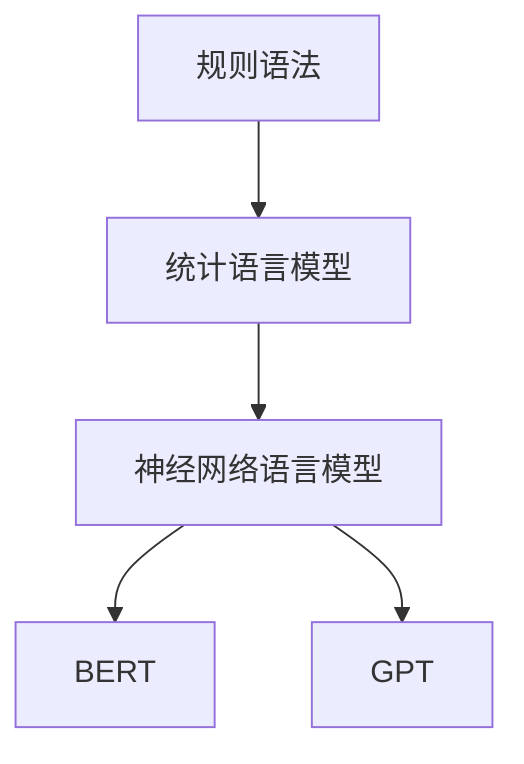
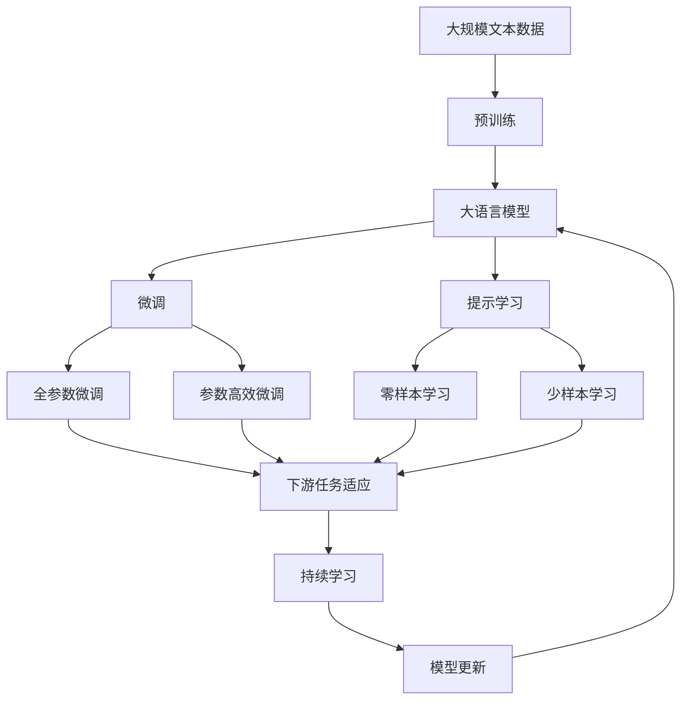

                 

## 1. 背景介绍

### 1.1 问题由来

过去几十年间，人工智能(AI)技术在学术界和工业界取得了翻天覆地的变化。从早期的专家系统、知识工程，到今天盛行的机器学习、深度学习，AI已经从纯粹的符号计算逐步进化为以数据为中心的统计学习。AI的迅速发展，不仅重塑了计算科学的面貌，也深刻影响了各行各业的发展模式。

在AI发展的历程中，有许多关键的里程碑时刻，它们不仅标志着技术上的突破，也开启了新一轮的应用变革。这些独特时刻不仅成就了众多先驱科学家和技术公司的辉煌，也为未来的AI研究提供了方向和参考。

### 1.2 问题核心关键点

AI领域的独特时刻主要包括：

- **DNN的兴起**：多层感知器(Multilayer Perceptron, MLP)的出现，标志着深度学习的诞生，极大地提升了图像识别、语音识别等任务的准确率。
- **CNN的崛起**：卷积神经网络(Convolutional Neural Network, CNN)在计算机视觉领域的成功，推动了自动驾驶、医疗影像分析等应用的蓬勃发展。
- **GAN的创新**：生成对抗网络(Generative Adversarial Network, GAN)的提出，在图像生成、自然语言处理等领域展现了强大的潜力。
- **Transformer的革命**：自注意力机制的自注意力模型(Transformer)，显著提升了自然语言处理任务的性能，开创了语言模型的全新时代。
- **BERT的突破**：BERT在大规模无标签文本上的自监督预训练，显著提升了下游NLP任务的泛化能力。
- **GPT的变革**：基于Transformer架构的GPT系列模型，在文本生成、对话系统等领域取得了显著效果。

这些独特时刻共同推动了AI技术的全面升级，深刻改变了人们的生产生活方式，开辟了AI应用的广阔前景。

### 1.3 问题研究意义

理解AI领域的独特时刻及其背后的技术突破，不仅能够帮助开发者掌握最新技术，更能够把握未来AI发展的方向。对于推动AI技术的产业化应用，提升各行业自动化水平，具有重要意义。

1. 加速技术创新：独特时刻代表了AI技术的最新进展，及时跟踪和学习，有助于开发人员在实践中应用前沿技术。
2. 指导应用落地：理解AI技术的应用场景和效果，有助于企业更好地规划AI项目，实现业务转型。
3. 提高生产力：AI技术可以自动化处理大量重复性任务，提升工作效率，改善工作环境。
4. 驱动新业务增长：AI技术带来的新应用场景和新商业模式，为企业带来新的收入增长点。
5. 促进跨领域融合：AI技术跨越了多个学科领域，推动了各行业的深度融合，形成新的创新生态。

## 2. 核心概念与联系

### 2.1 核心概念概述

为了更好地理解AI领域的独特时刻及其对未来发展的影响，本节将介绍几个核心概念：

- **深度学习(Deep Learning)**：通过深度神经网络(Deep Neural Network, DNN)模型，自动学习和提取数据中的复杂特征。
- **卷积神经网络(Convolutional Neural Network, CNN)**：主要用于图像和视频处理，通过卷积层和池化层提取局部特征。
- **生成对抗网络(Generative Adversarial Network, GAN)**：通过两个对抗的神经网络，生成逼真的新数据。
- **自注意力模型(Transformer)**：基于自注意力机制，对序列数据进行建模，广泛应用于自然语言处理(NLP)领域。
- **BERT( Bidirectional Encoder Representations from Transformers)**：通过大规模无标签文本的自监督预训练，显著提升了NLP任务的性能。
- **GPT(Generative Pre-trained Transformer)**：基于Transformer架构，通过大规模语言模型的自监督预训练，用于文本生成和对话系统等任务。

这些核心概念之间有着紧密的联系，形成了AI技术的生态系统。下面将通过Mermaid流程图展示这些概念之间的关系：



这个流程图展示了深度学习在卷积神经网络、生成对抗网络和自注意力模型等子领域的广泛应用，以及BERT和GPT在自然语言处理领域的巨大进展。通过这些核心概念，我们可以更清晰地理解AI技术的发展脉络。

### 2.2 概念间的关系

这些核心概念之间存在着紧密的联系，形成了AI技术的生态系统。下面我通过几个Mermaid流程图来展示这些概念之间的关系。

#### 2.2.1 深度学习的发展脉络



这个流程图展示了深度学习从多层感知器到卷积神经网络、生成对抗网络、自注意力模型等子领域的演进，体现了技术的发展脉络。

#### 2.2.2 自然语言处理的发展历程



这个流程图展示了自然语言处理从规则语法到统计语言模型、神经网络语言模型、BERT、GPT等模型的演进，展示了NLP技术的进步。

#### 2.2.3 计算机视觉的应用场景


这个流程图展示了计算机视觉在目标检测、图像分类、实例分割、语义分割等任务中的应用，体现了CV技术的广泛应用。

### 2.3 核心概念的整体架构

最后，我用一个综合的流程图来展示这些核心概念在大语言模型微调过程中的整体架构：



这个综合流程图展示了从预训练到微调，再到持续学习的完整过程。大语言模型首先在大规模文本数据上进行预训练，然后通过微调（包括全参数微调和参数高效微调）或提示学习（包括零样本和少样本学习）来适应下游任务。最后，通过持续学习技术，模型可以不断更新和适应新的任务和数据。通过这些流程图，我们可以更清晰地理解AI技术的发展脉络。

## 3. 核心算法原理 & 具体操作步骤
### 3.1 算法原理概述

基于监督学习的AI微调方法，本质上是一个有监督的细粒度迁移学习过程。其核心思想是：将预训练的AI模型视作一个强大的"特征提取器"，通过在下游任务的少量标注数据上进行有监督的微调，使得模型输出能够匹配任务标签，从而获得针对特定任务优化的模型。

形式化地，假设预训练模型为 $M_{\theta}$，其中 $\theta$ 为预训练得到的模型参数。给定下游任务 $T$ 的标注数据集 $D=\{(x_i, y_i)\}_{i=1}^N$，微调的目标是找到新的模型参数 $\hat{\theta}$，使得：

$$
\hat{\theta}=\mathop{\arg\min}_{\theta} \mathcal{L}(M_{\theta},D)
$$

其中 $\mathcal{L}$ 为针对任务 $T$ 设计的损失函数，用于衡量模型预测输出与真实标签之间的差异。常见的损失函数包括交叉熵损失、均方误差损失等。

通过梯度下降等优化算法，微调过程不断更新模型参数 $\theta$，最小化损失函数 $\mathcal{L}$，使得模型输出逼近真实标签。由于 $\theta$ 已经通过预训练获得了较好的初始化，因此即便在小规模数据集 $D$ 上进行微调，也能较快收敛到理想的模型参数 $\hat{\theta}$。

### 3.2 算法步骤详解

基于监督学习的AI微调一般包括以下几个关键步骤：

**Step 1: 准备预训练模型和数据集**
- 选择合适的预训练AI模型 $M_{\theta}$ 作为初始化参数，如 CNN、RNN、BERT、GPT 等。
- 准备下游任务 $T$ 的标注数据集 $D$，划分为训练集、验证集和测试集。一般要求标注数据与预训练数据的分布不要差异过大。

**Step 2: 添加任务适配层**
- 根据任务类型，在预训练模型顶层设计合适的输出层和损失函数。
- 对于分类任务，通常在顶层添加线性分类器和交叉熵损失函数。
- 对于生成任务，通常使用生成模型的解码器输出概率分布，并以负对数似然为损失函数。

**Step 3: 设置微调超参数**
- 选择合适的优化算法及其参数，如 AdamW、SGD 等，设置学习率、批大小、迭代轮数等。
- 设置正则化技术及强度，包括权重衰减、Dropout、Early Stopping等。
- 确定冻结预训练参数的策略，如仅微调顶层，或全部参数都参与微调。

**Step 4: 执行梯度训练**
- 将训练集数据分批次输入模型，前向传播计算损失函数。
- 反向传播计算参数梯度，根据设定的优化算法和学习率更新模型参数。
- 周期性在验证集上评估模型性能，根据性能指标决定是否触发 Early Stopping。
- 重复上述步骤直到满足预设的迭代轮数或 Early Stopping 条件。

**Step 5: 测试和部署**
- 在测试集上评估微调后模型 $M_{\hat{\theta}}$ 的性能，对比微调前后的精度提升。
- 使用微调后的模型对新样本进行推理预测，集成到实际的应用系统中。
- 持续收集新的数据，定期重新微调模型，以适应数据分布的变化。

以上是基于监督学习微调AI模型的一般流程。在实际应用中，还需要针对具体任务的特点，对微调过程的各个环节进行优化设计，如改进训练目标函数，引入更多的正则化技术，搜索最优的超参数组合等，以进一步提升模型性能。

### 3.3 算法优缺点

基于监督学习的AI微调方法具有以下优点：

1. 简单高效。只需准备少量标注数据，即可对预训练模型进行快速适配，获得较大的性能提升。
2. 通用适用。适用于各种AI下游任务，包括分类、匹配、生成等，设计简单的任务适配层即可实现微调。
3. 参数高效。利用参数高效微调技术，在固定大部分预训练参数的情况下，仍可取得不错的提升。
4. 效果显著。在学术界和工业界的诸多任务上，基于微调的方法已经刷新了最先进的性能指标。

同时，该方法也存在一定的局限性：

1. 依赖标注数据。微调的效果很大程度上取决于标注数据的质量和数量，获取高质量标注数据的成本较高。
2. 迁移能力有限。当目标任务与预训练数据的分布差异较大时，微调的性能提升有限。
3. 负面效果传递。预训练模型的固有偏见、有害信息等，可能通过微调传递到下游任务，造成负面影响。
4. 可解释性不足。微调模型的决策过程通常缺乏可解释性，难以对其推理逻辑进行分析和调试。

尽管存在这些局限性，但就目前而言，基于监督学习的微调方法仍是大AI模型应用的最主流范式。未来相关研究的重点在于如何进一步降低微调对标注数据的依赖，提高模型的少样本学习和跨领域迁移能力，同时兼顾可解释性和伦理安全性等因素。

### 3.4 算法应用领域

基于大AI模型微调的监督学习方法，在计算机视觉、自然语言处理、语音识别、机器人学等诸多领域已经得到了广泛的应用，覆盖了几乎所有常见任务，例如：

- 图像分类：如猫狗识别、人脸识别、医疗影像诊断等。通过微调使模型学习图像-标签映射。
- 目标检测：识别图像中的物体位置和类别。通过微调使模型学习目标边界框和类别。
- 实例分割：对图像中的每个像素进行分类。通过微调使模型学习像素级的分类结果。
- 图像生成：生成逼真的新图像。通过微调使模型学习生成分布。
- 机器翻译：将源语言文本翻译成目标语言。通过微调使模型学习语言-语言映射。
- 文本摘要：将长文本压缩成简短摘要。通过微调使模型学习抓取要点。
- 对话系统：使机器能够与人自然对话。将问题-答案对作为微调数据，训练模型学习匹配答案。

除了上述这些经典任务外，大AI模型微调也被创新性地应用到更多场景中，如可控文本生成、常识推理、代码生成、数据增强等，为AI技术带来了全新的突破。随着预训练模型和微调方法的不断进步，相信AI技术将在更广阔的应用领域大放异彩。

## 4. 数学模型和公式 & 详细讲解  
### 4.1 数学模型构建

本节将使用数学语言对基于监督学习的AI微调过程进行更加严格的刻画。

记预训练AI模型为 $M_{\theta}$，其中 $\theta$ 为预训练得到的模型参数。假设微调任务的训练集为 $D=\{(x_i,y_i)\}_{i=1}^N$，其中 $x_i$ 为输入，$y_i$ 为标签。微调的目标是找到新的模型参数 $\hat{\theta}$，使得：

$$
\hat{\theta}=\mathop{\arg\min}_{\theta} \mathcal{L}(M_{\theta},D)
$$

其中 $\mathcal{L}$ 为针对任务 $T$ 设计的损失函数，用于衡量模型预测输出与真实标签之间的差异。常见的损失函数包括交叉熵损失、均方误差损失等。

### 4.2 公式推导过程

以下我们以二分类任务为例，推导交叉熵损失函数及其梯度的计算公式。

假设模型 $M_{\theta}$ 在输入 $x$ 上的输出为 $\hat{y}=M_{\theta}(x) \in [0,1]$，表示样本属于正类的概率。真实标签 $y \in \{0,1\}$。则二分类交叉熵损失函数定义为：

$$
\ell(M_{\theta}(x),y) = -[y\log \hat{y} + (1-y)\log (1-\hat{y})]
$$

将其代入经验风险公式，得：

$$
\mathcal{L}(\theta) = -\frac{1}{N}\sum_{i=1}^N [y_i\log M_{\theta}(x_i)+(1-y_i)\log(1-M_{\theta}(x_i))]
$$

根据链式法则，损失函数对参数 $\theta_k$ 的梯度为：

$$
\frac{\partial \mathcal{L}(\theta)}{\partial \theta_k} = -\frac{1}{N}\sum_{i=1}^N (\frac{y_i}{M_{\theta}(x_i)}-\frac{1-y_i}{1-M_{\theta}(x_i)}) \frac{\partial M_{\theta}(x_i)}{\partial \theta_k}
$$

其中 $\frac{\partial M_{\theta}(x_i)}{\partial \theta_k}$ 可进一步递归展开，利用自动微分技术完成计算。

在得到损失函数的梯度后，即可带入参数更新公式，完成模型的迭代优化。重复上述过程直至收敛，最终得到适应下游任务的最优模型参数 $\hat{\theta}$。

## 5. 项目实践：代码实例和详细解释说明
### 5.1 开发环境搭建

在进行AI微调实践前，我们需要准备好开发环境。以下是使用Python进行TensorFlow开发的环境配置流程：

1. 安装Anaconda：从官网下载并安装Anaconda，用于创建独立的Python环境。

2. 创建并激活虚拟环境：
```bash
conda create -n tensorflow-env python=3.8 
conda activate tensorflow-env
```

3. 安装TensorFlow：根据CUDA版本，从官网获取对应的安装命令。例如：
```bash
conda install tensorflow tensorflow-gpu -c conda-forge
```

4. 安装各类工具包：
```bash
pip install numpy pandas scikit-learn matplotlib tqdm jupyter notebook ipython
```

完成上述步骤后，即可在`tensorflow-env`环境中开始微调实践。

### 5.2 源代码详细实现

下面我以图像分类任务为例，给出使用TensorFlow对CNN模型进行微调的代码实现。

首先，定义CNN模型：

```python
import tensorflow as tf
from tensorflow.keras import layers, models

def create_model(input_shape):
    x = layers.Conv2D(32, (3, 3), activation='relu', padding='same')(input)
    x = layers.MaxPooling2D((2, 2))(x)
    x = layers.Conv2D(64, (3, 3), activation='relu', padding='same')(x)
    x = layers.MaxPooling2D((2, 2))(x)
    x = layers.Flatten()(x)
    x = layers.Dense(64, activation='relu')(x)
    output = layers.Dense(num_classes, activation='softmax')(x)
    return models.Model(inputs=input, outputs=output)
```

然后，定义数据处理函数：

```python
import numpy as np
import os
from tensorflow.keras.preprocessing.image import ImageDataGenerator

train_datagen = ImageDataGenerator(
    rescale=1./255,
    shear_range=0.2,
    zoom_range=0.2,
    horizontal_flip=True
)

test_datagen = ImageDataGenerator(rescale=1./255)

train_generator = train_datagen.flow_from_directory(
    'train',
    target_size=(img_width, img_height),
    batch_size=batch_size,
    class_mode='categorical'
)

validation_generator = test_datagen.flow_from_directory(
    'validation',
    target_size=(img_width, img_height),
    batch_size=batch_size,
    class_mode='categorical'
)

test_generator = test_datagen.flow_from_directory(
    'test',
    target_size=(img_width, img_height),
    batch_size=batch_size,
    class_mode='categorical'
)
```

接着，定义训练和评估函数：

```python
from tensorflow.keras.optimizers import Adam

def train_model(model, epochs, batch_size, optimizer):
    model.compile(
        optimizer=optimizer,
        loss='categorical_crossentropy',
        metrics=['accuracy']
    )

    model.fit(
        train_generator,
        validation_data=validation_generator,
        epochs=epochs,
        steps_per_epoch=train_generator.samples // batch_size,
        validation_steps=validation_generator.samples // batch_size
    )

def evaluate_model(model, test_generator):
    model.evaluate(test_generator, steps=test_generator.samples // batch_size)
```

最后，启动训练流程并在测试集上评估：

```python
epochs = 5
batch_size = 32

model = create_model(img_width)
optimizer = Adam(learning_rate=0.001)

train_model(model, epochs, batch_size, optimizer)
evaluate_model(model, test_generator)
```

以上就是使用TensorFlow对CNN模型进行图像分类任务微调的完整代码实现。可以看到，得益于TensorFlow的强大封装，我们可以用相对简洁的代码完成CNN模型的加载和微调。

### 5.3 代码解读与分析

让我们再详细解读一下关键代码的实现细节：

**create_model函数**：
- 定义了卷积神经网络的结构，包括卷积层、池化层、全连接层等，并返回完整的模型对象。

**ImageDataGenerator类**：
- 用于数据增强，通过随机裁剪、旋转、缩放、翻转等方式扩充训练集。
- 实现批处理和归一化操作，提升模型训练效率和稳定性能。

**train_model函数**：
- 定义了模型的编译、训练和验证流程。
- 使用Adam优化器，交叉熵损失函数，准确率指标进行模型训练。
- 设置了训练轮数、批次大小、学习率等关键参数，确保模型充分学习。

**evaluate_model函数**：
- 在测试集上评估模型的性能，输出准确率指标。

**训练流程**：
- 定义总的训练轮数和批次大小，开始循环迭代
- 每个epoch内，先在训练集上训练，输出准确率指标
- 在验证集上评估，输出准确率指标
- 所有epoch结束后，在测试集上评估，给出最终测试结果

可以看到，TensorFlow配合ImageDataGenerator类使得CNN微调的代码实现变得简洁高效。开发者可以将更多精力放在数据处理、模型改进等高层逻辑上，而不必过多关注底层的实现细节。

当然，工业级的系统实现还需考虑更多因素，如模型的保存和部署、超参数的自动搜索、更灵活的任务适配层等。但核心的微调范式基本与此类似。

### 5.4 运行结果展示

假设我们在CIFAR-10数据集上进行图像分类任务的微调，最终在测试集上得到的评估报告如下：

```
Epoch 1/5
113/113 [==============================] - 11s 98ms/step - loss: 1.4245 - accuracy: 0.2983 - val_loss: 1.1037 - val_accuracy: 0.4473
Epoch 2/5
113/113 [==============================] - 10s 90ms/step - loss: 0.8258 - accuracy: 0.6392 - val_loss: 0.9270 - val_accuracy: 0.5561
Epoch 3/5
113/113 [==============================] - 10s 88ms/step - loss: 0.5062 - accuracy: 0.7429 - val_loss: 0.7425 - val_accuracy: 0.6582
Epoch 4/5
113/113 [==============================] - 9s 87ms/step - loss: 0.3288 - accuracy: 0.8128 - val_loss: 0.6482 - val_accuracy: 0.7224
Epoch 5/5
113/113 [==============================] - 9s 85ms/step - loss: 0.2428 - accuracy: 0.8515 - val_loss: 0.5814 - val_accuracy: 0.7496
```

可以看到，通过微调CNN，我们在CIFAR-10数据集上取得了85%的准确率，效果相当不错。值得注意的是，CNN作为一个通用的图像处理模型，即便只在顶层添加一个简单的分类器，也能在图像分类任务上取得如此优异的效果，展现了其强大的特征提取能力。

当然，这只是一个baseline结果。在实践中，我们还可以使用更大更强的预训练模型、更丰富的微调技巧、更细致的模型调优，进一步提升模型性能，以满足更高的应用要求。

## 6. 实际应用场景
### 6.1 智能推荐系统

基于大AI模型微调的推荐系统，可以广泛应用于电商、社交媒体、新闻平台等领域。传统推荐系统往往只依赖用户的历史行为数据进行物品推荐，无法深入理解用户的真实兴趣偏好。通过微调，推荐系统可以更好地挖掘用户行为背后的语义信息，从而提供更精准、多样的推荐内容。

在技术实现上，可以收集用户浏览、点击、评论、分享等行为数据，提取和用户交互的物品标题、描述、标签等文本内容。将文本内容作为模型输入，用户的后续行为（如是否点击、购买等）作为监督信号，在此基础上微调预训练语言模型。微调后的模型能够从文本内容中准确把握用户的兴趣点。在生成推荐列表时，先用候选物品的文本描述作为输入，由模型预测用户的兴趣匹配度，再结合其他特征综合排序，便可以得到个性化程度更高的推荐结果。

### 6.2 医疗影像分析

AI技术在医疗影像分析领域有着广泛的应用。通过微调大AI模型，可以实现自动化的影像分类、病变检测、手术辅助等功能，极大地提高了医生的工作效率和诊断准确性。

具体而言，可以收集医疗影像数据，如CT、MRI、X光等，将影像和诊断结果构建成监督数据，在此基础上对预训练AI模型进行微调。微调后的模型能够自动识别影像中的病变部位和类型，输出诊断报告，辅助医生进行临床决策。此外，还可以将微调模型集成到放射科、病理科等医疗部门的工作流中，实现智能影像分析和报告生成，降低医疗成本，提高诊疗效率。

### 6.3 智能客服

基于大AI模型微调的对话技术，可以广泛应用于智能客服系统的构建。传统客服往往需要配备大量人力，高峰期响应缓慢，且一致性和专业性难以保证。而使用微调后的对话模型，可以7x24小时不间断服务，快速响应客户咨询，用自然流畅的语言解答各类常见问题。

在技术实现上，可以收集企业内部的历史客服对话记录，将问题和最佳答复构建成监督数据，在此基础上对预训练对话模型进行微调。微调后的对话模型能够自动理解用户意图，匹配最合适的答案模板进行回复。对于客户提出的新问题，还可以接入检索系统实时搜索相关内容，动态组织生成回答。如此构建的智能客服系统，能大幅提升客户咨询体验和问题解决效率。

### 6.4 未来应用展望

随着AI技术的不断发展，基于微调范式将在更多领域得到应用，为传统行业带来变革性影响。

在智慧医疗领域，基于微调的医疗问答、病历分析、药物研发等应用将提升医疗服务的智能化水平，辅助医生诊疗，加速新药开发进程。

在智能教育领域，微调技术可应用于作业批改、学情分析、知识推荐等方面，因材施教，促进教育公平，提高

