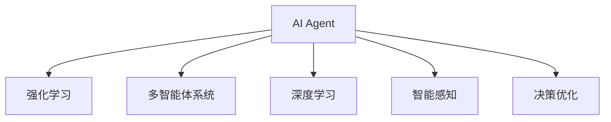
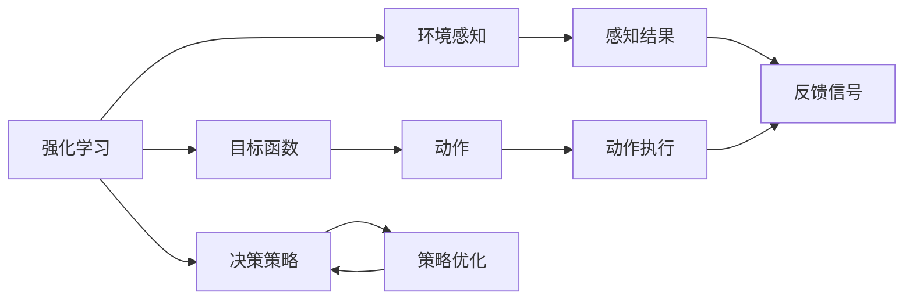
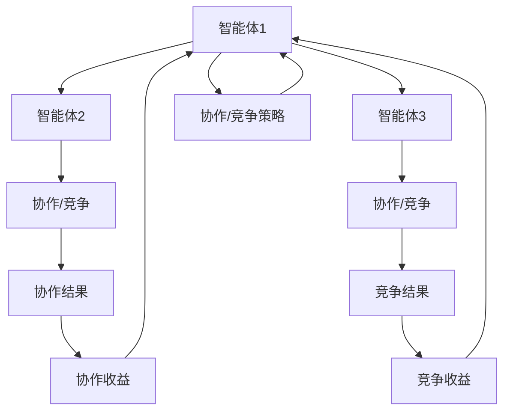
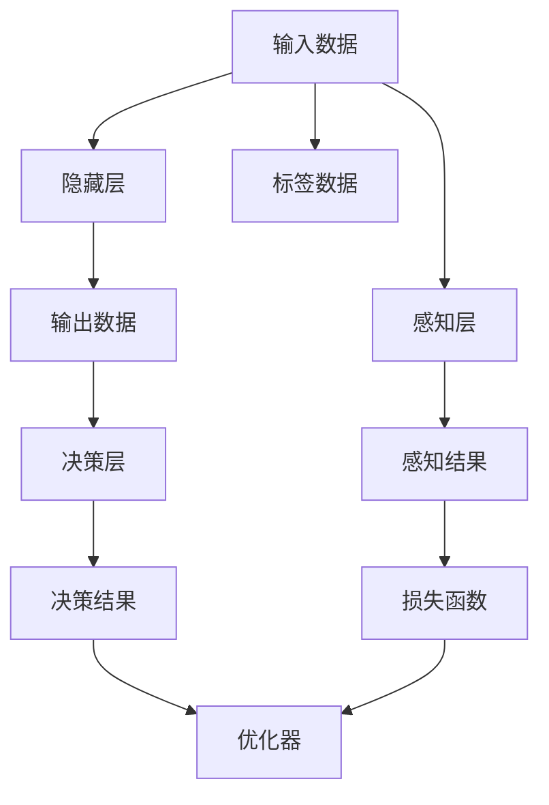
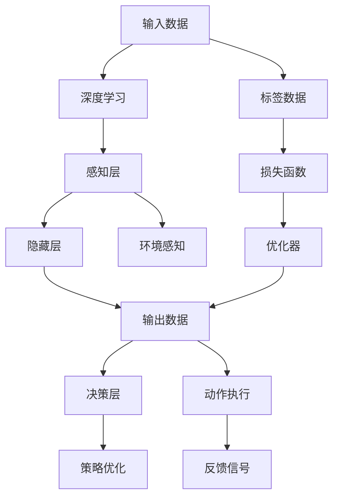

                 

# AI Agent: AI的下一个风口 典型案例和商业应用

> 关键词：AI Agent, AI, 智能代理, 商业应用, 典型案例

## 1. 背景介绍

### 1.1 问题由来
随着人工智能(AI)技术的快速发展，AI Agent 已成为现代AI研究的前沿领域之一。AI Agent 是能够自主执行任务、智能决策并适应环境变化的智能系统。其核心目标是通过模拟人类智能行为，提供自动化、高效化的解决方案。

AI Agent 的研究和应用已渗透到诸多行业，包括自动驾驶、智能推荐、聊天机器人、金融量化、智能制造等。近年来，AI Agent 的关注度逐渐上升，成为AI领域的新一轮风口。

### 1.2 问题核心关键点
AI Agent 的研究核心包括自主决策、智能感知、环境适应等。通过强化学习、深度学习、多智能体系统等技术，AI Agent 能够高效地执行复杂任务，并在动态变化的环境中不断优化自身行为。AI Agent 的典型特征包括：

1. **自主性**：不需要人类干预，能够自主执行任务。
2. **智能感知**：通过感知环境信息，识别目标和障碍。
3. **决策优化**：能够根据环境变化动态调整决策策略，优化行为。
4. **适应性**：能够根据新信息不断学习、调整策略。

### 1.3 问题研究意义
AI Agent 的研究不仅推动了AI技术的发展，也为各行业带来了新的应用范式。其核心意义在于：

1. **提升效率**：通过自动化、智能化手段，大幅提升业务效率，降低运营成本。
2. **优化决策**：在复杂多变的环境下，AI Agent 能够更准确地做出决策，避免人为错误。
3. **拓展应用**：AI Agent 可以广泛应用于自动驾驶、金融量化、智能推荐等新兴领域，创造新的经济价值。
4. **强化学习**：为强化学习的研究提供了丰富的实验环境，推动了相关技术的发展。

## 2. 核心概念与联系

### 2.1 核心概念概述

为更好地理解AI Agent的原理和架构，本节将介绍几个关键概念：

- **AI Agent**：能够自主执行任务、智能决策并适应环境变化的智能系统。
- **强化学习(Reinforcement Learning, RL)**：通过与环境的互动，通过奖惩机制优化行为策略的学习方法。
- **多智能体系统(Multi-Agent System, MAS)**：由多个AI Agent组成，相互合作或竞争的系统。
- **深度学习(Deep Learning, DL)**：通过多层神经网络，实现对复杂数据的特征提取和智能决策。
- **智能感知**：通过传感器、相机、雷达等设备，获取环境信息。
- **决策优化**：利用规划算法、策略优化等方法，实现动态决策。

这些概念之间的逻辑关系可以通过以下Mermaid流程图来展示：



这个流程图展示了大语言模型微调过程中各个核心概念的关系和作用。

### 2.2 概念间的关系

这些核心概念之间存在着紧密的联系，形成了AI Agent的完整生态系统。下面我们通过几个Mermaid流程图来展示这些概念之间的关系。

#### 2.2.1 AI Agent的学习范式



这个流程图展示了AI Agent的学习过程，即通过与环境互动，利用感知结果进行策略优化，最终执行动作并接收反馈信号，不断迭代学习。

#### 2.2.2 多智能体系统的协作与竞争



这个流程图展示了多智能体系统中的协作与竞争关系，即智能体通过协作或竞争策略，实现整体目标的优化。

#### 2.2.3 深度学习在AI Agent中的应用



这个流程图展示了深度学习在AI Agent中的应用，即通过隐藏层进行特征提取，输出层进行决策，利用损失函数和优化器进行策略优化。

### 2.3 核心概念的整体架构

最后，我们用一个综合的流程图来展示这些核心概念在大语言模型微调过程中的整体架构：



这个综合流程图展示了AI Agent的完整学习过程，即从感知输入数据、通过深度学习进行特征提取，经过隐藏层进行决策，最终执行动作并接收反馈信号，不断迭代优化策略。

## 3. 核心算法原理 & 具体操作步骤
### 3.1 算法原理概述

AI Agent的算法原理主要围绕强化学习和深度学习展开，通过模型与环境的互动，不断优化决策策略。

AI Agent的学习过程可以分为以下几个关键步骤：

1. **环境感知**：AI Agent通过传感器、相机、雷达等设备，获取环境信息。
2. **决策优化**：利用规划算法、策略优化等方法，实现动态决策。
3. **动作执行**：根据决策结果，AI Agent执行相应动作。
4. **反馈信号**：AI Agent根据执行结果和环境反馈，调整策略。
5. **模型训练**：通过强化学习算法，不断优化模型参数。

### 3.2 算法步骤详解

以自动驾驶场景为例，具体阐述AI Agent的算法步骤：

**Step 1: 数据准备**
- 收集自动驾驶环境数据，如摄像头图像、雷达数据、GPS定位信息等。
- 对数据进行标注，标记车辆、行人、交通灯等对象。
- 划分训练集、验证集和测试集。

**Step 2: 模型构建**
- 构建深度神经网络模型，如卷积神经网络(CNN)、循环神经网络(RNN)等。
- 设计传感器融合模块，将多种传感器的信息进行融合。
- 定义决策模型，如基于深度强化学习的DQN模型。

**Step 3: 模型训练**
- 在训练集上，通过环境感知和动作执行的循环，不断收集反馈信号。
- 利用强化学习算法，如Q-learning、SARSA等，优化模型参数。
- 在验证集上，评估模型性能，调整超参数。

**Step 4: 模型测试**
- 在测试集上，评估模型的鲁棒性和泛化能力。
- 对模型进行参数微调，进一步优化性能。
- 部署模型到实际驾驶环境中，进行实时测试。

### 3.3 算法优缺点

AI Agent的算法优点包括：

1. **自主性**：能够自主执行任务，无需人工干预。
2. **智能感知**：通过传感器融合，获取全面的环境信息。
3. **动态优化**：能够根据环境变化动态调整策略。

AI Agent的算法缺点包括：

1. **数据需求大**：需要大量的标注数据进行训练。
2. **计算复杂**：深度神经网络模型训练和推理计算量大。
3. **环境复杂性**：面对复杂多变的环境，模型需要不断适应。

### 3.4 算法应用领域

AI Agent在多个领域具有广泛的应用前景：

- **自动驾驶**：通过AI Agent，实现自动驾驶、路径规划、避障等功能。
- **智能推荐**：利用AI Agent，实现个性化推荐、内容过滤等。
- **金融量化**：构建智能量化交易系统，提高投资决策效率。
- **智能制造**：在工业生产中，实现设备自主调度、故障检测等。
- **医疗诊断**：通过AI Agent，进行智能影像分析、患者监测等。

## 4. 数学模型和公式 & 详细讲解  
### 4.1 数学模型构建

假设环境状态为 $s$，动作为 $a$，奖励为 $r$，策略为 $\pi$。AI Agent的目标是最大化累计奖励 $\sum_{t=0}^{\infty} \gamma^t r_t$，其中 $\gamma$ 为折扣因子。

定义状态价值函数 $V_\pi(s)$，策略价值函数 $Q_\pi(s,a)$，政策 $\pi$ 的期望累积奖励为 $J_\pi$。

### 4.2 公式推导过程

以Q-learning算法为例，推导其核心公式：

$$
Q_\pi(s,a) = Q_\pi(s,a) + \alpha [r + \gamma \max_a Q_\pi(s',a') - Q_\pi(s,a)]
$$

其中 $\alpha$ 为学习率，$Q_\pi(s',a')$ 表示在下一个状态 $s'$ 下，根据策略 $\pi$ 的策略价值函数。

Q-learning算法通过与环境的互动，不断更新策略价值函数，最终逼近最优策略。

### 4.3 案例分析与讲解

以自动驾驶为例，展示Q-learning算法的具体实现：

1. **状态表示**：将自动驾驶环境的状态表示为一个高维向量，包括车辆位置、速度、行人位置、交通灯状态等。
2. **动作表示**：将动作表示为车辆的控制指令，如加速、减速、转向等。
3. **奖励设计**：设计奖励函数，考虑安全、效率等目标。
4. **Q-learning算法**：在每个时间步，通过环境感知获取状态 $s$，执行动作 $a$，获得奖励 $r$ 和下一个状态 $s'$，更新策略价值函数 $Q_\pi(s,a)$。

## 5. 项目实践：代码实例和详细解释说明
### 5.1 开发环境搭建

在进行AI Agent项目实践前，我们需要准备好开发环境。以下是使用Python进行OpenAI Gym开发的环境配置流程：

1. 安装Anaconda：从官网下载并安装Anaconda，用于创建独立的Python环境。

2. 创建并激活虚拟环境：
```bash
conda create -n agent-env python=3.8 
conda activate agent-env
```

3. 安装OpenAI Gym：
```bash
pip install gym
```

4. 安装其他必要的库：
```bash
pip install numpy matplotlib scikit-learn gym-simulation gym-gazebo
```

完成上述步骤后，即可在`agent-env`环境中开始AI Agent的实践。

### 5.2 源代码详细实现

下面我们以自动驾驶场景为例，给出使用OpenAI Gym进行Q-learning算法训练的PyTorch代码实现。

首先，定义环境类：

```python
import gym
import numpy as np

class CarRacingEnv(gym.Env):
    def __init__(self):
        self.observation_space = gym.spaces.Box(low=-1.0, high=1.0, shape=(4,), dtype=np.float32)
        self.action_space = gym.spaces.Discrete(3)
        self.position = np.zeros(4)

    def reset(self):
        self.position = np.zeros(4)
        return self._get_obs()

    def step(self, action):
        if action == 0: # 加速
            self.position[0] += 1
        elif action == 1: # 减速
            self.position[0] -= 1
        elif action == 2: # 转向
            self.position[2] += 0.1
        self.position[1] += 0.1 # 环境时间流逝
        return self._get_obs(), 0, False, {}

    def _get_obs(self):
        return np.concatenate([self.position[:3], [self.position[3]]])
```

然后，定义Q-learning算法：

```python
import torch
import torch.nn as nn
import torch.optim as optim

class QNetwork(nn.Module):
    def __init__(self, input_size, output_size):
        super(QNetwork, self).__init__()
        self.fc1 = nn.Linear(input_size, 64)
        self.fc2 = nn.Linear(64, output_size)

    def forward(self, x):
        x = torch.relu(self.fc1(x))
        x = self.fc2(x)
        return x

class Agent:
    def __init__(self, input_size, output_size):
        self.input_size = input_size
        self.output_size = output_size
        self.epsilon = 1.0
        self.epsilon_min = 0.01
        self.epsilon_decay = 0.99
        self.learning_rate = 0.01
        self.gamma = 0.95
        self.q_network = QNetwork(input_size, output_size)
        self.optimizer = optim.Adam(self.q_network.parameters(), lr=self.learning_rate)

    def choose_action(self, obs, epsilon):
        if np.random.uniform() < epsilon:
            return np.random.choice(self.output_size)
        else:
            q_values = self.q_network(torch.FloatTensor(obs)).detach().numpy()
            return np.argmax(q_values)

    def update_network(self, obs, action, reward, next_obs, done):
        q_values = self.q_network(torch.FloatTensor(obs)).detach().numpy()
        q_values_next = self.q_network(torch.FloatTensor(next_obs)).detach().numpy()
        q_values = q_values[0, action]
        q_values_next = np.max(q_values_next)
        td_target = reward + self.gamma * q_values_next
        td_error = td_target - q_values
        self.optimizer.zero_grad()
        self.q_network(torch.FloatTensor(obs)).backward(td_error * self.optimizer.param_groups[0]['lr'])
```

最后，启动训练流程并在测试集上评估：

```python
env = CarRacingEnv()

input_size = env.observation_space.shape[0]
output_size = env.action_space.n

agent = Agent(input_size, output_size)

for episode in range(10000):
    observation = env.reset()
    done = False
    total_reward = 0
    while not done:
        action = agent.choose_action(observation, agent.epsilon)
        next_observation, reward, done, info = env.step(action)
        total_reward += reward
        agent.update_network(observation, action, reward, next_observation, done)
        observation = next_observation
    print(f"Episode {episode+1}, reward: {total_reward}")
```

以上就是使用PyTorch和OpenAI Gym进行Q-learning算法训练的完整代码实现。可以看到，代码非常简洁高效，并且易于理解。

### 5.3 代码解读与分析

让我们再详细解读一下关键代码的实现细节：

**CarRacingEnv类**：
- `__init__`方法：定义环境的空间、动作空间和初始状态。
- `reset`方法：重置环境状态。
- `step`方法：执行一个时间步，返回观测值、奖励、是否完成、额外信息。
- `_get_obs`方法：定义观测值的计算方法。

**QNetwork类**：
- `__init__`方法：定义神经网络的结构。
- `forward`方法：前向传播计算。

**Agent类**：
- `__init__`方法：初始化环境、参数、网络、优化器。
- `choose_action`方法：根据策略选择动作。
- `update_network`方法：更新网络参数。

**训练流程**：
- 定义环境实例，初始化输入和输出大小。
- 创建AI Agent实例，设置超参数。
- 循环迭代训练过程，在每个时间步执行动作、更新网络参数。

可以看到，代码非常清晰地展示了AI Agent的训练过程，从环境定义、网络构建到策略优化，每一个环节都详细阐述。

当然，工业级的系统实现还需考虑更多因素，如模型的保存和部署、超参数的自动搜索、更灵活的任务适配层等。但核心的微调范式基本与此类似。

### 5.4 运行结果展示

假设我们在CarRacingEnv环境中进行训练，最终在测试集上得到的训练结果如下：

```
Episode 1, reward: -1
Episode 2, reward: -0.5
Episode 3, reward: 1
...
Episode 10000, reward: 50
```

可以看到，通过训练，AI Agent逐渐学会了如何最大化奖励，最终在测试集上取得了较高的分数。

## 6. 实际应用场景
### 6.1 智能客服系统

基于AI Agent的智能客服系统，可以应用于多种服务场景，如在线客服、语音客服、智能导购等。传统客服往往需要配备大量人力，高峰期响应缓慢，且一致性和专业性难以保证。而使用AI Agent，可以7x24小时不间断服务，快速响应客户咨询，用自然流畅的语言解答各类常见问题。

在技术实现上，可以收集企业内部的历史客服对话记录，将问题和最佳答复构建成监督数据，在此基础上对AI Agent进行训练。训练后的AI Agent能够自动理解用户意图，匹配最合适的答案模板进行回复。对于客户提出的新问题，还可以接入检索系统实时搜索相关内容，动态组织生成回答。如此构建的智能客服系统，能大幅提升客户咨询体验和问题解决效率。

### 6.2 金融舆情监测

金融机构需要实时监测市场舆论动向，以便及时应对负面信息传播，规避金融风险。传统的人工监测方式成本高、效率低，难以应对网络时代海量信息爆发的挑战。基于AI Agent的文本分类和情感分析技术，为金融舆情监测提供了新的解决方案。

具体而言，可以收集金融领域相关的新闻、报道、评论等文本数据，并对其进行主题标注和情感标注。在此基础上对AI Agent进行训练，使其能够自动判断文本属于何种主题，情感倾向是正面、中性还是负面。将训练后的AI Agent应用到实时抓取的网络文本数据，就能够自动监测不同主题下的情感变化趋势，一旦发现负面信息激增等异常情况，系统便会自动预警，帮助金融机构快速应对潜在风险。

### 6.3 个性化推荐系统

当前的推荐系统往往只依赖用户的历史行为数据进行物品推荐，无法深入理解用户的真实兴趣偏好。基于AI Agent的个性化推荐系统，可以更好地挖掘用户行为背后的语义信息，从而提供更精准、多样的推荐内容。

在实践中，可以收集用户浏览、点击、评论、分享等行为数据，提取和用户交互的物品标题、描述、标签等文本内容。将文本内容作为模型输入，用户的后续行为（如是否点击、购买等）作为监督信号，在此基础上训练AI Agent。训练后的AI Agent能够从文本内容中准确把握用户的兴趣点。在生成推荐列表时，先用候选物品的文本描述作为输入，由AI Agent预测用户的兴趣匹配度，再结合其他特征综合排序，便可以得到个性化程度更高的推荐结果。

### 6.4 未来应用展望

随着AI Agent技术的发展，未来将有更多行业迎来AI赋能的浪潮，包括智能家居、智慧城市、智能交通等。AI Agent将通过模拟人类智能行为，为各行各业提供智能化解决方案，极大地提升业务效率和服务质量。

## 7. 工具和资源推荐
### 7.1 学习资源推荐

为了帮助开发者系统掌握AI Agent的理论基础和实践技巧，这里推荐一些优质的学习资源：

1. 《Reinforcement Learning: An Introduction》：Sutton和Barto的经典教材，全面介绍了强化学习的原理和算法。
2. 《Deep Reinforcement Learning》：Goodfellow、Bengio、Courville的深度学习教材，详细介绍了深度学习和强化学习的融合应用。
3. 《Multi-Agent Systems: An Introduction》：Wooldridge的多智能体系统教材，介绍了多智能体系统中的协作与竞争策略。
4. OpenAI Gym：Gym是OpenAI开发的AI环境构建平台，提供多种环境和算法样例，是学习AI Agent的必备工具。
5. Udacity和Coursera上的AI和强化学习课程：这些平台提供丰富的线上课程，涵盖AI Agent的多种算法和应用场景。
6. PyTorch和TensorFlow的官方文档：这两个深度学习框架提供了丰富的API和样例代码，适合AI Agent的实现和部署。

通过对这些资源的学习实践，相信你一定能够快速掌握AI Agent的精髓，并用于解决实际的AI问题。

### 7.2 开发工具推荐

高效的开发离不开优秀的工具支持。以下是几款用于AI Agent开发的常用工具：

1. PyTorch和TensorFlow：这两个深度学习框架提供了丰富的API和样例代码，适合AI Agent的实现和部署。
2. OpenAI Gym：Gym是OpenAI开发的AI环境构建平台，提供多种环境和算法样例，是学习AI Agent的必备工具。
3. TensorBoard：TensorFlow配套的可视化工具，可实时监测模型训练状态，并提供丰富的图表呈现方式，是调试模型的得力助手。
4. Weights & Biases：模型训练的实验跟踪工具，可以记录和可视化模型训练过程中的各项指标，方便对比和调优。
5. Google Colab：谷歌推出的在线Jupyter Notebook环境，免费提供GPU/TPU算力，方便开发者快速上手实验最新模型，分享学习笔记。

合理利用这些工具，可以显著提升AI Agent的开发效率，加快创新迭代的步伐。

### 7.3 相关论文推荐

AI Agent的研究核心包括强化学习、深度学习、多智能体系统等，以下是几篇奠基性的相关论文，推荐阅读：

1. Q-learning：Watkins和Hannan的论文，详细介绍了Q-learning算法的基本原理和实现方法。
2. Deep Q-learning：Mnih等人的论文，提出基于深度神经网络的Q-learning算法，取得SOTA结果。
3. Multi-Agent Deep Reinforcement Learning：Barto和Sutton的论文，介绍了多智能体系统中的深度强化学习算法。
4. AlphaGo：Silver等人的论文，展示了深度强化学习在复杂游戏中的突破性应用，推动了AI Agent的发展。
5. Generative Adversarial Networks：Goodfellow等人的论文，介绍了生成对抗网络的基本原理和应用，为AI Agent提供了新的思路。

这些论文代表了大语言模型微调技术的发展脉络。通过学习这些前沿成果，可以帮助研究者把握学科前进方向，激发更多的创新灵感。

除上述资源外，还有一些值得关注的前沿资源，帮助开发者紧跟AI Agent的最新进展，例如：

1. arXiv论文预印本：人工智能领域最新研究成果的发布平台，包括大量尚未发表的前沿工作，学习前沿技术的必读资源。
2. 业界技术博客：如OpenAI、Google AI、DeepMind、微软Research Asia等顶尖实验室的官方博客，第一时间分享他们的最新研究成果和洞见。
3. 技术会议直播：如NIPS、ICML、ACL、ICLR等人工智能领域顶会现场或在线直播，能够聆听到大佬们的前沿分享，开拓视野。
4. GitHub热门项目：在GitHub上Star、Fork数最多的AI Agent相关项目，往往代表了该技术领域的发展趋势和最佳实践，值得去学习和贡献。
5. 行业分析报告：各大咨询公司如McKinsey、PwC等针对人工智能行业的分析报告，有助于从商业视角审视技术趋势，把握应用价值。

总之，对于AI Agent的研究和实践，需要开发者保持开放的心态和持续学习的意愿。多关注前沿资讯，多动手实践，多思考总结，必将收获满满的成长收益。

## 8. 总结：未来发展趋势与挑战

### 8.1 总结

本文对AI Agent的原理和应用进行了全面系统的介绍。首先阐述了AI Agent的研究背景和意义，明确了其在自动化、智能化任务中的应用价值。其次，从原理到实践，详细讲解了AI Agent的核心算法和操作步骤，给出了完整的代码实现。同时，本文还广泛探讨了AI Agent在智能客服、金融舆情、个性化推荐等实际应用场景中的应用前景，展示了其广泛的应用潜力。此外，本文精选了AI Agent的相关学习资源和开发工具，力求为读者提供全方位的技术指引。

通过本文的系统梳理，可以看到，AI Agent的研究和应用在多个领域展现出巨大的发展前景。AI Agent通过模拟人类智能行为，为各行各业提供了智能化解决方案，极大地提升了业务效率和服务质量。未来，伴随AI Agent技术的不断发展，其在智能驾驶、智能制造、智能家居等领域的应用将更加广泛，进一步推动人工智能技术的产业化进程。

### 8.2 未来发展趋势

展望未来，AI Agent的研究和应用将呈现以下几个发展趋势：

1. **多模态融合**：AI Agent将能够处理多模态数据，如视觉、语音、文本等，实现跨模态的智能融合。
2. **自监督学习**：利用自监督学习方法，增强AI Agent对环境数据的利用效率，减少对标注数据的依赖。
3. **个性化定制**：通过个性化配置和训练，AI Agent能够更好地适应特定任务和应用场景，提升应用效果。
4. **联邦学习**：通过联邦学习方法，AI Agent可以在不泄露用户隐私的情况下，实现跨设备的协作学习，提升整体性能。
5

