                 

# AI创业公司的组织架构优化设计

## 1. 背景介绍

### 1.1 问题由来

在人工智能技术的快速发展和应用场景的多样化需求下，越来越多的创业公司选择将AI作为其核心竞争力。然而，AI技术的开发和应用过程中，如何构建高效、灵活、可持续发展的组织架构，成为每个创业公司都需要认真思考的问题。

### 1.2 问题核心关键点

AI创业公司的组织架构设计，需要兼顾技术研发和业务应用的需求，既要确保技术的创新性和领先性，又要能够快速响应市场变化和客户需求。具体而言，核心关键点包括：

1. **技术创新与商业化平衡**：如何在技术创新和业务盈利之间找到平衡点。
2. **跨部门协作**：如何促进不同部门（如研发、产品、运营、市场等）之间的有效沟通和协作。
3. **人才管理**：如何吸引、培养和保留顶尖的AI技术人才和跨学科团队。
4. **文化建设**：如何营造开放、创新、协作的企业文化，促进员工的主动性和创造力。

## 2. 核心概念与联系

### 2.1 核心概念概述

为更好地理解AI创业公司的组织架构优化设计，本节将介绍几个密切相关的核心概念：

- **扁平化组织架构**：减少管理层级，缩短决策链，提高决策效率和灵活性。
- **矩阵式管理**：结合职能制和项目制的优点，使得员工同时归属多个团队，提高资源共享和跨部门协作效率。
- **敏捷开发**：通过短周期的迭代和持续集成，快速响应市场需求和用户反馈。
- **DevOps**：结合开发和运维的优势，实现持续交付和基础设施自动化，提高生产效率。
- **数据驱动决策**：利用数据分析和模型预测，指导业务决策，优化资源配置。

这些核心概念之间的逻辑关系可以通过以下Mermaid流程图来展示：

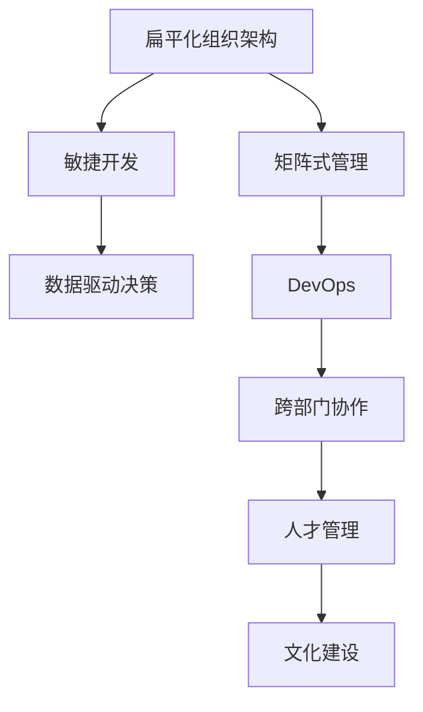

这个流程图展示了大规模语言模型微调过程中各个核心概念的关系和作用：

1. 扁平化组织架构减少了决策链，使得敏捷开发和DevOps能够更好地实践。
2. 敏捷开发与数据驱动决策结合，提高了项目效率和决策质量。
3. 跨部门协作通过矩阵式管理实现，增强了团队间的沟通和资源共享。
4. DevOps的实践进一步提升了生产效率，为数据驱动决策提供了坚实基础。
5. 人才管理和文化建设保证了团队的稳定和创造力，是敏捷和DevOps得以有效执行的保障。

### 2.2 概念间的关系

这些核心概念之间存在着紧密的联系，形成了AI创业公司组织架构优化的完整生态系统。下面我们通过几个Mermaid流程图来展示这些概念之间的关系。

#### 2.2.1 组织架构与敏捷开发

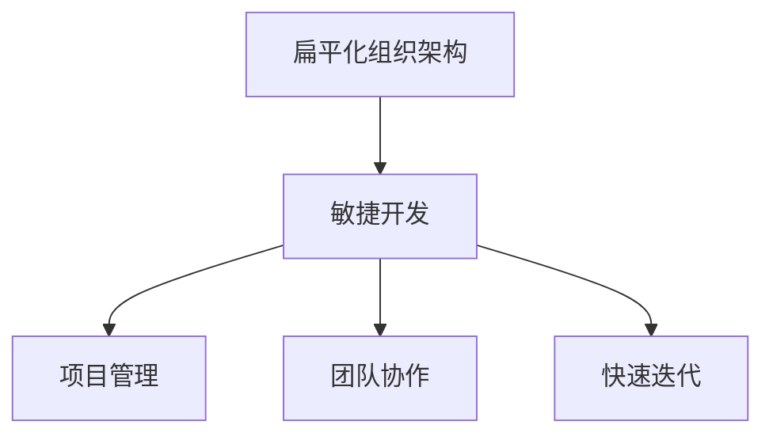

这个流程图展示了扁平化组织架构如何促进敏捷开发：

1. 扁平化的架构减少了层级，提高了信息传递的速度和准确性。
2. 敏捷开发通过项目管理、团队协作和快速迭代，保证了项目的灵活性和高效性。

#### 2.2.2 敏捷开发与DevOps

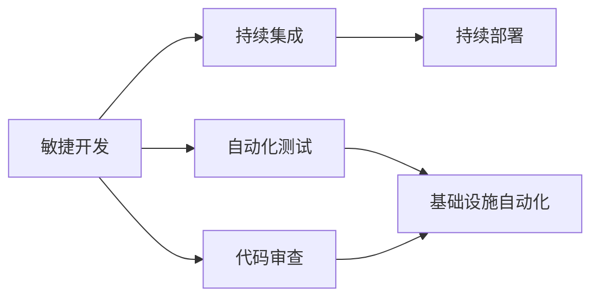

这个流程图展示了敏捷开发与DevOps的结合：

1. 敏捷开发中的持续集成和持续部署，与DevOps的理念不谋而合。
2. DevOps通过自动化测试、代码审查和基础设施自动化，进一步提升了项目的持续性和稳定性。

#### 2.2.3 数据驱动决策与敏捷开发

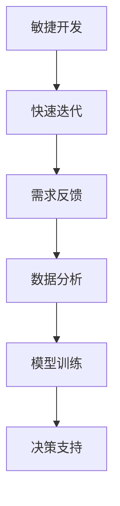

这个流程图展示了数据驱动决策如何与敏捷开发结合：

1. 敏捷开发中的快速迭代和需求反馈，为数据驱动决策提供了实时数据。
2. 数据分析和模型训练，为敏捷决策提供了科学依据。

#### 2.2.4 矩阵式管理与跨部门协作

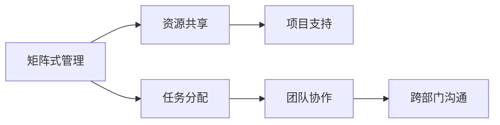

这个流程图展示了矩阵式管理如何促进跨部门协作：

1. 矩阵式管理使得员工同时归属多个团队，共享资源和知识。
2. 通过任务分配和团队协作，跨部门沟通更加高效。

#### 2.2.5 DevOps与数据驱动决策

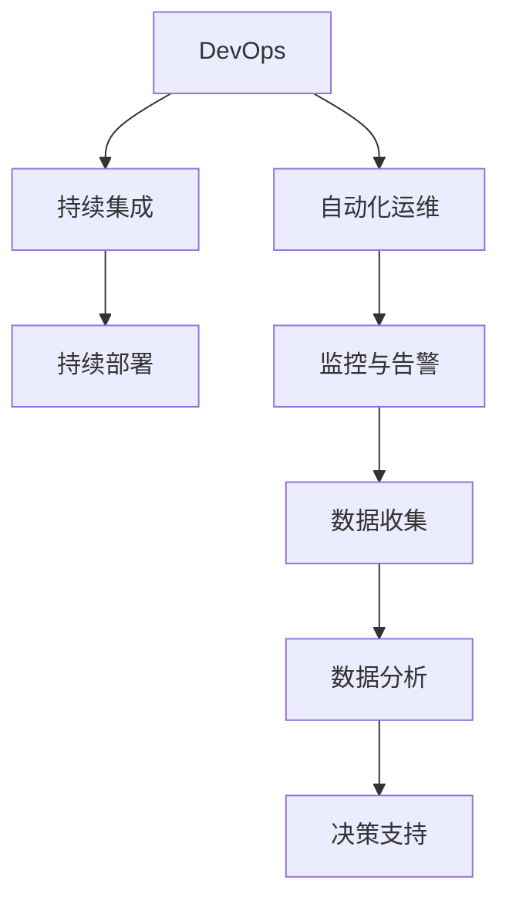

这个流程图展示了DevOps如何支持数据驱动决策：

1. DevOps通过持续集成和持续部署，确保了数据收集的实时性和全面性。
2. 自动化运维和监控告警，为数据分析提供了可靠的基础设施。

#### 2.2.6 人才管理与文化建设

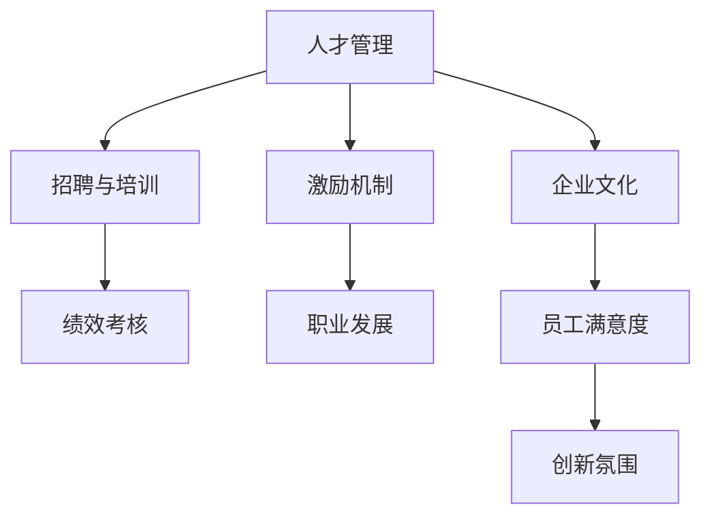

这个流程图展示了人才管理和文化建设之间的相互作用：

1. 人才管理通过招聘与培训、绩效考核、激励机制和职业发展，保证了团队的稳定性和创新力。
2. 企业文化通过员工满意度、创新氛围等指标，反哺人才管理的各个环节。

### 2.3 核心概念的整体架构

最后，我们用一个综合的流程图来展示这些核心概念在大规模语言模型微调过程中的整体架构：

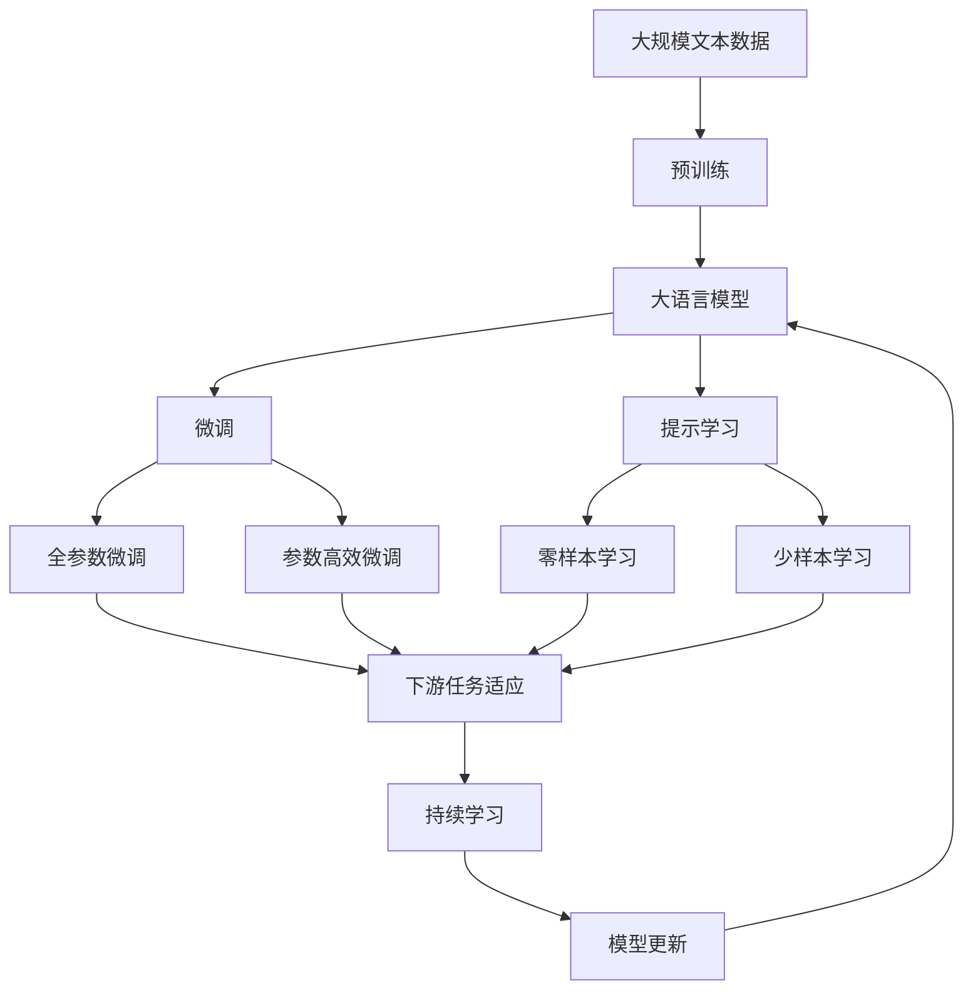

这个综合流程图展示了从预训练到微调，再到持续学习的完整过程。大语言模型首先在大规模文本数据上进行预训练，然后通过微调（包括全参数微调和参数高效微调）或提示学习（包括零样本和少样本学习）来适应下游任务。最后，通过持续学习技术，模型可以不断学习新知识，同时保持已学习的知识。 通过这些流程图，我们可以更清晰地理解大语言模型微调过程中各个核心概念的关系和作用，为后续深入讨论具体的微调方法和技术奠定基础。

## 3. 核心算法原理 & 具体操作步骤
### 3.1 算法原理概述

AI创业公司的组织架构优化设计，本质上是一个多维度、动态调整的过程。其核心思想是：通过合理的组织架构设计，促进团队协作、提高生产效率、激发员工创新，从而实现业务目标和技术创新的双重突破。

形式化地，假设目标组织架构为 $O=\{T_i, M_i, S_i, D_i\}_{i=1}^N$，其中 $T_i$ 表示第 $i$ 个团队，$M_i$ 表示第 $i$ 个项目，$S_i$ 表示第 $i$ 个管理层级，$D_i$ 表示第 $i$ 个管理域（如研发、产品、运营等）。组织架构优化的目标是最小化组织运行成本，同时最大化业务产出和技术创新的绩效，即：

$$
\min_{O} \sum_{i=1}^N C_i - \max_{O} P_i
$$

其中 $C_i$ 为第 $i$ 个管理层的运营成本，$P_i$ 为第 $i$ 个管理域的业务产出和技术创新的绩效。

通过梯度下降等优化算法，组织架构优化过程不断调整管理层级、团队结构、项目分配等参数，最小化运营成本，最大化业务产出和技术创新的绩效。由于目标函数复杂多变，需要通过多轮迭代求解，直至收敛。

### 3.2 算法步骤详解

AI创业公司的组织架构优化一般包括以下几个关键步骤：

**Step 1: 需求分析与目标设定**
- 明确公司的业务目标和技术目标，分析当前组织架构的优势和劣势。
- 设定组织架构优化的主要指标，如项目交付时间、客户满意度、技术创新速度等。

**Step 2: 组织结构设计**
- 确定扁平化、矩阵式、功能型、事业部型等基本组织结构。
- 根据公司的规模、业务复杂度、技术需求等，选择合适的组织结构。
- 设计合理的管理层级和团队结构，确保信息传递和决策效率。

**Step 3: 项目管理与任务分配**
- 制定项目计划和任务分配，确保资源的合理配置。
- 采用敏捷开发、Scrum、Kanban等项目管理方法，提高项目的可控性和灵活性。
- 实施持续集成和持续部署，加快项目的迭代速度和交付效率。

**Step 4: 数据驱动决策与反馈机制**
- 建立数据收集和分析机制，利用数据分析和模型预测，指导业务决策。
- 引入实时监控和告警系统，及时发现和解决问题。
- 建立反馈机制，定期评估项目进展和员工满意度，不断优化组织架构。

**Step 5: DevOps实践与技术平台**
- 构建自动化运维和监控系统，保障项目的稳定性和连续性。
- 实现基础设施自动化，提升生产效率，降低运营成本。
- 引入DevOps文化，推动团队协作和知识共享。

**Step 6: 人才管理和文化建设**
- 制定招聘、培训、绩效考核、激励机制等人才管理政策。
- 建设开放、创新、协作的企业文化，激发员工的创新热情和创造力。
- 提供职业发展通道和培训机会，留住顶尖人才。

### 3.3 算法优缺点

AI创业公司的组织架构优化设计具有以下优点：

1. 灵活性高。组织架构设计可以根据业务需求和市场变化进行调整，保持高效和适应性。
2. 团队协作效率高。扁平化、矩阵式管理促进了跨部门协作，提高了资源共享和知识流动。
3. 技术创新力强。敏捷开发、DevOps实践和数据驱动决策，保证了项目的持续创新和技术领先。
4. 生产效率提升。持续集成、持续部署和自动化运维，提高了生产效率，降低了运营成本。
5. 人才吸引和保留。科学的人才管理和企业文化，有助于吸引和保留顶尖人才。

同时，该方法也存在一定的局限性：

1. 调整成本高。组织架构的调整往往涉及多方面利益的重新分配，可能面临组织内部的抵触情绪。
2. 数据质量和依赖性。数据驱动决策对数据质量和实时性的要求较高，数据不足或偏差可能影响决策效果。
3. 文化建设难度大。企业文化建设需要时间和耐心，短期内可能难以见效。
4. 管理复杂度高。扁平化管理可能带来信息过载和决策分散的问题，需要加强管理控制。

尽管存在这些局限性，但就目前而言，AI创业公司的组织架构优化设计仍是提升公司竞争力的重要手段。未来相关研究的重点在于如何进一步降低调整成本，提高数据质量和实时性，以及加强文化建设和团队管理，以更好地适应快速变化的市场环境。

### 3.4 算法应用领域

AI创业公司的组织架构优化设计，已经在多个领域得到广泛应用，例如：

- **金融科技**：通过敏捷开发和数据驱动决策，提高金融产品的创新速度和市场响应能力。
- **医疗健康**：采用扁平化管理和DevOps实践，提升医疗服务的智能化水平和数据安全性。
- **智能制造**：结合矩阵式管理和跨部门协作，提高生产效率和产品质量。
- **教育科技**：利用数据驱动决策和持续学习，提高教育资源的配置效率和教学质量。
- **智慧城市**：采用扁平化管理和DevOps实践，提升城市管理的智能化和自动化水平。

除了上述这些经典应用外，组织架构优化方法还在更多场景中得到创新性地应用，如电商、物流、交通等领域，为AI技术在垂直行业的落地应用提供了新的思路和方向。

## 4. 数学模型和公式 & 详细讲解 & 举例说明
### 4.1 数学模型构建

本节将使用数学语言对AI创业公司的组织架构优化设计进行更加严格的刻画。

假设目标组织架构为 $O=\{T_i, M_i, S_i, D_i\}_{i=1}^N$，其中 $T_i$ 表示第 $i$ 个团队，$M_i$ 表示第 $i$ 个项目，$S_i$ 表示第 $i$ 个管理层级，$D_i$ 表示第 $i$ 个管理域（如研发、产品、运营等）。组织架构优化的目标是最小化组织运行成本，同时最大化业务产出和技术创新的绩效，即：

$$
\min_{O} \sum_{i=1}^N C_i - \max_{O} P_i
$$

其中 $C_i$ 为第 $i$ 个管理层的运营成本，$P_i$ 为第 $i$ 个管理域的业务产出和技术创新的绩效。

在实践中，我们通常使用基于梯度的优化算法（如遗传算法、模拟退火、粒子群优化等）来近似求解上述最优化问题。设 $\eta$ 为优化算法的学习率，$\lambda$ 为正则化系数，则参数的更新公式为：

$$
O \leftarrow O - \eta \nabla_{O}\mathcal{L}(O) - \eta\lambda O
$$

其中 $\nabla_{O}\mathcal{L}(O)$ 为损失函数对组织架构的梯度，可通过反向传播算法高效计算。

### 4.2 公式推导过程

以下我们以敏捷开发和DevOps实践为例，推导相关数学模型和公式：

**敏捷开发与持续集成**

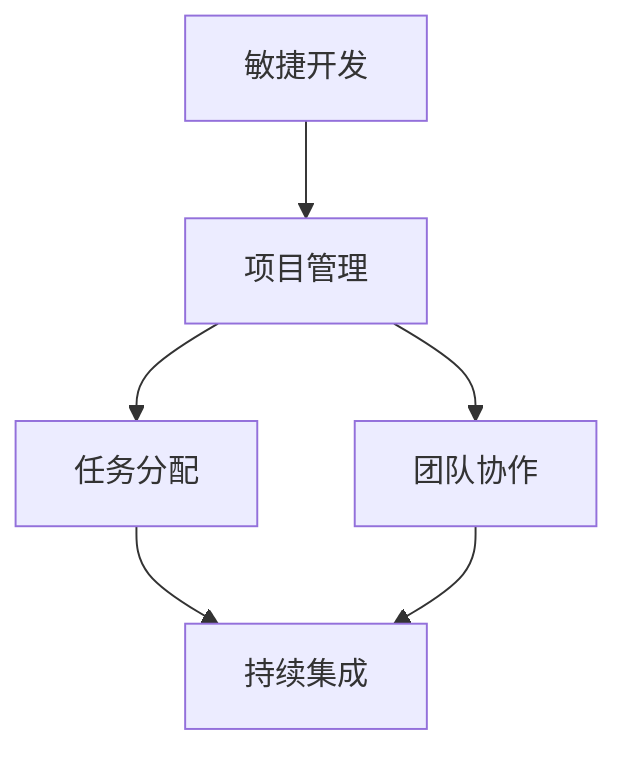

敏捷开发通过项目管理、任务分配和团队协作，提高了项目的可控性和灵活性。持续集成通过自动化测试和代码审查，保证了项目的质量和稳定性。因此，敏捷开发和持续集成的效果可以用如下公式表示：

$$
P_{敏捷} = \frac{敏捷项目数}{总项目数} \times \text{敏捷成功率}
$$

其中，敏捷成功率可以通过敏捷项目的交付时间、客户满意度等指标来衡量。

**DevOps与自动化运维**

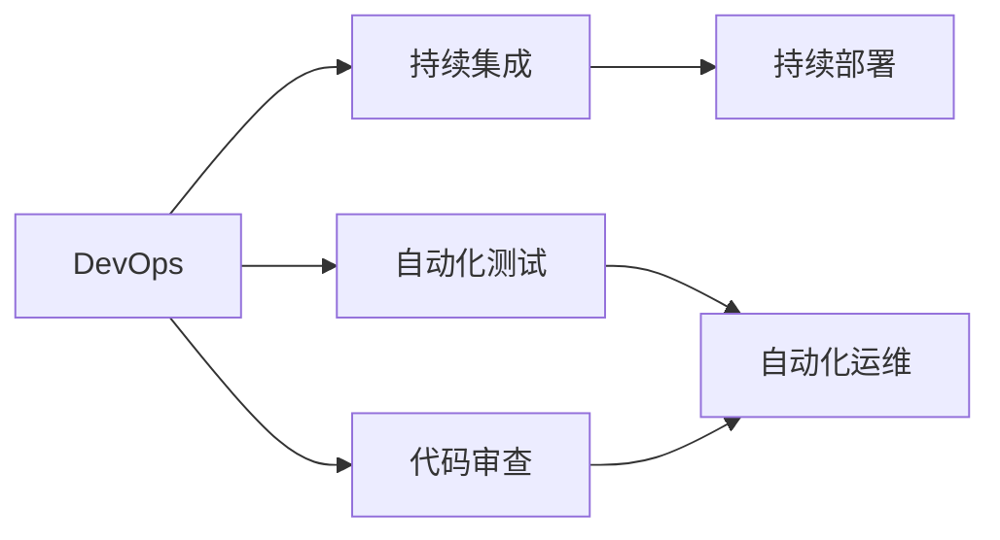

DevOps通过持续集成和持续部署，实现了项目的快速迭代和交付。自动化运维通过监控和告警系统，保障了项目的稳定性和连续性。因此，DevOps和自动化运维的效果可以用如下公式表示：

$$
P_{DevOps} = \frac{DevOps项目数}{总项目数} \times \text{DevOps成功率}
$$

其中，DevOps成功率可以通过项目的上线时间、生产故障次数等指标来衡量。

**综合绩效评估**

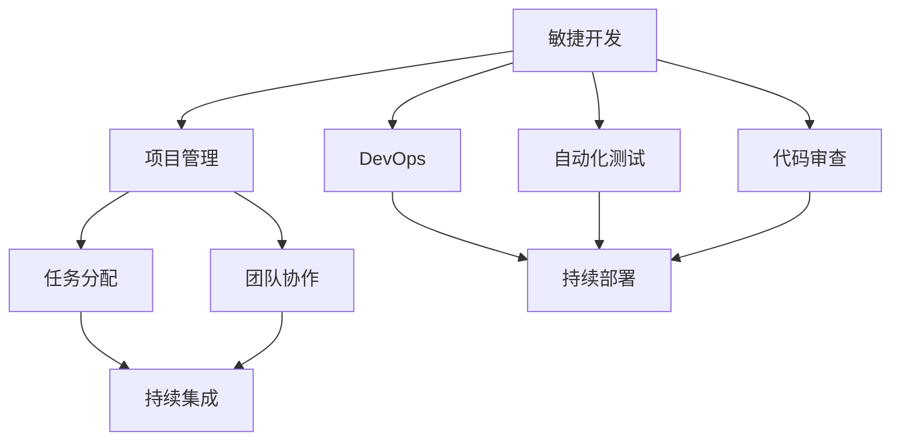

综合绩效评估通过敏捷开发和DevOps的各项指标，综合衡量项目的整体效果。可以用如下公式表示：

$$
P_{综合} = \frac{敏捷项目数 + DevOps项目数}{总项目数} \times \text{综合成功率}
$$

其中，综合成功率可以通过项目的交付时间、客户满意度、生产故障次数等综合指标来衡量。

### 4.3 案例分析与讲解

假设我们在某AI创业公司进行组织架构优化设计，具体步骤如下：

1. **需求分析与目标设定**：公司计划推出一款基于AI的智能客服产品，需要提升系统的敏捷开发和持续交付能力，同时确保系统的稳定性和安全性。

2. **组织结构设计**：采用扁平化管理和矩阵式结构，设立研发部、产品部、运维部等部门，确保各部门的紧密协作和资源共享。

3. **项目管理与任务分配**：采用敏捷开发方法（如Scrum），设立敏捷团队，定期召开Sprint回顾和计划会议，确保任务按时完成。引入持续集成和持续部署，确保代码的自动化测试和快速迭代。

4. **数据驱动决策与反馈机制**：建立数据收集和分析系统，利用实时监控和告警系统，及时发现和解决问题。引入反馈机制，定期评估项目进展和员工满意度，不断优化组织架构。

5. **DevOps实践与技术平台**：构建自动化运维和监控系统，保障项目的稳定性和连续性。实现基础设施自动化，提升生产效率，降低运营成本。引入DevOps文化，推动团队协作和知识共享。

6. **人才管理和文化建设**：制定招聘、培训、绩效考核、激励机制等人才管理政策。建设开放、创新、协作的企业文化，激发员工的创新热情和创造力。提供职业发展通道和培训机会，留住顶尖人才。

通过上述步骤，公司实现了敏捷开发和持续交付，显著提升了系统的稳定性和安全性。同时，通过数据驱动决策和反馈机制，不断优化组织架构和项目管理，提高了项目的整体效果和员工满意度。

## 5. 项目实践：代码实例和详细解释说明
### 5.1 开发环境搭建

在进行组织架构优化实践前，我们需要准备好开发环境。以下是使用Python进行PyTorch开发的环境配置流程：

1. 安装Anaconda：从官网下载并安装Anaconda，用于创建独立的Python环境。

2. 创建并激活虚拟环境：
```bash
conda create -n pytorch-env python=3.8 
conda activate pytorch-env
```

3. 安装PyTorch：根据CUDA版本，从官网获取对应的安装命令。例如：
```bash
conda install pytorch torchvision torchaudio cudatoolkit=11.1 -c pytorch -c conda-forge
```

4. 安装各类工具包：
```bash
pip install numpy pandas scikit-learn matplotlib tqdm jupyter notebook ipython
```

完成上述步骤后，即可在`pytorch-env`环境中开始组织架构优化实践。

### 5.2 源代码详细实现

这里我们以一个简化版的敏捷项目管理系统为例，展示如何使用Python实现敏捷开发和持续集成。

```python
from flask import Flask, request, jsonify
import time

app = Flask(__name__)

@app.route('/project', methods=['POST'])
def create_project():
    data = request.json
    project_name = data['name']
    team_name = data['team']
    start_date = data['start_date']
    end_date = data['end_date']
    
    # 将项目信息保存到数据库
    save_project(project_name, team_name, start_date, end_date)
    
    # 创建敏捷任务列表
    task_list = create_tasks(project_name, team_name)
    
    # 启动持续集成
    start_ci(project_name, task_list)
    
    return jsonify({'message': 'Project created successfully'}), 201

@app.route('/task', methods=['POST'])
def create_task():
    data = request.json
    project_name = data['project']
    task_name = data['name']
    assignee = data['assignee']
    due_date = data['due_date']
    
    # 将任务信息保存到数据库
    save_task(project_name, task_name, assignee, due_date)
    
    # 触发持续集成
    start_ci(project_name)
    
    return jsonify({'message': 'Task created successfully'}), 201

def save_project(project_name, team_name, start_date, end_date):
    # 保存到数据库
    pass

def save_task(project_name, task_name, assignee, due_date):
    # 保存到数据库
    pass

def create_tasks(project_name, team_name):
    # 创建任务列表
    pass

def start_ci(project_name, task_list=None):
    # 启动持续集成
    if task_list:
        for task in task_list:
            test_task(task)
            deploy_task(task)
    else:
        test_all_tasks()
        deploy_all_tasks()

def test_task(task):
    # 进行单元测试
    pass

def deploy_task(task):
    # 部署任务
    pass

def test_all_tasks():
    # 测试所有任务
    pass

def deploy_all_tasks():
    # 部署所有任务
    pass

@app.route('/task/log', methods=['GET'])
def get_task_log():
    task_id = request.args.get('id')
    log = get_task_log_by_id(task_id)
    return jsonify(log), 200

def get_task_log_by_id(task_id):
    # 获取任务日志
    pass

@app.route('/ci/log', methods=['GET'])
def get_ci_log():
    project_name = request.args.get('project')
    log = get_ci_log_by_project(project_name)
    return jsonify(log), 200

def get_ci_log_by_project(project_name):
    # 获取持续集成日志
    pass
```

以上代码实现了基本的敏捷项目管理功能，包括创建项目、创建任务、启动持续集成等。通过Flask框架，将上述功能封装为RESTful API接口，方便外部系统调用。

### 5.3 代码解读与分析

让我们再详细解读一下关键代码的实现细节：

**Flask框架**：
- Flask是Python的一个轻量级Web框架，支持快速搭建RESTful API接口。
- 通过装饰器`@app.route`，定义API接口的路径和请求方法。
- 使用`jsonify`函数返回JSON格式的数据。

**任务和项目管理**：
- 使用Python字典或数据库存储项目和任务信息。
- 创建任务列表时，可以调用外部接口或手动输入任务信息。
- 启动持续集成时，需要根据任务列表或所有任务进行测试和部署。

**持续集成**：
- 使用自定义函数`start_ci`启动持续集成流程。
- 根据任务列表，遍历任务并进行测试和部署。
- 测试任务时，调用`test_task`函数进行单元测试。
- 部署任务时，调用`deploy_task`函数进行代码部署。

**日志记录**：
- 使用自定义函数`get_task_log`和`get_ci_log`获取任务和持续集成日志。
- 日志记录可以存储在数据库或外部日志服务中，方便后续查询和分析。

通过上述代码，可以简单快速地搭建一个敏捷项目管理系统的原型，为后续组织架构优化实践提供基础支持。

## 6. 实际应用场景
### 6.1 智能客服系统

基于敏捷开发和DevOps的AI创业公司的组织架构优化设计，可以广泛应用于智能客服系统的构建。传统客服往往需要配备大量人力，高峰期响应缓慢，且一致性和专业性难以保证。而使用敏捷开发和DevOps实践，可以快速响应市场需求和客户需求，实现智能客服的快速迭代和稳定交付。

在技术实现上，可以采用扁平化管理和矩阵式结构，确保不同团队之间的紧密协作和资源共享。同时，引入持续集成和持续部署，加速新功能的开发和部署，提升客户满意度。引入数据驱动决策和反馈机制，实时监测系统性能和客户反馈，不断优化智能客服的功能和用户体验。

### 6.2 金融科技

AI创业公司的敏捷开发和DevOps实践，在金融科技领域同样具有广泛的应用前景。金融科技公司需要快速推出新金融产品，满足市场和客户的需求。通过敏捷开发和持续集成，金融科技公司可以实现新产品的快速迭代和交付，提升市场响应速度和客户满意度。

引入数据驱动决策和反馈机制，金融科技公司可以实时监测市场变化和客户行为，及时调整产品策略和运营方案。同时，通过DevOps实践，保障系统的稳定性和安全性，提升客户对新金融产品的信任度。

### 6.3 医疗健康

医疗健康领域，AI创业公司需要利用敏捷开发和DevOps实践，快速推出新医疗产品和服务，满足不断变化的健康需求。采用扁平化管理和矩阵式结构，确保不同团队之间的紧密协作和资源共享。引入持续集成和持续部署，加速新功能的开发和部署，提升医疗服务的智能化水平和数据安全性。

引入数据驱动决策和反馈机制，医疗健康公司可以实时监测患者数据和健康状况，及时调整医疗方案和健康策略。同时，通过DevOps实践，保障系统的稳定性和安全性，提升患者对新医疗产品的信任度。

### 6.4 未来应用展望

随着AI技术的不断进步和应用场景的日益多样化，基于敏捷开发和DevOps实践的组织架构优化方法将在更多领域得到应用，为传统行业带来变革性影响。

在智慧城市治理中，敏捷开发和DevOps实践可以提高城市管理的智能化和自动化水平，构建更安全、高效的未来城市。在企业生产、社会治理

