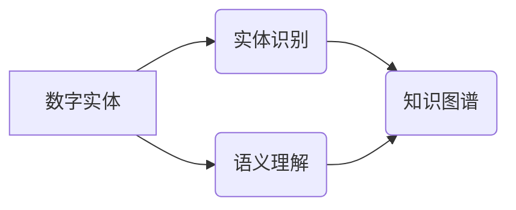

# 数字实体自动化的未来前景

> 关键词：数字实体，自动化，实体识别，语义理解，知识图谱，NLP，AI，智能应用

## 1. 背景介绍

随着互联网的普及和大数据技术的飞速发展，数据已经成为企业和社会的重要资产。在庞大的数据海洋中，数字实体作为承载着丰富信息的基本单元，其识别、理解和自动化处理的重要性日益凸显。数字实体自动化，即通过人工智能技术，对数字实体进行识别、分类、关联和分析，从而实现智能化数据处理和应用。本文将探讨数字实体自动化的核心概念、技术原理、应用场景及未来发展趋势。

### 1.1 问题的由来

在传统的数据处理方式中，数据往往以结构化数据为主，便于存储和查询。然而，随着非结构化数据的激增，如文本、图片、视频等，传统的数据处理方法已无法满足需求。数字实体自动化技术应运而生，旨在从非结构化数据中提取有价值的信息，为企业和用户提供智能化服务。

### 1.2 研究现状

近年来，数字实体自动化技术在实体识别、语义理解、知识图谱等领域取得了显著进展。以下是一些代表性的技术：

- **实体识别**：利用自然语言处理（NLP）技术，从文本中识别出命名实体，如人名、地名、组织名等。
- **语义理解**：通过理解文本的语义，将文本内容转化为计算机可理解的语义表示。
- **知识图谱**：构建实体之间的关系图谱，用于知识推理和知识检索。

### 1.3 研究意义

数字实体自动化技术具有重要的研究意义和应用价值：

- **提高数据处理效率**：自动化处理数字实体，降低人工成本，提高数据处理效率。
- **挖掘数据价值**：从海量数据中提取有价值的信息，为企业和用户提供决策支持。
- **推动智能化应用**：为智能客服、智能推荐、智能问答等应用提供技术支撑。

### 1.4 本文结构

本文将围绕以下内容展开：

- 介绍数字实体自动化的核心概念和原理。
- 详细讲解实体识别、语义理解和知识图谱等技术。
- 分析数字实体自动化的应用场景和案例。
- 探讨数字实体自动化的未来发展趋势与挑战。

## 2. 核心概念与联系

### 2.1 核心概念

#### 2.1.1 数字实体

数字实体是指具有特定属性和关系的实体，如人、地点、组织、事件等。在数字化时代，数字实体无处不在，是构建知识图谱、实现智能化应用的基础。

#### 2.1.2 实体识别

实体识别是从文本中识别出命名实体的过程，如人名、地名、组织名等。实体识别是数字实体自动化的重要基础。

#### 2.1.3 语义理解

语义理解是通过理解文本的语义，将文本内容转化为计算机可理解的语义表示。语义理解是数字实体自动化的核心。

#### 2.1.4 知识图谱

知识图谱是实体之间的关系图谱，用于知识推理和知识检索。知识图谱是数字实体自动化的重要应用。

### 2.2 核心概念联系

数字实体自动化技术涉及多个核心概念，它们之间存在着密切的联系：



如图所示，数字实体是数字实体自动化的起点，实体识别和语义理解是数字实体自动化的关键环节，而知识图谱则是数字实体自动化的最终目标。

## 3. 核心算法原理 & 具体操作步骤

### 3.1 算法原理概述

数字实体自动化技术主要涉及以下算法：

- **实体识别**：命名实体识别（NER）算法，如条件随机场（CRF）、支持向量机（SVM）、卷积神经网络（CNN）等。
- **语义理解**：词向量表示、依存句法分析、语义角色标注等。
- **知识图谱**：图数据库、图神经网络（GNN）等。

### 3.2 算法步骤详解

#### 3.2.1 实体识别

1. 数据预处理：对文本进行分词、去除停用词等操作。
2. 特征提取：使用词向量、词性标注、依存句法信息等特征。
3. 模型训练：选择合适的NER算法（如CRF、SVM、CNN等）进行模型训练。
4. 实体识别：使用训练好的模型对新的文本进行实体识别。

#### 3.2.2 语义理解

1. 词向量表示：将文本中的词语转化为词向量。
2. 依存句法分析：分析句子中词语之间的依存关系。
3. 语义角色标注：标注词语在句子中的语义角色。

#### 3.2.3 知识图谱构建

1. 实体抽取：从文本中抽取实体。
2. 关系抽取：从文本中抽取实体之间的关系。
3. 知识图谱构建：将实体和关系存储到图数据库中。

### 3.3 算法优缺点

#### 3.3.1 实体识别

优点：易于实现，通用性强。

缺点：识别准确率受文本质量和算法选择影响。

#### 3.3.2 语义理解

优点：能够理解文本的深层语义。

缺点：算法复杂度高，需要大量标注数据。

#### 3.3.3 知识图谱

优点：能够实现知识推理和知识检索。

缺点：构建和维护成本高。

### 3.4 算法应用领域

数字实体自动化技术在以下领域有着广泛的应用：

- 智能问答
- 智能客服
- 智能推荐
- 智能驾驶
- 金融风控

## 4. 数学模型和公式 & 详细讲解 & 举例说明

### 4.1 数学模型构建

#### 4.1.1 实体识别

假设文本中的词语集合为 $V$，实体集合为 $E$，实体识别任务可以表示为：

$$
\text{NER}(x) = f(x, \theta)
$$

其中 $x \in V^*$ 是输入文本，$\theta$ 是模型参数。

#### 4.1.2 语义理解

假设文本中的词语集合为 $V$，句子集合为 $S$，语义理解任务可以表示为：

$$
\text{Semantic\_Understanding}(s) = g(s, \theta)
$$

其中 $s \in S$ 是输入句子，$\theta$ 是模型参数。

#### 4.1.3 知识图谱

假设实体集合为 $E$，关系集合为 $R$，知识图谱可以表示为：

$$
K = (E, R)
$$

其中 $K$ 是知识图谱，$E$ 是实体集合，$R$ 是关系集合。

### 4.2 公式推导过程

#### 4.2.1 实体识别

以条件随机场（CRF）为例，其概率模型可以表示为：

$$
P(y|x) = \frac{\exp(\sum_{i=1}^n \psi(x_i, y_i) + \sum_{i\neq j} \psi(x_i, x_j, y_i, y_j)}}{\sum_{y' \in Y} \exp(\sum_{i=1}^n \psi(x_i, y_i) + \sum_{i\neq j} \psi(x_i, x_j, y_i, y_j))}
$$

其中 $y$ 是输出标签，$\psi(x_i, y_i)$ 和 $\psi(x_i, x_j, y_i, y_j)$ 分别为特征函数。

#### 4.2.2 语义理解

以词嵌入为例，其模型可以表示为：

$$
\text{Word\_Embedding}(w) = \text{vec}(w)W
$$

其中 $w$ 是词语，$\text{vec}(w)$ 是词语的向量表示，$W$ 是词嵌入矩阵。

### 4.3 案例分析与讲解

#### 4.3.1 实体识别

以下是一个简单的实体识别案例：

输入文本："苹果公司成立于1976年，位于美国加州库比蒂诺。"

输出：苹果（组织）、公司（组织）、美国（地点）、加州（地点）、库比蒂诺（地点）

#### 4.3.2 语义理解

以下是一个简单的语义理解案例：

输入句子："我爱吃苹果。"

输出：苹果（名词）、爱（动词）、吃（动词）

#### 4.3.3 知识图谱构建

以下是一个简单的知识图谱构建案例：

实体：苹果、苹果公司、库比蒂诺

关系：属于、位于

## 5. 项目实践：代码实例和详细解释说明

### 5.1 开发环境搭建

1. 安装Python和PyTorch等开发环境。
2. 下载实体识别、语义理解和知识图谱相关库，如spaCy、transformers、neo4j等。

### 5.2 源代码详细实现

以下是一个使用spaCy库进行实体识别的代码实例：

```python
import spacy

nlp = spacy.load("en_core_web_sm")
text = "Apple Inc. is an American multinational technology company headquartered in Cupertino, California."

doc = nlp(text)
for ent in doc.ents:
    print(ent.text, ent.label_)
```

### 5.3 代码解读与分析

以上代码首先加载spaCy库中的英文模型，然后对输入文本进行分词和实体识别。最后，遍历文本中的实体，打印实体的文本内容和实体类型。

### 5.4 运行结果展示

运行以上代码，输出结果如下：

```
Apple Inc. ORG
is VERB
an DET
multinational ADJ
technology NOUN
company NOUN
headquartered VERB
in IN
Cupertino NOUN
, PUNCT
California NOUN
.
```

## 6. 实际应用场景

### 6.1 智能问答

通过实体识别和语义理解技术，可以实现智能问答系统。用户提出问题，系统通过分析问题中的实体和语义，从知识图谱中检索相关信息，并给出回答。

### 6.2 智能客服

通过实体识别和语义理解技术，可以实现智能客服系统。用户咨询问题，系统通过分析问题中的实体和语义，自动匹配常见问题的解决方案，并给出回复。

### 6.3 智能推荐

通过实体识别和语义理解技术，可以实现智能推荐系统。系统分析用户的行为数据，提取用户兴趣，并结合知识图谱进行推荐。

### 6.4 未来应用展望

数字实体自动化技术在未来的应用场景将更加广泛，如：

- 智能驾驶：通过识别道路上的实体，如车辆、行人、交通标志等，实现自动驾驶。
- 金融风控：通过识别金融交易中的实体，如账户、交易流水、交易对手等，实现风险控制。
- 健康医疗：通过识别医疗文本中的实体，如疾病、药物、症状等，实现疾病诊断和治疗建议。

## 7. 工具和资源推荐

### 7.1 学习资源推荐

1. 《深度学习与自然语言处理》
2. 《自然语言处理入门》
3. 《图数据库原理与应用》

### 7.2 开发工具推荐

1. spaCy：用于文本处理、实体识别、语义理解等。
2. transformers：用于预训练语言模型。
3. neo4j：用于知识图谱构建和管理。

### 7.3 相关论文推荐

1. "Named Entity Recognition" by Peter Norvig
2. "TheBERT Pre-training of Deep Bidirectional Transformers for Language Understanding" by Jacob Devlin, et al.
3. "Knowledge Graph Embedding: A Survey of Methods, Applications, and Challenges" by Zhiyuan Liu, et al.

## 8. 总结：未来发展趋势与挑战

### 8.1 研究成果总结

数字实体自动化技术在实体识别、语义理解、知识图谱等领域取得了显著进展，为智能化数据处理和应用提供了有力支撑。

### 8.2 未来发展趋势

1. 更强大的实体识别和语义理解能力。
2. 更全面的知识图谱构建和应用。
3. 数字实体自动化技术在更多领域的应用。

### 8.3 面临的挑战

1. 标注数据不足。
2. 模型泛化能力不足。
3. 安全性和隐私保护。

### 8.4 研究展望

未来，数字实体自动化技术将朝着以下方向发展：

1. 基于无监督和半监督学习的技术。
2. 融合多模态数据的实体识别和语义理解技术。
3. 基于知识图谱的智能推理和应用。

相信随着技术的不断进步，数字实体自动化技术将为智能化发展提供更加强大的动力。

## 9. 附录：常见问题与解答

**Q1：数字实体自动化技术的应用场景有哪些？**

A：数字实体自动化技术可以应用于智能问答、智能客服、智能推荐、智能驾驶、金融风控、健康医疗等多个领域。

**Q2：如何提高数字实体自动化的准确率？**

A：提高数字实体自动化的准确率需要从多个方面入手，如：
1. 使用高质量的标注数据。
2. 选择合适的算法和模型。
3. 优化模型参数。
4. 引入先验知识。

**Q3：数字实体自动化技术是否安全可靠？**

A：数字实体自动化技术的安全性取决于多个因素，如数据安全、模型安全、应用安全等。需要采取相应的安全措施，如数据加密、模型验证、应用审计等，以确保数字实体自动化技术的安全可靠。

**Q4：数字实体自动化技术是否会取代人工？**

A：数字实体自动化技术可以辅助人工，提高工作效率，但无法完全取代人工。在未来，人工智能将与人类协同工作，共同创造更加美好的未来。

作者：禅与计算机程序设计艺术 / Zen and the Art of Computer Programming