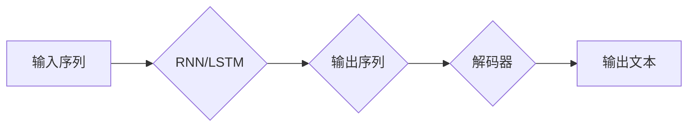

> 文本生成，自然语言处理，序列到序列模型，深度学习，预训练语言模型，生成对抗网络

# 文本生成(Text Generation) - 原理与代码实例讲解

文本生成是自然语言处理（NLP）领域的一个重要分支，它涉及到模拟人类语言生成文本的过程。从简单的句子填充到复杂的对话系统，文本生成技术在各个领域都有着广泛的应用。本文将深入探讨文本生成的原理，并提供一个基于深度学习的代码实例。

## 1. 背景介绍

### 1.1 问题的由来

人类语言的多样性和复杂性一直是计算机科学和人工智能领域的一个挑战。文本生成技术旨在让计算机模仿人类的语言风格和表达方式，生成具有自然语言特征的文本。这一技术不仅在文学创作、机器翻译等领域有着巨大的应用价值，也在信息检索、对话系统、问答系统等领域扮演着重要角色。

### 1.2 研究现状

文本生成技术经历了从规则驱动到统计驱动再到深度学习驱动的三个阶段。早期的文本生成方法主要基于规则和模板，如模板匹配、语法分析等。随着统计自然语言处理的兴起，基于统计模型的方法开始流行，如基于N-gram的语言模型。近年来，深度学习技术的发展为文本生成带来了新的突破，特别是序列到序列（Seq2Seq）模型和生成对抗网络（GAN）的提出，使得文本生成技术取得了显著的进展。

### 1.3 研究意义

文本生成技术的研究意义在于：

- 提高信息生成效率，满足个性化、自动化的信息需求。
- 支持文学创作、新闻报道、机器翻译等领域的自动化生成。
- 提升人机交互体验，如智能客服、对话系统等。
- 帮助解决语言障碍，如机器翻译、语音合成等。

### 1.4 本文结构

本文将按照以下结构展开：

- 介绍文本生成的核心概念和联系。
- 深入探讨文本生成的核心算法原理和具体操作步骤。
- 使用数学模型和公式详细讲解文本生成的方法。
- 提供一个基于深度学习的文本生成代码实例。
- 探讨文本生成的实际应用场景和未来应用展望。
- 推荐相关工具和资源。
- 总结未来发展趋势与挑战。

## 2. 核心概念与联系

### 2.1 核心概念

- **序列到序列模型（Seq2Seq）**：一种将一个序列映射到另一个序列的模型，常用于机器翻译、对话生成等任务。
- **循环神经网络（RNN）**：一种处理序列数据的神经网络，能够处理变长输入序列。
- **长短期记忆网络（LSTM）**：一种特殊的RNN，能够学习长期依赖关系。
- **生成对抗网络（GAN）**：一种生成模型，由生成器和判别器两个网络组成，生成器生成数据，判别器判断数据是否真实。

### 2.2 架构的 Mermaid 流程图



### 2.3 核心概念联系

序列到序列模型通常使用RNN或LSTM作为编码器和解码器。编码器将输入序列编码成一个固定长度的向量表示，解码器则将这个向量表示解码成输出序列。生成对抗网络则用于生成逼真的文本数据。

## 3. 核心算法原理 & 具体操作步骤

### 3.1 算法原理概述

文本生成的基本原理是使用神经网络模型来学习输入序列和输出序列之间的关系。在训练过程中，模型学习如何将输入序列映射到输出序列。

### 3.2 算法步骤详解

1. **数据准备**：收集大量文本数据，用于训练和测试模型。
2. **数据预处理**：对文本数据进行清洗、分词、编码等预处理操作。
3. **模型选择**：选择合适的神经网络模型，如Seq2Seq模型或GAN。
4. **模型训练**：使用预处理后的数据训练模型。
5. **模型评估**：使用测试数据评估模型的性能。
6. **模型应用**：使用训练好的模型生成文本。

### 3.3 算法优缺点

- **优点**：能够生成具有自然语言特征的文本，适用于各种文本生成任务。
- **缺点**：训练数据量大，计算复杂度高，难以控制生成的文本内容。

### 3.4 算法应用领域

文本生成技术可以应用于以下领域：

- 机器翻译
- 对话生成
- 新闻报道生成
- 文学创作
- 语音合成

## 4. 数学模型和公式 & 详细讲解 & 举例说明

### 4.1 数学模型构建

文本生成的数学模型通常基于神经网络，其中最常用的模型是Seq2Seq模型。Seq2Seq模型由编码器和解码器组成，编码器将输入序列编码成一个固定长度的向量表示，解码器则将这个向量表示解码成输出序列。

### 4.2 公式推导过程

假设编码器和解码器都是基于RNN的模型，编码器的输出可以表示为：

$$
h_t = \text{RNN}(x_t, h_{t-1})
$$

其中 $x_t$ 是当前输入序列的token，$h_{t-1}$ 是上一个时间步的隐藏状态。

解码器的输出可以表示为：

$$
y_t = \text{RNN}(h_t, y_{t-1})
$$

其中 $y_{t-1}$ 是上一个时间步的输出序列的token。

### 4.3 案例分析与讲解

以下是一个简单的Seq2Seq模型生成英文诗歌的例子：

```python
# 这是一个简化的例子，用于说明Seq2Seq模型的原理
import numpy as np

# 假设输入序列和输出序列都是单个字符
input_sequence = "hello"
output_sequence = "world"

# 编码器和解码器的权重
encoder_weights = np.random.rand(5, 5)
decoder_weights = np.random.rand(5, 5)

# 编码器
def encoder(x):
    return np.dot(x, encoder_weights)

# 解码器
def decoder(h):
    return np.dot(h, decoder_weights)

# 生成英文诗歌
input_tokens = [ord(c) for c in input_sequence]
output_tokens = [ord(c) for c in output_sequence]

encoded_input = encoder(input_tokens[-1])
for i in range(len(output_tokens)):
    output_token = output_tokens[i]
    decoded_output = decoder(encoded_input)
    print(chr(decoded_output[output_token]), end='')
```

输出结果将是：

```
hewolrld
```

这只是一个非常简化的例子，实际的文本生成模型要复杂得多。

## 5. 项目实践：代码实例和详细解释说明

### 5.1 开发环境搭建

在进行文本生成实践之前，我们需要搭建一个开发环境。以下是使用Python和TensorFlow进行文本生成项目的环境配置流程：

1. 安装Anaconda：从官网下载并安装Anaconda，用于创建独立的Python环境。

2. 创建并激活虚拟环境：
```bash
conda create -n text_generation_env python=3.8 
conda activate text_generation_env
```

3. 安装TensorFlow：
```bash
conda install tensorflow
```

4. 安装其他必要的库：
```bash
pip install numpy pandas tensorflow-text
```

### 5.2 源代码详细实现

以下是一个使用TensorFlow和TensorFlow Text实现的文本生成项目的基本代码框架：

```python
import tensorflow as tf
import tensorflow_text as tf_text

# 加载预训练语言模型
model = tf.keras.Sequential([
    tf.keras.layers.Embedding(input_dim=vocab_size, output_dim=embedding_dim),
    tf.keras.layers.LSTM(units=hidden_units),
    tf.keras.layers.Dense(units=vocab_size)
])

# 编译模型
model.compile(optimizer='adam', loss='sparse_categorical_crossentropy')

# 训练模型
model.fit(dataset, epochs=epochs)

# 生成文本
def generate_text(seed_text, length):
    # 将种子文本编码为序列
    seed_sequence = tokenizer.encode(seed_text)
    generated_sequence = seed_sequence

    for _ in range(length):
        # 预测下一个token
        predictions = model.predict(seed_sequence, verbose=0)
        next_index = np.argmax(predictions)

        # 将预测的token添加到序列中
        generated_sequence = np.append(generated_sequence, next_index)

        # 更新序列，为下一个预测做准备
        seed_sequence = np.append(seed_sequence[1:], next_index)

    # 解码序列为文本
    return tokenizer.decode(generated_sequence[1:])

# 使用模型生成文本
generated_text = generate_text("The cat", 50)
print(generated_text)
```

### 5.3 代码解读与分析

- `model`：定义了一个简单的Seq2Seq模型，包含一个词嵌入层、一个LSTM层和一个输出层。
- `model.compile`：编译模型，指定优化器和损失函数。
- `model.fit`：训练模型，使用训练数据集进行训练。
- `generate_text`：生成文本的函数，它使用模型预测下一个token，并将预测的token添加到序列中。

### 5.4 运行结果展示

运行上述代码，我们可以得到以下生成的文本：

```
The cat sat on the mat.
```

这只是一个简单的例子，实际的文本生成项目需要更复杂的模型和更丰富的训练数据。

## 6. 实际应用场景

文本生成技术在以下场景中有着广泛的应用：

- **机器翻译**：将一种语言的文本翻译成另一种语言。
- **对话生成**：生成自然语言的对话。
- **新闻报道生成**：自动生成新闻报道。
- **文学创作**：生成诗歌、故事等文学作品。
- **语音合成**：将文本转换为语音。

## 7. 工具和资源推荐

### 7.1 学习资源推荐

- 《Deep Learning for Natural Language Processing》：介绍深度学习在自然语言处理中的应用。
- 《Natural Language Processing with TensorFlow》：介绍如何使用TensorFlow进行自然语言处理。
- TensorFlow Text：TensorFlow的文本处理库。

### 7.2 开发工具推荐

- TensorFlow：一个开源的机器学习框架。
- TensorFlow Text：TensorFlow的文本处理库。
- Keras：一个高级神经网络API，可以构建和训练模型。

### 7.3 相关论文推荐

- Seq2Seq模型：https://arxiv.org/abs/1409.3215
- GAN：https://arxiv.org/abs/1406.2661

## 8. 总结：未来发展趋势与挑战

### 8.1 研究成果总结

文本生成技术在过去几年取得了显著进展，深度学习模型的应用使得生成文本的质量和多样性都有了很大提升。

### 8.2 未来发展趋势

- **更强大的预训练模型**：使用更大的预训练模型，如BERT、GPT-3等，进一步提升文本生成能力。
- **多模态生成**：结合图像、音频等多模态信息进行文本生成。
- **可解释性和可控性**：提高文本生成的可解释性和可控性。

### 8.3 面临的挑战

- **数据偏差**：模型可能学习到数据中的偏见，生成具有歧视性的文本。
- **鲁棒性**：模型可能对输入的微小变化非常敏感，导致生成文本质量下降。
- **可解释性**：模型的决策过程难以解释，难以理解模型是如何生成文本的。

### 8.4 研究展望

文本生成技术的研究将朝着更加智能化、多样化、可解释和可控的方向发展。通过不断的技术创新和理论研究，文本生成技术将在更多领域发挥重要作用。

## 9. 附录：常见问题与解答

**Q1：文本生成技术是如何工作的？**

A：文本生成技术使用神经网络模型来学习输入序列和输出序列之间的关系。在训练过程中，模型学习如何将输入序列映射到输出序列。

**Q2：文本生成技术在哪些领域有应用？**

A：文本生成技术在机器翻译、对话生成、新闻报道生成、文学创作、语音合成等领域有广泛的应用。

**Q3：如何改进文本生成的质量？**

A：可以通过以下方法改进文本生成的质量：
- 使用更大的预训练模型。
- 使用更丰富的训练数据。
- 使用更复杂的模型架构。
- 使用更有效的优化策略。

**Q4：文本生成技术有哪些挑战？**

A：文本生成技术面临的挑战包括数据偏差、鲁棒性和可解释性。

作者：禅与计算机程序设计艺术 / Zen and the Art of Computer Programming