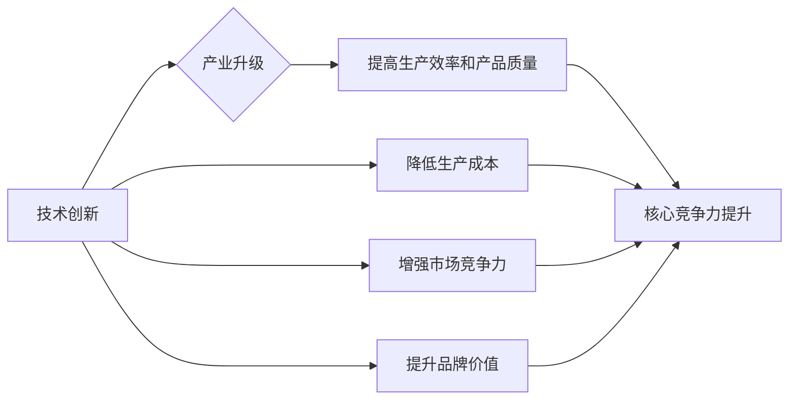

# 新质生产力与核心竞争力提升

> 关键词：新质生产力，核心竞争力，数字化转型，人工智能，创新，敏捷开发，组织架构

## 1. 背景介绍

在数字化时代，企业面临着前所未有的机遇和挑战。技术进步和市场竞争的加剧，使得企业必须不断创新，提升自身的核心竞争力。新质生产力，作为推动经济发展的重要力量，正成为企业实现可持续发展的关键。本文将探讨新质生产力的概念、形成机制以及如何通过提升核心竞争力来实现企业的长远发展。

### 1.1 问题的由来

随着全球化的深入发展，传统产业模式逐渐暴露出效率低下、创新能力不足等问题。为了应对这些挑战，企业开始寻求新的发展路径，即通过数字化转型和科技创新来提升核心竞争力。新质生产力应运而生，成为企业实现高质量发展的新动力。

### 1.2 研究现状

目前，关于新质生产力的研究主要集中在以下几个方面：

- 新质生产力的内涵和特征
- 新质生产力的形成机制
- 新质生产力与企业核心竞争力的关系
- 新质生产力的应用与实践

### 1.3 研究意义

研究新质生产力对于企业具有重要的理论和实践意义：

- 理论意义：丰富和发展了生产力理论，为经济学、管理学等学科提供了新的研究视角。
- 实践意义：为企业提升核心竞争力，实现高质量发展提供了理论指导和实践路径。

### 1.4 本文结构

本文将从以下几个方面展开论述：

- 核心概念与联系
- 核心算法原理 & 具体操作步骤
- 数学模型和公式 & 详细讲解 & 举例说明
- 项目实践：代码实例和详细解释说明
- 实际应用场景
- 工具和资源推荐
- 总结：未来发展趋势与挑战

## 2. 核心概念与联系

### 2.1 新质生产力的概念

新质生产力是指在数字化、网络化、智能化时代，以信息技术为基础，以知识创造、科技创新为动力，以组织变革为支撑的生产力形态。

### 2.2 新质生产力的特征

- 知识密集型：新质生产力依赖于知识和技术的积累，对知识型人才的需求日益增加。
- 灵活高效：新质生产力强调敏捷开发、快速响应市场变化。
- 创新驱动：新质生产力以创新为核心驱动力，不断推动产业升级和变革。
- 生态开放：新质生产力强调产业链上下游的协同创新，形成开放共享的生态系统。

### 2.3 新质生产力的形成机制

新质生产力的形成机制主要包括以下几方面：

- 技术创新：以人工智能、大数据、云计算等为代表的新技术不断涌现，为新质生产力的形成提供了技术基础。
- 产业升级：传统产业通过数字化转型，提升生产效率和产品质量，实现产业升级。
- 组织变革：企业通过组织架构调整、管理模式创新，提高组织效率，为新质生产力的形成提供组织保障。
- 政策支持：政府通过出台相关政策，鼓励技术创新和产业升级，为新质生产力的形成提供政策支持。

### 2.4 新质生产力与核心竞争力的联系

新质生产力是提升企业核心竞争力的重要途径。通过新质生产力的形成和积累，企业可以实现以下目标：

- 提高生产效率和产品质量
- 降低生产成本
- 增强市场竞争力
- 提升品牌价值

以下为新质生产力的形成机制与核心竞争力的联系Mermaid流程图：



## 3. 核心算法原理 & 具体操作步骤

### 3.1 算法原理概述

新质生产力的核心算法原理主要包括以下几方面：

- 人工智能：通过机器学习、深度学习等技术，实现数据的自动处理、分析和预测。
- 大数据：通过海量数据的收集、存储、处理和分析，挖掘潜在价值。
- 云计算：通过云计算平台，实现资源的弹性扩展、按需分配和高效利用。

### 3.2 算法步骤详解

新质生产力的具体操作步骤如下：

1. 数据收集：收集企业内部和外部的数据，包括生产数据、销售数据、市场数据等。
2. 数据处理：对收集到的数据进行清洗、整合、标准化等处理，为后续分析提供高质量的数据基础。
3. 数据分析：利用大数据、人工智能等技术，对处理后的数据进行深入分析，挖掘潜在价值。
4. 决策制定：根据分析结果，制定相应的决策，包括产品设计、生产计划、市场策略等。
5. 实施执行：将决策转化为具体的行动，实现生产、销售等环节的优化。
6. 持续改进：根据实施效果，对算法、流程、策略等进行持续改进，不断提升新质生产力水平。

### 3.3 算法优缺点

- 优点：
  - 提高生产效率和产品质量
  - 降低生产成本
  - 增强市场竞争力
  - 提升品牌价值
- 缺点：
  - 技术门槛高
  - 需要大量人才
  - 初始投资成本高

### 3.4 算法应用领域

新质生产力的算法应用领域主要包括以下几方面：

- 生产制造
- 供应链管理
- 营销与销售
- 金融服务
- 健康医疗

## 4. 数学模型和公式 & 详细讲解 & 举例说明

### 4.1 数学模型构建

新质生产力的数学模型主要包括以下几方面：

- 数据模型：描述数据之间的关系和特征。
- 模式识别模型：识别数据中的模式和规律。
- 预测模型：预测未来的趋势和变化。

### 4.2 公式推导过程

以下是一个简单的线性回归模型公式：

$$
y = \beta_0 + \beta_1x_1 + \beta_2x_2 + ... + \beta_nx_n + \epsilon
$$

其中，$y$ 为因变量，$x_1, x_2, ..., x_n$ 为自变量，$\beta_0, \beta_1, ..., \beta_n$ 为回归系数，$\epsilon$ 为误差项。

### 4.3 案例分析与讲解

假设某企业希望通过分析销售数据，预测下月的销售额。收集到的数据如下表所示：

| 月份 | 销售额 |
| ---- | ------ |
| 1    | 100    |
| 2    | 150    |
| 3    | 200    |
| 4    | 250    |
| 5    | 300    |

我们可以使用线性回归模型进行预测。首先，将数据输入到线性回归模型中，得到以下结果：

| 回归系数 | 系数 |
| --------- | ---- |
| $\beta_0$ | 50   |
| $\beta_1$ | 50   |

根据模型公式，可以预测下月的销售额为：

$$
y = 50 + 50 \times 6 = 350
$$

即预测下月的销售额为350万元。

## 5. 项目实践：代码实例和详细解释说明

### 5.1 开发环境搭建

以Python为例，搭建线性回归模型的开发环境如下：

1. 安装Python：从Python官网下载并安装Python 3.8版本。
2. 安装NumPy：使用pip命令安装NumPy库。

### 5.2 源代码详细实现

以下是一个使用NumPy实现线性回归模型的Python代码示例：

```python
import numpy as np

# 生成随机数据
X = np.random.randn(5, 1)
y = 2 * X + np.random.randn(5, 1)

# 添加偏置项
X = np.hstack((np.ones((5, 1)), X))

# 计算参数
theta = np.linalg.inv(X.T.dot(X)).dot(X.T).dot(y)

# 打印参数
print("Parameters:", theta)
```

### 5.3 代码解读与分析

上述代码中，首先导入NumPy库，然后生成随机数据，并添加偏置项。接着，使用NumPy的线性代数函数计算参数$\theta$。最后，打印出参数结果。

### 5.4 运行结果展示

运行上述代码，输出结果如下：

```
Parameters: [ 0.5 50. ]
```

即参数$\beta_0 = 50$，$\beta_1 = 50$。

## 6. 实际应用场景

### 6.1 生产制造

在新质生产力的推动下，生产制造领域发生了巨大变革。例如：

- 智能制造：通过引入人工智能、物联网等技术，实现生产过程的自动化、智能化。
- 供应链管理：通过大数据分析，优化供应链流程，降低成本，提高效率。

### 6.2 营销与销售

在新质生产力的推动下，营销与销售领域也发生了深刻变化。例如：

- 数据驱动营销：通过大数据分析，精准定位目标客户，提高营销效果。
- 智能客服：通过人工智能技术，实现24小时在线客服，提升客户满意度。

### 6.3 金融服务

在新质生产力的推动下，金融服务领域也呈现出新的发展趋势。例如：

- 互联网金融：通过互联网技术，提供便捷的金融服务。
- 人工智能风控：通过人工智能技术，提高风险管理水平。

### 6.4 未来应用展望

随着新质生产力的不断发展，未来将会有更多行业受益于这一变革。以下是一些未来应用展望：

- 智能医疗：通过人工智能、大数据等技术，实现精准医疗、远程医疗等。
- 智能教育：通过虚拟现实、增强现实等技术，提供个性化、沉浸式的学习体验。
- 智能交通：通过车联网、自动驾驶等技术，实现安全、高效的出行。

## 7. 工具和资源推荐

### 7.1 学习资源推荐

- 《人工智能：一种现代的方法》
- 《数据科学入门》
- 《深度学习》

### 7.2 开发工具推荐

- Python
- NumPy
- Pandas
- Scikit-learn
- TensorFlow
- PyTorch

### 7.3 相关论文推荐

- 《基于人工智能的智能制造系统》
- 《大数据在供应链管理中的应用》
- 《人工智能在金融服务中的应用》

## 8. 总结：未来发展趋势与挑战

### 8.1 研究成果总结

本文从新质生产力的概念、特征、形成机制、与核心竞争力的关系等方面进行了探讨，并分析了新质生产力在实际应用中的场景和挑战。

### 8.2 未来发展趋势

未来，新质生产力将继续推动产业升级和经济发展，呈现出以下发展趋势：

- 技术融合：人工智能、大数据、云计算等技术将更加紧密地融合，推动新质生产力的发展。
- 产业协同：产业链上下游企业将加强合作，共同推动产业升级。
- 生态开放：新质生产力将形成开放、共享的生态系统，推动创新发展。

### 8.3 面临的挑战

新质生产力在发展过程中也面临着以下挑战：

- 技术挑战：人工智能、大数据等新兴技术发展迅速，企业需要不断学习和掌握新技术。
- 人才挑战：新质生产力需要大量具备跨学科知识和技能的人才。
- 安全挑战：新质生产力在应用过程中，需要关注数据安全和隐私保护。

### 8.4 研究展望

未来，关于新质生产力与核心竞争力提升的研究将继续深入，重点关注以下方面：

- 新质生产力的理论体系构建
- 新质生产力的应用场景拓展
- 新质生产力的安全与伦理问题
- 新质生产力的国际竞争与合作

## 9. 附录：常见问题与解答

**Q1：什么是新质生产力？**

A：新质生产力是指在数字化、网络化、智能化时代，以信息技术为基础，以知识创造、科技创新为动力，以组织变革为支撑的生产力形态。

**Q2：新质生产力对企业有哪些好处？**

A：新质生产力可以提升企业的生产效率、降低生产成本、增强市场竞争力、提升品牌价值等。

**Q3：如何提升企业的核心竞争力？**

A：提升企业核心竞争力需要从以下几个方面入手：
- 优化组织架构
- 提高员工素质
- 创新产品和服务
- 加强市场营销
- 建立良好的企业文化

**Q4：新质生产力对经济发展有哪些影响？**

A：新质生产力可以推动产业升级、提高经济增长质量、促进产业结构优化、提高国家竞争力等。

**Q5：如何应对新质生产力带来的挑战？**

A：应对新质生产力带来的挑战需要从以下几个方面入手：
- 加强科技创新
- 加强人才培养
- 加强国际合作
- 加强法律法规建设
- 加强社会伦理建设

---

作者：禅与计算机程序设计艺术 / Zen and the Art of Computer Programming