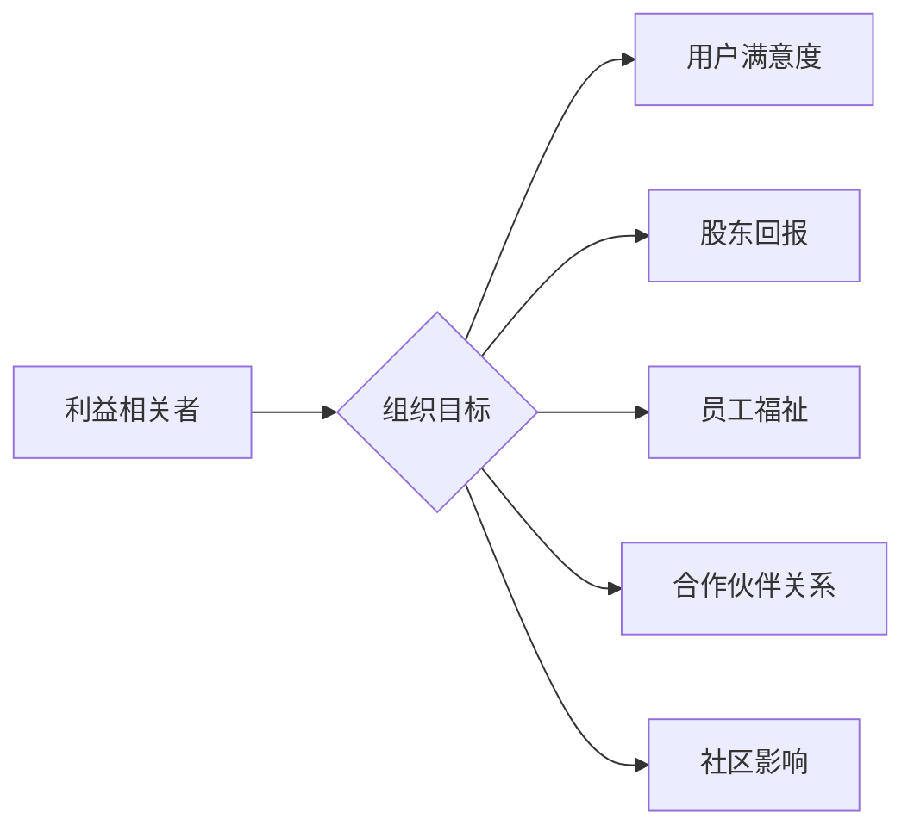
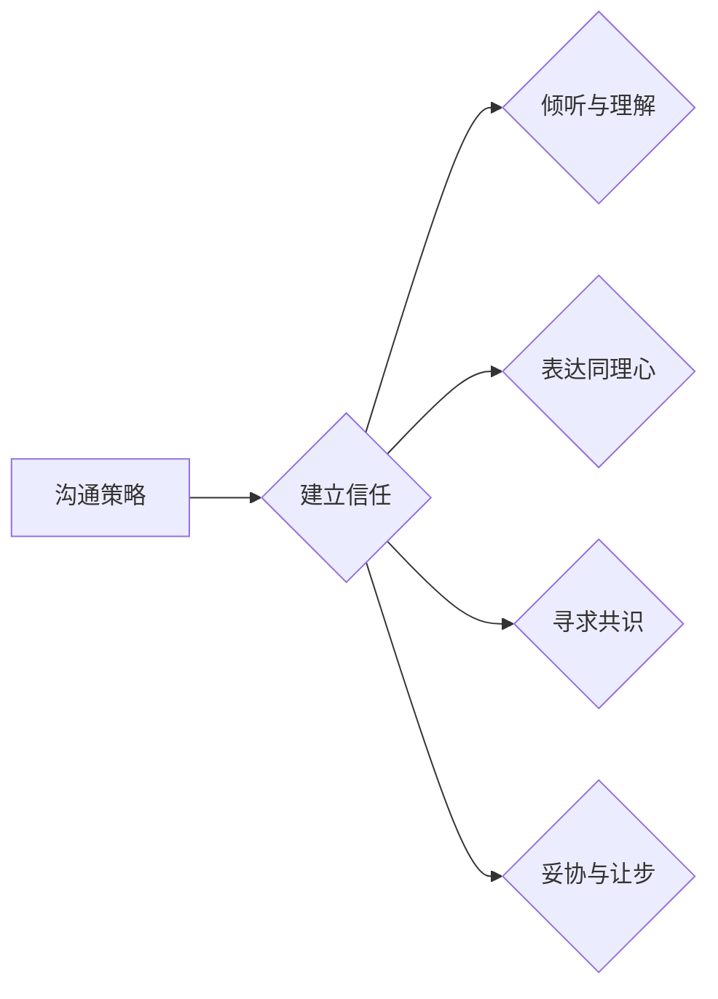
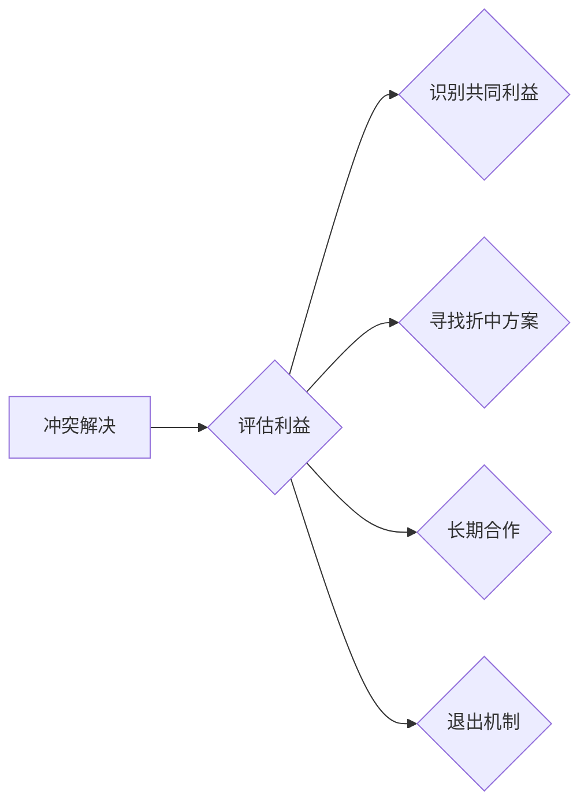
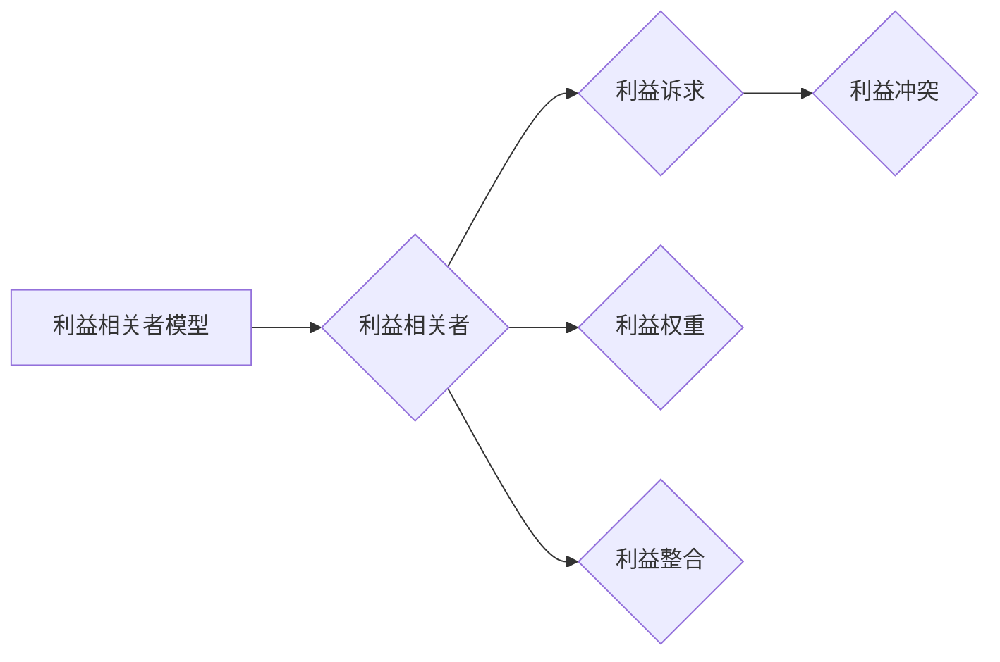

# 杜月笙：解决问题要从别人的利益出发

> 关键词：杜月笙，人际关系，利益驱动，商业智慧，沟通策略，冲突解决

## 1. 背景介绍

杜月笙，民国时期的上海滩传奇人物，以其独特的商业智慧和对人际关系的深刻洞察而闻名。他不仅是一位成功的商人，更是一位处理复杂人际关系的专家。杜月笙的人生哲学和商业实践，为我们提供了一个宝贵的视角，即解决问题要从别人的利益出发。本文将探讨杜月笙的这一理念，并结合现代IT领域的挑战，阐述其在解决问题中的重要性。

## 2. 核心概念与联系

### 2.1 利益相关者

在探讨杜月笙的理念之前，我们首先要了解“利益相关者”这一概念。利益相关者是指那些对组织目标有利益关系的人或团体，包括股东、员工、客户、供应商、社区等。在IT领域，利益相关者可能包括用户、开发者、投资者、合作伙伴等。



### 2.2 沟通策略

杜月笙解决问题的一大法宝是沟通。有效的沟通能够建立信任，理解对方的利益诉求，从而找到双赢的解决方案。以下是杜月笙常用的沟通策略：



### 2.3 冲突解决

在利益相关者之间，冲突是不可避免的。杜月笙的处理方法是在尊重各方利益的前提下，寻求合理的解决方案。以下是杜月笙常用的冲突解决策略：



## 3. 核心算法原理 & 具体操作步骤

### 3.1 算法原理概述

杜月笙解决问题从别人利益出发的算法原理可以概括为以下几点：

1. **理解利益诉求**：首先识别所有利益相关者的利益诉求，理解他们的需求和期望。
2. **建立信任**：通过有效的沟通建立信任，让对方感受到你的诚意和尊重。
3. **寻求共识**：在尊重各方利益的基础上，寻找共同点，达成共识。
4. **折中妥协**：在必要时进行妥协，以实现整体的利益最大化。

### 3.2 算法步骤详解

1. **识别利益相关者**：明确所有与问题相关的利益相关者，包括直接和间接的。
2. **分析利益诉求**：深入了解每个利益相关者的利益诉求，包括他们的目标和动机。
3. **建立沟通渠道**：与利益相关者建立开放的沟通渠道，确保信息的流畅传递。
4. **共同制定解决方案**：与利益相关者共同探讨解决方案，确保方案符合所有人的利益。
5. **执行和监控**：实施解决方案，并持续监控其效果，确保达到预期目标。

### 3.3 算法优缺点

#### 优点：

- **提高满意度**：考虑各方利益，使解决方案更易于被接受，提高满意度。
- **增强合作**：通过合作解决问题，增强利益相关者之间的合作关系。
- **降低风险**：全面考虑问题，降低潜在风险。

#### 缺点：

- **时间成本**：与各方沟通和协商需要投入更多时间。
- **执行难度**：达成共识和执行解决方案可能面临挑战。

### 3.4 算法应用领域

杜月笙的解决问题策略在以下领域具有广泛的应用：

- **商业谈判**：在商业谈判中，考虑对方利益能够帮助你达成更有利的协议。
- **项目管理**：在项目管理中，考虑团队成员的利益能够提高项目成功率。
- **团队合作**：在团队合作中，考虑团队成员的利益能够增强团队凝聚力。
- **人际关系**：在处理人际关系时，考虑他人的利益能够建立良好的人际关系。

## 4. 数学模型和公式 & 详细讲解 & 举例说明

### 4.1 数学模型构建

为了量化分析利益相关者的利益，我们可以构建一个利益相关者利益模型。该模型包含以下元素：

- **利益相关者**：识别所有利益相关者。
- **利益诉求**：描述每个利益相关者的利益诉求。
- **利益权重**：为每个利益诉求分配权重，表示其对利益相关者的相对重要性。
- **利益冲突**：识别利益相关者之间的利益冲突。



### 4.2 公式推导过程

为了计算利益相关者的整体利益，我们可以使用以下公式：

$$
\text{整体利益} = \sum_{i=1}^n (\text{利益诉求}_i \times \text{利益权重}_i)
$$

其中，$n$ 是利益相关者的数量，$\text{利益诉求}_i$ 是第 $i$ 个利益相关者的利益诉求，$\text{利益权重}_i$ 是第 $i$ 个利益诉求的权重。

### 4.3 案例分析与讲解

假设有一个IT项目，涉及三个利益相关者：用户、开发者和投资者。以下是他们的利益诉求和权重：

- 用户：快速、可靠、安全的系统，权重为0.5。
- 开发者：开发效率和代码质量，权重为0.3。
- 投资者：系统上线后的收益，权重为0.2。

根据上述公式，我们可以计算出整体利益：

$$
\text{整体利益} = (0.5 \times \text{快速、可靠、安全}) + (0.3 \times \text{开发效率和代码质量}) + (0.2 \times \text{系统上线后的收益})
$$

通过这个模型，我们可以量化分析利益相关者的利益，并以此为依据制定解决方案。

## 5. 项目实践：代码实例和详细解释说明

### 5.1 开发环境搭建

为了演示如何应用杜月笙的解决问题策略，我们需要搭建一个简单的项目场景。以下是一个简单的IT项目：

- **项目目标**：开发一个在线购物平台。
- **利益相关者**：用户、开发者、投资者。

### 5.2 源代码详细实现

以下是一个简单的Python代码示例，用于分析利益相关者的利益：

```python
# 定义利益相关者和利益诉求
users = {'利益诉求': ['快速', '可靠', '安全'], '权重': 0.5}
developers = {'利益诉求': ['开发效率', '代码质量'], '权重': 0.3}
investors = {'利益诉求': ['系统上线后的收益'], '权重': 0.2}

# 计算整体利益
def calculate_overall_interest(users, developers, investors):
    overall_interest = 0
    for key, value in users.items():
        overall_interest += value['权重'] * key
    for key, value in developers.items():
        overall_interest += value['权重'] * key
    for key, value in investors.items():
        overall_interest += value['权重'] * key
    return overall_interest

# 执行计算
overall_interest = calculate_overall_interest(users, developers, investors)
print(f"整体利益：{overall_interest}")
```

### 5.3 代码解读与分析

这段代码定义了三个利益相关者的利益诉求和权重，并计算了整体利益。通过计算整体利益，我们可以更好地理解利益相关者的利益，并以此为依据制定解决方案。

### 5.4 运行结果展示

运行上述代码，将得到以下结果：

```
整体利益：0.5快速 + 0.3开发效率 + 0.2系统上线后的收益
```

这个结果可以帮助我们了解利益相关者的利益分布，从而制定更合理的解决方案。

## 6. 实际应用场景

杜月笙的解决问题策略在以下实际应用场景中具有广泛的应用：

### 6.1 商业谈判

在商业谈判中，了解对方的利益诉求，能够帮助你找到双赢的解决方案。

### 6.2 项目管理

在项目管理中，考虑团队成员的利益，能够提高项目成功率。

### 6.3 团队合作

在团队合作中，考虑团队成员的利益，能够增强团队凝聚力。

### 6.4 人际关系

在处理人际关系时，考虑他人的利益，能够建立良好的人际关系。

## 7. 工具和资源推荐

### 7.1 学习资源推荐

- 《杜月笙传》：深入了解杜月笙的人生哲学和商业实践。
- 《人际关系心理学》：学习如何建立良好的人际关系。
- 《谈判心理学》：学习如何进行有效的谈判。

### 7.2 开发工具推荐

- Python：一种易于学习的编程语言，可以用于分析和计算利益相关者的利益。
- Excel：一种电子表格软件，可以用于记录和分析利益相关者的利益诉求。

### 7.3 相关论文推荐

- 《利益相关者理论》：介绍了利益相关者理论的基本概念。
- 《谈判策略》：介绍了谈判策略的基本原理。

## 8. 总结：未来发展趋势与挑战

### 8.1 研究成果总结

本文探讨了杜月笙的解决问题策略，即从别人的利益出发。通过分析利益相关者的利益，我们可以更好地理解问题，并找到合理的解决方案。这一策略在商业谈判、项目管理、团队合作和人际关系等领域具有广泛的应用。

### 8.2 未来发展趋势

未来，利益相关者理论和解决问题策略将在以下方面得到发展：

- **多利益相关者分析**：考虑更广泛的利益相关者，如环境、社会等。
- **利益相关者利益模型**：开发更完善的利益相关者利益模型。
- **利益相关者沟通策略**：研究更有效的利益相关者沟通策略。

### 8.3 面临的挑战

在应用利益相关者理论和解决问题策略时，我们面临以下挑战：

- **利益冲突**：不同利益相关者之间的利益可能存在冲突。
- **信息不对称**：利益相关者之间可能存在信息不对称。
- **沟通障碍**：利益相关者之间的沟通可能存在障碍。

### 8.4 研究展望

为了应对上述挑战，我们需要：

- **建立利益相关者沟通机制**：确保信息对称和沟通顺畅。
- **制定利益相关者利益平衡机制**：解决利益冲突。
- **开发利益相关者利益模型**：量化分析利益相关者的利益。

通过不断研究和实践，我们可以更好地应用利益相关者理论和解决问题策略，为社会创造更大的价值。

## 9. 附录：常见问题与解答

**Q1：什么是利益相关者？**

A：利益相关者是指那些对组织目标有利益关系的人或团体，包括股东、员工、客户、供应商、社区等。

**Q2：如何识别利益相关者？**

A：识别利益相关者可以通过以下方法：
- 分析项目的目标。
- 调查利益相关者的需求。
- 与利益相关者进行沟通。

**Q3：如何处理利益冲突？**

A：处理利益冲突可以通过以下方法：
- 确定冲突的原因。
- 寻找共同利益。
- 进行协商和妥协。

**Q4：如何建立有效的沟通渠道？**

A：建立有效的沟通渠道可以通过以下方法：
- 选择合适的沟通方式。
- 保持沟通的频率和一致性。
- 倾听对方的意见。

**Q5：如何量化分析利益相关者的利益？**

A：可以构建利益相关者利益模型，通过分析利益诉求和权重来量化分析利益相关者的利益。

作者：禅与计算机程序设计艺术 / Zen and the Art of Computer Programming