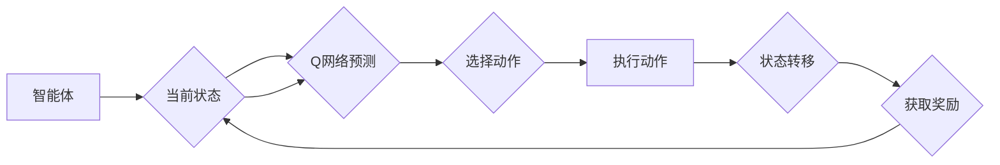

# 强化学习算法：深度 Q 网络 (DQN) 原理与代码实例讲解

> 关键词：强化学习，DQN，深度学习，Q学习，智能体，环境，状态，动作，奖励，探索，exploitation，exploitation，神经网络，策略梯度

## 1. 背景介绍

强化学习是机器学习的一个分支，它让智能体在与环境的交互中通过试错学习最优策略。与监督学习和无监督学习不同，强化学习强调的是智能体在动态环境中学习如何做出决策。深度 Q 网络（Deep Q-Network，DQN）是强化学习领域的一项重要突破，它结合了深度学习和 Q 学习，使得智能体能够学习到复杂的策略。

### 1.1 强化学习的起源与发展

强化学习的概念最早可以追溯到20世纪50年代，但它的发展历程并非一帆风顺。在20世纪80年代，Q 学习算法的出现为强化学习奠定了基础。随后，随着深度学习技术的兴起，深度 Q 网络（DQN）在2015年获得了突破性的成功，使得强化学习在许多领域取得了显著的进展。

### 1.2 强化学习的基本概念

- **智能体（Agent）**：执行动作并从环境中获取奖励的实体。
- **环境（Environment）**：智能体行动的场所，可以是对现实世界的模拟。
- **状态（State）**：智能体在特定时间点的状态描述。
- **动作（Action）**：智能体可以选择的行为。
- **奖励（Reward）**：智能体执行动作后从环境中获得的即时奖励。
- **策略（Policy）**：智能体根据当前状态选择动作的规则。
- **价值函数（Value Function）**：预测在特定状态下采取某个动作的长期累积奖励。
- **模型（Model）**：智能体对环境的理解。

### 1.3 DQN的历史与意义

DQN由DeepMind的DeepMind Lab团队在2015年提出，它是第一个成功将深度学习应用于强化学习领域的算法。DQN的核心思想是使用深度神经网络来近似价值函数，从而实现智能体的自主学习和决策。

## 2. 核心概念与联系

### 2.1 DQN的Mermaid流程图



### 2.2 核心概念联系

- 智能体根据当前状态通过Q网络预测每个可能动作的价值。
- 智能体选择价值最高的动作执行。
- 执行动作后，智能体获取奖励并进入新的状态。
- 通过不断迭代，智能体学习到最优策略。

## 3. 核心算法原理 & 具体操作步骤

### 3.1 算法原理概述

DQN通过最大化累积奖励来学习策略，其核心思想是使用深度神经网络来近似 Q 函数，即智能体在特定状态下采取特定动作的期望奖励。

### 3.2 算法步骤详解

1. **初始化**：创建一个深度神经网络 Q 网络，用于近似 Q 函数。
2. **训练**：智能体在环境中与环境交互，收集经验。
3. **经验回放**：将收集到的经验存储在经验回放缓冲区中。
4. **样本抽取**：从经验回放缓冲区中随机抽取一批经验。
5. **目标网络更新**：使用抽取的样本更新目标 Q 网络。
6. **策略网络更新**：使用目标 Q 网络更新策略网络。

### 3.3 算法优缺点

**优点**：
- 能够处理高维状态空间。
- 能够学习到复杂的策略。

**缺点**：
- 训练过程可能不稳定。
- 需要大量的训练数据。

### 3.4 算法应用领域

DQN在许多领域都有应用，包括但不限于：

- 游戏：如Atari游戏、围棋等。
- 推荐系统：如电影推荐、新闻推荐等。
- 机器人控制：如无人驾驶、机器人导航等。

## 4. 数学模型和公式 & 详细讲解 & 举例说明

### 4.1 数学模型构建

DQN的数学模型主要包括以下几个部分：

- **状态空间**：$\mathcal{S}$
- **动作空间**：$\mathcal{A}$
- **策略**：$\pi(s) = \arg\max_{a \in \mathcal{A}} Q(s, a)$
- **价值函数**：$V(s) = \mathbb{E}[R_{t+1} | s_t = s, a_t = a]$
- **Q 函数**：$Q(s, a) = \mathbb{E}[R_{t+1} | s_t = s, a_t = a]$

### 4.2 公式推导过程

DQN的目标是最大化累积奖励，即：

$$
J(\theta) = \mathbb{E}_{s_t \sim \pi(s_t)}\left[\sum_{t=0}^{\infty} \gamma^t R_{t+1}\right]
$$

其中，$\gamma$ 是折扣因子，$R_{t+1}$ 是第 $t+1$ 个时间步的奖励。

### 4.3 案例分析与讲解

以下是一个简单的 DQN 代码实例，展示了如何使用 PyTorch 实现 DQN：

```python
import torch
import torch.nn as nn
import torch.optim as optim

# 定义 Q 网络
class QNetwork(nn.Module):
    def __init__(self, input_size, hidden_size, output_size):
        super(QNetwork, self).__init__()
        self.fc1 = nn.Linear(input_size, hidden_size)
        self.fc2 = nn.Linear(hidden_size, output_size)

    def forward(self, x):
        x = torch.relu(self.fc1(x))
        x = self.fc2(x)
        return x

# 定义 DQN 算法
class DQN:
    def __init__(self, input_size, hidden_size, output_size):
        self.q_network = QNetwork(input_size, hidden_size, output_size)
        self.optimiser = optim.Adam(self.q_network.parameters())
        self.loss_function = nn.MSELoss()

    def train(self, states, actions, rewards, next_states, done):
        for i in range(len(states)):
            state = torch.FloatTensor(states[i])
            action = actions[i]
            reward = rewards[i]
            next_state = torch.FloatTensor(next_states[i])
            done_i = 1 if done[i] else 0

            if not done_i:
                target = reward + self.gamma * self.q_network(next_state).max(1)[0].view(1, 1)
            else:
                target = reward

            q_values = self.q_network(state)
            q_values[0][action] = target

            loss = self.loss_function(q_values, target)
            self.optimiser.zero_grad()
            loss.backward()
            self.optimiser.step()

    def predict(self, state):
        return self.q_network(torch.FloatTensor(state))
```

在这个例子中，我们定义了一个简单的 Q 网络，并实现了一个 DQN 算法的框架。在实际应用中，需要根据具体任务调整网络结构和训练过程。

## 5. 项目实践：代码实例和详细解释说明

### 5.1 开发环境搭建

为了运行 DQN 代码实例，需要以下开发环境：

- Python 3.x
- PyTorch
- gym：一个流行的开源环境，提供了一系列用于强化学习的游戏和模拟环境。

### 5.2 源代码详细实现

以下是一个简单的 DQN 代码实例，展示了如何使用 PyTorch 和 gym 实现 DQN：

```python
import gym
import random
import numpy as np
import torch
import torch.nn as nn
import torch.optim as optim

# 定义 Q 网络
class QNetwork(nn.Module):
    # ... (与之前相同)

# 定义 DQN 算法
class DQN:
    # ... (与之前相同)

# 定义训练过程
def train_dqn(env, dqn, episodes=1000):
    for episode in range(episodes):
        state = env.reset()
        done = False
        total_reward = 0

        while not done:
            action = dqn.predict(state)
            next_state, reward, done, _ = env.step(action.item())
            dqn.train(state, action, reward, next_state, done)
            total_reward += reward
            state = next_state

        print(f'Episode {episode} finished with reward: {total_reward}')

# 运行训练过程
env = gym.make('CartPole-v0')
dqn = DQN(input_size=4, hidden_size=64, output_size=2)
train_dqn(env, dqn)

# 保存模型
torch.save(dqn.q_network.state_dict(), 'dqn_cartpole.pth')

# 加载模型并测试
dqn.q_network.load_state_dict(torch.load('dqn_cartpole.pth'))
while True:
    state = env.reset()
    done = False
    total_reward = 0

    while not done:
        action = dqn.predict(state)
        next_state, reward, done, _ = env.step(action.item())
        total_reward += reward
        state = next_state

    print(f'Test finished with reward: {total_reward}')
    break
```

### 5.3 代码解读与分析

在这个例子中，我们首先定义了一个简单的 Q 网络，并实现了一个 DQN 算法的框架。然后，我们使用 gym 的 CartPole 环境来测试 DQN 的性能。

- `QNetwork` 类定义了一个简单的前馈神经网络，用于近似 Q 函数。
- `DQN` 类实现了 DQN 算法的核心逻辑，包括训练和预测方法。
- `train_dqn` 函数使用 CartPole 环境来训练 DQN 模型。
- 最后，我们保存并加载了训练好的模型，并使用它来测试 DQN 的性能。

### 5.4 运行结果展示

运行上述代码后，DQN 模型将开始在 CartPole 环境中进行训练。经过一定数量的回合后，模型将学会稳定地控制 CartPole 环境中的杆子。

## 6. 实际应用场景

DQN 在许多领域都有应用，以下是一些典型的应用场景：

- 游戏：如 Atari 游戏和围棋。
- 推荐系统：如电影推荐、新闻推荐。
- 机器人控制：如无人驾驶、机器人导航。
- 金融：如股票交易、风险管理。

## 7. 工具和资源推荐

### 7.1 学习资源推荐

- 《Reinforcement Learning: An Introduction》
- 《Deep Reinforcement Learning》
- 《Deep Learning for Reinforcement Learning》

### 7.2 开发工具推荐

- PyTorch
- gym
- OpenAI Baselines

### 7.3 相关论文推荐

- “Playing Atari with Deep Reinforcement Learning” (Silver et al., 2013)
- “Human-level control through deep reinforcement learning” (Silver et al., 2016)
- “Mastering Chess and Shogi by Self-Play with a General Reinforcement Learning Algorithm” (Silver et al., 2017)

## 8. 总结：未来发展趋势与挑战

### 8.1 研究成果总结

DQN 的提出标志着强化学习进入了一个新的时代，它成功地结合了深度学习和 Q 学习，使得智能体能够学习到复杂的策略。DQN 在多个领域都取得了显著的成果，证明了深度学习在强化学习中的潜力。

### 8.2 未来发展趋势

- **多智能体强化学习**：研究多个智能体在复杂环境中的协作和竞争策略。
- **元强化学习**：研究如何使智能体能够在多个任务上快速学习。
- **可解释的强化学习**：研究如何使强化学习算法的决策过程更加可解释。

### 8.3 面临的挑战

- **探索-利用问题**：如何平衡探索新策略和利用已知策略。
- **样本效率**：如何减少训练所需的样本数量。
- **可解释性**：如何使强化学习算法的决策过程更加可解释。

### 8.4 研究展望

随着深度学习技术的不断发展，DQN 和其他强化学习算法将会在更多领域得到应用。未来，我们期待看到更多创新性的强化学习算法的出现，为构建更加智能的系统和机器人做出贡献。

## 9. 附录：常见问题与解答

**Q1：DQN 与其他强化学习算法有什么区别？**

A：DQN 是一种基于价值函数的强化学习算法，它使用深度神经网络来近似 Q 函数。与其他强化学习算法相比，DQN 具有以下特点：

- 能够处理高维状态空间。
- 能够学习到复杂的策略。

**Q2：如何解决 DQN 的探索-利用问题？**

A：探索-利用问题是强化学习中的经典问题，常见的解决方案包括：

- 贪婪策略：以一定的概率随机选择动作。
- ε-贪婪策略：以概率 $\epsilon$ 随机选择动作，以 $1-\epsilon$ 的概率选择最优动作。
- 梯度策略优化：使用梯度策略优化方法，如 Trust Region Policy Optimization (TRPO) 和 Proximal Policy Optimization (PPO)。

**Q3：DQN 的训练过程需要多长时间？**

A：DQN 的训练时间取决于多个因素，如环境、模型大小、数据量等。一般来说，使用 GPU 训练 DQN 需要数小时到数天不等。

**Q4：DQN 的应用场景有哪些？**

A：DQN 在许多领域都有应用，如游戏、推荐系统、机器人控制、金融等。

**Q5：如何评估 DQN 的性能？**

A：评估 DQN 的性能可以通过以下指标：

- 平均奖励：在多个回合中，智能体获得的平均奖励。
- 稳定性：智能体在执行动作时的稳定性。
- 学习速度：智能体学习到最优策略的速度。

---

作者：禅与计算机程序设计艺术 / Zen and the Art of Computer Programming