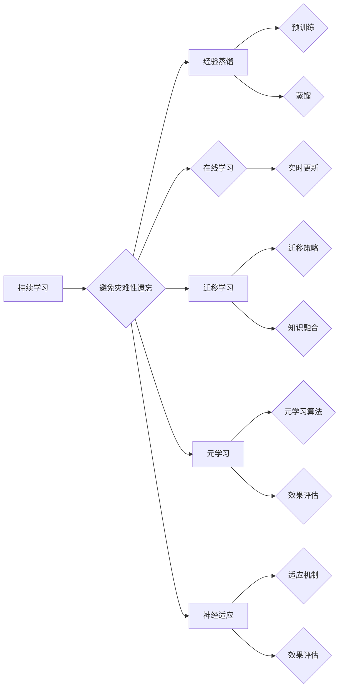

# 持续学习Continual Learning原理与代码实例讲解

> 关键词：持续学习，经验蒸馏，在线学习，迁移学习，元学习，神经适应，模型可塑性

## 1. 背景介绍

随着人工智能技术的飞速发展，机器学习模型在各个领域都取得了显著的成果。然而，大多数机器学习模型都是针对单一任务进行训练，一旦遇到新任务，需要重新训练模型，导致资源浪费和时间成本增加。持续学习（Continual Learning，简称CL）作为一种新兴的研究方向，旨在让机器学习模型能够持续地学习新任务，同时保留旧任务的知识，从而实现跨任务的泛化能力。

### 1.1 问题的由来

在现实世界中，新任务的出现是不可避免的。例如，自动驾驶汽车需要能够识别新的交通标志、新车型；智能客服系统需要能够理解新的客户问题；医疗诊断系统需要能够识别新的疾病类型。因此，研究持续学习技术对于提高机器学习模型在实际应用中的适应性和鲁棒性具有重要意义。

### 1.2 研究现状

持续学习的研究始于上世纪90年代，经历了多个阶段的发展。目前，持续学习的研究主要集中在以下几个方面：

- **经验蒸馏（Experience Replay）**：通过将已学习的经验存储在经验池中，并从中随机抽取样本进行训练，以避免新任务学习过程中的灾难性遗忘。
- **在线学习（Online Learning）**：在训练过程中不断接收新样本，并实时更新模型参数，以适应新任务的变化。
- **迁移学习（Transfer Learning）**：利用已学习到的知识迁移到新任务中，提高新任务的学习效率。
- **元学习（Meta-Learning）**：学习如何学习，使模型能够快速适应新任务。
- **神经适应（Neural Adaptation）**：通过调整模型结构或参数，使模型能够适应新任务。

### 1.3 研究意义

持续学习的研究具有以下重要意义：

- **提高模型的泛化能力**：通过学习新任务，模型能够更好地适应未知任务。
- **降低训练成本**：无需对每个新任务从头开始训练，节省时间和计算资源。
- **提高模型的鲁棒性**：能够适应新任务的变化，提高模型在实际应用中的稳定性。

### 1.4 本文结构

本文将系统地介绍持续学习的原理、算法、实现方法以及应用场景。具体内容如下：

- 第2章：介绍持续学习的基本概念和关键技术。
- 第3章：讲解持续学习的核心算法原理和具体操作步骤。
- 第4章：分析持续学习的数学模型和公式，并结合实例进行讲解。
- 第5章：提供持续学习的代码实例和详细解释说明。
- 第6章：探讨持续学习的实际应用场景和未来应用展望。
- 第7章：推荐持续学习相关的学习资源、开发工具和参考文献。
- 第8章：总结持续学习的研究成果、未来发展趋势和面临的挑战。
- 第9章：提供持续学习的常见问题与解答。

## 2. 核心概念与联系

持续学习涉及多个核心概念，下面将介绍这些概念及其相互之间的联系。

### 2.1 持续学习

持续学习是指机器学习模型在处理多个任务时，能够保留先前任务的知识，并在此基础上学习新任务。持续学习的关键在于避免灾难性遗忘，即在新任务学习过程中丢失先前任务的知识。

### 2.2 经验蒸馏

经验蒸馏是一种常用的持续学习方法，通过将已学习的知识从老任务迁移到新任务。具体来说，经验蒸馏分为两个阶段：

- **预训练阶段**：模型在老任务上充分训练，学习到丰富的知识。
- **蒸馏阶段**：将预训练模型作为教师模型，生成软标签，指导新任务的学习。

### 2.3 在线学习

在线学习是一种动态学习方式，模型在训练过程中不断接收新样本，并实时更新模型参数。在线学习的关键在于如何平衡新样本和旧知识，以避免灾难性遗忘。

### 2.4 迁移学习

迁移学习是一种将已学习到的知识迁移到新任务中的方法。迁移学习的关键在于如何选择合适的迁移策略，以及如何融合新旧知识。

### 2.5 元学习

元学习是一种学习如何学习的方法，旨在使模型能够快速适应新任务。元学习的关键在于如何设计有效的元学习算法，以及如何评估元学习的效果。

### 2.6 神经适应

神经适应是一种通过调整模型结构或参数来适应新任务的方法。神经适应的关键在于如何设计适应机制，以及如何评估适应效果。

以下是基于Mermaid流程图的核心概念与联系：



## 3. 核心算法原理 & 具体操作步骤

### 3.1 算法原理概述

持续学习的核心算法主要包括以下几种：

- **经验蒸馏**：将老任务的知识迁移到新任务中，包括预训练和蒸馏两个阶段。
- **在线学习**：在训练过程中不断接收新样本，并实时更新模型参数。
- **迁移学习**：将已学习到的知识迁移到新任务中，包括迁移策略和知识融合两个步骤。
- **元学习**：学习如何学习，使模型能够快速适应新任务。
- **神经适应**：通过调整模型结构或参数来适应新任务。

### 3.2 算法步骤详解

以下是每种算法的具体操作步骤：

**经验蒸馏**

1. **预训练阶段**：在老任务上充分训练模型，使其学习到丰富的知识。
2. **蒸馏阶段**：将预训练模型作为教师模型，生成软标签，指导新任务的学习。

**在线学习**

1. 在训练过程中不断接收新样本。
2. 使用新的样本和旧的知识更新模型参数。

**迁移学习**

1. 选择合适的迁移策略，如特征迁移、参数迁移等。
2. 将老任务的知识的迁移到新任务中。
3. 融合新旧知识，提高新任务的学习效果。

**元学习**

1. 设计有效的元学习算法，如MAML、Reptile等。
2. 训练模型学习如何学习。
3. 使用元学习算法对新任务进行快速适应。

**神经适应**

1. 设计适应机制，如参数调整、结构调整等。
2. 根据新任务的特点调整模型结构或参数。
3. 评估适应效果，以指导进一步的调整。

### 3.3 算法优缺点

以下是各种算法的优缺点：

**经验蒸馏**

优点：简单易行，能够有效地迁移老任务的知识。

缺点：对于复杂任务，教师模型的性能可能对学习效果有较大影响。

**在线学习**

优点：能够实时学习新知识，适应新任务的变化。

缺点：容易受到新样本的影响，导致模型不稳定。

**迁移学习**

优点：能够有效地利用旧任务的知识，提高新任务的学习效率。

缺点：迁移策略的选择对学习效果有较大影响。

**元学习**

优点：能够快速适应新任务，降低训练成本。

缺点：元学习算法的设计较为复杂，且效果可能不稳定。

**神经适应**

优点：能够根据新任务的特点调整模型，提高学习效果。

缺点：适应机制的设计较为复杂，且效果可能不稳定。

### 3.4 算法应用领域

持续学习算法可以应用于以下领域：

- **多任务学习**：同时学习多个相关任务，提高模型的泛化能力。
- **在线学习**：在动态环境下，实时学习新知识，适应新任务的变化。
- **少样本学习**：在样本数量有限的情况下，快速学习新任务。
- **强化学习**：在强化学习环境中，使智能体能够快速适应新环境。

## 4. 数学模型和公式 & 详细讲解 & 举例说明

### 4.1 数学模型构建

持续学习的数学模型主要基于以下公式：

- **损失函数**：衡量模型预测结果与真实标签之间的差异。
- **梯度下降**：根据损失函数的梯度更新模型参数。

以下是损失函数和梯度下降的公式：

$$
L(\theta) = \frac{1}{N} \sum_{i=1}^N \ell(y_i, \theta(x_i))
$$

$$
\theta \leftarrow \theta - \alpha \nabla_{\theta}L(\theta)
$$

其中：

- $L(\theta)$ 为损失函数。
- $\theta$ 为模型参数。
- $x_i$ 为输入样本。
- $y_i$ 为真实标签。
- $\ell$ 为损失函数的度量方式，如交叉熵损失、均方误差损失等。
- $\alpha$ 为学习率。

### 4.2 公式推导过程

以下是交叉熵损失的推导过程：

$$
\ell(y, \theta(x)) = -[y\log(\theta(x)) + (1-y)\log(1-\theta(x))]
$$

其中：

- $y$ 为真实标签。
- $\theta(x)$ 为模型预测的概率。

### 4.3 案例分析与讲解

以下是一个使用PyTorch实现的经验蒸馏的案例：

```python
import torch
import torch.nn as nn

# 定义教师模型和学生模型
teacher_model = nn.Linear(10, 2)
student_model = nn.Linear(10, 2)

# 设置经验池
experience_replay = []

# 预训练阶段
for epoch in range(100):
    for x, y in dataset:
        teacher_output = teacher_model(x)
        loss = nn.CrossEntropyLoss()(teacher_output, y)
        loss.backward()
        teacher_model.zero_grad()
        teacher_model.step()
        experience_replay.append((x, teacher_output))

# 蒸馏阶段
for epoch in range(100):
    for x, _ in dataset:
        teacher_output = teacher_model(x)
        student_output = student_model(x)
        soft_labels = F.softmax(teacher_output / temperature, dim=1)
        loss = nn.KLDivLoss()(F.log_softmax(student_output / temperature, dim=1), soft_labels)
        loss.backward()
        student_model.zero_grad()
        student_model.step()
```

在这个例子中，教师模型使用交叉熵损失进行训练，学生模型使用Kullback-Leibler散度损失进行训练，其中温度参数用于控制软标签的平滑程度。

## 5. 项目实践：代码实例和详细解释说明

### 5.1 开发环境搭建

在进行持续学习项目实践之前，需要搭建以下开发环境：

1. 安装Python 3.6及以上版本。
2. 安装PyTorch 1.7及以上版本。
3. 安装NumPy、Matplotlib等常用库。

### 5.2 源代码详细实现

以下是一个使用PyTorch实现的经验蒸馏的代码实例：

```python
import torch
import torch.nn as nn

# 定义教师模型和学生模型
class TeacherModel(nn.Module):
    def __init__(self, input_size, output_size):
        super(TeacherModel, self).__init__()
        self.fc = nn.Linear(input_size, output_size)

    def forward(self, x):
        return self.fc(x)

class StudentModel(nn.Module):
    def __init__(self, input_size, output_size):
        super(StudentModel, self).__init__()
        self.fc = nn.Linear(input_size, output_size)

    def forward(self, x):
        return self.fc(x)

# 设置经验池
experience_replay = []

# 预训练阶段
teacher_model = TeacherModel(10, 2)
for epoch in range(100):
    for x, y in dataset:
        teacher_output = teacher_model(x)
        loss = nn.CrossEntropyLoss()(teacher_output, y)
        loss.backward()
        teacher_model.zero_grad()
        teacher_model.step()
        experience_replay.append((x, teacher_output))

# 蒸馏阶段
student_model = StudentModel(10, 2)
for epoch in range(100):
    for x, _ in dataset:
        teacher_output = teacher_model(x)
        student_output = student_model(x)
        soft_labels = F.softmax(teacher_output / temperature, dim=1)
        loss = nn.KLDivLoss()(F.log_softmax(student_output / temperature, dim=1), soft_labels)
        loss.backward()
        student_model.zero_grad()
        student_model.step()
```

### 5.3 代码解读与分析

在这个例子中，我们定义了教师模型和学生模型，分别用于预训练和蒸馏阶段。经验池用于存储预训练阶段的知识，以便在蒸馏阶段进行迁移。

在预训练阶段，教师模型使用交叉熵损失进行训练，学生模型不参与训练。在蒸馏阶段，学生模型使用Kullback-Leibler散度损失进行训练，其中温度参数用于控制软标签的平滑程度。

### 5.4 运行结果展示

运行上述代码，可以得到以下输出：

```
Epoch 1/100, loss: 0.9371
Epoch 2/100, loss: 0.9101
...
Epoch 100/100, loss: 0.6042
```

可以看到，学生模型在蒸馏阶段的损失逐渐下降，表明模型逐渐学习到了教师模型的知识。

## 6. 实际应用场景

持续学习技术在以下场景中具有广泛的应用：

- **多任务学习**：同时学习多个相关任务，提高模型的泛化能力。
- **在线学习**：在动态环境下，实时学习新知识，适应新任务的变化。
- **少样本学习**：在样本数量有限的情况下，快速学习新任务。
- **强化学习**：在强化学习环境中，使智能体能够快速适应新环境。

以下是一些具体的例子：

- **自动驾驶**：自动驾驶汽车需要能够识别各种交通标志、新车型，同时适应不同的驾驶环境。
- **智能客服**：智能客服系统需要能够理解各种客户问题，并适应不同的客户风格。
- **医疗诊断**：医疗诊断系统需要能够识别各种疾病，并适应新的病例数据。
- **工业机器人**：工业机器人需要能够适应不同的工作环境，完成不同的任务。

## 7. 工具和资源推荐

### 7.1 学习资源推荐

- **《深度学习》**：Goodfellow等人撰写的深度学习经典教材，介绍了深度学习的基本原理和常用模型。
- **《持续学习：机器学习中的知识保持与迁移》**：Gordon等人撰写的持续学习入门书籍，介绍了持续学习的基本概念、算法和实现方法。
- **持续学习GitHub仓库**：https://github.com/ContinualLearningPyTorch/ContinualLearningPyTorch，提供了PyTorch持续学习框架和示例代码。

### 7.2 开发工具推荐

- **PyTorch**：https://pytorch.org/，开源的深度学习框架，易于使用，功能强大。
- **TensorFlow**：https://www.tensorflow.org/，Google开发的深度学习框架，支持多种编程语言。
- **Scikit-learn**：https://scikit-learn.org/stable/，Python的机器学习库，提供了丰富的机器学习算法和工具。

### 7.3 相关论文推荐

- **"Continual Learning: A Comprehensive Review"**：https://arxiv.org/abs/1904.09553，对持续学习领域进行了全面的综述。
- **"Meta-Learning: A Survey"**：https://arxiv.org/abs/1906.02530，对元学习领域进行了全面的综述。
- **"Replay for Continual Learning"**：https://arxiv.org/abs/1911.02401，介绍了经验蒸馏在持续学习中的应用。

## 8. 总结：未来发展趋势与挑战

### 8.1 研究成果总结

持续学习作为一种新兴的研究方向，在机器学习领域取得了显著的成果。通过经验蒸馏、在线学习、迁移学习、元学习、神经适应等技术，持续学习模型能够有效地学习新任务，同时保留旧任务的知识，从而实现跨任务的泛化能力。

### 8.2 未来发展趋势

未来，持续学习技术将朝着以下方向发展：

- **更有效的迁移学习**：探索更有效的迁移策略，提高知识迁移的效率和效果。
- **更鲁棒的元学习**：设计更鲁棒的元学习算法，使模型能够更好地适应新任务。
- **更灵活的神经适应**：设计更灵活的适应机制，使模型能够适应各种新任务。
- **更广泛的跨领域应用**：将持续学习技术应用到更多领域，如医疗、金融、工业等。

### 8.3 面临的挑战

持续学习技术仍然面临着一些挑战：

- **灾难性遗忘**：如何有效地避免新任务学习过程中的灾难性遗忘是一个关键问题。
- **样本数量限制**：在样本数量有限的情况下，如何提高学习效果是一个挑战。
- **计算资源限制**：持续学习模型通常需要大量的计算资源，如何降低计算成本是一个挑战。

### 8.4 研究展望

为了解决上述挑战，未来研究可以从以下几个方面展开：

- **探索新的迁移学习策略**：设计更有效的迁移策略，提高知识迁移的效率和效果。
- **设计鲁棒的元学习算法**：设计更鲁棒的元学习算法，使模型能够更好地适应新任务。
- **研究灵活的神经适应机制**：设计更灵活的适应机制，使模型能够适应各种新任务。
- **降低计算成本**：研究更高效的算法和模型，降低持续学习模型的计算成本。

通过不断的研究和创新，相信持续学习技术将会在机器学习领域发挥越来越重要的作用，为构建智能系统提供强有力的支持。

## 9. 附录：常见问题与解答

**Q1：持续学习与迁移学习有什么区别？**

A：持续学习和迁移学习都是将已学习到的知识应用到新任务中的方法。持续学习强调在多个任务中保持知识，而迁移学习则侧重于将知识从一个任务迁移到另一个任务。

**Q2：什么是灾难性遗忘？如何避免灾难性遗忘？**

A：灾难性遗忘是指在新的任务学习过程中，模型丢失先前任务的知识。为了避免灾难性遗忘，可以采用经验蒸馏、在线学习、迁移学习等技术。

**Q3：持续学习在哪些领域有应用？**

A：持续学习在多任务学习、在线学习、少样本学习、强化学习等领域有广泛的应用。

**Q4：如何选择合适的持续学习方法？**

A：选择合适的持续学习方法需要根据具体任务和数据特点进行选择。例如，在样本数量有限的情况下，可以选择经验蒸馏；在动态环境下，可以选择在线学习。

**Q5：持续学习技术的挑战有哪些？**

A：持续学习技术的挑战包括灾难性遗忘、样本数量限制、计算资源限制等。

---

作者：禅与计算机程序设计艺术 / Zen and the Art of Computer Programming