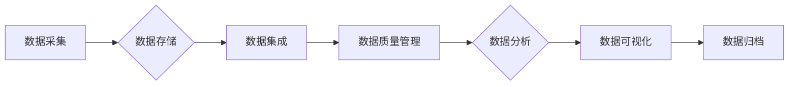

# 数据治理 原理与代码实例讲解

> 关键词：数据治理，数据质量管理，数据仓库，数据湖，数据集成，数据安全，数据生命周期，数据治理工具

## 1. 背景介绍

在当今数据驱动的世界里，数据治理已成为企业数字化转型的核心驱动力。数据治理是指一系列政策、流程和技术的集合，旨在确保数据的质量、安全性、一致性和可用性。随着数据量的激增和复杂性提高，数据治理的重要性日益凸显。本文将深入探讨数据治理的原理，并提供代码实例讲解，帮助读者更好地理解和应用数据治理技术。

### 1.1 问题的由来

随着互联网、物联网和移动设备的发展，企业面临着数据爆炸的挑战。海量数据带来了机遇，但同时也带来了数据质量问题、数据安全风险和数据分析难度等问题。以下是数据治理产生的主要原因：

- 数据质量问题：数据缺失、重复、不一致等问题导致数据分析结果失真。
- 数据安全风险：数据泄露、滥用等问题威胁企业的商业秘密和客户隐私。
- 数据孤岛现象：不同部门之间数据难以共享，导致决策效率低下。
- 数据复杂性：数据类型多样化，处理和分析难度增加。

### 1.2 研究现状

数据治理已成为全球范围内的热门话题。许多企业开始构建数据治理体系，以提升数据质量、保障数据安全、促进数据共享和利用。以下是当前数据治理的研究现状：

- 数据质量管理：通过数据清洗、数据质量评估等技术提升数据质量。
- 数据安全与合规：通过数据加密、访问控制等技术保障数据安全，满足法规要求。
- 数据集成：通过数据集成平台实现不同数据源的数据共享和交换。
- 数据生命周期管理：通过数据生命周期管理工具跟踪数据从产生到消亡的全过程。
- 数据治理工具：提供数据治理流程自动化、数据质量监控、数据安全审计等功能。

### 1.3 研究意义

数据治理对于企业数字化转型具有重要意义：

- 提升数据质量：确保数据分析结果准确可靠，为决策提供有力支持。
- 降低风险：保障数据安全，避免数据泄露和滥用。
- 促进数据共享：打破数据孤岛，提高决策效率。
- 提高效率：自动化数据治理流程，降低人工成本。

### 1.4 本文结构

本文将按照以下结构展开：

- 介绍数据治理的核心概念和联系。
- 讲解数据治理的核心算法原理和具体操作步骤。
- 通过数学模型和公式详细讲解数据治理的相关概念。
- 提供数据治理项目的代码实例和详细解释说明。
- 探讨数据治理的实际应用场景和未来发展趋势。
- 推荐数据治理的学习资源、开发工具和相关论文。
- 总结数据治理的未来发展趋势与挑战。

## 2. 核心概念与联系

### 2.1 核心概念

以下是一些数据治理中的核心概念：

- **数据质量**：数据满足特定业务需求的程度，包括准确性、完整性、一致性、及时性和可靠性。
- **数据安全**：保护数据不被未授权访问、泄露或损坏，确保数据保密性、完整性和可用性。
- **数据集成**：将来自不同来源的数据整合到一个统一的平台或数据仓库中。
- **数据生命周期**：数据从产生到消亡的整个过程，包括数据采集、存储、处理、分析和归档等阶段。
- **数据治理框架**：指导数据治理工作的原则、流程、标准和工具的集合。

### 2.2 Mermaid 流程图

以下是一个数据治理流程的Mermaid流程图：



### 2.3 核心概念联系

数据治理中的核心概念之间存在着紧密的联系。数据采集是数据治理的基础，数据存储和集成是数据流转的桥梁，数据质量是数据治理的核心目标，数据分析和可视化是数据价值实现的手段，数据归档是数据生命周期的最终阶段。

## 3. 核心算法原理 & 具体操作步骤

### 3.1 算法原理概述

数据治理涉及多个算法和工具，以下是一些核心算法原理：

- **数据清洗**：通过填充缺失值、去除重复记录、纠正错误值等方法提高数据质量。
- **数据转换**：将数据转换为统一格式，如将日期格式统一为YYYY-MM-DD。
- **数据集成**：使用ETL（提取、转换、加载）工具将数据从不同源提取、转换并加载到统一的数据仓库。
- **数据质量评估**：通过数据质量指标（如完整性、一致性、准确性等）评估数据质量。
- **数据安全**：使用加密、访问控制和审计等技术保障数据安全。

### 3.2 算法步骤详解

以下是一个数据治理流程的详细步骤：

1. **数据采集**：从各种数据源（如数据库、日志文件、传感器等）采集数据。
2. **数据存储**：将采集到的数据存储在数据仓库或数据湖中。
3. **数据集成**：使用ETL工具将数据从不同源提取、转换并加载到统一的数据平台。
4. **数据质量管理**：使用数据质量工具对数据进行清洗、转换和评估。
5. **数据分析**：使用数据分析工具对数据进行探索性分析和预测性分析。
6. **数据可视化**：使用数据可视化工具将分析结果以图表形式展示。
7. **数据归档**：将不再使用的数据归档存储，以节省存储空间。

### 3.3 算法优缺点

- **数据清洗**：优点是能够显著提高数据质量，缺点是需要大量的人工参与，且可能无法完全解决数据质量问题。
- **数据转换**：优点是能够统一数据格式，缺点是转换规则可能存在错误。
- **数据集成**：优点是能够实现数据共享和交换，缺点是ETL工具使用复杂，且需要定期维护。
- **数据质量评估**：优点是能够实时监控数据质量，缺点是评估指标可能存在主观性。
- **数据安全**：优点是能够保障数据安全，缺点是技术复杂，且需要定期更新安全策略。

### 3.4 算法应用领域

数据治理算法在多个领域得到广泛应用，如：

- 金融服务：风险管理、欺诈检测、客户关系管理。
- 零售：客户行为分析、需求预测、库存管理。
- 制造业：供应链管理、产品质量控制、设备维护。
- 医疗保健：患者数据分析、疾病预测、药物研发。

## 4. 数学模型和公式 & 详细讲解 & 举例说明

### 4.1 数学模型构建

数据治理中的数学模型主要包括以下几种：

- **数据质量指标**：如准确性、完整性、一致性、及时性和可靠性。
- **数据分布**：如正态分布、均匀分布等。
- **聚类算法**：如K-means、层次聚类等。

### 4.2 公式推导过程

以下是一个数据质量指标的例子：

$$
\text{数据质量指标} = \frac{\text{实际值} - \text{期望值}}{\text{标准差}}
$$

其中，实际值是数据观测值，期望值是数据期望值，标准差是数据标准差。

### 4.3 案例分析与讲解

以下是一个数据质量分析的例子：

假设我们有一个包含客户信息的数据库，其中包含年龄、收入和购买行为等字段。我们需要分析年龄字段的数据质量。

1. **数据清洗**：去除缺失值和异常值。
2. **数据转换**：将年龄转换为年龄区间（如18-25岁、26-35岁等）。
3. **数据分布**：分析年龄区间的分布情况。
4. **数据质量评估**：计算年龄区间的标准差和异常值比例。

通过以上分析，我们可以了解客户年龄数据的分布情况，以及数据质量的好坏。

## 5. 项目实践：代码实例和详细解释说明

### 5.1 开发环境搭建

以下是使用Python进行数据治理项目开发的环境搭建步骤：

1. 安装Python和pip：从Python官网下载并安装Python和pip。
2. 安装必要的库：使用pip安装pandas、numpy、sqlalchemy、pyspark等库。

### 5.2 源代码详细实现

以下是一个数据清洗和转换的Python代码实例：

```python
import pandas as pd

# 读取数据
df = pd.read_csv('customer_data.csv')

# 去除缺失值
df.dropna(inplace=True)

# 转换年龄字段
def age_to_interval(age):
    if age < 18:
        return '18岁以下'
    elif age < 26:
        return '18-25岁'
    elif age < 36:
        return '26-35岁'
    else:
        return '35岁以上'

df['age_interval'] = df['age'].apply(age_to_interval)

# 输出结果
print(df)
```

### 5.3 代码解读与分析

上述代码首先读取一个CSV文件，然后去除缺失值，接着将年龄字段转换为年龄区间，最后输出结果。

### 5.4 运行结果展示

运行上述代码后，我们将得到一个包含清洗和转换后的客户数据的新DataFrame。

## 6. 实际应用场景

### 6.1 数据质量管理

数据质量管理是企业数据治理的重要环节。以下是一些数据质量管理应用场景：

- **客户关系管理**：通过分析客户数据，识别潜在客户，提高客户满意度。
- **供应链管理**：通过分析供应商数据，优化供应链流程，降低成本。
- **风险管理**：通过分析风险数据，识别潜在风险，制定风险管理策略。

### 6.2 数据安全与合规

数据安全与合规是数据治理的另一重要方面。以下是一些数据安全与合规应用场景：

- **数据加密**：对敏感数据进行加密，防止数据泄露。
- **访问控制**：根据用户角色和权限控制数据访问。
- **审计**：对数据访问进行审计，确保数据安全。

### 6.3 数据集成

数据集成是数据治理的关键环节。以下是一些数据集成应用场景：

- **数据仓库**：将来自不同源的数据整合到一个数据仓库中，方便数据分析和报告。
- **数据湖**：将不同类型的数据存储在一个数据湖中，方便后续处理和分析。

### 6.4 未来应用展望

随着大数据技术和人工智能的不断发展，数据治理将在以下方面得到进一步发展：

- **自动化数据治理**：使用自动化工具提高数据治理效率。
- **智能化数据治理**：利用人工智能技术优化数据治理流程。
- **数据治理标准化**：制定数据治理标准和规范。

## 7. 工具和资源推荐

### 7.1 学习资源推荐

以下是一些数据治理学习资源：

- 《数据治理实践指南》
- 《数据质量管理》
- 《数据仓库》
- 《数据湖》

### 7.2 开发工具推荐

以下是一些数据治理开发工具：

- Apache NiFi
- Apache Kafka
- Apache Spark
- Talend

### 7.3 相关论文推荐

以下是一些数据治理相关论文：

- **《Data Governance: An Integrated Framework for Managing Data as an Asset》**
- **《Data Quality: Concepts and Techniques for Managing Your Data in an Information-Based Economy》**
- **《Big Data: A Revolution That Will Transform How We Live, Work, and Think》**

## 8. 总结：未来发展趋势与挑战

### 8.1 研究成果总结

本文深入探讨了数据治理的原理、算法和应用场景，为读者提供了全面的数据治理知识体系。数据治理已成为企业数字化转型的核心驱动力，对于提升数据质量、保障数据安全、促进数据共享和利用具有重要意义。

### 8.2 未来发展趋势

随着大数据技术和人工智能的不断发展，数据治理将呈现以下发展趋势：

- 自动化数据治理
- 智能化数据治理
- 数据治理标准化

### 8.3 面临的挑战

尽管数据治理取得了显著成果，但仍面临以下挑战：

- 数据质量提升难度大
- 数据安全风险增加
- 数据治理团队人才短缺

### 8.4 研究展望

未来，数据治理研究将重点关注以下方向：

- 开发更有效的数据质量提升方法
- 加强数据安全保障
- 培养数据治理人才

## 9. 附录：常见问题与解答

**Q1：数据治理和数据质量管理有什么区别？**

A：数据治理是指一系列政策、流程和技术的集合，旨在确保数据的质量、安全性、一致性和可用性。数据质量管理是数据治理的一部分，专注于提升数据质量，包括数据清洗、数据质量评估等。

**Q2：数据治理的目的是什么？**

A：数据治理的目的是提升数据质量、保障数据安全、促进数据共享和利用，为企业数字化转型提供有力支持。

**Q3：如何保障数据安全？**

A：通过数据加密、访问控制、审计等技术保障数据安全，防止数据泄露和滥用。

**Q4：数据治理团队需要具备哪些技能？**

A：数据治理团队需要具备以下技能：
- 数据管理知识
- 数据分析能力
- 项目管理能力
- 沟通协调能力

**Q5：数据治理工具有哪些类型？**

A：数据治理工具有多种类型，如数据质量管理工具、数据集成工具、数据仓库工具等。

---

作者：禅与计算机程序设计艺术 / Zen and the Art of Computer Programming