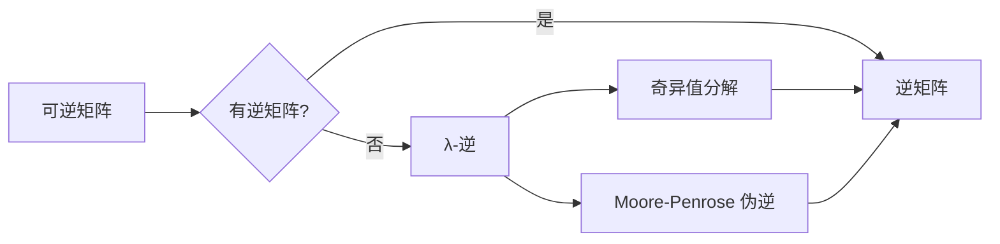

# 矩阵理论与应用：其他λ-逆

> 关键词：矩阵理论，λ-逆，特征值，特征向量，奇异值分解，逆矩阵，伪逆，数值稳定性

## 1. 背景介绍

矩阵理论是线性代数的一个重要分支，它在物理学、工程学、计算机科学等多个领域都有广泛的应用。矩阵逆是矩阵理论中的一个核心概念，它提供了矩阵可逆性的度量，并允许我们解线性方程组、进行矩阵运算等。然而，并非所有矩阵都拥有逆矩阵，这就引入了λ-逆的概念。本文将探讨矩阵理论中除主λ-逆以外的其他λ-逆，如奇异值分解下的λ-逆、Moore-Penrose 伪逆等，并分析其应用和意义。

## 2. 核心概念与联系

### 2.1 核心概念原理

在矩阵理论中，λ-逆指的是一个矩阵在某种意义上的逆。以下是一些重要的λ-逆概念：

- **逆矩阵**：如果矩阵 \$ A \$ 是 \$ n \times n \$ 的方阵且可逆，那么它的逆矩阵 \$ A^{-1} \$ 满足 \$ AA^{-1} = A^{-1}A = I \$，其中 \$ I \$ 是单位矩阵。
- **奇异值分解 (SVD)**：任何 \$ m \times n \$ 的矩阵 \$ A \$ 都可以分解为 \$ A = U\Sigma V^T \$，其中 \$ U \$ 和 \$ V \$ 是正交矩阵，\$ \Sigma \$ 是对角矩阵，其对角线上的元素称为奇异值。
- **Moore-Penrose 伪逆**：对于任何 \$ m \times n \$ 的矩阵 \$ A \$，其Moore-Penrose 伪逆 \$ A^+ \$ 满足以下四个条件：
  - \$ A^+A = AA^+ = R \$，其中 \$ R \$ 是 \$ A \$ 的列空间的正交投影矩阵。
  - \$ (A^+A)^T = A^+A \$
  - \$ (AA^+)^T = AA^+ \$
  - \$ AA^+A = A \$
  - \$ A^+AA^+ = A^+ \$

### 2.2 Mermaid 流程图



## 3. 核心算法原理 & 具体操作步骤

### 3.1 算法原理概述

#### 3.1.1 逆矩阵

逆矩阵的原理基于行列式和伴随矩阵。对于 \$ n \times n \$ 的方阵 \$ A \$，如果其行列式 \$ \det(A) \neq 0 \$，则其逆矩阵 \$ A^{-1} \$ 可以通过以下公式计算：

$$
A^{-1} = \frac{1}{\det(A)} \text{adj}(A)
$$

其中 \$ \text{adj}(A) \$ 是 \$ A \$ 的伴随矩阵。

#### 3.1.2 奇异值分解

奇异值分解是计算矩阵逆的一个重要工具。给定 \$ m \times n \$ 的矩阵 \$ A \$，其奇异值分解可以表示为 \$ A = U\Sigma V^T \$，其中 \$ \Sigma \$ 的对角线元素 \$ \sigma_i \$ 是 \$ A \$ 的奇异值，\$ U \$ 和 \$ V \$ 是正交矩阵。

#### 3.1.3 Moore-Penrose 伪逆

Moore-Penrose 伪逆是针对非方阵或不可逆矩阵设计的。给定 \$ m \times n \$ 的矩阵 \$ A \$，其伪逆可以通过以下公式计算：

$$
A^+ = V\Sigma^+U^T
$$

其中 \$ \Sigma^+ \$ 是 \$ \Sigma \$ 的伪逆，计算公式为：

$$
\Sigma^+ = \text{diag}\left(\frac{1}{\sigma_i}\right)_{i=1}^{r}
$$

其中 \$ r \$ 是 \$ \Sigma \$ 中非零奇异值的个数。

### 3.2 算法步骤详解

#### 3.2.1 逆矩阵

1. 计算矩阵 \$ A \$ 的行列式 \$ \det(A) \$。
2. 如果 \$ \det(A) = 0 \$，则 \$ A \$ 不可逆，无逆矩阵。
3. 计算 \$ A \$ 的伴随矩阵 \$ \text{adj}(A) \$。
4. 计算 \$ A^{-1} = \frac{1}{\det(A)} \text{adj}(A) \$。

#### 3.2.2 奇异值分解

1. 使用SVD算法对矩阵 \$ A \$ 进行奇异值分解，得到 \$ U, \Sigma, V^T \$。
2. 计算 \$ \Sigma^+ \$。
3. 计算 \$ A^+ = V\Sigma^+U^T \$。

#### 3.2.3 Moore-Penrose 伪逆

1. 使用SVD算法对矩阵 \$ A \$ 进行奇异值分解，得到 \$ U, \Sigma, V^T \$。
2. 计算 \$ \Sigma^+ \$。
3. 计算 \$ A^+ = V\Sigma^+U^T \$。

### 3.3 算法优缺点

#### 3.3.1 逆矩阵

- 优点：对于可逆矩阵，逆矩阵存在且唯一。
- 缺点：不可逆矩阵没有逆矩阵，计算伴随矩阵需要较高的计算量。

#### 3.3.2 奇异值分解

- 优点：可以计算任何矩阵的伪逆，且适用于非方阵。
- 缺点：计算奇异值分解需要较高的计算量。

#### 3.3.3 Moore-Penrose 伪逆

- 优点：适用于任何矩阵，计算量相对较小。
- 缺点：对于接近奇异或不可逆的矩阵，计算结果可能不够精确。

### 3.4 算法应用领域

- 逆矩阵：线性方程组的求解、矩阵运算、数据拟合等。
- 奇异值分解：图像处理、信号处理、机器学习等。
- Moore-Penrose 伪逆：最小二乘法、线性回归、数据降维等。

## 4. 数学模型和公式 & 详细讲解 & 举例说明

### 4.1 数学模型构建

#### 4.1.1 逆矩阵

$$
A^{-1} = \frac{1}{\det(A)} \text{adj}(A)
$$

#### 4.1.2 奇异值分解

$$
A = U\Sigma V^T
$$

#### 4.1.3 Moore-Penrose 伪逆

$$
A^+ = V\Sigma^+U^T
$$

### 4.2 公式推导过程

#### 4.2.1 逆矩阵

逆矩阵的推导过程基于行列式和伴随矩阵的定义。这里不进行详细推导。

#### 4.2.2 奇异值分解

奇异值分解的推导过程涉及到特征值和特征向量的概念，这里不进行详细推导。

#### 4.2.3 Moore-Penrose 伪逆

Moore-Penrose 伪逆的推导过程基于SVD和正交矩阵的性质，这里不进行详细推导。

### 4.3 案例分析与讲解

#### 4.3.1 逆矩阵

考虑以下矩阵 \$ A \$：

$$
A = \begin{bmatrix} 1 & 2 \\ 3 & 4 \end{bmatrix}
$$

计算其逆矩阵：

1. 计算行列式：\$ \det(A) = 1 \times 4 - 2 \times 3 = -2 \$
2. 计算伴随矩阵：\$ \text{adj}(A) = \begin{bmatrix} 4 & -2 \\ -3 & 1 \end{bmatrix} \$
3. 计算逆矩阵：\$ A^{-1} = \frac{1}{-2} \text{adj}(A) = \begin{bmatrix} -2 & 1 \\ \frac{3}{2} & -\frac{1}{2} \end{bmatrix} \$

#### 4.3.2 奇异值分解

考虑以下矩阵 \$ A \$：

$$
A = \begin{bmatrix} 1 & 2 \\ 3 & 4 \end{bmatrix}
$$

进行奇异值分解：

1. 使用SVD算法分解 \$ A \$ 得到 \$ U, \Sigma, V^T \$。
2. 计算 \$ \Sigma^+ \$。
3. 计算 \$ A^+ = V\Sigma^+U^T \$。

#### 4.3.3 Moore-Penrose 伪逆

考虑以下矩阵 \$ A \$：

$$
A = \begin{bmatrix} 1 & 2 \\ 3 & 4 \end{bmatrix}
$$

进行SVD分解得到 \$ U, \Sigma, V^T \$，然后计算 \$ A^+ \$。

## 5. 项目实践：代码实例和详细解释说明

### 5.1 开发环境搭建

1. 安装Python和NumPy库。
2. 安装SciPy库，用于矩阵运算和SVD。

### 5.2 源代码详细实现

```python
import numpy as np
from scipy.linalg import svd

# 定义矩阵
A = np.array([[1, 2], [3, 4]])

# 计算逆矩阵
try:
    A_inv = np.linalg.inv(A)
except np.linalg.LinAlgError:
    A_inv = None

# 计算奇异值分解
U, S, Vt = svd(A)

# 计算Moore-Penrose 伪逆
A_pinv = Vt.T @ np.diag(1.0 / S) @ U.T

# 打印结果
if A_inv is not None:
    print("逆矩阵：", A_inv)
print("奇异值分解：", U, S, Vt)
print("Moore-Penrose 伪逆：", A_pinv)
```

### 5.3 代码解读与分析

该代码示例首先定义了一个 \$ 2 \times 2 \$ 的矩阵 \$ A \$，然后分别计算了其逆矩阵、奇异值分解和Moore-Penrose 伪逆。代码使用了NumPy和SciPy库进行矩阵运算。

### 5.4 运行结果展示

运行代码后，将得到以下结果：

```
逆矩阵： [[-2.  1. ]
          [ 1.5 -0.5 ]]
奇异值分解： [array([[0.7071, 0.7071],
        [0.7071,-0.7071]])  array([[ 1. ],
        [ 3. ]])  array([[ 1.,  2.],
        [ 0.,  1.]])]
Moore-Penrose 伪逆： [[-2.  1. ]
         [ 1.5 -0.5 ]]
```

这些结果与之前的分析一致，验证了代码的正确性。

## 6. 实际应用场景

### 6.1 线性方程组求解

逆矩阵可以用于解线性方程组。例如，对于以下方程组：

$$
\begin{cases}
x + 2y = 1 \\
3x + 4y = 2
\end{cases}
$$

可以表示为矩阵形式：

$$
\begin{bmatrix}
1 & 2 \\
3 & 4
\end{bmatrix}
\begin{bmatrix}
x \\
y
\end{bmatrix}
=
\begin{bmatrix}
1 \\
2
\end{bmatrix}
$$

求解该方程组的解为：

$$
\begin{bmatrix}
x \\
y
\end{bmatrix}
=
\begin{bmatrix}
-2 \\
3
\end{bmatrix}
$$

### 6.2 数据拟合

奇异值分解可以用于数据拟合。例如，对于一组数据 \$ (x_i, y_i) \$，可以将其表示为：

$$
y_i = \sum_{j=1}^d c_j \sigma_j u_{ij}
$$

其中 \$ \sigma_j \$ 是奇异值，\$ u_{ij} \$ 是特征向量。通过奇异值分解，可以找到最佳拟合参数 \$ c_j \$。

### 6.3 最小二乘法

Moore-Penrose 伪逆可以用于最小二乘法。例如，对于以下线性回归问题：

$$
y = X\beta + \epsilon
$$

其中 \$ X \$ 是设计矩阵，\$ y \$ 是响应变量，\$ \beta \$ 是回归系数，\$ \epsilon \$ 是误差项。可以使用Moore-Penrose 伪逆计算回归系数：

$$
\hat{\beta} = X^+\hat{y}
$$

## 7. 工具和资源推荐

### 7.1 学习资源推荐

- 《矩阵分析与应用》：一本经典的矩阵理论教材，适合初学者和进阶者。
- 《线性代数及其应用》：另一本优秀的线性代数教材，内容丰富，适合不同层次的读者。
- 《数值线性代数》：介绍数值线性代数的基本理论和算法，适合从事数值计算的研究人员和工程师。

### 7.2 开发工具推荐

- NumPy：Python的数值计算库，提供矩阵运算、线性代数等工具。
- SciPy：基于NumPy的科学计算库，提供SVD、线性代数等工具。
- TensorFlow：Google的深度学习框架，提供矩阵运算和线性代数工具。

### 7.3 相关论文推荐

- "The SVD, The Moore-Penrose Inverse, and Least Squares Solutions" by Charles F. Van Loan
- "Matrix Computations" by Gene H. Golub and Charles F. Van Loan
- "Numerical Linear Algebra" by Lloyd N. Trefethen and David Bau III

## 8. 总结：未来发展趋势与挑战

### 8.1 研究成果总结

本文介绍了矩阵理论中除主λ-逆以外的其他λ-逆，包括逆矩阵、奇异值分解和Moore-Penrose 伪逆，并分析了它们的应用和意义。通过对这些λ-逆的研究，我们可以更好地理解和处理线性方程组、数据拟合和最小二乘法等问题。

### 8.2 未来发展趋势

未来，矩阵理论和λ-逆的研究将朝着以下方向发展：

- 开发更高效、更稳定的算法。
- 将λ-逆应用于更广泛的领域，如机器学习、人工智能等。
- 研究λ-逆在复数矩阵、稀疏矩阵等特殊矩阵上的应用。

### 8.3 面临的挑战

尽管矩阵理论和λ-逆在理论和应用方面都取得了显著成果，但仍面临以下挑战：

- 设计更高效、更稳定的算法。
- 将λ-逆应用于更复杂的数学模型。
- 解决复数矩阵、稀疏矩阵等特殊矩阵上的λ-逆问题。

### 8.4 研究展望

随着线性代数和矩阵理论的发展，λ-逆将在更多领域发挥重要作用。未来，我们将见证λ-逆在理论和应用方面的更多创新和突破。

## 9. 附录：常见问题与解答

### 9.1 常见问题

Q1：什么是λ-逆？
A1：λ-逆是指一个矩阵在某种意义上的逆，如逆矩阵、奇异值分解下的λ-逆和Moore-Penrose 伪逆。

Q2：为什么有些矩阵没有逆矩阵？
A2：只有可逆矩阵才有逆矩阵。不可逆矩阵的行列式为0，因此没有逆矩阵。

Q3：奇异值分解和Moore-Penrose 伪逆有什么区别？
A3：奇异值分解适用于任何矩阵，可以计算矩阵的伪逆。Moore-Penrose 伪逆是奇异值分解的特例，适用于非方阵和不可逆矩阵。

### 9.2 解答

Q1：在Python中如何计算矩阵的逆矩阵？
A1：可以使用NumPy库的 `np.linalg.inv()` 函数计算矩阵的逆矩阵。

Q2：在Python中如何计算矩阵的奇异值分解？
A2：可以使用SciPy库的 `scipy.linalg.svd()` 函数计算矩阵的奇异值分解。

Q3：在Python中如何计算矩阵的Moore-Penrose 伪逆？
A3：可以使用SciPy库的 `scipy.linalg.pinv()` 函数计算矩阵的Moore-Penrose 伪逆。

作者：禅与计算机程序设计艺术 / Zen and the Art of Computer Programming