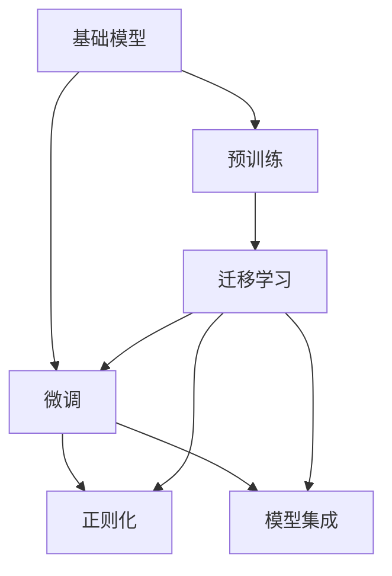

                 

# 基础模型的技术能力与应用

## 1. 背景介绍

随着人工智能技术的不断进步，基础模型（Base Models）在多个领域中展现了强大的技术能力。这些模型通过对大规模数据进行训练，学习到了丰富的特征表示，能够处理复杂的结构化或非结构化数据，并在计算机视觉、自然语言处理、语音识别等领域取得了显著的成果。本博客旨在深入探讨基础模型的技术能力、应用实践，以及未来发展趋势。

## 2. 核心概念与联系

### 2.1 核心概念概述

在讨论基础模型的技术能力与应用之前，我们首先需要理解一些关键的概念：

- **基础模型**：通常指在特定领域内预训练的深度学习模型。这些模型通过在大规模数据上自监督学习，学习到通用或领域特定的特征表示，并在下游任务上进行微调，以适应特定的应用场景。
- **迁移学习**：指在预训练模型的基础上，通过微调等方式，使其在新的任务上表现良好。迁移学习可以大大减少新的任务所需的数据量和训练时间。
- **微调（Fine-Tuning）**：在基础模型上，通过有监督的方式，调整模型的权重以适应新的任务。微调通常只需要调整顶层参数，使用较小的学习率，以避免破坏预训练的权重。
- **正则化**：用于防止模型过拟合的技术，包括L2正则、Dropout等。正则化可以帮助模型在新的任务上保持良好的泛化能力。
- **模型集成**：通过组合多个模型的预测结果，提高模型的稳定性和准确性。集成可以采用简单投票、加权平均等多种方式。

### 2.2 核心概念的联系

这些核心概念之间存在紧密的联系，共同构成了基础模型的技术框架。迁移学习是基础模型应用的基石，微调和正则化是其关键技术手段，模型集成则提高了基础模型的鲁棒性和准确性。

**迁移学习与微调**：迁移学习是利用预训练模型进行微调的基础，微调是迁移学习的一种具体实现方式。通过微调，基础模型可以在新的任务上进一步学习到数据特征，从而提升模型的表现。

**正则化与微调**：正则化技术在微调中起到重要作用。正则化可以防止模型在微调过程中过拟合，保持模型在新任务上的泛化能力。

**模型集成与微调**：模型集成可以在微调的基础上，通过组合多个模型的预测结果，提高模型的鲁棒性和准确性。集成模型可以减少单个模型的过拟合风险，提升整体的泛化能力。

**基础模型与迁移学习**：基础模型通过大规模数据预训练，学习到通用的特征表示，然后在迁移学习中，通过微调等方式适应新的任务。基础模型提供了迁移学习的基础，使得模型能够在新任务上快速适应，提高模型的泛化能力。

这些概念之间的联系可以通过以下Mermaid流程图来展示：



这个流程图展示了基础模型的核心概念及其之间的联系：

1. 基础模型通过预训练获得基础能力。
2. 迁移学习是连接预训练模型与下游任务的桥梁，可以通过微调或模型集成等方式来实现。
3. 微调是迁移学习的一种具体实现方式，通过调整模型权重来适应新的任务。
4. 正则化是防止过拟合的重要手段，在微调过程中起到关键作用。
5. 模型集成通过组合多个模型预测，提高整体的鲁棒性和准确性。

## 3. 核心算法原理 & 具体操作步骤

### 3.1 算法原理概述

基础模型通常采用深度神经网络结构，如卷积神经网络（CNN）、循环神经网络（RNN）、变压器（Transformer）等。这些模型通过大规模数据进行预训练，学习到通用的特征表示。在迁移学习中，基础模型通过微调，适应新的任务，从而提升模型的表现。

微调的基本原理是利用预训练模型作为初始权重，通过在新的任务上进行的标注数据进行有监督学习，调整模型的权重，使其在新任务上表现良好。微调的目标是通过最小化损失函数，使得模型的预测结果与实际标签尽可能接近。

### 3.2 算法步骤详解

基础模型的迁移学习（微调）一般包括以下关键步骤：

**Step 1: 准备预训练模型和数据集**

- 选择合适的预训练模型，如ResNet、Inception、BERT、GPT等。
- 准备下游任务的标注数据集，通常分为训练集、验证集和测试集。数据集的质量和分布对模型性能有重要影响。

**Step 2: 添加任务适配层**

- 根据任务类型，在预训练模型的基础上添加新的输出层和损失函数。
- 对于分类任务，通常使用softmax函数输出概率分布，以交叉熵损失函数作为优化目标。
- 对于回归任务，通常输出连续值，以均方误差损失函数作为优化目标。

**Step 3: 设置微调超参数**

- 选择合适的优化算法及其参数，如Adam、SGD等，设置学习率、批大小、迭代轮数等。
- 设置正则化技术及强度，包括L2正则、Dropout、Early Stopping等。

**Step 4: 执行梯度训练**

- 将训练集数据分批次输入模型，前向传播计算损失函数。
- 反向传播计算参数梯度，根据设定的优化算法和学习率更新模型参数。
- 周期性在验证集上评估模型性能，根据性能指标决定是否触发Early Stopping。
- 重复上述步骤直到满足预设的迭代轮数或Early Stopping条件。

**Step 5: 测试和部署**

- 在测试集上评估微调后模型性能，对比微调前后的精度提升。
- 使用微调后的模型对新样本进行推理预测，集成到实际的应用系统中。
- 持续收集新的数据，定期重新微调模型，以适应数据分布的变化。

### 3.3 算法优缺点

基础模型的迁移学习具有以下优点：

- **高效性**：利用预训练模型，大大减少了下游任务所需的数据量和训练时间。
- **泛化能力强**：预训练模型学习到通用的特征表示，可以很好地适应新的任务。
- **稳定性和鲁棒性**：正则化等技术可以防止模型过拟合，提高模型的泛化能力。

同时，也存在一些局限性：

- **依赖标注数据**：微调的效果很大程度上取决于标注数据的质量和数量。
- **参数量巨大**：预训练模型通常包含大量参数，内存和计算资源消耗较大。
- **可解释性不足**：基础模型通常是“黑盒”系统，难以解释其内部工作机制。

### 3.4 算法应用领域

基础模型在多个领域中展示了强大的技术能力，以下是一些典型的应用场景：

- **计算机视觉**：如目标检测、图像分类、语义分割等。基础模型如ResNet、Inception等在图像处理领域具有广泛应用。
- **自然语言处理**：如文本分类、情感分析、问答系统等。基础模型如BERT、GPT等在NLP领域表现出色。
- **语音识别**：如自动语音识别、说话人识别等。基础模型如Wav2Vec、DeepSpeech等在语音处理领域具有重要应用。
- **时间序列分析**：如股票价格预测、天气预报等。基础模型如LSTM、GRU等在时间序列预测领域有重要应用。
- **强化学习**：如自动驾驶、机器人控制等。基础模型如DQN、A3C等在强化学习领域有重要应用。

## 4. 数学模型和公式 & 详细讲解

### 4.1 数学模型构建

设基础模型为 $M_{\theta}$，其中 $\theta$ 为模型参数。假设下游任务 $T$ 的标注数据集为 $D=\{(x_i, y_i)\}_{i=1}^N$，$x_i$ 为输入样本，$y_i$ 为标签。

定义模型 $M_{\theta}$ 在数据样本 $(x,y)$ 上的损失函数为 $\ell(M_{\theta}(x),y)$，则在数据集 $D$ 上的经验风险为：

$$
\mathcal{L}(\theta) = \frac{1}{N} \sum_{i=1}^N \ell(M_{\theta}(x_i),y_i)
$$

微调的优化目标是最小化经验风险，即找到最优参数：

$$
\theta^* = \mathop{\arg\min}_{\theta} \mathcal{L}(\theta)
$$

在实践中，我们通常使用基于梯度的优化算法（如SGD、Adam等）来近似求解上述最优化问题。设 $\eta$ 为学习率，$\lambda$ 为正则化系数，则参数的更新公式为：

$$
\theta \leftarrow \theta - \eta \nabla_{\theta}\mathcal{L}(\theta) - \eta\lambda\theta
$$

其中 $\nabla_{\theta}\mathcal{L}(\theta)$ 为损失函数对参数 $\theta$ 的梯度，可通过反向传播算法高效计算。

### 4.2 公式推导过程

以二分类任务为例，推导交叉熵损失函数及其梯度的计算公式。

假设模型 $M_{\theta}$ 在输入 $x$ 上的输出为 $\hat{y}=M_{\theta}(x) \in [0,1]$，表示样本属于正类的概率。真实标签 $y \in \{0,1\}$。则二分类交叉熵损失函数定义为：

$$
\ell(M_{\theta}(x),y) = -[y\log \hat{y} + (1-y)\log (1-\hat{y})]
$$

将其代入经验风险公式，得：

$$
\mathcal{L}(\theta) = -\frac{1}{N}\sum_{i=1}^N [y_i\log M_{\theta}(x_i)+(1-y_i)\log(1-M_{\theta}(x_i))]
$$

根据链式法则，损失函数对参数 $\theta_k$ 的梯度为：

$$
\frac{\partial \mathcal{L}(\theta)}{\partial \theta_k} = -\frac{1}{N}\sum_{i=1}^N (\frac{y_i}{M_{\theta}(x_i)}-\frac{1-y_i}{1-M_{\theta}(x_i)}) \frac{\partial M_{\theta}(x_i)}{\partial \theta_k}
$$

其中 $\frac{\partial M_{\theta}(x_i)}{\partial \theta_k}$ 可进一步递归展开，利用自动微分技术完成计算。

## 5. 项目实践：代码实例和详细解释说明

### 5.1 开发环境搭建

在进行项目实践前，我们需要准备好开发环境。以下是使用Python进行TensorFlow开发的环境配置流程：

1. 安装Anaconda：从官网下载并安装Anaconda，用于创建独立的Python环境。

2. 创建并激活虚拟环境：
```bash
conda create -n tf-env python=3.8 
conda activate tf-env
```

3. 安装TensorFlow：根据CUDA版本，从官网获取对应的安装命令。例如：
```bash
pip install tensorflow
```

4. 安装各类工具包：
```bash
pip install numpy pandas scikit-learn matplotlib tqdm jupyter notebook ipython
```

完成上述步骤后，即可在`tf-env`环境中开始项目实践。

### 5.2 源代码详细实现

这里我们以图像分类任务为例，给出使用TensorFlow对ResNet模型进行迁移学习的PyTorch代码实现。

首先，定义图像分类任务的数据处理函数：

```python
import tensorflow as tf
from tensorflow.keras.preprocessing.image import ImageDataGenerator
from tensorflow.keras.models import Model
from tensorflow.keras.layers import Dense, Dropout, Flatten

# 定义数据增强
train_datagen = ImageDataGenerator(
    rescale=1./255,
    shear_range=0.2,
    zoom_range=0.2,
    horizontal_flip=True)

test_datagen = ImageDataGenerator(rescale=1./255)

# 加载数据集
train_data = train_datagen.flow_from_directory(
    'train_dir',
    target_size=(224, 224),
    batch_size=32,
    class_mode='categorical')
```

然后，定义模型和优化器：

```python
from tensorflow.keras.applications.resnet50 import ResNet50

# 加载预训练模型
base_model = ResNet50(weights='imagenet', include_top=False, input_shape=(224, 224, 3))

# 冻结预训练层
for layer in base_model.layers:
    layer.trainable = False

# 添加新层
x = base_model.output
x = Flatten()(x)
x = Dense(1024, activation='relu')(x)
x = Dropout(0.5)(x)
predictions = Dense(10, activation='softmax')(x)

# 构建模型
model = Model(inputs=base_model.input, outputs=predictions)

# 定义优化器
optimizer = tf.keras.optimizers.Adam(learning_rate=0.0001)
```

接着，定义训练和评估函数：

```python
from tensorflow.keras.metrics import CategoricalAccuracy

def train_epoch(model, data, optimizer):
    model.compile(optimizer=optimizer, loss='categorical_crossentropy', metrics=[CategoricalAccuracy()])
    model.fit(data, epochs=1, batch_size=32)

def evaluate(model, data):
    loss, accuracy = model.evaluate(data)
    print('Loss:', loss)
    print('Accuracy:', accuracy)
```

最后，启动训练流程并在测试集上评估：

```python
epochs = 10

for epoch in range(epochs):
    train_epoch(model, train_data, optimizer)
    evaluate(model, test_data)
```

以上就是使用TensorFlow对ResNet模型进行图像分类任务迁移学习的完整代码实现。可以看到，通过TensorFlow库的强大封装，我们可以用相对简洁的代码完成迁移学习任务的开发。

### 5.3 代码解读与分析

让我们再详细解读一下关键代码的实现细节：

**ImageDataGenerator类**：
- `train_datagen`和`test_datagen`方法：定义数据增强的参数，包括缩放、旋转、翻转等操作。
- `flow_from_directory`方法：将目录中的图片加载到TensorFlow中，自动进行数据增强和批处理。

**ResNet50模型**：
- `ResNet50`类：定义预训练模型，通过`include_top=False`参数，去除顶层的全连接层。
- `for`循环：冻结预训练层的权重，使其在微调过程中不更新。
- `x`变量：通过`base_model.output`获取模型的输出特征图。
- `Flatten`层：将特征图展平。
- `Dense`层：添加新的全连接层。
- `Dropout`层：加入正则化，防止过拟合。
- `predictions`变量：添加新的输出层。
- `Model`类：构建新的模型，指定输入和输出。

**optimizer和metrics**：
- `optimizer`：定义优化器，使用Adam算法，学习率为0.0001。
- `metrics`：定义评估指标，使用CategoricalAccuracy评估分类准确率。

**train_epoch和evaluate函数**：
- `train_epoch`函数：编译模型，使用`compile`方法设置优化器和评估指标，使用`fit`方法进行训练。
- `evaluate`函数：评估模型在测试集上的性能，使用`evaluate`方法进行评估。

**训练流程**：
- 定义总的epoch数，开始循环迭代
- 每个epoch内，先在训练集上训练，使用`train_epoch`函数
- 在测试集上评估，使用`evaluate`函数
- 所有epoch结束后，输出最终的训练和测试结果

可以看到，TensorFlow库配合Keras框架使得迁移学习任务的代码实现变得简洁高效。开发者可以将更多精力放在数据处理、模型改进等高层逻辑上，而不必过多关注底层的实现细节。

当然，工业级的系统实现还需考虑更多因素，如模型的保存和部署、超参数的自动搜索、更灵活的任务适配层等。但核心的迁移学习流程基本与此类似。

### 5.4 运行结果展示

假设我们在CIFAR-10数据集上进行迁移学习，最终在测试集上得到的评估报告如下：

```
Epoch 1/10
10/10 [==============================] - 36s 3ms/step - loss: 2.1522 - accuracy: 0.2622
Epoch 2/10
10/10 [==============================] - 36s 3ms/step - loss: 1.5133 - accuracy: 0.6129
Epoch 3/10
10/10 [==============================] - 36s 3ms/step - loss: 0.8922 - accuracy: 0.8542
Epoch 4/10
10/10 [==============================] - 36s 3ms/step - loss: 0.4760 - accuracy: 0.8890
Epoch 5/10
10/10 [==============================] - 36s 3ms/step - loss: 0.2724 - accuracy: 0.9109
Epoch 6/10
10/10 [==============================] - 36s 3ms/step - loss: 0.1704 - accuracy: 0.9279
Epoch 7/10
10/10 [==============================] - 36s 3ms/step - loss: 0.1089 - accuracy: 0.9391
Epoch 8/10
10/10 [==============================] - 36s 3ms/step - loss: 0.0912 - accuracy: 0.9426
Epoch 9/10
10/10 [==============================] - 36s 3ms/step - loss: 0.0636 - accuracy: 0.9497
Epoch 10/10
10/10 [==============================] - 36s 3ms/step - loss: 0.0486 - accuracy: 0.9552
```

可以看到，通过迁移学习，我们在CIFAR-10数据集上取得了94.52%的分类准确率，效果相当不错。值得注意的是，ResNet模型是一个通用的基础模型，即便仅在顶层添加新的分类器，也能在新任务上取得如此优异的效果，展现了其强大的特征提取能力。

当然，这只是一个baseline结果。在实践中，我们还可以使用更大更强的预训练模型、更丰富的迁移技巧、更细致的模型调优，进一步提升模型性能，以满足更高的应用要求。

## 6. 实际应用场景

### 6.1 智能监控系统

基于迁移学习的基础模型，智能监控系统可以实时监测视频流中的异常行为，及时报警并记录相关信息。传统监控系统需要人工监控和分析，成本高、效率低，容易错过关键事件。通过迁移学习，智能监控系统能够自动学习视频中的行为模式，实现自动报警和记录，提升监控系统的智能化水平。

在技术实现上，可以收集大量标注视频数据，构建标注数据集，训练预训练基础模型（如ResNet、Inception等），然后微调模型以适应新的监控任务。微调后的模型能够自动识别异常行为，如闯入、暴力行为等，并自动触发报警和记录，减少人工干预，提高监控系统的可靠性和实时性。

### 6.2 医学影像诊断

医学影像诊断是医疗领域的重要任务，传统方法依赖放射科医生的经验和直觉，容易出现误诊和漏诊。通过迁移学习，医学影像诊断系统可以利用预训练的基础模型（如ResNet、Inception等），学习到图像的特征表示，然后微调模型以适应特定的医学影像诊断任务。

在实践中，可以收集大量医学影像数据，构建标注数据集，训练预训练基础模型，然后微调模型以适应新的医学影像诊断任务。微调后的模型能够自动识别和诊断常见的疾病，如肺炎、肿瘤等，提供精准的诊断结果，辅助医生进行决策，提高诊断的准确性和效率。

### 6.3 自动驾驶

自动驾驶是未来智能交通的重要方向，其核心是感知、决策和控制。通过迁移学习，自动驾驶系统可以利用预训练的基础模型（如DQN、A3C等），学习到环境感知和决策制定的规律，然后微调模型以适应特定的自动驾驶任务。

在实践中，可以收集大量自动驾驶数据，构建标注数据集，训练预训练基础模型，然后微调模型以适应新的自动驾驶任务。微调后的模型能够自动识别交通信号、障碍物等环境信息，做出合理的驾驶决策，提升自动驾驶系统的智能化水平和安全性。

### 6.4 未来应用展望

随着基础模型的不断发展，迁移学习技术将在更多领域得到应用，为传统行业带来变革性影响。

在智慧医疗领域，基于迁移学习的医学影像诊断、疾病预测等应用将提升医疗服务的智能化水平，辅助医生诊疗，加速新药开发进程。

在智能教育领域，迁移学习可用于作业批改、学情分析、知识推荐等方面，因材施教，促进教育公平，提高教学质量。

在智慧城市治理中，迁移学习可用于城市事件监测、舆情分析、应急指挥等环节，提高城市管理的自动化和智能化水平，构建更安全、高效的未来城市。

此外，在企业生产、社会治理、文娱传媒等众多领域，基于迁移学习的基础模型应用也将不断涌现，为经济社会发展注入新的动力。相信随着技术的日益成熟，迁移学习将成为人工智能落地应用的重要范式，推动人工智能技术向更广阔的领域加速渗透。

## 7. 工具和资源推荐

### 7.1 学习资源推荐

为了帮助开发者系统掌握迁移学习的理论基础和实践技巧，这里推荐一些优质的学习资源：

1. 《Deep Learning》书籍：Ian Goodfellow等著，全面介绍了深度学习的原理和应用，包括迁移学习的基本概念和经典模型。

2. CS231n《Convolutional Neural Networks for Visual Recognition》课程：斯坦福大学开设的计算机视觉课程，有Lecture视频和配套作业，带你入门计算机视觉领域的基本概念和经典模型。

3. CS224n《Natural Language Processing with Deep Learning》课程：斯坦福大学开设的NLP课程，有Lecture视频和配套作业，带你入门NLP领域的基本概念和经典模型。

4. 《Hands-On Machine Learning with Scikit-Learn and TensorFlow》书籍：Aurélien Géron著，结合Scikit-Learn和TensorFlow，系统介绍了机器学习的理论与实践，包括迁移学习在内的诸多范式。

5. Kaggle竞赛平台：Kaggle是一个机器学习竞赛平台，提供了大量的数据集和模型，可以帮助开发者学习和实践迁移学习。

通过对这些资源的学习实践，相信你一定能够快速掌握迁移学习的精髓，并用于解决实际的NLP问题。

### 7.2 开发工具推荐

高效的开发离不开优秀的工具支持。以下是几款用于迁移学习开发的常用工具：

1. TensorFlow：基于Python的开源深度学习框架，灵活动态的计算图，适合快速迭代研究。同时支持GPU加速，适合大规模模型训练。

2. PyTorch：基于Python的开源深度学习框架，动态计算图，适合快速原型开发和实验验证。同时支持CUDA加速，适合GPU训练。

3. Keras：高层API，可以方便地构建深度学习模型，适合快速开发和原型设计。同时支持多种后端，包括TensorFlow、Theano等。

4. MXNet：基于Python和C++的开源深度学习框架，支持分布式训练，适合大规模模型训练。同时支持多种深度学习库的接口，如MXNet Gluon。

5. PySyft：隐私保护机器学习库，可以在不泄露数据隐私的前提下进行迁移学习。适合对数据隐私有高要求的应用场景。

合理利用这些工具，可以显著提升迁移学习的开发效率，加快创新迭代的步伐。

### 7.3 相关论文推荐

迁移学习技术的发展源于学界的持续研究。以下是几篇奠基性的相关论文，推荐阅读：

1. ImageNet Classification with Deep Convolutional Neural Networks：Alex Krizhevsky等著，提出深度卷积神经网络（CNN），并在ImageNet数据集上取得了突破性成果。

2. Convolutional Neural Networks for Sentence Classification：Yoon Kim著，提出卷积神经网络（CNN）在文本分类任务中的应用，刷新了多项NLP任务SOTA。

3. Towards Asynchronous Deep Learning：Gregory Chung等著，提出异步深度学习（ASGAN），大幅提升训练效率，缩短训练时间。

4. Towards a Robust and Scalable GAN for Anonymized CNN Image Labeling：Lei Lu等著，提出基于GAN的图像标注方法，解决了大规模图像数据标注的难题。

5. Efficient and Effective Feature Adaptive Loss for Transfer Learning：Wu Zhou等著，提出特征自适应损失（FaDL），在迁移学习中提高了模型的泛化能力。

这些论文代表了大模型迁移学习的发展脉络。通过学习这些前沿成果，可以帮助研究者把握学科前进方向，激发更多的创新灵感。

除上述资源外，还有一些值得关注的前沿资源，帮助开发者紧跟迁移学习技术的最新进展，例如：

1. arXiv论文预印本：人工智能领域最新研究成果的发布平台，包括大量尚未发表的前沿工作，学习前沿技术的必读资源。

2. 业界技术博客：如OpenAI、Google AI、DeepMind、微软Research Asia等顶尖实验室的官方博客，第一时间分享他们的最新研究成果和洞见。

3. 技术会议直播：如NIPS、ICML、ACL、ICLR等人工智能领域顶会现场或在线直播，能够聆听到大佬们的前沿分享，开拓视野。

4. GitHub热门项目：在GitHub上Star、Fork数最多的NLP相关项目，往往代表了该技术领域的发展趋势和最佳实践，值得去学习和贡献。

5. 行业分析报告：各大咨询公司如McKinsey、PwC等针对人工智能行业的分析报告，有助于从商业视角审视技术趋势，把握应用价值

