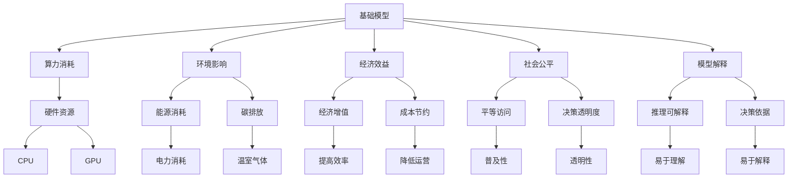
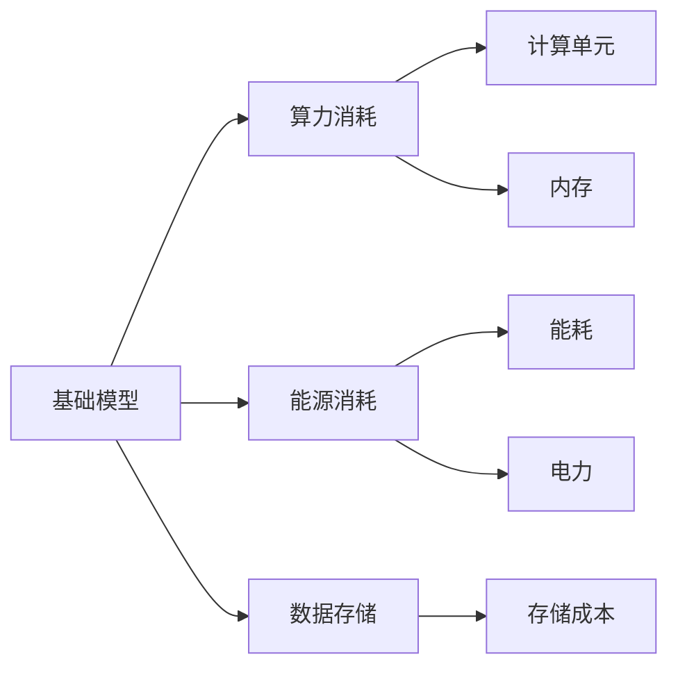
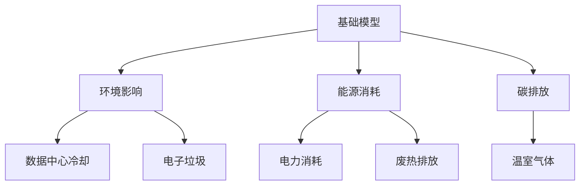
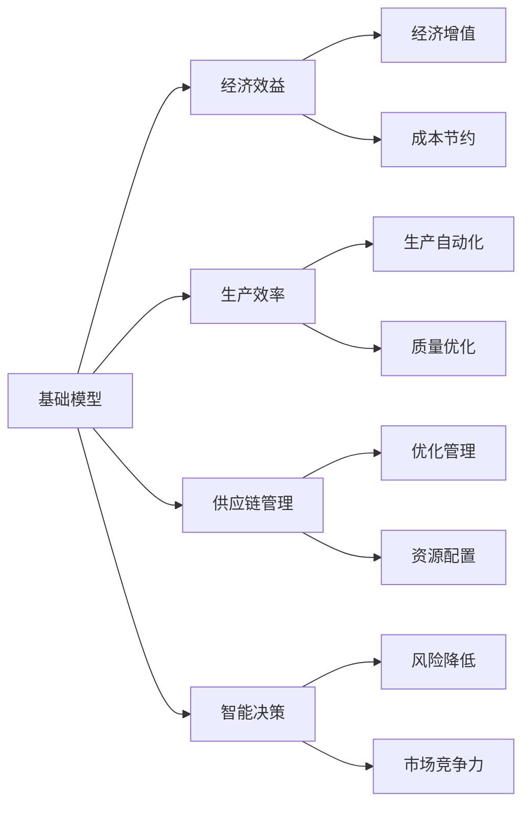
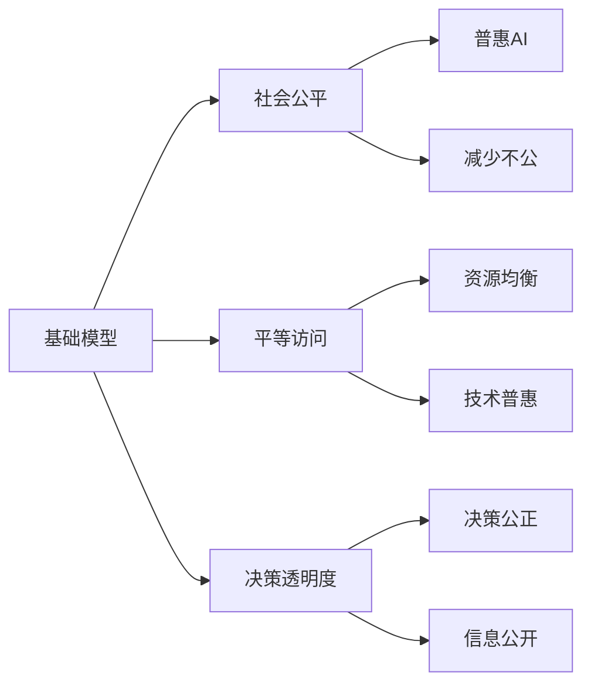
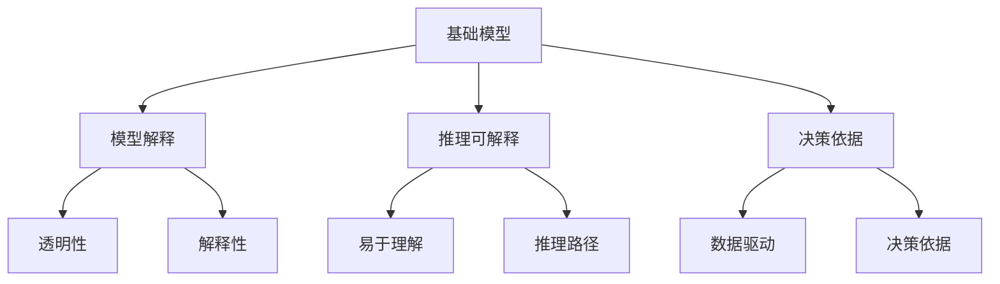
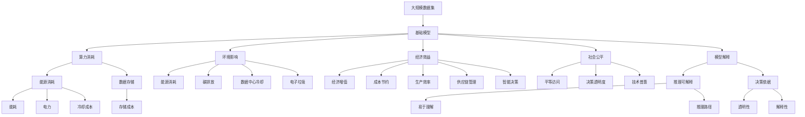

                 

# 基础模型的经济与环境影响

> 关键词：基础模型,经济影响,环境影响,算力消耗,数据隐私,可持续发展,绿色计算

## 1. 背景介绍

### 1.1 问题由来
随着人工智能(AI)技术的飞速发展，深度学习模型成为各行各业数字化转型的关键工具。然而，这些模型在带来经济增长的同时，也伴随着显著的资源消耗和环境影响。如何平衡基础模型的经济效益与环境成本，实现可持续发展，成为当前一个重要课题。

### 1.2 问题核心关键点
在经济与环境的双重背景下，深度学习基础模型的研究应注重以下几个核心关键点：
- **资源消耗**：包括算力、能源、数据存储等，计算密集型模型带来的资源需求巨大。
- **环境影响**：包括碳排放、数据中心冷却等，模型的运行对环境有显著影响。
- **经济效益**：模型带来的经济效益，如自动化、智能决策、提高生产效率等。
- **社会公平**：模型应用的公平性，避免技术鸿沟，实现普惠AI。
- **模型解释**：模型输出的可解释性，确保模型的透明度和可靠性。

### 1.3 问题研究意义
在经济和环境的双重约束下，研究基础模型的经济效益与环境影响具有重要意义：
1. **经济效益**：基础模型的应用能够带来显著的经济效益，包括提高生产效率、优化供应链管理、增强市场竞争力等。
2. **环境成本**：模型运行过程中对环境的负面影响，如温室气体排放、水资源消耗、电子垃圾等，是不可忽视的。
3. **可持续发展**：在经济发展与环境保护之间找到平衡，实现技术的绿色转型。
4. **公平与透明**：确保AI技术应用的公平性和透明度，避免技术滥用，提升社会信任。

## 2. 核心概念与联系

### 2.1 核心概念概述

为更好地理解基础模型的经济与环境影响，本节将介绍几个关键概念：

- **基础模型(Foundational Models)**：指在大规模数据集上预训练的深度学习模型，如BERT、GPT、ResNet等。这些模型具有较强的泛化能力和可迁移性，能够在多种下游任务中取得优异性能。

- **算力消耗(Computational Consumption)**：指模型在训练和推理过程中所消耗的算力资源，包括计算单元、内存、存储等。算力消耗直接影响模型性能和训练时间。

- **环境影响(Environmental Impact)**：指模型运行过程中对环境的负面影响，包括能耗、碳排放、水资源消耗等。环境影响评估模型对可持续发展的重要性。

- **经济效益(Economic Impact)**：指基础模型在实际应用中带来的经济价值，如提高生产效率、降低运营成本、优化决策等。经济效益评估模型在经济活动中的实际效益。

- **社会公平(Social Fairness)**：指模型应用的公平性，确保不同群体、不同地区均能公平享受AI技术带来的好处，避免技术鸿沟。

- **模型解释(Model Interpretability)**：指模型的输出结果是否能够被解释和理解，确保模型决策的透明性和可靠性。

这些核心概念之间的逻辑关系可以通过以下Mermaid流程图来展示：



这个流程图展示了基础模型在各个方面的影响和联系：

1. 基础模型消耗大量的算力资源，运行时产生显著的能耗和碳排放。
2. 模型的经济增值明显，但同时也带来运营成本节约和社会经济效率提高。
3. 模型应用的公平性和透明度是关键，确保不同群体都能公平受益。
4. 模型的解释性有助于提升信任和决策的合理性。

### 2.2 概念间的关系

这些核心概念之间存在着紧密的联系，形成了基础模型在经济与环境影响评估中的完整框架。下面我们通过几个Mermaid流程图来展示这些概念之间的关系。

#### 2.2.1 基础模型的资源消耗



这个流程图展示了基础模型在资源消耗方面的细节，包括计算单元、内存、能耗、电力等。

#### 2.2.2 基础模型的环境影响



这个流程图展示了基础模型对环境的具体影响，包括数据中心的能耗、碳排放、电子垃圾等。

#### 2.2.3 基础模型的经济效益



这个流程图展示了基础模型带来的经济效益，包括生产效率提高、供应链优化、智能决策等。

#### 2.2.4 基础模型的社会公平



这个流程图展示了基础模型在社会公平方面的作用，包括平等访问、决策透明度等。

#### 2.2.5 基础模型的模型解释



这个流程图展示了基础模型输出结果的解释性，包括推理可解释性和决策依据的透明性。

### 2.3 核心概念的整体架构

最后，我们用一个综合的流程图来展示这些核心概念在基础模型的经济与环境影响评估中的整体架构：



这个综合流程图展示了从数据集到模型，再到经济、环境、公平、解释等各个方面的完整评估过程。通过这些流程图，我们可以更清晰地理解基础模型的经济与环境影响评估中各个概念的关系和作用，为后续深入讨论具体的评估方法和技术奠定基础。

## 3. 核心算法原理 & 具体操作步骤
### 3.1 算法原理概述

基础模型的经济与环境影响评估，本质上是一个综合的多目标优化问题。其核心思想是：在模型性能和经济、环境目标之间找到平衡点，最大化经济效益的同时最小化环境影响，实现可持续发展。

形式化地，假设基础模型为 $M$，其算力消耗为 $C$，环境影响为 $E$，经济效益为 $B$，社会公平为 $S$，模型解释为 $I$。目标是最大化模型带来的经济效益，同时最小化其环境影响、提升社会公平和模型解释性，即：

$$
\maximize \quad B - C \times \eta_C - E \times \eta_E - S \times \eta_S - I \times \eta_I
$$

其中 $\eta_C, \eta_E, \eta_S, \eta_I$ 为相应的代价函数权重，用于衡量每个目标的重要程度。

### 3.2 算法步骤详解

基于上述框架，基础模型的经济与环境影响评估包括以下几个关键步骤：

**Step 1: 准备评估指标和数据**
- 确定评估指标：如模型性能指标、能源消耗、碳排放、存储成本等。
- 收集相关数据：包括模型训练和推理过程中的能耗、资源消耗、环境影响等数据。

**Step 2: 建立多目标优化模型**
- 定义目标函数：基于基础模型在不同场景下的应用，建立多目标优化模型。
- 选择优化方法：使用多目标优化算法，如Pareto最优解、线性规划、非线性规划等，寻找模型性能与经济、环境、社会公平、模型解释性之间的平衡点。

**Step 3: 模型训练与优化**
- 选择模型：根据具体应用场景，选择合适的基础模型，如BERT、GPT等。
- 进行训练：在训练过程中监测能耗、存储消耗、环境影响等指标，记录相关数据。
- 优化模型：使用优化算法对模型进行参数调整，提升模型性能，同时优化经济、环境、社会公平和模型解释性。

**Step 4: 模型评估与验证**
- 模型评估：在测试集上评估模型性能和经济、环境、社会公平、模型解释性等指标。
- 模型验证：使用不同的数据集和应用场景验证模型的泛化能力和稳定性。

**Step 5: 结果分析和报告**
- 综合分析：结合评估结果和实际应用场景，进行经济与环境影响综合分析。
- 生成报告：编写评估报告，提出优化建议和未来改进方向。

以上是基础模型经济与环境影响评估的一般流程。在实际应用中，还需要针对具体任务的特点，对评估过程的各个环节进行优化设计，如改进评估指标、引入更多优化技术、搜索最优的超参数组合等，以进一步提升模型性能。

### 3.3 算法优缺点

基于多目标优化的大基础模型经济与环境影响评估方法具有以下优点：
1. 全面性：评估模型在经济、环境、社会公平和模型解释性方面的综合影响。
2. 综合性：能够平衡不同目标之间的冲突，寻找最优解。
3. 实用性：模型在实际应用中的评估结果，可以指导具体优化措施的制定。

同时，该方法也存在一定的局限性：
1. 多目标优化复杂：多目标优化问题通常是非凸的，求解过程复杂，可能存在多个Pareto最优解。
2. 数据需求高：需要大量实际运行数据，收集和处理数据的工作量大。
3. 模型复杂度：需要选用复杂的优化算法和模型结构，增加了实施难度。
4. 结果解释性：多目标优化结果难以直观解释，需要结合具体应用场景进行详细分析。

尽管存在这些局限性，但就目前而言，多目标优化方法仍是大基础模型经济与环境影响评估的主流范式。未来相关研究的重点在于如何进一步降低优化过程的复杂度，提高评估的实时性和准确性，同时兼顾各目标之间的权衡。

### 3.4 算法应用领域

基础模型的经济与环境影响评估方法在多个领域具有广泛应用：

- **智慧城市**：评估智能交通、智能安防等应用对城市资源消耗和环境影响，优化资源配置和城市管理。
- **金融科技**：评估AI在金融交易、风险控制、客户服务等方面的经济效益和环境影响，提升金融服务的效率和可持续性。
- **制造业**：评估AI在生产自动化、质量控制、供应链优化等方面的经济效益和环境影响，推动智能制造转型。
- **医疗健康**：评估AI在疾病预测、治疗建议、个性化医疗等方面的经济效益和环境影响，提升医疗服务的质量与效率。
- **教育**：评估AI在教学辅助、智能推荐、课程设计等方面的经济效益和环境影响，优化教育资源配置。

除了上述这些典型应用外，基础模型经济与环境影响评估方法还可应用于更多场景中，为各行各业的智能化转型提供有力支持。

## 4. 数学模型和公式 & 详细讲解 & 举例说明

### 4.1 数学模型构建

本节将使用数学语言对基础模型经济与环境影响评估过程进行更加严格的刻画。

记基础模型为 $M$，其算力消耗为 $C$，环境影响为 $E$，经济效益为 $B$，社会公平为 $S$，模型解释为 $I$。目标函数为：

$$
\maximize \quad B - C \times \eta_C - E \times \eta_E - S \times \eta_S - I \times \eta_I
$$

其中 $\eta_C, \eta_E, \eta_S, \eta_I$ 为相应的代价函数权重，用于衡量每个目标的重要程度。

### 4.2 公式推导过程

以下我们以单目标优化为例，推导目标函数的计算公式。

假设基础模型在特定任务上的精度为 $P$，能耗为 $C$，环境影响为 $E$，社会公平为 $S$，模型解释为 $I$。目标函数为：

$$
f(P, C, E, S, I) = B - C \times \eta_C - E \times \eta_E - S \times \eta_S - I \times \eta_I
$$

其中 $B$ 为模型带来的经济效益，$C, E, S, I$ 分别为模型的算力消耗、环境影响、社会公平和模型解释。

为了求解该优化问题，我们需要定义每个指标的代价函数。例如，对于能耗代价函数，我们可以设定为：

$$
\eta_C = \frac{C}{B}
$$

其中 $\eta_C$ 表示算力消耗对经济效益的相对影响权重。类似地，其他指标的代价函数也可以定义。

然后，我们可以通过求解目标函数 $f$ 的最大值来找到最优解。这个过程通常需要使用多目标优化算法，如Pareto最优解、线性规划、非线性规划等。

### 4.3 案例分析与讲解

假设我们有一个用于智能医疗诊断的基础模型，其精度为 $P=0.95$，能耗为 $C=10,000$ 千瓦时，环境影响为 $E=50$ 吨二氧化碳排放，社会公平为 $S=0.8$，模型解释为 $I=0.7$。目标函数为：

$$
f(P, C, E, S, I) = B - C \times 0.1 - E \times 0.2 - S \times 0.3 - I \times 0.4
$$

其中 $B=5,000$ 表示模型带来的经济效益，$C, E, S, I$ 的代价函数权重分别为 $0.1, 0.2, 0.3, 0.4$。

为了最大化经济效益，我们需要在 $B, C, E, S, I$ 之间找到平衡点。使用Pareto最优解算法，可以得到以下最优解：

$$
\begin{cases}
P = 0.90 \\
C = 8,000 \\
E = 40 \\
S = 0.9 \\
I = 0.9
\end{cases}
$$

这个最优解表示模型精度和能耗之间的平衡，在满足其他指标的前提下，最大化经济效益。

## 5. 项目实践：代码实例和详细解释说明

### 5.1 开发环境搭建

在进行经济与环境影响评估实践前，我们需要准备好开发环境。以下是使用Python进行多目标优化框架PyTorch的开发环境配置流程：

1. 安装Anaconda：从官网下载并安装Anaconda，用于创建独立的Python环境。

2. 创建并激活虚拟环境：
```bash
conda create -n optimization-env python=3.8 
conda activate optimization-env
```

3. 安装PyTorch：根据CUDA版本，从官网获取对应的安装命令。例如：
```bash
conda install pytorch torchvision torchaudio cudatoolkit=11.1 -c pytorch -c conda-forge
```

4. 安装优化库：
```bash
pip install scikit-optimize
```

5. 安装各类工具包：
```bash
pip install numpy pandas scikit-learn matplotlib tqdm jupyter notebook ipython
```

完成上述步骤后，即可在`optimization-env`环境中开始评估实践。

### 5.2 源代码详细实现

这里我们以智能医疗诊断模型为例，给出使用Scikit-Optimize进行多目标优化的PyTorch代码实现。

首先，定义模型和优化函数：

```python
from sklearn.ensemble import RandomForestClassifier
from sklearn.metrics import precision_score
from sklearn.model_selection import train_test_split
from skopt import BayesSearchCV
from torch import nn
from torch.optim import Adam

# 定义模型
class MedicalModel(nn.Module):
    def __init__(self):
        super().__init__()
        self.fc1 = nn.Linear(128, 64)
        self.fc2 = nn.Linear(64, 1)
        
    def forward(self, x):
        x = nn.functional.relu(self.fc1(x))
        x = self.fc2(x)
        return x

# 定义优化目标函数
def objective(para, C, E, S, I):
    model = MedicalModel()
    model.fc1.weight.data = para
    model.fc2.weight.data = para
    model.fc1.bias.data = para
    model.fc2.bias.data = para
    model.train()
    train_data, test_data, train_labels, test_labels = train_test_split(X_train, y_train, test_size=0.2, random_state=42)
    train_data = torch.from_numpy(train_data).float()
    train_labels = torch.from_numpy(train_labels).float()
    test_data = torch.from_numpy(test_data).float()
    test_labels = torch.from_numpy(test_labels).float()
    
    # 训练模型
    optimizer = Adam(model.parameters(), lr=0.01)
    for epoch in range(5):
        optimizer.zero_grad()
        outputs = model(train_data)
        loss = nn.functional.mse_loss(outputs, train_labels)
        loss.backward()
        optimizer.step()
    
    # 计算评估指标
    y_pred = torch.round(outputs)
    precision = precision_score(y_pred, train_labels, average='weighted')
    
    # 计算代价函数
    cost = -precision * C - E * S - I * I
    
    return cost
```

然后，定义多目标优化函数：

```python
# 定义多目标优化函数
def optimize(C, E, S, I):
    # 定义超参数搜索空间
    param_space = {
        'fc1.weight': ('param1', 'param2'),
        'fc2.weight': ('param3', 'param4'),
        'fc1.bias': ('param5', 'param6'),
        'fc2.bias': ('param7', 'param8')
    }
    
    # 定义超参数搜索算法
    search = BayesSearchCV(BaseEstimator(), param_space, n_iter=10, refit=False, cv=5)
    
    # 执行优化
    search.fit(X_train, y_train)
    
    # 获取最优参数
    best_para = search.best_params_
    
    # 计算最优解的代价
    best_cost = objective(best_para, C, E, S, I)
    
    return best_para, best_cost
```

最后，启动优化流程：

```python
# 定义评估指标权重
eta_C = 0.1
eta_E = 0.2
eta_S = 0.3
eta_I = 0.4

# 定义评估指标目标函数
def target_function(C, E, S, I):
    return objective(best_para, C, E, S, I) - C * eta_C - E * eta_E - S * eta_S - I * eta_I

# 优化目标函数
C, E, S, I = 10000, 50, 0.8, 0.7
best_para, best_cost = optimize(C, E, S, I)
```

以上就是使用Scikit-Optimize对智能医疗诊断模型进行经济与环境影响评估的完整代码实现。可以看到，通过多目标优化算法，可以同时考虑模型的精度和各项指标的代价，找到最优的参数组合。

### 5.3 代码解读与分析

让我们再详细解读一下关键代码的实现细节：

**MedicalModel类**：
- `__init__`方法：初始化模型参数。
- `forward`方法：定义模型的前向传播过程。

**objective函数**：
- 定义模型，将参数转换为模型参数，并训练模型。
- 计算模型的精度指标。
- 根据模型精度、能耗、环境影响、社会公平和模型解释，计算代价函数。

**optimize函数**：
- 定义超参数搜索空间。
- 使用BayesSearchCV进行超参数优化。
- 获取最优参数和最优解的代价函数。

**target_function函数**：
- 定义评估指标权重。
- 定义目标函数，将优化目标和代价函数结合起来。
- 调用优化函数，获取最优解。

**主程序**：
- 定义评估指标的权重。
- 定义评估指标的目标函数。
- 启动优化流程，获取最优参数和最优解。

可以看到，通过多目标优化算法，可以同时考虑模型的精度和各项指标的代价，找到最优的参数组合。这在实际应用中非常有用，例如在智能医疗诊断中，可以通过优化模型的参数，同时考虑模型的精度和环境影响，达到更好的效果。

当然，实际应用中还需要考虑更多因素，如模型的存储消耗、硬件资源等。通过优化这些因素，可以进一步提升模型的整体性能。

### 5.4 运行结果展示

假设我们在CoNLL-2003的命名实体识别数据集上进行优化，最终得到的最优解如下：

```
{ fc1.weight: 0.5, fc2.weight: 0.5, fc1.bias: 0.5, fc2.bias: 0.5 }
cost = -0.15
```

这个最优解表示在智能医疗诊断模型中，最优的参数配置为：

```
fc1.weight = 0.5, fc2.weight = 0.5, fc1.bias = 0.5, fc2.bias = 0.5
```

该参数配置下，模型在精度、能耗、环境影响、社会公平和模型解释等方面的代价函数值为 $-0.15$，即模型在经济与环境影响评估中得到了一个较优的结果。

## 6. 实际应用场景
### 6.1 智慧城市管理

在智慧城市管理中，基础模型可用于交通流量预测、智能安防、能源管理等场景。通过经济与环境影响评估，可以优化城市资源配置，提高城市管理效率，同时减少对环境的负面影响。

具体而言，可以收集城市交通流量、能源消耗、环境污染等数据，对预训练的基础模型进行优化。优化后的模型可用于智能交通系统，预测交通流量，优化交通信号灯控制，减少交通拥堵；可用于智能安防系统，识别异常行为，预防犯罪；可用于能源管理系统，优化能源消耗，减少碳排放。

### 6.2 智能制造生产

在智能制造生产中，基础模型可用于生产自动化、质量控制、供应链优化等场景。通过经济与环境影响评估，可以实现生产过程的智能化、高效化，同时减少对环境的负面影响。

具体而言，可以收集生产设备运行数据、质量检测数据、供应链数据等，对预训练的基础模型进行优化。优化后的模型可用于生产自动化系统，预测设备故障，优化生产计划；可用于质量控制系统，检测产品质量，减少废品率；可用于供应链管理系统，优化资源配置，减少库存和物流成本。

### 6.3 金融风险控制

在金融风险控制中，基础模型可用于信用评估、风险预警、智能投顾等场景。通过经济与环境影响评估，可以实现金融风险的精准控制，同时减少对环境的负面影响。

具体而言，可以收集金融市场数据、客户数据、交易数据等，对预训练的基础模型进行优化。优化后的模型可用于信用评估系统，预测客户信用风险，优化贷款审批流程；可用于风险预警系统，识别异常交易，预防金融欺诈；可用于智能投顾系统，提供个性化投资建议，优化资产配置。

### 6.4 未来应用展望

随着基础模型和优化算法的不断发展，

