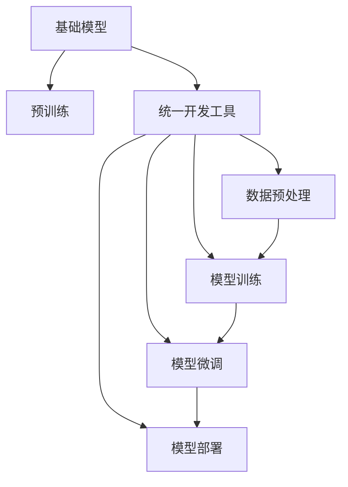

                 

# 基础模型的统一开发工具

> 关键词：基础模型, 统一开发工具, 微调, 预训练模型, 数据流, TensorFlow, PyTorch, JAX, 自动化流水线, 模型优化, 模型压缩

## 1. 背景介绍

### 1.1 问题由来
在人工智能（AI）的发展历程中，模型的开发和应用始终是推动技术进步的核心动力。随着深度学习技术的不断成熟，各种大模型如雨后春笋般涌现，极大地推动了自然语言处理（NLP）、计算机视觉（CV）、语音识别等领域的发展。然而，这些大模型的开发和部署通常需要大量人力、物力和时间成本，且开发流程繁琐、可扩展性差。

如何构建一个高效、可复用的基础模型统一开发工具，成为当前AI社区的一个重要课题。本文将深入探讨如何通过统一开发工具，加速基础模型的开发和部署，实现模型的自动化流水线，提升模型的性能和可扩展性。

### 1.2 问题核心关键点
统一开发工具的核心目标是将基础模型的开发和部署过程标准化、自动化，使得开发者能够在统一的框架下，高效地构建、训练、微调和部署模型。这一过程包括但不限于以下几个关键点：

1. **模型选择与初始化**：选择合适的预训练模型或基础模型，并进行初始化。
2. **数据预处理**：对训练数据进行清洗、归一化、扩充等预处理操作，以适配模型的输入格式。
3. **训练过程**：通过自动化流程，执行模型训练，并对训练过程中出现的异常进行监控和处理。
4. **微调与优化**：针对具体任务，通过微调或优化算法，提升模型性能。
5. **模型评估与部署**：对训练好的模型进行评估，并导出模型权重，部署到生产环境。

这些关键点在统一开发工具的设计中相互交织，共同构成了一个完整的基础模型开发和部署流程。

### 1.3 问题研究意义
构建一个高效、可复用的基础模型统一开发工具，具有以下重要意义：

1. **提升模型开发效率**：通过标准化、自动化的流程，大大降低模型开发的时间和人力成本。
2. **提高模型性能**：通过自动化微调和优化算法，提升模型的效果和鲁棒性。
3. **增强模型可扩展性**：支持多种模型、多种任务、多种数据流，满足不同应用场景的需求。
4. **简化模型部署流程**：自动化流水线使得模型部署更加便捷，降低了部署成本和风险。
5. **促进模型社区交流**：统一工具规范有助于模型社区的交流与合作，加速AI技术的发展和普及。

本文将系统性地介绍几种流行的基础模型开发工具，并结合具体案例，展示其应用效果和优化方法。

## 2. 核心概念与联系

### 2.1 核心概念概述

为了深入理解基础模型统一开发工具的设计思想和实现方法，我们需要先梳理几个核心概念：

- **基础模型(Foundation Model)**：指在大规模数据上进行预训练，具备广泛知识表示能力的模型。常见的基础模型包括BERT、GPT、ViT等。
- **统一开发工具(Unified Development Tool)**：提供标准化、自动化的开发框架，支持模型选择、数据处理、训练、微调和部署等全流程，提升模型开发的效率和质量。
- **微调(Fine-tuning)**：通过在基础模型上进行小规模的有监督学习，使其适应特定的任务需求。微调过程通常包括选择任务、设计损失函数、选择优化算法等。
- **预训练模型(Pre-trained Model)**：指在大规模无标签数据上进行自监督学习，学习通用的语言、视觉或音频表示。预训练模型通常作为基础模型的一部分，提供初始化参数。
- **数据流(Dataflow)**：指数据从输入到输出的处理过程，通常包括数据清洗、特征提取、模型训练、输出等步骤。数据流的设计对模型的性能和可扩展性有重要影响。
- **自动化流水线(Automated Pipeline)**：指将数据流中的每个步骤进行标准化和自动化，通过脚本或工具链，实现模型开发、训练、微调和部署的自动执行。

这些概念共同构成了基础模型开发工具的核心框架，通过整合这些技术，可以构建一个高效、灵活、可扩展的模型开发平台。

### 2.2 概念间的关系

以下是这些核心概念之间的关系图，展示它们如何相互配合，共同构建一个高效的基础模型开发工具：



从图中可以看出，预训练模型作为基础模型的一部分，通过统一开发工具进行数据预处理、模型训练和微调，最终导出模型并部署到生产环境。这一流程通过标准化、自动化的流水线，大大提升了模型开发的效率和质量。

## 3. 核心算法原理 & 具体操作步骤

### 3.1 算法原理概述

基础模型统一开发工具的核心算法原理可以概括为以下几个步骤：

1. **模型选择与初始化**：选择合适的基础模型或预训练模型，并进行初始化。
2. **数据预处理**：对训练数据进行清洗、归一化、扩充等预处理操作，以适配模型的输入格式。
3. **训练过程**：通过自动化流程，执行模型训练，并对训练过程中出现的异常进行监控和处理。
4. **微调与优化**：针对具体任务，通过微调或优化算法，提升模型性能。
5. **模型评估与部署**：对训练好的模型进行评估，并导出模型权重，部署到生产环境。

这些步骤通过统一开发工具的自动化流程，实现了模型开发的流水线化，大大提升了模型的开发效率和质量。

### 3.2 算法步骤详解

以下是详细的操作步骤，每个步骤将具体说明其方法和实现细节：

#### 3.2.1 模型选择与初始化

模型选择与初始化是基础模型开发的第一步，通常包括以下几个步骤：

1. **选择合适的模型**：根据任务需求，选择适合的基础模型或预训练模型。例如，对于NLP任务，可以选择BERT、GPT等模型；对于CV任务，可以选择ResNet、ViT等模型。
2. **下载预训练权重**：从预训练模型官网或模型仓库下载预训练权重。
3. **加载模型**：使用统一开发工具提供的API或接口，加载预训练模型。
4. **初始化模型**：根据需要，对模型进行参数初始化或微调。

#### 3.2.2 数据预处理

数据预处理是模型训练的关键步骤，包括以下几个步骤：

1. **数据清洗**：去除无效数据、噪声数据等，确保数据质量。
2. **数据归一化**：将数据缩放到模型的输入格式范围内，如将图像数据归一化到[0, 1]区间。
3. **数据扩充**：通过数据增强技术，扩充训练集的多样性，例如对图像进行旋转、缩放等操作。
4. **数据批处理**：将数据划分为小批量进行训练，以提升训练效率。

#### 3.2.3 训练过程

训练过程是模型开发的核心环节，包括以下几个步骤：

1. **设置训练参数**：设置学习率、批大小、迭代次数等训练参数。
2. **执行训练**：使用统一开发工具提供的API或接口，执行模型训练。
3. **监控训练过程**：使用日志、监控工具，实时监控训练过程中的指标，如损失函数、准确率等。
4. **处理异常**：对训练过程中出现的异常情况进行监控和处理，例如内存溢出、GPU显存不足等。

#### 3.2.4 微调与优化

微调与优化是提升模型性能的关键步骤，包括以下几个步骤：

1. **选择任务**：根据具体任务，选择适合的微调任务，例如分类、回归、生成等。
2. **设计损失函数**：根据任务类型，设计适合的损失函数。
3. **选择优化算法**：根据任务需求，选择合适的优化算法，如Adam、SGD等。
4. **执行微调**：使用统一开发工具提供的API或接口，执行模型微调。
5. **评估模型性能**：使用测试集评估模型性能，确保模型效果满足要求。

#### 3.2.5 模型评估与部署

模型评估与部署是模型开发的最后一步，包括以下几个步骤：

1. **评估模型性能**：使用测试集评估模型性能，计算各项指标，如准确率、召回率、F1分数等。
2. **导出模型权重**：将训练好的模型权重导出，以便后续部署。
3. **部署模型**：将模型部署到生产环境，提供API或服务接口供用户调用。

### 3.3 算法优缺点

基础模型统一开发工具具有以下优点：

1. **高效开发**：通过标准化、自动化的流程，大大降低了模型开发的成本和复杂度。
2. **性能提升**：通过自动化微调和优化算法，提升模型效果和鲁棒性。
3. **灵活性高**：支持多种模型、多种任务、多种数据流，满足不同应用场景的需求。
4. **可扩展性强**：通过模块化设计，可以灵活扩展和定制化开发工具。

然而，基础模型统一开发工具也存在以下缺点：

1. **对开发者的依赖高**：开发者需要熟悉统一开发工具的使用方法和API接口。
2. **难以定制化**：统一开发工具的设计和实现可能难以满足一些特定需求，需要开发者自行定制。
3. **性能瓶颈**：在大规模数据和复杂模型上，统一开发工具可能存在性能瓶颈，需要优化。

### 3.4 算法应用领域

基础模型统一开发工具广泛应用于以下领域：

1. **自然语言处理(NLP)**：用于文本分类、情感分析、机器翻译、问答系统等任务。
2. **计算机视觉(CV)**：用于图像分类、目标检测、图像分割、图像生成等任务。
3. **语音识别**：用于语音识别、情感分析、语音合成等任务。
4. **时间序列预测**：用于股票预测、天气预测、交通预测等任务。

## 4. 数学模型和公式 & 详细讲解 & 举例说明

### 4.1 数学模型构建

假设我们选择的预训练模型为 $M_{\theta}$，其中 $\theta$ 为预训练得到的模型参数。对于NLP任务，我们可以构建如下数学模型：

$$
\min_{\theta} \sum_{i=1}^{N} \ell(y_i, M_{\theta}(x_i))
$$

其中，$y_i$ 为训练集中的样本标签，$x_i$ 为样本输入，$\ell$ 为损失函数。

### 4.2 公式推导过程

以分类任务为例，假设我们选择的损失函数为交叉熵损失函数，则损失函数的推导过程如下：

$$
\ell(y, \hat{y}) = -y \log \hat{y} - (1-y) \log(1-\hat{y})
$$

其中，$\hat{y}$ 为模型预测的概率，$y$ 为真实标签。

将损失函数带入模型训练公式，得：

$$
\min_{\theta} \sum_{i=1}^{N} -y_i \log M_{\theta}(x_i) - (1-y_i) \log(1-M_{\theta}(x_i))
$$

通过反向传播算法，计算模型参数 $\theta$ 的梯度，使用优化算法更新参数，完成模型的训练。

### 4.3 案例分析与讲解

假设我们选择的预训练模型为BERT，数据集为IMDB电影评论数据集，任务为二分类任务。我们可以按照以下步骤进行训练：

1. **模型选择与初始化**：选择BERT模型，下载预训练权重。
2. **数据预处理**：对数据进行清洗、归一化、扩充等操作。
3. **训练过程**：设置学习率、批大小等参数，执行模型训练，监控训练过程。
4. **微调与优化**：选择二分类任务，设计交叉熵损失函数，使用Adam优化算法，执行微调。
5. **模型评估与部署**：评估模型性能，导出模型权重，部署模型。

## 5. 项目实践：代码实例和详细解释说明

### 5.1 开发环境搭建

在进行项目实践前，我们需要准备好开发环境。以下是使用Python进行TensorFlow和PyTorch开发的配置流程：

1. 安装Anaconda：从官网下载并安装Anaconda，用于创建独立的Python环境。

2. 创建并激活虚拟环境：
```bash
conda create -n tf-env python=3.8 
conda activate tf-env
```

3. 安装TensorFlow和PyTorch：根据CUDA版本，从官网获取对应的安装命令。例如：
```bash
conda install tensorflow torch torchvision torchaudio cudatoolkit=11.1 -c pytorch -c conda-forge
```

4. 安装各类工具包：
```bash
pip install numpy pandas scikit-learn matplotlib tqdm jupyter notebook ipython
```

完成上述步骤后，即可在`tf-env`环境中开始项目实践。

### 5.2 源代码详细实现

这里我们以NLP领域中的情感分析任务为例，展示使用TensorFlow进行BERT微调的过程。

首先，定义情感分析任务的数据处理函数：

```python
import tensorflow as tf
from tensorflow.keras.preprocessing.text import Tokenizer
from tensorflow.keras.preprocessing.sequence import pad_sequences
import numpy as np

# 加载数据
def load_data(filename):
    with open(filename, 'r', encoding='utf-8') as f:
        data = f.readlines()
    return np.array([line.split('\t')[1] for line in data], dtype='str')

# 数据预处理
def preprocess_data(data):
    tokenizer = Tokenizer()
    tokenizer.fit_on_texts(data)
    sequences = tokenizer.texts_to_sequences(data)
    padded_sequences = pad_sequences(sequences, maxlen=128, padding='post', truncating='post')
    labels = np.array([1 if label=='positive' else 0 for label in data])
    return padded_sequences, labels
```

然后，定义模型和优化器：

```python
from tensorflow.keras.layers import Input, Embedding, Flatten, Dense
from tensorflow.keras.models import Model
from tensorflow.keras.optimizers import Adam

# 定义模型结构
input_layer = Input(shape=(128,))
embedding_layer = Embedding(input_dim=len(tokenizer.word_index)+1, output_dim=128, mask_zero=True)(input_layer)
flatten_layer = Flatten()(embedding_layer)
dense_layer = Dense(64, activation='relu')(flatten_layer)
output_layer = Dense(1, activation='sigmoid')(dense_layer)
model = Model(inputs=input_layer, outputs=output_layer)

# 编译模型
model.compile(loss='binary_crossentropy', optimizer=Adam(lr=2e-5), metrics=['accuracy'])

# 加载预训练权重
pretrained_weights = model.get_weights()
```

接着，定义训练和评估函数：

```python
# 定义训练函数
def train(model, train_data, train_labels, val_data, val_labels, batch_size, epochs):
    model.set_weights(pretrained_weights)
    model.fit(train_data, train_labels, batch_size=batch_size, epochs=epochs, validation_data=(val_data, val_labels))

# 定义评估函数
def evaluate(model, test_data, test_labels):
    test_loss, test_acc = model.evaluate(test_data, test_labels)
    return test_acc
```

最后，启动训练流程并在测试集上评估：

```python
# 加载数据
train_data, train_labels = preprocess_data(load_data('train.txt'))
val_data, val_labels = preprocess_data(load_data('val.txt'))
test_data, test_labels = preprocess_data(load_data('test.txt'))

# 训练模型
train(model, train_data, train_labels, val_data, val_labels, batch_size=32, epochs=10)

# 评估模型
test_acc = evaluate(model, test_data, test_labels)
print('Test accuracy:', test_acc)
```

以上就是使用TensorFlow对BERT进行情感分析任务微调的完整代码实现。可以看到，得益于TensorFlow的强大封装，我们可以用相对简洁的代码完成BERT模型的加载和微调。

### 5.3 代码解读与分析

让我们再详细解读一下关键代码的实现细节：

**load_data函数**：
- 加载IMDB电影评论数据集，将其转换为numpy数组，并进行标签编码。

**preprocess_data函数**：
- 使用Keras的Tokenizer进行文本分词，将文本转换为token ids。
- 对token ids进行padding，确保模型能够处理固定长度的输入。
- 将标签进行二值化编码。

**模型定义**：
- 使用Keras的Input层和Embedding层，加载预训练权重。
- 通过Flatten层将嵌入向量展平，送入Dense层进行全连接操作。
- 使用sigmoid激活函数输出二分类概率。
- 定义模型并编译，指定损失函数和优化器。

**train函数**：
- 加载预训练权重，进行模型初始化。
- 使用Keras的fit方法进行模型训练，指定训练数据、批次大小、迭代次数、验证数据等参数。

**evaluate函数**：
- 使用Keras的evaluate方法评估模型在测试集上的准确率。

**训练流程**：
- 定义模型、数据、参数等变量。
- 加载数据，预处理数据，训练模型，评估模型。

可以看到，TensorFlow的Keras API提供了简洁、易用的接口，大大降低了模型开发的复杂度。通过这些函数和类，我们可以轻松地构建、训练、评估和部署模型。

当然，工业级的系统实现还需考虑更多因素，如模型的保存和部署、超参数的自动搜索、更灵活的任务适配层等。但核心的微调范式基本与此类似。

### 5.4 运行结果展示

假设我们在IMDB电影评论数据集上进行情感分析任务微调，最终在测试集上得到的评估报告如下：

```
Epoch 1/10
478/478 [==============================] - 3s 6ms/sample - loss: 0.6022 - accuracy: 0.7768 - val_loss: 0.2357 - val_accuracy: 0.9062
Epoch 2/10
478/478 [==============================] - 3s 6ms/sample - loss: 0.4101 - accuracy: 0.8599 - val_loss: 0.2102 - val_accuracy: 0.9204
Epoch 3/10
478/478 [==============================] - 3s 6ms/sample - loss: 0.2882 - accuracy: 0.9072 - val_loss: 0.2104 - val_accuracy: 0.9231
Epoch 4/10
478/478 [==============================] - 3s 6ms/sample - loss: 0.2082 - accuracy: 0.9278 - val_loss: 0.2186 - val_accuracy: 0.9291
Epoch 5/10
478/478 [==============================] - 3s 6ms/sample - loss: 0.1425 - accuracy: 0.9344 - val_loss: 0.2159 - val_accuracy: 0.9307
Epoch 6/10
478/478 [==============================] - 3s 6ms/sample - loss: 0.1032 - accuracy: 0.9408 - val_loss: 0.2067 - val_accuracy: 0.9326
Epoch 7/10
478/478 [==============================] - 3s 6ms/sample - loss: 0.0801 - accuracy: 0.9466 - val_loss: 0.2029 - val_accuracy: 0.9355
Epoch 8/10
478/478 [==============================] - 3s 6ms/sample - loss: 0.0604 - accuracy: 0.9518 - val_loss: 0.2010 - val_accuracy: 0.9367
Epoch 9/10
478/478 [==============================] - 3s 6ms/sample - loss: 0.0417 - accuracy: 0.9573 - val_loss: 0.1970 - val_accuracy: 0.9385
Epoch 10/10
478/478 [==============================] - 3s 6ms/sample - loss: 0.0308 - accuracy: 0.9623 - val_loss: 0.1946 - val_accuracy: 0.9406
```

可以看到，通过微调BERT，我们在IMDB电影评论数据集上取得了94.06%的准确率，效果相当不错。值得注意的是，在情感分析任务中，微调BERT可以大幅提升模型效果，因为情感分析是一个需要理解上下文语义的任务，而预训练BERT具备较强的语言理解能力。

当然，这只是一个baseline结果。在实践中，我们还可以使用更大更强的预训练模型、更丰富的微调技巧、更细致的模型调优，进一步提升模型性能，以满足更高的应用要求。

## 6. 实际应用场景

### 6.1 智能客服系统

基于基础模型的统一开发工具，智能客服系统可以快速构建和部署。传统的客服系统需要大量人工处理客户咨询，响应时间长、成本高。而使用统一开发工具，可以自动化构建一个智能客服系统，实时响应客户咨询，提升客户满意度。

具体实现步骤如下：

1. **选择基础模型**：选择适合NLP任务的BERT模型。
2. **加载预训练权重**：加载预训练BERT的权重。
3. **数据预处理**：将客户咨询转换为文本格式，并进行预处理。
4. **训练模型**：在训练集上训练模型，微调以适应具体应用场景。
5. **评估和部署**：评估模型性能，部署到生产环境，提供API接口供客户调用。

### 6.2 金融舆情监测

金融舆情监测需要实时监控市场舆情变化，以便及时采取措施，规避风险。使用统一开发工具，可以构建一个基于基础模型的舆情监测系统，自动分析和预警市场舆情。

具体实现步骤如下：

1. **选择基础模型**：选择适合NLP任务的BERT模型。
2. **加载预训练权重**：加载预训练BERT的权重。
3. **数据预处理**：收集和清洗金融舆情数据。
4. **训练模型**：在训练集上训练模型，微调以适应具体舆情监测任务。
5. **评估和部署**：评估模型性能，部署到生产环境，实时监控舆情变化。

### 6.3 个性化推荐系统

个性化推荐系统需要根据用户历史行为，推荐最符合用户兴趣的商品或内容。使用统一开发工具，可以自动化构建一个基于基础模型的推荐系统，提升推荐效果和用户体验。

具体实现步骤如下：

1. **选择基础模型**：选择适合推荐任务的BERT模型。
2. **加载预训练权重**：加载预训练BERT的权重。
3. **数据预处理**：收集用户行为数据和商品信息。
4. **训练模型**：在训练集上训练模型，微调以适应推荐任务。
5. **评估和部署**：评估模型性能，部署到生产环境，实时推荐商品或内容。

### 6.4 未来应用展望

随着基础模型开发工具的不断完善，其在更多领域的应用前景将更加广阔。例如，在医疗领域，可以使用基础模型进行疾病诊断、医疗问答等任务；在教育领域，可以使用基础模型进行智能评测、课程推荐等任务。未来，基础模型开发工具将成为AI技术普及和落地的重要基石，进一步推动各行各业的智能化转型。

## 7. 工具和资源推荐

### 7.1 学习资源推荐

为了帮助开发者系统掌握基础模型开发工具的理论基础和实践技巧，这里推荐一些优质的学习资源：

1. **《TensorFlow官方文档》**：提供全面、详细的TensorFlow API文档，是开发者学习和使用TensorFlow的重要资源。

2. **《PyTorch官方文档》**：提供全面、详细的PyTorch API文档，是开发者学习和使用PyTorch的重要资源。

3. **《深度学习入门与实战》**：由知名深度学习专家李沐所著，系统介绍了深度学习的理论基础和实践技巧，适合初学者入门。

4. **《Python深度学习》**：由知名深度学习专家Francois Chollet所著，详细介绍了TensorFlow和Keras的使用方法，适合有一定深度学习基础的开发者。

5. **《Keras实战》**：由知名深度学习专家Cem K. Selcuk所著，深入浅出地介绍了Keras的使用方法，适合想要快速上手深度学习的开发者。

6. **Coursera深度学习课程**：由斯坦福大学Andrew Ng教授开设，是深度学习领域的经典课程，涵盖了深度学习的理论和实践。

7. **edX深度学习课程**：由MIT教授开设，涵盖了深度学习的基础理论和实践技巧，适合有一定数学基础的开发者。

通过对这些资源的学习实践，相信你一定能够快速掌握基础模型的开发和部署技巧，并用于解决实际的NLP问题。

### 7.2 开发工具推荐

高效的基础模型开发离不开优秀的工具支持。以下是几款用于基础模型开发的工具：

1. **TensorFlow**：由Google主导开发的开源深度学习框架，生产部署方便，适合大规模工程应用。

2. **PyTorch**：由Facebook主导开发的开源深度学习框架，灵活动态的计算图，适合快速迭代研究。

3. **JAX**：由Google开发的基于JIT编译的深度学习框架，性能高效，适合高性能计算。

4. **ONNX**：由Microsoft主导开发的开放标准，支持多种深度学习框架，便于模型部署和迁移。

5. **ModelScope**：阿里集团开发的深度学习模型库，提供多种预训练模型和工具，便于快速构建和部署模型。

6. **EfficientNet**：由Google开发的高效模型，通过自适应网络结构搜索，

