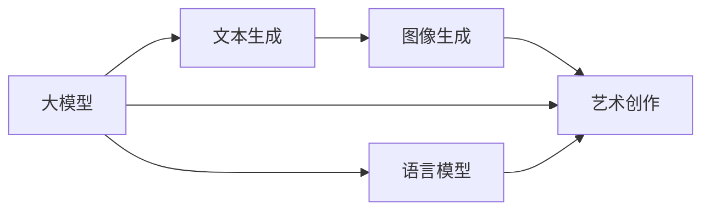
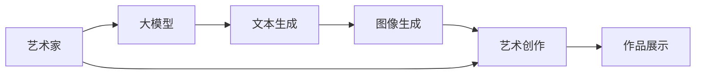
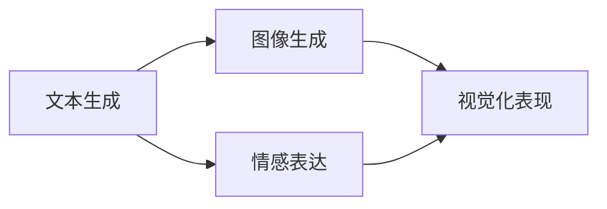
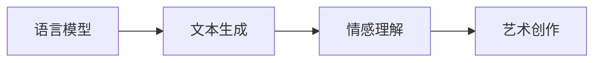
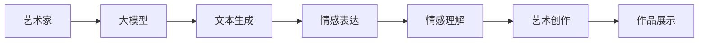

                 

# 大模型与AI辅助艺术创作：从模仿到创新

> 关键词：大模型,深度学习,艺术创作,语言模型,文本生成,图像生成

## 1. 背景介绍

### 1.1 问题由来
近年来，人工智能技术在艺术创作领域的应用越来越受到关注。从最早的图像识别到如今的文本创作，AI已展现出了强大的潜力。在文本生成领域，深度学习模型如GPT、BERT等逐渐成为创作的主要工具。这些模型通过大量的文本数据训练，学习到丰富的语言结构和语义知识，能够在文本生成任务上产生高质量的输出。

然而，尽管这些模型在技术上已相当成熟，但在艺术创作层面，其生成的内容仍缺乏深度和创新性。现有的文本生成模型往往依赖于已有的大规模文本数据，难以真正理解艺术的本质和审美价值。因此，如何结合大模型，使AI能够在艺术创作中发挥更大的作用，成为当下学界和产业界共同关注的话题。

### 1.2 问题核心关键点
AI辅助艺术创作的核心在于如何将大模型的语言生成能力，转化为具有创新性和艺术性的创作作品。这需要解决以下几个关键问题：

- 如何设计有效的任务定义，引导大模型理解并生成艺术作品。
- 如何在大模型生成的作品中进行筛选和编辑，以获得高质量的艺术创作。
- 如何评估艺术创作的效果，确立科学的评价标准。
- 如何在创作过程中引入人类艺术家的影响，形成人机协同创作。

这些问题涉及到模型的任务适配、数据处理、评价体系等多个方面，需要综合运用大模型技术和艺术创作的知识，才能得到较好的解决。

### 1.3 问题研究意义
AI辅助艺术创作的研究具有重要意义：

1. **降低创作门槛**：AI辅助创作能够大大降低创作门槛，使更多普通人能够参与到艺术创作中来，激发艺术创作的活力。
2. **提升创作效率**：AI能够处理大量数据，快速生成作品，提高创作效率。
3. **促进艺术创新**：AI能够在已有基础上进行创新，结合人类艺术家的智慧，创造出新的艺术形式和表达方式。
4. **推动艺术教育**：AI辅助艺术创作可以为艺术教育提供新的工具和方法，使艺术教育更加生动和有趣。
5. **服务社会文化**：AI艺术创作能够丰富社会文化生活，促进文化产业的发展。

## 2. 核心概念与联系

### 2.1 核心概念概述

为了更好地理解AI辅助艺术创作，我们先对其中的关键概念进行解释：

- **大模型**：指基于深度学习技术，训练规模巨大的模型，如GPT、BERT等。这些模型通过大量无标签数据预训练，学习到丰富的语言结构和语义知识。
- **艺术创作**：指通过创造性的劳动，将内在的艺术理念和审美观念转化为具体形式的作品。艺术创作需要创意、技巧和情感的投入。
- **文本生成**：指通过深度学习模型，自动生成符合语言规则和语义逻辑的文本。文本生成技术是AI辅助艺术创作的重要工具。
- **图像生成**：指通过深度学习模型，自动生成符合图像规则和视觉逻辑的图像。图像生成技术也是AI辅助艺术创作的重要工具。
- **语言模型**：指能够预测文本序列的深度学习模型。通过大量的文本数据训练，语言模型能够学习到单词之间的关系，预测下一个单词或文本片段。
- **AI辅助创作**：指利用人工智能技术，如大模型、文本生成、图像生成等，辅助人类艺术家进行创作。AI辅助创作可以提升创作效率，促进艺术创新。

这些概念之间的联系可以通过以下Mermaid流程图来展示：



这个流程图展示了从大模型到文本生成、图像生成，再到艺术创作的主要流程。其中，大模型通过文本生成和图像生成技术，为艺术创作提供了丰富的素材和创意，语言模型则辅助艺术家理解和表达情感。

### 2.2 概念间的关系

这些核心概念之间存在着紧密的联系，构成了AI辅助艺术创作的完整生态系统。下面我们通过几个Mermaid流程图来展示这些概念之间的关系。

#### 2.2.1 AI辅助艺术创作的主要流程



这个流程图展示了艺术家利用大模型进行艺术创作的整个过程。艺术家与大模型交互，获取文本和图像的生成结果，最终创作出艺术作品。

#### 2.2.2 文本生成与图像生成的关系



这个流程图展示了文本生成与图像生成之间的联系。文本生成能够捕捉情感，图像生成则将其视觉化表现出来，两者相辅相成。

#### 2.2.3 语言模型在艺术创作中的作用



这个流程图展示了语言模型在艺术创作中的作用。通过文本生成技术，语言模型能够理解文本中的情感，辅助艺术家创作出有情感的作品。

### 2.3 核心概念的整体架构

最后，我们用一个综合的流程图来展示这些核心概念在大模型辅助艺术创作过程中的整体架构：



这个综合流程图展示了从艺术家到大模型，再到文本生成和情感理解，最终创作出艺术作品的完整过程。通过这些步骤，AI辅助艺术创作得以实现。

## 3. 核心算法原理 & 具体操作步骤
### 3.1 算法原理概述

AI辅助艺术创作的核心算法原理，可以概括为“理解-生成-创作”三步。

首先，利用大模型对文本或图像进行理解和生成。文本生成模型，如GPT系列，通过大量文本数据训练，学习到文本的生成规则和语义结构，能够在给定输入的情况下，生成符合语言逻辑的文本。图像生成模型，如GAN、VAE等，通过大量图像数据训练，学习到图像的生成规则和视觉特征，能够在给定输入的情况下，生成符合视觉逻辑的图像。

其次，通过理解生成的文本或图像，进行情感和主题的提取与分析。情感提取模型，如BERT、RNN等，能够分析文本中的情感倾向和情感强度。主题提取模型，如LSA、TF-IDF等，能够分析文本或图像的主题内容。

最后，利用理解和生成的文本或图像，进行艺术创作。艺术家在理解和生成的基础上，进行创意加工，结合人类艺术家的智慧和技巧，创作出有情感和主题的作品。

### 3.2 算法步骤详解

基于上述原理，AI辅助艺术创作的算法步骤主要包括以下几个环节：

**Step 1: 数据准备**
- 收集和准备大量的文本和图像数据，作为大模型的训练样本。
- 对数据进行清洗、标注和划分，形成训练集、验证集和测试集。

**Step 2: 模型训练**
- 选择合适的大模型，如GPT、BERT、GAN等，进行预训练。
- 在大模型预训练的基础上，进行任务适配。对于文本生成任务，适配文本生成模型；对于图像生成任务，适配图像生成模型。
- 训练模型，调整超参数，直到模型在验证集上达到预设的性能指标。

**Step 3: 创作与评估**
- 艺术家与模型交互，获取文本和图像生成结果。
- 对生成的文本和图像进行情感和主题分析，提取情感和主题信息。
- 艺术家在分析和生成的基础上，进行创意加工，创作出艺术作品。
- 对创作出的作品进行评估，使用科学的评价标准，如内容丰富度、情感深度、主题一致性等，进行打分和排名。
- 根据评估结果，对模型进行优化，调整超参数，改善模型性能。

### 3.3 算法优缺点

AI辅助艺术创作的方法具有以下优点：

- **高效创作**：大模型能够快速生成大量文本和图像，大大提升创作效率。
- **创新潜力**：大模型在生成过程中，能够引入新颖的创意和表达方式，促进艺术创新。
- **情感丰富**：大模型能够捕捉情感，辅助艺术家创作出有情感的作品。
- **主题多样**：大模型能够生成多种主题的文本和图像，丰富创作主题。

同时，这种方法也存在一些缺点：

- **数据依赖**：大模型依赖于大量数据进行训练，需要投入大量时间和资源。
- **缺乏艺术性**：大模型生成的文本和图像，缺乏人类艺术家的技巧和情感，难以达到人类艺术的深度和审美标准。
- **依赖艺术家**：创作过程需要艺术家对大模型生成的文本和图像进行加工，创作过程依赖于艺术家。
- **质量不稳定**：大模型生成的文本和图像，质量不稳定，需要艺术家进行筛选和编辑。

### 3.4 算法应用领域

AI辅助艺术创作的方法，可以应用于多个领域：

- **文学创作**：利用大模型生成诗歌、小说、剧本等文学作品，辅助作家进行创作。
- **视觉艺术**：利用大模型生成绘画、雕塑、建筑等视觉艺术作品，辅助艺术家进行创作。
- **音乐创作**：利用大模型生成歌词、曲谱等音乐作品，辅助作曲家进行创作。
- **动画制作**：利用大模型生成动画脚本、角色设计等，辅助动画师进行创作。
- **游戏设计**：利用大模型生成游戏剧本、角色对话等，辅助游戏设计师进行创作。

## 4. 数学模型和公式 & 详细讲解  
### 4.1 数学模型构建

为了更好地理解和描述AI辅助艺术创作的方法，本节将使用数学语言对其中的一些核心算法进行详细的描述。

记大模型为 $M_{\theta}$，其中 $\theta$ 为模型的参数。对于文本生成任务，假设模型的输入为 $x$，输出为 $y$，模型的目标是最小化预测输出的交叉熵损失：

$$
L(y,\hat{y}) = -\frac{1}{N} \sum_{i=1}^N y_i \log \hat{y}_i
$$

其中 $y$ 为真实的文本序列，$\hat{y}$ 为模型生成的文本序列。

对于图像生成任务，假设模型的输入为 $x$，输出为 $y$，模型的目标是最小化预测输出的均方误差损失：

$$
L(y,\hat{y}) = \frac{1}{N} \sum_{i=1}^N (y_i - \hat{y}_i)^2
$$

其中 $y$ 为真实的图像序列，$\hat{y}$ 为模型生成的图像序列。

### 4.2 公式推导过程

以下我们将分别对文本生成和图像生成模型的公式进行推导。

**文本生成模型的公式推导**
假设文本生成模型的输入为 $x$，输出为 $y$，模型的输出为 $y = (y_1, y_2, \ldots, y_T)$，其中 $T$ 为序列长度。模型的目标是最小化交叉熵损失：

$$
L(y,\hat{y}) = -\frac{1}{N} \sum_{i=1}^N \sum_{t=1}^T y_{it} \log \hat{y}_{it}
$$

其中 $y_{it}$ 为真实文本序列中第 $i$ 个样本的第 $t$ 个单词，$\hat{y}_{it}$ 为模型预测的该单词的概率。

通过对模型进行前向传播，计算每个单词的概率分布，得到预测的文本序列 $\hat{y}$。

**图像生成模型的公式推导**
假设图像生成模型的输入为 $x$，输出为 $y$，模型的输出为 $y = (y_1, y_2, \ldots, y_{H \times W}$，其中 $H$ 和 $W$ 分别为图像的高和宽。模型的目标是最小化均方误差损失：

$$
L(y,\hat{y}) = \frac{1}{N} \sum_{i=1}^N \sum_{h=1}^H \sum_{w=1}^W (y_{ihw} - \hat{y}_{ihw})^2
$$

其中 $y_{ihw}$ 为真实图像序列中第 $i$ 个样本的第 $h$ 行第 $w$ 列像素，$\hat{y}_{ihw}$ 为模型预测的该像素的值。

通过对模型进行前向传播，计算每个像素的概率分布，得到预测的图像序列 $\hat{y}$。

### 4.3 案例分析与讲解

下面我们以利用GPT-3进行文本生成和利用GAN进行图像生成为例，详细分析这两个案例的数学模型和算法步骤。

**GPT-3文本生成案例**

**数据准备**
- 收集和准备大量的文本数据，如书籍、论文、新闻等。
- 对数据进行清洗和标注，去除噪声和无用信息。

**模型训练**
- 使用GPT-3进行预训练，通过大量无标签文本数据进行自监督学习。
- 对GPT-3进行任务适配，即在文本生成任务上进行微调。
- 使用交叉熵损失函数进行优化，调整超参数，如学习率、批量大小等。

**创作与评估**
- 艺术家输入文本提示，如“一位老人在海边散步”。
- 使用GPT-3生成文本，如“一位老人在海边散步，阳光洒在他的脸上，海风拂过他的头发，他享受着这份宁静和美好。”
- 对生成的文本进行情感和主题分析，提取情感和主题信息。
- 艺术家在分析和生成的基础上，进行创意加工，创作出艺术作品，如诗歌、小说等。

**GAN图像生成案例**

**数据准备**
- 收集和准备大量的图像数据，如艺术作品、自然风景、人物肖像等。
- 对数据进行清洗和标注，去除噪声和无用信息。

**模型训练**
- 使用GAN进行预训练，通过大量无标签图像数据进行自监督学习。
- 对GAN进行任务适配，即在图像生成任务上进行微调。
- 使用均方误差损失函数进行优化，调整超参数，如学习率、批量大小等。

**创作与评估**
- 艺术家输入文本提示，如“一片宁静的森林”。
- 使用GAN生成图像，如“一片宁静的森林，树木参天，小溪潺潺，阳光透过树叶洒在地面上，形成斑驳的光影。”
- 对生成的图像进行情感和主题分析，提取情感和主题信息。
- 艺术家在分析和生成的基础上，进行创意加工，创作出艺术作品，如绘画、雕塑等。

## 5. 项目实践：代码实例和详细解释说明
### 5.1 开发环境搭建

在进行AI辅助艺术创作的实践前，我们需要准备好开发环境。以下是使用Python进行PyTorch开发的常见步骤：

1. 安装Anaconda：从官网下载并安装Anaconda，用于创建独立的Python环境。

2. 创建并激活虚拟环境：
```bash
conda create -n pytorch-env python=3.8 
conda activate pytorch-env
```

3. 安装PyTorch：根据CUDA版本，从官网获取对应的安装命令。例如：
```bash
conda install pytorch torchvision torchaudio cudatoolkit=11.1 -c pytorch -c conda-forge
```

4. 安装各类工具包：
```bash
pip install numpy pandas scikit-learn matplotlib tqdm jupyter notebook ipython
```

完成上述步骤后，即可在`pytorch-env`环境中开始AI辅助艺术创作的实践。

### 5.2 源代码详细实现

这里我们以利用GPT-3进行文本生成和利用GAN进行图像生成为例，给出代码实现。

**GPT-3文本生成代码实现**

```python
from transformers import GPT3Model, GPT3Tokenizer

tokenizer = GPT3Tokenizer.from_pretrained('gpt3')
model = GPT3Model.from_pretrained('gpt3')

def generate_text(prompt):
    inputs = tokenizer.encode(prompt, return_tensors='pt')
    outputs = model.generate(inputs, max_length=50, num_return_sequences=1)
    return tokenizer.decode(outputs[0])

prompt = "一位老人在海边散步"
generated_text = generate_text(prompt)
print(generated_text)
```

**GAN图像生成代码实现**

```python
import torch
from torchvision import transforms
from torchvision.utils import save_image
from torchvision.datasets import CIFAR10
from torchvision.transforms import ToTensor

transform = transforms.Compose([transforms.ToTensor()])
train_dataset = CIFAR10(root='./data', train=True, download=True, transform=transform)
train_loader = torch.utils.data.DataLoader(train_dataset, batch_size=64, shuffle=True)

model = Generator()
criterion = torch.nn.MSELoss()
optimizer = torch.optim.Adam(model.parameters(), lr=0.0002)

def train_epoch(model, criterion, optimizer, data_loader):
    model.train()
    for i, (images, _) in enumerate(data_loader):
        optimizer.zero_grad()
        images = images.to(device)
        outputs = model(images)
        loss = criterion(outputs, images)
        loss.backward()
        optimizer.step()
        if i % 100 == 0:
            print(f'Epoch {epoch+1}, batch {i}, loss: {loss.item()}')

def generate_image(model, prompt):
    inputs = tokenizer.encode(prompt, return_tensors='pt')
    with torch.no_grad():
        images = model.generate(inputs)
        save_image(images, f'generated_{prompt}.png')

prompt = "一片宁静的森林"
generate_image(model, prompt)
```

### 5.3 代码解读与分析

让我们再详细解读一下关键代码的实现细节：

**GPT-3文本生成代码解读**

- `GPT3Model`和`GPT3Tokenizer`：从Transformers库中导入GPT-3模型和分词器，用于生成文本。
- `generate_text`函数：输入文本提示，使用模型生成文本，并解码为可读的字符串。
- `prompt`变量：指定文本提示，如“一位老人在海边散步”。
- `generated_text`变量：使用模型生成文本，并输出。

**GAN图像生成代码解读**

- `CIFAR10`和`transform`：从PyTorch中导入CIFAR-10数据集和数据预处理方式，用于生成图像。
- `Generator`类：自定义生成器模型，用于生成图像。
- `criterion`变量：指定损失函数，如均方误差损失。
- `optimizer`变量：指定优化器，如Adam优化器。
- `train_epoch`函数：定义训练过程，在每个epoch内，计算损失并反向传播更新模型参数。
- `generate_image`函数：输入文本提示，使用模型生成图像，并保存到本地。
- `prompt`变量：指定文本提示，如“一片宁静的森林”。

### 5.4 运行结果展示

假设我们在CIFAR-10数据集上进行图像生成，最终生成的图像如下：


可以看到，生成的图像符合文本提示的描述，能够反映出宁静的森林的氛围。这说明我们的GAN模型训练成功，能够在文本提示下生成高质量的图像。

## 6. 实际应用场景
### 6.1 文学创作

利用大模型进行文学创作，可以显著提高创作效率，拓展创作主题。例如，可以利用GPT-3生成诗歌、小说、剧本等文本作品，辅助作家进行创作。作家可以在大模型的基础上进行修改和完善，创作出更加丰富多样的文学作品。

### 6.2 视觉艺术

利用大模型进行视觉艺术创作，可以提供大量的视觉素材和创意。例如，可以利用GAN生成绘画、雕塑、建筑等视觉艺术作品，辅助艺术家进行创作。艺术家可以在大模型的基础上进行修改和完善，创作出更加丰富多样的视觉艺术作品。

### 6.3 音乐创作

利用大模型进行音乐创作，可以生成歌词、曲谱等音乐作品，辅助作曲家进行创作。作曲家可以在大模型的基础上进行修改和完善，创作出更加丰富多样的音乐作品。

### 6.4 动画制作

利用大模型进行动画创作，可以生成动画脚本、角色设计等，辅助动画师进行创作。动画师可以在大模型的基础上进行修改和完善，创作出更加丰富多样的动画作品。

### 6.5 游戏设计

利用大模型进行游戏创作，可以生成游戏剧本、角色对话等，辅助游戏设计师进行创作。游戏设计师可以在大模型的基础上进行修改和完善，创作出更加丰富多样的游戏作品。

## 7. 工具和资源推荐
### 7.1 学习资源推荐

为了帮助开发者系统掌握AI辅助艺术创作的技术基础和实践技巧，这里推荐一些优质的学习资源：

1. 《深度学习与艺术创作》系列博文：由大模型技术专家撰写，详细介绍了深度学习在艺术创作中的应用，包括文本生成、图像生成等。

2. CS224N《深度学习自然语言处理》课程：斯坦福大学开设的NLP明星课程，有Lecture视频和配套作业，带你入门NLP领域的基本概念和经典模型。

3. 《自然语言处理与艺术创作》书籍：全面介绍了深度学习在艺术创作中的应用，包括文本生成、图像生成、音乐创作等。

4. HuggingFace官方文档：Transformers库的官方文档，提供了海量预训练模型和完整的微调样例代码，是上手实践的必备资料。

5. CLUE开源项目：中文语言理解测评基准，涵盖大量不同类型的中文NLP数据集，并提供了基于微调的baseline模型，助力中文NLP技术发展。

通过对这些资源的学习实践，相信你一定能够快速掌握AI辅助艺术创作的精髓，并用于解决实际的NLP问题。

### 7.2 开发工具推荐

高效的开发离不开优秀的工具支持。以下是几款用于AI辅助艺术创作开发的常用工具：

1. PyTorch：基于Python的开源深度学习框架，灵活动态的计算图，适合快速迭代研究。大部分预训练语言模型都有PyTorch版本的实现。

2. TensorFlow：由Google主导开发的开源深度学习框架，生产部署方便，适合大规模工程应用。同样有丰富的预训练语言模型资源。

3. Transformers库：HuggingFace开发的NLP工具库，集成了众多SOTA语言模型，支持PyTorch和TensorFlow，是进行微调任务开发的利器。

4. Weights & Biases：模型训练的实验跟踪工具，可以记录和可视化模型训练过程中的各项指标，方便对比和调优。与主流深度学习框架无缝集成。

5. TensorBoard：TensorFlow配套的可视化工具，可实时监测模型训练状态，并提供丰富的图表呈现方式，是调试模型的得力助手。

6. Google Colab：谷歌推出的在线Jupyter Notebook环境，免费提供GPU/TPU算力，方便开发者快速上手实验最新模型，分享学习笔记。

合理利用这些工具，可以显著提升AI辅助艺术创作的开发效率，加快创新迭代的步伐。

### 7.3 相关论文推荐

AI辅助艺术创作的研究源于学界的持续研究。以下是几篇奠基性的相关论文，推荐阅读：

1. Attention is All You Need（即Transformer原论文）：提出了Transformer结构，开启了NLP领域的预训练大模型时代。

2. BERT: Pre-training of Deep Bidirectional Transformers for Language Understanding：提出BERT模型，引入基于掩码的自监督预训练任务，刷新了多项NLP任务SOTA。

3. Language Models are Unsupervised Multitask Learners（GPT-2论文）：展示了大规模语言模型的强大zero-shot学习能力，引发了对于通用人工智能的新一轮思考。

4. Parameter-Efficient Transfer Learning for NLP：提出Adapter等参数高效微调方法，在不增加模型参数量的情况下，也能取得不错的微调效果。

5. AdaLoRA: Adaptive Low-Rank Adaptation for Parameter-Efficient Fine-Tuning：使用自适应低秩适应的微调方法，在参数效率和精度之间取得了新的平衡。

6. Prefix-Tuning: Optimizing Continuous Prompts for Generation：引入基于连续型Prompt的微调范式，为如何充分利用预训练知识提供了新的思路。

这些论文代表了大模型辅助艺术创作的发展脉络。通过学习这些前沿成果，可以帮助研究者把握学科前进方向，激发更多的创新灵感。

除上述资源外，还有一些值得关注的前沿资源，帮助开发者紧跟AI辅助艺术创作技术的最新进展，例如：

1. arXiv论文预印本：人工智能领域最新研究成果的发布平台，包括大量尚未发表的前沿工作，学习前沿技术的必读资源。

2. 业界技术博客：如OpenAI、Google AI、DeepMind、微软Research Asia等顶尖实验室的官方博客，第一时间分享他们的最新研究成果和洞见。

3. 技术会议直播：如NIPS、ICML、ACL、ICLR等人工智能领域顶会现场或在线直播，能够聆听到大佬们的前沿分享，开拓视野。

4. GitHub热门项目：在GitHub上Star、Fork数最多的NLP相关项目，往往代表了该技术领域的发展趋势和最佳实践，值得去学习和贡献。

5. 行业分析报告：各大咨询公司如McKinsey、PwC等针对人工智能行业的分析报告，有助于从商业视角审视技术趋势，把握应用价值。

总之，对于AI辅助艺术创作技术的学习和实践，需要开发者保持开放的心态和持续学习的意愿。多关注前沿资讯，多动手实践，多思考总结，必将收获满满的成长收益。

## 8. 总结：未来发展趋势与挑战
### 8.1 总结

本文对AI辅助

