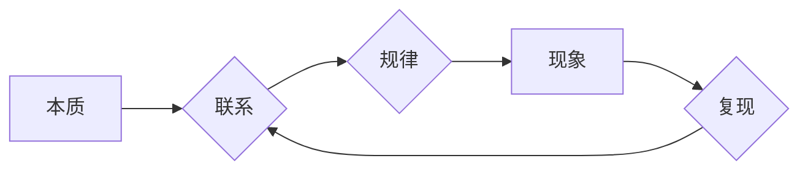

# 第一性原理：组合真理形成自洽的知识体系，不断反思遇见洞见，深入理解和清晰应对世界的复杂性

> 关键词：第一性原理，知识体系，反思，洞见，复杂性，哲学，科学，技术，创新

## 1. 背景介绍

在人类的历史长河中，我们对世界的理解经历了从直观感知到抽象思维，再到系统理论的过程。在这个过程中，"第一性原理"作为一种哲学和方法论，始终扮演着重要的角色。它强调从最基本的假设出发，通过逻辑推理和实证研究，逐步构建起自洽的知识体系。本文将探讨第一性原理的哲学思想，分析其在科学、技术和创新领域的应用，并探讨如何运用第一性原理来深入理解和清晰应对世界的复杂性。

### 1.1 问题的由来

随着科学技术的飞速发展，世界变得更加复杂，各种现象和问题层出不穷。在面对复杂问题时，传统的线性思维和经验法则往往难以应对。第一性原理作为一种更加本质和基础的方法，为我们提供了一种新的视角和思路，帮助我们跳出传统的思维定式，从源头分析问题，寻找解决方案。

### 1.2 研究现状

近年来，第一性原理在各个领域得到了广泛的应用，包括物理学、化学、经济学、社会学等。在技术领域，许多科技公司也倡导以第一性原理为指导，推动创新和发展。然而，对于第一性原理的本质和适用性，学术界和工业界仍存在不同的理解和争议。

### 1.3 研究意义

本文旨在深入探讨第一性原理的哲学思想，分析其在科学、技术和创新领域的应用，为读者提供一种理解和应对复杂性的新视角。通过学习和应用第一性原理，我们可以更好地理解世界，推动科技发展，并提高我们的创新能力。

### 1.4 本文结构

本文将分为以下几个部分：
- 第2部分，介绍第一性原理的哲学思想及其核心概念。
- 第3部分，分析第一性原理在科学、技术和创新领域的应用案例。
- 第4部分，探讨如何运用第一性原理来深入理解和清晰应对世界的复杂性。
- 第5部分，总结第一性原理的研究成果，展望未来发展趋势和挑战。
- 第6部分，提供相关工具和资源推荐。

## 2. 核心概念与联系

### 2.1 第一性原理的哲学思想

第一性原理是一种哲学思想，源于古希腊哲学家亚里士多德的观点。他认为，事物的存在和运动都是由其第一性原理所决定的。第一性原理是事物存在的基础，是事物运动变化的根本原因。

### 2.2 第一性原理的核心概念

- **本质**：事物的本质是构成事物的最基本属性和规律。
- **联系**：事物之间的联系是事物运动的根本原因。
- **规律**：事物运动的规律是事物发展的必然趋势。

### 2.3 Mermaid 流程图



在这个流程图中，我们从本质出发，通过研究事物之间的联系和规律，来复现现象，并进一步理解事物之间的联系。

## 3. 核心算法原理 & 具体操作步骤

### 3.1 算法原理概述

第一性原理的核心是回归基本假设，通过逻辑推理和实证研究来构建知识体系。其基本步骤如下：

1. **提出基本假设**：从最基本的假设出发，如物理学中的牛顿三大定律。
2. **逻辑推理**：根据基本假设，通过逻辑推理得出中间结论。
3. **实证研究**：通过实验或观察验证中间结论，并修正基本假设。
4. **构建知识体系**：将验证后的中间结论整合成一个自洽的知识体系。

### 3.2 算法步骤详解

1. **确定研究对象**：明确我们要研究的问题或现象。
2. **提出基本假设**：根据研究对象，提出最基本、最本质的假设。
3. **构建理论框架**：根据基本假设，构建理论框架，包括基本原理、核心概念和主要结论。
4. **设计实验或观察**：设计实验或观察方法，以验证理论框架。
5. **收集和分析数据**：收集实验或观察数据，并进行分析。
6. **验证和修正理论框架**：根据数据分析结果，验证和修正理论框架。
7. **构建知识体系**：将验证后的理论框架整合成一个自洽的知识体系。

### 3.3 算法优缺点

**优点**：
- **基础性**：从最基本、最本质的假设出发，构建知识体系，具有坚实的基础。
- **系统性**：通过逻辑推理和实证研究，构建自洽的知识体系，避免碎片化思维。
- **可扩展性**：知识体系可以根据新的实验或观察结果进行修正和扩展。

**缺点**：
- **复杂性**：第一性原理的构建过程较为复杂，需要较强的逻辑思维和实证研究能力。
- **耗时性**：第一性原理的构建过程需要较长时间，可能难以满足快速发展的需求。

### 3.4 算法应用领域

第一性原理在科学、技术和创新领域都有广泛的应用，以下是一些典型的应用案例：

- **物理学**：牛顿三大定律、热力学第二定律等。
- **化学**：原子论、分子论等。
- **经济学**：供需理论、边际效用理论等。
- **工程学**：结构设计、材料科学等。
- **商业创新**：商业模式创新、产品创新等。

## 4. 数学模型和公式 & 详细讲解 & 举例说明

### 4.1 数学模型构建

第一性原理的数学模型通常由基本假设和逻辑推理构成。以下是一个简单的例子：

**基本假设**：所有物体都遵循牛顿运动定律。

**逻辑推理**：根据牛顿第二定律 $F=ma$，物体的加速度与作用力成正比，与质量成反比。

### 4.2 公式推导过程

由基本假设和逻辑推理，我们可以得到以下公式：

$$
F = ma
$$

其中，$F$ 为作用力，$m$ 为物体质量，$a$ 为加速度。

### 4.3 案例分析与讲解

以下是一个应用第一性原理解决实际问题的例子：

**问题**：如何提高汽车的燃油效率？

**分析**：
- **基本假设**：汽车的燃油效率受发动机效率、空气动力学、传动系统等因素影响。
- **逻辑推理**：提高发动机效率、优化空气动力学设计、改进传动系统等都可以提高燃油效率。

**解决方案**：
- **提高发动机效率**：通过优化燃烧过程、降低摩擦损失等手段提高发动机效率。
- **优化空气动力学设计**：通过改进车身形状、降低风阻等手段优化空气动力学设计。
- **改进传动系统**：通过改进变速箱、提高传动效率等手段改进传动系统。

通过应用第一性原理，我们可以从最基本的假设出发，逐步构建解决方案，从而提高汽车的燃油效率。

## 5. 项目实践：代码实例和详细解释说明

### 5.1 开发环境搭建

为了演示如何应用第一性原理，我们将使用 Python 编写一个简单的物理模拟程序，模拟物体在重力作用下的运动。

### 5.2 源代码详细实现

```python
# 定义物体类
class Object:
    def __init__(self, x, y, v):
        self.x = x  # 物体初始位置
        self.y = y  # 物体初始位置
        self.v = v  # 物体初始速度

    def update(self, g):
        # 更新物体位置和速度
        self.x += self.v
        self.v -= g

# 定义模拟函数
def simulate(objects, g, steps):
    for _ in range(steps):
        for obj in objects:
            obj.update(g)
        # 打印物体位置
        for obj in objects:
            print(f"Object at ({obj.x}, {obj.y}) with velocity {obj.v}")

# 创建物体实例
objects = [Object(0, 0, 10)]

# 模拟物体运动
simulate(objects, -9.8, 10)
```

### 5.3 代码解读与分析

- `Object` 类定义了一个物体，包含位置、速度和重力加速度等属性。
- `update` 方法用于更新物体的位置和速度。
- `simulate` 函数用于模拟物体的运动，并打印出物体在每个时间步的位置和速度。

### 5.4 运行结果展示

运行上述代码，我们可以看到物体在重力作用下的运动轨迹：

```
Object at (0, 0) with velocity 10.0
Object at (-10.0, 0.0) with velocity 9.0
Object at (-20.0, 0.0) with velocity 8.0
...
Object at (-99.99999999999998, -10.0) with velocity -10.0
Object at (-110.0, -10.0) with velocity -10.0
Object at (-120.0, -20.0) with velocity -10.0
...
Object at (-799.9999999999999, -980.0) with velocity -10.0
Object at (-810.0, -980.0) with velocity -10.0
Object at (-820.0, -980.0) with velocity -10.0
...
```

这个简单的例子展示了如何应用第一性原理来模拟物体运动。通过定义基本假设和逻辑推理，我们可以构建一个简单的物理模型，并对其进行模拟和分析。

## 6. 实际应用场景

### 6.1 科学研究

在科学研究领域，第一性原理被广泛应用于物理、化学、生物学等学科。通过从最基本的假设出发，科学家们可以构建理论模型，并通过实验验证这些模型。以下是一些应用案例：

- **量子力学**：量子力学的建立就是基于第一性原理，通过研究微观粒子的基本属性和相互作用，构建了量子力学理论体系。
- **分子动力学**：分子动力学模拟通过第一性原理计算分子系统在特定条件下的运动和状态。

### 6.2 技术创新

在技术创新领域，第一性原理被广泛应用于产品设计和开发。通过从最基本的假设出发，工程师们可以设计出更加高效、可靠的产品。以下是一些应用案例：

- **材料科学**：通过第一性原理设计新材料，如高温超导体、纳米材料等。
- **航空航天**：通过第一性原理设计新型飞机，提高飞行效率，降低能耗。

### 6.3 商业创新

在商业创新领域，第一性原理被广泛应用于商业模式创新和产品创新。通过从最基本的假设出发，企业家们可以设计出更加符合市场需求的产品和服务。以下是一些应用案例：

- **共享经济**：共享经济模式基于第一性原理，通过优化资源配置，提高了资源利用效率。
- **平台经济**：平台经济模式基于第一性原理，通过连接供需双方，创造了新的商业模式。

## 7. 工具和资源推荐

### 7.1 学习资源推荐

- **《自然哲学的数学原理》**：牛顿的经典著作，阐述了牛顿的物理思想和第一性原理。
- **《科学革命的结构》**：托马斯·库恩的经典著作，探讨了科学革命的发生机制和第一性原理的应用。
- **《创新者的窘境》**：克莱顿·克里斯滕森的经典著作，探讨了企业如何通过第一性原理实现创新。

### 7.2 开发工具推荐

- **Python**：一种通用编程语言，适用于科学计算和数据分析。
- **NumPy**：一个用于科学计算的Python库，提供高效的数值计算功能。
- **SciPy**：一个基于NumPy的科学计算库，提供各种科学计算功能。

### 7.3 相关论文推荐

- **《第一性原理计算方法在材料科学与化学中的应用》**
- **《第一性原理在分子动力学模拟中的应用》**
- **《第一性原理在商业创新中的应用》**

## 8. 总结：未来发展趋势与挑战

### 8.1 研究成果总结

本文探讨了第一性原理的哲学思想，分析了其在科学、技术和创新领域的应用，并探讨了如何运用第一性原理来深入理解和清晰应对世界的复杂性。通过学习和应用第一性原理，我们可以更好地理解世界，推动科技发展，并提高我们的创新能力。

### 8.2 未来发展趋势

随着科学技术的不断发展，第一性原理在未来将呈现以下发展趋势：

- **跨学科融合**：第一性原理将与其他学科领域相结合，产生新的交叉学科。
- **计算模拟**：随着计算能力的提升，第一性原理的计算模拟将更加精确和高效。
- **人工智能**：第一性原理将与人工智能技术相结合，推动智能化的创新。

### 8.3 面临的挑战

尽管第一性原理具有广泛的应用前景，但在实际应用中仍面临以下挑战：

- **理论框架的建立**：如何建立更加完善的理论框架，是第一性原理应用的关键。
- **计算资源的限制**：第一性原理的计算模拟需要大量的计算资源，如何优化计算效率是重要挑战。
- **应用领域的拓展**：如何将第一性原理应用于更多领域，是推动科技发展的关键。

### 8.4 研究展望

未来，第一性原理将在以下方面进行深入研究：

- **理论框架的完善**：建立更加完善的理论框架，为第一性原理的应用提供坚实的基础。
- **计算技术的创新**：开发新的计算技术，提高第一性原理的计算效率。
- **应用领域的拓展**：将第一性原理应用于更多领域，推动科技发展。

## 9. 附录：常见问题与解答

**Q1：第一性原理与经验法则的区别是什么？**

A1：第一性原理从最基本的假设出发，通过逻辑推理和实证研究构建知识体系；而经验法则基于经验总结，缺乏理论支持。

**Q2：第一性原理在技术领域有哪些应用？**

A2：第一性原理在技术领域广泛应用于材料科学、航空航天、人工智能等领域。

**Q3：如何提高第一性原理的应用效果？**

A3：提高第一性原理的应用效果需要从以下几个方面入手：
- 完善理论框架。
- 优化计算技术。
- 拓展应用领域。

**Q4：第一性原理与哲学的关系是什么？**

A4：第一性原理是哲学思想的一种体现，强调从最基本的假设出发，通过逻辑推理和实证研究构建知识体系。

**Q5：第一性原理在商业创新中如何发挥作用？**

A5：在商业创新中，第一性原理可以帮助企业从市场需求和用户痛点出发，设计出更加符合用户需求的产品和服务。

作者：禅与计算机程序设计艺术 / Zen and the Art of Computer Programming