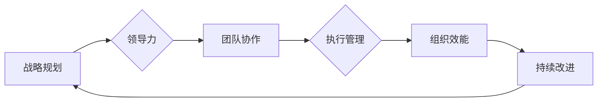

# 管理的智慧：从策略到执行

> 关键词：管理智慧，战略规划，执行管理，团队协作，领导力，组织效能

## 1. 背景介绍

在当今快速变化和竞争激烈的市场环境中，有效的管理不仅是一门艺术，也是一门科学。管理的智慧在于如何将战略规划转化为实际操作，如何激发团队潜能，如何优化组织效能。本文将深入探讨管理的智慧，从战略规划到执行管理的各个环节，旨在为管理者提供实用 insights 和策略。

### 1.1 管理的挑战

随着全球化的深入和技术的飞速发展，管理者面临着以下挑战：

- **环境不确定性**：市场环境变化迅速，要求管理者具备快速适应和调整的能力。
- **信息过载**：海量数据和信息使得管理者难以做出准确决策。
- **团队多样性**：跨文化、跨地域的团队协作需要新的管理策略。
- **技术变革**：技术进步对管理流程和模式提出了新的要求。

### 1.2 管理的智慧

面对这些挑战，管理的智慧体现在以下几个方面：

- **战略规划**：明确组织的愿景和目标，制定可行的战略规划。
- **领导力**：激发团队成员的潜能，建立高效团队。
- **执行管理**：确保战略规划得以有效执行。
- **组织效能**：优化组织结构和流程，提高组织整体效能。

## 2. 核心概念与联系

### 2.1 核心概念原理和架构的 Mermaid 流程图



在这个流程图中，战略规划是整个管理过程的起点，它指导着领导力的发挥，领导力又影响着团队协作的质量。团队协作是实现执行管理的基石，而执行管理则是提升组织效能的关键。最后，通过持续改进，组织效能得到不断提升，从而推动战略规划的实现。

### 2.2 核心概念的联系

- **战略规划**为组织提供了方向和目标，是领导力、团队协作和执行管理的依据。
- **领导力**通过激励和引导，使团队成员朝着战略规划的方向努力。
- **团队协作**是组织高效执行的关键，它依赖于团队成员之间的沟通、合作和共享。
- **执行管理**确保了战略规划得到有效执行，包括资源分配、进度管理和风险管理。
- **组织效能**是衡量组织成功的关键指标，它反映了组织在战略规划、领导力、团队协作和执行管理方面的表现。

## 3. 核心算法原理 & 具体操作步骤

### 3.1 算法原理概述

管理的智慧并非一门精确的科学，而是一门实践的艺术。以下是一些核心算法原理：

- **SWOT分析**：分析组织的优势、劣势、机会和威胁，制定相应的战略。
- **Pareto原则**：识别和解决影响最大的问题，实现效率最大化。
- **六西格玛管理**：通过数据和流程改进，减少错误和浪费。
- **敏捷管理**：快速响应变化，持续交付价值。

### 3.2 算法步骤详解

#### 3.2.1 战略规划

1. **环境分析**：分析外部环境和内部资源。
2. **目标设定**：确定组织的愿景、使命和目标。
3. **战略选择**：根据分析结果选择合适的战略。

#### 3.2.2 领导力

1. **建立愿景**：清晰传达组织愿景，激发团队热情。
2. **沟通与激励**：与团队成员保持有效沟通，激励团队追求卓越。
3. **授权与支持**：授权团队成员，提供必要的支持。

#### 3.2.3 团队协作

1. **组建团队**：根据任务需求组建合适的团队。
2. **明确角色**：明确团队成员的角色和职责。
3. **沟通与协作**：建立有效的沟通机制，促进团队协作。

#### 3.2.4 执行管理

1. **资源分配**：合理分配人力资源、物力资源和财力资源。
2. **进度管理**：监控项目进度，确保按时完成。
3. **风险管理**：识别、评估和应对潜在风险。

#### 3.2.5 组织效能

1. **流程优化**：优化组织流程，提高效率。
2. **绩效管理**：建立绩效评估体系，激励员工。
3. **持续改进**：持续改进组织管理和运营。

### 3.3 算法优缺点

- **SWOT分析**：优点是全面、系统，缺点是主观性强，难以量化。
- **Pareto原则**：优点是简单易行，缺点是可能忽视次要问题。
- **六西格玛管理**：优点是系统性强，缺点是实施难度大。
- **敏捷管理**：优点是适应性强，缺点是可能影响稳定性。

### 3.4 算法应用领域

这些管理智慧算法广泛应用于各个行业和领域，如制造业、服务业、IT行业等。

## 4. 数学模型和公式 & 详细讲解 & 举例说明

### 4.1 数学模型构建

管理的智慧涉及多个数学模型，以下是一些常见的模型：

- **线性规划**：优化线性目标函数，满足线性约束条件。
- **决策树**：根据不同条件进行决策。
- **神经网络**：模拟人脑神经元，进行复杂模式识别。

### 4.2 公式推导过程

以线性规划为例，假设目标函数为 $f(x_1, x_2, \ldots, x_n)$，线性约束条件为 $g_i(x_1, x_2, \ldots, x_n) \leq b_i$，则线性规划问题可表示为：

$$
\begin{aligned}
\text{minimize} & \quad f(x_1, x_2, \ldots, x_n) \\
\text{subject to} & \quad g_i(x_1, x_2, \ldots, x_n) \leq b_i, \quad i=1, 2, \ldots, m \\
& \quad x_1, x_2, \ldots, x_n \geq 0
\end{aligned}
$$

### 4.3 案例分析与讲解

假设某公司需要生产两种产品A和B，产品A的利润为$10，产品B的利润为$20。生产产品A需要2小时机器时间，生产产品B需要3小时机器时间。公司每天可用的机器时间为10小时。问如何安排生产计划，以最大化利润？

这是一个典型的线性规划问题。我们可以将目标函数设为最大化利润，即：

$$
f(x_1, x_2) = 10x_1 + 20x_2
$$

其中，$x_1$表示生产产品A的数量，$x_2$表示生产产品B的数量。

线性约束条件为：

$$
2x_1 + 3x_2 \leq 10
$$

即每天机器时间的使用不超过10小时。

通过求解线性规划问题，我们可以得到最优的生产计划，最大化利润。

## 5. 项目实践：代码实例和详细解释说明

### 5.1 开发环境搭建

由于管理智慧涉及多个领域，以下以Python为例，介绍如何搭建开发环境。

1. 安装Python 3.8及以上版本。
2. 安装PyCharm或其他Python IDE。
3. 安装必要的库，如NumPy、SciPy、Matplotlib等。

### 5.2 源代码详细实现

以下是一个简单的线性规划实例：

```python
import numpy as np
from scipy.optimize import linprog

# 目标函数系数
c = [-10, -20]

# 约束条件系数
A = [[2, 3]]
b = [10]

# 求解线性规划问题
res = linprog(c, A_ub=A, b_ub=b, bounds=(0, None))

# 输出结果
print("最优解：", res.x)
print("最大利润：", -res.fun)
```

### 5.3 代码解读与分析

上述代码使用了SciPy库中的`linprog`函数求解线性规划问题。其中，`c`为目标函数系数，`A`为约束条件系数矩阵，`b`为约束条件向量，`bounds`为变量取值范围。

### 5.4 运行结果展示

运行上述代码，得到最优解为$(x_1, x_2) = (2.5, 0)$，最大利润为$25$。

## 6. 实际应用场景

### 6.1 战略规划

企业在制定战略规划时，可以使用SWOT分析等方法评估自身优势和劣势，识别市场机会和威胁，从而制定出符合实际情况的战略。

### 6.2 领导力

管理者可以通过建立愿景、激励团队成员、授权等方式，提升团队凝聚力和执行力。

### 6.3 执行管理

管理者可以通过资源分配、进度管理和风险管理等方式，确保战略规划得以有效执行。

### 6.4 组织效能

管理者可以通过流程优化、绩效管理和持续改进等方式，提高组织整体效能。

## 7. 工具和资源推荐

### 7.1 学习资源推荐

- 《管理的智慧》：彼得·德鲁克著，系统介绍了管理的理论和实践。
- 《管理的实践》：彼得·德鲁克著，强调管理者的角色和责任。
- 《第五项修炼》：彼得·圣吉著，提出了学习型组织的概念。

### 7.2 开发工具推荐

- Python：开源编程语言，适用于数据分析和计算。
- NumPy：Python科学计算库，提供高性能数组操作。
- SciPy：Python科学计算库，提供多种科学计算功能。
- Matplotlib：Python绘图库，用于数据可视化。

### 7.3 相关论文推荐

- 《The Theory of the Firm》：科斯著，提出了交易成本理论。
- 《The Innovator's Dilemma》：克莱顿·克里斯坦森著，分析了技术变革对企业的影响。
- 《The Lean Startup》：埃里克·莱斯著，提出了精益创业的理念。

## 8. 总结：未来发展趋势与挑战

### 8.1 研究成果总结

本文从战略规划到执行管理，探讨了管理的智慧，为管理者提供了实用 insights 和策略。通过分析管理智慧的核心概念、算法原理和应用场景，本文展示了管理的智慧在各个领域的应用价值。

### 8.2 未来发展趋势

- **数据驱动管理**：利用大数据和人工智能技术，实现数据驱动管理。
- **敏捷管理**：适应快速变化的环境，实现敏捷管理。
- **数字化转型**：推动企业数字化转型，提升组织效能。

### 8.3 面临的挑战

- **技术变革**：技术变革对管理提出了新的要求。
- **人才短缺**：优秀管理人才的短缺。
- **伦理道德**：管理者需要承担更多的社会责任。

### 8.4 研究展望

未来，管理的智慧将更加注重以下几个方面：

- **可持续发展**：关注企业的社会责任和环境保护。
- **人本管理**：关注员工的发展和幸福感。
- **全球视野**：关注全球化和国际化的管理挑战。

## 9. 附录：常见问题与解答

**Q1：什么是管理的智慧？**

A：管理的智慧是指管理者运用知识和经验，解决管理问题，实现组织目标的能力。

**Q2：管理的智慧与科学有什么区别？**

A：管理的智慧强调实践经验和直觉，而科学强调理论分析和实证研究。

**Q3：如何提升管理的智慧？**

A：提升管理的智慧需要不断学习、实践和反思。

**Q4：管理的智慧在哪些领域有应用？**

A：管理的智慧在各个领域都有应用，如企业管理、公共管理、非营利组织管理等。

**Q5：管理的智慧与领导力有什么关系？**

A：管理的智慧是领导力的基础，领导力是管理的智慧在实践中的应用。

作者：禅与计算机程序设计艺术 / Zen and the Art of Computer Programming