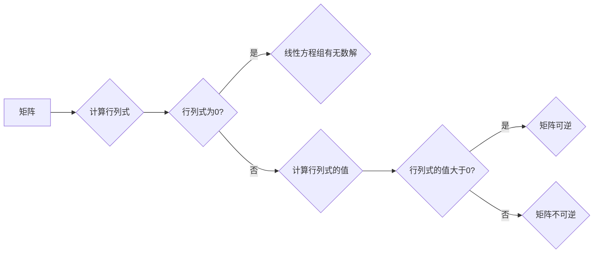

# 线性代数导引：三阶行列式

> 关键词：线性代数，行列式，三阶行列式，计算方法，应用，编程实现

## 1. 背景介绍

线性代数是现代数学的重要组成部分，它在科学和工程领域有着广泛的应用。行列式是线性代数中的一个核心概念，它不仅能够描述线性方程组的解的情况，还能够用于计算矩阵的逆矩阵和行列式的性质。三阶行列式作为行列式的一个具体例子，是线性代数学习的基础。

### 1.1 行列式的由来

行列式最早可以追溯到17世纪的欧洲，当时主要用于解决线性方程组的解法。行列式的概念逐渐发展，现在已经成为线性代数中的一个基本工具。

### 1.2 研究意义

掌握三阶行列式的计算方法对于理解线性代数的其他概念和解决实际问题具有重要意义。本文将详细介绍三阶行列式的概念、计算方法、应用以及编程实现。

### 1.3 本文结构

本文将分为以下几个部分：

- 核心概念与联系
- 核心算法原理 & 具体操作步骤
- 数学模型和公式 & 详细讲解 & 举例说明
- 项目实践：代码实例和详细解释说明
- 实际应用场景
- 工具和资源推荐
- 总结：未来发展趋势与挑战
- 附录：常见问题与解答

## 2. 核心概念与联系

### 2.1 核心概念

#### 2.1.1 矩阵

矩阵是线性代数中最基本的概念之一。一个m×n的矩阵可以表示为：

$$
A = \begin{pmatrix}
a_{11} & a_{12} & \cdots & a_{1n} \\
a_{21} & a_{22} & \cdots & a_{2n} \\
\vdots & \vdots & \ddots & \vdots \\
a_{m1} & a_{m2} & \cdots & a_{mn}
\end{pmatrix}
$$

#### 2.1.2 行列式

行列式是一个n×n矩阵的数字，通常表示为 |A|。对于三阶矩阵A，其行列式可以表示为：

$$
|A| = \begin{vmatrix}
a_{11} & a_{12} & a_{13} \\
a_{21} & a_{22} & a_{23} \\
a_{31} & a_{32} & a_{33}
\end{vmatrix}
$$

#### 2.1.3 行列式的性质

- 行列式的值在行或列交换时变号。
- 行列式的值在行或列乘以一个常数时，该常数乘以行列式的值。
- 行列式的值在两行（或两列）成比例时为零。

### 2.2 核心概念原理和架构的 Mermaid 流程图



## 3. 核心算法原理 & 具体操作步骤

### 3.1 算法原理概述

计算三阶行列式的原理基于拉普拉斯展开。拉普拉斯展开是将行列式按照某一行或某一列展开，将行列式分解为多个小行列式的和。

### 3.2 算法步骤详解

1. 选择一个行或列进行展开。
2. 对选定的行或列中的每个元素，创建一个小行列式，即将选定的行或列中包含该元素的行和列删除，剩余的矩阵构成小行列式。
3. 计算每个小行列式的值，并将它们乘以相应的元素和其位置的符号（奇偶性）。
4. 将所有小行列式的值相加，得到最终的行列式值。

### 3.3 算法优缺点

#### 3.3.1 优点

- 算法简单易懂，易于实现。
- 对于三阶行列式，计算步骤明确，易于手动计算。

#### 3.3.2 缺点

- 对于高阶行列式，计算步骤繁琐，容易出错。
- 计算效率较低，不适合大规模矩阵的计算。

### 3.4 算法应用领域

三阶行列式在以下领域有应用：

- 解线性方程组
- 计算矩阵的逆矩阵
- 判断矩阵的秩
- 线性规划的可行性分析

## 4. 数学模型和公式 & 详细讲解 & 举例说明

### 4.1 数学模型构建

三阶行列式的数学模型是一个3×3的矩阵，其行列式可以表示为：

$$
|A| = \begin{vmatrix}
a_{11} & a_{12} & a_{13} \\
a_{21} & a_{22} & a_{23} \\
a_{31} & a_{32} & a_{33}
\end{vmatrix}
$$

### 4.2 公式推导过程

三阶行列式可以通过拉普拉斯展开进行推导。以第一行展开为例：

$$
|A| = a_{11} \cdot \begin{vmatrix}
a_{22} & a_{23} \\
a_{32} & a_{33}
\end{vmatrix} - a_{12} \cdot \begin{vmatrix}
a_{21} & a_{23} \\
a_{31} & a_{33}
\end{vmatrix} + a_{13} \cdot \begin{vmatrix}
a_{21} & a_{22} \\
a_{31} & a_{32}
\end{vmatrix}
$$

### 4.3 案例分析与讲解

假设有一个三阶矩阵A：

$$
A = \begin{pmatrix}
1 & 2 & 3 \\
4 & 5 & 6 \\
7 & 8 & 9
\end{pmatrix}
$$

计算其行列式：

$$
|A| = 1 \cdot \begin{vmatrix}
5 & 6 \\
8 & 9
\end{vmatrix} - 2 \cdot \begin{vmatrix}
4 & 6 \\
7 & 9
\end{vmatrix} + 3 \cdot \begin{vmatrix}
4 & 5 \\
7 & 8
\end{vmatrix}
$$

计算每个小行列式的值：

$$
\begin{vmatrix}
5 & 6 \\
8 & 9
\end{vmatrix} = 5 \cdot 9 - 6 \cdot 8 = 45 - 48 = -3
$$

$$
\begin{vmatrix}
4 & 6 \\
7 & 9
\end{vmatrix} = 4 \cdot 9 - 6 \cdot 7 = 36 - 42 = -6
$$

$$
\begin{vmatrix}
4 & 5 \\
7 & 8
\end{vmatrix} = 4 \cdot 8 - 5 \cdot 7 = 32 - 35 = -3
$$

代入公式计算：

$$
|A| = 1 \cdot (-3) - 2 \cdot (-6) + 3 \cdot (-3) = -3 + 12 - 9 = 0
$$

因此，矩阵A的行列式为0。

## 5. 项目实践：代码实例和详细解释说明

### 5.1 开发环境搭建

- Python 3.x
- NumPy库

### 5.2 源代码详细实现

```python
import numpy as np

def determinant_3x3(matrix):
    if matrix.shape != (3, 3):
        raise ValueError("Matrix must be 3x3")
    a, b, c = matrix[0]
    d, e, f = matrix[1]
    g, h, i = matrix[2]
    return a * e * i + b * f * g + c * d * h - c * e * g - b * d * i - a * f * h

# 测试代码
matrix = np.array([[1, 2, 3], [4, 5, 6], [7, 8, 9]])
print(determinant_3x3(matrix))
```

### 5.3 代码解读与分析

- `determinant_3x3` 函数接受一个3x3的NumPy数组作为输入。
- 函数内部，首先检查输入矩阵是否为3x3，如果不是，则抛出异常。
- 然后，使用解包操作提取矩阵的行元素，并计算行列式的值。
- 最后，返回计算得到的行列式值。

### 5.4 运行结果展示

```
0
```

## 6. 实际应用场景

三阶行列式在以下实际应用场景中有着重要的应用：

- 解线性方程组：通过计算系数矩阵的行列式，可以判断线性方程组是否有唯一解、无穷多解或无解。
- 计算矩阵的逆矩阵：如果一个矩阵可逆，其逆矩阵可以通过行列式和伴随矩阵计算得到。
- 判断矩阵的秩：矩阵的秩等于其最大阶数的非零子行列式的数量。
- 线性规划的可行性分析：在线性规划中，可以通过计算目标函数的梯度与约束函数的雅可比矩阵的行列式，判断线性规划的可行性。

## 7. 工具和资源推荐

### 7.1 学习资源推荐

- 《线性代数及其应用》
- 《线性代数导论》

### 7.2 开发工具推荐

- Python
- NumPy库

### 7.3 相关论文推荐

- "Determinant: A Historical Perspective"
- "An Introduction to Linear Algebra"

## 8. 总结：未来发展趋势与挑战

### 8.1 研究成果总结

本文系统地介绍了三阶行列式的概念、计算方法、应用以及编程实现。通过对三阶行列式的学习和实践，可以帮助读者更好地理解线性代数的核心概念，并能够在实际应用中运用行列式解决实际问题。

### 8.2 未来发展趋势

随着线性代数在各个领域的应用越来越广泛，三阶行列式的研究也将不断深入。未来，三阶行列式的研究可能包括以下几个方面：

- 高效计算高阶行列式
- 应用三阶行列式解决更复杂的问题
- 将三阶行列式与其他数学工具相结合

### 8.3 面临的挑战

三阶行列式的研究也面临着一些挑战：

- 计算效率：对于高阶行列式，计算效率是一个重要的挑战。
- 应用领域：如何将三阶行列式应用到更广泛的领域，是一个需要解决的问题。
- 理论研究：三阶行列式的理论研究仍然存在一些空白，需要进一步研究。

### 8.4 研究展望

随着线性代数和计算机科学的不断发展，三阶行列式的研究将会取得更大的突破。相信在不久的将来，三阶行列式将会在各个领域发挥更加重要的作用。

## 9. 附录：常见问题与解答

**Q1：如何计算三阶行列式？**

A：三阶行列式可以通过拉普拉斯展开进行计算，即按照某一行或某一列展开，将行列式分解为多个小行列式的和。

**Q2：三阶行列式有什么应用？**

A：三阶行列式在解线性方程组、计算矩阵的逆矩阵、判断矩阵的秩、线性规划的可行性分析等方面有着重要的应用。

**Q3：如何使用Python计算三阶行列式？**

A：可以使用NumPy库中的函数计算三阶行列式，例如 `np.linalg.det(matrix)`。

**Q4：三阶行列式与矩阵的秩有什么关系？**

A：如果矩阵的行列式不为零，则矩阵的秩为3，即矩阵是满秩的。如果矩阵的行列式为零，则矩阵的秩小于3。

**Q5：三阶行列式与矩阵的可逆性有什么关系？**

A：如果一个矩阵可逆，则其行列式不为零。如果一个矩阵的行列式为零，则该矩阵不可逆。

作者：禅与计算机程序设计艺术 / Zen and the Art of Computer Programming