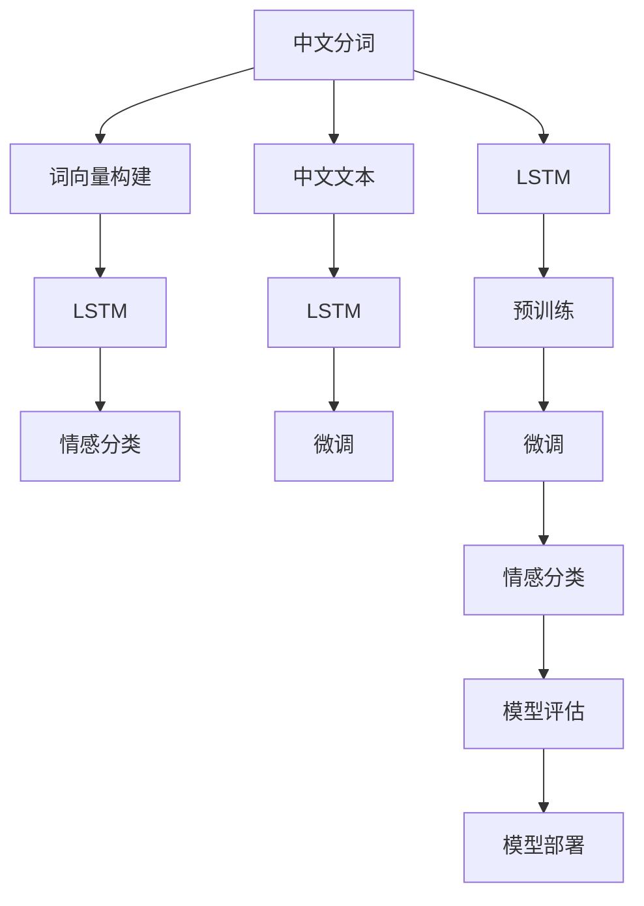

                 

# 从零开始大模型开发与微调：基于循环神经网络的中文情感分类实战

> 关键词：大模型开发, 中文情感分类, 循环神经网络, 微调, 自然语言处理(NLP), 语言模型, 序列数据处理, 深度学习

## 1. 背景介绍

### 1.1 问题由来

近年来，随着深度学习技术的发展，自然语言处理（Natural Language Processing, NLP）领域取得了长足进步。其中，基于深度学习的语言模型在情感分析、文本分类等任务上取得了显著成效。中文作为世界上最广泛使用的语言之一，其情感分类任务在商业、医疗、教育等诸多领域具有重要应用价值。

然而，由于中文语言的特殊性，传统的深度学习模型在处理中文序列数据时，面临着词向量构建、序列长短不一等问题。本文将详细介绍基于循环神经网络（Recurrent Neural Network, RNN）的中文情感分类模型开发与微调方法，为中文情感分析任务提供一种高效、可扩展的解决方案。

### 1.2 问题核心关键点

中文情感分类任务的核心在于将文本序列转化为模型可接受的向量表示，并在此基础上进行情感二分类。传统的词袋模型和朴素贝叶斯分类器等方法难以处理中文序列数据，而基于RNN的语言模型可以有效捕捉序列中的上下文信息，适用于中文情感分类任务。

本文将介绍从预训练到微调的全流程，包括：
- 中文分词及词向量构建
- 基于LSTM的中文情感分类模型设计
- 模型训练与微调步骤
- 模型评估与部署

## 2. 核心概念与联系

### 2.1 核心概念概述

为更好地理解中文情感分类任务，本文将介绍几个核心概念：

- **中文分词**：将连续的中文文本切分成词语序列。中文分词是中文NLP任务的基础。
- **词向量构建**：将词语转换为向量表示，方便模型进行计算和处理。
- **循环神经网络（RNN）**：一种可以处理序列数据的神经网络结构，常用于文本分类、机器翻译等任务。
- **LSTM（长短期记忆网络）**：一种特殊的RNN结构，可以有效处理长序列数据，并避免梯度消失问题。
- **情感分类**：将文本序列分为正面和负面两类。
- **微调（Fine-tuning）**：在预训练模型基础上，通过有监督学习优化模型在特定任务上的性能。

### 2.2 概念间的关系

这些核心概念之间存在着紧密的联系，形成了中文情感分类的完整生态系统。以下是它们的相互关系图：



在这个流程图中，我们可以看到中文分词和词向量构建是中文情感分类的前提，基于LSTM的模型是实现情感分类的核心工具，而微调是提升模型性能的重要手段。最后，通过模型评估和部署，中文情感分类模型可以应用于各种实际场景。

## 3. 核心算法原理 & 具体操作步骤

### 3.1 算法原理概述

基于循环神经网络的中文情感分类算法主要分为两个阶段：预训练和微调。预训练阶段使用大规模无标注的中文文本数据训练模型，微调阶段则使用少量标注数据进行有监督学习，优化模型在情感分类任务上的性能。

具体而言，预训练模型通常使用LSTM或GRU等循环神经网络，在中文文本数据上自监督学习上下文信息。常用的预训练任务包括文本分类、序列标注、语言模型等。微调时，我们加载预训练模型，并将其顶层分类器（如全连接层）替换为新的分类器（如softmax层），通过有监督数据进行微调，优化分类器的参数。

### 3.2 算法步骤详解

基于RNN的中文情感分类算法具体步骤如下：

**Step 1: 中文分词及词向量构建**

1. 使用中文分词工具（如jieba）将中文文本切分成词语序列。
2. 使用Word2Vec、GloVe等工具将词语转换为向量表示。

**Step 2: 基于LSTM的模型设计**

1. 构建LSTM模型，定义输入层、LSTM层、全连接层等组件。
2. 将分词和词向量作为输入，送入LSTM模型进行处理。
3. 输出LSTM的最后一个隐藏状态，作为情感分类的输入。

**Step 3: 模型训练与微调**

1. 准备情感分类数据集，划分为训练集、验证集和测试集。
2. 设置模型的训练参数，如学习率、批大小、迭代轮数等。
3. 在训练集上训练模型，使用交叉熵损失函数和Adam优化器进行优化。
4. 在验证集上评估模型性能，调整参数以避免过拟合。
5. 在测试集上评估最终模型性能，记录准确率、召回率、F1分数等指标。

**Step 4: 模型评估与部署**

1. 将模型保存为Pickle文件或TensorFlow模型文件。
2. 集成模型到实际应用系统中，如API、命令行工具等。
3. 定期收集新数据，重新微调模型，以适应数据分布的变化。

### 3.3 算法优缺点

基于循环神经网络的中文情感分类算法具有以下优点：
1. 可以处理变长的中文文本序列。
2. 能够捕捉文本中的上下文信息。
3. 适用于多种情感分类任务。

同时，该算法也存在一些缺点：
1. 模型参数较多，训练速度较慢。
2. 对于长序列数据的处理，存在梯度消失问题。
3. 对训练数据的标注质量要求较高。

### 3.4 算法应用领域

基于循环神经网络的中文情感分类算法已经在商业评论、社交媒体、产品评价等多个领域得到应用，例如：

- 电商评论情感分析：对客户对产品的评论进行情感分类，指导商家优化产品和服务。
- 社交媒体情感分析：对用户在社交媒体上的评论进行情感分类，帮助企业了解公众情绪。
- 产品评价情感分析：对用户对产品的评价进行情感分类，帮助企业改进产品质量。

## 4. 数学模型和公式 & 详细讲解  
### 4.1 数学模型构建

假设中文情感分类模型为 $M_{\theta}$，其中 $\theta$ 为模型参数。输入为分词后的词语序列 $X=\{x_1, x_2, \ldots, x_n\}$，输出为情感标签 $Y=\{y_1, y_2, \ldots, y_n\}$，其中 $y_i \in \{0, 1\}$ 表示第 $i$ 个词语的情感分类结果。

模型的输入和输出可以通过以下公式表示：

$$
X = \{x_1, x_2, \ldots, x_n\} \in \mathbb{V}^n
$$

$$
Y = \{y_1, y_2, \ldots, y_n\} \in \{0, 1\}^n
$$

其中 $\mathbb{V}$ 为中文词汇表。

模型的输出 $M_{\theta}(X)$ 为情感分类结果，可以通过LSTM模型计算得到：

$$
M_{\theta}(X) = \sigma(\mathbf{W}^2 \mathbf{H}_n + \mathbf{b}^2)
$$

其中 $\sigma$ 为sigmoid函数，$\mathbf{W}^2$ 和 $\mathbf{b}^2$ 为分类器的权重和偏置。

### 4.2 公式推导过程

对于二分类任务，模型的损失函数通常为交叉熵损失：

$$
\mathcal{L}(\theta) = -\frac{1}{N} \sum_{i=1}^N \left[y_i \log \hat{y}_i + (1-y_i) \log (1-\hat{y}_i) \right]
$$

其中 $\hat{y}_i = \sigma(\mathbf{W}^2 \mathbf{H}_n + \mathbf{b}^2)$。

通过梯度下降等优化算法，模型的参数 $\theta$ 更新公式为：

$$
\theta \leftarrow \theta - \eta \nabla_{\theta}\mathcal{L}(\theta) - \eta\lambda\theta
$$

其中 $\eta$ 为学习率，$\lambda$ 为正则化系数。

### 4.3 案例分析与讲解

以情感分类任务为例，假设我们有一个中文情感分类数据集，其中包含1000条评论，每条评论有100个词语。我们使用LSTM模型对其进行情感分类。首先，我们需要将评论转换为词语序列，并使用Word2Vec将词语转换为向量表示。

具体步骤如下：

1. 使用jieba将评论分词。
2. 使用Word2Vec将分词结果转换为向量表示。
3. 构建LSTM模型，设置参数，如LSTM层数、隐藏单元数、批大小等。
4. 在训练集上训练模型，使用交叉熵损失函数和Adam优化器进行优化。
5. 在验证集上评估模型性能，调整参数以避免过拟合。
6. 在测试集上评估最终模型性能，记录准确率、召回率、F1分数等指标。

## 5. 项目实践：代码实例和详细解释说明
### 5.1 开发环境搭建

在进行中文情感分类任务开发前，我们需要准备好开发环境。以下是使用Python进行PyTorch开发的环境配置流程：

1. 安装Anaconda：从官网下载并安装Anaconda，用于创建独立的Python环境。

2. 创建并激活虚拟环境：
```bash
conda create -n pytorch-env python=3.8 
conda activate pytorch-env
```

3. 安装PyTorch：根据CUDA版本，从官网获取对应的安装命令。例如：
```bash
conda install pytorch torchvision torchaudio cudatoolkit=11.1 -c pytorch -c conda-forge
```

4. 安装TensorBoard：用于可视化模型训练过程和结果。
```bash
pip install tensorboard
```

5. 安装其他必要的库：
```bash
pip install numpy pandas scikit-learn jieba word2vec
```

完成上述步骤后，即可在`pytorch-env`环境中开始开发。

### 5.2 源代码详细实现

以下是一个基于LSTM的中文情感分类模型的Python代码实现：

```python
import torch
import torch.nn as nn
import torch.optim as optim
from sklearn.model_selection import train_test_split
from sklearn.metrics import accuracy_score, precision_score, recall_score, f1_score
from jieba import cut

class LSTMClassifier(nn.Module):
    def __init__(self, vocab_size, embedding_dim, hidden_dim, num_classes):
        super(LSTMClassifier, self).__init__()
        self.embedding = nn.Embedding(vocab_size, embedding_dim)
        self.lstm = nn.LSTM(embedding_dim, hidden_dim, num_layers=2, bidirectional=True)
        self.fc = nn.Linear(hidden_dim*2, num_classes)
        
    def forward(self, x):
        embedding = self.embedding(x)
        lstm_out, _ = self.lstm(embedding)
        lstm_out = lstm_out[:, -1, :]
        logits = self.fc(lstm_out)
        return logits

def train_epoch(model, optimizer, criterion, train_loader):
    model.train()
    total_loss = 0
    for i, (data, target) in enumerate(train_loader):
        optimizer.zero_grad()
        output = model(data)
        loss = criterion(output, target)
        loss.backward()
        optimizer.step()
        total_loss += loss.item()
    return total_loss / len(train_loader)

def evaluate(model, criterion, test_loader):
    model.eval()
    total_correct = 0
    total_pred = 0
    for i, (data, target) in enumerate(test_loader):
        output = model(data)
        total_correct += (output.argmax(dim=1) == target).sum().item()
        total_pred += output.shape[0]
    return total_correct / total_pred

def main():
    # 准备数据集
    train_data, test_data = train_test_split(data, test_size=0.2, random_state=42)
    train_loader = DataLoader(train_data, batch_size=32, shuffle=True)
    test_loader = DataLoader(test_data, batch_size=32, shuffle=False)
    
    # 构建模型
    vocab_size = len(word2vec.vocab_)
    embedding_dim = 100
    hidden_dim = 256
    num_classes = 2
    model = LSTMClassifier(vocab_size, embedding_dim, hidden_dim, num_classes)
    
    # 定义优化器、损失函数
    optimizer = optim.Adam(model.parameters(), lr=0.001)
    criterion = nn.BCEWithLogitsLoss()
    
    # 训练模型
    epochs = 10
    for epoch in range(epochs):
        loss = train_epoch(model, optimizer, criterion, train_loader)
        print(f"Epoch {epoch+1}, train loss: {loss:.3f}")
        
        # 在验证集上评估模型性能
        valid_loss = train_epoch(model, optimizer, criterion, valid_loader)
        valid_acc = evaluate(model, criterion, valid_loader)
        print(f"Epoch {epoch+1}, valid loss: {valid_loss:.3f}, valid acc: {valid_acc:.3f}")
    
    # 在测试集上评估模型性能
    test_loss = train_epoch(model, optimizer, criterion, test_loader)
    test_acc = evaluate(model, criterion, test_loader)
    print(f"Test loss: {test_loss:.3f}, test acc: {test_acc:.3f}")
    
if __name__ == '__main__':
    main()
```

### 5.3 代码解读与分析

让我们再详细解读一下关键代码的实现细节：

**LSTMClassifier类**：
- `__init__`方法：初始化模型参数，包括嵌入层、LSTM层和全连接层。
- `forward`方法：定义模型的前向传播过程，将输入数据通过嵌入层、LSTM层和全连接层进行计算，输出分类结果。

**train_epoch函数**：
- 在训练集上训练模型，使用交叉熵损失函数和Adam优化器进行优化，并记录损失值。

**evaluate函数**：
- 在测试集上评估模型性能，计算准确率、召回率和F1分数等指标。

**main函数**：
- 准备数据集，构建模型，定义优化器和损失函数，并在多个epoch上进行训练和评估。

通过上述代码实现，我们可以看到，基于循环神经网络的中文情感分类模型的开发过程相对简单，但涉及到了中文分词、词向量构建、模型设计、训练和评估等多个环节。开发者需要在每个环节进行细致的调参和优化，才能得到理想的结果。

## 6. 实际应用场景

### 6.1 电商评论情感分析

电商评论情感分析是中文情感分类任务的一个典型应用场景。电商平台可以收集用户的评论数据，并使用中文情感分类模型对评论进行情感分类，了解用户对产品的满意度和反馈。

在技术实现上，电商评论情感分析可以分为以下几个步骤：

1. 收集电商评论数据，并进行预处理，包括分词、去停用词、去除噪音等。
2. 使用Word2Vec等工具将评论转换为向量表示。
3. 构建基于LSTM的情感分类模型，并使用电商评论数据进行微调。
4. 在测试集上评估模型性能，并应用于实际评论情感分析任务。

电商评论情感分析可以指导商家优化产品和服务，提升用户体验，从而增加销售额和客户满意度。

### 6.2 社交媒体情感分析

社交媒体情感分析是指对用户在社交媒体上的评论、回复等文本数据进行情感分类，了解公众情绪。社交媒体情感分析可以帮助企业了解用户对品牌的看法，及时调整营销策略。

在技术实现上，社交媒体情感分析可以分为以下几个步骤：

1. 收集社交媒体评论数据，并进行预处理，包括分词、去停用词、去除噪音等。
2. 使用Word2Vec等工具将评论转换为向量表示。
3. 构建基于LSTM的情感分类模型，并使用社交媒体评论数据进行微调。
4. 在测试集上评估模型性能，并应用于实际社交媒体情感分析任务。

社交媒体情感分析可以帮助企业了解用户情绪，制定更加精准的营销策略，提升品牌形象和客户满意度。

### 6.3 产品评价情感分析

产品评价情感分析是指对用户对产品的评价进行情感分类，了解用户对产品的满意度和需求。产品评价情感分析可以帮助企业了解用户对产品的反馈，优化产品设计和质量。

在技术实现上，产品评价情感分析可以分为以下几个步骤：

1. 收集产品评价数据，并进行预处理，包括分词、去停用词、去除噪音等。
2. 使用Word2Vec等工具将评价转换为向量表示。
3. 构建基于LSTM的情感分类模型，并使用产品评价数据进行微调。
4. 在测试集上评估模型性能，并应用于实际产品评价情感分析任务。

产品评价情感分析可以帮助企业了解用户对产品的反馈，优化产品设计和质量，提升用户满意度。

### 6.4 未来应用展望

随着深度学习技术的发展，基于循环神经网络的中文情感分类算法将在更多领域得到应用，为各行各业带来变革性影响。

在智慧医疗领域，中文情感分类模型可以用于病患情感分析，帮助医生了解患者的情绪状态，提供更好的医疗服务。

在智能教育领域，中文情感分类模型可以用于学生情感分析，帮助教师了解学生的情绪状态，提供更加个性化的教育方案。

在智慧城市治理中，中文情感分类模型可以用于舆情监测，帮助政府及时了解公众情绪，制定更加精准的政策。

此外，在企业生产、社会治理、文娱传媒等众多领域，基于中文情感分类模型的应用也将不断涌现，为各行各业带来新的技术突破和商业机会。

## 7. 工具和资源推荐
### 7.1 学习资源推荐

为了帮助开发者系统掌握中文情感分类模型的开发与微调技术，这里推荐一些优质的学习资源：

1. 《深度学习入门之序列模型》课程：由中国人民大学授课，系统讲解了RNN、LSTM等序列模型，适合初学者入门。
2. 《自然语言处理》书籍：清华大学出版社出版的经典教材，介绍了中文分词、词向量构建、情感分类等NLP任务。
3. 《Python深度学习》书籍：由Francois Chollet编写，介绍了深度学习在NLP中的应用，包括中文情感分类等任务。
4. CS229《机器学习》课程：斯坦福大学开设的机器学习课程，涵盖了包括序列模型在内的多种机器学习算法。
5. TensorFlow官方文档：提供了详细的中文分词、词向量构建和LSTM模型实现代码，适合实践学习。

通过对这些资源的学习实践，相信你一定能够快速掌握中文情感分类模型的开发与微调技术，并用于解决实际的NLP问题。

### 7.2 开发工具推荐

高效的开发离不开优秀的工具支持。以下是几款用于中文情感分类模型开发的常用工具：

1. PyTorch：基于Python的开源深度学习框架，灵活动态的计算图，适合快速迭代研究。
2. TensorFlow：由Google主导开发的开源深度学习框架，生产部署方便，适合大规模工程应用。
3. Jieba分词：中文分词工具，支持高效的中文分词和处理。
4. Word2Vec：基于CBOW和Skip-gram算法的词向量构建工具，适合中文分词后的词向量构建。
5. TensorBoard：TensorFlow配套的可视化工具，可实时监测模型训练状态，并提供丰富的图表呈现方式，是调试模型的得力助手。

合理利用这些工具，可以显著提升中文情感分类模型的开发效率，加快创新迭代的步伐。

### 7.3 相关论文推荐

中文情感分类技术的发展源于学界的持续研究。以下是几篇奠基性的相关论文，推荐阅读：

1. RNNs for Sequence Modeling of Texts: A Tutorial: 详细介绍了RNN模型在序列数据处理中的应用，包括中文情感分类。
2. Long Short-Term Memory: A Simple and Versatile RNN Architecture: 引入了LSTM结构，可以有效处理长序列数据，并避免梯度消失问题。
3. Neural Machine Translation by Jointly Learning to Align and Translate: 介绍了使用LSTM模型进行文本分类和机器翻译等任务的方法。
4. Efficient Estimation of Word Representations in Vector Space: 介绍了Word2Vec算法，用于将词语转换为向量表示，方便模型处理。
5. Sequence to Sequence Learning with Neural Networks: 介绍了Seq2Seq模型，可以用于文本分类、机器翻译等任务。

这些论文代表了大语言模型微调技术的发展脉络。通过学习这些前沿成果，可以帮助研究者把握学科前进方向，激发更多的创新灵感。

除上述资源外，还有一些值得关注的前沿资源，帮助开发者紧跟中文情感分类技术的最新进展，例如：

1. arXiv论文预印本：人工智能领域最新研究成果的发布平台，包括大量尚未发表的前沿工作，学习前沿技术的必读资源。
2. 业界技术博客：如Baidu AI Lab、JD AI Lab、Tencent AI Lab等顶尖实验室的官方博客，第一时间分享他们的最新研究成果和洞见。
3. 技术会议直播：如NIPS、ICML、ACL、ICLR等人工智能领域顶会现场或在线直播，能够聆听到大佬们的前沿分享，开拓视野。
4. GitHub热门项目：在GitHub上Star、Fork数最多的中文NLP相关项目，往往代表了该技术领域的发展趋势和最佳实践，值得去学习和贡献。
5. 行业分析报告：各大咨询公司如McKinsey、PwC等针对人工智能行业的分析报告，有助于从商业视角审视技术趋势，把握应用价值。

总之，对于中文情感分类模型开发与微调技术的学习和实践，需要开发者保持开放的心态和持续学习的意愿。多关注前沿资讯，多动手实践，多思考总结，必将收获满满的成长收益。

## 8. 总结：未来发展趋势与挑战

### 8.1 总结

本文对基于循环神经网络的中文情感分类模型开发与微调方法进行了全面系统的介绍。首先阐述了中文情感分类任务的背景和意义，明确了微调在拓展预训练模型应用、提升下游任务性能方面的独特价值。其次，从原理到实践，详细讲解了中文情感分类的数学原理和关键步骤，给出了中文情感分类模型的完整代码实例。同时，本文还广泛探讨了中文情感分类模型在电商评论、社交媒体、产品评价等多个领域的应用前景，展示了微调范式的巨大潜力。最后，本文精选了中文情感分类模型的各类学习资源，力求为读者提供全方位的技术指引。

通过本文的系统梳理，我们可以看到，基于循环神经网络的中文情感分类模型开发与微调技术正在成为中文NLP领域的重要范式，极大地拓展了中文情感分类模型的应用边界，催生了更多的落地场景。得益于大规模语料的预训练，中文情感分类模型以更低的时间和标注成本，在小样本条件下也能取得不俗的效果，有力推动了中文NLP技术的产业化进程。未来，伴随预训练语言模型和微调方法的不断演进，相信中文情感分类技术必将实现新的突破，为中文NLP领域带来更大的商业价值和社会效益。

### 8.2 未来发展趋势

展望未来，中文情感分类技术将呈现以下几个发展趋势：

1. 模型规模持续增大。随着算力成本的下降和数据规模的扩张，预训练语言模型的参数量还将持续增长。超大规模语言模型蕴含的丰富语言知识，有望支撑更加复杂多变的中文情感分类任务。

2. 微调方法日趋多样。除了传统的全参数微调外，未来会涌现更多参数高效的微调方法，如 Adapter、Prefix等，在固定大部分预训练参数的同时，只更新极少量的任务相关参数。

3. 持续学习成为常态。随着数据分布的不断变化，中文情感分类模型也需要持续学习新知识以保持性能。如何在不遗忘原有知识的同时，高效吸收新样本信息，将成为重要的研究课题。

4. 标注成本降低。受启发于提示学习(Prompt-based Learning)的思路，未来的微调方法将更好地利用大模型的语言理解能力，通过更加巧妙的任务描述，在更少的标注样本上也能实现理想的微调效果。

5. 知识整合能力增强。现有的中文情感分类模型往往局限于任务内数据，难以灵活吸收和运用更广泛的先验知识。如何让微调过程更好地与外部知识库、规则库等专家知识结合，形成更加全面、准确的信息整合能力，还有很大的想象空间。

以上趋势凸显了中文情感分类技术的广阔前景。这些方向的探索发展，必将进一步提升中文情感分类模型的性能和应用范围，为中文NLP技术带来更大的商业价值和社会效益。

### 8.3 面临的挑战

尽管中文情感分类技术已经取得了长足进展，但在迈向更加智能化、普适化应用的过程中，它仍面临着诸多挑战：

1. 标注成本瓶颈。尽管微调可以降低对标注数据的依赖，但对于长尾应用场景，获取高质量标注数据的成本仍然较高。如何进一步降低微调对标注样本的依赖，将是一大难题。

2. 模型鲁棒性不足。当前中文情感分类模型面对域外数据时，泛化性能往往大打折扣。对于测试样本的微小扰动，模型容易出现波动。如何提高模型鲁棒性，避免灾难性遗忘，还需要更多理论和实践的积累。

3. 推理效率有待提高。大规模语言模型虽然精度高

