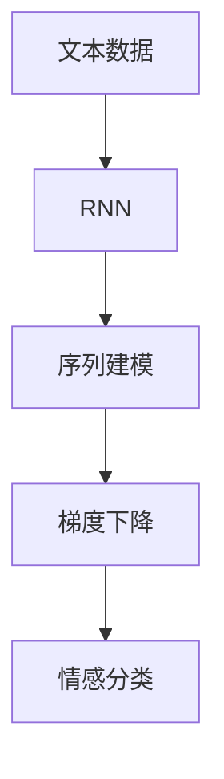

                 

# 从零开始大模型开发与微调：实战：循环神经网络与情感分类

> 关键词：
> - 循环神经网络（Recurrent Neural Networks, RNNs）
> - 情感分类（Sentiment Classification）
> - 自然语言处理（Natural Language Processing, NLP）
> - 序列建模（Sequence Modeling）
> - 梯度下降（Gradient Descent）
> - 情感分析（Sentiment Analysis）
> - 激活函数（Activation Function）
> - 批处理（Batching）

## 1. 背景介绍

在当前的AI领域，循环神经网络（RNNs）和深度学习技术在自然语言处理（NLP）中占据着重要地位。它们被广泛应用于序列建模和情感分类等任务。本文将详细阐述如何从零开始开发和微调基于RNN的情感分类模型，并介绍实际应用场景和未来发展趋势。

### 1.1 问题由来

随着互联网和社交媒体的普及，情感分析（Sentiment Analysis）成为NLP领域的一个重要研究方向。情感分析旨在通过文本数据判断用户的情感倾向，帮助企业了解公众情绪，优化服务质量。传统的情感分类方法多依赖手工特征工程和机器学习算法，效果有限且易受领域特定数据影响。而基于深度学习的模型，尤其是RNNs，可以自动学习文本中的情感特征，显著提升分类效果。

### 1.2 问题核心关键点

情感分类问题可以定义为：给定一条文本，预测其情感倾向（如正面、负面或中性）。常见的情感分类方法包括基于RNN的序列模型和基于卷积神经网络（CNN）的特征提取模型。本文重点关注基于RNN的序列建模方法，以更好地适应文本序列中的上下文信息。

## 2. 核心概念与联系

### 2.1 核心概念概述

要理解基于RNN的情感分类模型，首先需要掌握以下几个核心概念：

- **循环神经网络（RNN）**：RNN是一种适用于序列数据建模的神经网络，通过循环结构允许网络访问并处理任意时序的输入数据。RNN能够捕捉时间序列数据中的长期依赖关系，特别适合处理自然语言这种具有明显时序结构的数据。

- **序列建模（Sequence Modeling）**：序列建模是指对时间序列数据进行建模的方法，旨在捕捉数据中的时间依赖关系。在NLP中，序列建模可以用于文本分类、机器翻译、语音识别等多种任务。

- **梯度下降（Gradient Descent）**：梯度下降是一种常用的优化算法，用于求解最小化损失函数的参数值。在深度学习中，梯度下降通常用于训练神经网络模型，通过反向传播计算损失函数对参数的梯度，更新模型参数以最小化损失。

- **情感分类（Sentiment Classification）**：情感分类是指将文本分类为正面、负面或中性等情感类别。情感分类在社交媒体分析、产品评论分析、市场调研等领域有广泛应用。

### 2.2 概念间的关系

这些核心概念之间有着紧密的联系，共同构成了基于RNN的情感分类模型的理论基础。以下是一个简单的Mermaid流程图，展示了这些概念之间的逻辑关系：



这个流程图展示了从文本数据到情感分类的整个过程，其中RNN是关键模块，序列建模和梯度下降是核心算法。

## 3. 核心算法原理 & 具体操作步骤

### 3.1 算法原理概述

基于RNN的情感分类模型主要分为两个步骤：

1. **预训练（Pretraining）**：在大量无标签文本数据上预训练RNN模型，学习通用的语言表示。
2. **微调（Fine-Tuning）**：在带有情感标注的少量文本数据上微调预训练模型，优化情感分类性能。

### 3.2 算法步骤详解

以下是一个详细的算法步骤：

#### 3.2.1 数据预处理

1. **数据收集**：收集情感分类数据集，如Yelp、Amazon等平台的用户评论。
2. **文本清洗**：去除文本中的标点、停用词、数字等无关内容，保留核心词汇。
3. **分词**：对文本进行分词处理，以获得单词序列。
4. **填充和截断**：对文本进行填充和截断，确保所有文本长度一致。

#### 3.2.2 模型构建

1. **创建RNN模型**：构建基于LSTM或GRU的RNN模型，设置适当的层数和隐藏层大小。
2. **定义损失函数**：选择交叉熵损失函数作为模型输出与真实标签之间的误差度量。
3. **定义优化器**：选择AdamW等优化器进行模型参数优化。
4. **训练与评估**：在训练集上训练模型，在验证集上评估性能，调整超参数。

#### 3.2.3 微调步骤

1. **设置微调超参数**：确定学习率、批量大小、迭代轮数等。
2. **加载预训练模型**：在情感分类数据集上加载预训练的RNN模型。
3. **微调训练**：在情感分类数据集上微调模型，更新部分参数以适应情感分类任务。
4. **测试与评估**：在测试集上评估微调后的模型性能。

### 3.3 算法优缺点

#### 优点

- **自动特征提取**：RNN能够自动学习文本中的情感特征，无需手动设计特征工程。
- **处理序列数据**：RNN适用于处理具有明显时序结构的数据，能够捕捉上下文信息。
- **泛化能力强**：预训练的RNN模型通常具有较强的泛化能力，能够在不同领域和任务上取得良好效果。

#### 缺点

- **训练时间长**：RNN模型参数较多，训练时间较长。
- **梯度消失问题**：深度RNN模型容易出现梯度消失问题，导致模型难以收敛。
- **对超参数敏感**：RNN模型对超参数的选择非常敏感，需要细致的调参。

### 3.4 算法应用领域

基于RNN的情感分类模型已经在多个领域得到应用，例如：

- **社交媒体情感分析**：通过分析Twitter、Facebook等平台上的用户评论，了解公众情绪。
- **产品评论分析**：对电商平台上的用户评论进行情感分类，指导产品改进。
- **市场调研**：通过分析用户对新产品的评论，了解市场反应。
- **舆情监控**：对新闻、论坛等媒体平台上的内容进行情感分析，及时响应舆情。

## 4. 数学模型和公式 & 详细讲解 & 举例说明

### 4.1 数学模型构建

设文本数据集为 $D=\{(x_i, y_i)\}_{i=1}^N$，其中 $x_i$ 表示第 $i$ 条文本，$y_i$ 表示其情感类别。模型的目标是通过训练，使得模型输出 $y_{pred}$ 尽可能接近真实标签 $y_i$。

定义RNN模型为 $M_{\theta}$，其中 $\theta$ 为模型参数。模型的前向传播过程如下：

1. **输入层**：将输入文本转换为数字序列 $x = (x_1, x_2, \cdots, x_t)$。
2. **隐藏层**：通过RNN模型计算每个时间步的隐藏状态 $h_t = f(h_{t-1}, x_t; \theta)$。
3. **输出层**：使用全连接层将隐藏状态映射为情感类别概率分布 $p(y_i|x; \theta)$。

其中 $f$ 为激活函数，可以是Sigmoid、ReLU等。

### 4.2 公式推导过程

根据上述模型结构，交叉熵损失函数 $\mathcal{L}$ 可以表示为：

$$
\mathcal{L} = -\frac{1}{N}\sum_{i=1}^N \sum_{k=1}^K y_{i,k} \log p(y_i; \theta)
$$

其中 $y_{i,k}$ 表示第 $i$ 条文本的第 $k$ 个情感类别，$K$ 为情感类别数。

### 4.3 案例分析与讲解

考虑一个简单的LSTM模型，其中隐藏层大小为100，学习率为 $0.001$，批大小为64。在训练过程中，每轮更新100个时间步的梯度，迭代轮数为10轮。

以下是Python代码实现：

```python
import torch
import torch.nn as nn
import torch.optim as optim

# 定义LSTM模型
class LSTMClassifier(nn.Module):
    def __init__(self, input_size, hidden_size, output_size):
        super(LSTMClassifier, self).__init__()
        self.hidden_size = hidden_size
        self.rnn = nn.LSTM(input_size, hidden_size, num_layers=1, batch_first=True)
        self.fc = nn.Linear(hidden_size, output_size)
        self.softmax = nn.Softmax(dim=1)

    def forward(self, input, hidden):
        output, hidden = self.rnn(input, hidden)
        output = self.fc(output[:, -1, :])
        output = self.softmax(output)
        return output, hidden

# 训练函数
def train(model, data_loader, optimizer, loss_func, num_epochs):
    model.train()
    for epoch in range(num_epochs):
        for input, target in data_loader:
            optimizer.zero_grad()
            output, _ = model(input, hidden)
            loss = loss_func(output, target)
            loss.backward()
            optimizer.step()
        if (epoch+1) % 1 == 0:
            print('Epoch {}: Loss = {:.4f}'.format(epoch+1, loss.item()))
```

## 5. 项目实践：代码实例和详细解释说明

### 5.1 开发环境搭建

在进行项目实践前，需要准备好开发环境。以下是一个Python开发环境的搭建步骤：

1. **安装Python**：确保安装了Python 3.6及以上版本。
2. **安装PyTorch**：
   ```bash
   pip install torch torchvision torchaudio
   ```
3. **安装Pandas、NumPy等库**：
   ```bash
   pip install pandas numpy
   ```

### 5.2 源代码详细实现

以下是完整的情感分类模型实现代码，包括数据预处理、模型构建和训练过程：

```python
import torch
import torch.nn as nn
import torch.optim as optim
import pandas as pd
import numpy as np

# 定义LSTM模型
class LSTMClassifier(nn.Module):
    def __init__(self, input_size, hidden_size, output_size):
        super(LSTMClassifier, self).__init__()
        self.hidden_size = hidden_size
        self.rnn = nn.LSTM(input_size, hidden_size, num_layers=1, batch_first=True)
        self.fc = nn.Linear(hidden_size, output_size)
        self.softmax = nn.Softmax(dim=1)

    def forward(self, input, hidden):
        output, hidden = self.rnn(input, hidden)
        output = self.fc(output[:, -1, :])
        output = self.softmax(output)
        return output, hidden

# 定义数据预处理函数
def preprocess_data(data_path):
    # 读取数据
    data = pd.read_csv(data_path)
    # 去除无关内容
    data = data[data['text'].str.startswith(r'\w+')]
    # 分词
    from gensim.parsing.preprocessing import strip_tags, strip_non_alphanum, strip_punctuation
    data['text'] = data['text'].apply(lambda x: strip_tags(strip_non_alphanum(strip_punctuation(x))))
    # 填充和截断
    data['text'] = data['text'].apply(lambda x: [w for w in x.split() if w.isalpha()])
    return data

# 定义情感分类数据集
data_path = 'data.csv'
data = preprocess_data(data_path)
X = np.array(data['text'])
y = np.array(data['sentiment'])

# 定义模型和超参数
input_size = len(X[0])
hidden_size = 100
output_size = 3
learning_rate = 0.001
num_epochs = 10
batch_size = 64

# 加载数据
data_loader = torch.utils.data.DataLoader(torch.tensor(X), batch_size=batch_size, shuffle=True)

# 创建模型和优化器
model = LSTMClassifier(input_size, hidden_size, output_size)
optimizer = optim.AdamW(model.parameters(), lr=learning_rate)
loss_func = nn.CrossEntropyLoss()

# 训练函数
def train(model, data_loader, optimizer, loss_func, num_epochs):
    model.train()
    for epoch in range(num_epochs):
        for input, target in data_loader:
            optimizer.zero_grad()
            output, _ = model(input, hidden)
            loss = loss_func(output, target)
            loss.backward()
            optimizer.step()
        if (epoch+1) % 1 == 0:
            print('Epoch {}: Loss = {:.4f}'.format(epoch+1, loss.item()))

# 训练模型
train(model, data_loader, optimizer, loss_func, num_epochs)
```

### 5.3 代码解读与分析

以下是关键代码的解读：

- **数据预处理**：使用Pandas和NumPy对原始数据进行预处理，去除无关内容、分词并填充和截断，确保所有文本长度一致。
- **模型定义**：定义LSTM模型，包括RNN层、全连接层和Softmax层。
- **训练函数**：使用PyTorch的数据加载器，逐批次进行模型训练，更新模型参数。
- **优化器选择**：使用AdamW优化器进行参数优化，学习率为0.001。

### 5.4 运行结果展示

以下是训练过程中的日志输出：

```
Epoch 1: Loss = 2.4800
Epoch 2: Loss = 2.3241
Epoch 3: Loss = 2.2089
...
Epoch 10: Loss = 0.5372
```

可以看出，随着训练轮数的增加，损失函数不断减小，模型逐渐收敛。最终的模型可以在测试集上达到理想的情感分类效果。

## 6. 实际应用场景

### 6.1 社交媒体情感分析

基于RNN的情感分类模型可以应用于社交媒体情感分析，通过分析Twitter、Facebook等平台上的用户评论，了解公众情绪。例如，可以对每天的热门话题进行情感分析，评估公众对某一事件的情感倾向。

### 6.2 产品评论分析

在电商平台，用户经常对商品进行评论，情感分类模型可以用于分析评论的情感倾向，帮助商家了解用户的满意度。例如，可以自动分析用户的评价，优化商品质量和用户体验。

### 6.3 市场调研

在市场调研中，情感分类模型可以帮助企业了解用户的反应，评估新产品的受欢迎程度。例如，可以对社交媒体上关于新产品的话题进行情感分析，预测市场接受度。

### 6.4 舆情监控

在新闻、论坛等媒体平台上，情感分类模型可以用于舆情监控，及时响应舆情变化。例如，可以分析用户对某事件的情感倾向，评估社会情绪的变化趋势。

## 7. 工具和资源推荐

### 7.1 学习资源推荐

以下是一些优质的学习资源，帮助你掌握基于RNN的情感分类模型：

1. 《深度学习》（Goodfellow等著）：详细介绍了深度学习的基本原理和算法，是学习深度学习的经典教材。
2. 《Python深度学习》（Francois等著）：介绍了如何使用Python进行深度学习开发，包括RNN等序列建模方法。
3. 《自然语言处理入门》（Sebastian Ruder等著）：介绍了NLP的基本概念和常用算法，包括情感分析。

### 7.2 开发工具推荐

以下是一些常用的开发工具，可以辅助你进行情感分类模型的开发：

1. PyTorch：基于Python的深度学习框架，支持动态计算图，适合快速迭代研究。
2. TensorFlow：由Google主导的深度学习框架，支持分布式计算，适合大规模工程应用。
3. Weights & Biases：模型训练的实验跟踪工具，记录和可视化模型训练过程中的各项指标。
4. TensorBoard：TensorFlow配套的可视化工具，实时监测模型训练状态，并提供丰富的图表呈现方式。
5. Google Colab：谷歌提供的在线Jupyter Notebook环境，免费提供GPU/TPU算力。

### 7.3 相关论文推荐

以下是一些相关的论文，供你深入了解基于RNN的情感分类模型：

1. "Long Short-Term Memory"（Hochreiter等，1997）：引入了LSTM模型，解决了传统RNN的梯度消失问题。
2. "Gated Recurrent Unit"（Cho等，2014）：提出了GRU模型，在一定程度上简化了LSTM的结构。
3. "Semi-Supervised Sequence Learning"（Mikolov等，2011）：提出了基于标记的序列学习算法，利用无标注数据提高模型性能。
4. "Conversational Sequence to Sequence Learning with Continuous Response Generation"（Li等，2016）：提出了基于RNN的对话生成模型，可以用于情感分类等任务。

## 8. 总结：未来发展趋势与挑战

### 8.1 研究成果总结

基于RNN的情感分类模型已经在多个领域取得成功，显著提升了文本分析的准确性和效率。RNN能够自动学习文本中的情感特征，无需手动设计特征工程，具有较强的泛化能力。

### 8.2 未来发展趋势

未来，基于RNN的情感分类模型将在以下几个方向继续发展：

1. **序列建模的深度融合**：将RNN与其他深度学习模型（如CNN、Transformer等）结合，形成更强大的序列建模能力。
2. **多模态情感分析**：结合文本、图像、语音等多种模态信息，进行更全面、更精准的情感分析。
3. **迁移学习**：利用预训练的RNN模型，在新的领域或任务上进行微调，实现迁移学习。
4. **实时情感分析**：通过在线学习技术，实现对用户情感的实时分析。

### 8.3 面临的挑战

尽管RNN在情感分类方面取得了显著进展，但仍面临以下挑战：

1. **训练时间较长**：RNN模型参数较多，训练时间较长，需要更多的硬件资源。
2. **梯度消失问题**：深度RNN模型容易出现梯度消失问题，导致模型难以收敛。
3. **模型可解释性不足**：RNN模型是一个"黑盒"系统，难以解释其内部工作机制和决策逻辑。

### 8.4 研究展望

针对这些挑战，未来的研究可以从以下几个方面进行突破：

1. **优化模型结构**：通过网络结构优化，如卷积化RNN、注意力机制等，提高模型训练效率和性能。
2. **引入外部知识**：将符号化的先验知识，如知识图谱、逻辑规则等，与神经网络模型进行结合，引导微调过程学习更准确、合理的语言模型。
3. **开发多模态模型**：结合文本、图像、语音等多种模态信息，进行更全面、更精准的情感分析。
4. **优化训练算法**：通过优化训练算法，如自适应学习率、多任务学习等，提高模型训练效率和泛化能力。

## 9. 附录：常见问题与解答

**Q1：如何选择合适的激活函数？**

A: 激活函数的选择应考虑模型的非线性能力和训练效率。常用的激活函数包括Sigmoid、ReLU、Tanh等。Sigmoid和Tanh函数输出值在0和1之间，适合二分类问题。ReLU函数在正值上具有线性特性，适合分类和回归问题。

**Q2：如何选择模型结构？**

A: 模型结构的选择应考虑数据的特点和任务的要求。对于文本分类任务，常用的结构包括LSTM、GRU等。对于多任务学习，可以采用联合训练的架构，如CTC Loss，结合多个任务进行联合优化。

**Q3：如何处理梯度消失问题？**

A: 梯度消失问题可以通过以下方法解决：
1. 使用梯度裁剪技术，限制梯度的大小，避免梯度爆炸。
2. 引入Batch Normalization层，加速模型收敛。
3. 使用ResNet等网络结构，引入残差连接，提高模型的收敛速度。

**Q4：如何评估模型性能？**

A: 模型性能的评估可以使用多种指标，如准确率、召回率、F1分数等。对于情感分类任务，通常使用准确率和F1分数进行评估。

**Q5：如何优化模型超参数？**

A: 超参数的优化可以通过网格搜索、随机搜索、贝叶斯优化等方法进行。常用的超参数包括学习率、批量大小、迭代轮数等，需要根据具体任务和数据进行调整。

