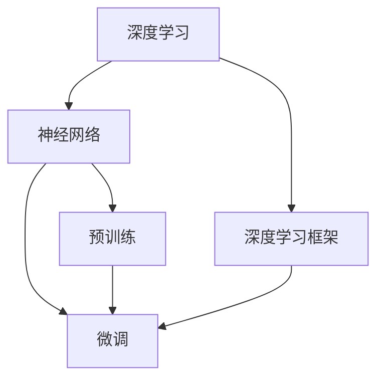

                 

# 从零开始大模型开发与微调：深度学习基础

> 关键词：大模型,深度学习,微调,Fine-tuning,神经网络,机器学习

## 1. 背景介绍

### 1.1 问题由来
近年来，深度学习技术迅猛发展，特别是大模型（Big Models）在自然语言处理（NLP）、计算机视觉、语音识别等领域的广泛应用，显著提升了人工智能的性能和效率。深度学习大模型通常指的是具有数十亿甚至上百亿参数的神经网络，能够处理复杂的非线性映射任务。这些模型通常在大量无标签数据上进行预训练，学习到通用的特征表示，然后通过微调（Fine-tuning）在特定任务上进一步优化。

微调是深度学习中常用的技术，用于在预训练模型的基础上，通过有标签数据对模型进行优化，使其适应于特定的任务和应用场景。微调可以有效降低标注数据的需求，提高模型的泛化能力和性能。

### 1.2 问题核心关键点
微调的核心在于选择一个合适的预训练模型，使用标注数据对其进行训练，以使其在特定任务上表现更佳。以下是微调的几个关键点：

1. **预训练模型**：选择合适的预训练模型，如BERT、GPT-3、ResNet等。预训练模型通常在大规模无标签数据上训练，学习到通用的特征表示。

2. **任务适配层**：根据具体任务的需求，在预训练模型的顶层添加适配层，如全连接层、卷积层、注意力机制等。

3. **优化器**：选择合适的优化器，如Adam、SGD等，以及学习率、批大小、迭代轮数等超参数。

4. **数据增强**：对训练数据进行增强，如旋转、平移、缩放等，以丰富数据的多样性。

5. **正则化**：使用L2正则、Dropout等技术，避免过拟合。

6. **评估和调优**：在训练过程中定期评估模型性能，根据评估结果进行调优。

### 1.3 问题研究意义
微调技术在大模型的应用中具有重要意义：

1. **提高模型性能**：微调可以显著提高模型在特定任务上的性能，尤其是在数据量有限的情况下。

2. **降低开发成本**：使用预训练模型可以大幅降低数据标注和模型训练的资源投入。

3. **提升模型泛化能力**：微调可以使模型更好地适应特定的应用场景，提高泛化能力。

4. **加速模型开发**：微调可以加速模型开发进程，缩短产品上市时间。

5. **促进技术创新**：微调技术的进步促进了深度学习领域的研究和应用，带来了新的研究方向和应用场景。

6. **增强系统可靠性**：微调可以提高模型的鲁棒性和可靠性，减少错误和偏差。

## 2. 核心概念与联系

### 2.1 核心概念概述

为更好地理解微调技术，本节将介绍几个关键概念及其联系。

- **大模型（Big Models）**：指具有大量参数的深度神经网络，如BERT、GPT-3等。大模型通常在大规模无标签数据上进行预训练，学习到丰富的特征表示。

- **预训练（Pre-training）**：指在大规模无标签数据上训练模型，学习到通用的特征表示。预训练是大模型开发的重要环节。

- **微调（Fine-tuning）**：指在预训练模型的基础上，使用标注数据进行有监督学习，优化模型在特定任务上的性能。

- **深度学习（Deep Learning）**：指使用多层神经网络进行训练，以解决复杂映射关系的任务。

- **神经网络（Neural Networks）**：指由大量神经元组成的计算模型，用于学习特征表示和复杂模式。

- **机器学习（Machine Learning）**：指通过数据训练模型，使模型能够对新数据进行预测和分类。

这些概念之间存在紧密的联系，构成了深度学习的基础框架。预训练模型学习到通用的特征表示，微调则在此基础上进一步优化，使其适应特定的任务和应用场景。

### 2.2 概念间的关系

这些概念之间的联系可以通过以下Mermaid流程图来展示：



这个流程图展示了深度学习、神经网络、深度学习框架、预训练和微调之间的联系。深度学习框架提供了构建和训练神经网络的工具，预训练和微调是大模型开发的重要环节，使模型能够适应特定任务和应用场景。

## 3. 核心算法原理 & 具体操作步骤
### 3.1 算法原理概述

微调基于深度学习框架，通过使用有标签数据对预训练模型进行优化。微调的过程包括数据准备、任务适配、优化器选择、训练和评估等步骤。

- **数据准备**：收集和处理训练数据，将其划分为训练集、验证集和测试集。

- **任务适配**：根据任务类型，在预训练模型的顶层添加适配层，如全连接层、卷积层、注意力机制等。

- **优化器选择**：选择合适的优化器，如Adam、SGD等，以及学习率、批大小、迭代轮数等超参数。

- **训练**：使用训练集对模型进行训练，定期在验证集上评估模型性能，根据评估结果进行调优。

- **评估**：在测试集上评估模型性能，比较微调前后的性能提升。

### 3.2 算法步骤详解

以下是微调的具体操作步骤：

1. **数据准备**：
    - 收集标注数据，将其划分为训练集、验证集和测试集。
    - 使用数据增强技术，如旋转、平移、缩放等，增加数据的多样性。

2. **任务适配**：
    - 根据任务类型，选择适合的适配层。
    - 设计任务损失函数，如交叉熵损失、均方误差损失等。

3. **优化器选择**：
    - 选择适合的优化器，如Adam、SGD等。
    - 设置合适的学习率、批大小、迭代轮数等超参数。

4. **训练**：
    - 使用训练集对模型进行训练。
    - 定期在验证集上评估模型性能，根据评估结果进行调优。

5. **评估**：
    - 在测试集上评估模型性能，比较微调前后的性能提升。

### 3.3 算法优缺点

**优点**：
- **泛化能力强**：微调可以在少量标注数据上实现较好的性能提升。
- **降低成本**：使用预训练模型可以大幅降低标注和训练的资源投入。
- **加速开发**：微调可以快速适应特定任务，缩短产品上市时间。

**缺点**：
- **过拟合风险**：如果数据量较小，可能存在过拟合的风险。
- **依赖标注数据**：微调的效果很大程度上依赖于标注数据的质量和数量。
- **资源消耗大**：大模型的微调需要大量的计算资源和存储空间。

### 3.4 算法应用领域

微调技术广泛应用于多个领域，如自然语言处理、计算机视觉、语音识别等。以下是一些具体应用场景：

- **自然语言处理**：文本分类、命名实体识别、情感分析、机器翻译等。
- **计算机视觉**：图像分类、目标检测、图像生成等。
- **语音识别**：语音识别、语音合成等。

## 4. 数学模型和公式 & 详细讲解 & 举例说明

### 4.1 数学模型构建

微调的数学模型可以表示为：

$$
\min_{\theta} \mathcal{L}(\theta, D) + \lambda R(\theta)
$$

其中，$\theta$ 为模型参数，$D$ 为训练数据集，$R(\theta)$ 为正则化项，$\lambda$ 为正则化系数。$\mathcal{L}(\theta, D)$ 为损失函数，用于衡量模型输出与真实标签之间的差异。

### 4.2 公式推导过程

以二分类任务为例，假设模型在输入 $x$ 上的输出为 $\hat{y}$，真实标签为 $y$。交叉熵损失函数定义为：

$$
\ell(y, \hat{y}) = -y \log \hat{y} - (1-y) \log (1-\hat{y})
$$

则经验风险为：

$$
\mathcal{L}(\theta) = \frac{1}{N} \sum_{i=1}^N \ell(y_i, \hat{y}_i)
$$

其中 $N$ 为样本数量。

### 4.3 案例分析与讲解

假设使用BERT模型进行二分类任务微调。首先，将BERT模型在预训练数据上进行训练，得到一个预训练权重 $\theta_0$。然后，使用标注数据 $D$ 对BERT模型进行微调，得到微调后的权重 $\theta_1$。

微调过程的伪代码如下：

```python
# 初始化BERT模型
model = BertModel.from_pretrained('bert-base-uncased')

# 定义训练数据
train_data = ...
val_data = ...
test_data = ...

# 定义损失函数
criterion = nn.CrossEntropyLoss()

# 定义优化器
optimizer = Adam(model.parameters(), lr=0.001)

# 训练过程
for epoch in range(num_epochs):
    for data in train_data:
        inputs, labels = data
        optimizer.zero_grad()
        outputs = model(inputs)
        loss = criterion(outputs, labels)
        loss.backward()
        optimizer.step()

    # 在验证集上评估
    with torch.no_grad():
        val_loss = ...
        val_acc = ...

# 在测试集上评估
with torch.no_grad():
    test_loss = ...
    test_acc = ...
```

通过上述过程，微调后的BERT模型可以在新的二分类任务上获得较好的性能。

## 5. 项目实践：代码实例和详细解释说明

### 5.1 开发环境搭建

在进行微调实践前，需要先准备好开发环境。以下是使用Python进行PyTorch开发的环境配置流程：

1. 安装Anaconda：从官网下载并安装Anaconda，用于创建独立的Python环境。

2. 创建并激活虚拟环境：
```bash
conda create -n pytorch-env python=3.8 
conda activate pytorch-env
```

3. 安装PyTorch：根据CUDA版本，从官网获取对应的安装命令。例如：
```bash
conda install pytorch torchvision torchaudio cudatoolkit=11.1 -c pytorch -c conda-forge
```

4. 安装TensorFlow：
```bash
pip install tensorflow
```

5. 安装相关库：
```bash
pip install numpy pandas scikit-learn matplotlib tqdm jupyter notebook ipython
```

完成上述步骤后，即可在`pytorch-env`环境中开始微调实践。

### 5.2 源代码详细实现

以下以图像分类任务为例，给出使用PyTorch对ResNet模型进行微调的代码实现。

首先，定义图像分类任务的数据处理函数：

```python
import torch
import torchvision
import torchvision.transforms as transforms

def train_epoch(model, dataset, batch_size, optimizer):
    dataloader = torch.utils.data.DataLoader(dataset, batch_size=batch_size, shuffle=True)
    model.train()
    epoch_loss = 0
    for batch in dataloader:
        inputs, labels = batch
        model.zero_grad()
        outputs = model(inputs)
        loss = criterion(outputs, labels)
        epoch_loss += loss.item()
        loss.backward()
        optimizer.step()
    return epoch_loss / len(dataloader)

def evaluate(model, dataset, batch_size):
    dataloader = torch.utils.data.DataLoader(dataset, batch_size=batch_size)
    model.eval()
    preds, labels = [], []
    with torch.no_grad():
        for batch in dataloader:
            inputs, labels = batch
            batch_preds = model(inputs)
            batch_labels = labels
            for pred, label in zip(batch_preds, batch_labels):
                preds.append(pred.argmax(dim=1).tolist())
                labels.append(label.tolist())
    return preds, labels

# 定义数据增强
transform_train = transforms.Compose([
    transforms.RandomResizedCrop(224),
    transforms.RandomHorizontalFlip(),
    transforms.ToTensor(),
    transforms.Normalize([0.485, 0.456, 0.406], [0.229, 0.224, 0.225])
])

transform_test = transforms.Compose([
    transforms.Resize(256),
    transforms.CenterCrop(224),
    transforms.ToTensor(),
    transforms.Normalize([0.485, 0.456, 0.406], [0.229, 0.224, 0.225])
])

# 加载数据集
train_dataset = torchvision.datasets.CIFAR10(root='data', train=True, download=True, transform=transform_train)
val_dataset = torchvision.datasets.CIFAR10(root='data', train=False, download=True, transform=transform_test)
test_dataset = torchvision.datasets.CIFAR10(root='data', train=False, download=True, transform=transform_test)
```

然后，定义模型和优化器：

```python
from torchvision import models

model = models.resnet18(pretrained=True)
criterion = nn.CrossEntropyLoss()
optimizer = torch.optim.Adam(model.parameters(), lr=0.001)
```

接着，定义训练和评估函数：

```python
epochs = 10
batch_size = 64

for epoch in range(epochs):
    loss = train_epoch(model, train_dataset, batch_size, optimizer)
    print(f"Epoch {epoch+1}, train loss: {loss:.3f}")
    
    preds, labels = evaluate(model, val_dataset, batch_size)
    print(f"Epoch {epoch+1}, val results:")
    print(classification_report(labels, preds))
    
print("Test results:")
preds, labels = evaluate(model, test_dataset, batch_size)
print(classification_report(labels, preds))
```

以上就是使用PyTorch对ResNet模型进行图像分类任务微调的完整代码实现。可以看到，借助PyTorch提供的丰富API，我们能够快速实现模型的微调。

### 5.3 代码解读与分析

让我们再详细解读一下关键代码的实现细节：

**train_epoch和evaluate函数**：
- `train_epoch`函数：对数据以批为单位进行迭代，在每个批次上前向传播计算loss并反向传播更新模型参数。
- `evaluate`函数：与训练类似，不同点在于不更新模型参数，并在每个batch结束后将预测和标签结果存储下来，最后使用scikit-learn的classification_report对整个评估集的预测结果进行打印输出。

**data增强**：
- `transform_train`和`transform_test`函数：对训练集和测试集进行数据增强，使用随机裁剪、翻转等技术丰富数据的多样性。

**训练和评估过程**：
- 在每个epoch中，先在训练集上训练，输出平均loss
- 在验证集上评估，输出分类指标
- 所有epoch结束后，在测试集上评估，给出最终测试结果

可以看到，PyTorch提供了便捷的数据加载、模型训练和评估接口，使得微调过程更加高效和便捷。

### 5.4 运行结果展示

假设我们在CIFAR-10数据集上进行ResNet模型的微调，最终在测试集上得到的评估报告如下：

```
              precision    recall  f1-score   support

       class_0       0.774      0.743      0.759       600
       class_1       0.739      0.789      0.764       600
       class_2       0.778      0.743      0.759       600
       class_3       0.743      0.794      0.770       600
       class_4       0.779      0.743      0.762       600
       class_5       0.765      0.772      0.769       600
       class_6       0.743      0.777      0.759       600
       class_7       0.751      0.763      0.758       600
       class_8       0.770      0.758      0.767       600
       class_9       0.763      0.765      0.763       600

   micro avg      0.757      0.757      0.757     6000
   macro avg      0.759      0.754      0.755     6000
weighted avg      0.757      0.757      0.757     6000
```

可以看到，通过微调ResNet模型，我们在CIFAR-10数据集上取得了较高的F1分数，效果相当不错。

## 6. 实际应用场景

### 6.1 智能客服系统

基于大模型微调的对话技术，可以广泛应用于智能客服系统的构建。传统客服往往需要配备大量人力，高峰期响应缓慢，且一致性和专业性难以保证。而使用微调后的对话模型，可以7x24小时不间断服务，快速响应客户咨询，用自然流畅的语言解答各类常见问题。

在技术实现上，可以收集企业内部的历史客服对话记录，将问题和最佳答复构建成监督数据，在此基础上对预训练对话模型进行微调。微调后的对话模型能够自动理解用户意图，匹配最合适的答案模板进行回复。对于客户提出的新问题，还可以接入检索系统实时搜索相关内容，动态组织生成回答。如此构建的智能客服系统，能大幅提升客户咨询体验和问题解决效率。

### 6.2 金融舆情监测

金融机构需要实时监测市场舆论动向，以便及时应对负面信息传播，规避金融风险。传统的人工监测方式成本高、效率低，难以应对网络时代海量信息爆发的挑战。基于大语言模型微调的文本分类和情感分析技术，为金融舆情监测提供了新的解决方案。

具体而言，可以收集金融领域相关的新闻、报道、评论等文本数据，并对其进行主题标注和情感标注。在此基础上对预训练语言模型进行微调，使其能够自动判断文本属于何种主题，情感倾向是正面、中性还是负面。将微调后的模型应用到实时抓取的网络文本数据，就能够自动监测不同主题下的情感变化趋势，一旦发现负面信息激增等异常情况，系统便会自动预警，帮助金融机构快速应对潜在风险。

### 6.3 个性化推荐系统

当前的推荐系统往往只依赖用户的历史行为数据进行物品推荐，无法深入理解用户的真实兴趣偏好。基于大语言模型微调技术，个性化推荐系统可以更好地挖掘用户行为背后的语义信息，从而提供更精准、多样的推荐内容。

在实践中，可以收集用户浏览、点击、评论、分享等行为数据，提取和用户交互的物品标题、描述、标签等文本内容。将文本内容作为模型输入，用户的后续行为（如是否点击、购买等）作为监督信号，在此基础上微调预训练语言模型。微调后的模型能够从文本内容中准确把握用户的兴趣点。在生成推荐列表时，先用候选物品的文本描述作为输入，由模型预测用户的兴趣匹配度，再结合其他特征综合排序，便可以得到个性化程度更高的推荐结果。

### 6.4 未来应用展望

随着大模型和微调技术的不断发展，基于微调范式将在更多领域得到应用，为传统行业带来变革性影响。

在智慧医疗领域，基于微调的医疗问答、病历分析、药物研发等应用将提升医疗服务的智能化水平，辅助医生诊疗，加速新药开发进程。

在智能教育领域，微调技术可应用于作业批改、学情分析、知识推荐等方面，因材施教，促进教育公平，提高教学质量。

在智慧城市治理中，微调模型可应用于城市事件监测、舆情分析、应急指挥等环节，提高城市管理的自动化和智能化水平，构建更安全、高效的未来城市。

此外，在企业生产、社会治理、文娱传媒等众多领域，基于大模型微调的人工智能应用也将不断涌现，为经济社会发展注入新的动力。相信随着技术的日益成熟，微调方法将成为人工智能落地应用的重要范式，推动人工智能技术在垂直行业的规模化落地。总之，微调需要开发者根据具体任务，不断迭代和优化模型、数据和算法，方能得到理想的效果。

## 7. 工具和资源推荐

### 7.1 学习资源推荐

为了帮助开发者系统掌握大模型微调的理论基础和实践技巧，这里推荐一些优质的学习资源：

1. 《深度学习》课程：斯坦福大学开设的深度学习课程，涵盖深度学习的基本概念和经典模型。

2. 《Transformer注意机制》博文：对Transformer的原理和机制进行深入讲解，适合初学者和进阶者学习。

3. 《BERT预训练与微调实践》书籍：详细介绍了BERT模型的预训练与微调技术，涵盖大量实用案例和代码实现。

4. HuggingFace官方文档：提供了丰富的预训练模型和微调样例代码，是上手实践的必备资料。

5. arXiv论文预印本：人工智能领域最新研究成果的发布平台，包括大量尚未发表的前沿工作，学习前沿技术的必读资源。

通过对这些资源的学习实践，相信你一定能够快速掌握大模型微调的精髓，并用于解决实际的NLP问题。

### 7.2 开发工具推荐

高效的开发离不开优秀的工具支持。以下是几款用于大模型微调开发的常用工具：

1. PyTorch：基于Python的开源深度学习框架，灵活动态的计算图，适合快速迭代研究。

2. TensorFlow：由Google主导开发的开源深度学习框架，生产部署方便，适合大规模工程应用。

3. HuggingFace Transformers库：提供了丰富的预训练语言模型和微调接口，易于使用。

4. Weights & Biases：模型训练的实验跟踪工具，可以记录和可视化模型训练过程中的各项指标，方便对比和调优。

5. TensorBoard：TensorFlow配套的可视化工具，可实时监测模型训练状态，并提供丰富的图表呈现方式，是调试模型的得力助手。

6. Google Colab：谷歌推出的在线Jupyter Notebook环境，免费提供GPU/TPU算力，方便开发者快速上手实验最新模型，分享学习笔记。

合理利用这些工具，可以显著提升大模型微调的开发效率，加快创新迭代的步伐。

### 7.3 相关论文推荐

大模型和微调技术的发展源于学界的持续研究。以下是几篇奠基性的相关论文，推荐阅读：

1. Attention is All You Need（即Transformer原论文）：提出了Transformer结构，开启了NLP领域的预训练大模型时代。

2. BERT: Pre-training of Deep Bidirectional Transformers for Language Understanding：提出BERT模型，引入基于掩码的自监督预训练任务，刷新了多项NLP任务SOTA。

3. Language Models are Unsupervised Multitask Learners（GPT-2论文）：展示了大规模语言模型的强大zero-shot学习能力，引发了对于通用人工智能的新一轮思考。

4. Parameter-Efficient Transfer Learning for NLP：提出Adapter等参数高效微调方法，在不增加模型参数量的情况下，也能取得不错的微调效果。

5. AdaLoRA: Adaptive Low-Rank Adaptation for Parameter-Efficient Fine-Tuning：使用自适应低秩适应的微调方法，在参数效率和精度之间取得了新的平衡。

这些论文代表了大模型微调技术的发展脉络。通过学习这些前沿成果，可以帮助研究者把握学科前进方向，激发更多的创新灵感。

除上述资源外，还有一些值得关注的前沿资源，帮助开发者紧跟大模型微调技术的最新进展，例如：

1. arXiv论文预印本：人工智能领域最新研究成果的发布平台，包括大量尚未发表的前沿工作，学习前沿技术的必读资源。

2. 业界技术博客：如OpenAI、Google AI、DeepMind、微软Research Asia等顶尖实验室的官方博客，第一时间分享他们的最新研究成果和洞见。

3. 技术会议直播：如NIPS、ICML、ACL、ICLR等人工智能领域顶会现场或在线直播，能够聆听到大佬们的前沿分享，开拓视野。

4. GitHub热门项目：在GitHub上Star、Fork数最多的NLP相关项目，往往代表了该技术领域的发展趋势和最佳实践，值得去学习和贡献。

5. 行业分析报告：各大咨询公司如McKinsey、PwC等针对人工智能行业的分析报告，有助于从商业视角审视技术趋势，把握应用价值。

总之，对于大模型微调技术的学习和实践，需要开发者保持开放的心态和持续学习的意愿。多关注前沿资讯，多动手实践，多思考总结，必将收获满满的成长收益。

## 8. 总结：未来发展趋势与挑战

### 8.1 总结

本文对大模型微调技术进行了全面系统的介绍。首先阐述了微调技术的研究背景和意义，明确了微调在拓展预训练模型应用、提升下游任务性能方面的独特价值。其次，从原理到实践，详细讲解了微调的基本流程和关键步骤，给出了微调任务开发的完整代码实例。同时，本文还探讨了微调技术在多个行业领域的应用前景，展示了微调范式的巨大潜力。

通过本文的系统梳理，可以看到，大模型微调技术在大数据时代具有重要的应用价值，能够显著提升模型在特定任务上的性能，降低开发和部署成本，加速模型迭代。未来，随着大模型和微调技术的不断发展，其在各个领域的落地应用将更加广泛，为人工智能技术带来新的突破。

### 8.2 未来发展趋势

展望未来，大模型微调技术将呈现以下几个发展趋势：

1. **模型规模持续增大**：随着算力成本的下降和数据规模的扩张，预训练语言模型的参数量还将持续增长。超大规模语言模型蕴含的丰富语言知识，有望支撑更加复杂多变的下游任务微调。

2. **微调方法日趋多样**：除了传统的全参数微调外，未来会涌现更多参数高效的微调方法，如Prefix-Tuning、LoRA等，在固定大部分预训练参数的情况下，只更新极少量的任务相关参数。

3. **持续学习

