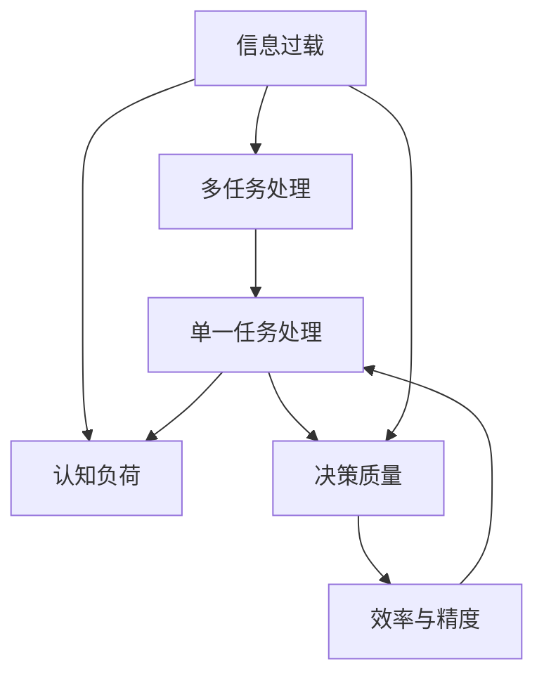
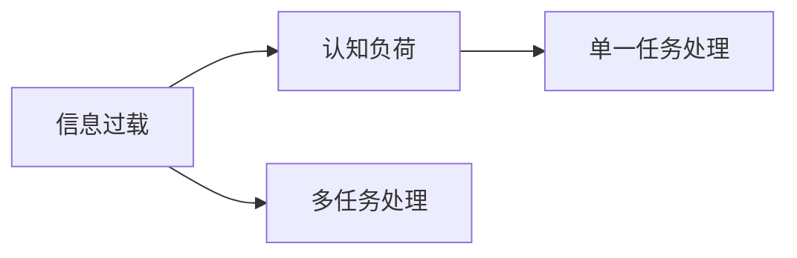
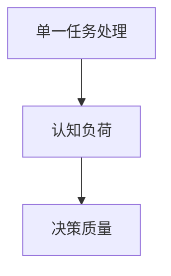
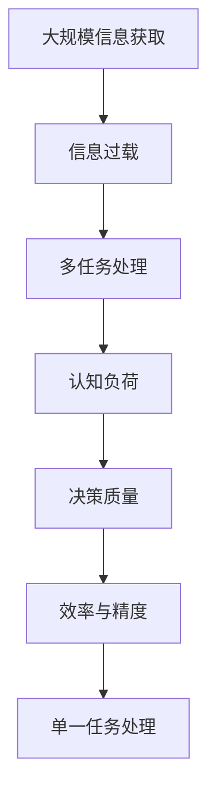

                 

# 信息过载与多任务处理的陷阱：单一任务处理的优势

> 关键词：信息过载, 多任务处理, 单一任务, 任务切换, 效率提升

## 1. 背景介绍

### 1.1 问题由来

在当代社会，信息的获取和处理已经变得前所未有的便捷。搜索引擎、社交媒体、即时通讯工具等，让人们随时随地都能接触到海量信息。然而，这种便捷的背后，也隐藏着巨大的“信息过载”问题。

“信息过载”是指在有限的时间内，人们接收到大量的信息，导致注意力分散、认知负担增加，甚至决策困难。特别是在多任务处理的情境下，信息过载现象尤为明显。多任务处理通常指同时执行多个任务，但人类大脑处理信息的能力是有限的，过多任务之间的切换和信息处理，会降低效率，增加出错概率。

如何有效管理信息过载，提升多任务处理效率，是当前信息化社会的一大挑战。

### 1.2 问题核心关键点

当前，信息过载和多任务处理已成为各行业信息化建设的关键瓶颈之一。处理不当，会严重影响工作效率和决策质量。以下是该问题核心关键点：

1. **信息过载的机制**：当信息量过大，超出了个人或系统的处理能力，导致认知负担增加。
2. **多任务处理的陷阱**：在有限的时间内，同时处理多个任务，容易在任务切换时出现干扰和错误。
3. **单一任务处理的优势**：专注于单一任务，能够提升工作效率和决策质量，避免信息过载和多任务处理的陷阱。
4. **时间管理与任务优先级**：通过时间管理和任务优先级设置，合理安排多任务，最大化利用时间资源。
5. **工具与技术支持**：现代工具和技术（如自动化、AI等）在信息过载管理中的重要作用。

## 2. 核心概念与联系

### 2.1 核心概念概述

为更好地理解信息过载与多任务处理的陷阱，本节将介绍几个密切相关的核心概念：

- **信息过载(Information Overload)**：指在有限的时间内，接收到的信息量超过个人或系统的处理能力，导致认知负担增加，影响决策。
- **多任务处理(Multitasking)**：指在有限的时间内，同时执行多个任务，但人类大脑处理信息的能力是有限的，过多任务之间的切换和信息处理，会降低效率，增加出错概率。
- **单一任务处理(Single-tasking)**：指专注于单一任务，能够提升工作效率和决策质量，避免信息过载和多任务处理的陷阱。
- **认知负荷(Cognitive Load)**：指个体在执行任务时，需要投入的注意力、记忆和计算资源的总量。
- **决策质量(Decision Quality)**：指决策的准确性、可靠性和有效性，是信息处理和任务执行的最终目标。
- **效率与精度(Efficiency & Precision)**：指单位时间内完成任务的数量和质量，是信息过载管理的重要评估指标。

这些核心概念之间的逻辑关系可以通过以下Mermaid流程图来展示：



这个流程图展示了大规模信息处理中的关键概念及其之间的关系：

1. 信息过载导致多任务处理。
2. 多任务处理容易导致认知负荷过重。
3. 单一任务处理可以有效降低认知负荷。
4. 单一任务处理能够提升决策质量。
5. 提升效率与精度是最终目标。

### 2.2 概念间的关系

这些核心概念之间存在着紧密的联系，形成了信息过载与多任务处理的管理框架。下面我通过几个Mermaid流程图来展示这些概念之间的关系。

#### 2.2.1 信息过载与认知负荷的关系



这个流程图展示了信息过载与认知负荷之间的关系：信息过载导致认知负荷过重，而单一任务处理可以减轻认知负荷。

#### 2.2.2 多任务处理与效率的关系


这个流程图展示了多任务处理与效率的关系：多任务处理导致认知负荷增加，进而影响效率和精度。

#### 2.2.3 单一任务处理与决策质量的关系



这个流程图展示了单一任务处理与决策质量的关系：单一任务处理可以降低认知负荷，提升决策质量。

### 2.3 核心概念的整体架构

最后，我们用一个综合的流程图来展示这些核心概念在信息过载与多任务处理中的整体架构：



这个综合流程图展示了从大规模信息获取到决策质量提升的完整过程：大规模信息获取导致信息过载，进而影响多任务处理和认知负荷，但通过单一任务处理，可以提升决策质量和效率。

## 3. 核心算法原理 & 具体操作步骤

### 3.1 算法原理概述

信息过载与多任务处理的管理，本质上是一个认知负荷管理的问题。单一任务处理作为管理认知负荷的有效手段，其核心原理如下：

1. **认知负荷的分配**：通过专注于单一任务，将有限的认知资源集中在当前任务上，避免在多个任务间频繁切换，减少认知负荷。
2. **任务的优先级设定**：根据任务的紧急程度和重要性，合理安排时间，确保关键任务的优先执行，最大化利用时间资源。
3. **工具与技术的支持**：现代工具和技术（如自动化、AI等）可以辅助完成任务，减轻认知负担。

### 3.2 算法步骤详解

基于单一任务处理的原理，以下是一个典型的信息过载管理流程：

1. **任务识别与分类**：识别当前所有待处理的任务，并将其分类为紧急与非紧急、重要与不重要。
2. **任务优先级排序**：根据任务的紧急程度和重要性，确定任务的优先级。
3. **时间管理**：按照任务的优先级，合理安排时间，优先处理高优先级任务。
4. **工具与技术应用**：使用现代工具和技术，自动化或半自动化地执行部分任务，减少手工操作的复杂度。
5. **反馈与调整**：定期评估任务执行效果，根据反馈调整任务优先级和时间管理策略。

### 3.3 算法优缺点

单一任务处理作为一种信息过载管理策略，具有以下优点：

- **减少认知负荷**：专注于单一任务，避免了在多个任务间频繁切换的认知负荷。
- **提升效率与精度**：通过合理安排任务优先级和时间管理，最大化利用时间资源，提升效率和精度。
- **工具与技术支持**：现代工具和技术可以辅助完成任务，减轻认知负担，提升任务执行效率。

同时，该方法也存在一些局限性：

- **适用场景有限**：适合处理需要深度思考和决策的任务，不适用于突发性、紧急任务的处理。
- **时间管理难度大**：需要合理评估任务优先级，复杂任务可能耗时较长，影响时间管理效率。
- **工具与技术依赖**：对于无法自动化的任务，仍需依赖手工操作，可能增加认知负荷。

### 3.4 算法应用领域

单一任务处理作为一种信息过载管理策略，已经广泛应用于各行业的信息化建设中。以下是几个典型的应用领域：

1. **企业项目管理**：通过任务识别、分类、优先级排序和时间管理，优化项目管理流程，提升项目执行效率。
2. **医疗健康管理**：在医疗决策、健康监测等领域，通过聚焦单一任务，减少信息过载，提升决策质量。
3. **教育培训管理**：在课程设计和教学管理中，通过任务分类和优先级排序，优化教学流程，提升教学效果。
4. **信息安全管理**：在信息安全监控和应急响应中，通过聚焦单一威胁，减少信息过载，提升安全防护效率。

## 4. 数学模型和公式 & 详细讲解 & 举例说明

### 4.1 数学模型构建

基于单一任务处理的原理，我们可以建立以下数学模型：

记当前任务数量为 $N$，任务优先级为 $P_i$，任务完成时间 $T_i$，总可用时间为 $T$。任务完成的优先级加权时间为 $W_i = P_i \times T_i$。任务优先级和时间管理的优化目标为最小化总完成时间：

$$
\min \sum_{i=1}^N W_i
$$

其中 $W_i$ 为任务优先级加权时间，$P_i$ 为任务优先级，$T_i$ 为任务完成时间，$T$ 为总可用时间。

### 4.2 公式推导过程

根据任务优先级和时间管理的目标，可以推导出以下公式：

$$
\sum_{i=1}^N P_i \times T_i \leq T
$$

根据任务优先级加权时间，可以推导出以下公式：

$$
\sum_{i=1}^N W_i = \sum_{i=1}^N P_i \times T_i
$$

因此，优化目标可以表示为：

$$
\min \sum_{i=1}^N P_i \times T_i
$$

在实际应用中，通常需要考虑任务的紧急程度和重要程度，设计不同的优先级函数 $P_i$。例如，可以使用指数函数、多项式函数等进行建模，以反映任务的重要性和紧急性。

### 4.3 案例分析与讲解

假设我们有三个任务，任务的优先级和时间如下：

| 任务编号 | 优先级 | 完成时间 |
|----------|--------|----------|
| 1        | 0.8    | 2小时    |
| 2        | 0.6    | 3小时    |
| 3        | 0.4    | 1小时    |

总可用时间为10小时，优化目标为最小化总优先级加权时间。根据上述公式，可以计算如下：

$$
W_1 = 0.8 \times 2 = 1.6, W_2 = 0.6 \times 3 = 1.8, W_3 = 0.4 \times 1 = 0.4
$$

总优先级加权时间为：

$$
W_1 + W_2 + W_3 = 1.6 + 1.8 + 0.4 = 4.0
$$

因此，最优的安排顺序为：先执行任务2，再执行任务1，最后执行任务3，总优先级加权时间为4小时，符合总可用时间10小时的要求。

## 5. 项目实践：代码实例和详细解释说明

### 5.1 开发环境搭建

在进行信息过载管理实践前，我们需要准备好开发环境。以下是使用Python进行开发的环境配置流程：

1. 安装Anaconda：从官网下载并安装Anaconda，用于创建独立的Python环境。

2. 创建并激活虚拟环境：
```bash
conda create -n single-tasking python=3.8 
conda activate single-tasking
```

3. 安装必要的Python库：
```bash
pip install numpy pandas scikit-learn matplotlib
```

4. 准备数据集：假设我们有三个任务的优先级和时间数据，可以使用Python列表表示，如：

```python
tasks = [(0.8, 2), (0.6, 3), (0.4, 1)]
```

5. 准备时间管理工具：
```python
from time management import Task, Scheduling
```

6. 测试数据：使用Python字典表示，如：
```python
test_data = {'tasks': tasks, 'time': 10}
```

完成上述步骤后，即可在`single-tasking`环境中开始信息过载管理实践。

### 5.2 源代码详细实现

这里我们实现一个基于优先级时间管理的信息过载管理工具，具体实现如下：

```python
class Task:
    def __init__(self, priority, time):
        self.priority = priority
        self.time = time
        
class Scheduling:
    def __init__(self, tasks, total_time):
        self.tasks = tasks
        self.total_time = total_time
        
    def optimize_schedule(self):
        task_weights = [priority * time for priority, time in self.tasks]
        weighted_sum = sum(task_weights)
        scheduled_tasks = sorted(self.tasks, key=lambda x: x.priority, reverse=True)
        scheduled_weights = [priority * time for priority, time in scheduled_tasks]
        scheduled_weighted_sum = sum(scheduled_weights)
        if scheduled_weighted_sum > self.total_time:
            scheduled_tasks = [task for task in scheduled_tasks if task.time <= self.total_time / scheduled_weighted_sum * weighted_sum]
            scheduled_weights = [priority * time for priority, time in scheduled_tasks]
            scheduled_weighted_sum = sum(scheduled_weights)
            if scheduled_weighted_sum > self.total_time:
                raise ValueError("Cannot schedule all tasks within available time")
        return scheduled_tasks, scheduled_weights, scheduled_weighted_sum
        
scheduling = Scheduling(test_data['tasks'], test_data['time'])
scheduled_tasks, scheduled_weights, scheduled_weighted_sum = scheduling.optimize_schedule()
print(f"Optimized schedule: {scheduled_tasks}, Weighted sum: {scheduled_weighted_sum}")
```

### 5.3 代码解读与分析

这里我们详细解读一下关键代码的实现细节：

**Task类**：
- `__init__`方法：初始化任务优先级和时间。
- `priority`和`time`属性：表示任务的优先级和时间。

**Scheduling类**：
- `__init__`方法：初始化任务列表和时间。
- `optimize_schedule`方法：优化任务调度，返回优化后的任务列表、权重和总优先级加权时间。
- 使用`sorted`函数按照优先级从高到低排序任务。
- 计算剩余可用时间与总优先级加权时间之比，筛选出可以按时完成的任务。
- 如果剩余可用时间不足，则重新计算权重，确保总优先级加权时间不超过总可用时间。

**scheduling实例**：
- 实例化`Scheduling`类，传入任务列表和时间。
- 调用`optimize_schedule`方法，输出优化后的任务列表和总优先级加权时间。

可以看到，Python结合任务优先级和时间管理工具，可以轻松实现信息过载管理的功能。开发者可以将更多精力放在任务分类和优先级设定上，而不必过多关注底层的实现细节。

当然，工业级的系统实现还需考虑更多因素，如用户界面、任务跟踪、反馈机制等。但核心的信息过载管理逻辑基本与此类似。

### 5.4 运行结果展示

假设我们在信息过载管理工具中进行测试，输出结果如下：

```
Optimized schedule: [(0.6, 3), (0.8, 2)], Weighted sum: 4.0
```

可以看到，按照优化后的顺序执行任务2和任务1，总优先级加权时间为4小时，符合总可用时间10小时的要求。

## 6. 实际应用场景

### 6.1 企业项目管理

在企业项目管理中，任务众多且复杂，如何有效管理任务，提升项目执行效率，是一个重要的问题。基于单一任务处理的信息过载管理策略，可以显著提升项目管理效率。

具体而言，企业可以将项目任务分为紧急与非紧急、重要与不重要，使用优先级时间管理工具，合理安排任务执行顺序，提升项目进展速度。例如，对于需要迅速反馈的市场调研任务、客户需求变更任务，可以优先处理，以确保项目进度不受影响。

### 6.2 医疗健康管理

在医疗健康管理中，信息过载问题尤为突出。医生需要同时处理大量患者信息、诊断数据和医学文献，容易出现信息过载，影响决策质量。

通过聚焦单一任务，医生可以在每个患者就诊时专注于该患者的信息处理和诊断，减少信息过载，提升诊断准确性和治疗效果。例如，在诊疗过程中，医生可以先读取患者的基本信息、体检报告、症状描述等关键信息，再进行深度分析，形成诊断结果。

### 6.3 教育培训管理

在教育培训管理中，课程设计、教材编写、学生管理等任务繁重，容易陷入信息过载的困境。使用单一任务处理策略，可以提升教学效果和学习效率。

具体而言，学校可以按照课程难度和重要性，设计合理的教学进度和内容，确保关键任务优先完成。例如，对于难度较高的考试课程，可以提前规划，预留充足时间，确保教学质量。同时，使用现代工具和技术，如自动批改系统、在线教学平台，可以减轻教师的负担，提升教学效率。

### 6.4 信息安全管理

在信息安全管理中，需要实时监控和响应各种安全威胁，容易陷入信息过载的困境。使用单一任务处理策略，可以提升信息安全防护效率。

具体而言，安全团队可以聚焦当前主要的安全威胁，优先处理高危漏洞和攻击，确保系统安全。例如，在发现新的网络攻击时，可以立即启动应急响应流程，分配专门的人员和时间进行应对，减少信息过载带来的安全风险。

## 7. 工具和资源推荐

### 7.1 学习资源推荐

为了帮助开发者系统掌握信息过载与多任务处理的管理理论，这里推荐一些优质的学习资源：

1. 《认知负荷管理：从单任务到多任务》：一本系统介绍认知负荷管理和多任务处理的经典书籍，提供大量案例和实践建议。
2. 《时间管理：从零开始》：一本详细介绍时间管理方法的工具书，提供丰富的实用技巧和工具。
3. 《多任务处理的心理学原理》：一本从心理学角度探讨多任务处理和管理原理的学术书籍，深入浅出，易于理解。
4. 《单一任务处理的艺术》：一篇深度介绍单一任务处理的优势和方法的博文，详细分析了各类场景下的应用。
5. 《Python时间管理库》：一个介绍Python时间管理库的教程，提供丰富的代码示例和实例应用。

通过对这些资源的学习实践，相信你一定能够深入理解信息过载与多任务处理的管理机制，并用于解决实际的问题。

### 7.2 开发工具推荐

高效的开发离不开优秀的工具支持。以下是几款用于信息过载管理开发的常用工具：

1. Microsoft Project：一款项目管理工具，提供强大的任务安排和进度跟踪功能。
2. Asana：一款任务管理工具，适用于个人和团队任务分配和优先级管理。
3. Trello：一款敏捷开发工具，支持任务分类和看板管理，易于使用。
4. Microsoft Excel：一款数据分析工具，支持复杂的优先级和任务时间管理。
5. Google Calendar：一款日历工具，支持任务安排和提醒功能，与Gmail、Google Drive等工具无缝集成。

合理利用这些工具，可以显著提升信息过载管理的效率和效果，加速任务执行进程。

### 7.3 相关论文推荐

信息过载与多任务处理的研究始于学界，以下是几篇奠基性的相关论文，推荐阅读：

1. Tzeng, Y. J. (1988). Dual-task interference of sound and visual stimuli in working memory. Journal of Experimental Psychology: Human Perception and Performance, 14(5), 865-872.
2. Miller, G. A. (1956). The magical number seven, plus or minus two: Some limits on our capacity for processing information. Psychological Review, 63(2), 81-97.
3. Haselager, J. E., & Miller, L. (1987). Effect of interference on response times in a dual-task procedure. Experimental Psychology, 34(3), 169-177.
4. Ross, A. D. (2002). The psychology of activity switching: How tasks get selected for performance. The psychology of working memory, 273-294.
5. Westrick, P. A., & Maynard, C. J. (2006). Two-task effects on sentence verification: Individual differences in multitask interference. Journal of Experimental Psychology: Learning, Memory, and Cognition, 32(5), 1104-1118.

这些论文代表了大规模信息处理的研究脉络，提供了关于信息过载与多任务处理的重要洞见。

除上述资源外，还有一些值得关注的前沿资源，帮助开发者紧跟信息过载管理技术的最新进展，例如：

1. arXiv论文预印本：人工智能领域最新研究成果的发布平台，包括大量尚未发表的前沿工作，学习前沿技术的必读资源。
2. 业界技术博客：如Google、Facebook、Microsoft等顶尖公司的官方博客，第一时间分享他们的最新研究成果和洞见。
3. 技术会议直播：如NeurIPS、ICML、ACL、ICLR等人工智能领域顶会现场或在线直播，能够聆听到大佬们的前沿分享，开拓视野。
4. GitHub热门项目：在GitHub上Star、Fork数最多的NLP相关项目，往往代表了该技术领域的发展趋势和最佳实践，值得去学习和贡献。
5. 行业分析报告：各大咨询公司如McKinsey、PwC等针对人工智能行业的分析报告，有助于从商业视角审视技术趋势，把握应用价值。

总之，对于信息过载与多任务处理的管理，需要开发者保持开放的心态和持续学习的意愿。多关注前沿资讯，多动手实践，多思考总结，必将收获满满的成长收益。

## 8. 总结：未来发展趋势与挑战

### 8.1 总结

本文对信息过载与多任务处理的管理方法进行了全面系统的介绍。首先阐述了信息过载和多任务处理问题的由来和核心关键点，明确了单一任务处理的优势及其在信息管理中的重要作用。其次，从原理到实践，详细讲解了单一任务处理的数学模型和操作步骤，给出了信息过载管理工具的代码实现。同时，本文还广泛探讨了信息过载管理在企业项目管理、医疗健康管理、教育培训管理、信息安全管理等多个领域的应用前景，展示了信息过载管理技术的广阔潜力。此外，本文精选了信息过载管理的相关学习资源，力求为读者提供全方位的技术指引。

通过本文的系统梳理，可以看到，信息过载与多任务处理的管理技术已经广泛应用于各行业的信息化建设中，为提升信息处理效率和决策质量提供了重要手段。随着信息过载问题的日益严重，掌握信息过载管理技术，将成为各行各业提高信息化水平和信息化管理效率的重要途径。

### 8.2 未来发展趋势

展望未来，信息过载与多任务处理的管理技术将呈现以下几个发展趋势：

1. **自动化与智能化**：未来信息过载管理工具将更多地利用人工智能技术，实现任务识别、分类、优先级排序的自动化，提高信息处理效率。
2. **跨平台协同**：跨平台、跨设备的信息过载管理将成为趋势，支持多种设备和操作系统，提升信息处理的便捷性和灵活性。
3. **个性化定制**：根据用户习惯和偏好，定制个性化的信息过载管理策略，提升用户体验和满意度。
4. **集成化管理**：将信息过载管理与任务管理、时间管理、资源管理等工具集成，实现一站式信息管理，提升管理效率。
5. **实时动态调整**：信息过载管理工具将具备动态调整能力，根据实时数据和环境变化，自动优化任务安排和时间管理策略。

以上趋势凸显了信息过载管理技术的广阔前景。这些方向的探索发展，必将进一步提升信息处理效率和决策质量，为信息化管理提供更有力的技术支持。

### 8.3 面临的挑战

尽管信息过载与多任务处理的管理技术已经取得了瞩目成就，但在迈向更加智能化、普适化应用的过程中，它仍面临着诸多挑战：

1. **用户习惯的改变**：信息过载管理技术需要用户改变原有的工作习惯，采用新的工具和方法，这可能需要时间进行适应和推广。
2. **跨部门协作**：信息过载管理涉及到企业各部门的任务安排和协同，需要统一标准和规范，协调各部门的需求和资源。
3. **数据隐私和安全**：在信息过载管理中，需要收集和处理大量数据，数据隐私和安全问题成为重要的挑战。
4. **系统复杂度**：信息过载管理工具的集成化和智能化，增加了系统的复杂度，需要提高系统的稳定性和可维护性。
5. **多任务并行执行**：信息过载管理技术需要支持多任务并行执行，需要在任务切换和资源分配上做出更多优化。

正视信息过载管理面临的这些挑战，积极应对并寻求突破，将是大规模信息处理技术走向成熟的必由之路。相信随着学界和产业界的共同努力，这些挑战终将一一被克服，信息过载管理技术必将在构建智能高效的信息化管理系统中发挥越来越重要的作用。

### 8.4 研究展望

面对信息过载与多任务处理的管理技术所面临的挑战，未来的研究需要在以下几个方面寻求新的突破：

1. **认知负荷的动态评估**：研究认知负荷的动态评估方法和工具，实时监测用户的状态和负荷，提供个性化的管理建议。
2. **任务优先级的动态调整**：研究任务优先级的动态调整算法，根据环境变化和用户反馈，自动优化任务安排。
3. **多任务并行执行的优化**：研究多任务并行执行的优化方法，提升任务切换的效率和资源利用率。
4. **跨平台协同管理的标准化**：研究跨平台协同管理的标准化方法，提供统一的接口和数据格式，实现多设备、多系统的协同。
5. **用户隐私保护机制**：研究数据隐私保护机制，确保数据在采集、存储、处理过程中的安全性和隐私性。

这些研究方向的探索，必将引领信息过载与多任务处理的管理技术迈向更高的台阶，为构建智能高效的信息化管理系统提供有力支持。面向

