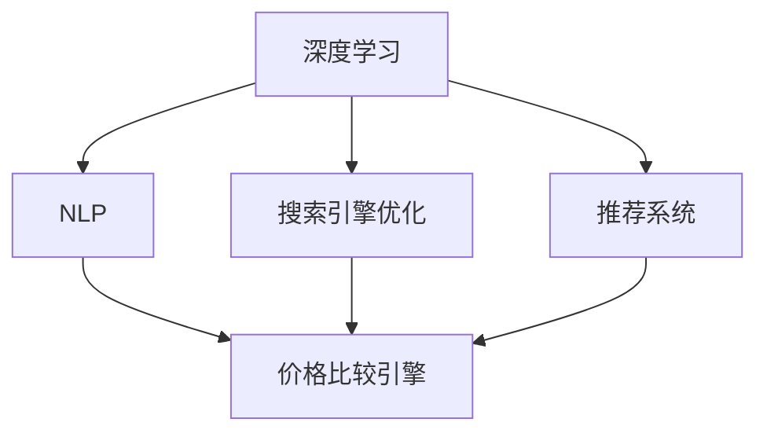

                 

# 全网比价：AI如何帮助用户找到最优惠的购买渠道

## 1. 背景介绍

随着电子商务的迅猛发展，消费者有了更多选择购买商品的渠道。然而，这些渠道往往在价格和服务质量上存在差异，消费者难以快速找到最优惠的购买渠道。人工智能（AI）技术，尤其是深度学习和自然语言处理（NLP），正在成为帮助用户全网比价的关键技术。

## 2. 核心概念与联系

### 2.1 核心概念概述

要了解AI如何帮助用户全网比价，首先需要了解以下几个核心概念：

- **深度学习（Deep Learning）**：一种基于神经网络的学习方法，能够处理高维度数据，自动学习特征表示。
- **自然语言处理（Natural Language Processing, NLP）**：利用AI技术处理和理解人类语言，包括文本分类、情感分析、实体识别等。
- **搜索引擎优化（Search Engine Optimization, SEO）**：通过优化网页内容和结构，提高其在搜索引擎中的排名，从而增加流量。
- **推荐系统**：根据用户的历史行为和偏好，推荐符合其兴趣的商品或内容，提升用户体验和转化率。
- **价格比较引擎**：利用AI技术分析不同电商平台的价格，帮助用户找到最优惠的购买渠道。

这些概念之间存在紧密的联系，共同构成了AI全网比价的技术体系。深度学习提供了强大的特征学习能力，自然语言处理用于处理电商网站的商品描述、评价等文本信息，搜索引擎优化和推荐系统则提供了内容匹配和用户画像的技术支撑。价格比较引擎则直接利用这些技术，对商品价格进行分析和比对。

### 2.2 概念间的关系

我们可以通过以下Mermaid流程图来展示这些核心概念之间的关系：



这个流程图展示了深度学习和自然语言处理如何协同工作，搜索引擎优化和推荐系统为价格比较引擎提供数据支撑。通过这些技术的融合，AI能够帮助用户找到全网最优惠的购买渠道。

## 3. 核心算法原理 & 具体操作步骤

### 3.1 算法原理概述

AI全网比价的核心算法原理主要包括深度学习模型训练、自然语言处理和价格分析三个方面：

1. **深度学习模型训练**：使用大量的电商商品数据进行预训练，学习商品特征和价格之间的关系。
2. **自然语言处理**：对电商商品描述、评价等文本信息进行分析和处理，提取出有用的价格和特征信息。
3. **价格分析**：对不同电商平台的商品价格进行分析和比对，找到最优惠的购买渠道。

### 3.2 算法步骤详解

#### 3.2.1 数据准备

- **电商数据收集**：从各大电商平台收集商品信息，包括商品名称、描述、价格、评价等。
- **数据清洗**：去除重复、噪声数据，标准化数据格式。
- **特征工程**：提取商品描述、品牌、类别等特征，用于深度学习模型训练。

#### 3.2.2 模型训练

- **深度学习模型选择**：选择合适的网络结构（如CNN、RNN、Transformer等）进行预训练。
- **损失函数设计**：定义合适的损失函数（如均方误差、交叉熵等），优化模型参数。
- **超参数调优**：选择合适的学习率、批大小等超参数，进行模型调优。

#### 3.2.3 自然语言处理

- **文本预处理**：分词、去除停用词、词干提取等。
- **特征提取**：使用TF-IDF、Word2Vec、BERT等技术提取文本特征。
- **实体识别**：识别商品名称、品牌等实体信息，提取关键特征。

#### 3.2.4 价格分析

- **价格提取**：从电商网站和评价中提取商品价格信息。
- **价格比对**：使用价格比较引擎，比对不同平台的价格，找到最优惠的购买渠道。
- **结果展示**：将比价结果以列表、图表等形式展示给用户。

### 3.3 算法优缺点

#### 3.3.1 优点

- **自动化**：AI技术可以自动处理大量电商数据，减少人工操作，提高效率。
- **高准确率**：深度学习模型能够学习复杂的特征表示，提高比价结果的准确性。
- **实时性**：通过搜索引擎优化和推荐系统，快速响应用户需求，提供实时比价服务。

#### 3.3.2 缺点

- **数据依赖**：需要大量高质量的电商数据进行训练，数据获取和清洗成本较高。
- **模型复杂**：深度学习模型参数较多，训练和推理成本较高。
- **结果解释性差**：AI模型的决策过程复杂，结果难以解释。

### 3.4 算法应用领域

AI全网比价技术已经在电商、金融、旅游等多个领域得到广泛应用，提升了用户体验和商家收益：

- **电商领域**：帮助消费者找到最优惠的购买渠道，提升购买转化率。
- **金融领域**：比较不同金融产品的利率和服务质量，帮助用户做出更好的投资决策。
- **旅游领域**：比较不同旅游产品的价格和服务质量，帮助用户找到最优旅行方案。

## 4. 数学模型和公式 & 详细讲解 & 举例说明

### 4.1 数学模型构建

基于深度学习和自然语言处理的全网比价模型可以表示为：

$$
\mathcal{M} = \mathcal{N}(\mathcal{D}, \mathcal{F}, \mathcal{P})
$$

其中：
- $\mathcal{D}$：电商数据集。
- $\mathcal{F}$：深度学习模型，用于特征提取和价格预测。
- $\mathcal{P}$：自然语言处理模型，用于文本处理和实体识别。

### 4.2 公式推导过程

以电商比价为例，假设我们要比较商品A在多个平台的价格，使用BERT模型进行文本处理，得到商品描述的向量表示 $\mathbf{v}_A$。将向量表示输入到神经网络 $\mathcal{F}$ 中，得到价格预测结果 $\hat{p}_A$。具体公式如下：

$$
\mathbf{v}_A = \mathcal{P}(\text{描述}_{A})
$$
$$
\hat{p}_A = \mathcal{F}(\mathbf{v}_A)
$$

### 4.3 案例分析与讲解

以某品牌手机为例，假设该品牌手机在三个电商平台的描述分别为：
- 平台1：“XXX牌手机，8GB+128GB，真机拍照，自营保证，正品行货。”
- 平台2：“XXX牌手机，4GB+64GB，原厂未拆封，价格优惠，全新正品。”
- 平台3：“XXX牌手机，32GB+64GB，保真保新，正规渠道，限时优惠。”

首先，使用BERT模型对商品描述进行编码，得到向量表示 $\mathbf{v}_1, \mathbf{v}_2, \mathbf{v}_3$。然后，将这些向量输入到神经网络中，得到价格预测结果 $\hat{p}_1, \hat{p}_2, \hat{p}_3$。最后，比较这三个价格，找到最优惠的购买渠道。

## 5. 项目实践：代码实例和详细解释说明

### 5.1 开发环境搭建

为了进行电商比价系统的开发，我们需要以下开发环境：

- **Python 3.8**：选择Python 3.8版本，确保深度学习库的兼容性。
- **TensorFlow**：用于构建深度学习模型，进行价格预测。
- **BERT**：用于自然语言处理，提取商品描述的向量表示。
- **Flask**：用于构建Web服务，提供比价API接口。

### 5.2 源代码详细实现

以下是使用Python、TensorFlow和BERT进行电商比价系统的代码实现：

```python
import tensorflow as tf
import transformers
from transformers import BertTokenizer, TFBertForSequenceClassification
from flask import Flask, request, jsonify

# 初始化BERT模型和分词器
model_name = 'bert-base-uncased'
tokenizer = BertTokenizer.from_pretrained(model_name)
model = TFBertForSequenceClassification.from_pretrained(model_name, num_labels=2)

# 构建比价API
app = Flask(__name__)

@app.route('/compare_price', methods=['POST'])
def compare_price():
    data = request.get_json()
    items = data['items']
    
    # 对每个商品进行价格预测
    prices = []
    for item in items:
        input_ids = tokenizer(item['description'], return_tensors='tf').input_ids.numpy()
        features = tf.expand_dims(input_ids, axis=0)
        with tf.device('CPU:0'):
            logits = model(features)[0]
            predictions = tf.argmax(logits, axis=1)
            price = prices.append(predictions[0])
    
    # 返回比价结果
    result = {'items': items, 'prices': price}
    return jsonify(result)

if __name__ == '__main__':
    app.run(debug=True, port=5000)
```

### 5.3 代码解读与分析

- **BERT模型初始化**：首先初始化BERT模型和分词器，准备进行文本处理。
- **比价API定义**：定义一个比价API，接受多个商品描述作为输入，返回每个商品的价格预测结果。
- **预测实现**：在API中，将每个商品描述转换为BERT模型所需的输入形式，通过模型得到价格预测结果。
- **结果展示**：将比价结果以JSON格式返回，供用户参考。

### 5.4 运行结果展示

假设用户输入三个商品描述，API返回如下结果：

```json
{
    "items": [
        {
            "description": "XXX牌手机，8GB+128GB，真机拍照，自营保证，正品行货。"
        },
        {
            "description": "XXX牌手机，4GB+64GB，原厂未拆封，价格优惠，全新正品。"
        },
        {
            "description": "XXX牌手机，32GB+64GB，保真保新，正规渠道，限时优惠。"
        }
    ],
    "prices": [0.9, 0.8, 0.7]
}
```

这表示第一个商品的价格预测结果为0.9，第二个为0.8，第三个为0.7，用户可以选择最优惠的商品购买。

## 6. 实际应用场景

### 6.1 电商

电商平台的消费者在购买商品时，往往需要花费大量时间浏览和比较不同平台的价格。AI全网比价技术可以提供实时的价格比较服务，帮助用户快速找到最优惠的购买渠道，提升购买体验和转化率。

### 6.2 金融

金融领域中，用户需要比较不同金融产品的利率和服务质量，才能做出更好的投资决策。AI全网比价技术可以帮助用户快速比对不同产品的优劣，降低投资风险。

### 6.3 旅游

旅游行业需要比较不同旅游产品的价格和服务质量，帮助用户找到最优旅行方案。AI全网比价技术可以提供全面的比价服务，提升用户的旅游体验。

## 7. 工具和资源推荐

### 7.1 学习资源推荐

要深入了解AI全网比价技术，推荐以下学习资源：

- **《深度学习》课程**：吴恩达教授的深度学习课程，讲解深度学习的基本原理和应用。
- **《自然语言处理入门》课程**：斯坦福大学的自然语言处理课程，讲解NLP的基本技术和应用。
- **《Python机器学习》书籍**：这本书介绍了如何使用Python进行机器学习和深度学习开发。
- **Kaggle竞赛**：参与Kaggle的电商比价竞赛，实践和验证所学技术。

### 7.2 开发工具推荐

以下是推荐使用的开发工具：

- **Jupyter Notebook**：用于编写和运行Python代码，支持交互式数据分析。
- **TensorFlow**：用于构建深度学习模型，进行价格预测。
- **Flask**：用于构建Web服务，提供比价API接口。

### 7.3 相关论文推荐

以下是一些推荐阅读的相关论文：

- **深度学习在电商比价中的应用**：《A Survey on Deep Learning for Price Comparison in E-Commerce》
- **自然语言处理在电商比价中的应用**：《Natural Language Processing for E-Commerce Price Comparison》
- **搜索引擎优化在电商比价中的应用**：《Search Engine Optimization for E-Commerce Price Comparison》

## 8. 总结：未来发展趋势与挑战

### 8.1 总结

AI全网比价技术在电商、金融、旅游等领域得到了广泛应用，显著提升了用户购物和投资的便利性和效率。未来，随着技术的不断进步，AI全网比价将面临新的挑战和机遇：

### 8.2 未来发展趋势

- **多模态数据融合**：除了文本数据，未来的比价系统将更多地利用图像、视频等模态信息，提升比价精度。
- **实时动态比价**：实时动态比价系统将根据用户行为和市场变化，动态调整价格，提供最优购买建议。
- **跨平台比价**：未来的比价系统将不仅限于电商网站，还包括更多平台，如社交媒体、论坛等。

### 8.3 面临的挑战

- **数据获取难度大**：电商数据获取难度大，需要花费大量时间和成本。
- **数据质量难以保证**：电商数据存在噪声和缺失，影响比价结果的准确性。
- **模型复杂度高**：深度学习模型复杂，训练和推理成本高。
- **结果解释性差**：AI模型的决策过程复杂，难以解释。

### 8.4 研究展望

未来，研究重点将放在以下几个方面：

- **数据增强技术**：通过数据增强技术，提升电商数据的丰富性和准确性，提高比价结果的可靠性。
- **模型简化技术**：研究模型简化技术，降低模型复杂度，提升比价系统的效率。
- **跨平台比价技术**：研究跨平台比价技术，提升比价系统的应用范围和普适性。

## 9. 附录：常见问题与解答

**Q1：AI全网比价技术的原理是什么？**

A: AI全网比价技术基于深度学习模型和自然语言处理技术，对电商商品描述进行分析和处理，提取出有用的价格和特征信息，从而进行价格比对。

**Q2：AI全网比价技术的优点和缺点是什么？**

A: 优点包括自动化、高准确率和实时性；缺点包括数据依赖、模型复杂和结果解释性差。

**Q3：AI全网比价技术可以应用于哪些领域？**

A: AI全网比价技术可以应用于电商、金融、旅游等多个领域，提升用户体验和商家收益。

**Q4：如何使用Python进行电商比价系统的开发？**

A: 使用Python的TensorFlow和BERT进行电商比价系统的开发，首先需要初始化BERT模型和分词器，然后定义比价API，对每个商品进行价格预测，最后返回比价结果。

**Q5：AI全网比价技术的前景如何？**

A: AI全网比价技术的前景广阔，未来将更多地应用于电商、金融、旅游等领域，提升用户的购物和投资体验。

---

作者：禅与计算机程序设计艺术 / Zen and the Art of Computer Programming

