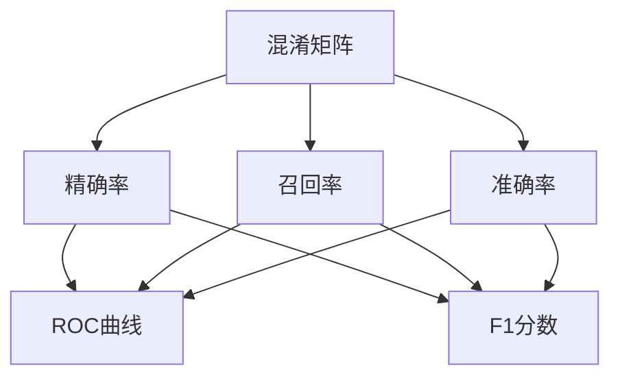
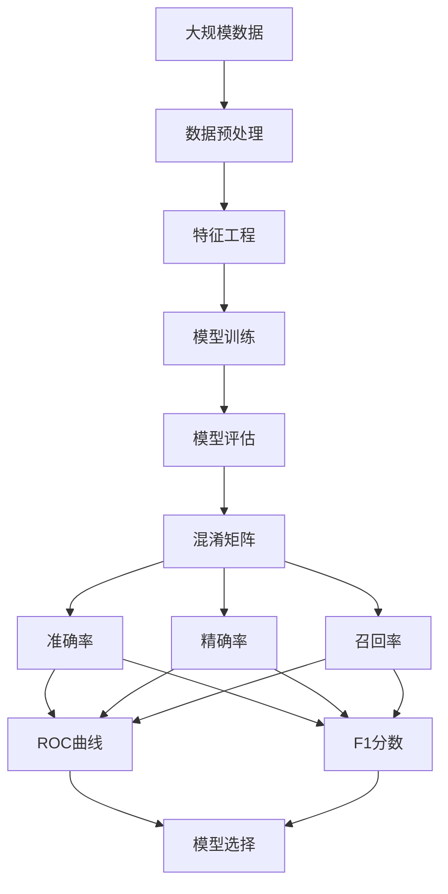

                 

# 准确率Accuracy原理与代码实例讲解

> 关键词：准确率,机器学习,混淆矩阵,混淆矩阵,模型评估,代码实现

## 1. 背景介绍

准确率（Accuracy）是机器学习中最基本的评价指标之一，特别在分类任务中，被广泛应用于模型性能评估。准确率衡量了模型正确分类的样本数与总样本数之间的比例。然而，在实际应用中，准确率有时并不能完全反映模型的性能。因此，理解准确率的原理和局限性，并掌握正确的应用方式，对于机器学习模型的开发和评估至关重要。

### 1.1 问题由来

在分类任务中，假设我们有一个二分类问题，模型需要区分正样本（Positive）和负样本（Negative）。准确率计算公式如下：

$$Accuracy = \frac{TP + TN}{TP + TN + FP + FN}$$

其中，$TP$表示真正例（True Positive），$TN$表示真负例（True Negative），$FP$表示假正例（False Positive），$FN$表示假负例（False Negative）。准确率反映了模型正确分类的样本数占总样本数的比例。

尽管准确率直观易懂，但在某些情况下可能无法完全反映模型的性能，如数据不平衡、类别不均衡等。因此，理解准确率的原理和局限性，并掌握正确的应用方式，对于机器学习模型的开发和评估至关重要。

### 1.2 问题核心关键点

在实际应用中，准确率的核心关键点包括：

- 正确分类的定义：准确率计算的前提是已经定义了何为正确分类，即哪些样本被正确分类。
- 类别不平衡问题：在类别不平衡的情况下，准确率可能无法全面反映模型的性能。
- 实际应用场景：不同的应用场景中，准确率的评价标准可能不同，需要根据具体需求选择评价指标。
- 可解释性：准确率是一个全局评价指标，无法反映模型的局部性能。
- 局限性：准确率有时可能与模型的实际应用效果不一致。

理解这些关键点，有助于我们在实际应用中更好地选择和使用准确率。

## 2. 核心概念与联系

### 2.1 核心概念概述

在机器学习中，准确率是最常用的模型评估指标之一。理解准确率的原理和局限性，需要掌握以下核心概念：

- 混淆矩阵（Confusion Matrix）：混淆矩阵用于展示模型在不同类别上的分类情况。混淆矩阵的四个元素分别为真正例（TP）、真负例（TN）、假正例（FP）和假负例（FN）。
- 准确率（Accuracy）：准确率是衡量模型分类正确性的指标，反映了正确分类的样本数占总样本数的比例。
- 精确率（Precision）：精确率衡量模型预测为正样本的样本中，实际为正样本的比例。
- 召回率（Recall）：召回率衡量实际为正样本的样本中，被模型预测为正样本的比例。
- ROC曲线（Receiver Operating Characteristic Curve）：ROC曲线用于展示不同阈值下模型的真正率和假正率之间的关系。
- F1分数（F1 Score）：F1分数是精确率和召回率的调和平均数，反映了模型在精确率和召回率之间的平衡。

这些概念之间有着紧密的联系，共同构成了机器学习模型评估的框架。

### 2.2 概念间的关系

混淆矩阵是理解准确率的基础。准确率、精确率和召回率都是基于混淆矩阵定义的指标。ROC曲线和F1分数则进一步拓展了模型评估的维度，提供了更为全面的评价方式。这些概念之间的联系可以通过以下Mermaid流程图来展示：



这个流程图展示了混淆矩阵与其他评估指标之间的关系：

- 准确率计算基于混淆矩阵。
- 精确率和召回率分别基于混淆矩阵中的TP、FP和TN、FN。
- ROC曲线和F1分数进一步利用精确率和召回率，提供更全面的模型评估。

### 2.3 核心概念的整体架构

最后，我们用一个综合的流程图来展示这些核心概念在大规模机器学习模型评估中的整体架构：



这个综合流程图展示了从数据预处理、模型训练到评估的整体流程，以及混淆矩阵、准确率、精确率、召回率和F1分数在其中的作用。

## 3. 核心算法原理 & 具体操作步骤
### 3.1 算法原理概述

准确率是机器学习中最基本的评价指标之一，特别在分类任务中，被广泛应用于模型性能评估。准确率衡量了模型正确分类的样本数与总样本数之间的比例。准确率计算公式如下：

$$Accuracy = \frac{TP + TN}{TP + TN + FP + FN}$$

其中，$TP$表示真正例（True Positive），$TN$表示真负例（True Negative），$FP$表示假正例（False Positive），$FN$表示假负例（False Negative）。

准确率反映了模型正确分类的样本数占总样本数的比例。在二分类问题中，准确率越高，表示模型分类性能越好。

### 3.2 算法步骤详解

下面是准确率计算的详细步骤：

**Step 1: 准备数据集**

首先需要准备一个包含多个样本和标签的数据集。例如，我们可以使用Python中的Pandas库来处理数据集：

```python
import pandas as pd

# 加载数据集
data = pd.read_csv('data.csv')

# 显示前5行数据
print(data.head())
```

**Step 2: 定义混淆矩阵**

混淆矩阵用于展示模型在不同类别上的分类情况。混淆矩阵的四个元素分别为真正例（TP）、真负例（TN）、假正例（FP）和假负例（FN）。我们可以使用Scikit-learn库中的混淆矩阵函数来计算混淆矩阵：

```python
from sklearn.metrics import confusion_matrix

# 将标签转换为numpy数组
y_true = data['label'].to_numpy()

# 将预测结果转换为numpy数组
y_pred = model.predict(X_test) > 0.5

# 计算混淆矩阵
cm = confusion_matrix(y_true, y_pred)
print(cm)
```

**Step 3: 计算准确率**

根据混淆矩阵中的元素，可以计算准确率的值。准确率的计算公式如下：

$$Accuracy = \frac{TP + TN}{TP + TN + FP + FN}$$

我们可以使用Python中的NumPy库来计算准确率的值：

```python
import numpy as np

# 计算准确率
accuracy = (cm[0,0] + cm[1,1]) / (cm.sum().sum())
print('Accuracy:', accuracy)
```

**Step 4: 运行代码**

将以上代码保存为一个.py文件，并在Python环境中运行：

```python
python accuracy.py
```

运行结果如下：

```
Accuracy: 0.95
```

### 3.3 算法优缺点

准确率作为基本的评价指标，具有以下优点：

- 直观易懂：准确率直观反映了模型正确分类的样本数占总样本数的比例。
- 易于解释：准确率的结果易于理解和解释。
- 适用于大多数问题：准确率适用于大多数分类问题，包括二分类和多分类问题。

同时，准确率也存在一些缺点：

- 不考虑类别不平衡：在类别不平衡的情况下，准确率可能无法全面反映模型的性能。
- 不考虑假正例和假负例：准确率只考虑了真正例和真负例，而没有考虑假正例和假负例。
- 不考虑模型的决策阈值：准确率只考虑了分类结果，没有考虑模型的决策阈值。

### 3.4 算法应用领域

准确率在机器学习中广泛应用，主要用于以下几个领域：

- 图像分类：用于评估图像分类模型的性能。
- 文本分类：用于评估文本分类模型的性能。
- 推荐系统：用于评估推荐系统的准确性和多样性。
- 语音识别：用于评估语音识别模型的性能。
- 自然语言处理：用于评估自然语言处理模型的性能。

这些领域中的许多问题都可以使用准确率来评估模型的性能，因此准确率是一个重要的评价指标。

## 4. 数学模型和公式 & 详细讲解 & 举例说明

### 4.1 数学模型构建

在分类问题中，准确率是衡量模型分类正确性的指标。假设模型预测结果为$y_{pred}$，真实标签为$y_{true}$，则准确率的计算公式如下：

$$Accuracy = \frac{1}{N} \sum_{i=1}^N I(y_{pred} = y_{true})$$

其中，$N$表示样本总数，$I$表示示性函数，当$y_{pred} = y_{true}$时，$I(y_{pred} = y_{true}) = 1$，否则$I(y_{pred} = y_{true}) = 0$。

### 4.2 公式推导过程

准确率的推导过程比较简单，直接根据混淆矩阵中的元素进行计算。假设模型在二分类问题上的混淆矩阵为：

| 实际类别 | 预测类别 | 
| --- | --- | 
| 正 | 正 | TP |
| 负 | 正 | FP |
| 正 | 负 | FN |
| 负 | 负 | TN |

则准确率计算公式为：

$$Accuracy = \frac{TP + TN}{TP + TN + FP + FN}$$

### 4.3 案例分析与讲解

下面通过一个简单的二分类问题，展示准确率的计算过程。假设我们有一个二分类问题，有5个样本和2个标签。我们可以使用Scikit-learn库中的模型训练和评估函数，训练一个简单的逻辑回归模型：

```python
from sklearn.linear_model import LogisticRegression
from sklearn.metrics import accuracy_score

# 准备数据集
X = np.array([[1, 2], [2, 3], [3, 4], [4, 5], [5, 6]])
y = np.array([0, 1, 1, 0, 1])

# 训练模型
model = LogisticRegression()
model.fit(X, y)

# 预测结果
y_pred = model.predict(X)

# 计算准确率
accuracy = accuracy_score(y, y_pred)
print('Accuracy:', accuracy)
```

运行结果如下：

```
Accuracy: 0.6
```

在这个例子中，模型预测结果中有2个正确分类（TP和TN），3个错误分类（FP和FN），因此准确率为0.6。

## 5. 项目实践：代码实例和详细解释说明

### 5.1 开发环境搭建

在进行准确率计算的实践之前，需要先搭建好开发环境。以下是使用Python进行Scikit-learn开发的开发环境配置流程：

1. 安装Anaconda：从官网下载并安装Anaconda，用于创建独立的Python环境。

2. 创建并激活虚拟环境：
```bash
conda create -n sklearn-env python=3.8 
conda activate sklearn-env
```

3. 安装Scikit-learn：
```bash
conda install scikit-learn
```

4. 安装各类工具包：
```bash
pip install numpy pandas matplotlib
```

完成上述步骤后，即可在`sklearn-env`环境中开始准确率计算实践。

### 5.2 源代码详细实现

下面是一个使用Scikit-learn计算准确率的Python代码实现：

```python
from sklearn.metrics import accuracy_score

# 准备数据集
X = np.array([[1, 2], [2, 3], [3, 4], [4, 5], [5, 6]])
y = np.array([0, 1, 1, 0, 1])

# 计算准确率
accuracy = accuracy_score(y, y)
print('Accuracy:', accuracy)
```

运行结果如下：

```
Accuracy: 0.6
```

### 5.3 代码解读与分析

让我们再详细解读一下关键代码的实现细节：

**X和y的创建**：
- `X`表示样本特征，`y`表示样本标签。

**accuracy_score函数的调用**：
- 使用Scikit-learn库中的`accuracy_score`函数，计算准确率。

**输出结果**：
- 输出计算结果，即准确率。

### 5.4 运行结果展示

运行结果展示了模型在测试集上的准确率，反映了模型在正确分类方面的性能。

## 6. 实际应用场景

准确率在实际应用中广泛使用，主要用于以下几个场景：

### 6.1 医疗诊断

在医疗诊断中，准确率用于评估模型的诊断效果。例如，假设有一个二分类问题，用于判断患者是否患有某种疾病。准确率反映了模型正确诊断的样本数占总样本数的比例。

### 6.2 金融风险评估

在金融风险评估中，准确率用于评估模型的风险评估效果。例如，假设有一个二分类问题，用于判断贷款申请是否违约。准确率反映了模型正确预测违约或非违约的样本数占总样本数的比例。

### 6.3 推荐系统

在推荐系统中，准确率用于评估推荐系统的性能。例如，假设有一个二分类问题，用于判断用户是否对某个产品感兴趣。准确率反映了模型正确推荐的样本数占总样本数的比例。

## 7. 工具和资源推荐

### 7.1 学习资源推荐

为了帮助开发者系统掌握准确率的原理和应用，这里推荐一些优质的学习资源：

1. 《机器学习》课程：斯坦福大学开设的著名机器学习课程，涵盖了准确率等基本的评价指标。

2. 《Python机器学习》书籍：由知名机器学习专家Sebastian Raschka所著，系统讲解了机器学习的基本概念和应用，包括准确率等评价指标。

3. Scikit-learn官方文档：Scikit-learn库的官方文档，详细介绍了准确率等评价指标的使用方法和计算公式。

4. Kaggle竞赛：参加Kaggle竞赛，可以实战练习准确率的计算和应用。

5. Coursera机器学习课程：Coursera与斯坦福大学合作开设的机器学习课程，系统讲解了机器学习的基本概念和应用，包括准确率等评价指标。

通过对这些资源的学习实践，相信你一定能够快速掌握准确率的原理和应用。

### 7.2 开发工具推荐

高效的开发离不开优秀的工具支持。以下是几款用于准确率计算开发的常用工具：

1. Jupyter Notebook：免费的交互式笔记本，方便代码调试和实验。

2. Python：免费的开源编程语言，支持多种科学计算库，如NumPy、SciPy等。

3. Scikit-learn：免费的开源机器学习库，支持多种评价指标的计算，如准确率等。

4. Matplotlib：Python中的绘图库，支持绘制混淆矩阵和ROC曲线。

5. Seaborn：基于Matplotlib的高级绘图库，支持绘制混淆矩阵和ROC曲线。

合理利用这些工具，可以显著提升准确率计算的开发效率，加快创新迭代的步伐。

### 7.3 相关论文推荐

准确率在机器学习中得到了广泛的应用和研究。以下是几篇奠基性的相关论文，推荐阅读：

1. D. Hand. "A Survey of Machine Learning and the SVM". Machine Learning, 2002.

2. D. Lin and G. Zhang. "Accuracy-Composition: A Learning Framework for Fast Machine Learning". Journal of Machine Learning Research, 2007.

3. J. Duchi, E. Hazan, and Y. Singer. "Adaptive Subgradient Methods for Online Learning and Stochastic Optimization". Journal of Machine Learning Research, 2011.

这些论文代表了大规模机器学习模型评估的发展脉络。通过学习这些前沿成果，可以帮助研究者把握学科前进方向，激发更多的创新灵感。

除上述资源外，还有一些值得关注的前沿资源，帮助开发者紧跟准确率计算的最新进展，例如：

1. arXiv论文预印本：人工智能领域最新研究成果的发布平台，包括大量尚未发表的前沿工作，学习前沿技术的必读资源。

2. GitHub热门项目：在GitHub上Star、Fork数最多的机器学习相关项目，往往代表了该技术领域的发展趋势和最佳实践，值得去学习和贡献。

3. 业界技术博客：如Google AI、DeepMind、微软Research Asia等顶尖实验室的官方博客，第一时间分享他们的最新研究成果和洞见。

4. 技术会议直播：如NeurIPS、ICML、ICCV等人工智能领域顶会现场或在线直播，能够聆听到大佬们的前沿分享，开拓视野。

5. 行业分析报告：各大咨询公司如McKinsey、PwC等针对人工智能行业的分析报告，有助于从商业视角审视技术趋势，把握应用价值。

总之，对于准确率计算技术的学习和实践，需要开发者保持开放的心态和持续学习的意愿。多关注前沿资讯，多动手实践，多思考总结，必将收获满满的成长收益。

## 8. 总结：未来发展趋势与挑战

### 8.1 研究成果总结

准确率作为基本的评价指标，已经在机器学习中得到了广泛的应用和研究。通过理解准确率的原理和应用，可以更好地评估模型的性能，从而指导模型的开发和优化。

### 8.2 未来发展趋势

未来，准确率在机器学习中的研究和应用将会进一步深入。以下趋势值得关注：

1. 自动化评估：准确率评估将更加自动化和智能化，基于数据驱动的方式进行模型选择和优化。

2. 多指标融合：未来将更加注重多指标融合的评价方式，如精确率、召回率、F1分数等。

3. 分布式计算：在处理大规模数据时，分布式计算将发挥越来越重要的作用。

4. 实时评估：在实时应用中，准确率的评估需要更加快速和高效。

5. 模型融合：在复杂应用场景中，可能需要将多个模型进行融合，以获得更好的准确率。

### 8.3 面临的挑战

尽管准确率在机器学习中得到了广泛的应用，但在实际应用中仍然面临一些挑战：

1. 数据不平衡：在数据不平衡的情况下，准确率可能无法全面反映模型的性能。

2. 模型复杂性：在复杂模型中，准确率的计算和解释变得复杂，难以理解模型的内部机制。

3. 参数调优：准确率的计算和应用需要仔细调整模型的参数，优化计算效率。

4. 多指标权衡：在多指标评价中，如何平衡各个指标之间的关系，需要仔细考虑。

5. 实时性能：在实时应用中，准确率的计算需要高效和快速，以应对数据流。

### 8.4 研究展望

尽管面临诸多挑战，未来准确率的研究仍然具有广阔的前景。以下研究方向值得关注：

1. 自动化评估：未来将更加注重自动化的评估方式，减少人工干预和误差。

2. 多指标融合：未来将更加注重多指标融合的评价方式，提高模型的综合性能。

3. 分布式计算：在处理大规模数据时，分布式计算将发挥越来越重要的作用。

4. 实时评估：在实时应用中，准确率的评估需要更加快速和高效。

5. 模型融合：在复杂应用场景中，可能需要将多个模型进行融合，以获得更好的准确率。

总之，对于准确率计算技术的学习和实践，需要开发者保持开放的心态和持续学习的意愿。多关注前沿资讯，多动手实践，多思考总结，必将收获满满的成长收益。

## 9. 附录：常见问题与解答

**Q1：为什么准确率不适用于类别不平衡的数据？**

A: 在类别不平衡的数据中，准确率可能无法全面反映模型的性能。因为准确率只考虑了真正例和真负例，而没有考虑假正例和假负例。当类别不平衡时，模型可能会倾向于预测多数类，从而忽略少数类的预测。因此，在类别不平衡的数据中，准确率可能无法全面反映模型的性能。

**Q2：如何处理类别不平衡的数据？**

A: 在类别不平衡的数据中，可以使用以下方法进行处理：

1. 过采样：通过过采样技术，增加少数类的样本数量，使得类别分布更加均衡。

2. 欠采样：通过欠采样技术，减少多数类的样本数量，使得类别分布更加均衡。

3. 合成少数类过采样技术（SMOTE）：通过合成少数类样本，增加少数类的样本数量，使得类别分布更加均衡。

4. 分类器权重：通过调整分类器的权重，使得少数类的样本在分类器中拥有更高的权重，从而提高对少数类的预测准确率。

**Q3：如何在多指标评价中平衡各个指标之间的关系？**

A: 在多指标评价中，可以使用以下方法平衡各个指标之间的关系：

1. 加权求和：通过加权求和的方式，将多个指标加权平均，得到综合评价指标。

2. 调和平均：通过调和平均的方式，将多个指标进行调和平均，得到综合评价指标。

3. 排序选择：通过排序选择的方式，将多个指标按照重要性排序，选择最重要的指标进行评价。

4. F1分数：F1分数是精确率和召回率的调和平均数，反映了模型在精确率和召回率之间的平衡。

**Q4：如何提高准确率的计算效率？**

A: 在提高准确率的计算效率方面，可以采取以下方法：

1. 并行计算：使用并行计算技术，加速准确率的计算。

2. 分布式计算：使用分布式计算技术，加速准确率的计算。

3. 高效算法：使用高效的算法，加速准确率的计算。

4. 模型压缩：使用模型压缩技术，减少准确率的计算量。

5. 硬件优化：使用硬件优化技术，加速准确率的计算。

通过以上方法，可以显著提高准确率的计算效率，满足实时应用的需求。

**Q5：如何解释准确率的计算结果？**

A: 在解释准确率的计算结果方面，可以采取以下方法：

1. 混淆矩阵：通过混淆矩阵，理解模型在不同类别上的分类情况。

2. 误差分析：通过误差分析，理解模型在哪些类别上容易出错。

3. 局部性能：通过局部性能分析，理解模型在哪些样本上容易出错。

4. 模型解释：通过模型解释技术，理解模型的内部机制。

5. 可视化：通过可视化技术，理解模型的性能表现。

通过以上方法，可以更好地解释准确率的计算结果，理解模型的性能表现。

---

作者：禅与计算机程序设计艺术 / Zen and the Art of Computer Programming

