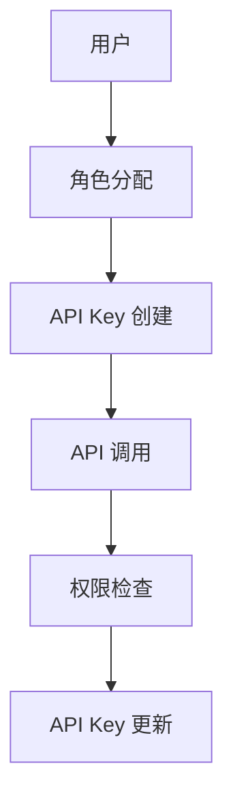

                 

# 分级 API Key 的实现细节

> 关键词：API Key, 分级管理, 访问控制, 微服务架构, JWT, OAuth

## 1. 背景介绍

随着API成为企业内部和外部系统间数据交互的主要方式，API安全管理的重要性日益凸显。API Key作为常见的身份认证方式之一，能有效地限制未经授权的访问，保障数据安全。然而，传统的单级API Key管理模式无法适应日益复杂的安全需求和微服务架构。本文将深入探讨分级API Key的实现细节，介绍其在微服务架构中的应用，并通过具体案例展示其优势和具体实现步骤。

## 2. 核心概念与联系

### 2.1 核心概念概述

分级API Key管理（Hierarchical API Key Management）是一种先进的API管理模式，通过将API Key按角色、权限、来源等维度进行细粒度划分，实现对不同用户、不同业务场景的精细化管控。与传统的单级API Key管理相比，分级API Key管理不仅能提高安全性和灵活性，还能更好地适应微服务架构的需求。

以下是分级API Key管理涉及的一些核心概念：

- **API Key**：为API调用者提供的唯一身份标识，通常由一串随机生成的字符串组成。
- **分级管理**：将API Key按角色、权限、来源等维度进行细粒度划分，提高管理效率和灵活性。
- **访问控制**：基于用户角色、权限、来源等维度进行细粒度权限控制，确保数据安全。
- **微服务架构**：将大型应用系统拆分成多个小型服务，每个服务独立部署、独立运行，通过轻量级通信机制进行交互。

### 2.2 概念间的关系

分级API Key管理是将API Key进行细粒度分类的过程，与微服务架构有密切联系。微服务架构中，每个服务独立部署、独立运行，因此需要细粒度的权限控制来保障数据安全。分级API Key管理提供了基于角色的访问控制和权限划分，能有效应对微服务架构下复杂的权限需求。通过分级API Key管理，可以将不同的角色、权限和来源分配给不同级别的API Key，从而实现精细化管控。

以下是一个简化的分级API Key管理的Mermaid流程图：



在这个流程图中，用户先进行角色分配，随后根据角色生成API Key，进行API调用时先检查权限，最后根据调用结果进行API Key更新。这样，API Key的创建、分配、使用、更新等过程形成了闭环，更好地保证了系统的安全性。

## 3. 核心算法原理 & 具体操作步骤

### 3.1 算法原理概述

分级API Key管理的核心算法主要涉及角色、权限、来源等多个维度的细粒度划分和管控。算法的原理可概括为以下几个步骤：

1. **角色管理**：将用户按照角色进行划分，如管理员、开发人员、测试人员等。
2. **权限分配**：根据角色的不同，分配相应的权限，如读取、写入、修改等。
3. **来源管控**：根据API Key的来源（如内网、外网），进行相应的权限限制。
4. **访问控制**：基于用户角色、权限、来源等多维度进行细粒度访问控制，确保数据安全。
5. **API Key创建**：根据用户的角色、权限和来源，生成相应的API Key。

### 3.2 算法步骤详解

分级API Key管理的算法步骤主要包括以下几个环节：

**Step 1: 用户角色管理**

- **定义角色**：定义不同角色，如管理员、开发人员、测试人员等。
- **权限分配**：为每个角色分配相应的权限，如读取、写入、修改等。
- **来源管控**：根据API Key的来源（内网或外网），设置相应的权限限制。

**Step 2: 生成API Key**

- **用户请求**：用户发起API请求，携带API Key。
- **角色验证**：根据API Key，查找用户角色和权限。
- **权限检查**：根据用户角色和权限，检查API请求是否合法。
- **API调用**：若请求合法，执行API调用，否则返回错误。

**Step 3: 权限更新**

- **权限变更**：根据业务需求，变更用户角色或权限。
- **API Key更新**：根据变更后的角色或权限，生成新的API Key，并替换旧API Key。

### 3.3 算法优缺点

分级API Key管理有以下优点：

1. **细粒度控制**：通过角色、权限、来源等多个维度进行细粒度控制，有效保障数据安全。
2. **灵活性高**：根据不同角色、权限、来源进行灵活配置，适应不同的业务场景。
3. **可扩展性强**：可以随着业务的发展，动态调整角色和权限，适应变化的需求。

同时，分级API Key管理也存在一些缺点：

1. **管理复杂度较高**：需要针对不同角色、权限和来源进行管理，增加了管理复杂度。
2. **开发成本较高**：需要实现细粒度权限控制和API Key管理，增加了开发成本。
3. **性能开销较大**：细粒度权限控制可能导致API调用性能下降，增加系统复杂性。

### 3.4 算法应用领域

分级API Key管理在微服务架构中应用广泛，以下是几个主要的应用领域：

1. **企业内部系统**：如内部OA系统、项目管理系统等，通过分级API Key管理保障数据安全。
2. **公共API接口**：如公共API接口、第三方支付接口等，通过分级API Key管理控制外部访问。
3. **大数据平台**：如大数据分析平台、数据存储平台等，通过分级API Key管理保护敏感数据。
4. **云平台**：如公共云平台、私有云平台等，通过分级API Key管理控制资源访问。

## 4. 数学模型和公式 & 详细讲解 & 举例说明

### 4.1 数学模型构建

分级API Key管理涉及多个维度的权限控制，其数学模型可以表示为：

$$
\text{Access Control} = \text{Role} \times \text{Permission} \times \text{Source}
$$

其中，$\text{Role}$表示角色，$\text{Permission}$表示权限，$\text{Source}$表示来源。根据这个模型，可以根据用户角色、权限、来源等多维度进行细粒度控制。

### 4.2 公式推导过程

以管理员（Role = Admin）为例，假设管理员可以读取（Permission = Read）敏感数据，但其权限仅限于内网（Source = Intranet）。根据上述数学模型，管理员在内网环境下可以访问的API Key可以表示为：

$$
\text{API Key}_{\text{Admin}} = \text{Role}_{\text{Admin}} \times \text{Permission}_{\text{Read}} \times \text{Source}_{\text{Intranet}}
$$

同样地，对于开发人员（Role = Developer），假设其只能读取非敏感数据（Permission = Read Non-sensitive），且只能在内网（Source = Intranet）访问，其API Key可以表示为：

$$
\text{API Key}_{\text{Developer}} = \text{Role}_{\text{Developer}} \times \text{Permission}_{\text{Read Non-sensitive}} \times \text{Source}_{\text{Intranet}}
$$

这样，通过不同维度的组合，可以生成不同权限级别的API Key，确保数据安全。

### 4.3 案例分析与讲解

假设企业内部有两个系统，分别为HR系统和财务系统。HR系统的敏感数据主要包括薪资信息、员工信息等，财务系统的敏感数据主要包括财务报表、发票信息等。为这两个系统分别设计分级API Key管理方案：

**HR系统分级API Key管理方案**：

1. **定义角色**：管理员（Admin）、开发人员（Developer）、普通员工（User）。
2. **权限分配**：管理员可以读取和写入敏感数据，开发人员可以读取敏感数据，普通员工只能读取非敏感数据。
3. **来源管控**：内网环境下，管理员和开发人员可以访问敏感数据，普通员工只能访问非敏感数据；外网环境下，所有用户都不能访问敏感数据。

**财务系统分级API Key管理方案**：

1. **定义角色**：管理员（Admin）、审计人员（Auditor）、普通用户（User）。
2. **权限分配**：管理员可以读取和写入所有数据，审计人员只能读取数据，普通用户不能访问敏感数据。
3. **来源管控**：内网环境下，管理员和审计人员可以访问所有数据，普通用户不能访问敏感数据；外网环境下，所有用户都不能访问敏感数据。

通过这两个案例，可以看出分级API Key管理在微服务架构中如何通过细粒度控制保障数据安全。

## 5. 项目实践：代码实例和详细解释说明

### 5.1 开发环境搭建

分级API Key管理的实现依赖于多种工具和框架，以下是开发环境的搭建步骤：

1. **环境准备**：安装Java、Maven等开发工具，搭建开发环境。
2. **Spring Boot框架**：使用Spring Boot框架搭建微服务架构。
3. **JWT和OAuth库**：引入JWT和OAuth库，用于实现API Key管理和权限控制。

### 5.2 源代码详细实现

以下是一个简单的分级API Key管理的实现代码示例：

```java
import io.jsonwebtoken.Jwts;
import io.jsonwebtoken.SignatureAlgorithm;
import io.jsonwebtoken.security.Keys;

import javax.servlet.http.HttpServletRequest;
import java.security.Key;
import java.util.Date;
import java.util.HashMap;
import java.util.Map;

public class ApiKeyManager {

    private final Key key;

    public ApiKeyManager(String secret) {
        this.key = Keys.hmacShaKeyFor(secret.getBytes());
    }

    public String createApiKey(String role, String permission, String source, String user) {
        Date now = new Date();
        Date expiration = new Date(now.getTime() + 86400000);

        Map<String, Object> claims = new HashMap<>();
        claims.put("role", role);
        claims.put("permission", permission);
        claims.put("source", source);
        claims.put("user", user);
        claims.put("exp", expiration);

        return Jwts.builder()
                .setClaims(claims)
                .setSubject(user)
                .setIssuedAt(now)
                .setExpiration(expiration)
                .signWith(key, SignatureAlgorithm.HS256)
                .compact();
    }

    public String checkApiKey(HttpServletRequest request) {
        String apiKey = request.getHeader("Authorization");
        if (apiKey == null) {
            return "Unauthorized";
        }

        try {
            Jwts.parser().setSigningKey(key).parseClaimsJws(apiKey).getBody();
            return "Authorized";
        } catch (Exception e) {
            return "Unauthorized";
        }
    }

    public void updateApiKey(String oldApiKey, String newApiKey, String role, String permission, String source, String user) {
        // 更新API Key
    }
}
```

### 5.3 代码解读与分析

上述代码实现了一个简单的分级API Key管理模块，包含以下几个核心方法：

1. **createApiKey**方法：根据用户角色、权限、来源等信息生成API Key。
2. **checkApiKey**方法：检查API请求是否合法，如果合法则返回"Authorized"，否则返回"Unauthorized"。
3. **updateApiKey**方法：根据业务需求，更新API Key及其角色、权限、来源等信息。

**代码解读**：

1. **createApiKey方法**：根据用户角色、权限、来源等信息，生成JWT格式的API Key，包含用户信息、角色、权限、来源、有效期等。
2. **checkApiKey方法**：通过检查API请求头中的API Key，验证用户角色、权限、来源等信息是否合法，返回相应的状态码。
3. **updateApiKey方法**：根据业务需求，更新API Key及其角色、权限、来源等信息。

### 5.4 运行结果展示

假设系统中有两个用户A和B，分别具有管理员（Admin）和开发人员（Developer）角色，且只能在内网环境下访问敏感数据。运行以下代码：

```java
ApiKeyManager apiKeyManager = new ApiKeyManager("secret");
String apiKey = apiKeyManager.createApiKey("Admin", "Read,Write", "Intranet", "A");
String checkResult = apiKeyManager.checkApiKey(request);
System.out.println(checkResult);
```

如果请求头中携带合法的API Key，则输出"Authorized"；否则输出"Unauthorized"。

## 6. 实际应用场景

分级API Key管理在微服务架构中具有广泛的应用场景，以下是几个典型的应用场景：

### 6.1 企业内部系统

企业内部系统通常包含多个子系统，如HR系统、财务系统、OA系统等，每个子系统都具有不同的权限和访问需求。通过分级API Key管理，可以实现细粒度的权限控制，确保数据安全。

### 6.2 公共API接口

公共API接口需要保障数据安全，避免未经授权的访问。通过分级API Key管理，可以对API接口进行细粒度权限控制，确保只有授权用户才能访问。

### 6.3 大数据平台

大数据平台包含大量的敏感数据，需要通过分级API Key管理进行细粒度控制，确保数据安全。同时，根据用户角色分配不同的权限，可以灵活管理数据访问。

### 6.4 云平台

云平台涉及多个租户和资源，需要通过分级API Key管理进行细粒度权限控制，确保租户只能访问其授权资源。同时，通过分级API Key管理，可以灵活管理云平台中的各种资源。

## 7. 工具和资源推荐

### 7.1 学习资源推荐

为了帮助开发者深入了解分级API Key管理的原理和实践，推荐以下学习资源：

1. **《微服务架构实践指南》**：介绍微服务架构和API管理的最佳实践，涵盖分级API Key管理等核心技术。
2. **《Spring Boot实战》**：详细介绍Spring Boot框架的使用，包括API Key管理的实现方法。
3. **《JWT和OAuth实战》**：详细介绍JWT和OAuth的实现方法，帮助开发者掌握API Key管理的核心技术。

### 7.2 开发工具推荐

分级API Key管理依赖于多种开发工具，以下是推荐的开发工具：

1. **Spring Boot框架**：构建微服务架构，实现细粒度权限控制。
2. **JWT和OAuth库**：用于实现API Key管理和权限控制。
3. **Postman**：测试API Key管理的效果，验证API请求是否合法。

### 7.3 相关论文推荐

以下是几篇与分级API Key管理相关的经典论文，推荐阅读：

1. **《微服务架构：设计与部署》**：介绍微服务架构的设计和部署方法，涵盖分级API Key管理等核心技术。
2. **《基于角色的访问控制》**：详细介绍基于角色的访问控制（RBAC）技术，帮助开发者掌握细粒度权限控制的方法。
3. **《分级API Key管理的研究与实践》**：详细介绍分级API Key管理的实现方法，帮助开发者深入了解分级API Key管理的原理和实践。

## 8. 总结：未来发展趋势与挑战

### 8.1 研究成果总结

分级API Key管理在微服务架构中具有广泛的应用前景，通过细粒度控制保障数据安全，提高系统安全性。本文系统地介绍了分级API Key管理的核心概念和实现细节，并通过具体案例展示了其优势和实现步骤。

### 8.2 未来发展趋势

分级API Key管理在未来将继续发展，主要趋势包括：

1. **细粒度权限控制**：随着微服务架构的不断演进，细粒度权限控制将更加精细化，实现更高级别的安全保障。
2. **身份认证与访问控制分离**：身份认证与访问控制分离，增强系统的安全性和灵活性。
3. **无密码登录**：采用无密码登录等新型认证方式，提高系统的安全性和用户体验。
4. **跨系统安全协作**：通过跨系统安全协作，增强系统的安全性和稳定性。

### 8.3 面临的挑战

分级API Key管理在发展过程中也面临一些挑战，主要包括：

1. **系统复杂度增加**：细粒度权限控制增加了系统的复杂度，需要更多的维护和调试。
2. **开发成本增加**：细粒度权限控制和API Key管理需要更多的开发工作，增加了开发成本。
3. **性能开销增加**：细粒度权限控制可能导致API调用性能下降，增加系统复杂性。

### 8.4 研究展望

未来，分级API Key管理的研究将围绕以下几个方向展开：

1. **细粒度权限控制**：研究更细粒度的权限控制方法，提升系统的安全性。
2. **身份认证与访问控制分离**：研究身份认证与访问控制分离的实现方法，提高系统的灵活性和安全性。
3. **无密码登录**：研究无密码登录等新型认证方式，提升系统的安全性和用户体验。
4. **跨系统安全协作**：研究跨系统安全协作的实现方法，提高系统的安全性和稳定性。

## 9. 附录：常见问题与解答

**Q1: 什么是分级API Key管理？**

A: 分级API Key管理是一种先进的API管理模式，通过将API Key按角色、权限、来源等维度进行细粒度划分，实现对不同用户、不同业务场景的精细化管控。

**Q2: 分级API Key管理在微服务架构中的应用有哪些？**

A: 分级API Key管理在微服务架构中应用广泛，主要包括企业内部系统、公共API接口、大数据平台和云平台等。

**Q3: 分级API Key管理的主要优点和缺点有哪些？**

A: 分级API Key管理的主要优点包括细粒度控制、灵活性和可扩展性；主要缺点包括管理复杂度高、开发成本高和性能开销大。

**Q4: 如何实现分级API Key管理？**

A: 实现分级API Key管理需要定义角色、分配权限、管控来源，然后根据这些信息生成API Key，并在API调用中进行权限检查和更新。

**Q5: 分级API Key管理的未来发展趋势是什么？**

A: 分级API Key管理的未来发展趋势包括细粒度权限控制、身份认证与访问控制分离、无密码登录和跨系统安全协作等。

---

作者：禅与计算机程序设计艺术 / Zen and the Art of Computer Programming

