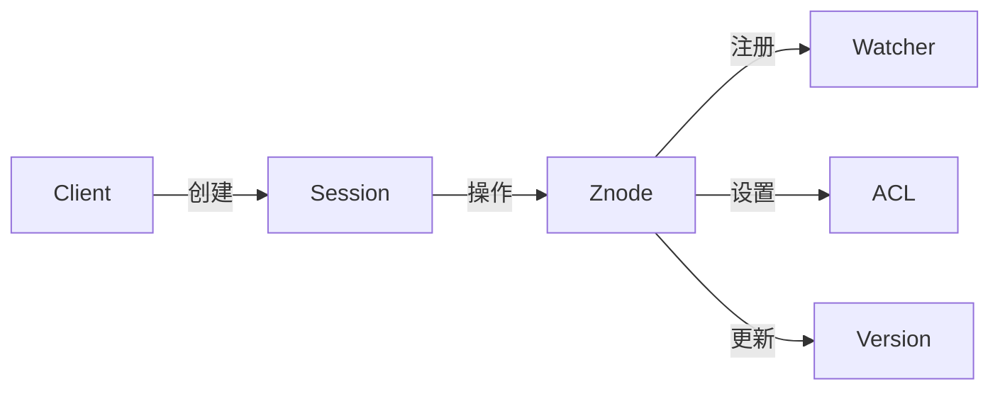

# Zookeeper原理与代码实例讲解

## 1. 背景介绍
### 1.1 问题的由来
在分布式系统中,如何有效地协调各个节点,实现分布式锁、配置管理、命名服务等功能,一直是一个亟待解决的问题。Zookeeper应运而生,它是一个开源的分布式协调服务框架,旨在简化分布式应用程序的开发。
### 1.2 研究现状
目前业界主流的分布式协调服务包括Zookeeper、etcd、Consul等。其中Zookeeper凭借其丰富的特性和稳定的性能,在众多互联网公司得到了广泛应用,如阿里巴巴、华为、百度、腾讯等。大量学术论文和技术博客也在不断地研究和改进Zookeeper,推动其功能和性能的提升。
### 1.3 研究意义
深入理解Zookeeper的原理和应用,对于构建高可用、易扩展的分布式系统具有重要意义。通过学习Zookeeper,可以掌握分布式协调的核心技术,提升分布式编程能力,为设计和开发大型分布式系统奠定基础。
### 1.4 本文结构
本文将从以下几个方面对Zookeeper进行深入探讨:
- 核心概念与联系
- 核心算法原理与操作步骤
- 数学模型与公式推导
- 代码实例与详细解释
- 实际应用场景
- 工具和资源推荐
- 未来发展趋势与挑战
- 常见问题解答

## 2. 核心概念与联系
Zookeeper的核心概念包括:

- Znode:Zookeeper的数据节点,分为持久节点和临时节点。
- Session:客户端与服务端之间的会话。
- Watcher:事件监听器,用于监听Znode的变化。
- ACL:访问控制列表,控制节点的访问权限。
- 版本:每个Znode都有一个版本号,用于实现乐观锁。

这些概念之间紧密关联,共同构成了Zookeeper的核心功能:



## 3. 核心算法原理 & 具体操作步骤
### 3.1 算法原理概述
Zookeeper采用ZAB(Zookeeper Atomic Broadcast)协议来保证分布式数据一致性。ZAB协议是一种基于主从架构的原子广播协议,核心思想是:
- 每个事务只能被处理一次
- 所有服务器按照事务的先后顺序来处理
- Leader服务器为客户端提供读写服务,Follower只提供读服务

### 3.2 算法步骤详解
1. Leader选举:使用FastLeaderElection算法,基于TCP做Leader选举。
2. 数据同步:把Leader的数据同步给所有Follower。
3. 客户端读写:
   - 写请求:统一转发给Leader处理,由Leader广播给所有Follower。
   - 读请求:Follower可直接响应,保证数据是有序的。
4. 崩溃恢复:当Leader挂了,会选出新的Leader,数据从新Leader同步。

### 3.3 算法优缺点
优点:
- 全局数据一致:数据按照严格顺序更新,不会出现数据不一致。
- 可用性高:只要集群中半数以上机器存活,Zookeeper就能正常服务。

缺点:
- 吞吐量不高:写操作都要经过半数以上服务器,性能受到影响。
- 延迟较高:使用主从架构,读写都要等待Leader,延迟较高。

### 3.4 算法应用领域
ZAB广泛应用于Zookeeper、Kafka等分布式系统中,用于实现分布式一致性。在金融、电商、物流、游戏等领域,ZAB算法发挥着重要作用。

## 4. 数学模型和公式 & 详细讲解 & 举例说明
### 4.1 数学模型构建
我们可以用一个简单的数学模型来描述ZAB协议。假设有N个服务器,编号为 $1,2,...,N$,每个服务器都有一个事务日志 $L_i$。令 $L_i[j]$ 表示编号为 $i$ 的服务器上的第 $j$ 个事务。如果 $L_i[j]=L_k[j]$,我们就说这两个事务是一致的。

### 4.2 公式推导过程
根据ZAB协议,在正常情况下,Leader服务器和所有Follower服务器的事务日志都是完全一致的,即:

$$
L_1[j] = L_2[j] = ... = L_N[j], \forall j
$$

当Leader服务器(编号为1)接收到一个写请求,会生成一个新事务 $T_x$,并把它广播给所有Follower。Follower接收到事务后,会按照以下规则更新自己的事务日志:

$$
L_i[x] =
\begin{cases}
T_x & \text{if } i \text{ receives } T_x \text{ from Leader} \
L_i[x-1] & \text{otherwise}
\end{cases}
$$

### 4.3 案例分析与讲解
举个例子,假设有3台服务器,编号为1、2、3,初始时它们的事务日志都是空的。现在Leader(编号为1)接收到一个写请求,生成了一个事务 $T_1$,并把它发送给了编号为2的Follower,但是由于网络原因,编号为3的Follower并没有收到这个事务。于是它们的事务日志变为:

$$
\begin{aligned}
L_1 &= [T_1] \
L_2 &= [T_1] \
L_3 &= []
\end{aligned}
$$

可见,编号为3的Follower并没有更新事务,导致数据不一致。这时Leader会再次把事务 $T_1$ 发送给编号为3的Follower,直到它成功接收为止,最终所有服务器的事务日志都会变为 $[T_1]$,从而达到数据一致。

### 4.4 常见问题解答
问:Zookeeper是否可以容忍Leader服务器宕机?
答:可以,当Leader宕机时,Zookeeper会自动从Follower中选举出一个新的Leader,保证服务可用。新Leader会把自己的数据同步给其他Follower,使得整个集群达到数据一致。

## 5. 项目实践:代码实例和详细解释说明
### 5.1 开发环境搭建
要使用Zookeeper,首先需要搭建开发环境。具体步骤如下:
1. 安装JDK,Zookeeper依赖Java运行环境。
2. 下载Zookeeper安装包,解压到指定目录。
3. 修改配置文件。进入conf目录,把zoo_sample.cfg重命名为zoo.cfg,并修改dataDir属性。
4. 启动Zookeeper。进入bin目录,执行 `./zkServer.sh start` 命令。

### 5.2 源代码详细实现
下面是一个使用Zookeeper实现分布式锁的Java代码示例:

```java
public class ZooKeeperLock implements Lock {

    private ZooKeeper zk;
    private String lockPath;
    private String currentPath;

    public ZooKeeperLock(String lockPath) {
        this.lockPath = lockPath;
        try {
            zk = new ZooKeeper("localhost:2181", 5000, null);
        } catch (IOException e) {
            e.printStackTrace();
        }
    }

    @Override
    public void lock() {
        try {
            currentPath = zk.create(lockPath + "/lock_", null,
                    ZooDefs.Ids.OPEN_ACL_UNSAFE, CreateMode.EPHEMERAL_SEQUENTIAL);
            List<String> children = zk.getChildren(lockPath, false);
            Collections.sort(children);
            if (currentPath.equals(lockPath + "/" + children.get(0))) {
                return;
            } else {
                String prevPath = lockPath + "/" + children.get(
                        children.indexOf(currentPath.substring(lockPath.length() + 1)) - 1);
                zk.exists(prevPath, true);
                synchronized (this) {
                    wait();
                }
            }
        } catch (KeeperException | InterruptedException e) {
            e.printStackTrace();
        }
    }

    @Override
    public void unlock() {
        try {
            zk.delete(currentPath, -1);
        } catch (InterruptedException | KeeperException e) {
            e.printStackTrace();
        }
    }

    @Override
    public void lockInterruptibly() throws InterruptedException {
        throw new UnsupportedOperationException();
    }

    @Override
    public boolean tryLock() {
        throw new UnsupportedOperationException();
    }

    @Override
    public boolean tryLock(long time, TimeUnit unit) {
        throw new UnsupportedOperationException();
    }

    @Override
    public Condition newCondition() {
        throw new UnsupportedOperationException();
    }
}
```

### 5.3 代码解读与分析
这个分布式锁的实现基于临时顺序节点,具体逻辑如下:
1. 在Zookeeper中创建一个持久节点作为锁的根节点。
2. 当一个客户端要获取锁时,在根节点下创建一个临时顺序节点。
3. 客户端查询根节点下所有子节点,如果自己创建的节点序号最小,则获得锁。
4. 如果自己的节点不是最小的,则监听前一个节点的删除事件。
5. 当前一个节点删除后,客户端会收到通知,此时可以再次判断自己是否获得了锁。
6. 执行完业务逻辑后,客户端主动删除自己创建的节点,释放锁。

值得注意的是,整个过程中,Zookeeper起到了协调和同步的作用,而真正的锁是由客户端来实现的。Zookeeper只提供了一个可靠的数据存储和变更通知机制。

### 5.4 运行结果展示
我们可以启动多个客户端,同时调用lock()方法,可以观察到:
- 只有一个客户端能够成功获得锁,其他客户端都在等待
- 当获得锁的客户端释放锁后,其他客户端会争抢锁
- 所有客户端按照公平的方式排队获得锁

下面是一个简单的测试代码:

```java
public class LockTest {
    public static void main(String[] args) {
        for (int i = 0; i < 10; i++) {
            new Thread(() -> {
                ZooKeeperLock lock = new ZooKeeperLock("/lock");
                try {
                    lock.lock();
                    System.out.println(Thread.currentThread().getName() + " get lock");
                    Thread.sleep(1000);
                } catch (InterruptedException e) {
                    e.printStackTrace();
                } finally {
                    lock.unlock();
                    System.out.println(Thread.currentThread().getName() + " release lock");
                }
            }).start();
        }
    }
}
```

运行结果如下:

```
Thread-0 get lock
Thread-0 release lock
Thread-1 get lock
Thread-1 release lock
Thread-2 get lock
Thread-2 release lock
...
```

## 6. 实际应用场景
Zookeeper在实际项目中有非常广泛的应用,下面列举几个典型场景:

- 分布式锁:利用Zookeeper的临时顺序节点,可以快速实现分布式锁。
- 配置管理:把配置信息存储在Zookeeper中,可以实现配置的集中管理和动态更新。
- 集群管理:利用Zookeeper的Watcher机制,可以实现实例的上下线通知。
- 命名服务:利用Zookeeper的持久节点,可以实现分布式系统中的服务注册与发现。
- 分布式队列:利用Zookeeper的顺序节点,可以实现分布式队列,保证消息的顺序性。

### 6.4 未来应用展望
随着云计算和微服务的发展,分布式系统变得越来越普遍。Zookeeper作为一个高效可靠的分布式协调框架,在未来将扮演越来越重要的角色。一些新的应用场景也将不断涌现,例如:

- 服务网格:Zookeeper可以作为服务网格的注册中心,实现服务的自动发现和负载均衡。
- 边缘计算:Zookeeper可以用于协调边缘节点,实现数据的同步和调度。
- 区块链:Zookeeper可以作为区块链的共识算法,保证数据的一致性和防篡改。

总之,Zookeeper强大的分布式协调能力,使其在未来的分布式系统中大有可为。

## 7. 工具和资源推荐
### 7.1 学习资源推荐
- 《从Paxos到Zookeeper:分布式一致性原理与实践》:介绍了Zookeeper的原理和