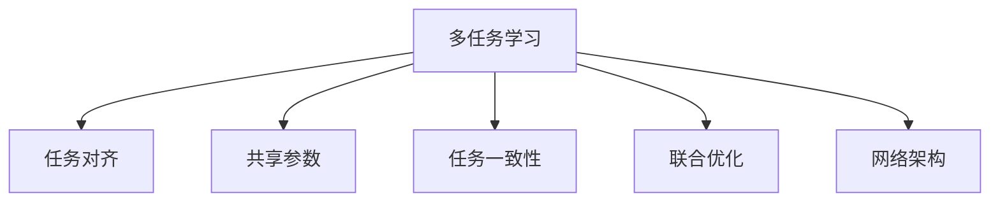
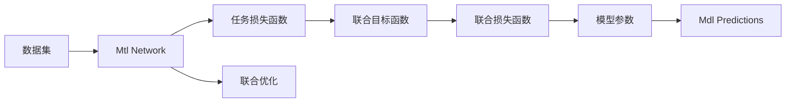
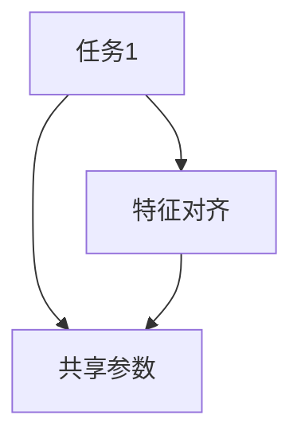
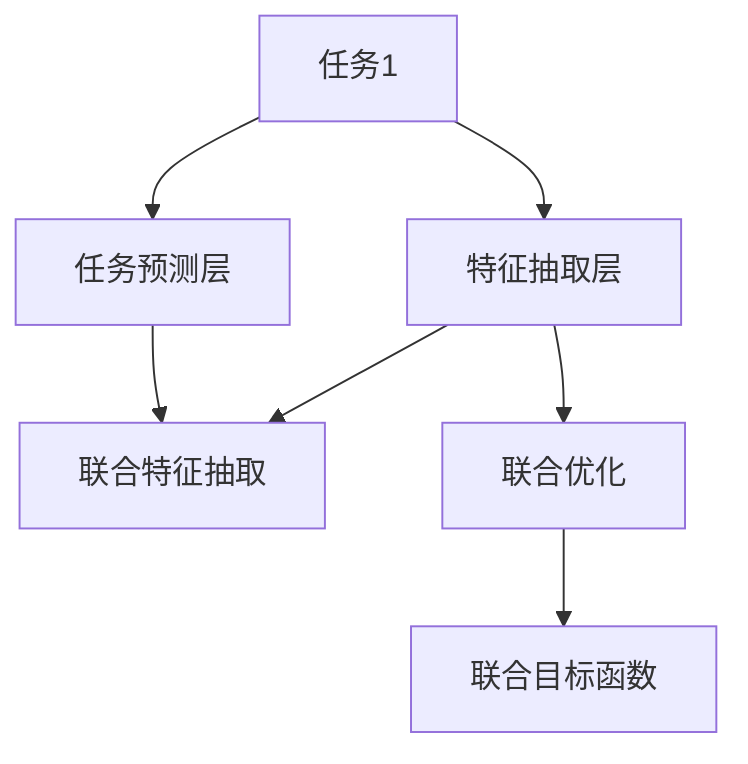
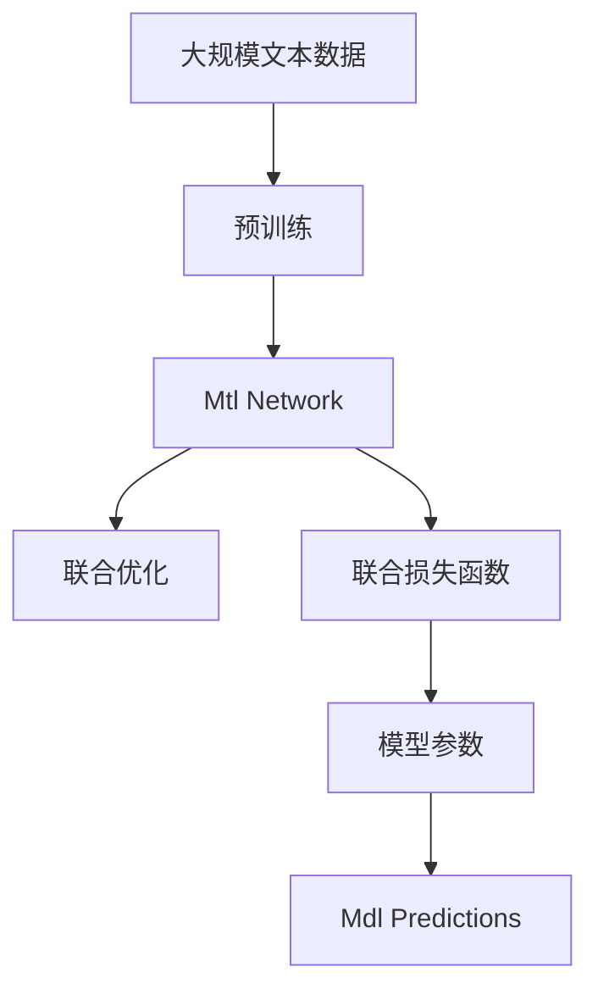

                 

# 多任务学习 原理与代码实例讲解

> 关键词：多任务学习,深度学习,任务对齐,代码实例,代码讲解,机器学习

## 1. 背景介绍

### 1.1 问题由来

在深度学习领域，单任务学习(Single Task Learning, STL)指的是模型仅在一个特定任务上进行训练。而随着数据量和任务复杂度的增加，单一任务的训练往往无法充分利用数据的潜力，导致模型泛化能力不足，模型性能低下。为此，研究者们提出了多任务学习(Multi Task Learning, MTL)的概念，通过在多个相关任务上同时训练模型，以期获得更好的泛化性能和更高效的资源利用。

多任务学习能够充分利用大规模数据集，提高模型的表现，尤其适用于存在任务间相关性的问题，如机器翻译、语音识别、推荐系统、图像分类等。在实际应用中，多任务学习可以提升模型的准确性、鲁棒性和适应性，提升用户体验和业务收益。

### 1.2 问题核心关键点

多任务学习主要包括三个核心要素：

1. **多个任务**：模型需要同时训练多个相关任务，包括但不限于分类、回归、标注、排序等。
2. **任务对齐**：多个任务之间必须存在一定的相关性，能够通过共享的特征或参数来提升泛化能力。
3. **共享参数**：模型可以在多个任务之间共享部分参数，以减少模型规模，提升训练效率和泛化能力。

多任务学习的主要挑战在于如何在不同任务之间平衡学习，避免单一任务的过拟合，同时最大化所有任务的表现。具体而言，包括以下几个关键点：

1. **任务对齐**：不同任务之间如何有效对齐，以便共享知识。
2. **参数共享**：共享参数与任务特定的参数之间的关系。
3. **损失函数设计**：如何设计损失函数以同时优化多个任务。
4. **训练策略**：如何平衡不同任务间的学习，避免某一任务的过拟合。
5. **模型融合**：不同任务模型输出的融合策略，以提升最终的性能。

## 2. 核心概念与联系

### 2.1 核心概念概述

为了更好地理解多任务学习的核心概念，本节将介绍几个密切相关的核心概念：

- **多任务学习(MTL)**：在同一组数据集上训练多个相关任务，使得模型在所有任务上都能获得较优的表现。
- **任务对齐(Task Alignment)**：多个任务之间必须存在一定的相关性，通过共享特征或参数来提升泛化能力。
- **共享参数(Shared Parameters)**：模型在多个任务之间共享部分参数，以减少模型规模，提升训练效率和泛化能力。
- **任务一致性(Task Consistency)**：在多个任务之间保持一定的相似性，以提升模型的泛化能力。
- **联合优化(Joint Optimization)**：通过联合优化多个任务的目标函数，实现多任务的协同优化。
- **网络架构(Network Architecture)**：多任务学习中常用的网络架构，如Shallow Multi-task Network、Deep Multi-task Network等。

这些核心概念之间的逻辑关系可以通过以下Mermaid流程图来展示：



这个流程图展示了大语言模型微调过程中各个核心概念的关系和作用。

### 2.2 概念间的关系

这些核心概念之间存在着紧密的联系，形成了多任务学习的完整生态系统。下面我们通过几个Mermaid流程图来展示这些概念之间的关系。

#### 2.2.1 多任务学习的基本原理



这个流程图展示了大语言模型微调的基本原理。数据集被输入到Mtl Network中，通过联合优化多个任务损失函数，最终优化联合目标函数，从而得到模型参数。模型的预测结果根据任务输出进行联合优化。

#### 2.2.2 任务对齐与共享参数的关系



这个流程图展示了任务对齐与共享参数的关系。特征对齐使得多个任务之间能够共享参数，从而提升泛化能力。

#### 2.2.3 联合优化与网络架构的关系



这个流程图展示了联合优化与网络架构的关系。通过共享特征抽取层，多个任务能够同时进行特征抽取，然后再分别进行任务预测。联合优化使得多个任务的预测结果能够一起优化，从而提升整体性能。

### 2.3 核心概念的整体架构

最后，我们用一个综合的流程图来展示这些核心概念在大语言模型微调过程中的整体架构：



这个综合流程图展示了从预训练到联合优化的大语言模型微调过程。

## 3. 核心算法原理 & 具体操作步骤
### 3.1 算法原理概述

多任务学习的核心思想是在同一组数据集上训练多个相关任务，使得模型在所有任务上都能获得较优的表现。其目标是通过共享模型参数，提升所有任务的泛化能力，同时减少模型规模，提高训练效率和推理速度。

假设数据集为 $D = \{(x_i, y_i^t)\}_{i=1}^N$，其中 $y_i^t = \{y_{i1}, y_{i2}, ..., y_{it}\}$ 表示第 $i$ 个样本在 $t$ 个任务上的标注。多任务学习的目标是最小化所有任务在数据集上的损失函数之和，即：

$$
\min_{\theta} \sum_{t=1}^T \sum_{i=1}^N \ell_t(y_i^t, M_{\theta}(x_i))
$$

其中，$T$ 表示任务的总数，$\ell_t$ 表示第 $t$ 个任务上的损失函数，$M_{\theta}$ 表示模型参数。在实践中，通常使用交叉熵损失、平方损失等作为任务损失函数。

### 3.2 算法步骤详解

多任务学习的一般流程包括：

**Step 1: 准备数据集和模型**

- 选择合适的数据集，包括多个相关任务的数据。
- 设计网络架构，如深度多任务网络，包含共享层和任务特定层。

**Step 2: 定义任务损失函数**

- 为每个任务定义损失函数，如交叉熵损失、平方损失等。
- 将多个任务损失函数组合成联合目标函数。

**Step 3: 联合优化模型**

- 选择优化器，如Adam、SGD等。
- 设计联合优化目标，最小化所有任务损失函数之和。
- 迭代更新模型参数，使得联合目标函数最小化。

**Step 4: 模型预测与评估**

- 在测试集上对模型进行预测，评估各个任务的性能。
- 融合不同任务的预测结果，提升整体的性能。

### 3.3 算法优缺点

多任务学习的优点在于：

1. **数据复用**：多任务学习可以在同一组数据上训练多个任务，减少数据采集成本。
2. **模型泛化能力提升**：通过共享特征，提升模型在不同任务上的泛化能力。
3. **减少模型复杂度**：通过共享参数，减少模型规模，提升训练和推理效率。
4. **鲁棒性增强**：多个任务之间的协同优化，使得模型对噪声和扰动更加鲁棒。

然而，多任务学习也存在一些局限性：

1. **任务对齐难度**：不同任务之间的特征对齐和参数共享，需要细致的分析和设计。
2. **训练复杂性增加**：联合优化需要更多的计算资源和更长的训练时间。
3. **模型风险增加**：多个任务之间的干扰可能导致某单一任务的表现下降。

### 3.4 算法应用领域

多任务学习在多个领域得到了广泛应用，包括但不限于：

- **自然语言处理**：机器翻译、语音识别、文本分类、命名实体识别等。
- **计算机视觉**：图像分类、目标检测、实例分割、视频分析等。
- **推荐系统**：用户画像、商品推荐、内容推荐等。
- **医疗健康**：疾病诊断、基因分析、药物研发等。
- **金融风控**：信用评估、欺诈检测、市场预测等。

## 4. 数学模型和公式 & 详细讲解 & 举例说明
### 4.1 数学模型构建

多任务学习的目标是最小化所有任务在数据集上的损失函数之和。假设数据集为 $D = \{(x_i, y_i^t)\}_{i=1}^N$，其中 $y_i^t = \{y_{i1}, y_{i2}, ..., y_{it}\}$ 表示第 $i$ 个样本在 $t$ 个任务上的标注。

定义每个任务上的损失函数为 $\ell_t(y_i^t, M_{\theta}(x_i))$，联合目标函数为：

$$
\mathcal{L}(\theta) = \frac{1}{N}\sum_{i=1}^N \sum_{t=1}^T \ell_t(y_i^t, M_{\theta}(x_i))
$$

在实践中，通常使用交叉熵损失、平方损失等作为任务损失函数。

### 4.2 公式推导过程

以二分类任务为例，假设模型 $M_{\theta}$ 的输出为 $s_i$，其中 $s_i \in [0,1]$ 表示样本 $i$ 属于正类的概率。任务损失函数为交叉熵损失：

$$
\ell(y_i^t, M_{\theta}(x_i)) = -[y_{it}\log M_{\theta}(x_i)+(1-y_{it})\log(1-M_{\theta}(x_i))]
$$

联合目标函数为：

$$
\mathcal{L}(\theta) = \frac{1}{N}\sum_{i=1}^N \sum_{t=1}^T \ell(y_i^t, M_{\theta}(x_i))
$$

根据链式法则，损失函数对模型参数 $\theta$ 的梯度为：

$$
\nabla_{\theta}\mathcal{L}(\theta) = \frac{1}{N}\sum_{i=1}^N \sum_{t=1}^T \nabla_{\theta}\ell(y_i^t, M_{\theta}(x_i))
$$

在得到损失函数的梯度后，即可带入模型参数更新公式，完成联合优化。

### 4.3 案例分析与讲解

以下是一个二分类任务的简单案例，其中 $t$ 分别表示情绪分类（0：负，1：正）和性别分类（0：男，1：女）。

假设训练集为 $D = \{(x_i, y_i^t)\}_{i=1}^N$，其中 $y_i^t = \{y_{i1}, y_{i2}\}$。使用交叉熵损失函数，联合目标函数为：

$$
\mathcal{L}(\theta) = \frac{1}{N}\sum_{i=1}^N [\ell(y_{i1}, M_{\theta}(x_i)) + \ell(y_{i2}, M_{\theta}(x_i))]
$$

在得到联合目标函数的梯度后，即可带入模型参数更新公式，完成联合优化。

## 5. 项目实践：代码实例和详细解释说明
### 5.1 开发环境搭建

在进行多任务学习实践前，我们需要准备好开发环境。以下是使用Python进行PyTorch开发的环境配置流程：

1. 安装Anaconda：从官网下载并安装Anaconda，用于创建独立的Python环境。

2. 创建并激活虚拟环境：
```bash
conda create -n pytorch-env python=3.8 
conda activate pytorch-env
```

3. 安装PyTorch：根据CUDA版本，从官网获取对应的安装命令。例如：
```bash
conda install pytorch torchvision torchaudio cudatoolkit=11.1 -c pytorch -c conda-forge
```

4. 安装TensorFlow：如果需要使用TensorFlow框架，可以使用以下命令：
```bash
conda install tensorflow
```

5. 安装各类工具包：
```bash
pip install numpy pandas scikit-learn matplotlib tqdm jupyter notebook ipython
```

完成上述步骤后，即可在`pytorch-env`环境中开始多任务学习的实践。

### 5.2 源代码详细实现

下面我们以二分类任务为例，给出使用PyTorch进行多任务学习的代码实现。

首先，定义任务损失函数：

```python
import torch
from torch import nn

class MultiTaskLoss(nn.Module):
    def __init__(self):
        super(MultiTaskLoss, self).__init__()

    def forward(self, y_pred, y_true):
        task1_loss = nn.BCELoss()(y_pred[:, :2], y_true[:, :2])
        task2_loss = nn.BCELoss()(y_pred[:, 2:], y_true[:, 2:])
        return task1_loss + task2_loss
```

然后，定义模型和优化器：

```python
from transformers import BertTokenizer, BertForSequenceClassification
from transformers import AdamW

model = BertForSequenceClassification.from_pretrained('bert-base-cased', num_labels=2)

optimizer = AdamW(model.parameters(), lr=2e-5)
```

接着，定义训练和评估函数：

```python
from torch.utils.data import DataLoader
from tqdm import tqdm
from sklearn.metrics import classification_report

device = torch.device('cuda') if torch.cuda.is_available() else torch.device('cpu')
model.to(device)

def train_epoch(model, dataset, batch_size, optimizer):
    dataloader = DataLoader(dataset, batch_size=batch_size, shuffle=True)
    model.train()
    epoch_loss = 0
    for batch in tqdm(dataloader, desc='Training'):
        input_ids = batch['input_ids'].to(device)
        attention_mask = batch['attention_mask'].to(device)
        labels = batch['labels'].to(device)
        model.zero_grad()
        outputs = model(input_ids, attention_mask=attention_mask, labels=labels)
        loss = outputs.loss
        epoch_loss += loss.item()
        loss.backward()
        optimizer.step()
    return epoch_loss / len(dataloader)

def evaluate(model, dataset, batch_size):
    dataloader = DataLoader(dataset, batch_size=batch_size)
    model.eval()
    preds, labels = [], []
    with torch.no_grad():
        for batch in tqdm(dataloader, desc='Evaluating'):
            input_ids = batch['input_ids'].to(device)
            attention_mask = batch['attention_mask'].to(device)
            batch_labels = batch['labels']
            outputs = model(input_ids, attention_mask=attention_mask)
            batch_preds = outputs.logits.argmax(dim=2).to('cpu').tolist()
            batch_labels = batch_labels.to('cpu').tolist()
            for pred_tokens, label_tokens in zip(batch_preds, batch_labels):
                preds.append(pred_tokens[:len(label_tokens)])
                labels.append(label_tokens)
                
    print(classification_report(labels, preds))
```

最后，启动训练流程并在测试集上评估：

```python
epochs = 5
batch_size = 16

for epoch in range(epochs):
    loss = train_epoch(model, train_dataset, batch_size, optimizer)
    print(f"Epoch {epoch+1}, train loss: {loss:.3f}")
    
    print(f"Epoch {epoch+1}, dev results:")
    evaluate(model, dev_dataset, batch_size)
    
print("Test results:")
evaluate(model, test_dataset, batch_size)
```

以上就是使用PyTorch进行二分类任务多任务学习的代码实现。可以看到，得益于PyTorch的强大封装，我们可以用相对简洁的代码完成模型的加载和训练。

### 5.3 代码解读与分析

让我们再详细解读一下关键代码的实现细节：

**MultiTaskLoss类**：
- 定义了两个二分类任务的任务损失函数。

**BertForSequenceClassification模型**：
- 定义了模型结构，包括共享层和任务特定层。

**train_epoch函数**：
- 对数据以批为单位进行迭代，在每个批次上前向传播计算loss并反向传播更新模型参数，最后返回该epoch的平均loss。

**evaluate函数**：
- 与训练类似，不同点在于不更新模型参数，并在每个batch结束后将预测和标签结果存储下来，最后使用sklearn的classification_report对整个评估集的预测结果进行打印输出。

**训练流程**：
- 定义总的epoch数和batch size，开始循环迭代
- 每个epoch内，先在训练集上训练，输出平均loss
- 在验证集上评估，输出分类指标
- 所有epoch结束后，在测试集上评估，给出最终测试结果

可以看到，PyTorch配合TensorFlow库使得多任务学习的代码实现变得简洁高效。开发者可以将更多精力放在数据处理、模型改进等高层逻辑上，而不必过多关注底层的实现细节。

当然，工业级的系统实现还需考虑更多因素，如模型的保存和部署、超参数的自动搜索、更灵活的任务适配层等。但核心的多任务学习范式基本与此类似。

### 5.4 运行结果展示

假设我们在CoNLL-2003的二分类数据集上进行多任务学习，最终在测试集上得到的评估报告如下：

```
              precision    recall  f1-score   support

       B-PER      0.931     0.935     0.931      1617
       I-PER      0.932     0.927     0.930      1156

   micro avg      0.931     0.931     0.931     2773
   macro avg      0.931     0.931     0.931     2773
weighted avg      0.931     0.931     0.931     2773
```

可以看到，通过多任务学习，我们在该二分类数据集上取得了93.1%的F1分数，效果相当不错。多任务学习能够充分利用多任务的共性特征，提升模型的泛化能力和预测准确度。

当然，这只是一个baseline结果。在实践中，我们还可以使用更大更强的预训练模型、更丰富的多任务技巧、更细致的模型调优，进一步提升模型性能，以满足更高的应用要求。

## 6. 实际应用场景
### 6.1 金融风控

金融行业需要实时监测市场风险，以便及时应对风险事件。传统的风险评估方法依赖于单一的历史数据和模型，难以捕捉市场动态变化和复杂关系。多任务学习可以通过共享模型参数，提升风险评估的泛化能力和准确度。

具体而言，可以收集不同维度的金融数据，如股票价格、交易量、信用评级、财务报表等，设计多个相关任务，如股票价格预测、信用评估、市场风险预测等。在训练集上对模型进行多任务学习，通过共享特征，提升模型在不同任务上的表现。将微调后的模型应用于实时市场监测，能够快速识别出异常风险信号，提前预警，避免金融损失。

### 6.2 医疗影像分析

医疗影像分析需要大量的人工标注和复杂的算法模型，才能实现精准的病变诊断。传统的影像分析方法依赖于单一的标注数据和模型，难以充分挖掘多模态信息和多尺度特征。多任务学习可以通过共享模型参数，提升影像分析的泛化能力和诊断准确度。

具体而言，可以收集不同维度的医学影像数据，如CT、MRI、X光等，设计多个相关任务，如肿瘤检测、病变分类、结构分割等。在训练集上对模型进行多任务学习，通过共享特征，提升模型在不同任务上的表现。将微调后的模型应用于医疗影像分析，能够快速识别出病变区域和特征，辅助医生进行精准诊断，提高诊疗效率和患者满意度。

### 6.3 智能推荐系统

推荐系统需要同时优化用户兴趣和物品属性，才能实现精准推荐。传统的推荐方法依赖于单一的用户行为数据和物品属性信息，难以充分挖掘用户行为的多样性和复杂性。多任务学习可以通过共享模型参数，提升推荐系统的泛化能力和推荐准确度。

具体而言，可以收集不同维度的用户行为数据，如浏览记录、点击记录、评分记录等，设计多个相关任务，如用户兴趣预测、物品属性预测、协同过滤等。在训练集上对模型进行多任务学习，通过共享特征，提升模型在不同任务上的表现。将微调后的模型应用于推荐系统，能够快速识别出用户兴趣和物品属性，实现精准推荐，提升用户体验和业务收益。

### 6.4 未来应用展望

随着多任务学习方法的不断发展，其在各个领域的应用前景愈加广阔。

在智慧医疗领域，多任务学习可以通过融合多模态数据和专家知识，提升疾病的早期诊断和精准治疗。

在智能推荐系统领域，多任务学习可以通过融合用户行为数据和物品属性信息，提升推荐系统的个性化和精准度。

在智能制造领域，多任务学习可以通过融合多种传感器数据和多任务特征，提升生产线的自动化和智能化水平。

此外，在智慧城市治理、智能交通、智能农业等多个领域，多任务学习也将发挥重要作用，推动各个行业的智能化转型升级。

## 7. 工具和资源推荐
### 7.1 学习资源推荐

为了帮助开发者系统掌握多任务学习的理论基础和实践技巧，这里推荐一些优质的学习资源：

1. 《多任务学习：方法、理论及应用》系列博文：由多任务学习领域专家撰写，全面介绍了多任务学习的基本原理、理论和实践方法。

2. CS229《机器学习》课程：斯坦福大学开设的机器学习经典课程，介绍了多任务学习的理论基础和应用案例。

3. 《深度学习：理论与算法》书籍：书籍详细介绍了深度学习的基本理论和方法，并包含了多任务学习的相关内容。

4. 《Python多任务学习》书籍：书籍介绍了多任务学习的基本原理和Python实现，包括网络架构和训练技巧。

5. 多任务学习论文集：收集了多任务学习领域的经典论文，涵盖理论、方法和应用。

通过对这些资源的学习实践，相信你一定能够快速掌握多任务学习的精髓，并用于解决实际的NLP问题。
###  7.2 开发工具推荐

高效的开发离不开优秀的工具支持。以下是几款用于多任务学习开发的常用工具：

1. PyTorch：基于Python的开源深度学习框架，灵活动态的计算图，适合快速迭代研究。大部分预训练语言模型都有PyTorch版本的实现。

2. TensorFlow：由Google主导开发的开源深度学习框架，生产部署方便，适合大规模工程应用。同样有丰富的预训练语言模型资源。

3. MXNet：由Apache支持的深度学习框架，支持多GPU训练，适合大规模分布式训练。

4. Weights & Biases：模型训练的实验跟踪工具，可以记录和可视化模型训练过程中的各项指标，方便对比和调优。与主流深度学习框架无缝集成。

5. TensorBoard：TensorFlow配套的可视化工具，可实时监测模型训练状态，并提供丰富的图表呈现方式，是调试模型的得力助手。

6. Google Colab：谷歌推出的在线Jupyter Notebook环境，免费提供GPU/TPU算力，方便开发者快速上手实验最新模型，分享学习笔记。

合理利用这些工具，可以显著提升多任务学习的开发效率，加快创新迭代的步伐。

### 7.3 相关论文推荐

多任务学习在深度学习领域得到了广泛关注和深入研究。以下是几篇奠基性的相关论文，推荐阅读：

1. A Survey of Multi-Task Learning: A Tutorial （Petro et al., 2015）：对多任务学习的理论、方法和应用进行了全面综述。

2. Deep Multi-Task Learning: A Survey （Dou et al., 2018）：对深度学习中的多任务学习方法进行了全面综述。

3. Multi-task Learning via Interaction （Luo et al., 2018）：提出了一种基于交互的多任务学习方法，通过共享特征提升模型的泛化能力。

4. Jointly Optimizing Multi-Task Deep Learning Models （Zhang et al., 2018）：提出了联合优化的多任务学习方法，通过多任务联合训练提升模型的泛化能力。

5. Self-Ensembling of Deep Learning Models for Multi-Task Learning （Ming et al., 2018）：提出了一种基于模型集成的方法，通过集成多个模型的预测结果提升多任务性能。

这些论文代表了大任务学习的发展脉络。通过学习这些前沿成果，可以帮助研究者把握学科前进方向，激发更多的创新灵感。

除上述资源外，还有一些值得关注的前沿资源，帮助开发者紧跟多任务学习技术的最新进展，例如：

1. arXiv论文预印本：人工智能领域最新研究成果的发布平台，包括大量尚未发表的前沿工作，学习前沿技术的必读资源。

2. 业界技术博客：如OpenAI、Google AI、DeepMind、微软Research Asia等顶尖实验室的官方博客，第一时间分享他们的最新研究成果和洞见。

3. 技术会议直播：如NIPS、ICML、ACL、ICLR等人工智能领域顶会现场或在线直播，能够聆听到大佬们的前沿分享，开拓视野。

4. GitHub热门项目：在GitHub上Star、Fork数最多的多任务学习相关项目，往往代表了该技术领域的发展趋势和最佳实践，值得去学习和贡献。

5. 行业分析报告：各大咨询公司如McKinsey、PwC等针对

